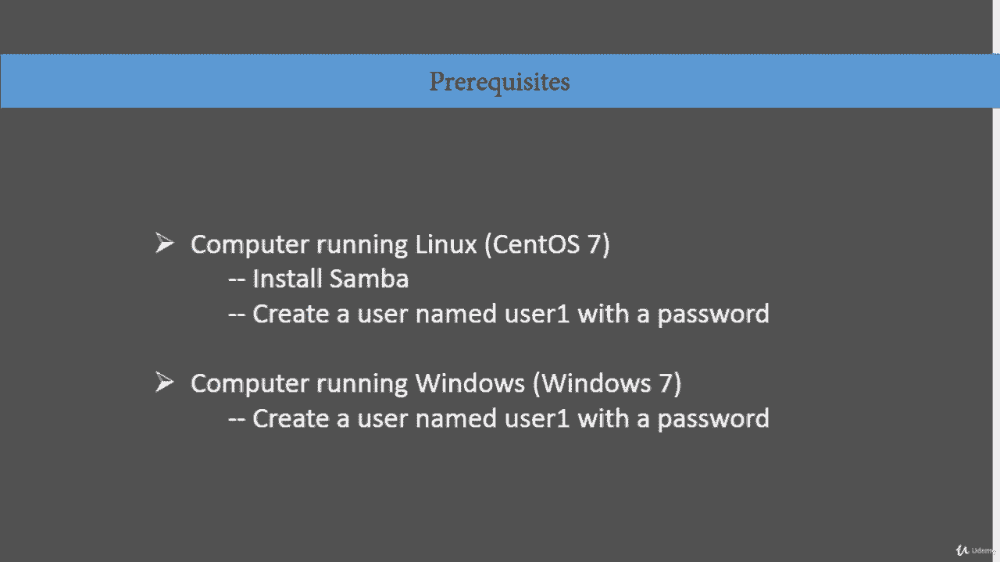
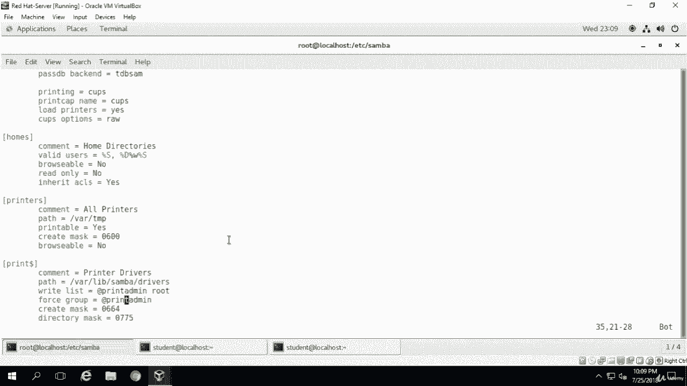

# [FreeCourseSite.com] Udemy - Red Hat Certified Engineer (RHCE) - 2018 - P35：8. Samba File sharing---2. Configuration part 1 - 我吃印度飞饼 - BV1jJ411S76a

Okay students， so now we are in two actual configuration part。

There are only three steps to configure the。To configure the SAmba server so it can start sharing。

You have to modify the atsambasamba。com， which we talked about in the previous section also。

Then we're going to restart the process called SMB。And then we're going to create SMB users。

 So these are the only three steps that we need to do。

There are some prerequisites that you got to have in order to make this work。

If you are using a virtual environment like I'm doing。

 say in virtual box or VMware workstation or something similar。

Then you can create a virtual machine with computer running Linux。 in my case， Sentos 7。

 you can have Uuntu or some other flavor of Linux。You have to install samba on it if it's not already there and chances are by default is probably not there。

Then we're going to create a user in my case， I'm going to call them user one and I'm going to assign them a password。

 something very simple。And then you' got to have a second virtual machine that is going to be controlled by this。

Samba server， and that's going to be a Windows machine。I'm going to use Windows 7。

 but if you have a lower version or higher version Windows 8 or say an Xp， that's fine。

 we are just testing it， we are not testing Windows features here。

 we are just testing to make sure that our samba share does work for this Windows server again。

 we're going to create our user called user1 and is going to have a password as well。

Okay， so I'm logged into my Sos machine right now， and the first step is yum。Yum， install samba。

 In my case， it's already installed。 So it's going to look for it。 And then it's going to say， well。

 it's already present。And in your case， it may or may not be the same thing。

And if I have a later version， maybe that'll get installed， but。So far。

 I think I do have some installed in this machine。Okay， so it is installed。

I'm going to clear this so I can get on top of the screen。And the directory， as I mentioned before。

 is slash ETC slash sum is our directory。Now let's do an LS。

And the file that we're gonna to be concerned with right here is O， sorry， not this one。

 This is gonna be the file that we're gonna edit。 And any time you edit a file。

 always a good idea to make a copy of it， especially if you are dealing with a production server。

 You definitely don't want Ru original file。 So what I'm going to do is I'm going to copy saba S B dot com to S M B dot com。

Dat old。And as you can see now， we have a dot all file。

 and that's the one that we're not going to touch。We will just work on SMB。com。Okay。

 now we're going go ahead and use。them V I am。And SMV。tcomm。And we'll look at the。

Global setting first and what work group by default， say Samba。 supposeupp I want to change it。

 want to call it。Linux。Give。Okay。And。The rest I'm going to leave as it is。Home directory。

I'm going to leave as it is as well。Browsable， is it gonna be browsable or not。

 I don't want it to be browsable。And printers。 all the right now， we have all printers set up。

 but this is where you actually assign the printer name。It are names。If you have more than one。

 you can just comba separate it and you put in all the printers。Printer drivers。

This is where going be you're going to have the path to your printer driver。

