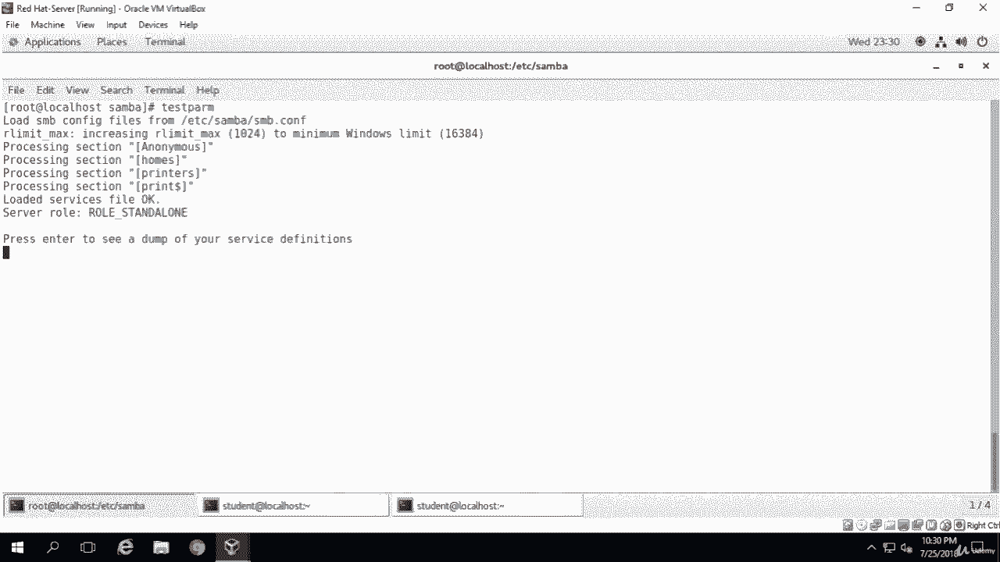

# [FreeCourseSite.com] Udemy - Red Hat Certified Engineer (RHCE) - 2018 - P36：8. Samba File sharing---3. Configuration part 2 - 我吃印度飞饼 - BV1jJ411S76a

So all Smba is installed on this machine， but I want to go ahead and install Smba client and Smba Common also these are two files。

And let's see if they're here as well。 And I'm going to run the whole command。Yum install samba。三bar。

😔，Client。三吧。Common。Okay， so Sammba clientient is not installing this machine。

 so I'm going to say yes to that。The lettertst it。And we are done。Let me clear it。Okay。

 just like anything else on Sanos 7。Once we install a service， we have to enable it。

And so after installing the SAmba package， you have to enable SAMba services to be allowed through system firewall。

With these commands。 So we're gonna to use firewall。打 cmd。Dash， dash， permanent。Dash， dash。Zone。

Equals。Public。Dash， dash， add。Dash service。Equals samba。Okay， that was successful。Okay。

 now we're going to configure some anonymous file sharing。 And order to do that。

 we have to create the directory first。 So M K du。Dash P。S， R， S RV。Sumber。Anonymous。

And then we have to change the permission on that C mod。Dash R。And we'll change it to 0，7，75。Slash。S。

 RV， s samba。Slash， anonymous。Then we're going to change ownership。Dash R。Nobody。Kolin。😔，Nobody。

Slash S R。Vi。Sbar。Slash。Anonymous。Okay， you need to change the Se Linux security context for the Samba Sha directory and the way we do that is CH CON。

Dash tea。Samba。Under underscore share。Undersco T。S， RV。Samba。An。Next。

 we can open the Sbar configuration file for editing where we can to modify or add the sections。

With the corresponding directives。Here let's edit the file。一 see。Some， but actually。

 we are in that directory。 So if I do a。Vim。Of。S and B。Dot com。And the global。

We're going change the word group to let's just call it word group。Okay， were group next。

 we're going to create a line in there。Use O。Call it Nebiio's name。Net bias。Ning。Equals 2。Sentoss。

Security user will just leave it at that。 Then we're going to change create a new directive。

 and we're going call it anonymous。And。putut it in parentheses。Anonymous。And。

Lets create a line in here says comment。Equals。Anonymous。File。Server。Shir。And。

Then we're going to give it a pat。Which is going to be equal。Equal to。S RB。Samba。I know animals must。

Okay， I want to make sure that I make it browsable。And we'll say， yes， there。Wriable。

And we're going to say yes for that as well。Guessed， O， Let's see。Fui。Gest。Okay。Equals yes。Read only。

We're going to say no to that。And force user equals nobody。Fourth。User。Equals。Nobody。Okay。

And then we're going to delete some of these。Here。😔，You like the comment。

 the section of this one right here。And。This one here。We are dealing with printers， in our example。

Okay。And we're going to leave the rest as it is。And I'm going to save it and exit。Okay。

 so after we have saved the file we have exited， then we're going to run this command called Te。Parm。

 which is text。The testing parameter。 That's what you're doing。And as you can see。

 everything is tested out fine， says loaded services file okay。

S our role is role underscore standalone。 And that's what we wanted to see。

