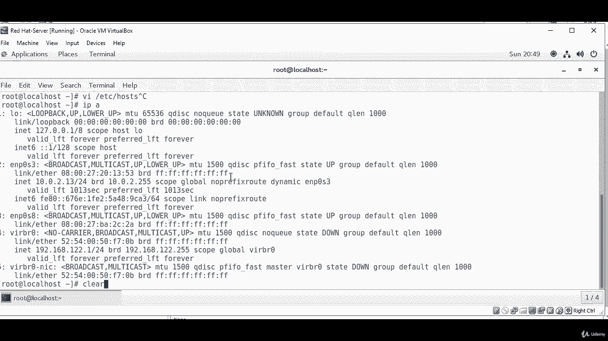

# [FreeCourseSite.com] Udemy - Red Hat Certified Engineer (RHCE) - 2018 - P37：9. Email server--1. Installing Postfix and Dovecot - 我吃印度飞饼 - BV1jJ411S76a

Hello students and welcome in this lecture we are going to talk about。

Installing and configuring email on a Sentos 7 server。So for the post fix。

 we're going to be using post fix for SMTP traffic。

And it'll be going to install Duff co for the pop or imMap。

We're going to also install Doco SASL for SMTP authorization。In the steps。

 we going first installed the packages。Then we to configure post fix。

Then we're going to configure Dvecot， and at the end， we're going to create a user。

 So let's log into our server。

Okay， so I'm currently loggged into our Linux machine， this is Sanos 7。R redhead some machine。

First thing I'm going to do is I'm going to become a super user on this。

Because most of the installation is going to require me to do that。

And I'm going to change the host name because right now it doesn't have a host name。Wst name， C， T。

 L， set。Ho's name。Mail dot。Linux。Gig dot com。Okay， that's gonna be my mail server name。

 Then I'm going to add。An entry in the Etsyhot file。And when you're doing that。

 make sure you have a static IP address that you add in here。 I am since this is a test machine。

 I'm just going to add what I have on this machine。 Let's see what our have。Is。

And the IP address that I'm going to use is 10。0。Dt2。13， which is right here。Okay。

 this is the IP address that gives me connection to the internet， so I'm going to be using that。

Ki。So it's going to be 10 do 02。13。And whose name is。没o。Dog。Linux gig dot com。Okay。

Then the next thing I'm going to do is I'm going to start installing the packages。 yum， dash， y。

Install。Post pics。And Dve caught。I might have them installed previously， but we'll see。Okay， yeah。

 so the these two packages have been installed on the machine， but on your machine。

 if they are not installed， then they they are gonna to be installed。

 Just make sure you have connection to the Internet。 The way you can test it is just paying Google。

DNS server， and you should be good to go after that。

So these two packages need to be installed。

