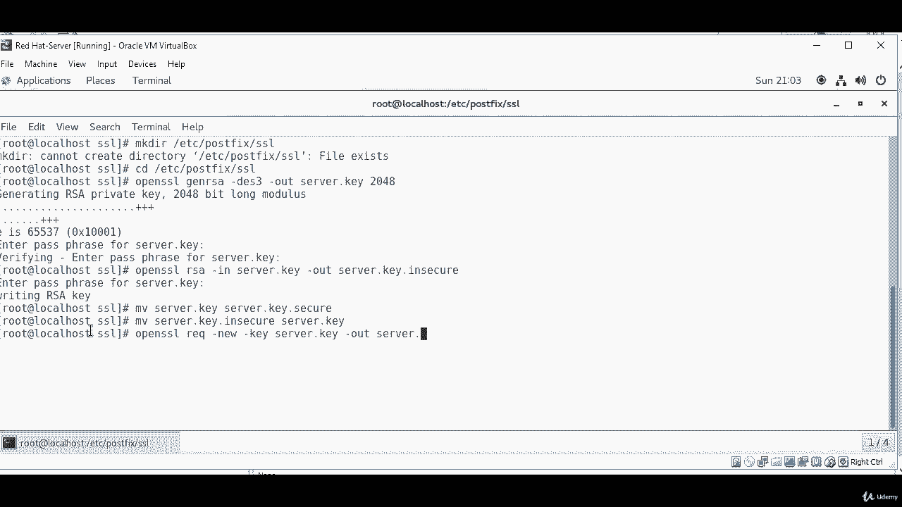
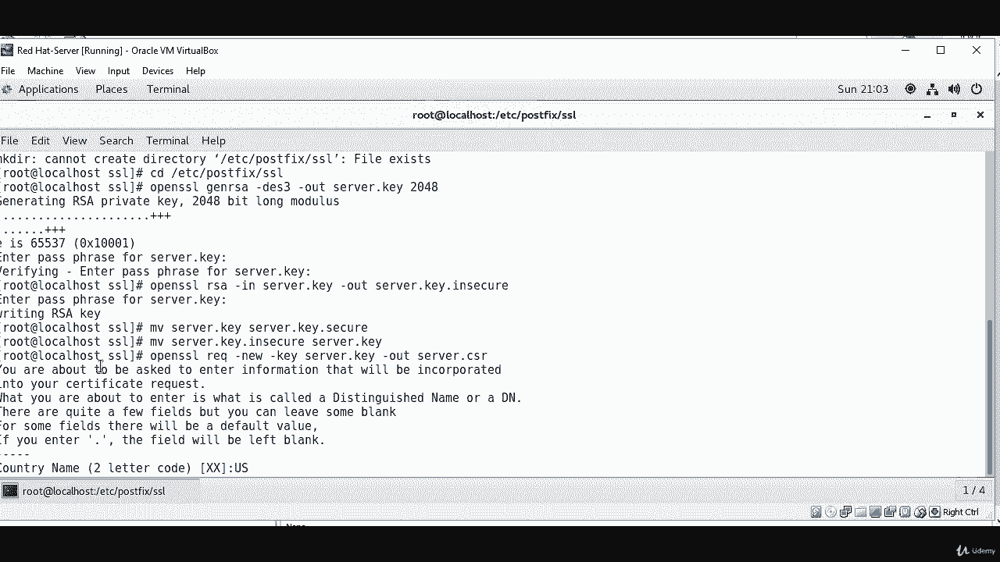
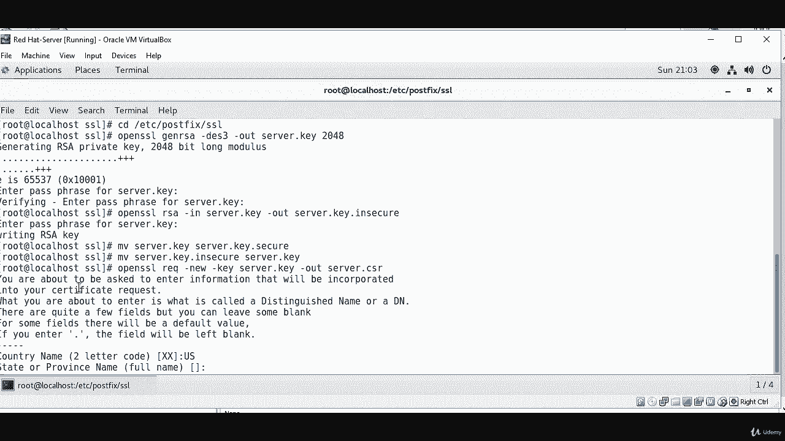
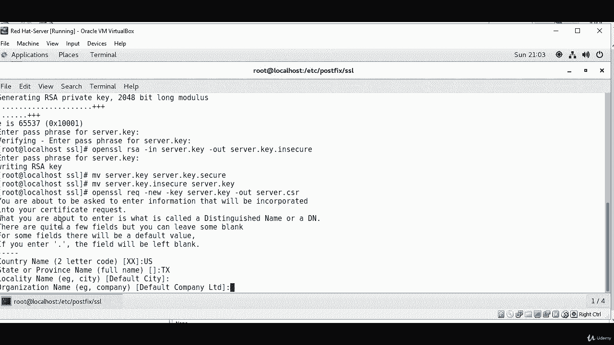
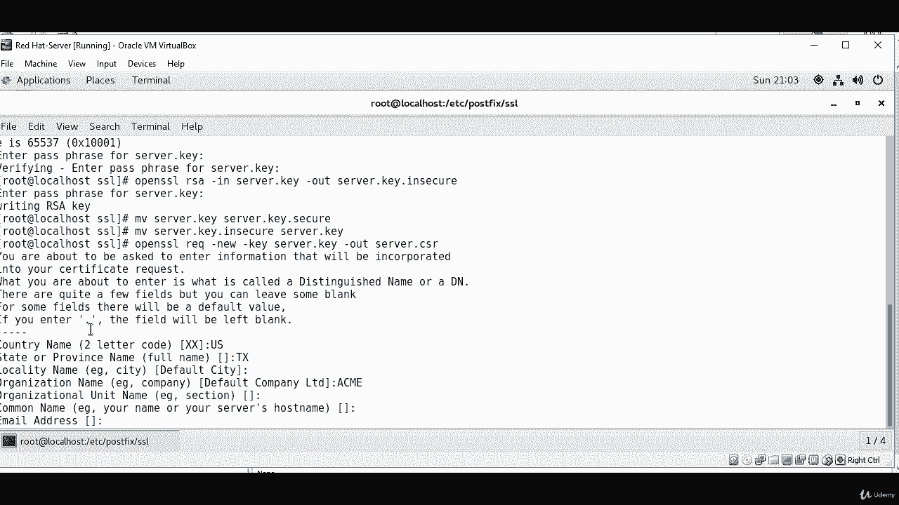
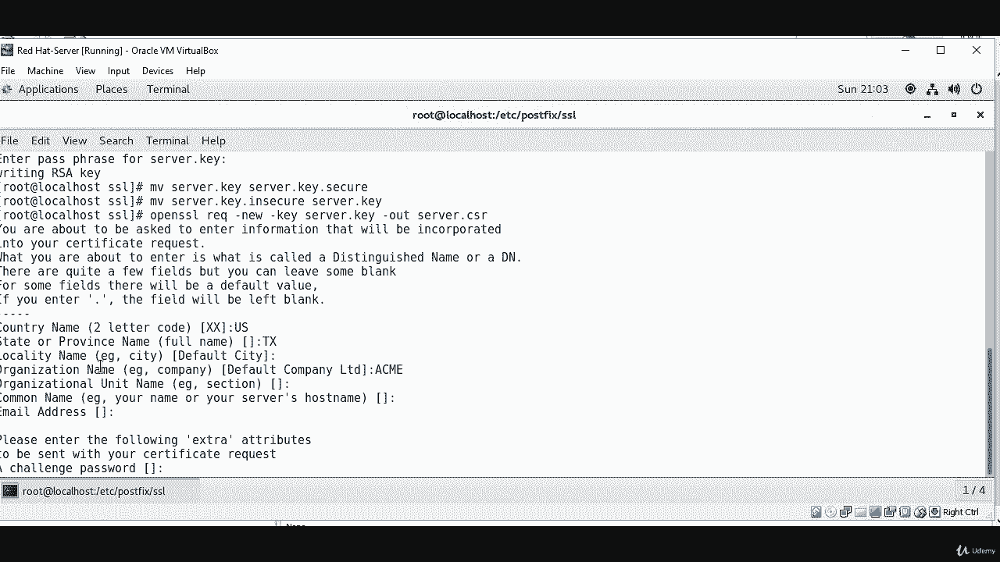
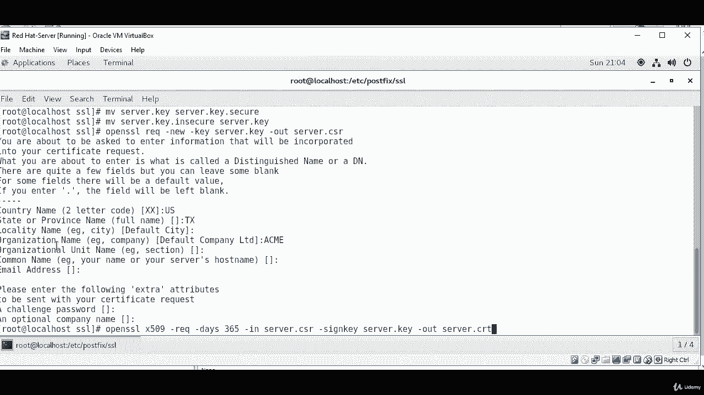

# [FreeCourseSite.com] Udemy - Red Hat Certified Engineer (RHCE) - 2018 - P38：9. Email server--2. SSL certificate - 我吃印度飞饼 - BV1jJ411S76a

Hello students， in this lecture we are going to first create an SSL certificate for encryption。

And there has to be a directory call。I'm going show you， but I already have created so make， dear。

Esy。Post fix。As a cell。I already have it and the next thing you're going to do is you're going to C into slash ETC。

Po fix。S，sL。And then you're going to run open as a cell。Generate RA。Qi。That doess 3。Dash out。Server。

Dot key。2048。Okay， and thens gonna to ask for our password。To set up a pass phrase。Okay。

 once that is done。Then the command we're gonna run is。Open SSL。RSA。Dash in。Sah。The key。D out。Server。

Thatq。Got inec。Okay， so that is done。Now we're going to move the server key。Do server work he secure。

The move。Server dot key。2 server dot。K dot。Secure。And move。Server dot。Ki。To sorry。

 server do key dot insecure。To server。Dkey。Okay， next step， we're going to do open SSL。Rck。Dash new。

Dashki。Server。Dot。Qi。The dash out。Server dot c，R。

And。For country name and all that， you can。

Put in word， depending on where you are。State of province。 I'm going to put the Texas City。

I'm just going to leave it blank Or number or organization name。

Let's call it ame。And。I'm going to leave the rest blank。

Challenge password。 I'm gonna leave that blank， as well。Okay， now we can open the。呃。X 5，0，9， So open。

Ass a sale。X 5，0，9。Dash wreck。Dash days。3，65。Dash in。Server。Dot cR。Dash。Sign。Ki。Server。Daqi。Dash out。

Serverdox， CRRT。

