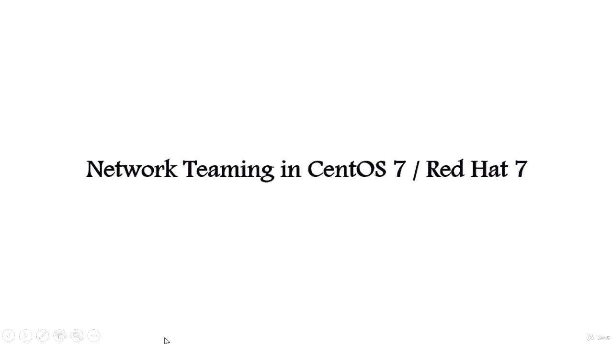
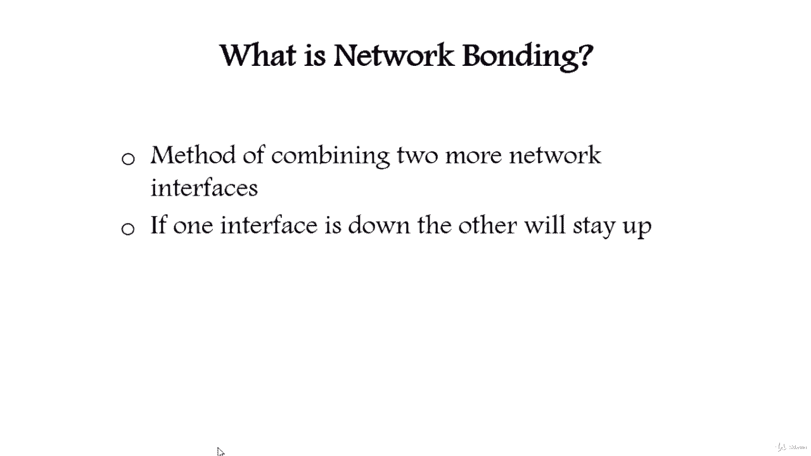
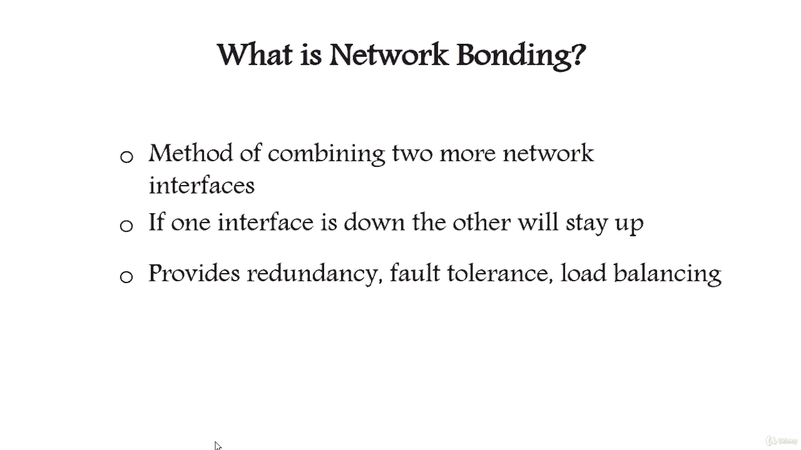
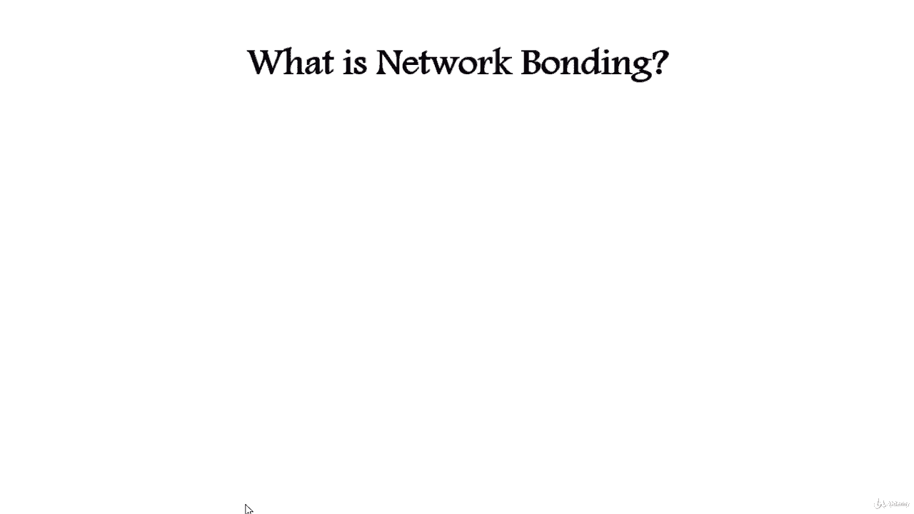
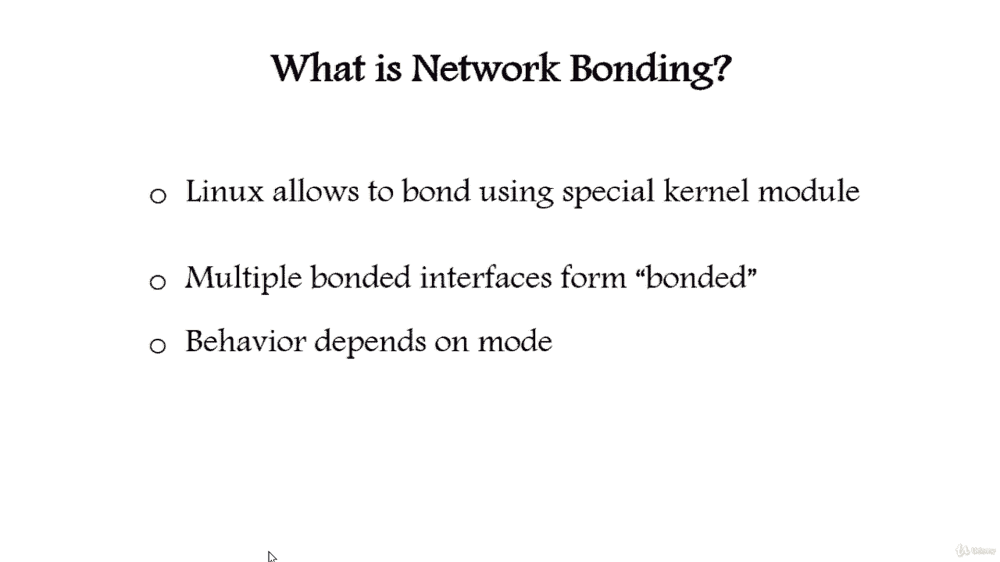

# [FreeCourseSite.com] Udemy - Red Hat Certified Engineer (RHCE) - 2018 - P3：2. Network Interface Teaming (Bonding)-----1. Introduction - 我吃印度飞饼 - BV1jJ411S76a

Hello students and welcome to Network Teaming in Sental 7 and Redhead 7。

What is network bonding， Network bonding is a method of combining two or more network interfaces together gather into a single interface。

It will increase the network throughput bandwidth and will give redundancy。

If one interface interfaces down or unplugged， the other one will keep the network traffic up and alive。

 Network bonding can be used in situations where you need redundancy。

 fall tolerance or load balancing networks。

Linux allows us to bond multiple network interfaces into single interface using a special kernel module name bondding。

The Linux bonding driver provides a method for combining multiple network interfaces into a single logical。

 bonded interface。The behavior of the bonded interfaces depend upon the mode， generally speaking。

 modes provide either hot standby or load balancing services。

