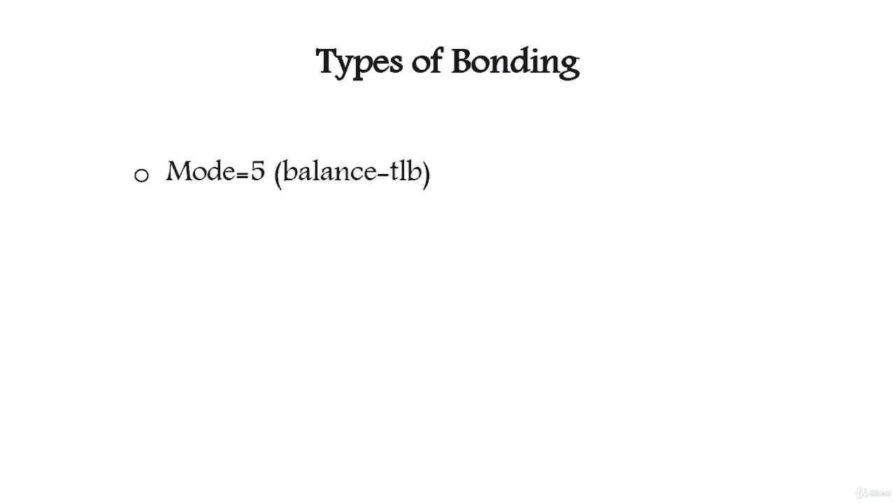

# [FreeCourseSite.com] Udemy - Red Hat Certified Engineer (RHCE) - 2018 - P4：2. Network Interface Teaming (Bonding)-----2. Types of Network Bonding - 我吃印度飞饼 - BV1jJ411S76a

Hello students， in this lecture we're going to talk about types of bonding。

So bonding is divided into six different types or seven mod modes equals to0 to mode equals to6。

Moode equals to0 is also called balance hyphen R Rr for round robin。And it is the default mode。

 It transmits packets in sequential order from the first available slave through the last。

This mode provides load balancing and fault tolerance。The next one is mode 1。

 which is the active backup。 Act backup policy is this in this mode。

 only one slave in the bond is active。 The other one will become active only when the active slave fails。

The Bos Mac address is externally visible on only one port network adapter to avoid confusing the switch。

This mode provides fault tolerance。

The next mode is mode2 our B XR XR policy is that transmit based on source Mac address。

 XRD with destination Mac address。Mulo slave count。

 This selects the same slave for each destination Mac address。

 This most provides load balancing and fault tolerance。

Next one is mode  three broadcast。Broadcast policies transmit everything on save slave interface。

 This mode provides fault tolerance。

Moode 4。Our 82。380。Dynamic link aggregation。 It creates aggregation groups that share the same speed and duplex settings utilizes all slaves in the active aggregator。

 according to the 802。380 specification。

Next one is module R mode 5， adaptive transmit load balancing。

It's channel bonding that does not require any special switch support。

 The outgoing traffic is distributed according to the current load。On each slave。

 incoming traffic is received by the current slave。 If the receiving slave fails。

 another slave takes over the Mac address of the failed receiving slave。

And the last one is mode 6， adaptive adaptive load balancing。

It includes a balanced T LB plus receive load balancing R LB for IP P go V4 traffic and does not require any special switch support。

 The receive load balancing is achieved by。Arp negotiation。

 the bonding driver intercepts the ap replies send by the local system on their way out and overrs the source hardware address with the unique hardware address of one of the slaves in the bond such that the different peers used。

