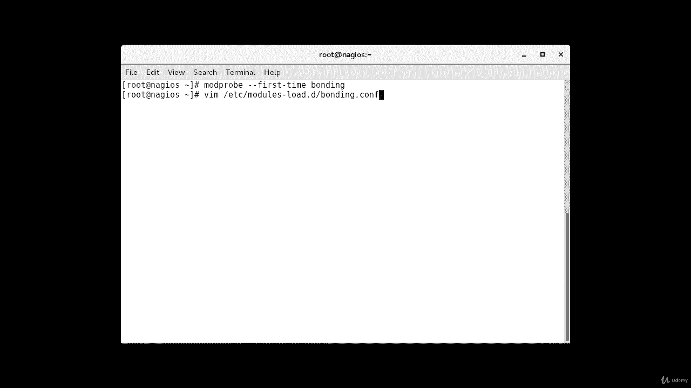
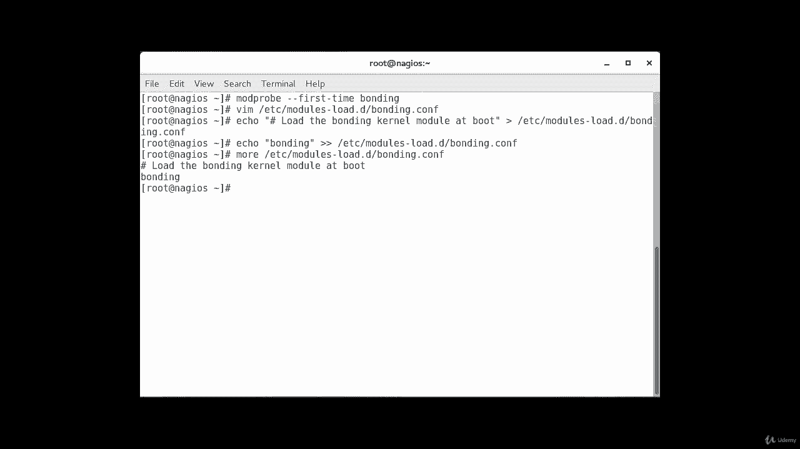
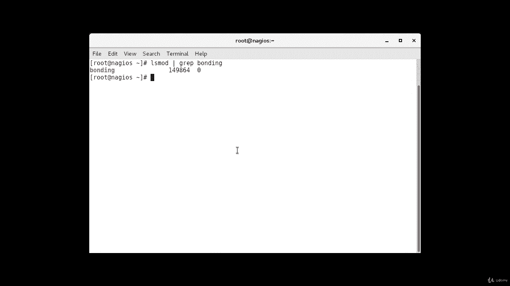

# [FreeCourseSite.com] Udemy - Red Hat Certified Engineer (RHCE) - 2018 - P5：2. Network Interface Teaming (Bonding)-----3. Enabling Bonding on CentOS 7 - 我吃印度飞饼 - BV1jJ411S76a

Hello， so I'm logged into our Sos machine and I use it for Nagios server also that's why it's named Nagos。

And so we're gonna start our configuration on it。 But there are a couple let me become。

Super user first。So by default， the bonding kernel module is not enabled。

 thus we need to load it and ensure it is persistent across boots。

When used with the dash dash first dash time option。

 mod probe will alert us if loading the module fails。 Okay。

 so that's the command that we're going to use mod probe。Dash， dash first。Dash time。B。Boonding。

It'll load the bonding module for the current session in order to ensure persistency。

 we're going to create a dot co file inside the Etsy module。Marles D。 low Duty。So。

 the command is gonna be。Vim at sea。Mouleles。Lo daddi。And bonding。Dot com。

This what you can't call the file。

Okay， and。So we can what well use， we will use a redirection to go ahead and copy stuff in this file instead of trying to manually edit it and the way we do it is echo。

Kolen。Comment。Load。Bonding。Colonnal。Moojuhu。At boot。Since this is starting off with the Ha sign。

 so it's going to be counted as a comment。And then we're going to redirect it to Esy。Moules。Hi。

 foro daddy， slash。Bonding。Dot com。Donn。Then， we're gonna do。Echo。Bonding。

And you're going to redirect that to Esy。Modules。Hi， foro， daddy。Bonding。Got co。Dan。

And now we're gonna to reboot this server。 Let's do a more on。Essy modules。我da地。Bonundding dot com。

 And as you can see， these two lines that we just added by the redirection are added in the file。

 And now I'm going to go ahead and reboot it。 and I'm going to pause the video for a second。Okay。

 now our server has come back up and we're gonna do an L mod。

And we gonna grab for。Bonding。And as you can see， it is showing that bonding is enabled on the Serberna。

