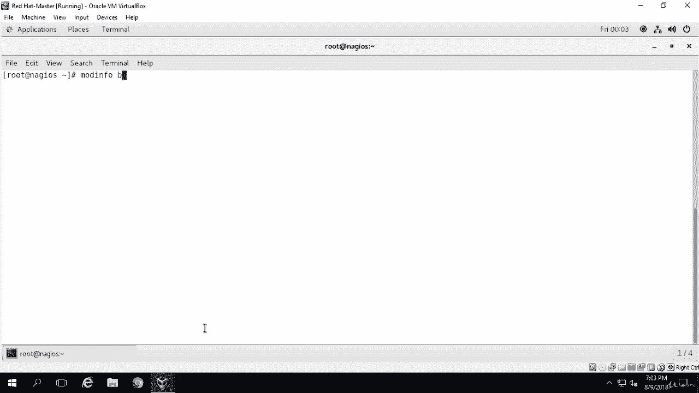
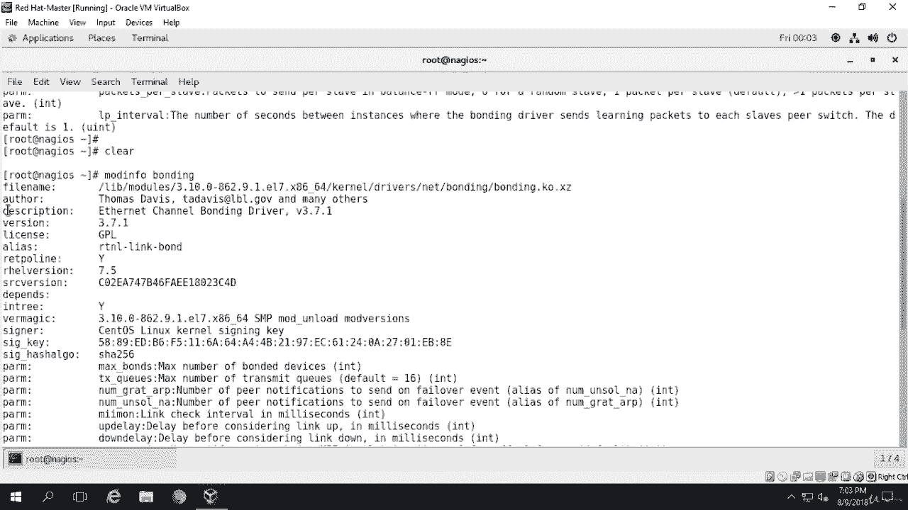
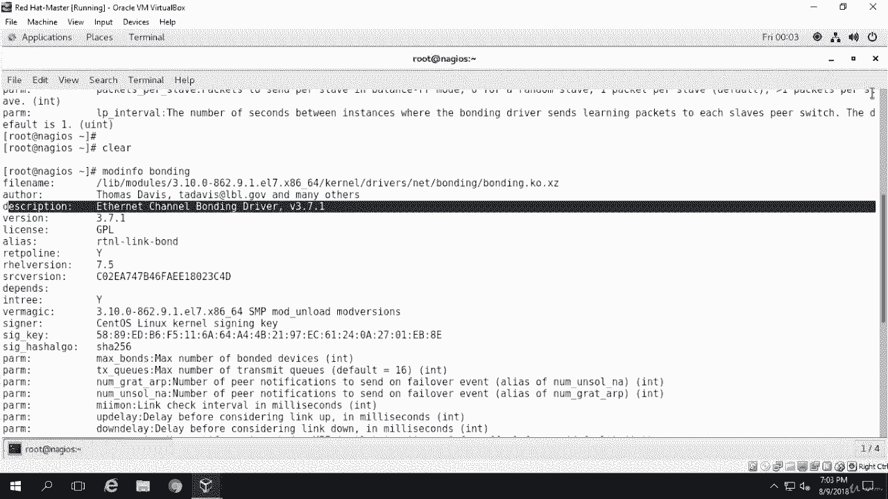
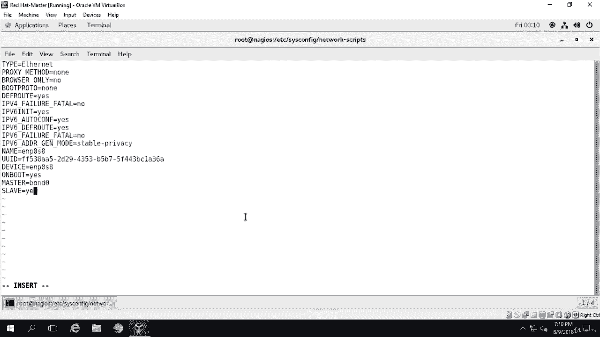
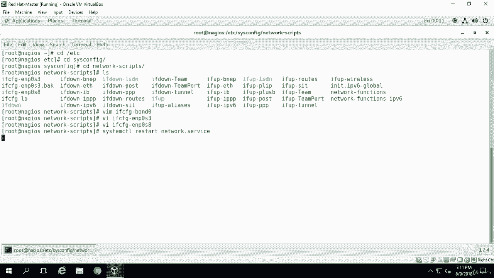
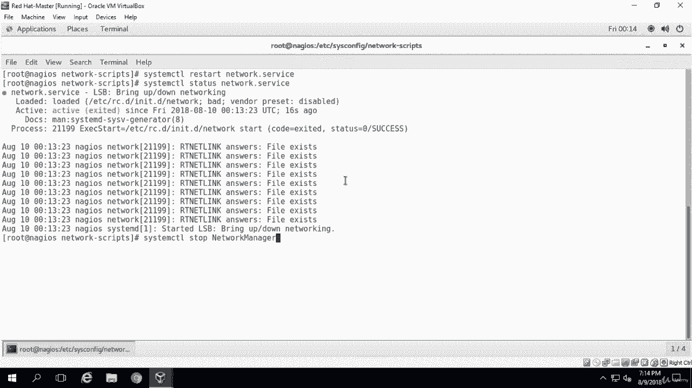
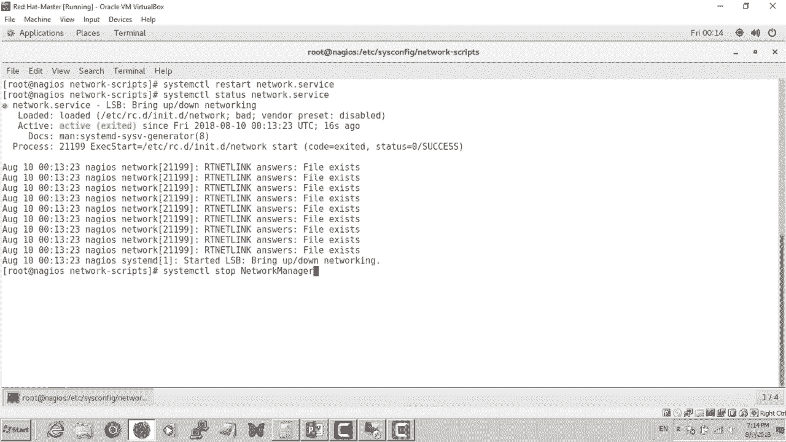
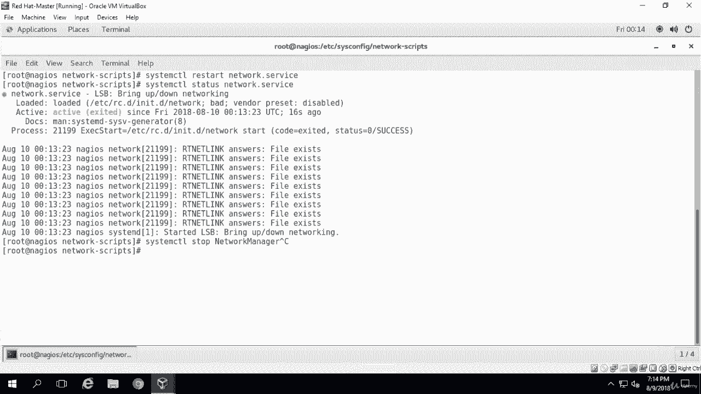

# [FreeCourseSite.com] Udemy - Red Hat Certified Engineer (RHCE) - 2018 - P6：2. Network Interface Teaming (Bonding)-----4. Editing bond0 interface file - 我吃印度飞饼 - BV1jJ411S76a

Okay， once we know that the mod Pro bonding did show us that bonding is enabled on our machine。

 then the next command we need to run is mod info。Maning。

And'll give you a lot of output， but the main concern is like right here on the top。

 which says description， it should say something like Ether channel bonding and then the driver number。

And that tells us， you know， what driver is installed of our on bonding。

Interface。Okay， now we're going to create the bond interface。And we have to create a file for that。

 and we're going to create a bond interface file。 We're going to name it ifFCfG hyphen bond0 under the folder slash ETC。

Ss。Config。And Cd2 network scripts。See， that's what's in it。This is where all the interfaces are。

 So if you can see， I mean， my machine has IFC。ENP03 and ENP0 8。 These are the two interfaces I have。

And then the look look back and。So what you're going to do is themm。I F FG， hyp。

Bond0 going to create this。And then we're going to type in。Of this。Devicice。Equals10。

Type equals to bond。Type equals bond。Name。Equals bond0。Then bonding master。Undersre master。

 all of this is in caps。Equals yes， we're going to make this master。And Bo protocol。

Boot protocol equals， we're going to say none。On boot。Do we want it to be connected on boot， yes？

IP address。ADr。Equals less sign at 1，92 dot1，68 dot1 dot 70。Okay， and net mask。Equals。Ne mask。Equals。

2，55 dot 2，55 dot2，55 dot 0。Gateway。Equals。1，92 dot1，68 dot1 dot one。Bonding。O Pts。Equals。

Under coat mode。Equals 5。M I I MO N。Equals 100。Okay， so this is our file that we're going to create。

For the bond interface。And one mistake I can see right now that I made under type。

 were going have bond。 but with the capital B。So I'm going to replace this with a capital B。

And I just want to make sure there is no type on this。Doesn't look like it。Okay。

Now we're going to specify the I address in so I'm using mod 5 in。

 which is used to provide fault tolerance and load balancing。

 That's why I mean you can pick whatever you like because we have discussed that in the previous lectures。

 you know what each of these would do for you。Now we can to edit the NickI interface files。

So the next one is going to be IF。C，fg E。P 0， S。3。And so type is the ethernet。And device， E and P 0。

3。0 S3 and on boot equals to yes。I'm just checking to make sure that while actually on boot。

Is saying no right now， So I'm going to change it to on boot yes。And。Master equals to bond 0。

 So this is， these are the two lines that I'm going to add。Master。Equals。Bom 0。Slave。Equals yes。

These are two lines that I'm going to add。And let's see if I got everything else correct here。

And boot protocol change from。D AC P 2。Nan。Okay， then we're going to go ahead and save an exit。

And we're going to do the same thing with S8 as well。And for S 8 also， Bo protocol is gonna be。

On boot is gonna be yes。Devic is correct。Boot protocol is gonna be。Nan。And then， also， master and。

Smaster。Equals10。1 zero。And slave。Equals， yes。

Okay。Done， and now we're going to restart the network service。System CTL。Restart。

Okay， so if we run a system CTtl status network do service。

 we should see network services running before that we ran the command system CTtL。

Restar network dot service because we made a couple of changes。 I ran into one problem。

 So it was not starting up the network。 And the issue was to stop network manager。

 I had network manager running and the error that I was getting was。

Faied to bring up LSB。 So there is an LSB interface that wasn't not starting。

 and the issue was the network manager was running， and I started， I stopped it and disabled it。

And as soon as I did it， I was able to restart the network。

