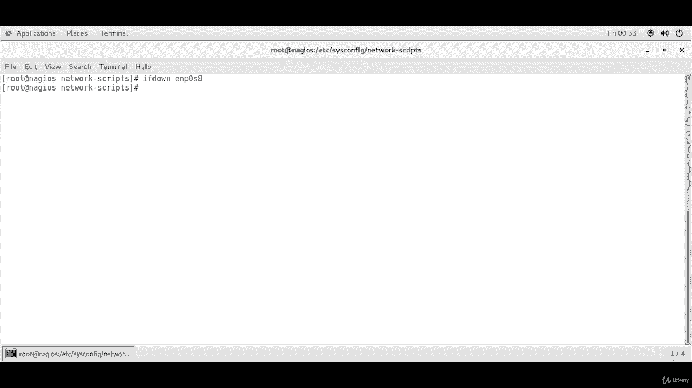

# [FreeCourseSite.com] Udemy - Red Hat Certified Engineer (RHCE) - 2018 - P7：2. Network Interface Teaming (Bonding)-----5. Testing interface bonding - 我吃印度飞饼 - BV1jJ411S76a

Okay， so once our bonding is configured， then the test is。

 you can just type in IP space dash A for IP address。And you should see something similar to this。

 depending on what kind of virtualization using。So ENP0 S3 is one of the interfaces。

 as you can see it's showing slave up。So it's configured as a slave。 The second one is EN P0 S 8。

 This is also showing slave up。And then our bond is bond zero， is configured as on number five。

And showing as master。U。Okay， so this is a test that we got everything configured correctly as we wanted。

Furthermore。If you want to view bond interface settings like bonding mode and slave interface and all that。

 you can type in cat。Proc。Net。Bonding。Bnd。0。And this will give you。

The bonding mode is T LB transmit load balancing。And then it also shows slave interface EN P0 S 3。

 it also shows slave interface EN P0 S 8。It shows this full duplex on both of them。

There is no link failure count so far。 hardware address on both of them。

And slave Q I D is0 on both of them。 His speed is 000 mebits per second。sThe same on boat。

And status is up on both of them。Okay， next text test we're going to do is called fault tolerance testing。

 In order to do that， I'm going to do a F if down。And E N P。0， S 8。And to test the fault tolerance。

 we can download one of the interfaces and check whether you are still able to access the server。

So what I'm going to do is from a different machine。I am going to ping。192 dot168 do 1 do70。

 If you remember， that was my bond0 IP address that I configured。

And if I have already brought down one of the interfaces and let's see if bond is responding and bond zero is responding。

Although if you remember， we have turned it off。

We have done。 Oh， sorry Sonda。S 0，8， my apologies。So， it is。Ping。

So another test that you can do is I SSH。A root。Into。192。168。1。70。That's our machine。

Where I have configured the bonds zero interface。Okay。Alright， so from a different client right now。

 we are logged into our machine， which has the bond0 interface configured。

 And what I'm going to do is from here， I'm going to run the command that we ran earlier。 Also cat。

Croc。Net。Buanding。

B0。And as you can see， currently active slave is ENP03 because we brought down the ENP08。

So that's the current active slave。Dest interface that running。

 So this is a test that we have successfully created bonding as doing the fault tolerance。

And even after we shut down one of the interfaces， the other one took over。And is currently active。

 and we can ping from a different client in the same network， and we can SS from different client。

