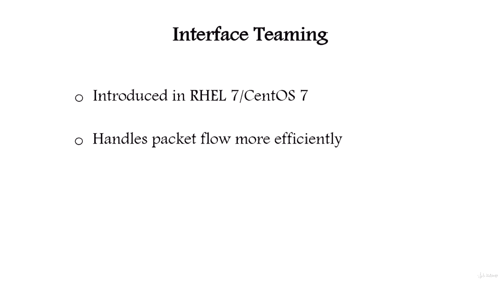
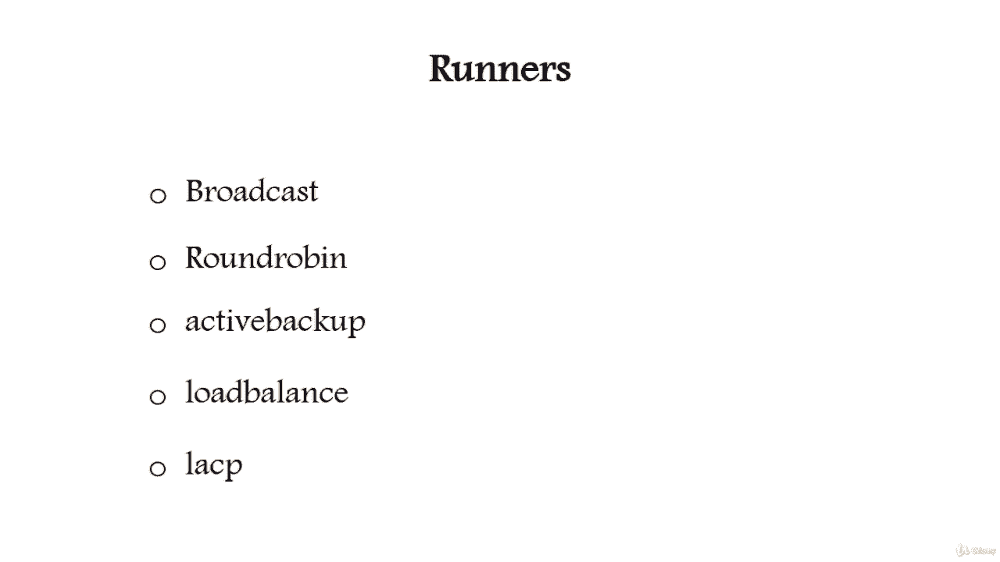

# [FreeCourseSite.com] Udemy - Red Hat Certified Engineer (RHCE) - 2018 - P8：2. Network Interface Teaming --6. Introduction to network interface teaming - 我吃印度飞饼 - BV1jJ411S76a

Yeah。Hello， in this lecture we can talk about interface teaming Interface teaming is introduced in Roal 7 and Sos 7。

It performs same function as Nick bonding。Teaming is a new feature。

 it handles the flows of packets more efficiently than the bonding does。

Network teaming is implemented with a kernel driver and a user space demon named TeamD。

And software called runners enables load balancing。

So the runner has several modes， just like bonding has several modes。

 so let's talk about the runners a little bit。The first one is called broadcastcast。

 It transmits each packet from all ports。Second one is called round Robbin。

 it transmits each packet in a round robin way from each of its ports。

The next one is called Active backup Faoverrunner， which watches for link changes and selects an active port for data transfer。

Next one is called load balance。Monitors traffic and uses a hash function to try to reach a perfect balance when selecting ports or packet transmission。

And the last one is called LAACP， it implements the 802。3 ADd link aggregation control protocol。

It can use the same transmit port selection possibilities as the load balance runner。

So in the next lecture， we are going to go over the actual configuration of teaming。

