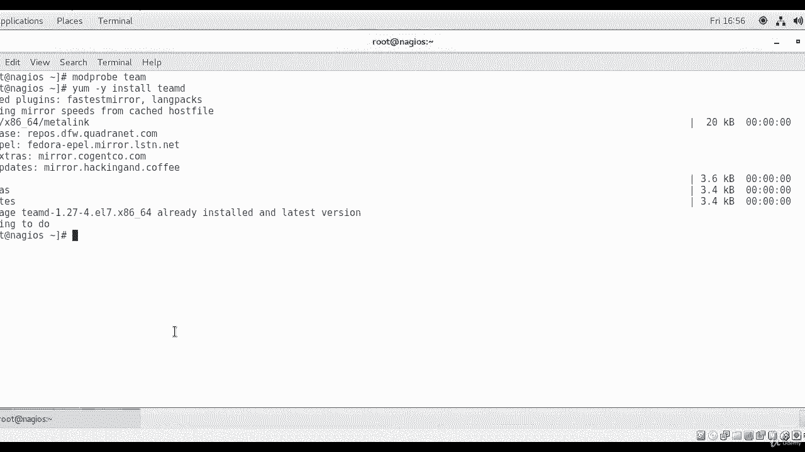
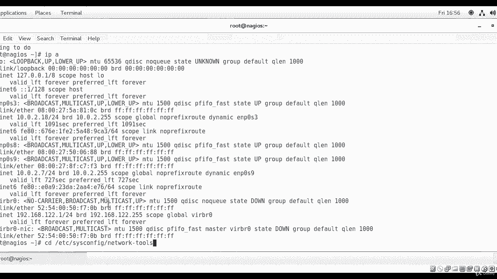
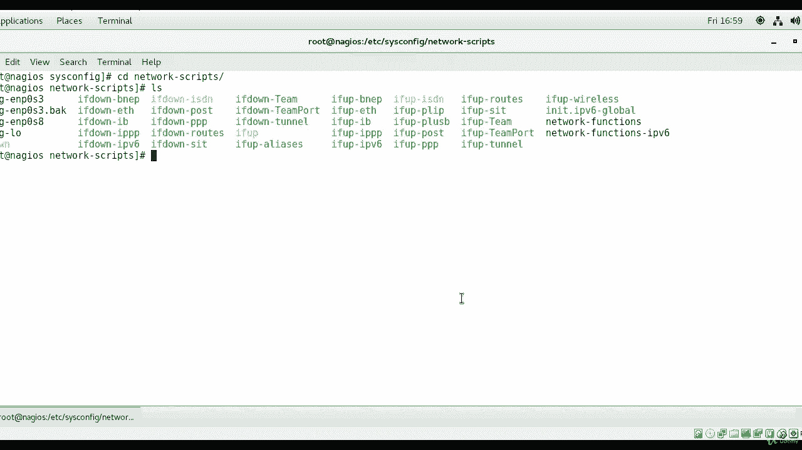
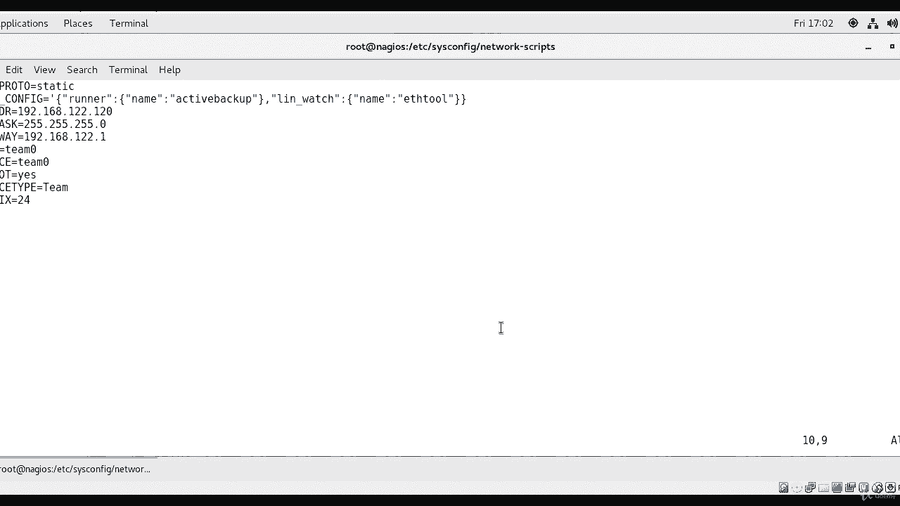
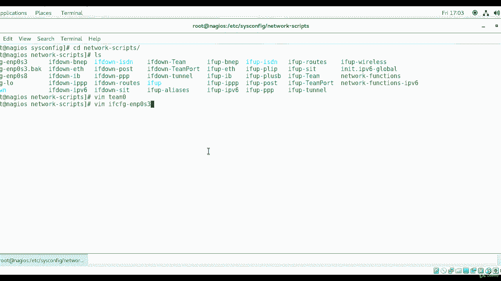
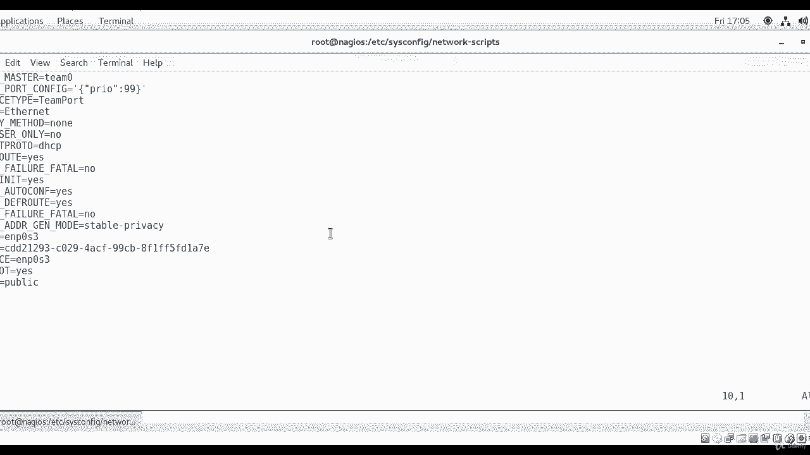
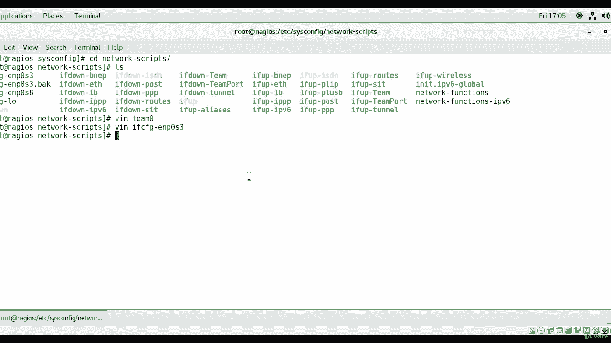
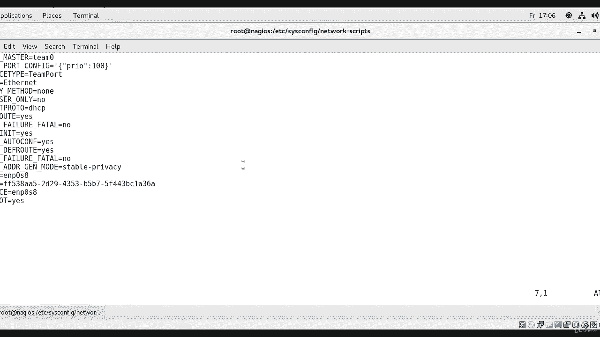
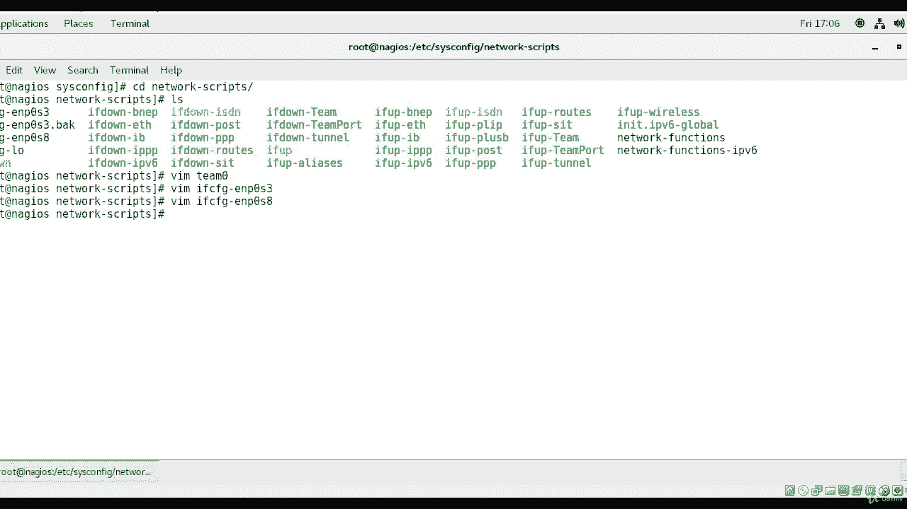

# [FreeCourseSite.com] Udemy - Red Hat Certified Engineer (RHCE) - 2018 - P9：2. Network Interface Teaming (Bonding)-----7. Team configuration - 我吃印度飞饼 - BV1jJ411S76a

Okay， so first we are logged into our machine right now and were going to check。On。

The team D software。 So mod。Probe。Tim。Thiss not running， didn't show me anything。

I am certain that it is installed on my machine， but the comment to the command to install it is yum space dash Y if you don't want to be asked about it and you just want to go ahead and install it。

Then install TeamD。And most probably is going to come back and say。

 I already have it installed and I don't need to do anything。Yeah。

 so it is installed but in your case if it's not installed， it's going to install it。

I'm going to look at my IP addresses， I have ENP0 S3。And I have EN P 0 S 8， ENP 0， S 9，5 have3。

Interfaces and then the virtual two virtual and one loop back。And then we're going to go to。

Slash ETC。Slice ciscon fig。Then network scripts。Sorry， actually， in this case。

 we're going to go to network。

Tools。So next we're going to go to。Okay， next we're going to go to。

And we going to actually go to network tools or network scripts。And then in here。

 I'm going to create a file called Team zero。

Okay， so them。Tam。0。In this team0 file， I'm going to create。Some lines here。Boot。Pro took call。

Equals static。Then， team。And just score config。Equals and then you start off with a comma。

Then curly bracket。And then。Runner。And of coats。Colin。Curly bracket。Name。End of quotes。Colin。

En of coat。Our beginning of course active， this is going to be my team D runner。Back up， active。

Back up。And， of course。And of curly bracket， comma， sorry， it is kind of confusing。

 but this is how it's supposed to be。Link watch。Cly bracket。Name。End of codes。Eat。2。End of coats。

And of curly bracket。Okay。And then the next one is going to be IP address。Which is going to be。192。

168 dot 122 dot 120。And netmask。Equals 255。 255。 255。0。Then gateway。Equals 192。 168 do 122。1。

Then name。Equals。Team  zero。Then， device。Equals。Team zero。Then， on boot。Equals。Yes。Then device type。

Equals team。Then， prefix。Equals 24。Okay， now we are done with our。File here that we just created。

 let me just take a look at it and make sure that I don't have any type in here。Okay。

 I'll go ahead and save and exit。

Okay， now I'm going to create files for the two other interfaces。

 so first one is going to be WiM ifFCfG， E and P0 S3。

And。I'm going to call this one。Team。Master。Equals。Team 0。Next one is going to be team。Hort。Config。

Equals。Com吗？Curly bracket。Cos。P，R， I O。Coat。Colon。99。Curly bracket。In。Okay。

 the third one is going to be device type。Equals。Team port。And name we already have is ENP03。

And hardware address we already have device we already have。And on boot is already， yes。

I'm going to comment this one out because I don't want it to be。GoDHCP and。

That's about it that I'm going to change in this file。

Okay， then we're going to go to the next one， which is。

eight。And we're going to do similar thing here。teeam。Master。Equals team 0。Team。Port。Underterco。

Config。Equals。Sorry， this one is going to be 10， we're going to change the priority on this one。And。

And of code。Deeve type。Equals。Tamport。The name is already there， and。The rest。

 we're gonna keep it like that， and。Let me change this， this comment it out。Okay。

And I'm going to save this one also。

