# Linux运维基础：P10：帮助命令与系统开关机及运行级别 🖥️

在本节课中，我们将学习Linux系统中两个非常实用的主题：如何获取命令的帮助信息，以及如何进行系统的开关机操作和管理不同的运行级别。掌握这些知识是高效使用和管理Linux系统的基础。

## 帮助命令的使用 📖

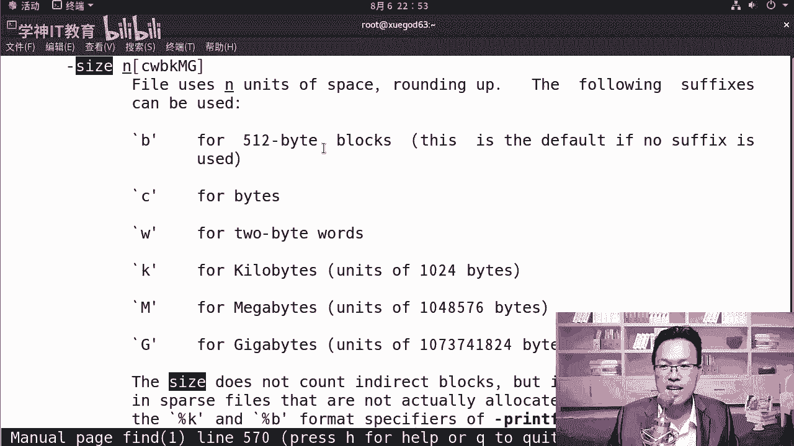

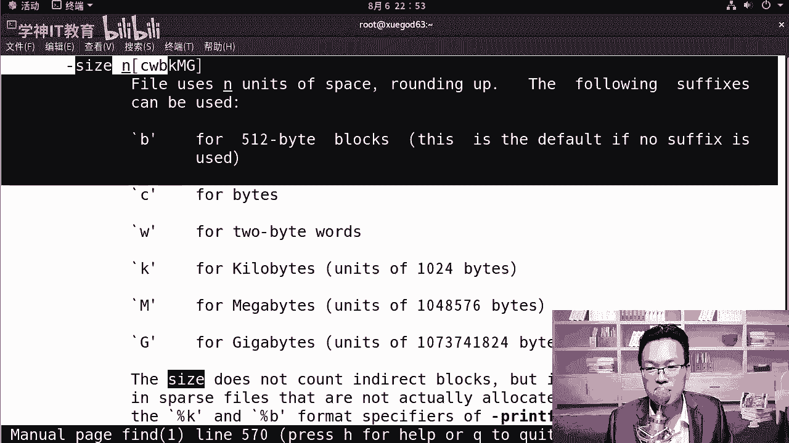

当我们遇到一个不熟悉的命令，不知道该使用什么参数，或者不理解某个参数的含义时，可以通过帮助命令来获取信息。

以下是获取命令帮助的三种主要方式：

**1. `man` 命令**
`man` 是“manual”（手册）的缩写，用于查看命令的详细说明文档。例如，查看 `find` 命令的手册：
```bash
man find
```
在 `man` 页面中，可以使用上下方向键翻页，输入 `/` 后跟关键词（如 `/size`）进行搜索，按 `q` 键退出。

**2. `-h` 或 `--help` 参数**
许多命令支持 `-h` 或 `--help` 参数来显示简明的使用帮助。例如：
```bash
ls --help
```
需要注意的是，有些命令可能只支持其中一种形式（`-h` 或 `--help`）。

对于初学者而言，系统地学习命令比频繁查阅手册效率更高。`man` 和 `--help` 更适合在已知命令基本功能，但忘记具体参数细节时进行快速查阅。

---

## 开关机命令与7个运行级别 🔄

上一节我们介绍了如何获取命令帮助，本节中我们来看看如何控制Linux系统的开关机状态和运行模式。

Linux下实现开关机和重启操作有多种命令，选择一种你最容易记住的即可。例如，`init 0` 用于关机，`init 6` 用于重启，这两个命令非常直观。

以下是其他常见的开关机命令及其参数：

*   **`shutdown`**：功能强大的关机命令。
    *   `shutdown -h +10`：系统在10分钟后关机。
    *   `shutdown -h 23:00`：系统在晚上11点整关机。
    *   `shutdown -r +20`：系统在20分钟后重启。
    *   `shutdown -h now`：立即关机。
    *   `shutdown -c`：取消所有预定的关机/重启任务。

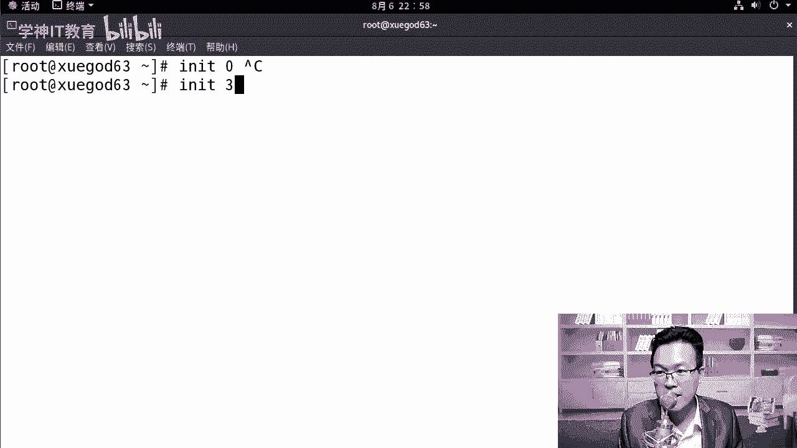

接下来，我们深入了解Linux系统的7个运行级别。运行级别定义了系统启动后进入的不同工作状态。

以下是各个运行级别的含义：


*   **0**：关机。
*   **1**：单用户模式。此模式下直接拥有root权限，无需密码，常用于系统修复（如重置root密码）。
*   **2**：多用户模式（无网络文件系统NFS支持）。
*   **3**：完整的多用户文本模式。这是服务器最常用的运行级别，提供完整的网络功能，登录后为命令行界面。
*   **4**：保留未使用。
*   **5**：图形界面模式。在命令行界面输入 `startx` 命令也可以启动图形界面。
*   **6**：重启。

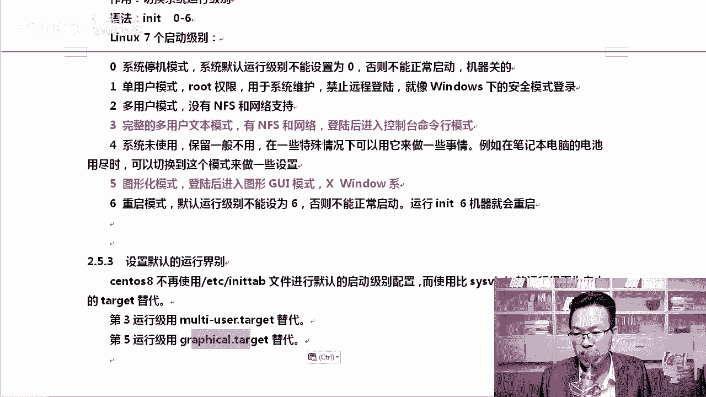

你可以使用 `init [级别号]` 在不同运行级别间切换。例如，从图形界面（级别5）切换到文本模式（级别3）：
```bash
init 3
```
切换后，需要使用用户名和密码登录。请注意，在Linux命令行输入密码时，光标不会移动也不会显示星号`*`，这是正常的安全设计。


要从级别3切换回图形界面（级别5），可以执行：
```bash
init 5
```

---

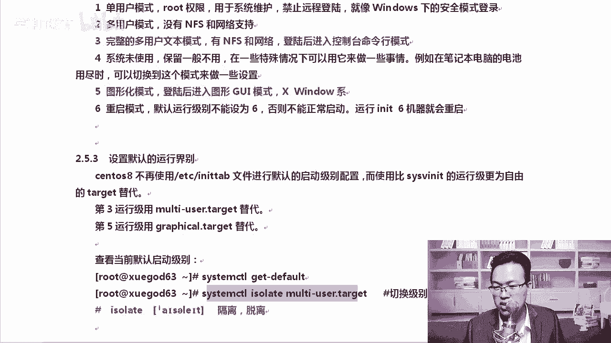


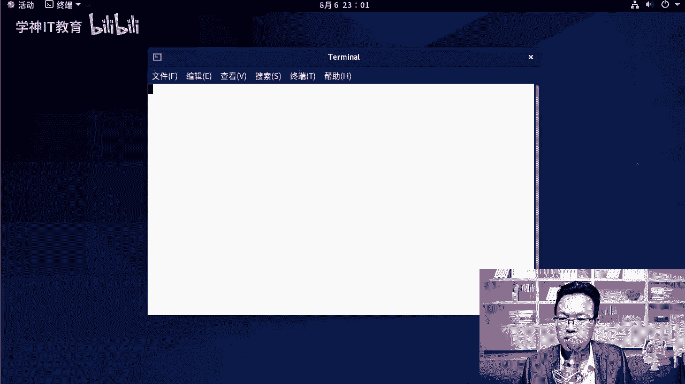

## Systemd目标（Target）—— 新的运行级别概念 🎯

在CentOS 7/8等使用Systemd初始化系统的现代Linux发行版中，传统的运行级别概念被“目标（target）”所取代。

以下是使用Systemd管理“运行级别”的关键命令：

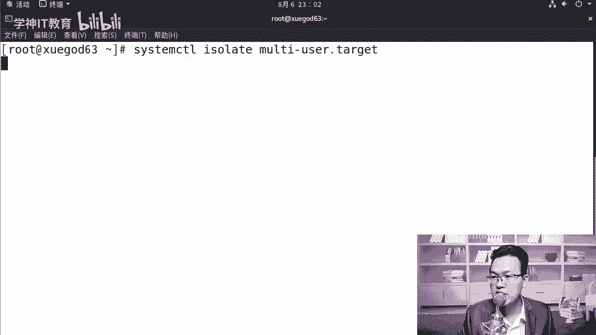

*   **查看当前默认目标**：
    ```bash
    systemctl get-default
    ```

*   **切换到多用户文本模式（相当于级别3）**：
    ```bash
    systemctl isolate multi-user.target
    ```


*   **切换到图形界面模式（相当于级别5）**：
    ```bash
    systemctl isolate graphical.target
    ```

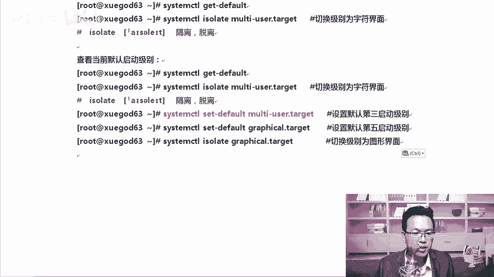

*   **设置默认启动目标为文本模式**：
    ```bash
    systemctl set-default multi-user.target
    ```

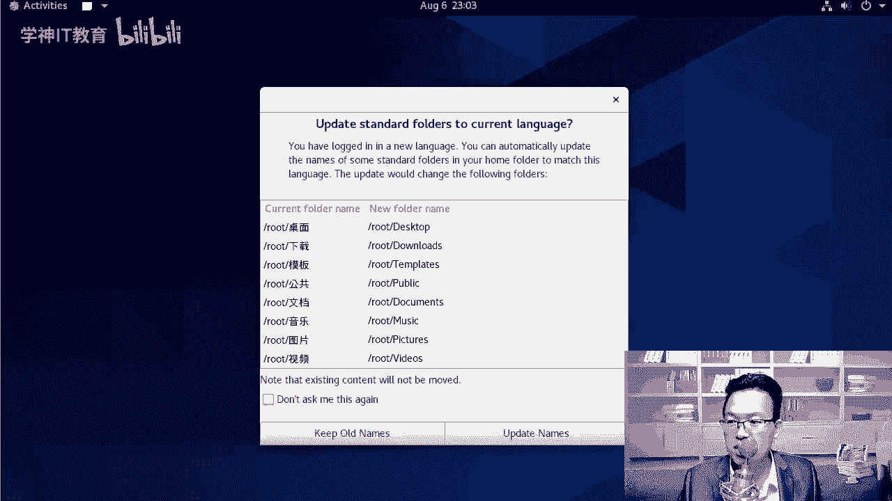


*   **设置默认启动目标为图形界面**：
    ```bash
    systemctl set-default graphical.target
    ```

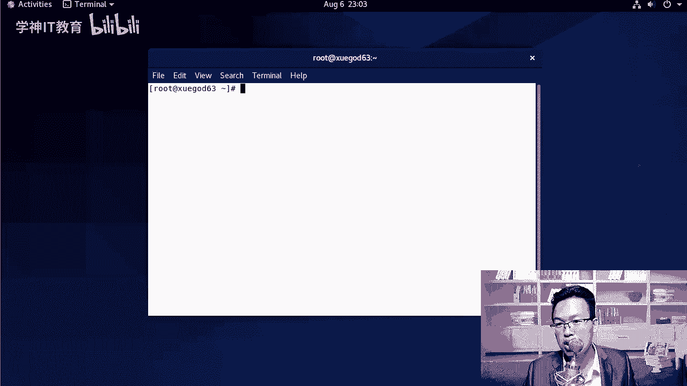

虽然新系统支持 `target`，但为了兼容和方便，`init 3` 和 `init 5` 等命令通常仍然可用。然而，要永久修改系统的默认启动状态，必须使用 `systemctl set-default` 命令。

---

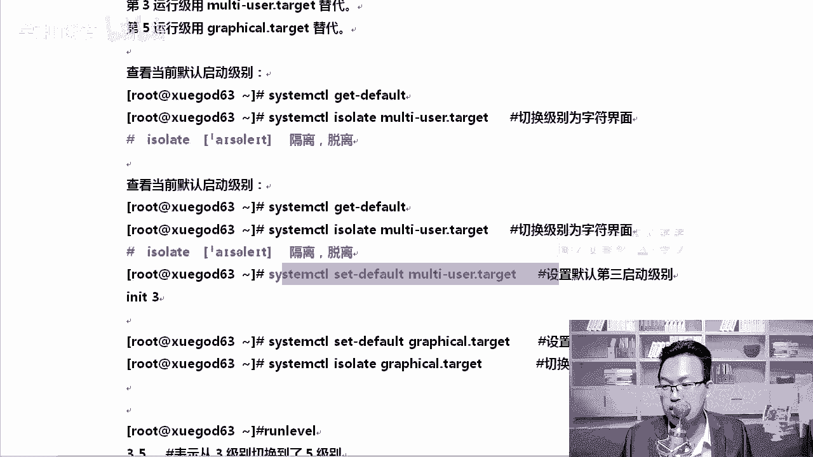

本节课中我们一起学习了Linux的帮助命令 `man` 和 `--help` 的用法，掌握了包括 `shutdown`、`init` 在内的多种开关机命令，并详细了解了从0到6的七个传统运行级别及其在Systemd系统下的新管理方式——目标（target）。理解这些概念和操作，是进行日常系统管理和故障排除的基础。