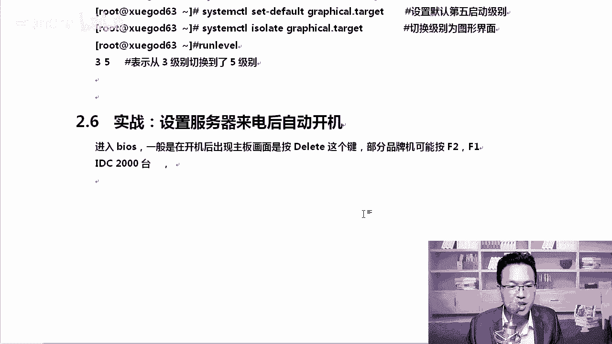
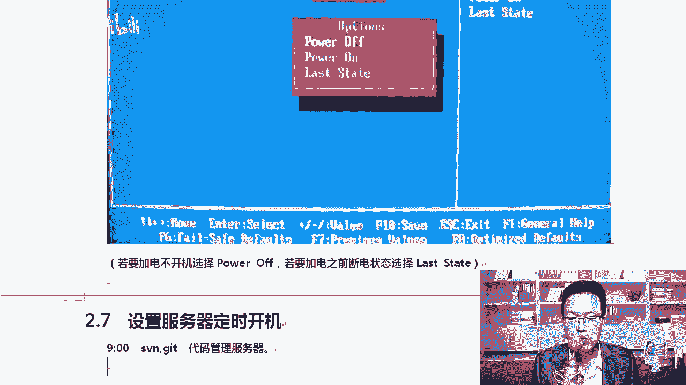
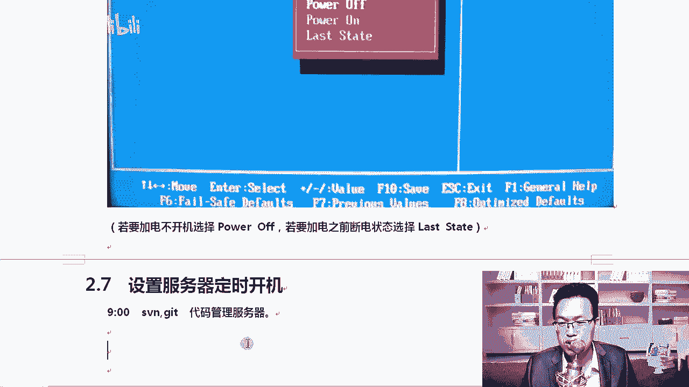
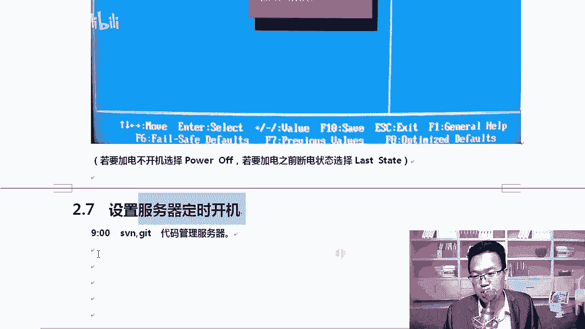
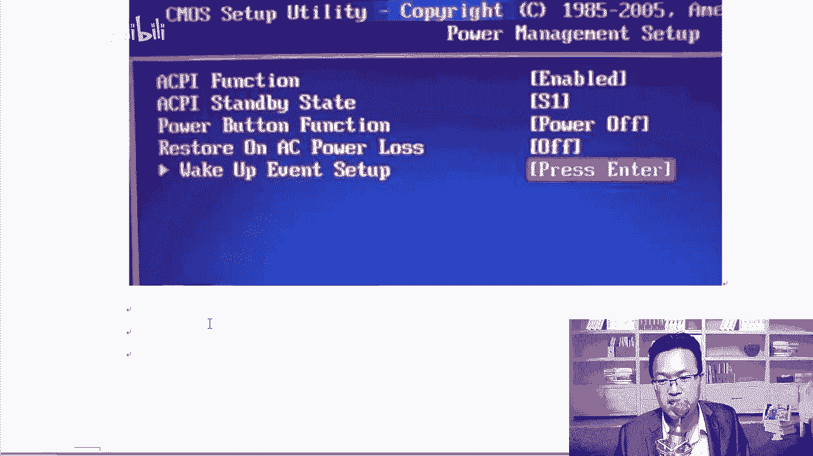
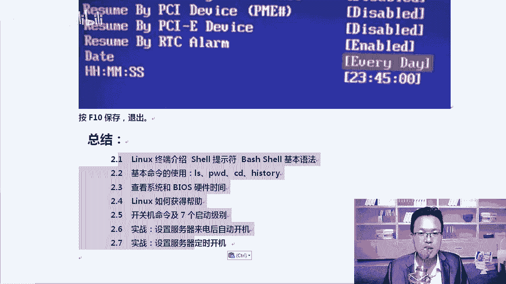

# CentOS8操作系统从入门到精通：P11：5-实战-设置服务器来电后自动开机与定时开机 ⚙️

在本节课中，我们将学习两个非常实用的服务器硬件管理技巧：如何设置服务器在断电恢复后自动开机，以及如何设置服务器定时自动开机。这些是数据中心和日常运维中常见的需求，掌握它们能有效提升运维效率。

## 设置服务器来电后自动开机 🔌

上一节我们介绍了服务器基础管理，本节中我们来看看如何让服务器在意外断电并恢复供电后，能够自动启动，无需人工干预。这在拥有大量服务器的IDC机房中尤为重要。

这个实战的需求是：假设机房因故断电，所有服务器都关闭了。当电力恢复时，运维人员无需手动按下每一台服务器的电源按钮，服务器能自动开机。

实现这个功能需要在服务器的BIOS（基本输入输出系统）中进行设置。进入BIOS的方法通常是在开机时按下 `Delete`、`F2`、`F11` 或 `F1` 等按键。

以下是进入BIOS后的设置步骤：

1.  在BIOS主界面，使用键盘方向键选择 **“Advanced”**（高级）或 **“Integrated Peripherals”**（集成外设）等类似选项。
2.  在该菜单中，找到并进入 **“Power Management Setup”**（电源管理设置）或 **“APM Configuration”**（高级电源管理配置）。
3.  寻找名为 **“Restore on AC Power Loss”**（交流电源恢复后的状态）、**“After Power Failure”**（断电之后）或 **“AC Power Recovery”**（交流电源恢复）的选项。
4.  该选项通常有以下几种模式：
    *   **Power Off**：保持关机状态，需要手动开机。
    *   **Power On**：恢复供电后自动开机。
    *   **Last State**：恢复到断电前的状态（如果断电前是开机，则自动开机；如果是关机，则保持关机）。
5.  根据需求，将选项设置为 **“Power On”** 或 **“Last State”**。
6.  最后，按 `F10` 键保存设置并退出BIOS，服务器会重启。

> **核心概念**：此功能由主板BIOS的电源管理策略控制，与操作系统无关。公式可以理解为：`恢复供电事件` -> `BIOS电源策略` -> `执行开机/关机动作`。

这个小技巧不仅适用于服务器，普通的台式机甚至部分笔记本电脑也支持。你可以尝试将笔记本的电池取下，连接电源适配器，观察是否会自动开机来验证设置。

## 设置服务器定时开机 ⏰

接下来，我们看看如何设置服务器在指定的时间自动开机。例如，希望公司内部用于代码管理的服务器，能在每个工作日上午9点自动启动，晚上11点再通过系统命令自动关机。

定时关机可以在操作系统中通过计划任务（如 `cron`）执行 `shutdown` 命令来实现。但定时开机必须在操作系统启动之前完成，因此同样需要在BIOS中配置。

以下是设置定时开机的步骤：

1.  进入服务器BIOS设置界面。
2.  导航至 **“Power Management Setup”**（电源管理设置）菜单。
3.  在该菜单中找到 **“Wake Up Event Setup”**（唤醒事件设置）或 **“Resume by Alarm”**（定时启动）选项。
4.  将 **“RTC Alarm Resume”** 或 **“Resume By RTC Alarm”** 选项从 **“Disabled”**（禁用）改为 **“Enabled”**（启用）。
5.  启用后，会出现日期（Date）和时间（Time）的设置项。你可以设置一个具体的开机时间，例如：
    *   **Date**：通常设为 `0` 或 `Every Day`（每天）。
    *   **Time**：设置为 `09:00:00`（表示每天上午9点）。
6.  保存并退出BIOS设置。

> **核心概念**：此功能依赖于主板上的实时时钟（RTC）芯片。代码逻辑可简化为：`当(系统时间 == BIOS预设时间) { 触发开机信号； }`。

此外，BIOS通常还支持通过其他事件唤醒电脑，例如网络唤醒（Wake-on-LAN）、按下键盘鼠标等。你可以根据实际需要选择。

## 总结 📝

本节课中我们一起学习了两个硬件层面的服务器管理实战技能：
1.  **设置来电自启**：通过修改BIOS中的 `Restore on AC Power Loss` 选项，让服务器在电力恢复后能自动开机，适用于机房批量管理。
2.  **设置定时开机**：通过启用BIOS中的 `RTC Alarm Resume` 功能，并设定具体时间，实现服务器每日定时自动启动，常与系统级的定时关机命令配合使用，实现自动化运维。

这两个功能都是直接与服务器硬件（BIOS）交互，不依赖于操作系统，是系统运维工程师需要掌握的基础知识。将它们记录到你的笔记中，并在实验环境或确保安全的情况下进行实践，能加深理解。