# Linux运维基础：P14：3-查看文件 📄

在本节课中，我们将学习Linux系统中用于查看文件内容的几个核心命令。这些命令是日常运维工作中最基础且最常用的工具，掌握它们能帮助你高效地浏览和分析文件。

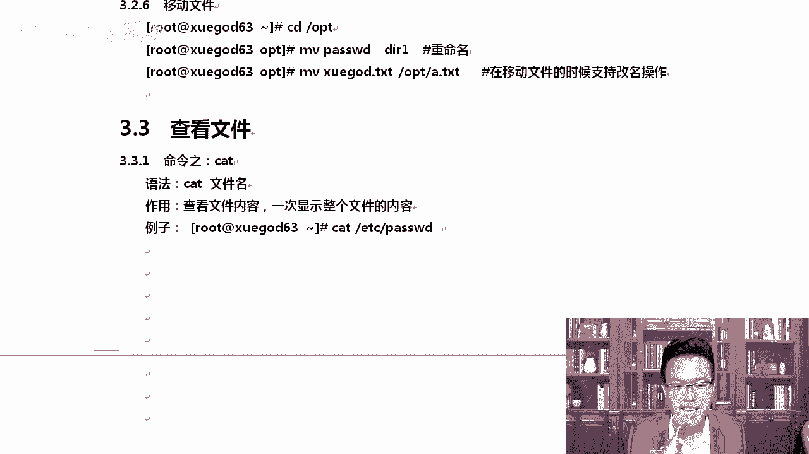

## 概述

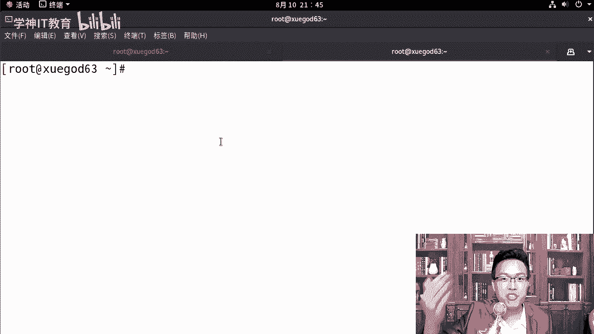

文件查看命令允许我们以不同方式读取文件内容。根据文件大小和查看需求，我们可以选择一次性显示全部内容、分页浏览或只查看文件的开头或结尾部分。本节将详细介绍 `cat`、`more`、`less`、`head` 和 `tail` 命令的用法与区别。

## 一次性查看全部内容：`cat` 命令

`cat` 命令用于一次性显示文件的全部内容。其语法非常简单，直接在命令后跟上文件名即可。

**语法**：
```bash
cat <文件名>
```


例如，查看 `/etc/passwd` 文件：
```bash
cat /etc/passwd
```

**作用**：`cat` 命令会将文件的所有内容瞬间输出到屏幕上。因此，如果文件内容非常多（例如一个大型日志文件），使用 `cat` 会导致屏幕快速滚动，难以看清具体内容，尤其是开头几行的信息。

## 分页查看文件：`more` 与 `less` 命令

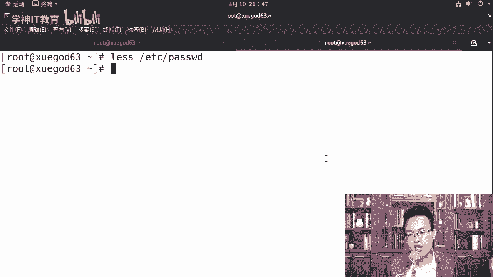

当文件内容较长时，我们需要能够逐页浏览的命令。`more` 和 `less` 命令就是为此设计的。

上一节我们介绍了 `cat` 命令的局限性，本节中我们来看看两个强大的分页查看工具。

### `more` 命令

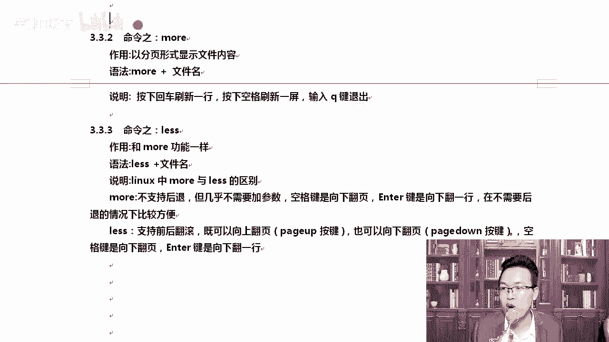

`more` 命令以分页形式显示文件内容，允许用户逐行或逐屏向下浏览。

**语法**：
```bash
more <文件名>
```

**基本操作**：
*   按下 **回车键**：向下滚动一行。
*   按下 **空格键**：向下滚动一屏。
*   输入 **q**：退出查看。

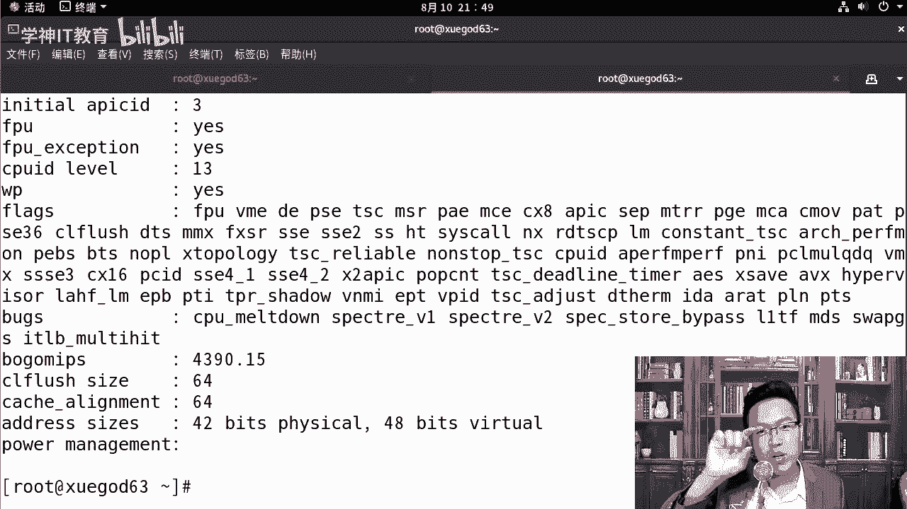

`more` 命令的特点是**只能向前翻页，不能后退**。浏览到文件末尾后，命令会自动退出。

### `less` 命令

`less` 命令同样用于分页查看文件，但功能比 `more` 更强大。

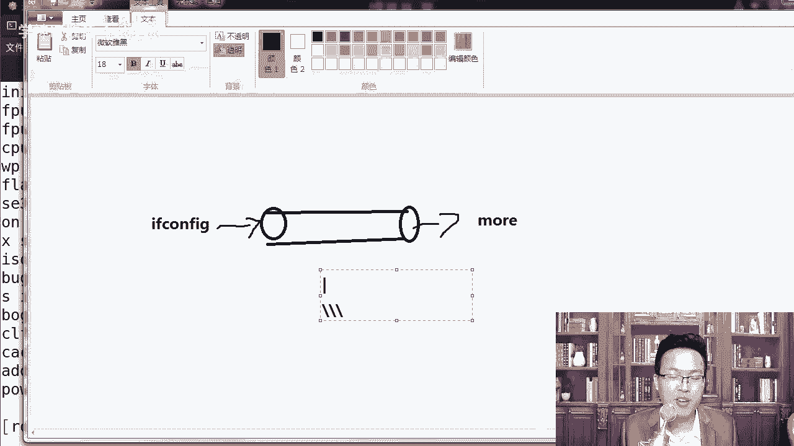

**语法**：
```bash
less <文件名>
```

**基本操作**：
*   按下 **空格键** 或 **Page Down**：向下翻一屏。
*   按下 **Page Up**：向上翻一屏。
*   按下 **回车键** 或 **向下箭头**：向下滚动一行。
*   按下 **向上箭头**：向上滚动一行。
*   输入 **/**，后接搜索词：在文件中向下搜索指定内容，搜索结果会高亮显示。
*   输入 **q**：退出查看。

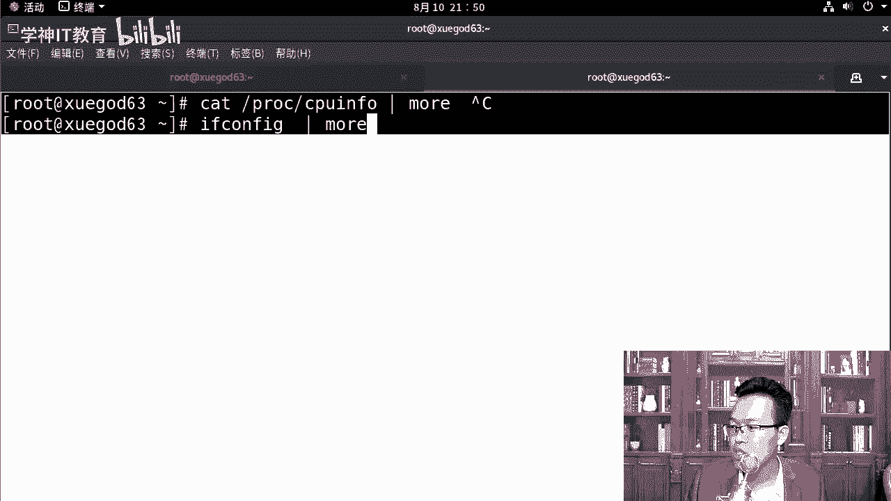

`less` 命令支持**前后翻页**，并且浏览到文件末尾不会自动退出，允许用户自由地来回查看。其搜索功能在查找特定信息时非常有用。


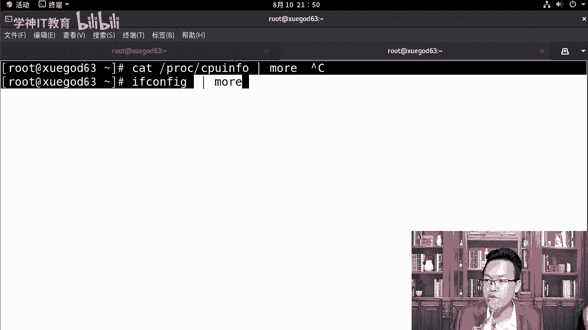

**使用场景对比**：
*   如果只是快速浏览一次，不需要来回翻看，`more` 命令因其简单直接，使用频率可能更高。
*   如果需要仔细研究文件内容，进行前后翻阅或搜索，`less` 命令是更佳选择。

## 管道符 `|` 的妙用


在实际工作中，我们经常需要查看某个命令输出的长文本。这时，管道符 `|` 就派上了用场。

管道符 `|` 的作用是将**前一个命令的输出**，作为**后一个命令的输入**。这允许我们将多个命令组合起来，实现更复杂的功能。

**语法结构**：
```
命令A | 命令B
```

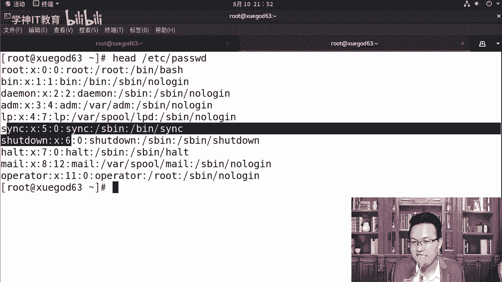

例如，`ifconfig` 命令会输出所有网络接口的详细信息，内容可能很多。我们可以通过管道将其输出传递给 `more` 命令进行分页查看：

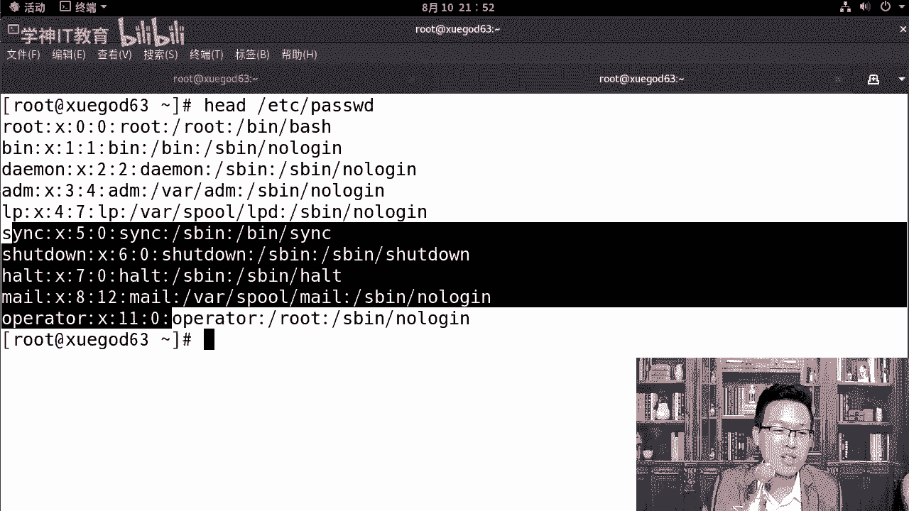

```bash
ifconfig | more
```


在这个例子中，`ifconfig` 的输出没有直接显示在屏幕上，而是通过管道“输送”给了 `more` 命令。`more` 再将这些信息以分页形式展示出来，方便我们阅读。

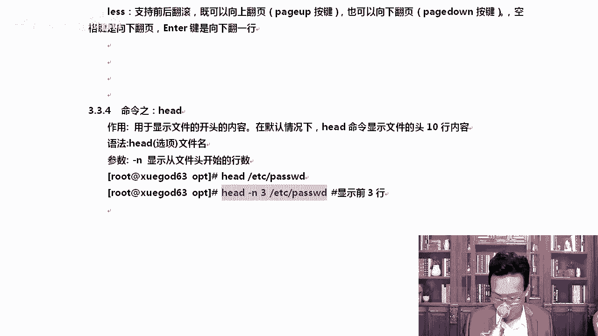

同样，查看CPU信息时也可以这样操作：
```bash
cat /proc/cpuinfo | more
```

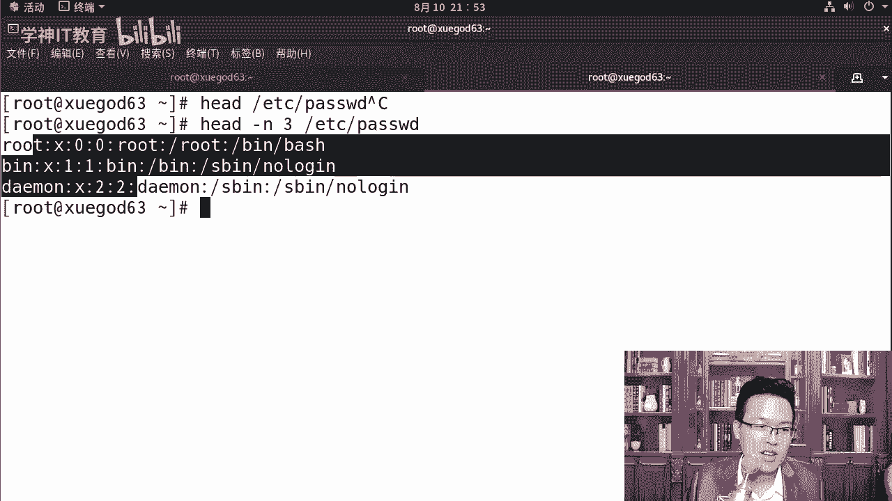

管道符是Linux命令行中一个极其强大的概念，它极大地增强了命令的灵活性和组合能力。

## 查看文件首尾：`head` 与 `tail` 命令

有时我们只关心文件的开头或结尾部分，例如查看配置文件的头部结构或监控日志文件的最新记录。`head` 和 `tail` 命令就是专门用于此目的。

### `head` 命令

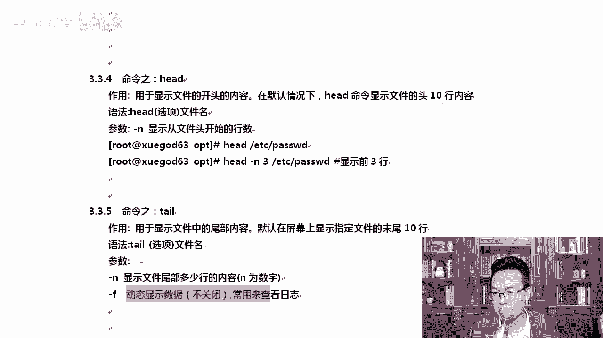

`head` 命令用于显示文件的开头若干行，**默认显示前10行**。

**语法**：
```bash
head <文件名>
```

**常用选项**：
*   `-n <行数>`：指定要显示的行数。
    ```bash
    head -n 5 /etc/passwd  # 只显示 /etc/passwd 文件的前5行
    ```

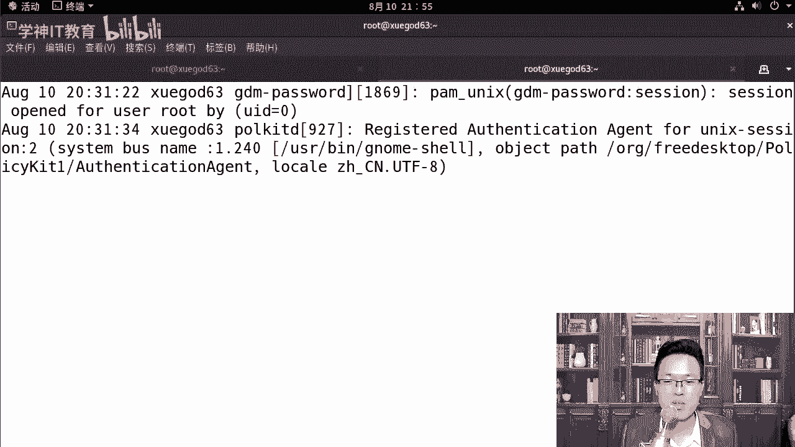

### `tail` 命令

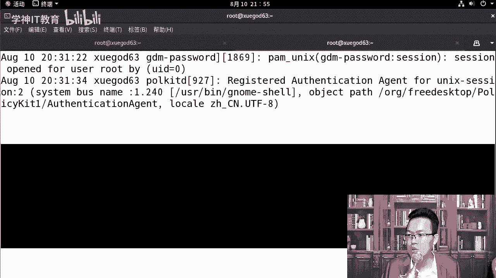

`tail` 命令用于显示文件的末尾若干行，**默认显示最后10行**。它在监控日志文件时尤其重要。

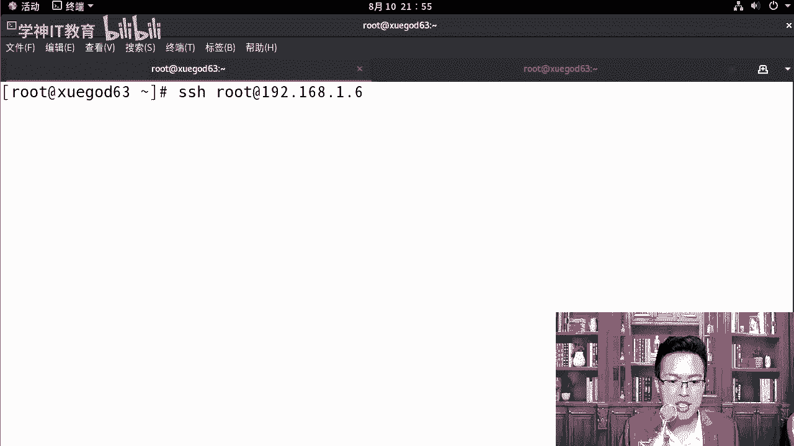

**语法**：
```bash
tail <文件名>
```

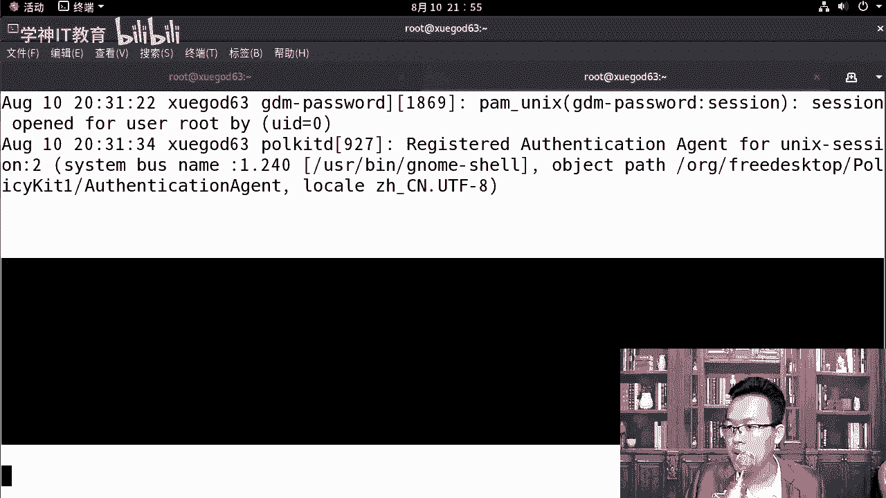

**常用选项**：
*   `-n <行数>`：指定要显示的行数。
    ```bash
    tail -n 3 /var/log/secure  # 显示 /var/log/secure 日志文件的最后3行
    ```
*   `-f`：动态跟踪并显示文件尾部新增的内容。这是**监控日志实时变化**的利器。
    ```bash
    tail -f /var/log/secure
    ```

**`tail -f` 实战示例**：
这个功能常用于故障排查。你可以在一个终端窗口执行 `tail -f` 实时监控日志，然后在另一个终端窗口执行某些操作（如SSH登录），观察日志中是否会实时产生对应的记录。要退出动态监控模式，按 **Ctrl+C** 即可。

## 总结

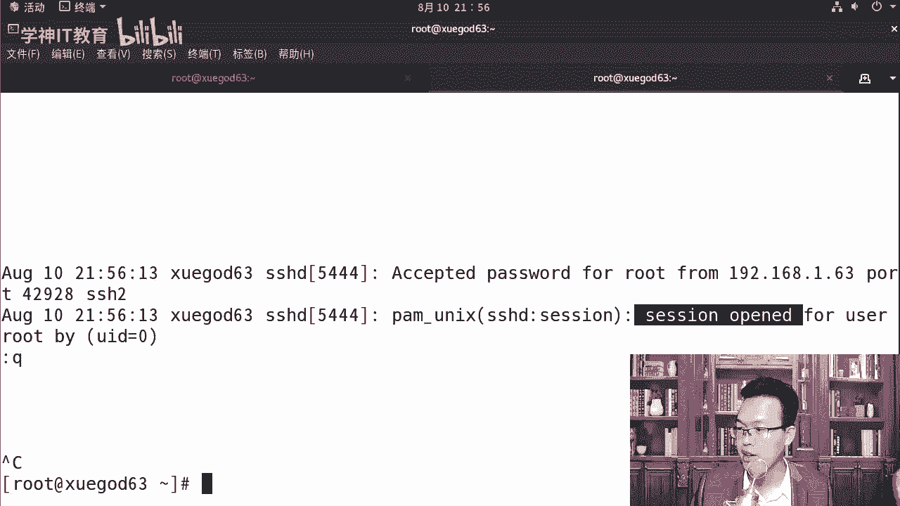

本节课中我们一起学习了Linux下五个核心的文件查看命令：
1.  **`cat`**：一次性显示文件所有内容，适合查看小文件。
2.  **`more`**：分页显示文件，只能向前翻页，操作简单。
3.  **`less`**：分页显示文件，功能强大，支持前后翻页和内容搜索。
4.  **`head`**：查看文件开头部分，默认显示前10行。
5.  **`tail`**：查看文件结尾部分，默认显示后10行，其 `-f` 选项可用于实时监控日志。

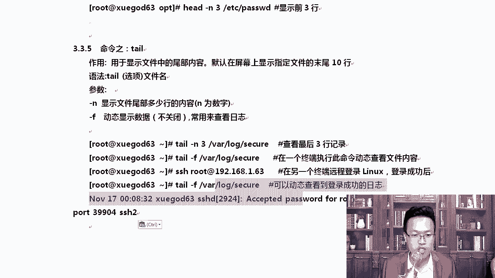

此外，我们还学习了**管道符 `|`** 的用法，它能将命令串联起来，让前一个命令的输出成为后一个命令的输入，极大地提高了命令行的工作效率。熟练掌握这些命令和技巧，是成为一名高效Linux运维工程师的基础。