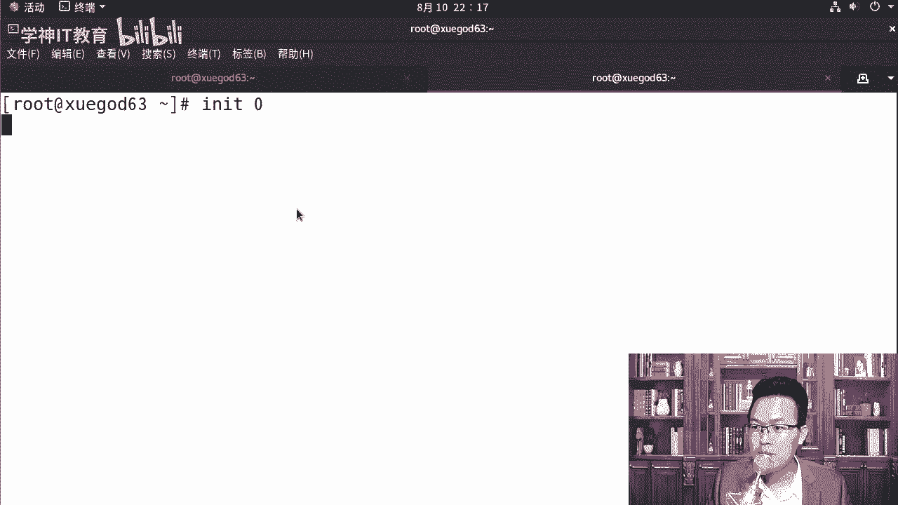
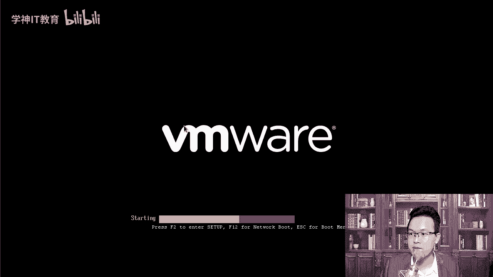
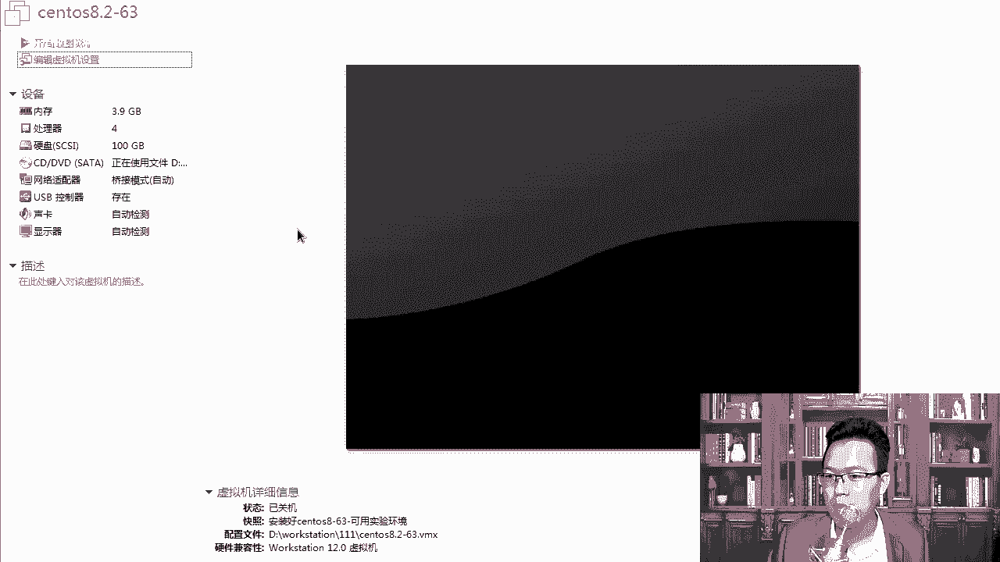
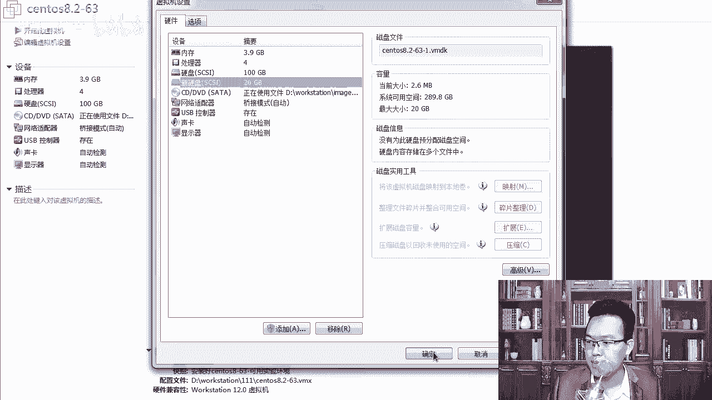
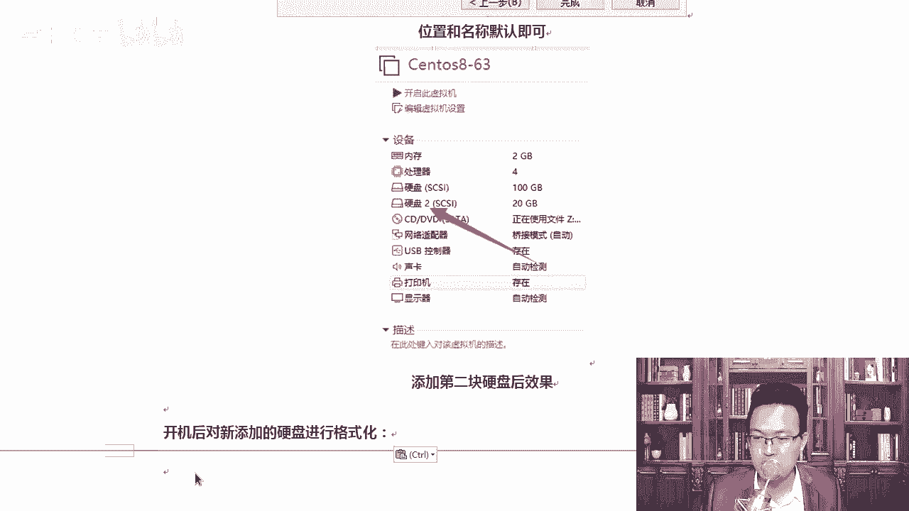

# Linux运维：P15：4-实战-xfs文件系统的备份和恢复-1 🔄

在本节课中，我们将要学习XFS文件系统的备份与恢复。XFS是一种现代的文件系统，自CentOS 7起被设为默认文件系统，专为处理大数据和高扩展性而设计。与传统的ext4文件系统不同，XFS本身不支持简单的数据恢复，因此定期备份至关重要。本节课我们将重点介绍XFS提供的专用备份与恢复工具。

## 概述：XFS文件系统简介

上一节我们介绍了文件系统的基本概念，本节中我们来看看XFS文件系统的特点。XFS是一个高性能的64位日志文件系统，特别适合处理大文件和海量存储。其核心优势包括：

*   **超大容量支持**：单个文件系统最大支持**8EB**（Exabyte），单个文件最大支持**16TB**。
*   **高性能与高扩展性**：专为并行I/O和大数据场景优化。
*   **在线备份（热备）**：无需卸载文件系统即可进行备份，类似于为虚拟机创建快照，保证了业务的连续性。

由于XFS没有像`extundelete`那样的简易恢复工具，一旦误删文件，恢复将非常困难。因此，掌握其自带的备份工具`xfsdump`和恢复工具`xfsrestore`是运维工作中的必备技能。

## 备份类型解析

在深入工具使用前，我们需要理解几种常见的备份策略。以下是三种主要备份类型的区别：

*   **完全备份**：备份选定范围内的所有数据。这是最基础的备份方式，类似于使用`cp`命令进行完整复制。
*   **增量备份**：备份自**上一次备份（无论完全或增量）之后**发生变化的数据。这种备份节省空间和时间，但恢复时需要按顺序应用所有增量备份。
*   **差异备份**：备份自**最后一次完全备份之后**发生变化的所有数据。恢复时只需要最后一次完全备份和最后一次差异备份。

为了直观地演示这些概念，特别是增量备份的工作流程，我们需要准备一个实验环境。

## 实验环境准备：添加新磁盘

为了清晰地演示备份过程，我们将为虚拟机添加一块新的磁盘作为备份目标。

1.  首先，关闭虚拟机电源。
2.  编辑虚拟机设置，点击“添加”按钮。
3.  选择“硬盘”类型，点击“下一步”。
4.  选择磁盘类型为“SCSI”，点击“下一步”。
5.  选择“创建新虚拟磁盘”，点击“下一步”。
6.  设置磁盘容量为 **20GB**，点击“下一步”直至完成。

添加完成后，启动虚拟机。新添加的磁盘需要经过分区、格式化和挂载后才能使用，这将在后续步骤中完成。

## 总结

本节课我们一起学习了XFS文件系统的基本特性及其备份的重要性。我们了解到，由于XFS不支持简易数据恢复，因此必须依赖其自带的`xfsdump`和`xfsrestore`工具进行备份与恢复。同时，我们辨析了完全备份、增量备份和差异备份的核心概念，并为接下来的实战操作准备好了实验环境。

在下一节中，我们将开始使用`xfsdump`命令，实际进行XFS文件系统的备份操作。