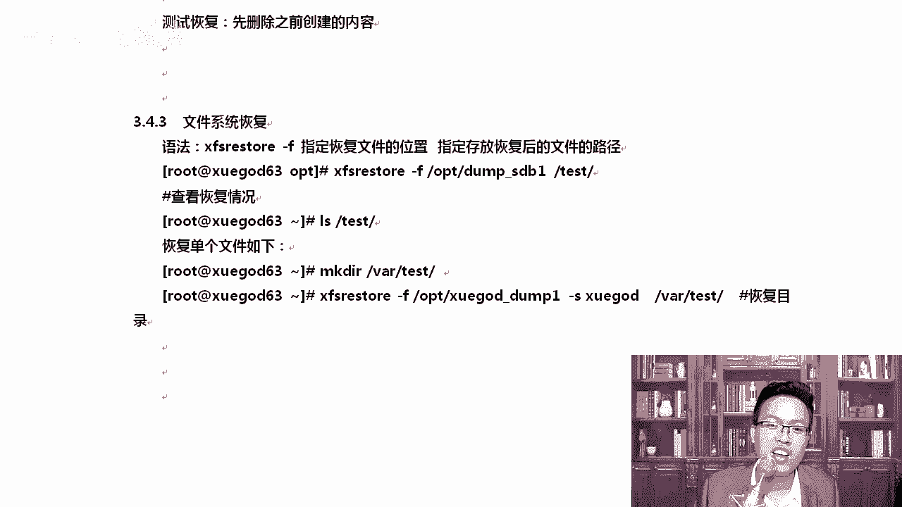
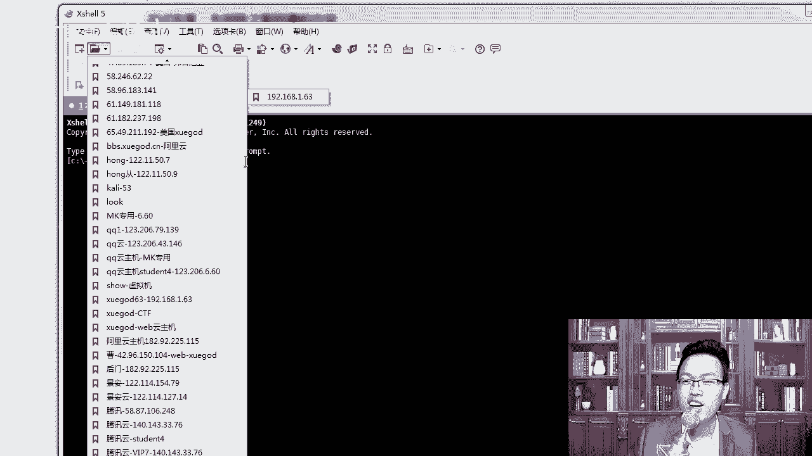
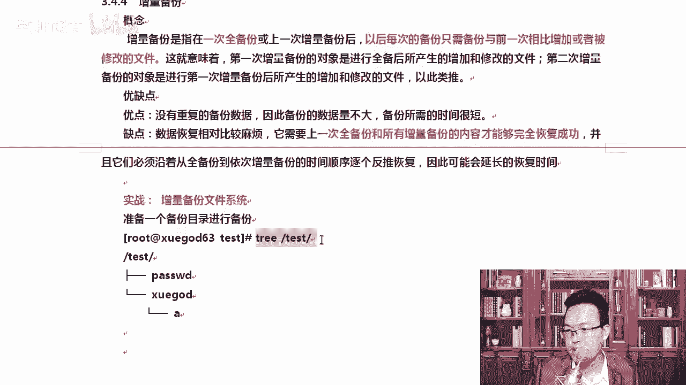
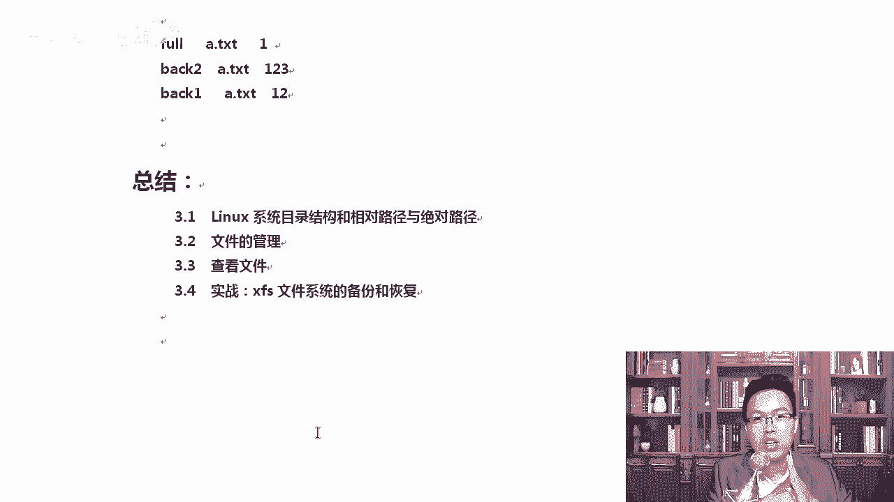

# Linux运维：P16：实战-XFS文件系统的备份和恢复-2

在本节课中，我们将学习如何在CentOS 8系统中对XFS文件系统进行备份和恢复。我们将从磁盘分区和格式化开始，逐步实践完全备份、增量备份以及数据恢复的全过程。通过本教程，您将掌握使用`xfsdump`和`xfsrestore`命令进行数据保护的核心技能。

## 磁盘分区与格式化

上一节我们介绍了XFS文件系统的基本概念，本节中我们来看看如何准备一个用于备份测试的磁盘分区。

首先，我们需要对新添加的磁盘进行分区和格式化。假设新磁盘设备名为`sdb`。

1.  使用`fdisk`命令对磁盘`sdb`进行分区。
    ```bash
    fdisk /dev/sdb
    ```
2.  在`fdisk`交互界面中，输入`n`创建新分区。
3.  选择分区类型为主分区（`p`），分区号使用默认值`1`。
4.  设置分区起始扇区，直接按回车使用默认值。
5.  设置分区大小，例如输入`+1G`创建一个1GB的分区。
6.  输入`w`将分区表写入磁盘并退出。

分区完成后，系统会多出一个设备`/dev/sdb1`。接下来，我们需要将其格式化为XFS文件系统，因为XFS特有的增量备份功能是我们的学习重点。

```bash
mkfs.xfs /dev/sdb1
```

格式化后，需要挂载该分区才能使用。我们在根目录下创建一个挂载点并进行挂载。

```bash
mkdir /test
mount /dev/sdb1 /test
```

现在，我们可以进入`/test`目录并创建一些测试数据，为后续的备份操作做准备。

```bash
cd /test
cp /etc/passwd ./
mkdir xuegod
touch xuegod/a
```

使用`tree`命令查看，当前测试数据结构如下：
```
.
├── passwd
└── xuegod
    └── a
```

## 执行完全备份

准备工作完成后，我们现在可以开始进行备份操作。首先进行的是完全备份。

`xfsdump`命令用于备份XFS文件系统。其基本语法为：
```bash
xfsdump -f <备份文件存放路径> <要备份的路径或设备>
```

以下是执行完全备份的步骤：
1.  对挂载点`/test`（即`/dev/sdb1`）进行完全备份，并将备份文件存放到`/opt/dump_sdb1`。
    ```bash
    xfsdump -f /opt/dump_sdb1 /dev/sdb1
    ```
2.  命令执行后，会交互式地要求输入两个标签：
    *   `session label`： 本次备份会话的标签，用于标识备份内容，例如输入`dump_sdb1`。
    *   `media label`： 存储设备的标签，用于描述备份源，例如输入`sdb1`。

为了便于自动化（如定时任务），我们可以使用参数来避免交互式输入，实现免交互备份。

```bash
xfsdump -f /opt/dump_sdb1_v2 /dev/sdb1 -L dump_sdb1_v2 -M sdb1
```
*   `-L` 参数指定会话标签。
*   `-M` 参数指定介质标签。

## 备份特定目录

有时我们不需要备份整个分区，而只想备份其中的某个特定目录或文件。`xfsdump`命令的`-s`参数可以实现此功能。

需要注意的是，`-s`参数后面指定的路径是相对于备份源的**相对路径**。

例如，我们只想备份`/test`目录下的`xuegod`子目录：
```bash
xfsdump -f /opt/dump_xuegod -s xuegod /dev/sdb1 -L dump_xuegod -M sdb1
```
这里，备份源是`/dev/sdb1`（即`/test`），`-s xuegod`表示备份该挂载点下的`xuegod`目录。

## 查看备份记录

执行多次备份后，可以使用`xfsdump -I`命令查看所有的备份记录。为了更清晰地浏览，可以结合`more`命令。

```bash
xfsdump -I | more
```
输出信息中会包含每次备份的`session label`和`media label`，这有助于我们在恢复时准确识别所需的备份文件。

## 恢复数据

数据恢复使用`xfsrestore`命令。其语法与`xfsdump`类似。



首先，我们模拟数据丢失，删除`/test`目录下的所有内容。
```bash
cd /test
rm -rf *
```

**恢复完全备份：**
将之前做的完全备份恢复到`/test`目录。
```bash
xfsrestore -f /opt/dump_sdb1 /test
```



**恢复特定目录：**
如果只想从备份中恢复某个特定目录（如`xuegod`），可以这样做：
1.  创建一个临时目录。
    ```bash
    mkdir /tmp/restore
    ```
2.  执行恢复，并指定`-s`参数。
    ```bash
    xfsrestore -f /opt/dump_xuegod -s xuegod /tmp/restore
    ```
    这样，`xuegod`目录及其内容就会被恢复到`/tmp/restore`目录下。

## 实施增量备份

增量备份是XFS文件系统的一大优势，它只备份自上次备份以来发生变化的数据，节省时间和空间。

增量备份需要指定备份级别（`-l` 参数，级别为0-9）。**0级代表完全备份**，1级备份是基于0级备份后的变化，2级备份是基于1级备份后的变化，依此类推。

以下是增量备份的实战步骤：




1.  **执行完全备份（0级）：**
    ```bash
    xfsdump -l 0 -f /opt/test_full /test -L test_full -M sdb1
    ```

2.  **创建一些新数据，然后执行1级增量备份：**
    ```bash
    touch /test/a.txt /test/b.txt
    xfsdump -l 1 -f /opt/test_back1 /test -L back1 -M sdb1
    ```

3.  **再创建一些新数据，然后执行2级增量备份：**
    ```bash
    touch /test/c.txt
    xfsdump -l 2 -f /opt/test_back2 /test -L back2 -M sdb1
    ```

现在，我们再次清空`/test`目录，然后演示如何恢复这套“完全备份+增量备份”的数据。

**恢复数据必须严格按照备份顺序进行：**
1.  先恢复完全备份。
    ```bash
    xfsrestore -f /opt/test_full /test
    ```
2.  接着恢复1级增量备份。
    ```bash
    xfsrestore -f /opt/test_back1 /test
    ```
3.  最后恢复2级增量备份。
    ```bash
    xfsrestore -f /opt/test_back2 /test
    ```

恢复完成后，使用`tree /test`或`ls /test`查看，所有文件（包括后来创建的a.txt, b.txt, c.txt）都应该完整存在。

> **重要提示：** 恢复时必须按备份顺序（0->1->2...）进行。如果顺序错乱，例如先恢复2级再恢复1级，可能导致文件内容被旧备份覆盖，无法得到完整正确的最新数据。

## 注意事项总结

在使用XFS备份与恢复功能时，请牢记以下几点：
*   `xfsdump`仅支持对已挂载的XFS文件系统进行备份。
*   操作通常需要`root`权限。
*   备份文件只能由`xfsrestore`命令解析恢复。
*   它是通过文件系统的UUID来识别备份源的，因此不能备份两个具有相同UUID的文件系统。
*   增量备份策略能极大提升备份效率，但恢复时务必注意顺序。



本节课中我们一起学习了XFS文件系统的备份与恢复。我们从磁盘分区格式化开始，实践了使用`xfsdump`进行完全备份、特定目录备份以及增量备份，并使用`xfsrestore`完成了数据恢复。掌握这些技能，能够帮助你在实际运维工作中有效地保护和恢复重要数据。记住，定期备份是系统安全中最重要且性价比最高的措施之一。