# Linux运维基础：P17：VIM编辑器基础操作与模式详解

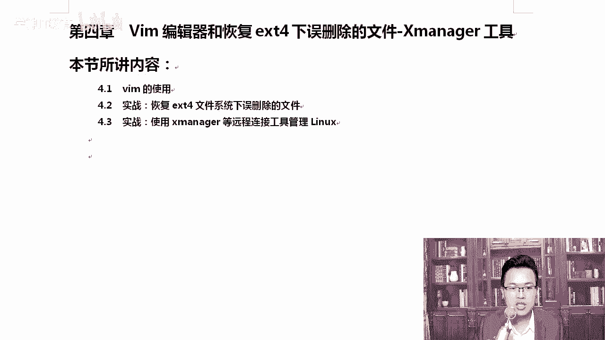

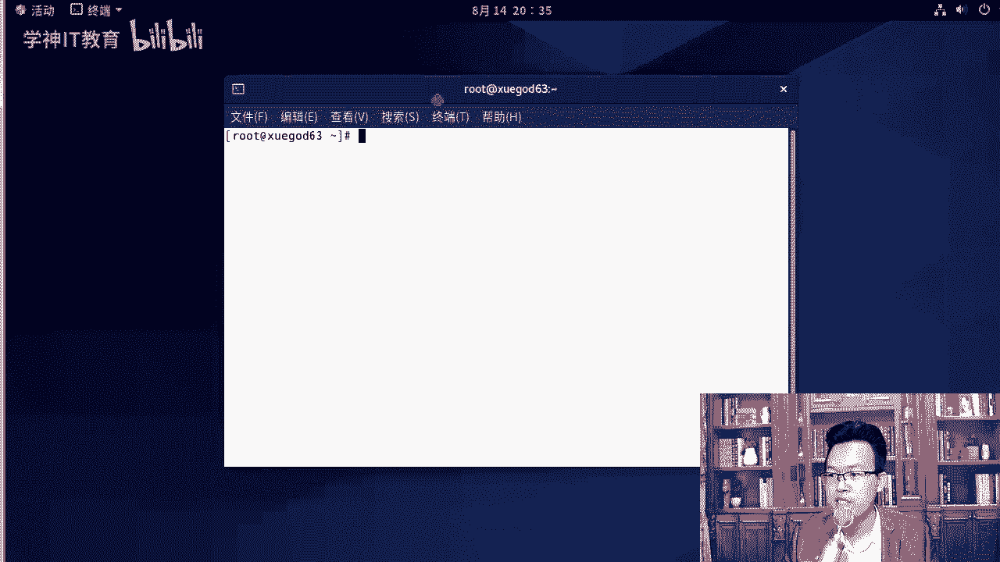

在本节课中，我们将学习Linux系统中至关重要的文本编辑器VIM。我们将详细介绍VIM的几种工作模式、常用快捷键以及如何在正常模式下进行高效的文本操作。掌握这些技能是进行Linux系统管理和配置的基础。

## VIM编辑器简介 🛠️

VIM是VI编辑器的增强版本，在Linux系统中被广泛使用。我们首先来了解VIM的基本信息及其与VI的关系。

使用 `which` 命令可以查看VIM和VI命令的安装位置：

```bash
which vim
which vi
```

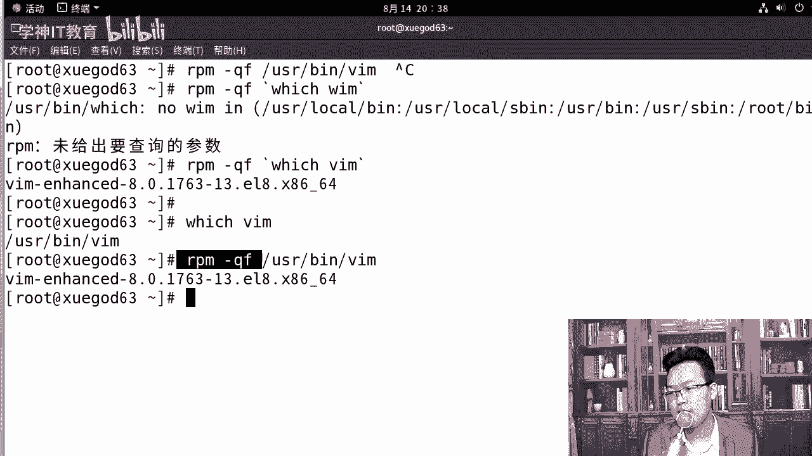

若要查询一个命令是由哪个软件包安装的，可以使用 `rpm -qf` 命令：

```bash
rpm -qf `which vim`
rpm -qf `which vi`
```

**`rpm -qf`** 命令用于查询指定文件所属的软件包。反引号 **`` ` ``** 的作用是先执行内部的命令，并将其输出作为外部命令的输入。

从查询结果可知，`vim` 通常由 `vim-enhanced` 包安装，而 `vi` 由 `vim-minimal` 包安装。因此，它们是两个独立的软件包。VIM是VI的增强版，最明显的区别是VIM支持语法高亮显示。

## VIM的四种工作模式 🔄

VIM编辑器主要包含四种工作模式，理解这些模式是熟练使用VIM的关键。

1.  **正常模式**：俗称命令模式。首次打开文件时即进入此模式，在此模式下可以执行各种编辑命令和快捷键操作。
2.  **插入模式**：俗称编辑模式。在此模式下，可以像普通文本编辑器一样输入和修改文本内容。
3.  **命令行模式**：在此模式下，可以输入VIM的命令，如保存、退出、查找替换等。
4.  **可视模式**：在此模式下，可以选择文本块进行操作。

刚打开文件时处于正常模式。按下 `i` 键进入插入模式，此时屏幕左下角会显示 `-- INSERT --`。在插入模式下，按下 `ESC` 键可返回正常模式。在正常模式下输入冒号 `:` 即可进入命令行模式。

## 进入插入模式的多种方法 ⌨️

在正常模式下，有多种快捷键可以进入插入模式，并且光标的位置会有所不同。

以下是进入插入模式的常用快捷键列表：
*   `i`：在当前光标位置之前插入。
*   `a`：在当前光标位置之后插入。
*   `o`：在当前行的下一行插入新行并进入插入模式。
*   `I`（大写）：移动光标到当前行行首，并进入插入模式。
*   `A`（大写）：移动光标到当前行行尾，并进入插入模式。

对于初学者，熟练掌握 `i` 和 `o` 即可满足大部分需求。使用键盘上的 `Home` 和 `End` 键也可以快速跳转到行首或行尾。

## 正常模式下的基础编辑快捷键 ✂️

在正常模式下，无需进入插入模式即可执行删除、撤销、替换等操作。

以下是正常模式下常用的编辑快捷键列表：
*   `x`：删除光标所在位置的字符（相当于 `Delete` 键）。
*   `X`（大写）：删除光标前一个位置的字符（相当于退格键）。
*   `u`：撤销上一次操作。
*   `Ctrl + r`：恢复被撤销的操作。
*   `r`：替换光标所在位置的一个字符。按下 `r` 后，再输入要替换成的字符即可。

例如，将光标下的数字 `0` 替换为 `1`，只需按下 `r`，再按下 `1`。

## 光标移动与快速定位 🎯

高效移动光标是提升编辑速度的关键。除了方向键，VIM提供了更便捷的移动方式。

在正常模式下，可以使用 `h`（左）、`j`（下）、`k`（上）、`l`（右）来移动光标。此外：
*   `0` 或 `Home` 键：跳转到当前行行首。
*   `$` 或 `End` 键：跳转到当前行行尾。
*   `gg`：跳转到文件第一行。
*   `G`（大写）：跳转到文件最后一行。
*   `:n`：跳转到第 `n` 行。例如，`:23` 跳转到第23行。

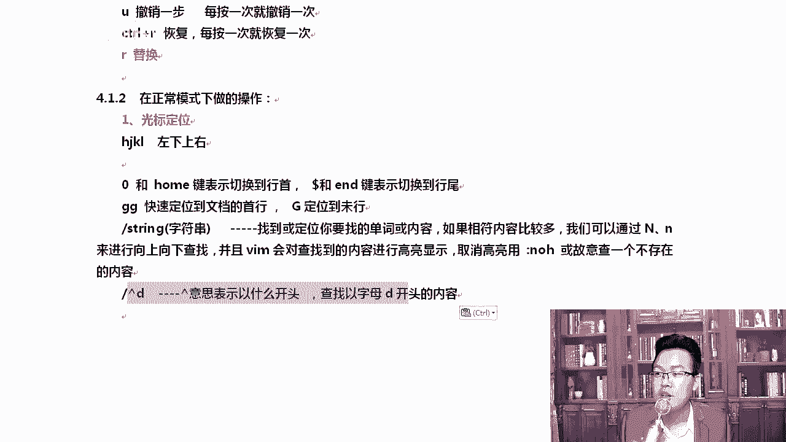

## 文本的查找与替换 🔍

VIM提供了强大的文本查找功能，能帮助我们在长文件中快速定位。

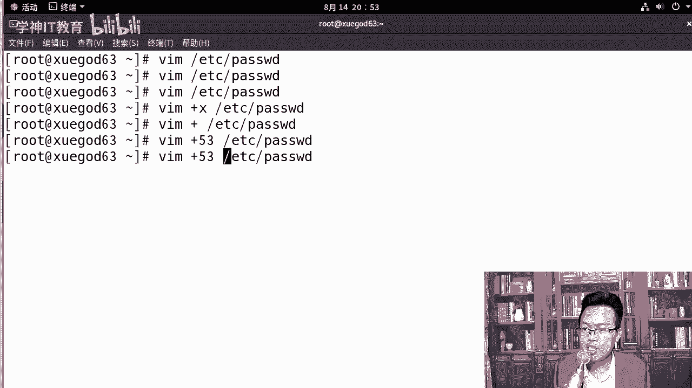

在正常模式下，输入 `/` 后跟要查找的字符串，然后按回车即可开始查找。例如，查找 `root`：
```
/root
```
查找结果会高亮显示。使用 `n` 键可以跳转到下一个匹配项，使用 `N`（大写）可以跳转到上一个匹配项。

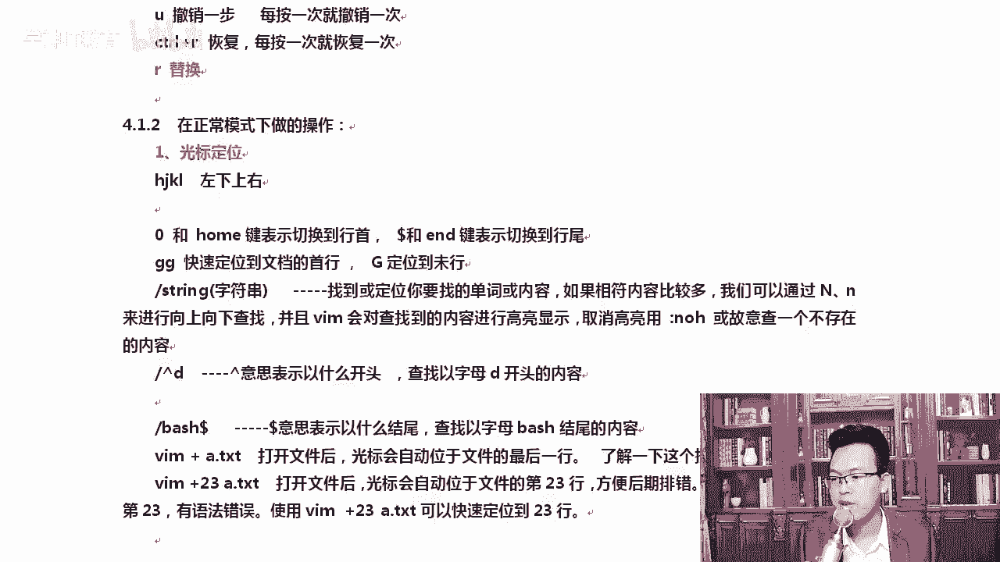

若要取消高亮显示，可以在命令行模式下输入：
```
:nohlsearch
```
或者简单地搜索一个文件中不存在的字符串，高亮也会消失。

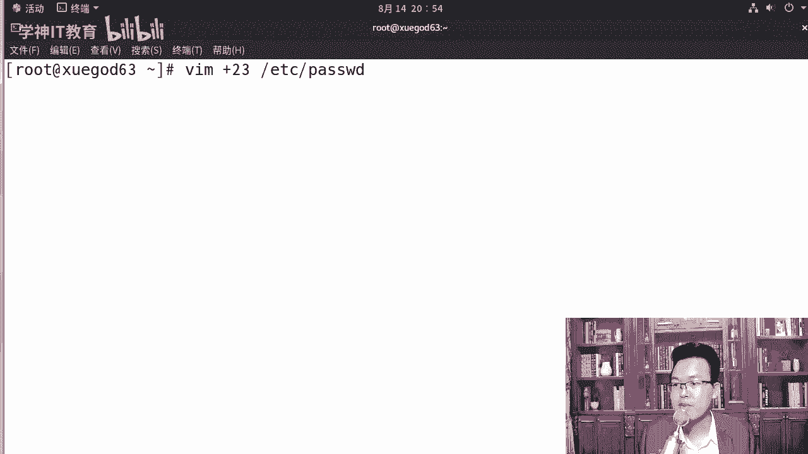

查找时可以使用正则表达式增强功能：
*   `^` 表示以...开头，如 `/^root` 查找以 `root` 开头的行。
*   `$` 表示以...结尾，如 `/bash$` 查找以 `bash` 结尾的行。

## 复制、剪切与粘贴 📋

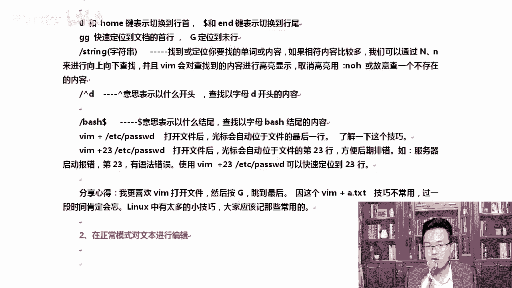

在正常模式下，可以对文本进行快速的复制、剪切和粘贴操作。

以下是复制、剪切与粘贴的常用命令列表：
*   `yy`：复制当前行。
*   `nyy`：复制从当前行开始的 `n` 行。例如，`3yy` 复制3行。
*   `dd`：剪切（删除）当前行。剪切的内容可以被粘贴。
*   `ndd`：剪切从当前行开始的 `n` 行。
*   `p`：将复制或剪切的内容粘贴到光标所在行的下一行。
*   `P`（大写）：粘贴到光标所在行的上一行。
*   `D`（大写）：剪切从光标处到行尾的所有内容。

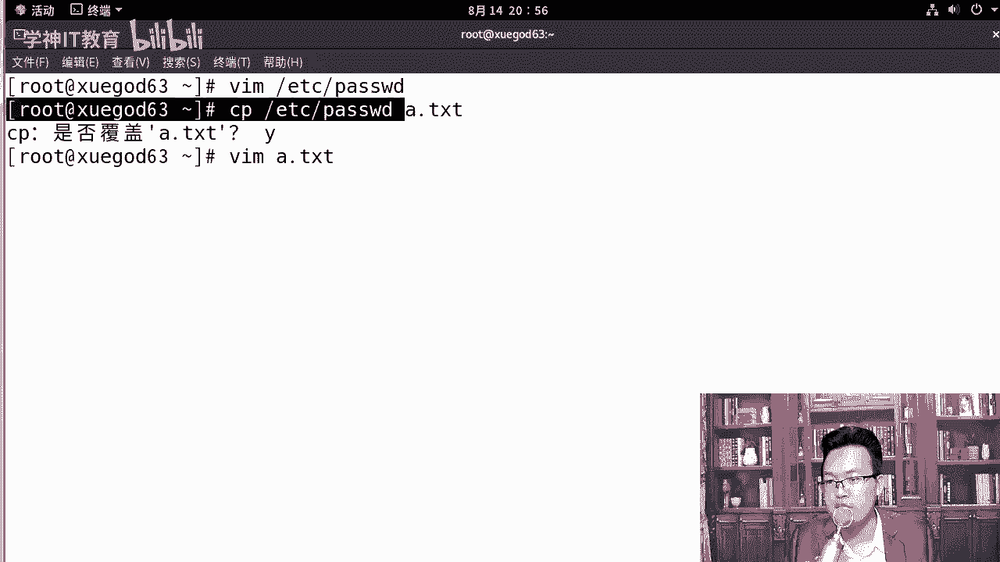

例如，复制两行：将光标移动到要复制的起始行，输入 `2yy`，然后移动光标到目标位置，按下 `p` 即可粘贴。

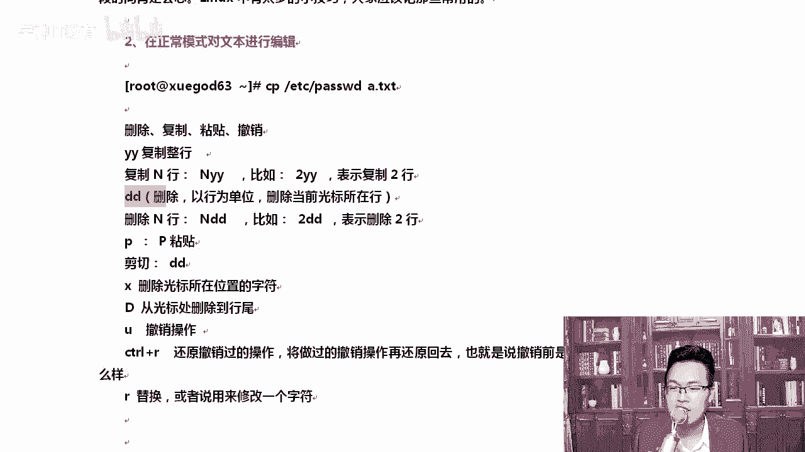

## 可视块模式 🧱

可视块模式允许我们以矩形区域的方式选择文本，便于进行列操作。

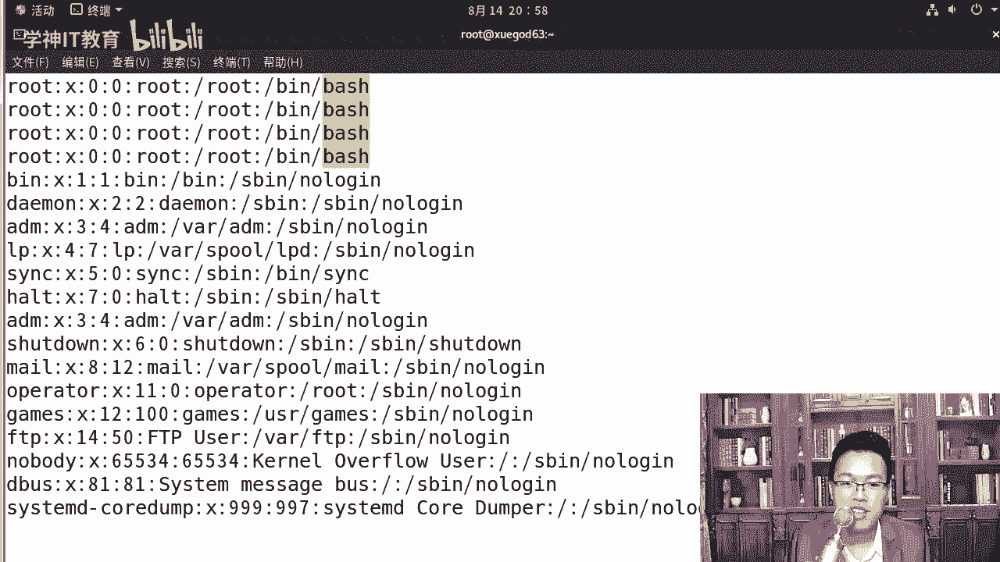

在正常模式下，按下 `Ctrl + v` 即可进入可视块模式。此时移动光标，可以选择一个矩形文本区域。选中后，可以进行删除（`d`）、复制（`y`）等操作，然后粘贴（`p`）。

例如，如果想在多行行首同时添加注释符 `#`，可以：
1.  将光标移动到第一行要添加 `#` 的位置。
2.  按下 `Ctrl + v` 进入可视块模式。
3.  向下移动光标，选中多行。
4.  按下 `Shift + i`（大写 I），输入 `#`，然后连续按两次 `ESC` 键，所选行的行首就会同时出现 `#`。

## 总结 📝

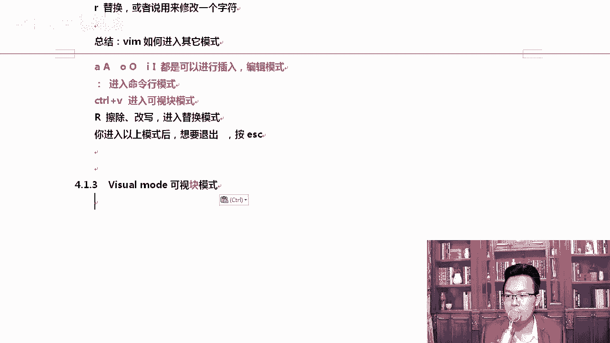

本节课我们一起深入学习了VIM编辑器的核心操作。我们首先区分了VIM与VI，并介绍了VIM的四种工作模式：正常模式、插入模式、命令行模式和可视模式。随后，我们详细讲解了如何在正常模式下进入插入模式、移动光标、进行查找替换、以及执行复制、剪切、粘贴等高效编辑操作。最后，我们了解了可视块模式的使用场景。记住，熟练使用VIM的关键在于多练习，并将常用的快捷键形成肌肉记忆。在接下来的课程中，我们将学习VIM更高级的配置和插件管理。