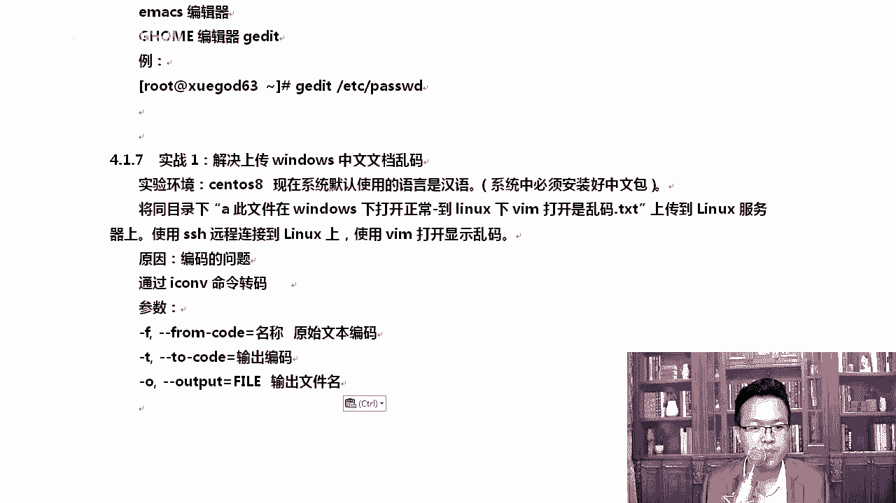
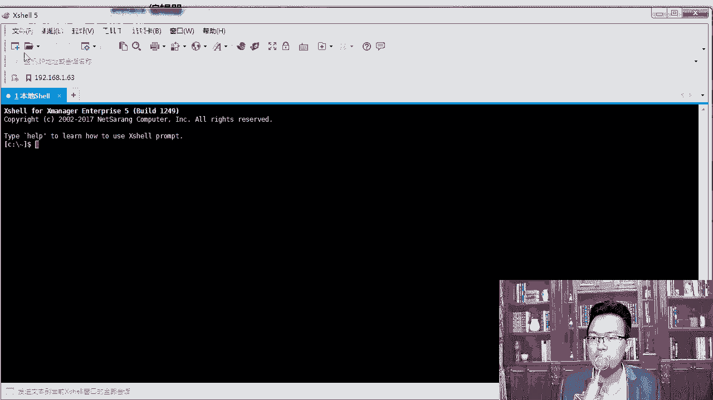
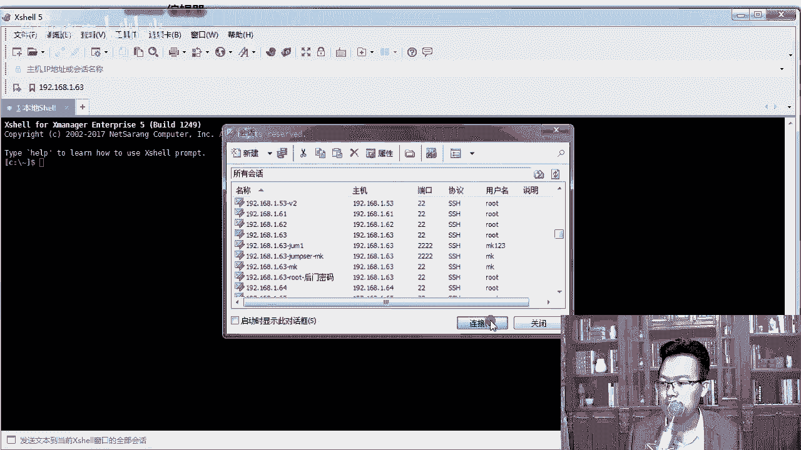
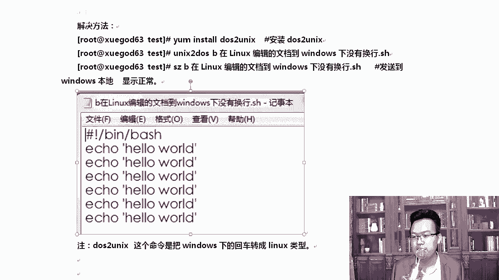

# CentOS8 操作系统从入门到精通：P19：3-实战-解决上传Windows中文文档乱码和串行的问题 📁

在本节课中，我们将学习两个在Linux运维工作中非常实用的项目实战：如何解决从Windows上传到Linux的中文文件乱码问题，以及如何解决Linux脚本在Windows下打开时换行符丢失（串行）的问题。掌握这些技能，能有效提升你的工作效率。

## 概述

在日常工作中，我们经常需要在Windows和Linux系统之间传输文件。由于两个系统默认的字符编码和换行符标准不同，常常会导致文件内容显示异常。本节将通过两个具体的实战案例，教你如何快速诊断和解决这些问题。





## 解决中文文件乱码问题 🔤



上一节我们介绍了Linux的基本操作，本节中我们来看看如何解决跨平台文件传输中的乱码问题。当我们将一个在Windows下显示正常的文件上传到Linux服务器后，用`cat`或`vim`命令查看时，可能会发现中文字符变成了一串乱码或方块。这通常是因为Windows系统默认使用GB2312或GBK编码，而Linux系统默认使用UTF-8编码。

以下是解决此问题的步骤：

1.  **安装文件传输工具**：首先，我们需要一个工具将文件从本地上传到Linux服务器。`rz`命令是一个常用的选择。如果你的系统没有安装，在CentOS 8中，系统可以自动提示并安装缺失的软件包。
    ```bash
    # 当输入rz命令未找到时，CentOS 8会自动提示安装
    rz
    # 根据提示输入‘y’确认安装
    ```

2.  **上传文件**：安装完成后，在终端（如Xshell、SecureCRT）中输入`rz`命令，选择需要上传的Windows中文文件。

3.  **转换文件编码**：上传后，使用`iconv`命令将文件从GB2312编码转换为UTF-8编码。其基本语法为：
    ```bash
    iconv -f 原编码 -t 目标编码 -o 输出文件名 输入文件名
    ```
    针对我们的情况，操作如下：
    ```bash
    # 将GB2312编码的文件转换为UTF-8编码
    iconv -f GB2312 -t UTF-8 -o 新文件名.txt 原乱码文件.txt
    ```
    转换完成后，再用`cat`命令查看新文件，中文就能正常显示了。

## 解决脚本换行符（串行）问题 ⏎

解决了编码问题，我们再来看看另一个常见问题。在Linux下编写的Shell脚本，用`cat`命令查看时格式正常，但下载到Windows后用记事本等工具打开，会发现所有内容都挤在一行，没有换行。这是因为Linux和Windows系统使用不同的字符表示换行。

*   Linux/Unix系统使用 **`\n`** (LF) 作为换行符。
*   Windows系统使用 **`\r\n`** (CRLF) 作为换行符。

以下是解决此问题的步骤：

1.  **安装格式转换工具**：我们需要使用`dos2unix`和`unix2dos`工具进行转换。通常这些工具已预装或可通过包管理器安装。
    ```bash
    # 如果未安装，可以使用yum安装
    sudo yum install dos2unix -y
    ```

2.  **转换文件格式**：将Linux格式的文件转换为Windows格式，使用`unix2dos`命令。
    ```bash
    # 将Linux格式文件转换为Windows格式
    unix2dos linux_script.sh
    ```
    转换后，文件会添加Windows所需的`\r\n`换行符。

3.  **下载文件到Windows**：使用`sz`命令可以将转换后的文件下载到本地Windows电脑。
    ```bash
    sz 转换后的文件.sh
    ```
    现在，在Windows下打开这个文件，换行就会正常显示。

## 总结

本节课中我们一起学习了两个重要的实战技能：
1.  使用 **`iconv`** 命令转换文件编码，解决因编码标准不同（GB2312 vs UTF-8）导致的中文乱码问题。
2.  使用 **`unix2dos`** 命令转换换行符格式，解决因换行符标准不同（`\n` vs `\r\n`）导致的脚本在Windows下串行的问题。



同时，我们还熟悉了在终端中使用 **`rz`** 上传文件和 **`sz`** 下载文件的操作。这些都是在Linux运维工作中处理跨平台文件时必备的经验，掌握它们能让你更从容地应对实际工作挑战。