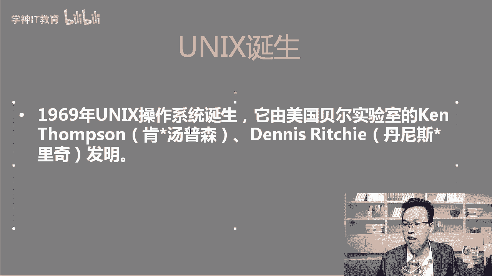
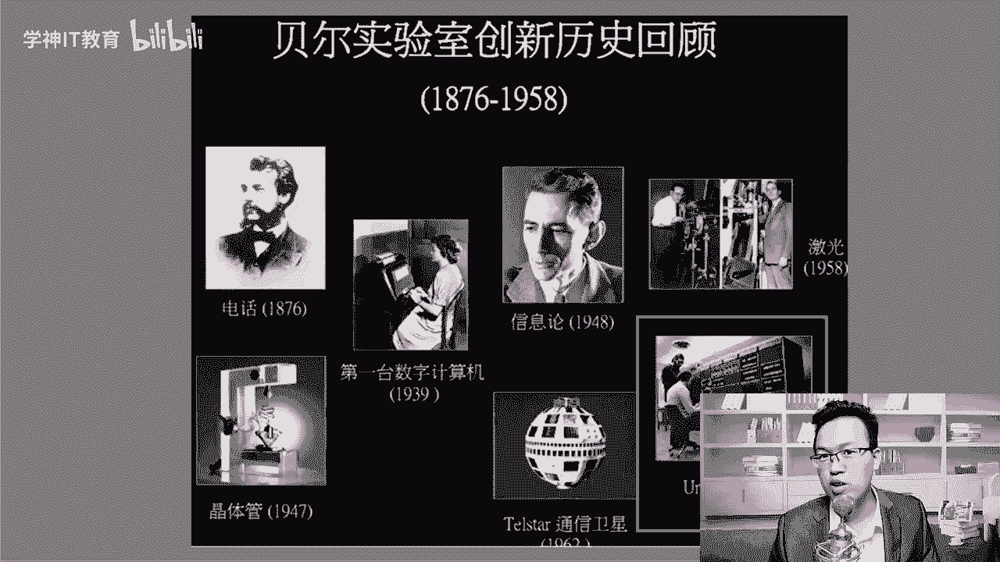
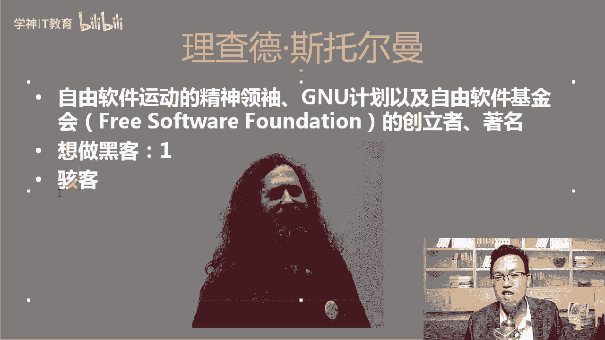
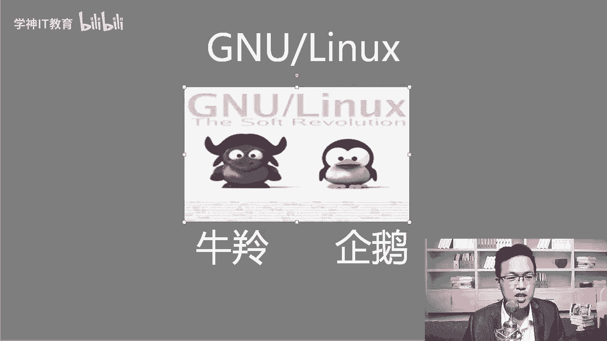
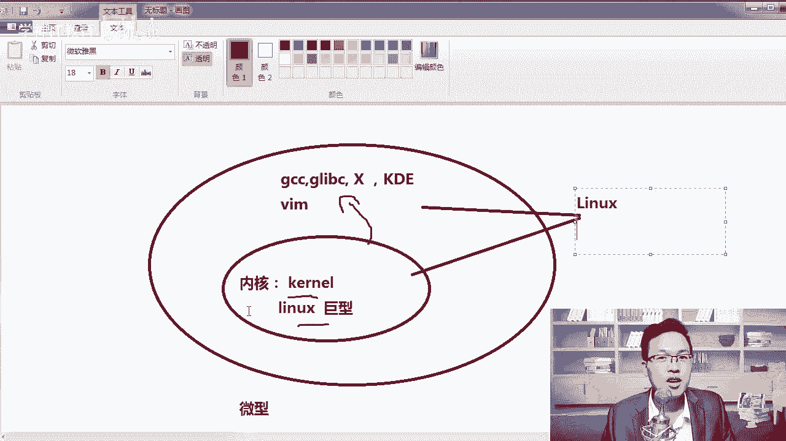
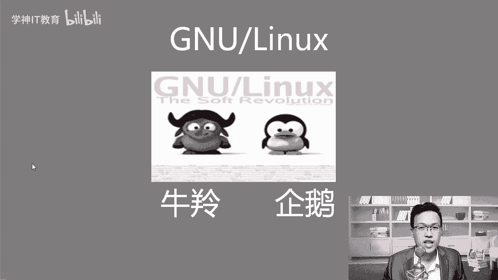

# Linux发展史：1：从Unix到Linux的演进之路 🐧

在本节课中，我们将要学习Linux操作系统的起源和发展历程。了解这段历史有助于我们理解Linux的设计哲学和开源精神，为后续深入学习打下基础。

## Unix的诞生与早期发展

上一节我们介绍了课程概述，本节中我们来看看Linux的源头——Unix系统。Unix系统诞生于1969年，由美国贝尔实验室的肯·汤姆森和丹尼斯·里奇共同创造。

贝尔实验室在历史上非常著名，第一台电话、第一个晶体管、第一台数字计算机以及卫星通信技术都诞生于此。该实验室在物理学领域获得了多项诺贝尔奖。

除了创建Unix系统，两位作者的另一项重要贡献是发明了C语言。C语言诞生于1972年，随后Unix系统使用C语言进行了重写。

最初Unix使用汇编语言编写，而汇编语言与硬件紧密相关，导致兼容性很差。例如，为AMD CPU编写的汇编程序可能无法在英特尔CPU上运行。C语言具有跨平台特性，使用标准C编写的程序可以在不同平台上编译和运行。

## Unix的开源与“百家争鸣”

为了让更多人使用Unix系统，开发者选择了开源。开源是一种有效的推广手段，类似于华为的鸿蒙操作系统和安卓系统采用的开源策略。

Unix开源后，许多机构和公司开始使用并发展它，其中最著名的版本是加州大学伯克利分校开发的BSD系统，后来发展为FreeBSD。

FreeBSD的吉祥物是一个手持三叉戟的小恶魔，而Linux的吉祥物是企鹅。

## 商业化的转折与Linux的诞生

Unix开源后，IBM、惠普等公司将其用于销售昂贵的大型机和小型机服务器。到了1990年，Unix的版权持有者AT&T（朗讯公司）意识到了其商业价值，开始起诉包括伯克利分校在内的许多厂商，要求支付版权费。

这一事件导致需要一个全新的、真正自由的操作系统。于是，Linux在1991年登上了历史舞台。

Linux的诞生离不开两个人的贡献：理查德·斯托曼和林纳斯·托瓦兹。

理查德·斯托曼是自由软件运动的精神领袖，也是GNU计划的创始人。GNU的意思是“GNU‘s Not Unix”，直译为“GNU不是Unix”，其目标是创建一个完全自由的操作系统，避免重蹈Unix后期闭源的覆辙。

林纳斯·托瓦兹则开发了Linux内核。当时GNU计划已经开发了操作系统所需的大部分组件，如GCC编译器、C语言标准库、图形界面等，但唯独缺少一个成熟稳定的内核。

林纳斯发布了一个**单内核**（也称为宏内核），并将其与GNU组织的软件相结合，快速形成了一个可用的操作系统。虽然从技术角度看，这或许不是最完美的方案（例如，与**微内核**架构相比），但它切实可行，满足了当时的需求。

## GNU/Linux系统的组成

最终形成的系统是GNU软件与Linux内核的结合体。严格来说，我们常说的“Linux”通常指其内核部分，而完整的操作系统应称为“GNU/Linux”。

以下是GNU/Linux系统的主要组成部分：
*   **内核**：由林纳斯·托瓦兹创建，负责管理硬件资源，是系统的核心。
*   **系统工具与软件**：由GNU项目提供，包括编译器、命令行工具、图形界面等，构成了操作系统的主体功能。

GNU项目为Linux系统提供了至关重要的支持。

## 总结与展望

本节课中我们一起学习了Linux的发展史。我们从Unix的诞生讲起，了解了C语言的重要性，经历了Unix的开源与商业化纠纷，最终看到了GNU项目与Linux内核如何结合，形成了今天强大且自由的操作系统。

理解这段历史，能让我们更深刻地体会开源协作的力量和技术演进的脉络。在接下来的课程中，我们将开始学习如何使用这个系统。

