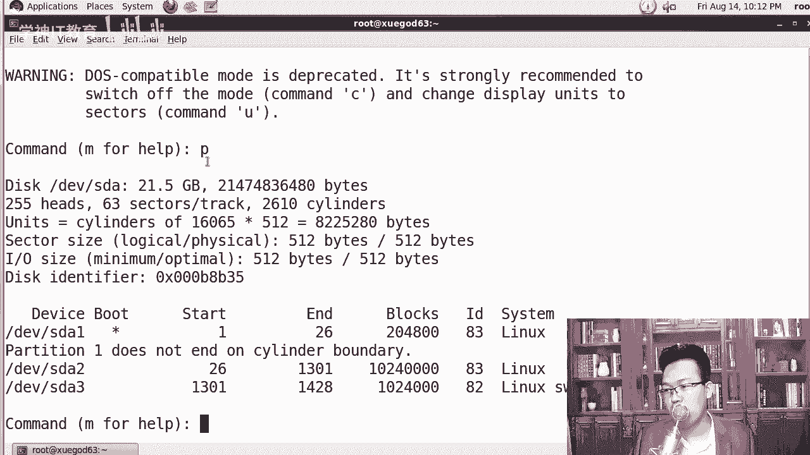
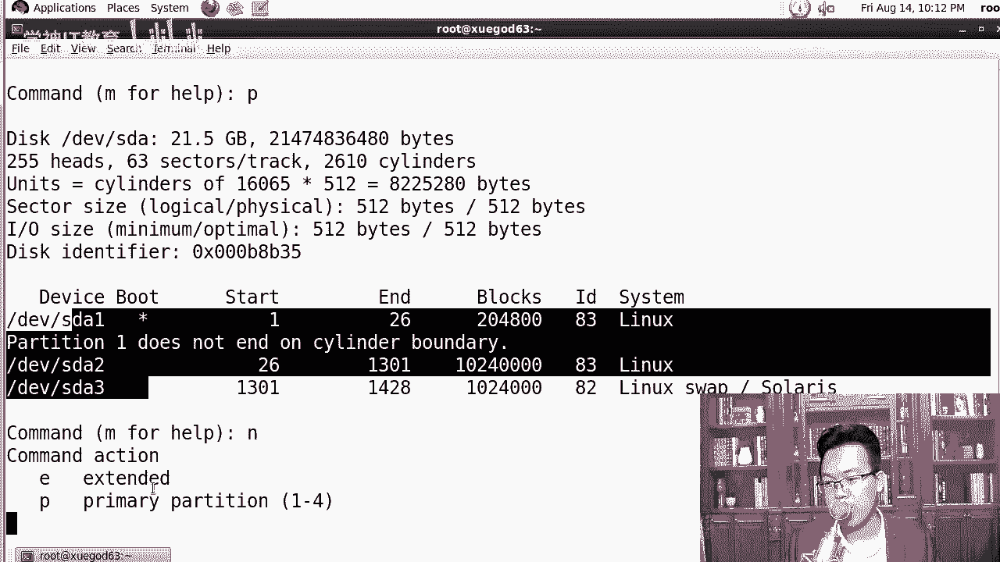
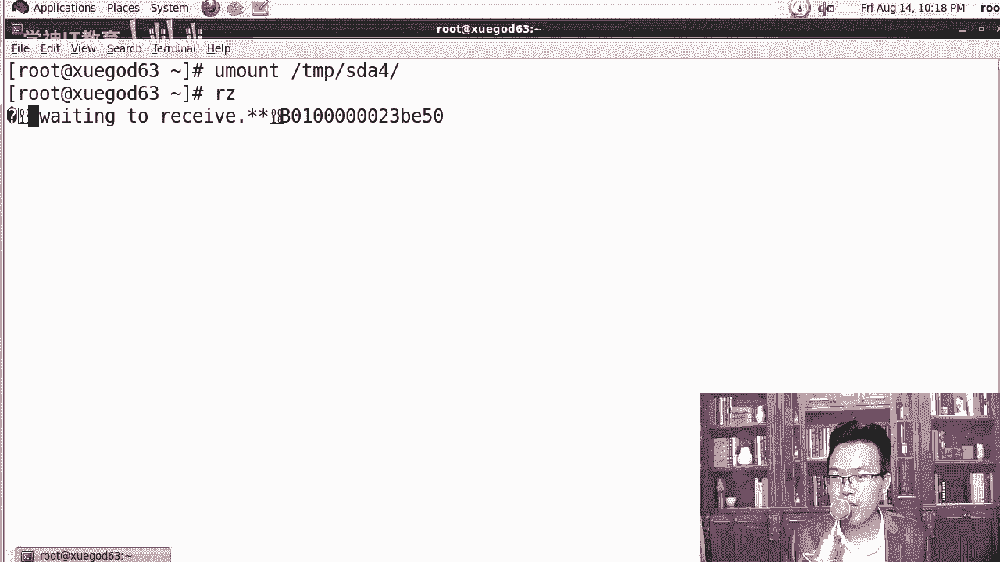
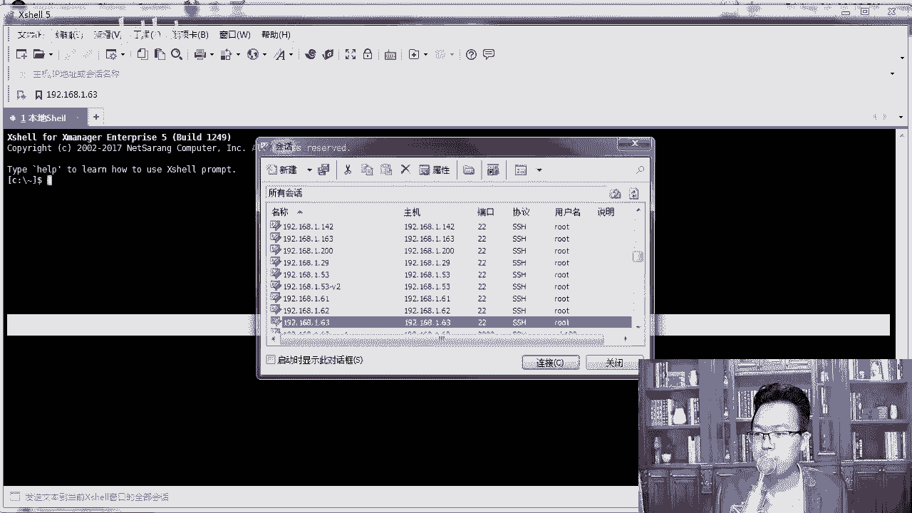
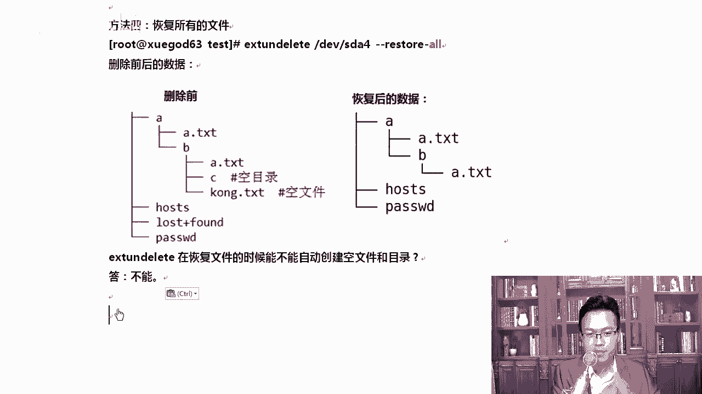

# Linux文件系统恢复：P20：4-实战-在Centos6上恢复ext4文件系统下误删除的文件

## 概述
在本节课中，我们将学习如何在CentOS 6系统上，恢复从ext4文件系统中误删除的文件。我们将了解文件删除的底层原理，并掌握使用`extundelete`工具进行数据恢复的完整流程。

## 文件删除与恢复原理
上一节我们介绍了课程主题，本节中我们来看看文件删除的底层原理。理解这个原理是成功恢复数据的关键。

在Linux文件系统中，一个文件主要由三部分组成：**文件名**、**inode**和**data block**。Windows系统其实也由类似的三部分组成。

*   **文件名**：如 `a.txt`，是用户访问文件的标识。
*   **inode**：存放文件的**元数据信息**，如文件大小、所有者、权限、时间戳以及指向数据块的指针。可以使用 `stat` 命令查看。
*   **data block**：存放文件**真正的数据内容**。

当我们执行删除命令（如 `rm -rf`）时，系统实际上只删除了**文件名**与**inode**之间的链接。inode和数据块本身并没有被立即擦除，只是被标记为“可被重新使用”的状态。只要这些空间没有被新数据覆盖，原文件就有被恢复的可能。

## 恢复前的关键准备
了解了原理后，我们知道防止数据被覆盖是恢复成功的前提。因此，一旦发现文件误删，必须立即采取以下措施：

以下是误删文件后必须立即执行的操作：
1.  **卸载文件所在分区**：执行 `umount /dev/sdX` 命令。如果文件在根分区，则需要关机或重启进入救援模式。
2.  **以只读方式挂载**：如果无法卸载，至少要以只读方式重新挂载分区，防止写入操作。
3.  **准备恢复环境**：将恢复工具安装到其他分区或外部存储（如U盘），避免对需要恢复的分区进行写操作。

## 实战：模拟与恢复误删文件
接下来，我们通过一个完整的实验来演示恢复过程。我们将在一个新分区上创建测试文件并删除，然后使用 `extundelete` 工具进行恢复。

### 步骤一：准备实验环境
首先，我们需要一个独立的分区来模拟数据误删场景，避免影响系统根分区。

以下是创建并格式化新分区的命令：
```bash
# 使用fdisk或parted创建新分区，例如 /dev/sda4
fdisk /dev/sda
# 在交互界面中创建新分区，然后保存退出





# 让系统重新读取分区表
partprobe /dev/sda

# 将新分区格式化为ext4文件系统
mkfs.ext4 /dev/sda4

# 创建挂载点并挂载新分区
mkdir /tmp/sda4
mount /dev/sda4 /tmp/sda4
```

### 步骤二：创建测试数据并删除
现在，我们在新分区上创建一些文件和目录结构，然后将其删除。



以下是创建测试文件并删除的命令：
```bash
# 进入挂载点
cd /tmp/sda4



# 复制一些系统文件作为测试内容
cp /etc/passwd ./
cp /etc/hosts ./

# 创建测试文件和目录结构
mkdir -p a/b/c
touch a.txt
touch empty.txt # 创建一个空文件
cp a.txt a/
cp a.txt a/b/

# 查看目录结构
tree /tmp/sda4

# 模拟误删除操作
rm -rf /tmp/sda4/*
```

### 步骤三：卸载分区并安装恢复工具
文件删除后，第一件事就是卸载该分区，然后安装恢复工具 `extundelete`。

以下是卸载分区和安装extundelete的命令：
```bash
# 退出分区挂载目录，然后卸载
cd /
umount /tmp/sda4

# 上传extundelete源码包并解压
tar -jxvf extundelete-*.tar.bz2

# 进入解压目录，编译安装
cd extundelete-*
./configure
make -j4 # 使用4个进程并行编译，加快速度
make install
```
**注意**：`make -j4` 能利用多核CPU加速编译过程。`install` 命令在复制文件时可以指定权限，这与 `cp` 命令不同。

### 步骤四：执行文件恢复
工具安装好后，我们就可以开始尝试多种恢复方式了。恢复的数据应保存到其他安全位置。

以下是几种不同的恢复方法：
1.  **通过inode号恢复**：适用于知道文件inode号的情况。
    ```bash
    extundelete /dev/sda4 --restore-inode 12
    ```
2.  **通过文件名恢复**：适用于记得文件名的情况。
    ```bash
    extundelete /dev/sda4 --restore-file passwd
    ```
3.  **恢复整个目录**：
    ```bash
    extundelete /dev/sda4 --restore-directory a/
    ```
4.  **恢复分区所有已删除内容**：
    ```bash
    extundelete /dev/sda4 --restore-all
    ```
恢复成功的文件会保存在当前目录下的 `RECOVERED_FILES` 文件夹中。可以使用 `diff` 命令对比恢复的文件与原始文件，没有输出则表示内容完全一致。

**重要提示**：`extundelete` 工具目前对 **ext3/ext4** 文件系统支持较好，对于 **xfs** 等其它文件系统，恢复能力有限或无开源工具可用，因此定期备份数据至关重要。

## 总结
本节课中我们一起学习了在CentOS 6的ext4文件系统上恢复误删除文件的全过程。我们首先探讨了文件删除的底层原理（只删除文件名索引），然后强调了恢复前防止数据覆盖的关键步骤（卸载分区）。最后，我们通过实战演练，使用 `extundelete` 工具演示了通过inode、文件名、目录等多种方式恢复数据的方法。



请记住，数据恢复并非百分之百成功，尤其是数据被覆盖后。因此，对于运维工作而言，**完善的备份策略永远是保护数据安全的第一道，也是最重要的一道防线**。