# CentOS8 操作系统从入门到精通：P21：5-实战-使用Xmanager等远程连接工具管理Linux 🖥️

在本节课中，我们将学习如何使用 Xmanager 等远程连接工具来高效、安全地管理 Linux 服务器。我们将重点介绍 Xmanager 的安装、配置、核心功能以及一些实用的高级技巧。

## 概述

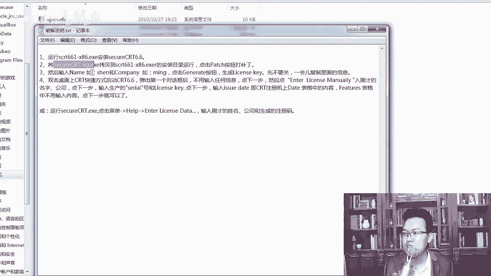

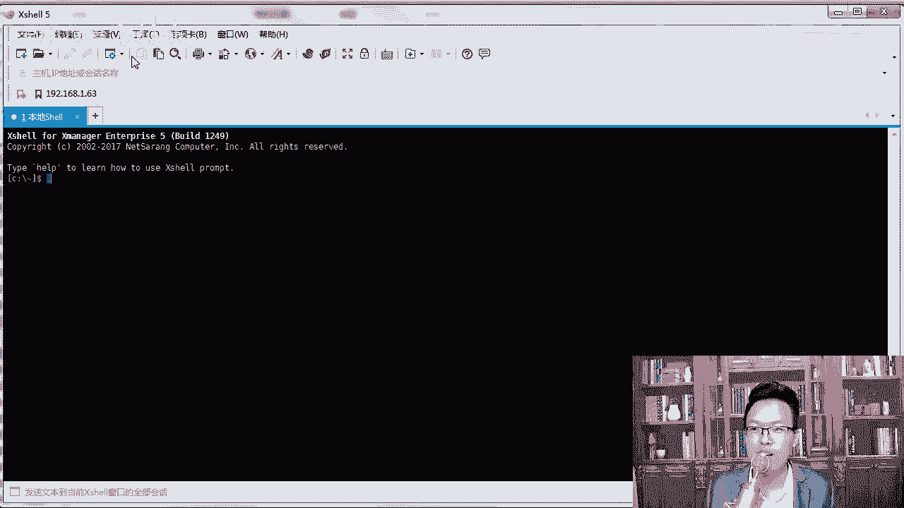

远程连接工具是运维人员管理 Linux 服务器的必备利器。市面上有多种工具，如 SecureCRT、Xshell、PuTTY 等，但它们在安全性、功能性和易用性上各有差异。本节将推荐并详细讲解 Xmanager 的使用方法，因为它集成了终端、文件传输和图形界面调用等多种功能，且安全性相对更有保障。

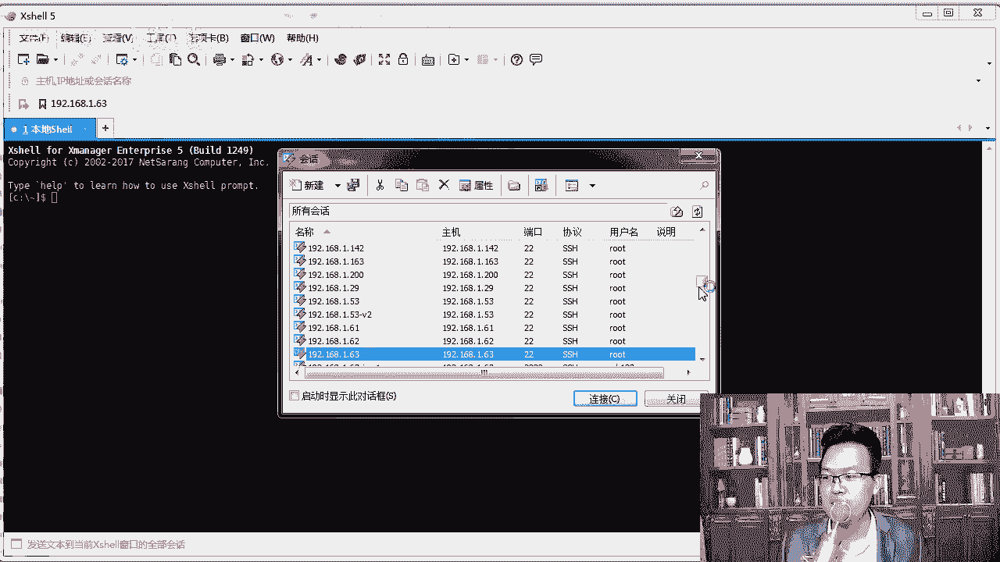

上一节我们介绍了 Linux 的基础网络配置，本节中我们来看看如何从外部便捷地连接和管理这些系统。

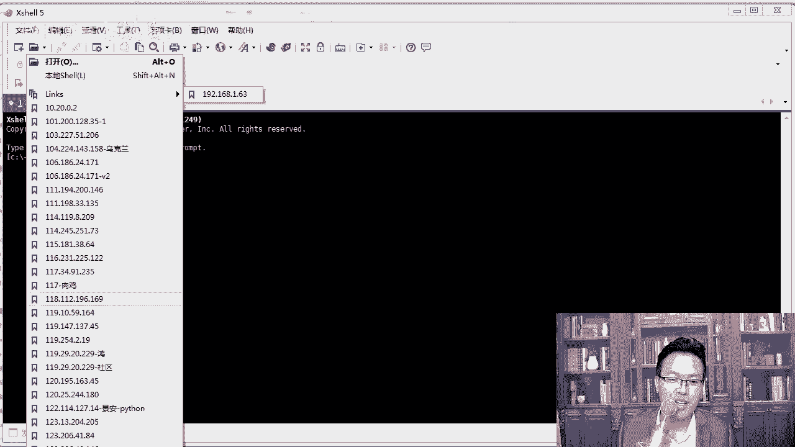

## 工具选择与安全性考量 💡

选择远程连接工具时，安全性是首要考虑因素。许多工具的破解版或某些官方版本曾被曝出存在后门程序。

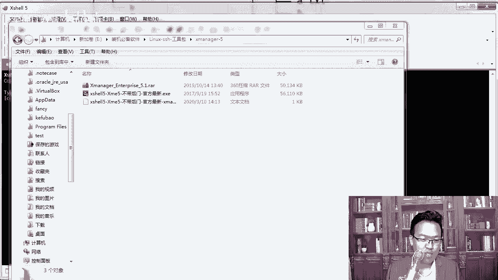

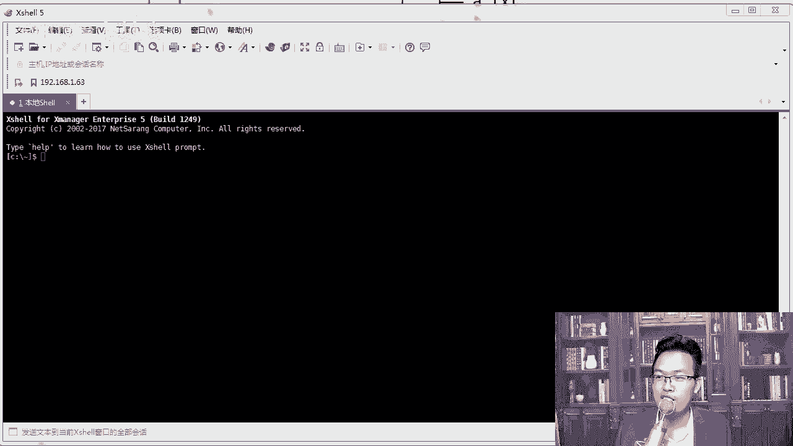

*   **风险示例**：使用需要打补丁的破解版时，杀毒软件可能会报警。如果连接工具本身被植入后门，那么通过它管理的所有服务器的账号密码都可能泄露。
*   **历史案例**：SecureCRT、PuTTY 以及 Xmanager 的某些历史版本都曾出现过官方版本携带后门的安全事件。
*   **推荐方案**：建议使用官方正版或已修复安全漏洞的稳定版本。例如，Xmanager 5 在修复相关漏洞后，是一个相对安全的选择。它只需输入序列号即可激活，避免了破解补丁可能带来的风险。

## Xmanager 组件简介 📦

Xmanager 是一个功能套件，安装后会在桌面创建一个包含多个图标的文件夹。

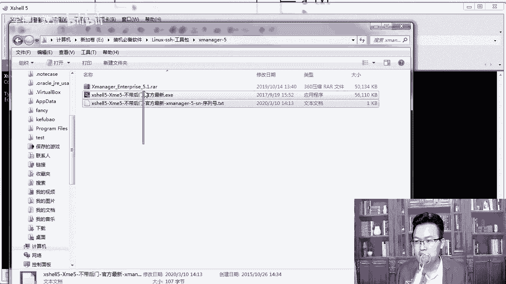

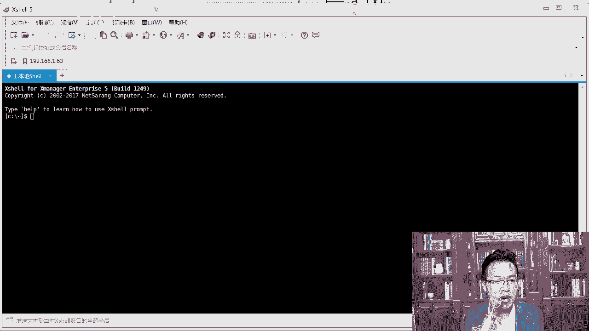

以下是其主要组件：
*   **Xshell**：功能强大的终端模拟器，用于 SSH 连接。
*   **Xftp**：安全的文件传输工具。
*   **Xlpd**：用于打印，使用较少。
*   **Xstart**：用于启动远程图形化应用程序。

其中，Xshell 和 Xftp 是日常管理中最常用的两个工具。

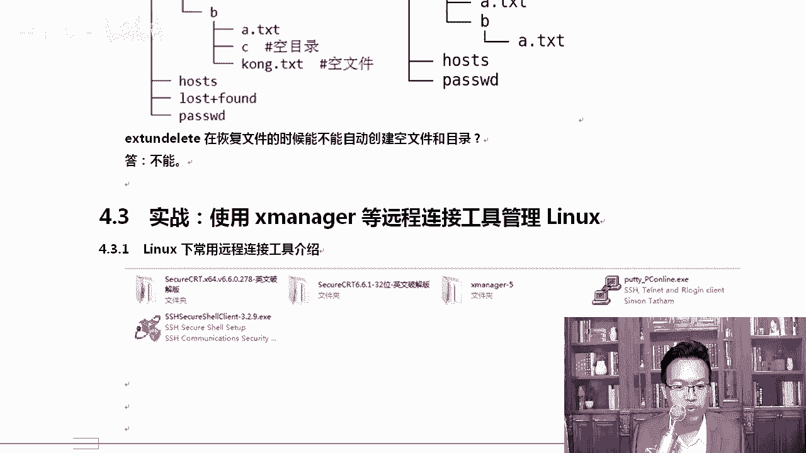

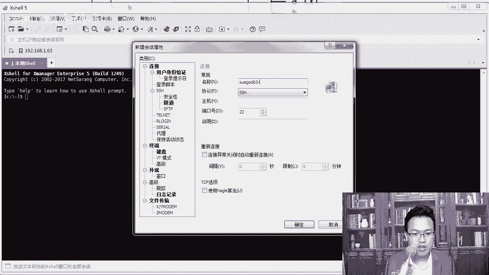

## 配置与使用 Xshell 🔧

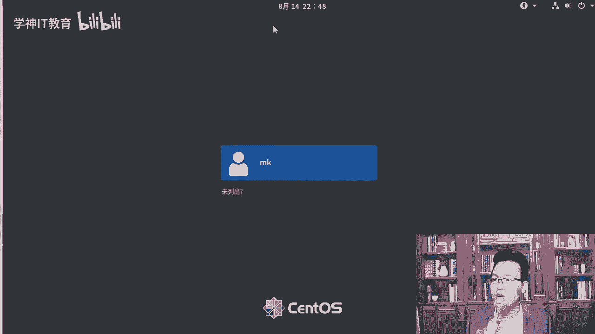

接下来，我们详细讲解如何使用 Xshell 创建和管理 SSH 连接。

### 创建新会话

1.  打开 Xshell，点击工具栏的 **“新建”** 按钮（或文件菜单中的新建会话）。
2.  在弹出的窗口中，配置连接信息：
    *   **名称**：为此连接设置一个易于识别的名字（如 `xuegod63`）。
    *   **协议**：选择 `SSH`。
    *   **主机**：填写目标 Linux 服务器的 IP 地址（如 `192.168.1.63`）。
    *   **端口号**：默认为 `22`。
3.  点击 **“用户身份验证”**。
    *   **方法**：选择 `Password`。
    *   **用户名**：输入 `root`。
    *   **密码**：输入对应的密码（如 `123456`）。
4.  点击 **“确定”** 保存会话。

### 优化终端设置

默认字体可能较小，可以进行优化以提升使用体验。

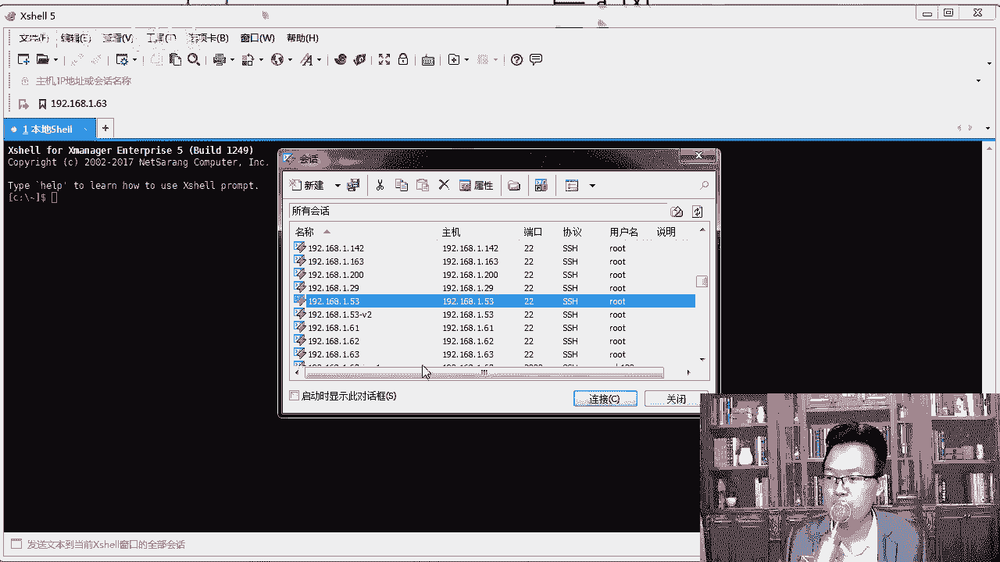

以下是调整外观和传输设置的步骤：
*   **调整字体**：在会话属性中，进入 **“外观”** 类别，将字体大小调整为 `18` 号左右。
*   **设置传输路径**：进入 **“文件传输”** 类别下的 **“ZMODEM”** 标签页。
    *   **下载的文件夹**：设置文件下载到本地的默认路径（如 `E:\soft`）。
    *   **加载的文件夹**：设置文件上传时的默认本地源路径。
    *   这样配置后，使用 `rz`（上传）和 `sz`（下载）命令时会自动使用这些路径。

### 连接与基本操作

保存会话后，在会话管理器列表中双击该会话名称即可连接。首次连接某台主机时，会弹出 **“SSH安全警告”**，显示主机密钥指纹，确认后选择接受并保存，以后连接便不再提示。

连接成功后，即可在终端中执行 Linux 命令。

## Xmanager 高级功能 🚀

Xmanager 提供了一些能极大提升运维效率的高级功能。

### 批量命令执行

当需要同时在多台服务器上执行相同命令时（例如搭建集群），此功能非常有用。

1.  打开多个终端标签页，分别连接到不同的服务器（如 `192.168.1.63`， `.64`， `.65`）。
2.  点击菜单栏的 **“查看”** -> **“撰写窗格”**，或使用快捷键调出撰写窗口。
3.  在撰写窗口中输入命令（例如 `yum install httpd -y`）。
4.  在 **“发送到”** 下拉菜单中选择 **“所有会话”**。
5.  点击 **“发送”** 按钮，该命令将同时在所有已连接的终端中执行。

### 使用 Xftp 进行文件传输

`rz`/`sz` 命令适合传输单个文件，而传输整个文件夹则需要使用 Xftp。

1.  在已连接的 Xshell 会话中，点击工具栏上的 **“Xftp”** 按钮。
2.  Xftp 会自动启动，并基于当前 Xshell 的连接信息建立 SFTP 会话。
3.  界面分为左右两栏：左侧是本地计算机目录，右侧是远程 Linux 服务器目录。
4.  只需在两侧窗口之间拖拽文件或文件夹，即可完成上传或下载操作。

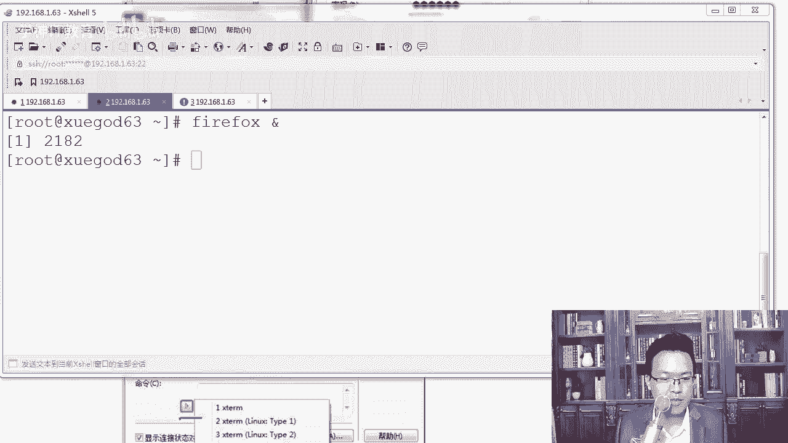


### 调用远程图形界面

对于安装了图形界面的 Linux 服务器，可以通过 Xshell 直接调用其图形程序到本地 Windows 显示，这对于安装 Oracle 等需要通过图形界面完成的软件非常方便。

**调用方法**：
在 Xshell 终端中，直接运行图形程序命令即可。例如，运行 `firefox` 或 `gnome-terminal`。
```bash
firefox &
```
执行后，Linux 上的 Firefox 浏览器窗口将会在您的 Windows 桌面上弹出。

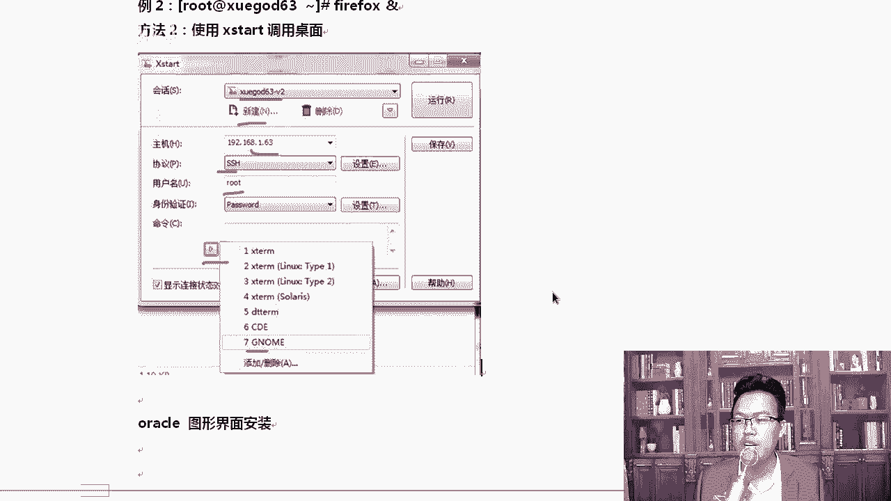

**重要前提**：
*   目标 Linux 服务器必须已安装图形桌面环境（如 GNOME）以及要运行的图形程序。
*   此功能依赖于 Xmanager 套件中的 X 服务器组件来转发图形显示。

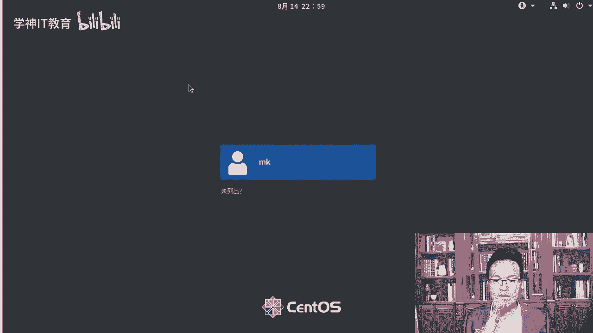

如果直接运行程序调用较慢或有问题，也可以尝试使用 **Xstart** 组件来启动完整的桌面会话，但这会占用更多资源。

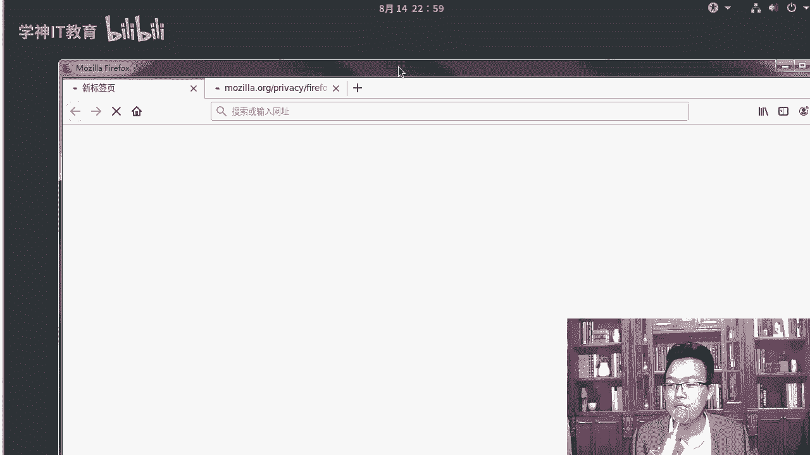

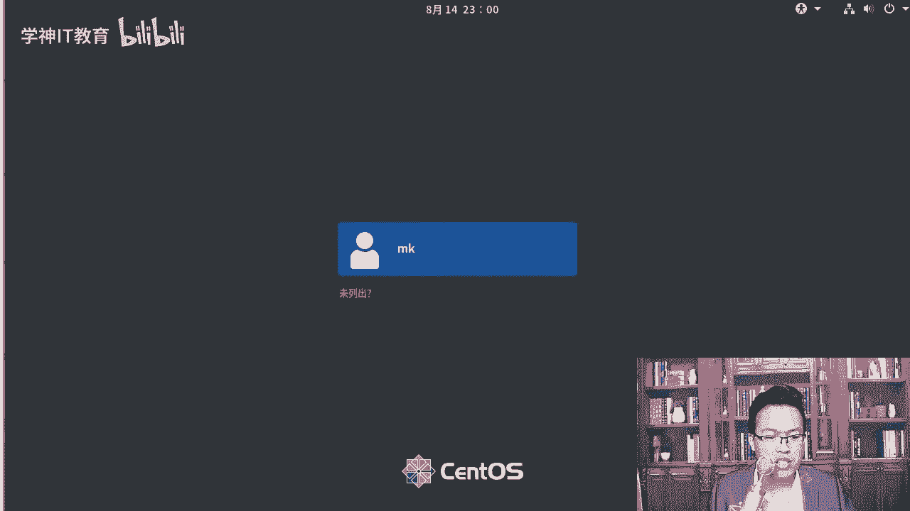

## 总结

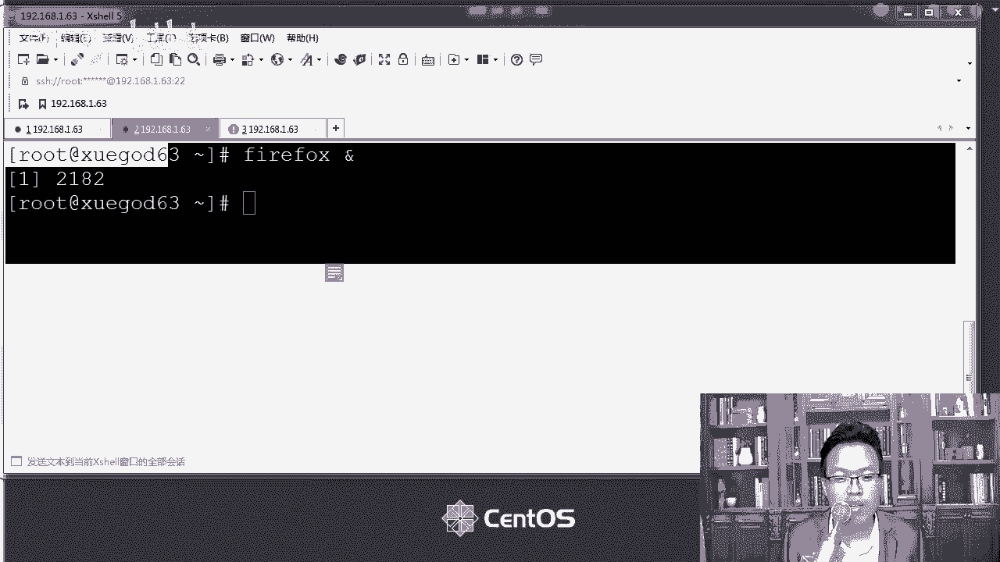

本节课我们一起学习了如何使用 Xmanager 工具套件来远程管理 Linux 服务器。

我们首先探讨了远程连接工具的安全性问题，并给出了选择建议。接着，详细介绍了 Xmanager 的主要组件，并逐步演示了如何使用 Xshell 创建安全的 SSH 连接、优化终端设置。最后，我们掌握了三个能显著提升工作效率的高级功能：**向多个会话批量发送命令**、**使用 Xftp 直观地进行文件传输**，以及**从终端直接调用远程服务器的图形界面程序**。

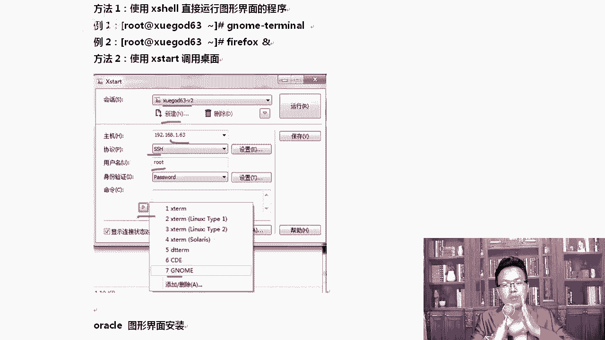

熟练掌握这些工具和技巧，将使您的 Linux 运维工作更加便捷、高效和安全。