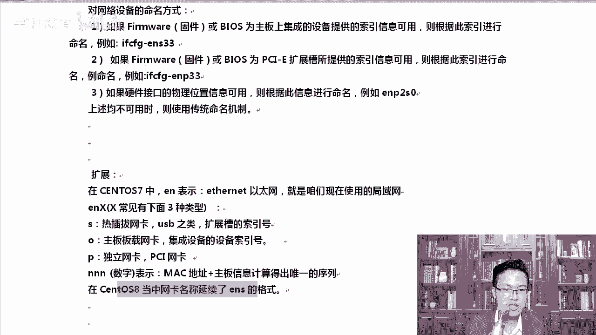
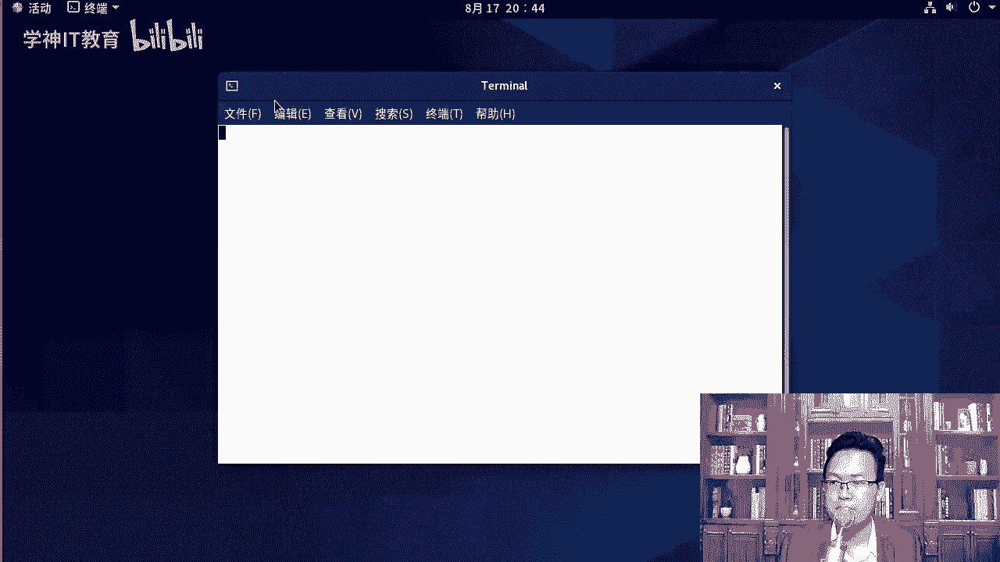
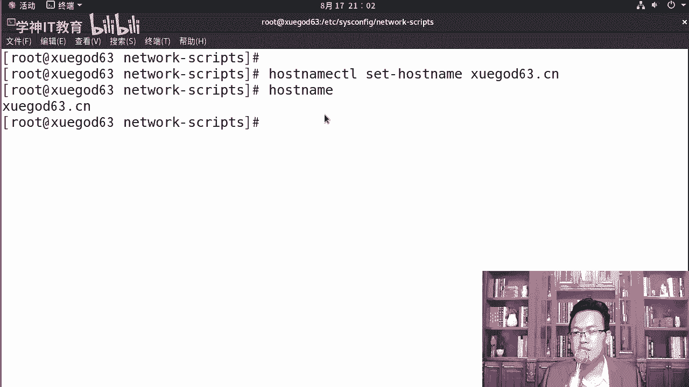

# Linux网络管理：P22：Linux网络相关概念与临时IP配置

## 概述
在本节课程中，我们将学习Linux系统下的网络基础概念，并掌握如何临时修改IP地址和配置主机名。这些操作是构建一个可用实验环境快照的基础步骤。

## 网络接口命名规则
上一节我们介绍了实验环境的重要性，本节中我们来看看Linux系统的网络接口命名规则。从CentOS 7开始，系统采用了新的、基于固件信息的命名方案，以确保网卡名称的唯一性。

以下是新的命名规则核心：
*   **`en`**：代表以太网（Ethernet）。
*   **`o`**：代表主板板载（onboard）设备。
*   **`s`**：代表支持热插拔（hot-plug）的PCI-E扩展槽设备。
*   **`p`**：代表独立的PCI网卡。
*   后续的数字由内核根据MAC地址和主板信息计算得出，保证唯一。

因此，你看到的网卡名称可能是 `ens33`、`eno1` 或 `enp2s0` 等形式。



## 查看网络信息
了解命名规则后，我们需要查看当前的网络配置。最常用的命令是 `ifconfig`。




执行 `ifconfig` 命令可以查看活跃的网络接口信息。输出信息中，我们需要关注以下几个核心部分：
*   **`inet`**：后面的地址就是IPv4地址。
*   **`netmask`**：后面的地址是子网掩码。
*   **`ether`**：后面的地址是网卡的MAC地址。

如果你想查看所有（包括未激活的）网络接口，可以使用 `ifconfig -a` 命令。在Linux中，参数 `-a` 通常代表“全部”（all）。

## 临时修改IP地址
查看信息后，我们学习如何临时修改IP地址。这种修改在系统重启或网络服务重启后会失效，适用于临时测试。

使用 `ifconfig` 命令可以临时为网卡添加或修改IP地址。其基本语法如下：
```bash
ifconfig <网卡名称> <IP地址> netmask <子网掩码>
```
例如，将网卡 `ens33` 的IP临时改为 `192.168.1.110`：
```bash
ifconfig ens33 192.168.1.110 netmask 255.255.255.0
```
修改后，可以使用 `ifconfig ens33` 来验证配置是否生效。

一个网卡可以绑定多个IP地址。只需在网卡名称后添加冒号和数字索引即可，例如 `ens33:0`：
```bash
ifconfig ens33:0 192.168.1.111 netmask 255.255.255.0
```

> **注意**：如果你是通过SSH远程连接到服务器并执行了修改IP的命令，连接可能会中断，需要使用新的IP地址重新连接。

## 使用 `ip` 命令管理网络
除了 `ifconfig`，`ip` 命令是一个更现代、功能更强大的网络配置工具。

使用 `ip addr show` 可以查看详细的IP地址信息。为了输出更清晰，可以配合 `grep` 命令：
```bash
ip addr show | grep ens33
```
要删除一个临时添加的IP地址，可以使用 `ip addr delete` 命令：
```bash
ip addr delete 192.168.1.111 dev ens33:0
```

## 网络服务与配置文件
临时修改很方便，但我们需要了解如何永久配置。这涉及到网络服务和配置文件。

在CentOS 7/8中，网络由 **NetworkManager** 服务管理。你可以使用 `systemctl` 命令查看其状态：
```bash
systemctl status NetworkManager
```
网络接口的永久配置文件位于 `/etc/sysconfig/network-scripts/` 目录下，通常命名为 `ifcfg-<网卡名>`，例如 `ifcfg-ens33`。

此外，还有两个重要的配置文件：
1.  **DNS解析配置**：`/etc/resolv.conf` 文件定义了系统的DNS服务器地址。
2.  **本地主机名解析**：`/etc/hosts` 文件用于存储IP地址和主机名的映射关系，优先级高于DNS查询。

## 配置主机名
最后，我们来配置系统的主机名。在CentOS 7/8中，可以使用 `hostnamectl` 命令来设置。

设置主机名为 `xuegod63.cn`：
```bash
hostnamectl set-hostname xuegod63.cn
```
设置完成后，可以使用 `hostname` 命令来查看当前的主机名。

为了使主机名在本地网络中可解析，建议将IP和主机名的对应关系写入 `/etc/hosts` 文件。例如，添加以下内容：
```
192.168.1.63 xuegod63 xuegod63.cn
192.168.1.62 xuegod62 xuegod62.cn
192.168.1.64 xuegod64 xuegod64.cn
```



## 总结
本节课中我们一起学习了Linux网络管理的基础知识。我们了解了CentOS 7/8新的网络接口命名规则，掌握了使用 `ifconfig` 和 `ip` 命令查看及临时修改IP地址的方法。我们还认识了NetworkManager服务，并知道了主机名配置以及 `/etc/hosts` 文件的作用。这些是构建一个稳定、可重复实验环境的关键步骤，请务必熟练掌握。