# 服务器硬件基础：P25：X86服务器、小型机与大型机概述 🖥️

在本节课中，我们将学习服务器硬件的基础知识，包括常见的X86架构服务器、小型机以及大型机。了解这些硬件的组成、特点和性能参数，对于后续的运维工作至关重要。

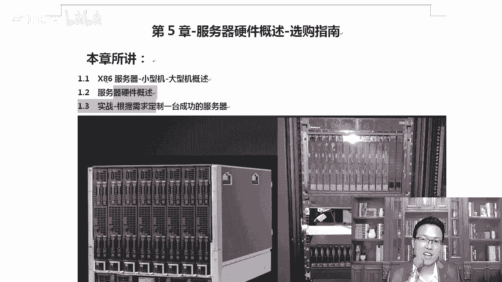

## 服务器硬件概述

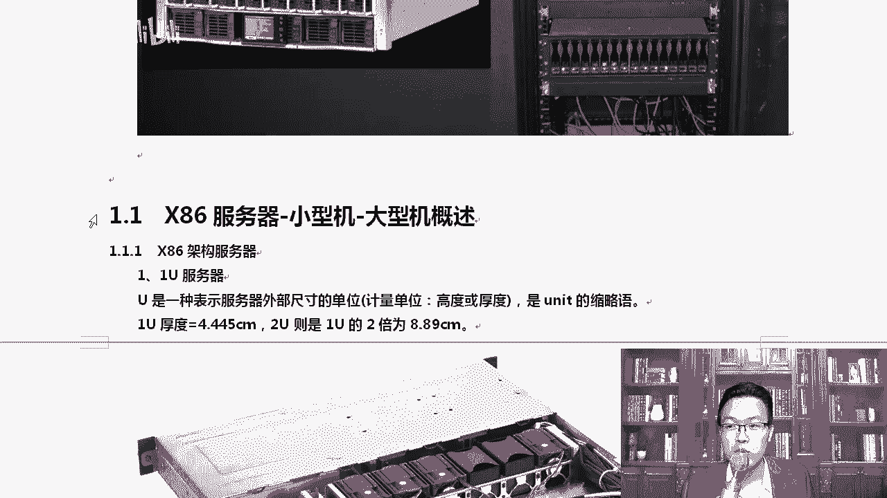

上一节我们介绍了课程的整体框架，本节中我们来看看服务器硬件的基本概念。现代服务器的性能已经非常强大，其内存容量可以达到TB级别，CPU核心数可达数百个。作为Linux云计算架构师，虽然不需要亲自更换硬件，但了解服务器的组成和关键参数是必要的，这有助于与机房人员进行有效沟通。

服务器硬件并非可以随意组装，例如，笔记本内存无法直接用于服务器。因此，我们需要系统地认识不同类型的服务器。

## X86架构服务器

首先，我们从最常见的X86架构服务器说起。X86架构是当前主流的计算架构，包括我们日常使用的台式机和笔记本电脑。

### 什么是X86架构？

X86架构指的是采用英特尔或AMD公司生产的CPU的计算机体系结构。例如，英特尔的酷睿系列（i3, i5, i7）和AMD的锐龙系列CPU都属于X86架构。

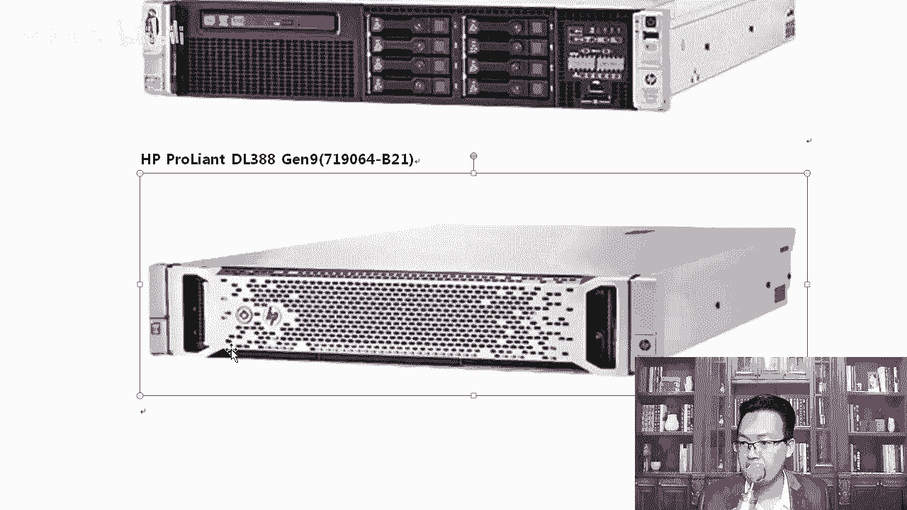

### 服务器尺寸单位：U

在服务器领域，我们常用“U”来表示服务器的外部尺寸，特指其高度。1U的厚度约为4.45厘米（约三根手指的厚度）。这是服务器在机柜中占位空间的标准单位。

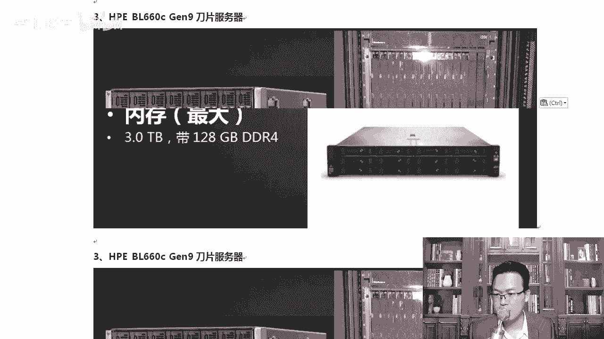

以下是常见的服务器尺寸类型：

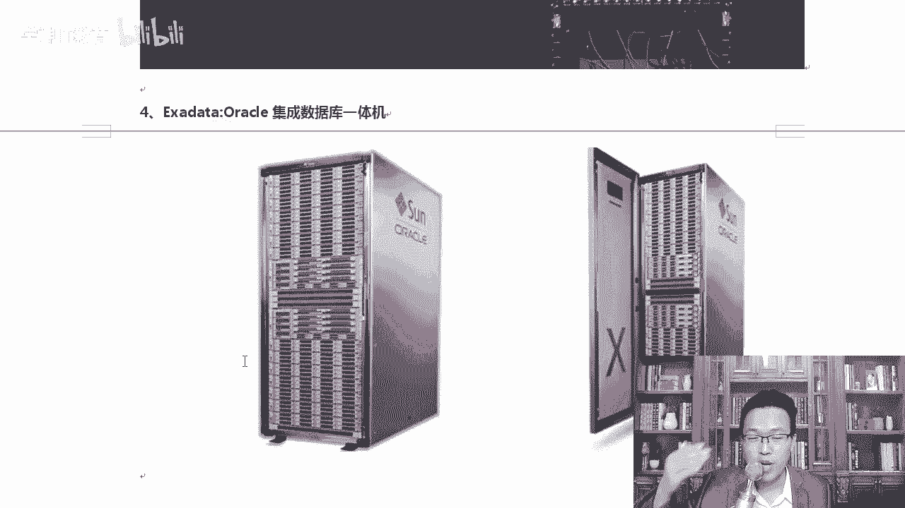

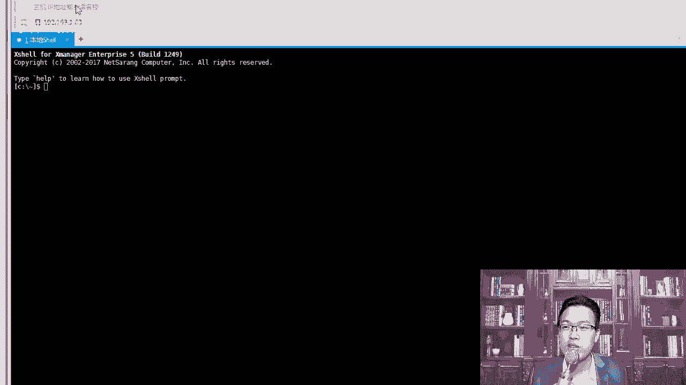

*   **1U服务器**：厚度约为4.45厘米，内部组件（如CPU、内存、电源）通常采用扁平化设计以节省空间。前面板可能包含硬盘槽位、指示灯和少量接口。
*   **2U服务器**：厚度是1U服务器的两倍，因此内部空间更大，可以支持更多的硬盘、更强大的散热系统或额外的扩展卡。
*   **刀片服务器**：这是一种高密度服务器。多个独立的“刀片”（每个可视为一个服务器单元）插入到一个背板机箱中，共享电源、散热和网络等资源。优点是在有限空间内集成更多计算资源，有助于降低数据中心托管成本。

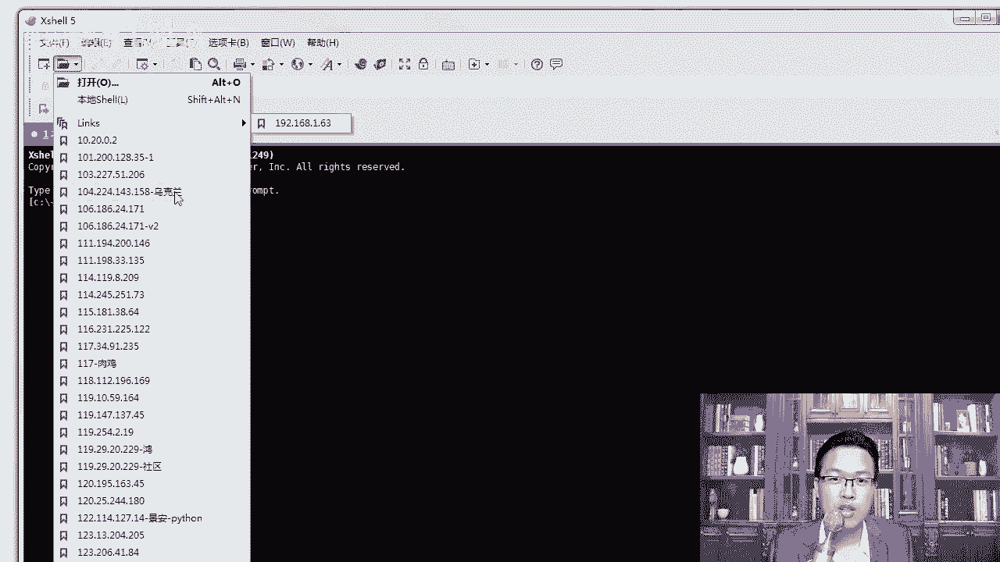

### 服务器远程管理

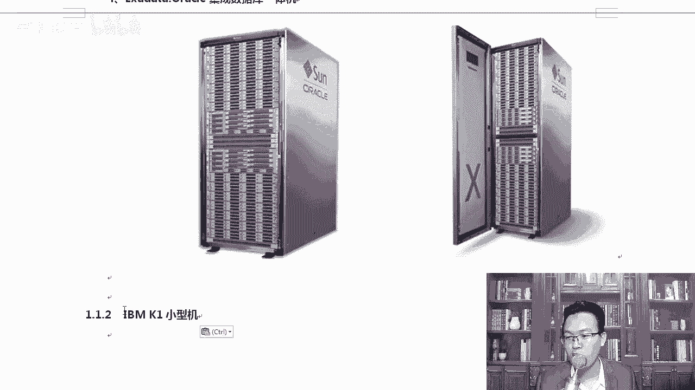

在实际工作中，运维人员通常不需要亲临机房。服务器硬件出现故障时（如硬盘损坏），可以通过远程方式联系机房人员更换。运维人员主要通过SSH等远程工具管理服务器。

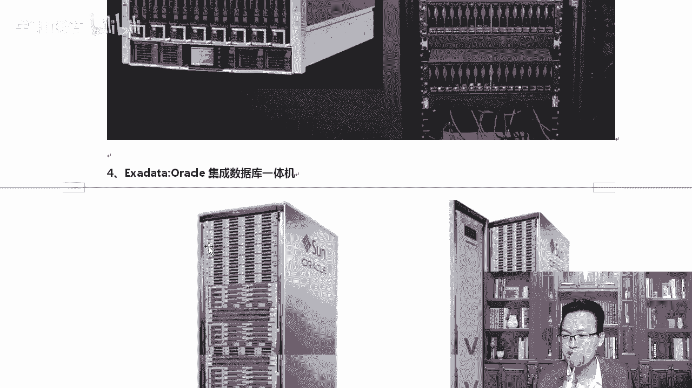

## 小型机与大型机

接下来，我们看看与X86服务器不同的体系：小型机和大型机。它们最大的区别在于使用的CPU架构不同。

### 核心区别：CPU架构

*   **X86服务器**：使用英特尔/AMD的X86架构CPU。
*   **小型机/大型机**：通常使用像IBM Power系列这样的非X86架构CPU。此外，智能手机普遍使用的ARM架构（如华为麒麟、高通骁龙）也是另一种主流CPU架构。

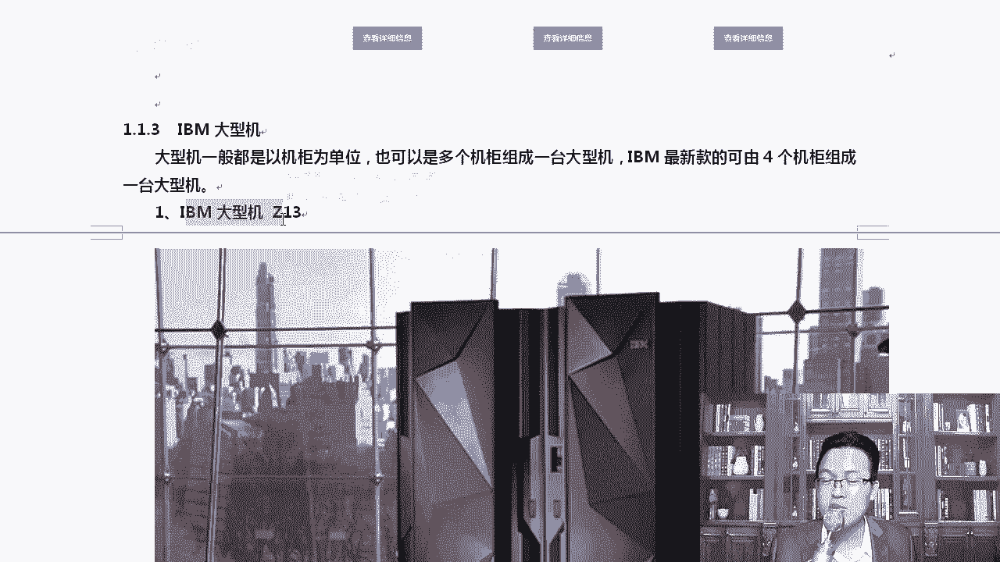

### 小型机并不“小”

“小型机”是相对于庞大的“大型机”而言的，其本身体积并不小。例如，IBM Power Systems系列服务器就是典型的小型机，它们使用IBM自研的Power处理器，单颗物理CPU可能就包含数十个核心，性能非常强大。

### 大型机：性能的巅峰

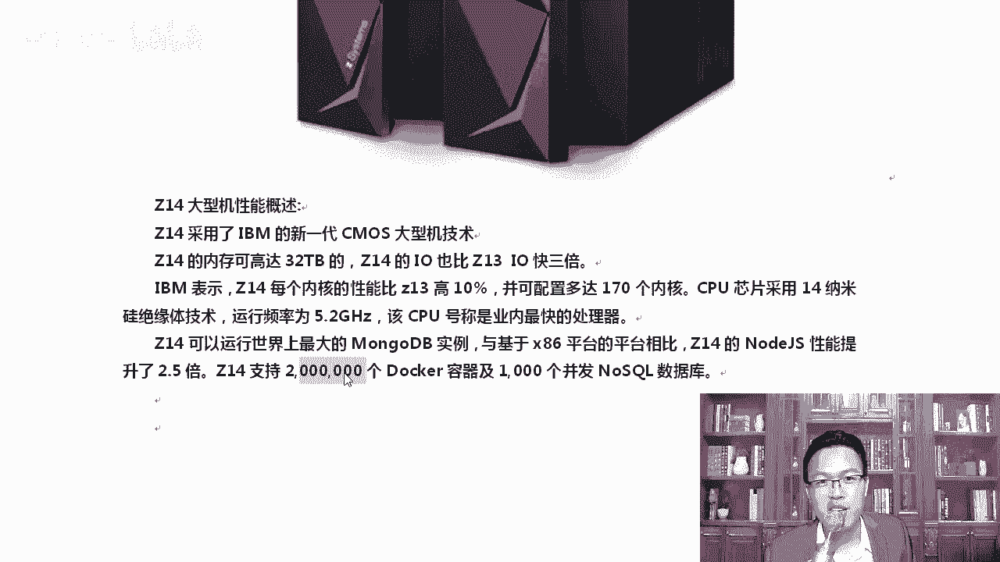

大型机代表了最高的计算性能、可靠性和安全性，常用于银行、证券等核心交易系统。它们通常由多个高大的机柜组成。

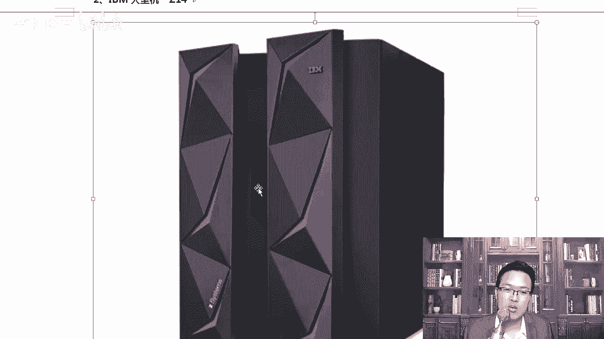

以下是IBM Z系列大型机的演进示例：

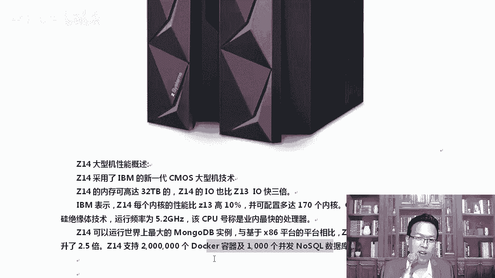

*   **IBM Z13**：多年前的产品已支持高达10TB内存，最多可配置141个8核CPU（总计超1000核心）。
*   **IBM Z14**：内存提升至32TB，支持多达**200万个Docker容器**实例，展示了其恐怖的虚拟化与并发处理能力。
*   **IBM Z15**：最新一代大型机，内存可达40TB，核心数进一步增加，相比X86平台有显著的性能优势。

大型机的价格极其昂贵，但在云计算普及之前，它们是许多企业关键业务系统的基石。

## 总结

本节课中，我们一起学习了服务器硬件的基础分类：
1.  **X86服务器**：基于主流X86架构，按尺寸分为1U、2U和刀片服务器，是互联网行业最常用的服务器类型。
2.  **小型机**：通常采用如IBM Power等专用架构，性能强大，常用于传统企业核心数据库等场景。
3.  **大型机**：顶级商用计算系统，拥有无与伦比的可靠性、安全性和处理能力，用于金融等最关键的业务领域。

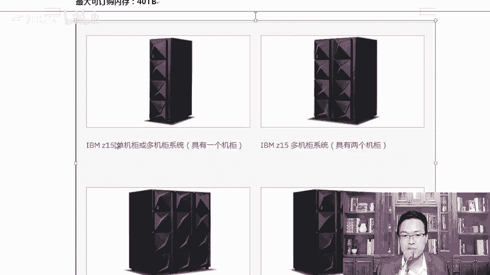

了解这些硬件知识，能帮助我们在规划系统架构、进行容量评估和与技术伙伴沟通时更有底气。对于初学者，建议通过图片、视频或实地参观来建立直观认识，无需急于接触物理设备。