# CentOS8操作系统从入门到精通：P26：服务器主板和CPU介绍 🖥️

## 概述
在本节课中，我们将学习服务器硬件的核心组成部分——主板和CPU。我们将了解服务器与普通家用电脑在这些硬件上的区别，学习如何解读关键参数，并掌握选购服务器时需要考虑的要点。

## 服务器硬件概述
在详细介绍主板和CPU之前，我们先澄清几个关于服务器的常见问题。

以下是几个典型问题及其解答：

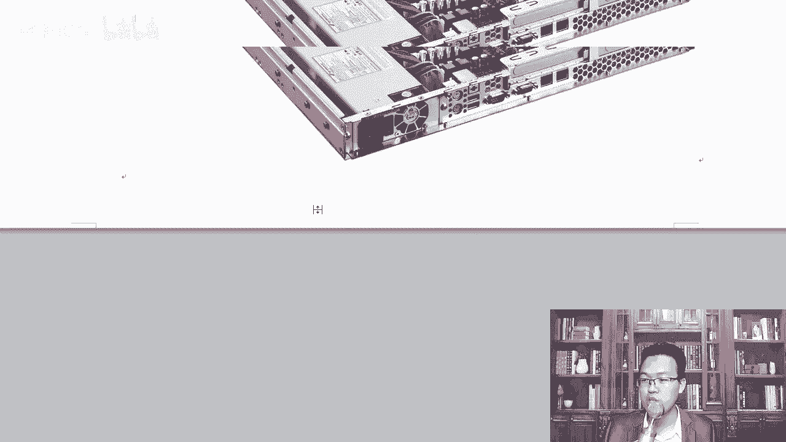

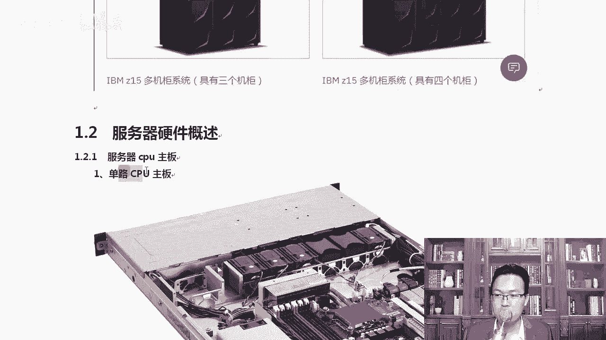

*   **服务器能玩游戏吗？**
    通常不能。首先，高端服务器（如IBM大型机）价格极其昂贵，从数百万到数千万不等，无人会将其用于游戏。其次，这类服务器通常运行Unix系统，而主流游戏（如《王者荣耀》、《绝地求生》、《英雄联盟》）并不支持Unix，甚至在Linux系统上运行都很困难。这类服务器主要用于银行、证券公司等机构的核心计算和存储业务。

*   **小型机与普通服务器的区别？**
    主要区别在于CPU架构不同。小型机使用特定的CPU架构（类似于手机上的ARM处理器，如骁龙、海思、麒麟），与个人电脑的x86架构不同，其指令集和运行方式均有差异。小型机通常也运行Unix系统，尽管部分新型号已开始支持x86系统。

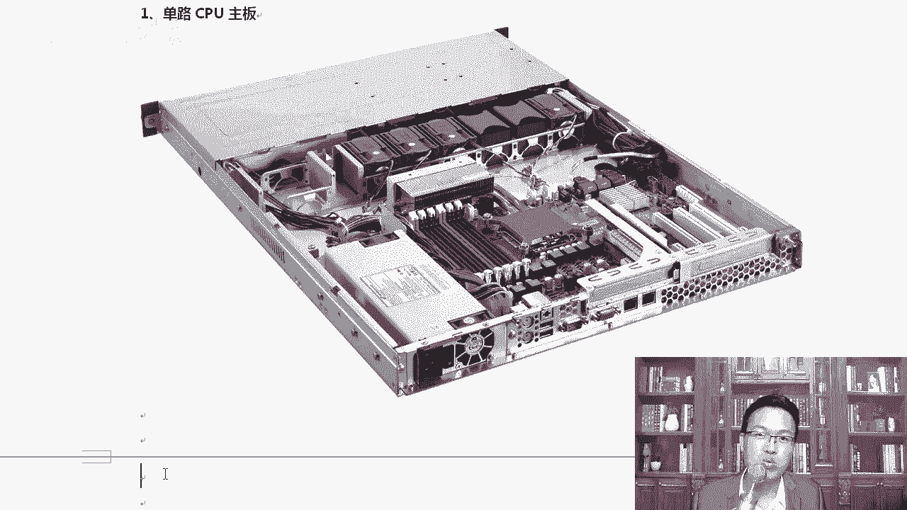

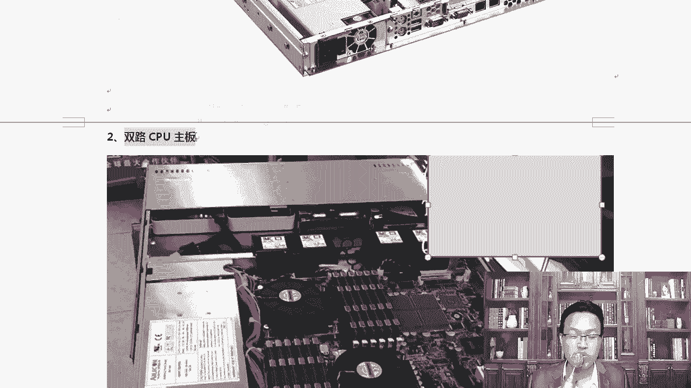

*   **服务器为何需要超大内存（如1T、4T）？**
    超大内存主要用于构建云平台。例如，一台拥有3T内存的服务器，通过虚拟化技术（如OpenStack平台），可以将内存资源划分给大量虚拟机使用。因此，这类大内存配置是支撑云计算服务的基础。实际采购中，也并非总是需要配满最大容量。

## 服务器主板介绍
上一节我们澄清了关于服务器的基本概念，本节中我们来看看服务器的主板。

服务器主板与家用主板的主要区别之一在于支持CPU的数量。“路”指的是主板上可以安装的CPU数量。单路主板支持一个CPU，双路主板则支持两个CPU。作为Linux架构师，在为公司自建云平台采购服务器时，需要清楚这些概念。

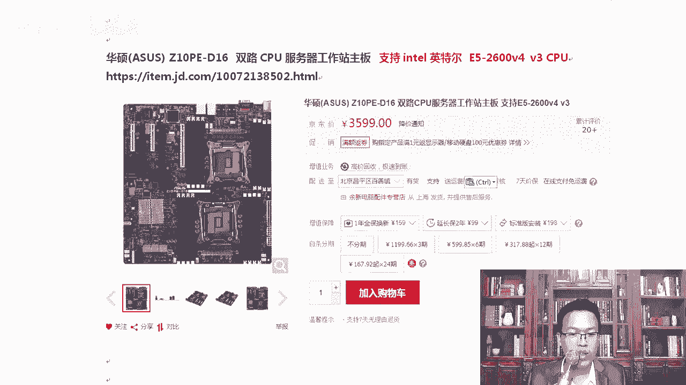


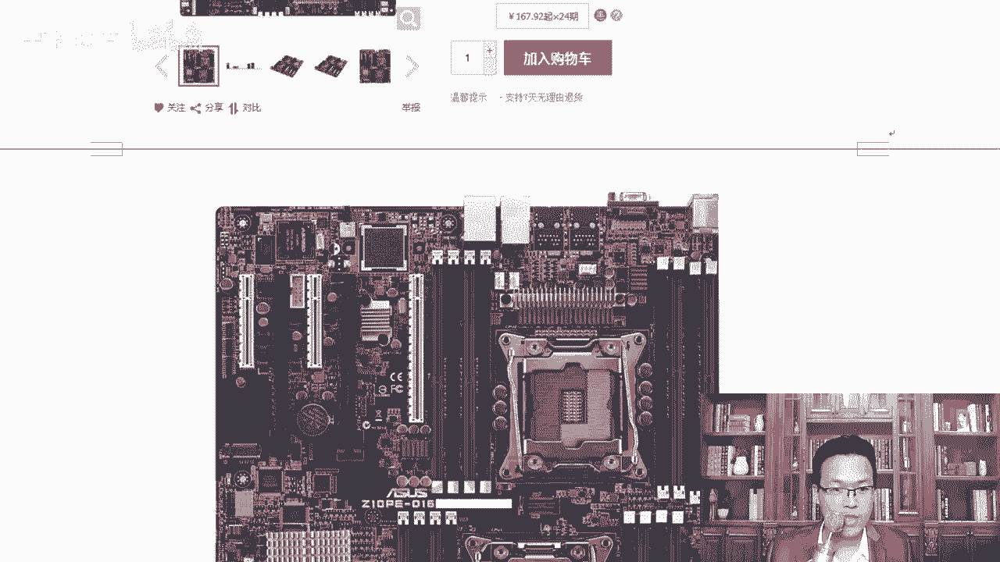

*单路CPU主板示例*


*双路CPU主板示例*

服务器内存插槽通常很多，可以插满大容量内存。目前内存价格相对便宜，为服务器配置充足的内存是划算的投资。更大的内存可以减少磁盘I/O操作，从而提升整体性能并间接节省磁盘开销。

个人可以组装服务器吗？答案是肯定的。你可以自行购买组件组装，或委托专业商家完成。例如，可以选购华硕的服务器主板，如`Z10PE-D16`，这是一款支持双路CPU的主板。


*华硕Z10PE-D16双路主板*

这块主板支持英特尔至强E5-2600 v3/v4系列处理器。需要注意，安装内存时必须对称插拔（例如，CPU1插槽的A1位置插入内存，CPU2插槽的A1位置也需插入），不能将所有内存集中在一边。


*主板接口细节*

服务器主板通常集成两个网口、多个USB接口和VGA接口。除非用于图形渲染等特定任务，否则服务器一般使用集成显卡，无需额外安装独立显卡。

### 主板参数解读
选购主板时，务必查阅官方网站的权威参数。

以下是华硕Z10PE-D16主板的部分关键参数：

*   **内存支持**：拥有16个DDR4 DIMM内存插槽，最大支持1TB容量，支持RDIMM和LRDIMM类型内存。
*   **内存频率**：支持2400/2133/1866/1600 MHz。实际运行频率取决于CPU和内存模块的兼容性。
*   **重要提示**：最终内存运行速度受**CPU内存控制器**的限制。即使主板和内存都支持高频率，若CPU内存控制器只支持较低频率，系统将以较低频率运行。

### 内存类型扩展知识
除了容量和频率，服务器内存还有不同的类型，主要分为以下三种：

*   **UDIMM (Unbuffered DIMM)**：无缓冲双列直插内存模块。这是家用台式机和笔记本常见的内存类型，不支持极高的内存容量。
*   **RDIMM (Registered DIMM)**：带寄存器的双列直插内存模块。服务器常用类型，通过寄存器提升稳定性和支持更大容量。
*   **LRDIMM (Load Reduced DIMM)**：减载双列直插内存模块。使用简单缓存而非复杂寄存器，能进一步降低内存总线负载，支持的内存容量比RDIMM更大（通常是成倍增长）。目前主流服务器多使用RDIMM内存。

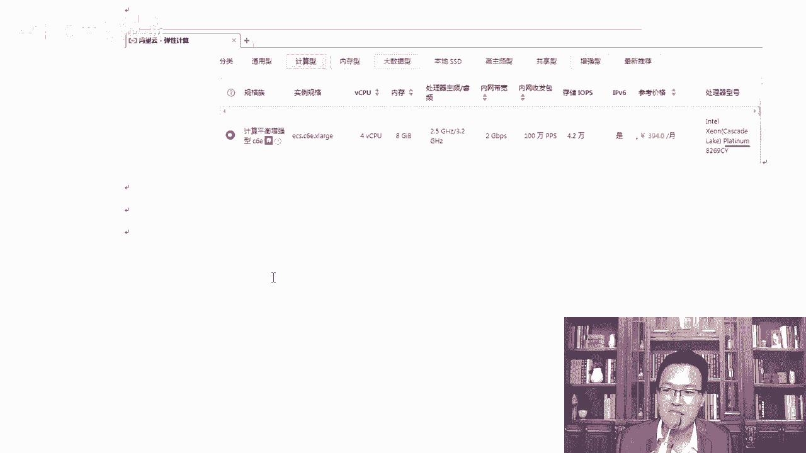

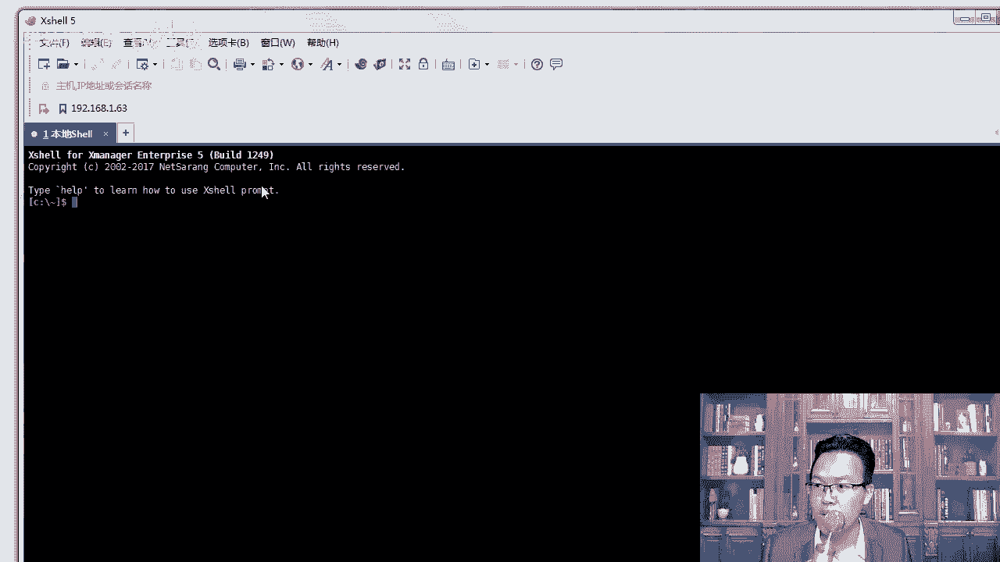

## 服务器CPU详解
了解了主板之后，我们进入核心部分——中央处理器（CPU）。

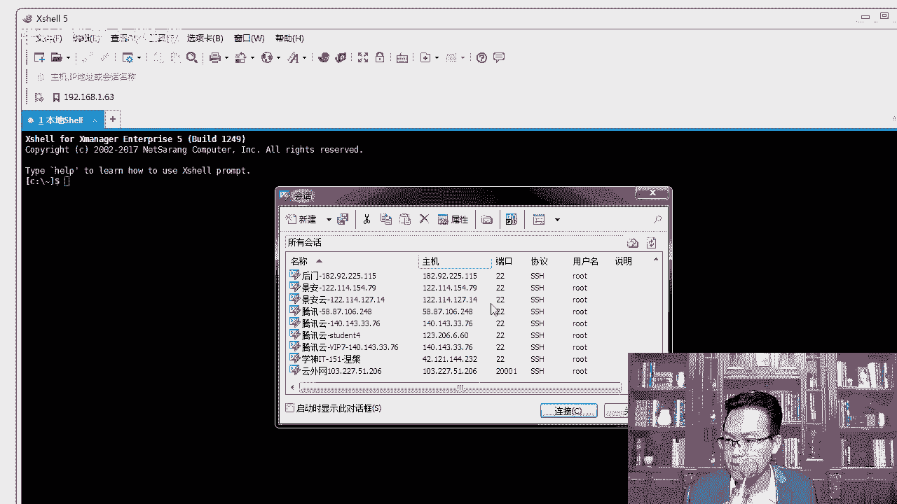

目前常见的x86架构服务器CPU主要来自英特尔（Intel）和AMD两家公司。

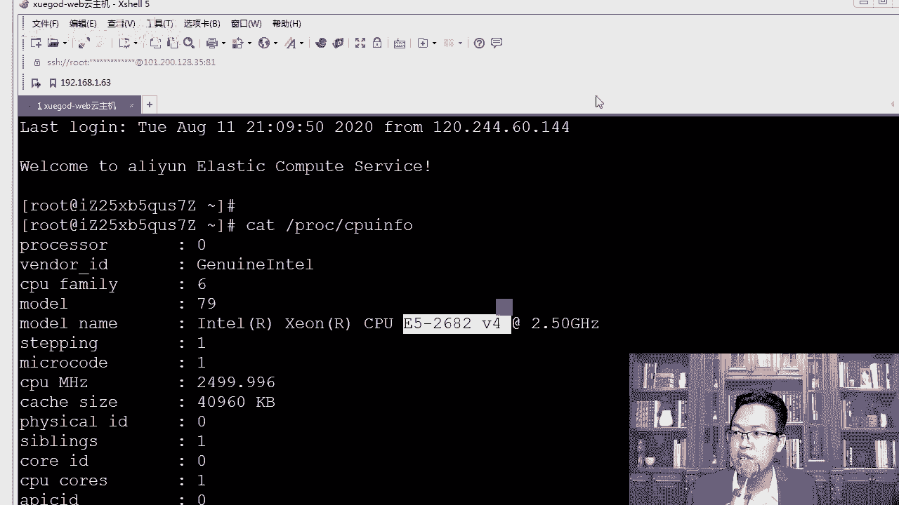

*   **英特尔（Intel）**：服务器级产品线称为**至强（Xeon）**“可扩展处理器”系列。“可扩展”意指可支持单路或多路配置。其家用级产品为酷睿（Core）系列（i3/i5/i7/i9）。
*   **AMD**：服务器级产品线称为**霄龙（EPYC）**系列。其家用级产品为锐龙（Ryzen）系列。

### 英特尔至强处理器命名演变
旧的命名方式采用E5、E7等系列，后跟v2、v3、v4代表代次。新一代命名已改为金属等级制：

*   **至强铂金（Xeon Platinum）**
*   **至强金牌（Xeon Gold）**
*   **至强银牌（Xeon Silver）**
*   **至强铜牌（Xeon Bronze）**


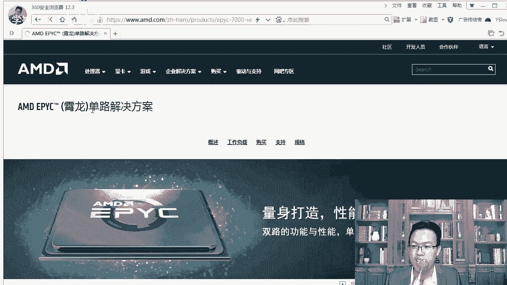

这些新型号面向人工智能、分析和混合云等关键任务负载。主流云服务商（如阿里云）已在使用铂金等系列CPU。在选购云服务器时，即使核心数相同，不同等级的CPU性能也存在差异。

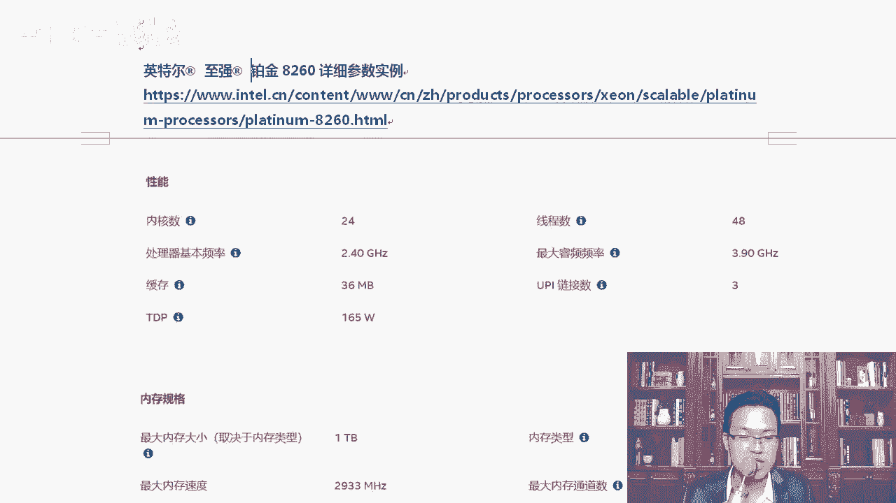

### 服务器CPU与家用CPU对比
服务器CPU（如至强、霄龙）与家用CPU（如酷睿i7）的关键区别在于**多路支持能力**。服务器主板可安装多个CPU协同工作，例如两个24核的至强铂金CPU可提供48个物理核心。而家用CPU通常只能单路运行，无法通过叠加来获得如此多的核心数。

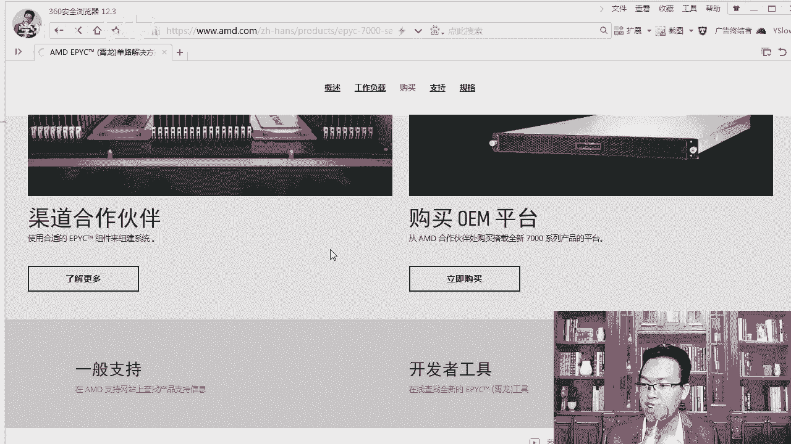

### 如何查看和对比CPU
在Linux系统中，可以使用以下命令查看CPU型号：
```bash
cat /proc/cpuinfo
```

选购服务器CPU时，需关注以下核心参数：

*   **主频/睿频**：基础频率和单核/全核加速频率。
*   **核心/线程数**：物理核心数量，若支持超线程（Hyper-Threading），逻辑线程数通常是核心数的两倍。
*   **缓存（Cache）**：容量越大越好。
*   **支持的内存**：包括单条内存最大容量、支持的总内存容量及内存类型。
*   **PCIe通道数**：决定可扩展的PCIe设备数量。

### CPU性能参考
可以参考专业的CPU性能排行榜网站来了解不同型号的性能定位。排行榜会区分单路、双路等配置。在榜单前列，可以看到英特尔的至强铂金、金牌系列以及AMD的霄龙系列。

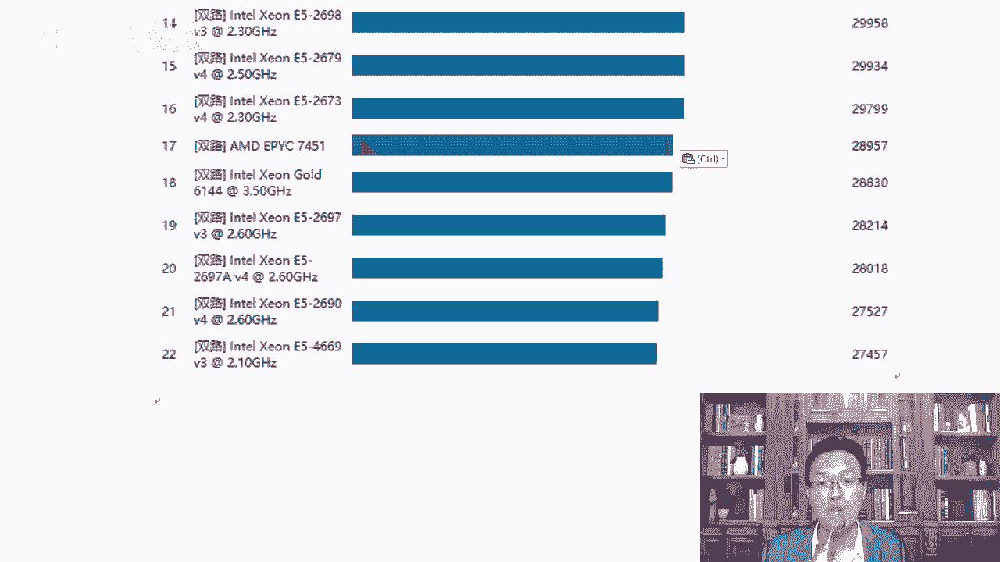

*CPU性能排名示意*

### 服务器选购建议
实际选购整机服务器时，通常先确定品牌（如戴尔、联想、华为、浪潮、曙光等），品牌关乎质量、服务和生态兼容性。在当前的国际环境下，支持国产服务器品牌也是值得考虑的方向。


## 总结
本节课我们一起学习了服务器硬件的两大核心：主板和CPU。
我们了解了服务器主板支持多路CPU的特性、内存的对称安装要求以及不同的内存类型（UDIMM， RDIMM， LRDIMM）。
在CPU部分，我们掌握了英特尔至强系列和AMD霄龙系列的产品线，学习了新一代的命名规则（铂金、金牌、银牌、铜牌），并明确了服务器CPU通过多路互联实现超高核心数的核心优势。
最后，我们学习了查看CPU信息的方法和选购时需要关注的关键参数。这些知识将帮助你在未来设计或维护服务器架构时做出更明智的决策。