# CentOS8操作系统从入门到精通：P27：6-服务器内存和磁盘介绍 🖥️💾

在本节课中，我们将学习服务器硬件中两个核心组件：内存和磁盘。我们将了解它们的外观、关键参数、选购要点以及在企业环境中的实际应用。

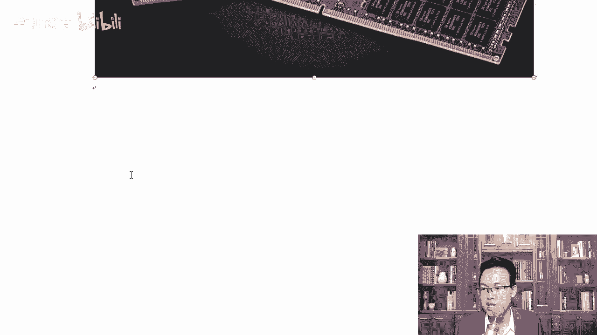

## 内存介绍 🧠

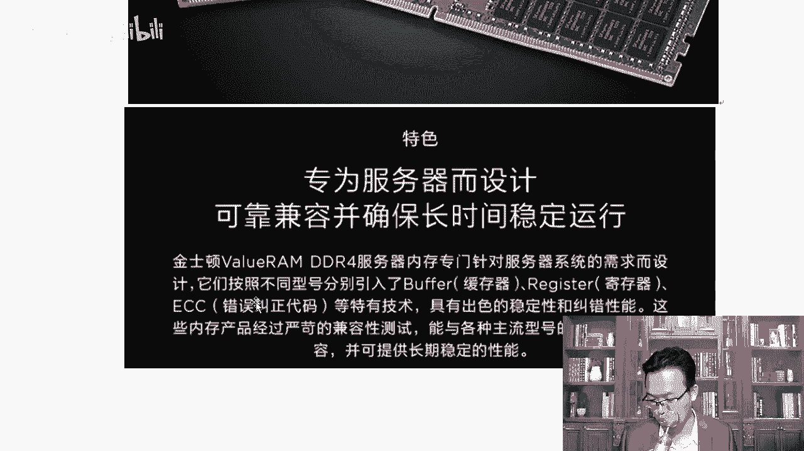

上一节我们介绍了服务器的整体架构，本节中我们来看看服务器的内存。服务器内存在外观上与台式机内存相似，但在技术和可靠性上有更高要求。

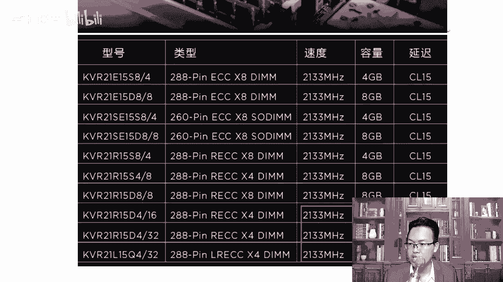

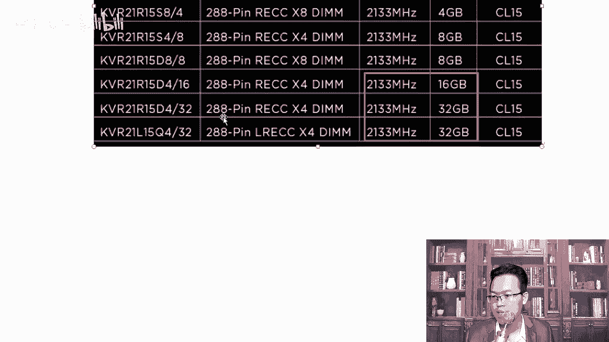

以下是服务器内存的关键参数和选购要点：

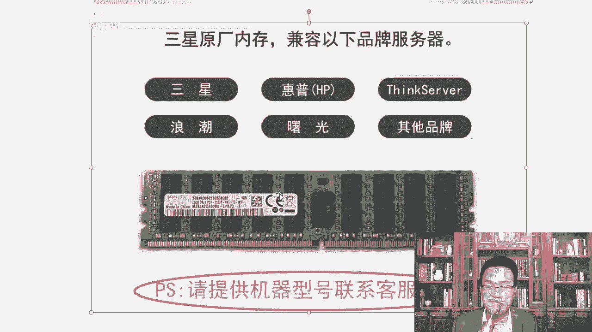

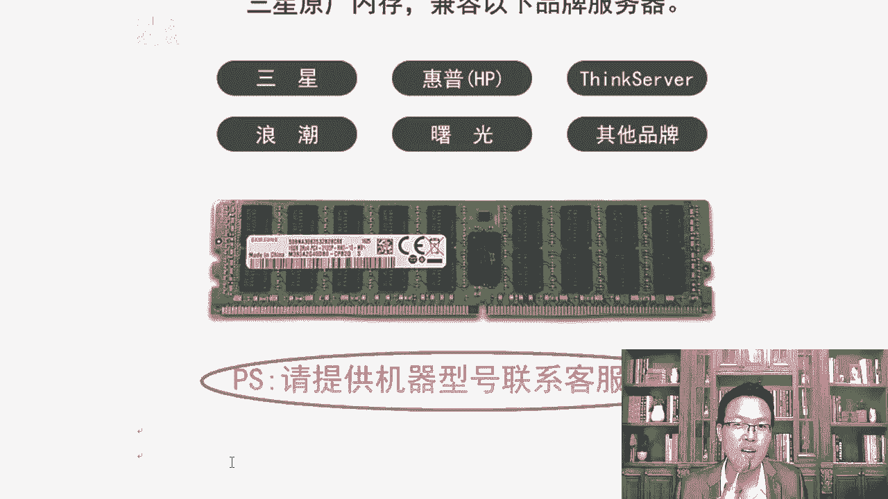

*   **品牌与兼容性**：三星、金士顿等是常见的优质品牌。选购时必须确保内存与CPU和主板兼容，需核对CPU支持的内存频率和最大容量。
*   **单条容量与扩展**：单条内存的容量决定了服务器的总内存上限。在预算允许的情况下，应优先选择单条容量更大的内存（如32GB），为主板预留扩展槽位，便于未来升级。
*   **频率**：常见频率有2400MHz、2666MHz、2933MHz等。频率越高，性能越好，但需确保CPU支持所选频率。
*   **通道数**：通道数越多，内存带宽越大，性能越强。现代服务器通常支持四通道、六通道甚至八通道。
*   **容量与瓶颈**：现代服务器内存可支持TB级别，在工作中因内存容量不足成为性能瓶颈的可能性较小，除非初始配置过低。
*   **服务器内存特性**：服务器专用内存条通常带有**寄存器（Register）** 和**错误纠正代码（ECC）** 功能。ECC技术能检测并纠正内存中的错误，保障服务器在7x24小时运行下的数据完整性与系统稳定性。家用内存条通常不具备此功能。

选购时，若不确定兼容性，可提供服务器型号咨询供应商客服。服务器内存外观多为2.5英寸或3.5英寸规格，可通过内存颗粒数量区分不同容量。

## 磁盘介绍 💽

了解了内存后，我们接下来看看服务器的存储核心——磁盘。服务器磁盘主要分为SATA、SAS和固态硬盘（SSD），它们在接口、性能和用途上各有不同。

以下是各类磁盘的详细说明：

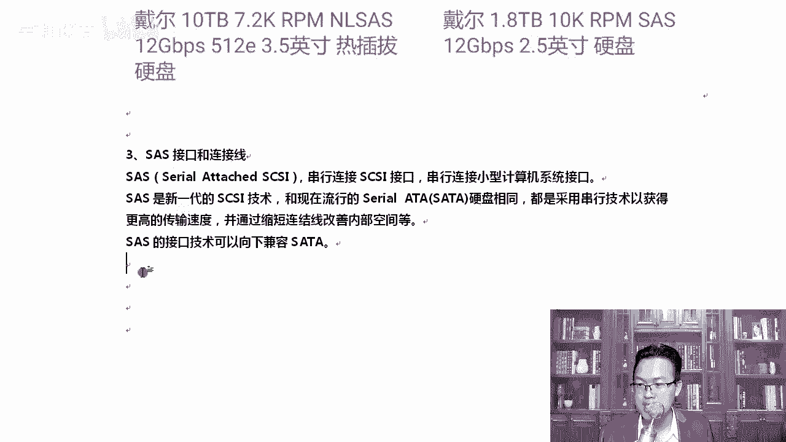

*   **SATA磁盘**：接口与家用台式机、笔记本硬盘相同。容量大（常见1TB、2TB、4TB等），转速通常为7200转/分钟。价格较低，但一般不支持热插拔，在纯服务器环境中使用较少。
*   **SAS磁盘**：服务器主流磁盘。接口将数据线与电源线整合为一体，中间有防误插的豁口。其特点是高转速（10K或15K转/分钟）、高可靠性、支持热插拔。传统SAS盘容量相对较小（如300GB、600GB、1.2TB），价格较高。
*   **“混合”或“假”SAS盘**：这是一种采用SAS接口但使用SATA盘体的磁盘。它兼具SAS接口的热插拔特性和SATA盘的大容量、低成本优势（如2TB、4TB、12TB，转速7200转/分钟），在企业级存储中应用广泛。
*   **固态硬盘（SSD）**：采用闪存颗粒，无机械部件，具有极高的随机读写速度。企业级SSD（如英特尔Optane系列）容量可达数TB，但价格昂贵。SSD主要用于需要极低延迟的场景（如数据库缓存、游戏服务器）或作为高速缓存加速整体存储性能。

关于磁盘分区，需注意：对于大于2TB的磁盘，传统的**MBR**分区表无法支持，必须使用**GPT**分区表。GPT分区表没有主分区数量限制，并能支持超大容量磁盘。

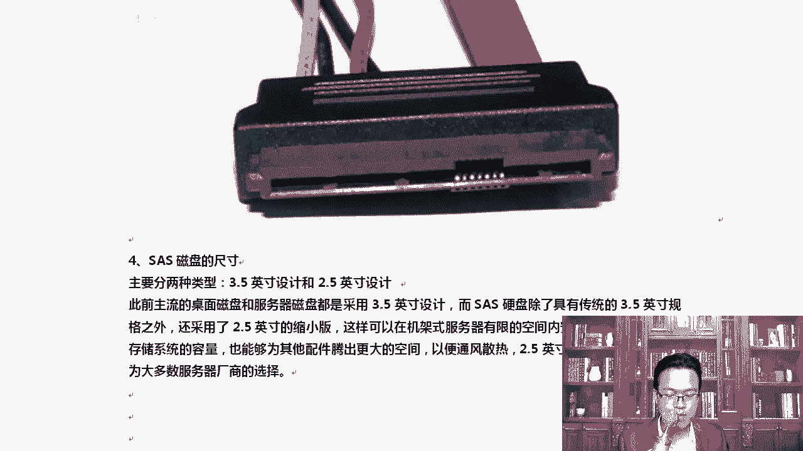

## 总结 📝

本节课中我们一起学习了服务器内存和磁盘的核心知识。

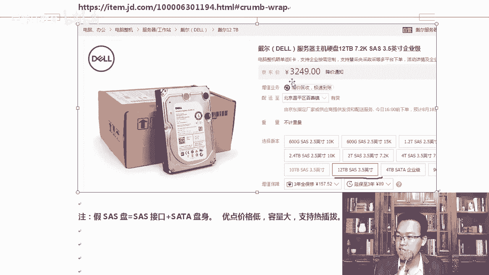

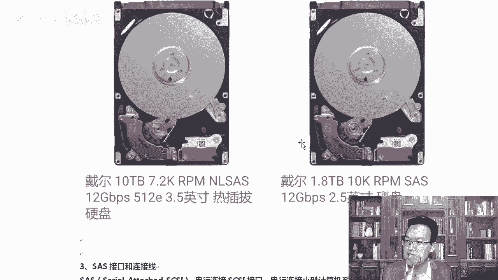

我们了解到服务器内存注重**容量**、**频率**、**通道数**以及**ECC校验**等可靠性特性。选购时应以兼容性和未来扩展性为首要考虑。

对于磁盘，我们认识了**SATA**、**SAS**和**SSD**三种主要类型，明确了它们各自在**接口**、**性能**（转速）、**容量**和**应用场景**上的区别。在实际工作中，SAS盘因其平衡的性能与可靠性最为常见，而大容量存储常会选用具有SAS接口的“混合”盘以控制成本。

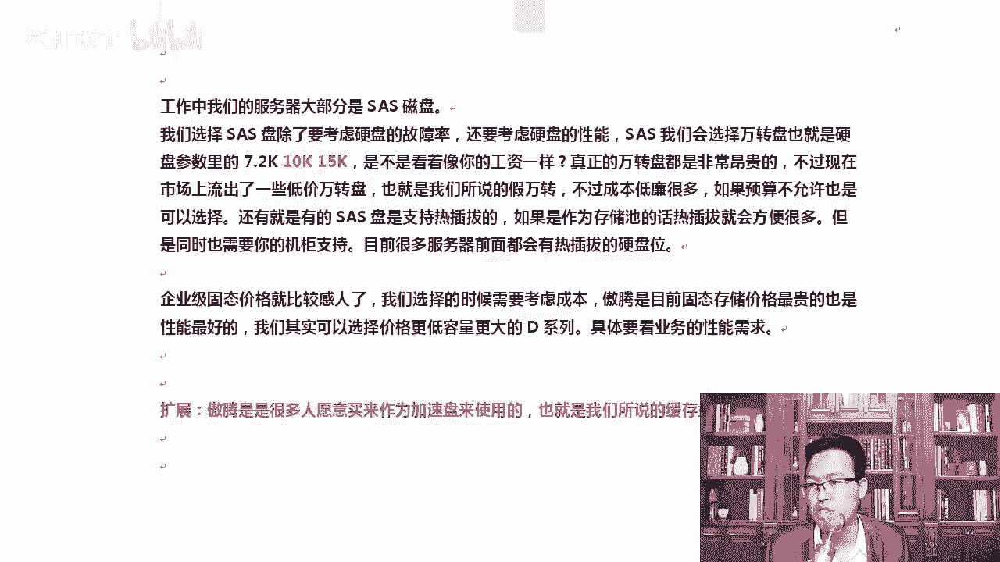

掌握这些硬件知识，将帮助你在规划、选型和维护服务器时做出更明智的决策。