# CentOS8操作系统从入门到精通：P28：7-Raid卡-网卡-电源-风扇

在本节课中，我们将要学习服务器硬件的重要组成部分，包括Raid卡、网卡、电源和风扇。了解这些组件对于进行服务器运维和配置至关重要。

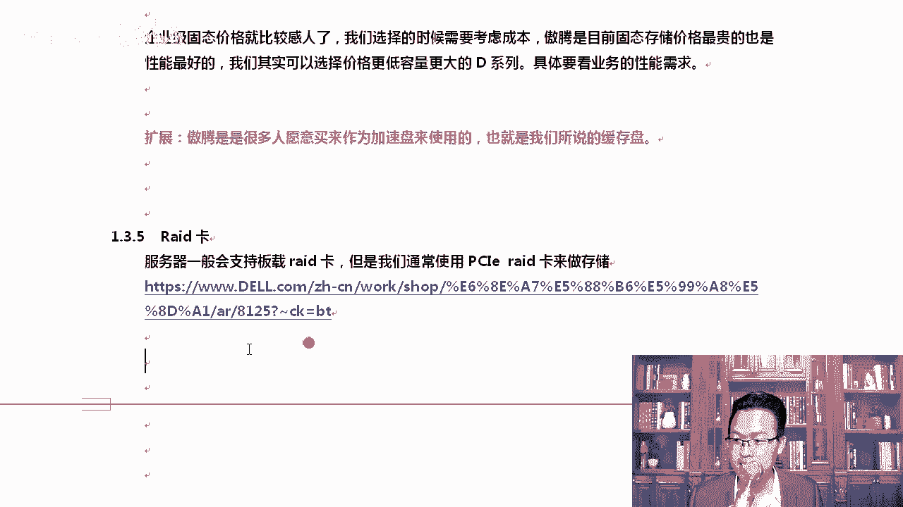

上一节我们介绍了服务器的基本构成，本节中我们来看看服务器中一些关键的扩展和辅助硬件。

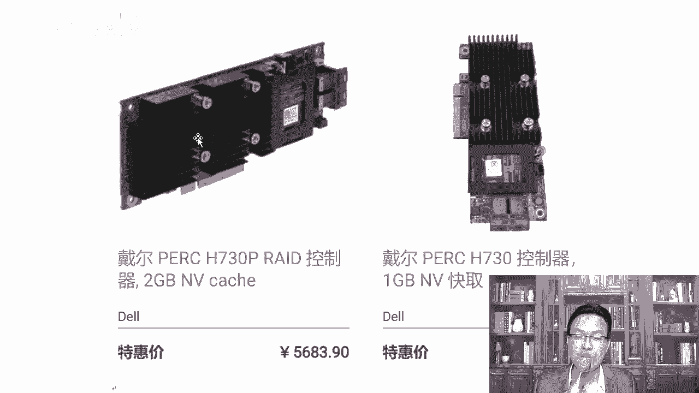

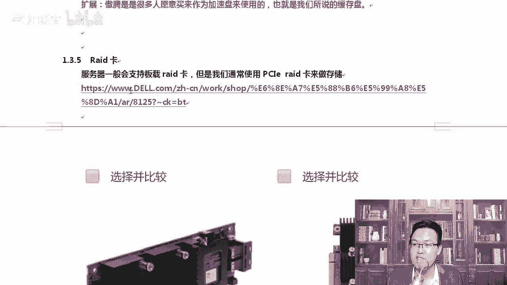

## Raid卡

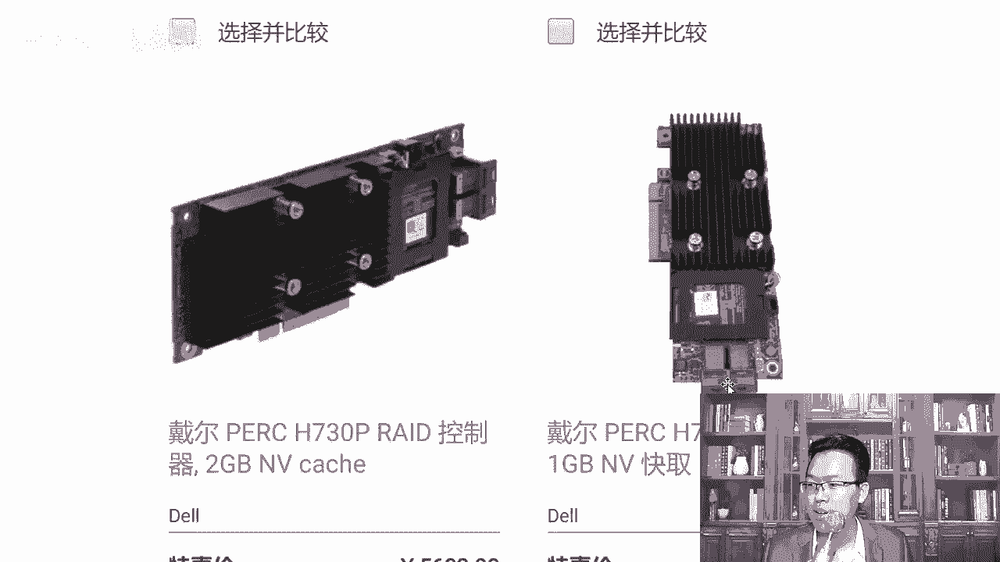

普通台式机通常没有Raid卡设备。服务器一般会直接支持Raid卡，即主板上直接集成了硬件Raid功能。

例如，购买一台戴尔服务器后，可以在开机时按下特定快捷键（如 `Ctrl+M`）进入Raid配置界面，这与进入BIOS设置类似。服务器说明书会写明进入Raid配置的快捷键。

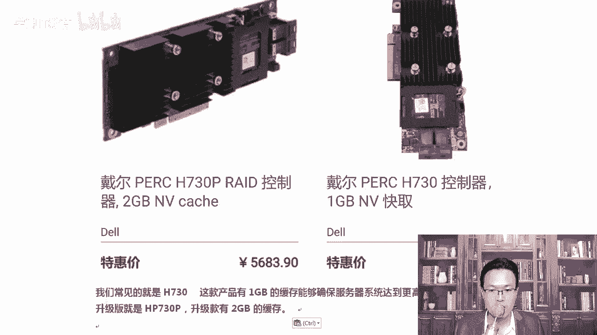

以下是关于Raid卡的一些要点：
*   Raid卡的外观通常是一块独立的扩展卡。
*   它的主要作用是提供数据高可用性，例如实现 **Raid 0** 或 **Raid 1**。
*   Raid卡上通常带有缓存（如1GB或2GB）。当数据写入速度过快时，可以先写入Raid卡的缓存，再由缓存慢慢写入磁盘，这能提升写入性能。

## 网卡

服务器标配通常是千兆网卡。当网卡数量不足或速度不够时，可以配置独立网卡。

服务器网卡有不同规格：
*   **千兆网卡**：常见配置。
*   **万兆网卡**：许多高配服务器会配备，通常采用光纤接口（SFP/SFP+）。
*   万兆网卡接口较长，易于识别。光纤技术现已普及。

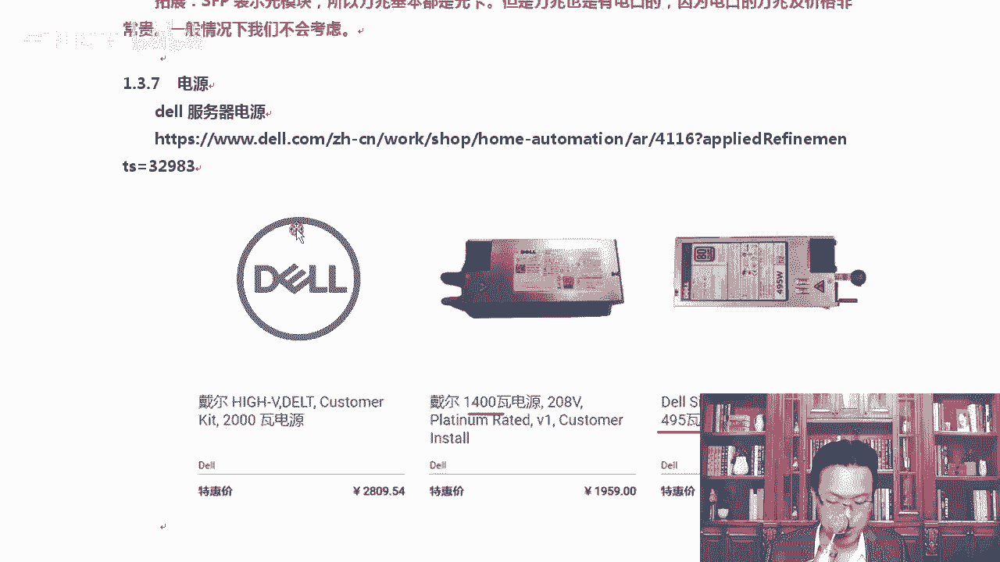

## 电源

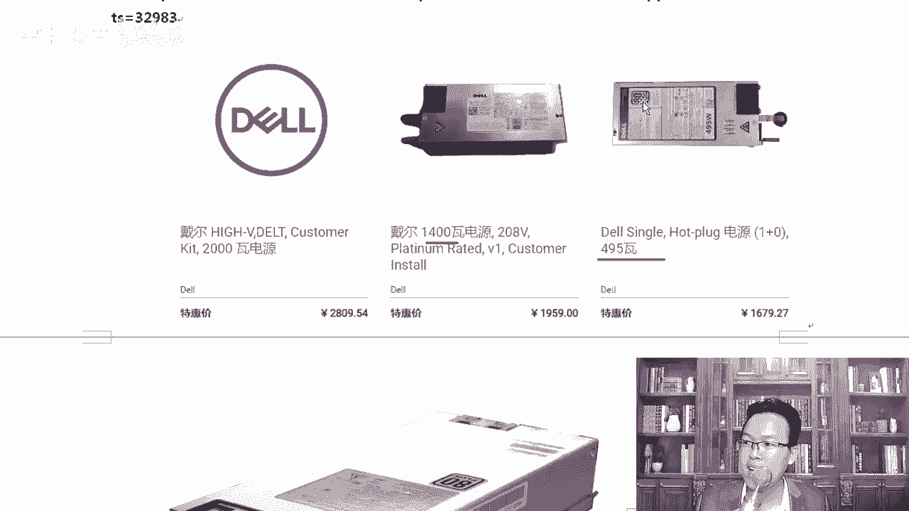

服务器电源与台式机电源不同。服务器电源通常设计得较扁，以适应机箱的U高度。

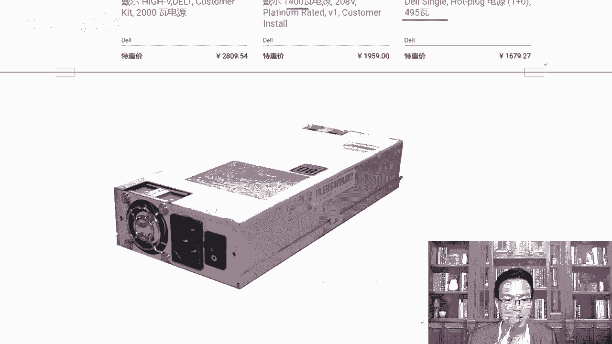

选择服务器电源时，需关注其功率（瓦数），确保足够。电源上常见的 **80 Plus** 标志是一个国际节能认证标准。

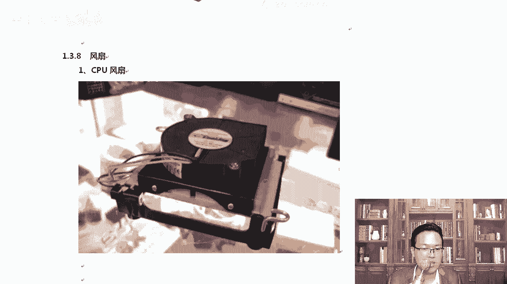

## 风扇

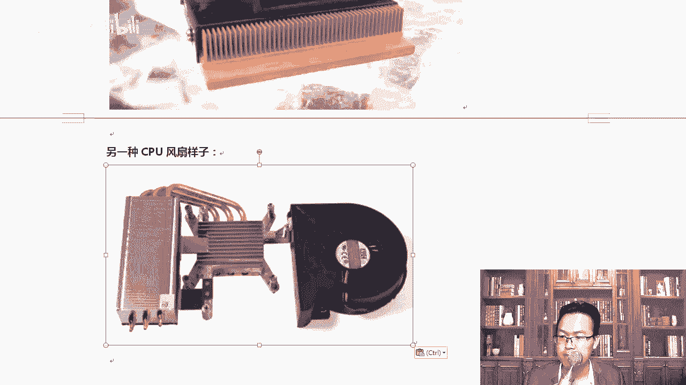

服务器风扇的设计也与台式机不同。台式机风扇可能较厚且有炫酷灯光，而服务器风扇通常设计扁平以节省空间。

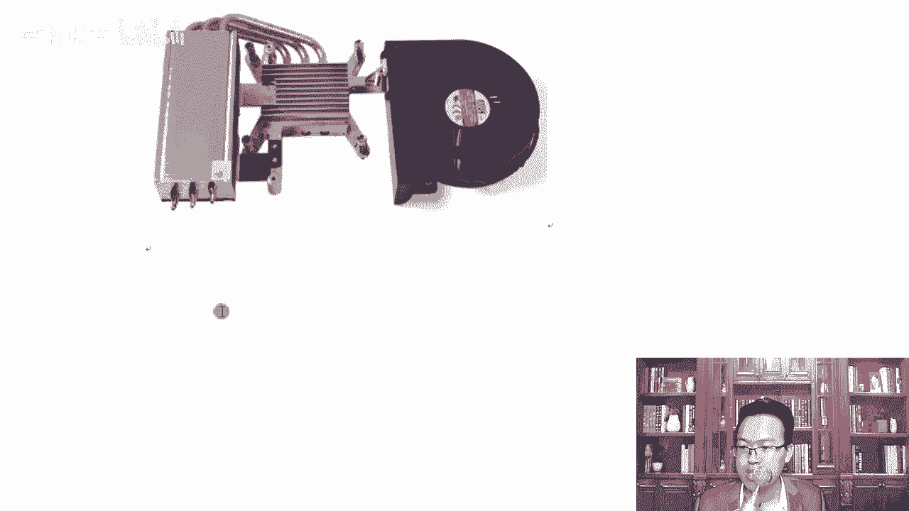

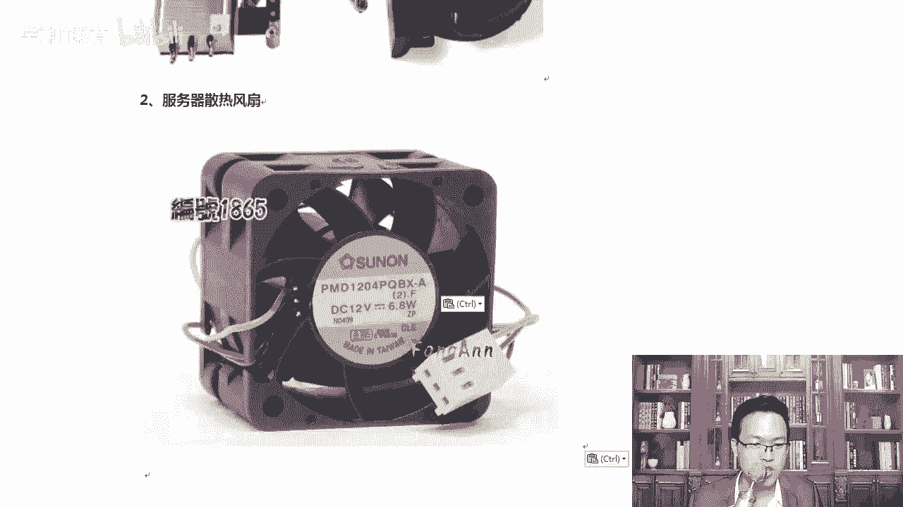

服务器风扇主要有两种类型：
*   **CPU风扇**：直接覆盖在CPU上，通常采用纯铜材质以增强散热。
*   **系统风扇**：安装在机箱特定位置（如硬盘背板附近），用于整个系统的风道散热。这类风扇运行时声音可能较大。

在某些情况下，如果CPU配备了独立的强力散热风扇，可以考虑调整或拔除部分系统风扇以降低噪音，但这需确保不影响整体散热。

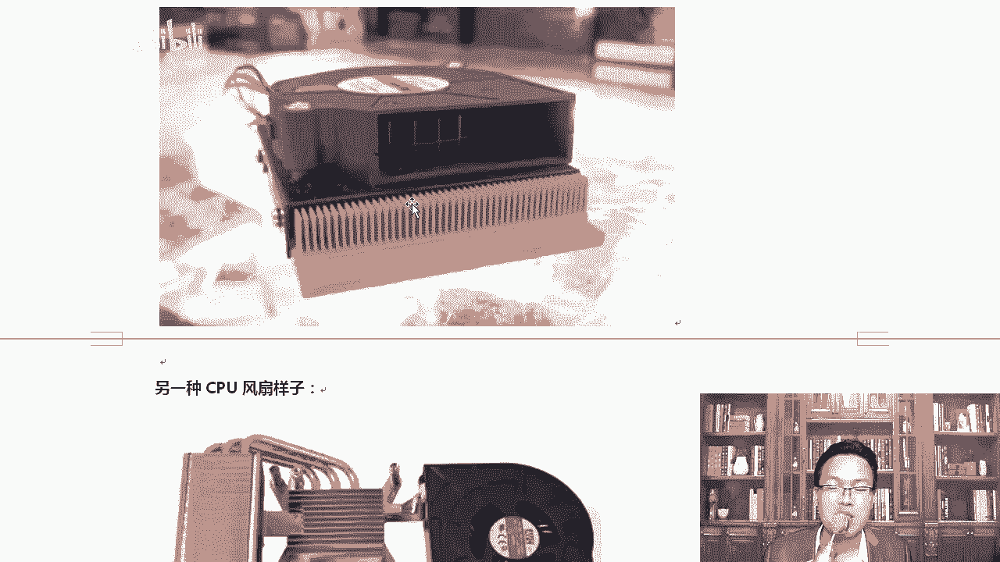

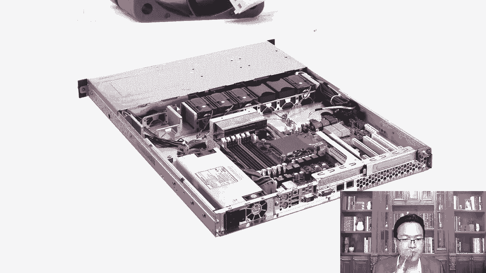

本节课中我们一起学习了服务器中的Raid卡、网卡、电源和风扇等关键硬件。了解这些组件有助于我们根据实际需求去选择和定制合适的服务器。