# CentOS8操作系统从入门到精通：P29：8-实战-根据需求定制一台成功的服务器 🖥️

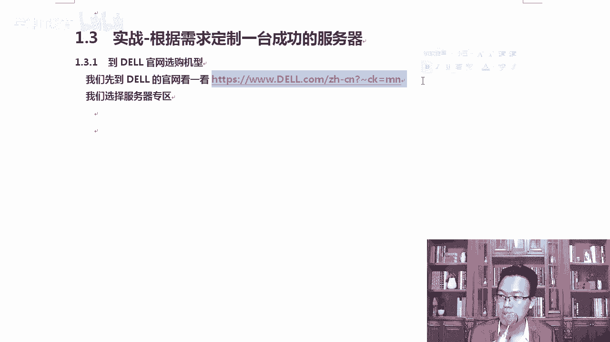

在本节课中，我们将学习如何根据自己的需求，在戴尔官方网站上选择和定制一台服务器。这个过程与在线购买电脑类似，我们将了解服务器的命名规则、关键配置选项以及如何进行比较和购买。

## 访问官方网站

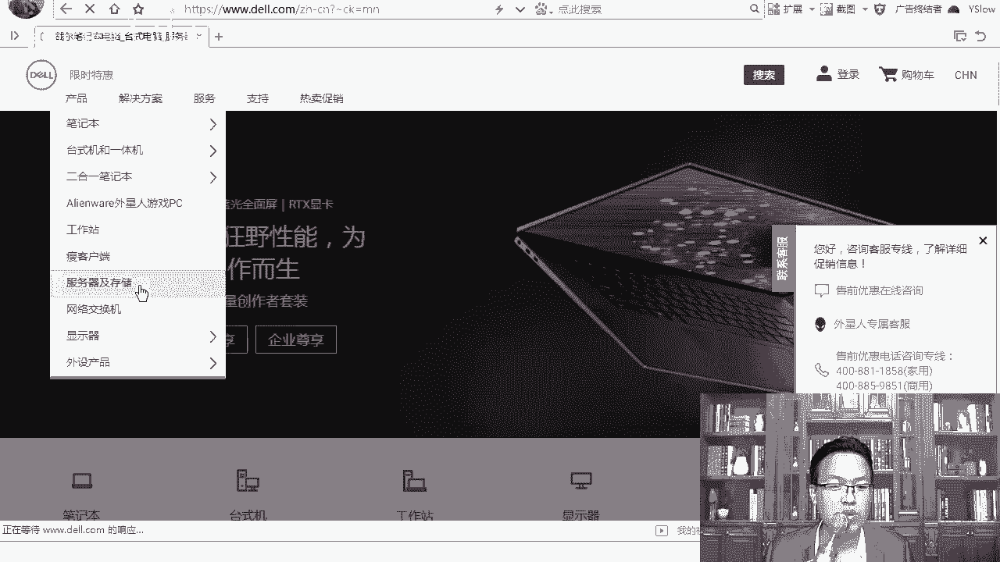

首先，我们可以访问戴尔官方网站来选择和配置服务器。当然，您也可以选择在京东、淘宝或天猫等电商平台购买联想或其他品牌的服务器，其流程是相似的。

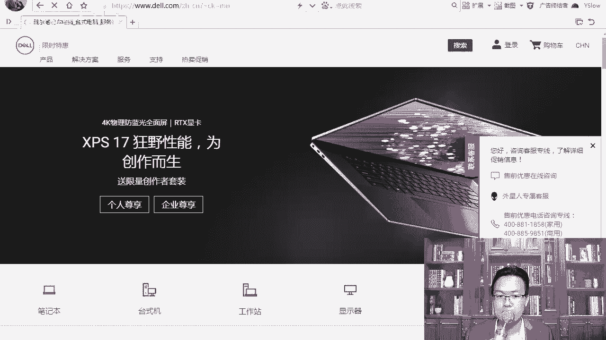

打开网站后，页面上有众多产品分类。我们的主要目标是选择“产品”类别下的“服务器”。您也可以直接联系商用客服，告知您的配置需求，他们会像客服一样为您提供方案。

我们点击“服务器及存储”选项。由于淘宝、天猫、京东等平台大家较为熟悉，此处不再演示。

点击进入服务器页面。您也可以直接查看家用或商用分类，或致电客服提出配置要求。购买过程总体上是方便的。

## 理解服务器命名规则

打开选购页面后，选择服务器时需要注意戴尔服务器的命名规则。服务器型号通常以特定字母开头，这代表了其形态。

以下是戴尔服务器常见的命名前缀及其含义：
*   **以“T”开头**：代表塔式服务器。
*   **以“R”开头**：代表机架式服务器（如1U、2U规格）。

选择时请勿混淆。通常，放置在IDC机房的是机架式服务器，以节省空间；而放置在公司内部使用的则可以是塔式服务器。

## 浏览与选择服务器

页面关闭后，您可以看到“售前优惠QQ咨询”等选项，有任何疑问都可以直接咨询客服。购买品牌服务器后，硬件出现问题可以直接联系他们，通常会提供三年的质保和次日上门维修等服务。

例如，页面上有“R2540银牌服务器”等选项。我们点击查看。

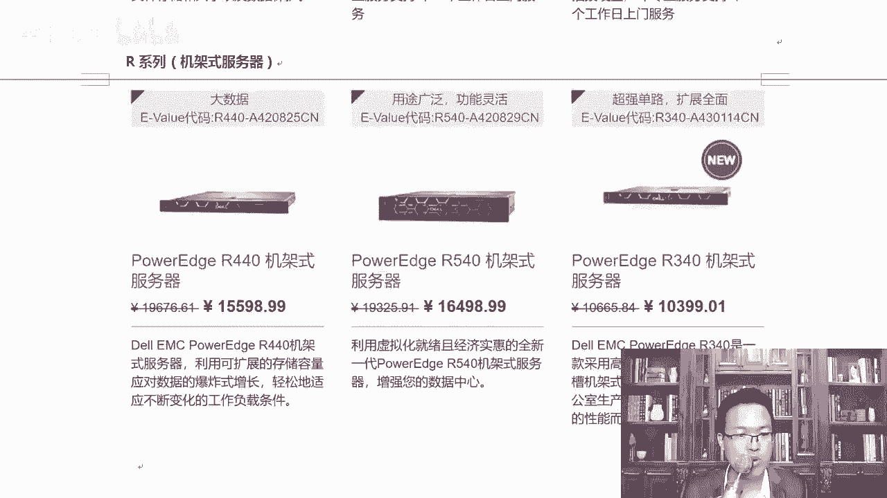

此外，还有戴尔的存储设备。请注意“Dell EMC”标志，EMC是一家专门做存储的公司。这里涉及一个背景：几年前国内有“去IOE”计划，其中“I”指IBM（服务器），“O”指Oracle（数据库），“E”指EMC（存储）。戴尔在2015年收购了EMC公司。

## 对比服务器配置

接下来，我们选择具体的服务器型号进行配置对比。网站提供了方便的对比功能。

例如，选择“R2540企业机架服务器”。您可以通过勾选复选框来对比多台机器。对比信息会清晰列出，例如：
*   **处理器**：英特尔至强银牌4210处理器（这里体现了至强处理器按**铂金、金牌、银牌、铜牌**的分级）。
*   **价格**：明确标价。
*   **内存与存储**：例如16GB内存，2TB SATA热插拔硬盘（标注清晰，非混淆的“SAS”）。
*   **服务**：包含上门服务等选项。

您可以根据需求，逐条对比规格和参数，例如机箱尺寸（3.5英寸）、支持的热插拔硬盘数量、是否包含软RAID等。

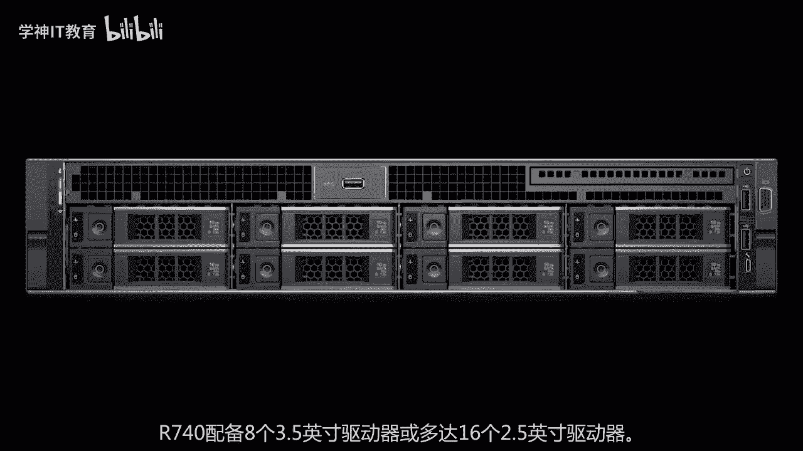

## 按形态筛选服务器

您可以根据部署环境筛选服务器形态。

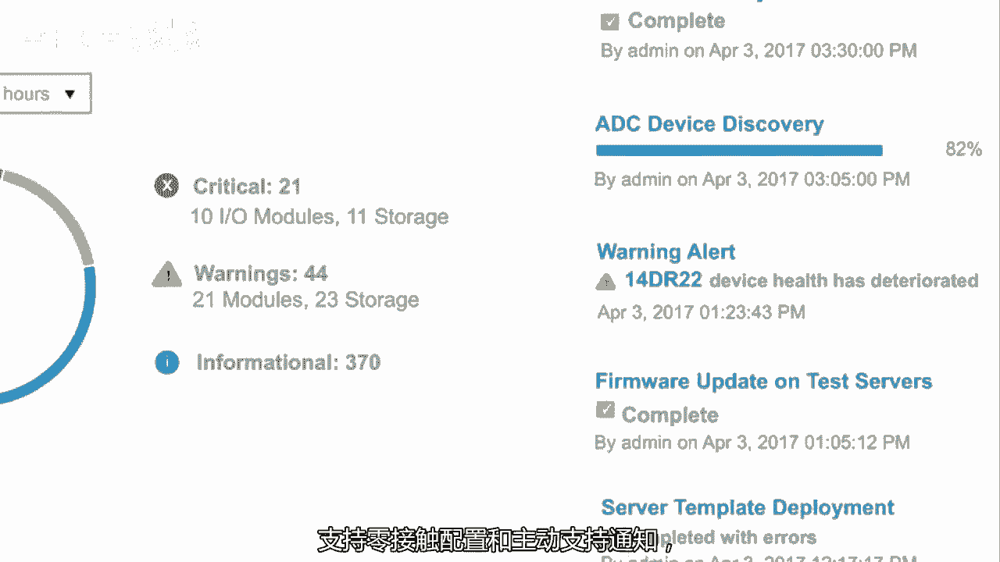

以下是主要的服务器形态分类：
*   **塔式服务器**：型号以“T”开头，如T440, T640。
*   **机架式服务器**：型号以“R”开头，如R740, R540。其中“2U”表示两单元高度。
*   **高密度服务器**：以“C”开头，通常用于特定场景。

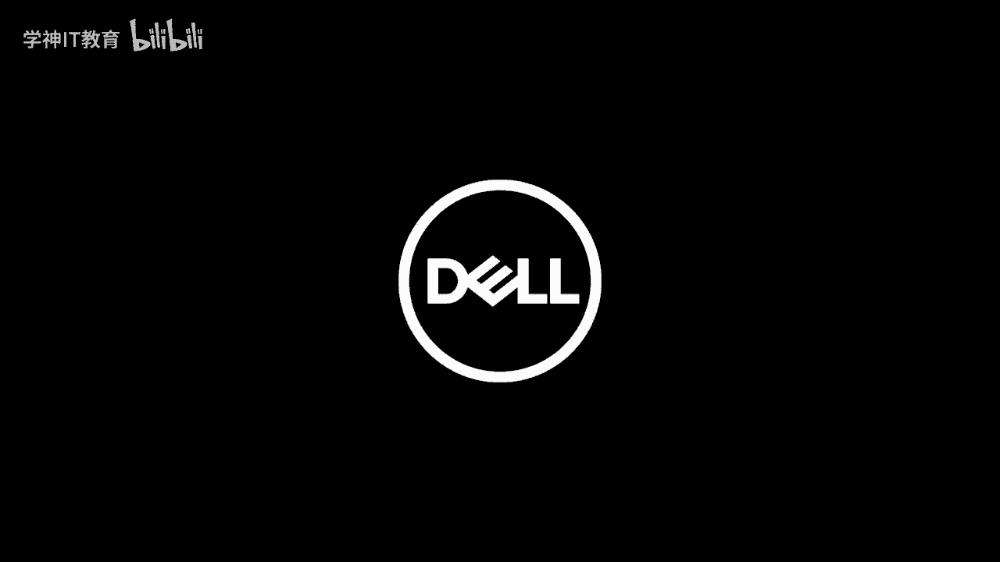

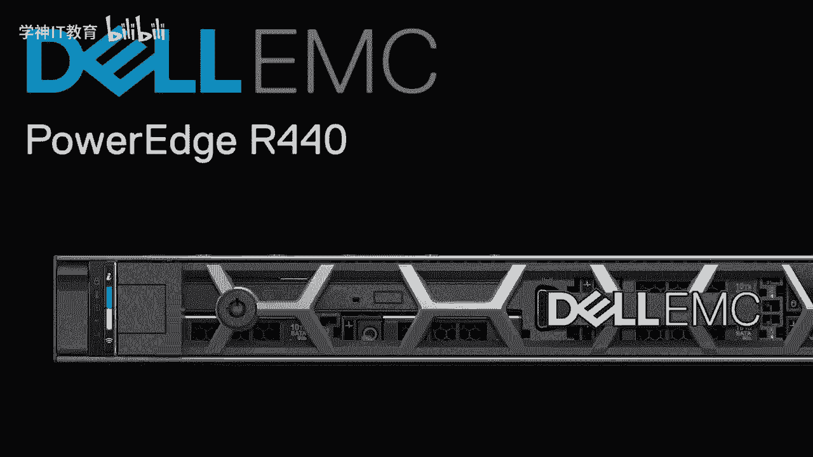

在机架式服务器中，网站会进一步按CPU路数（单路、双路、四路）和品牌（英特尔、AMD）进行分类，方便您按需选择。例如，R740是常见的双路2U通用服务器。

## 了解服务器外观与内部

如果您对服务器的物理外观和内部结构感兴趣，可以查看产品介绍视频或图片。这对于没有机会接触实体硬件的学习者是一个很好的补充。拆解服务器与拆解台式电脑有相似之处。

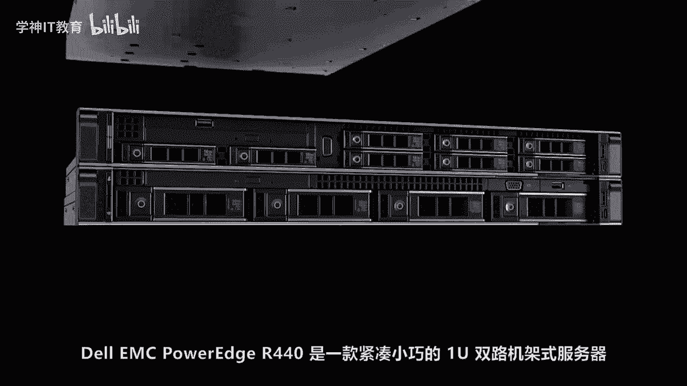

视频展示了戴尔PowerEdge R740和R440等服务器的设计、内部组件（如CPU、内存插槽、硬盘托架）以及集成的管理功能。

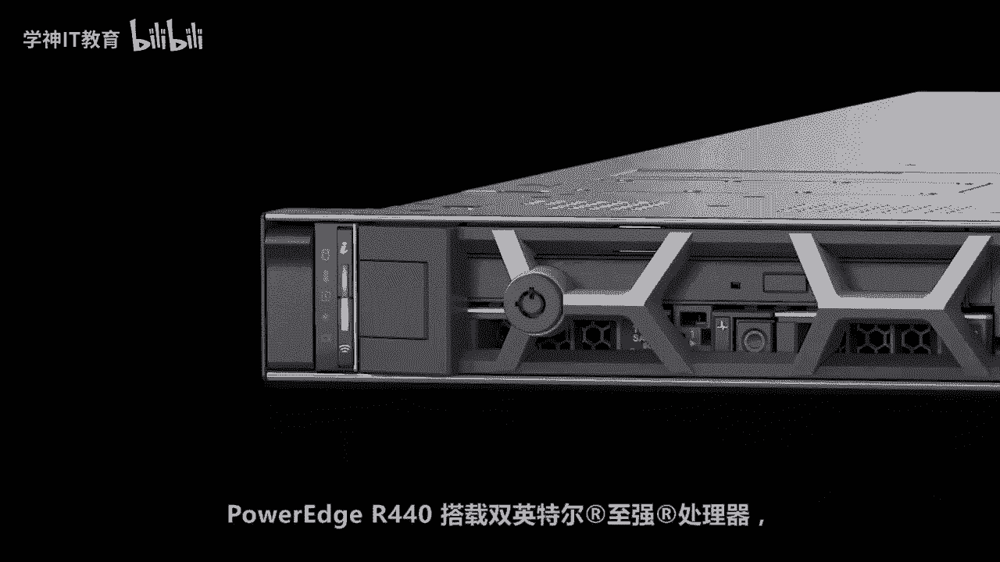

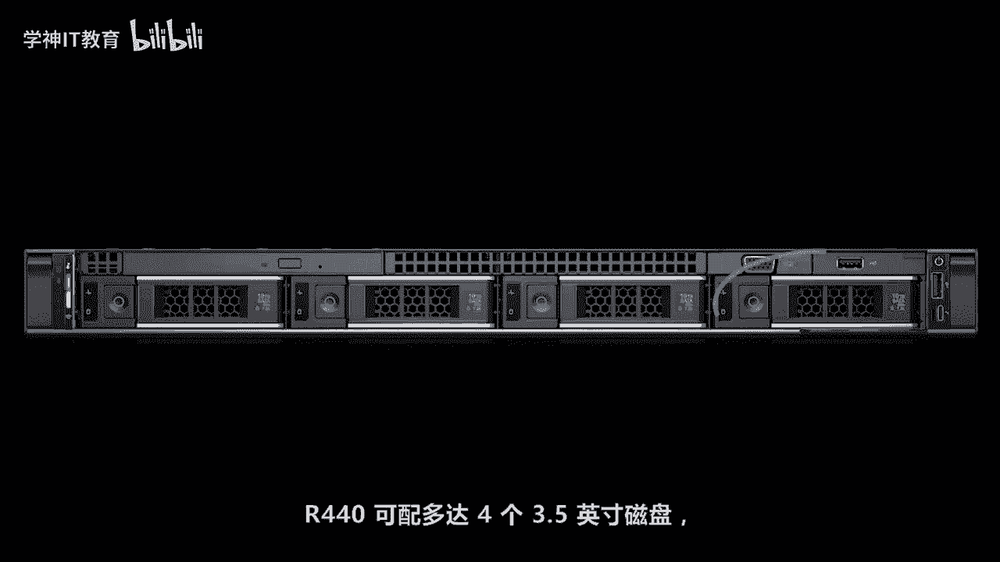

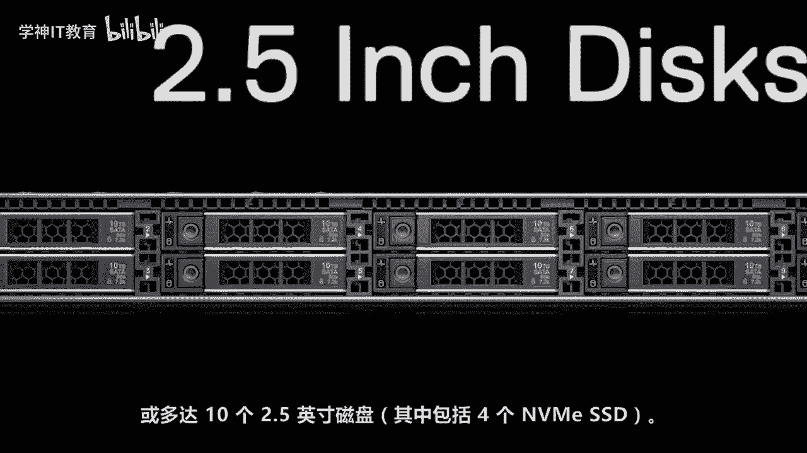

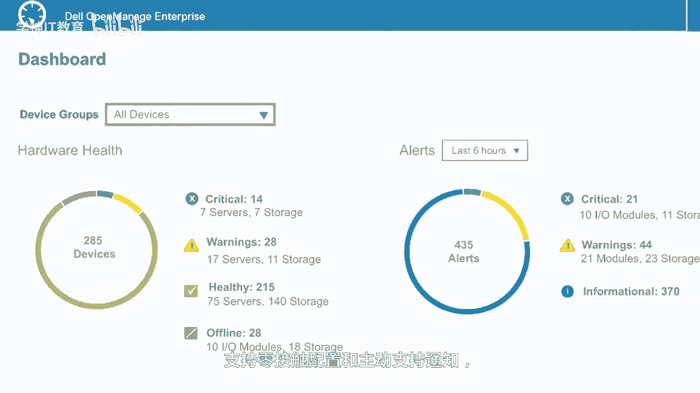

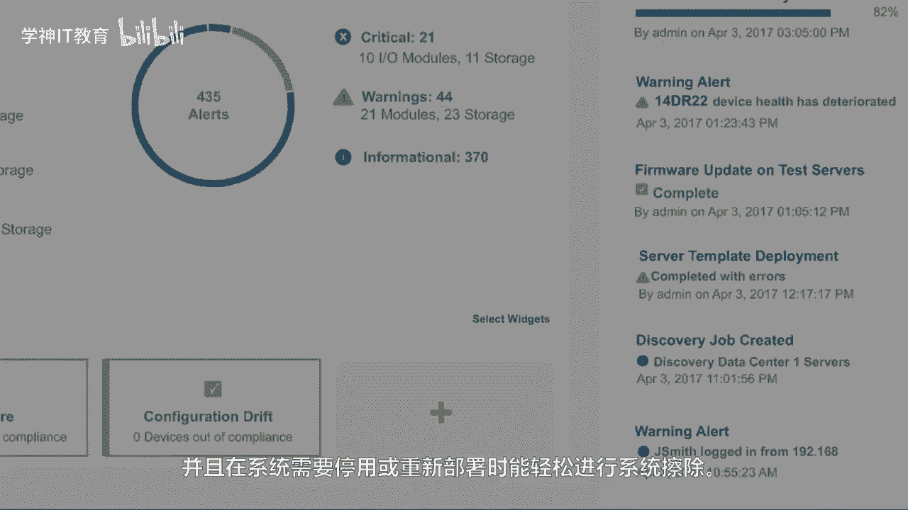

## 完成购买

对比和选定配置后，购买流程与常规电商购物一致：注册账号、绑定银行卡、下单支付即可。

## 课程总结

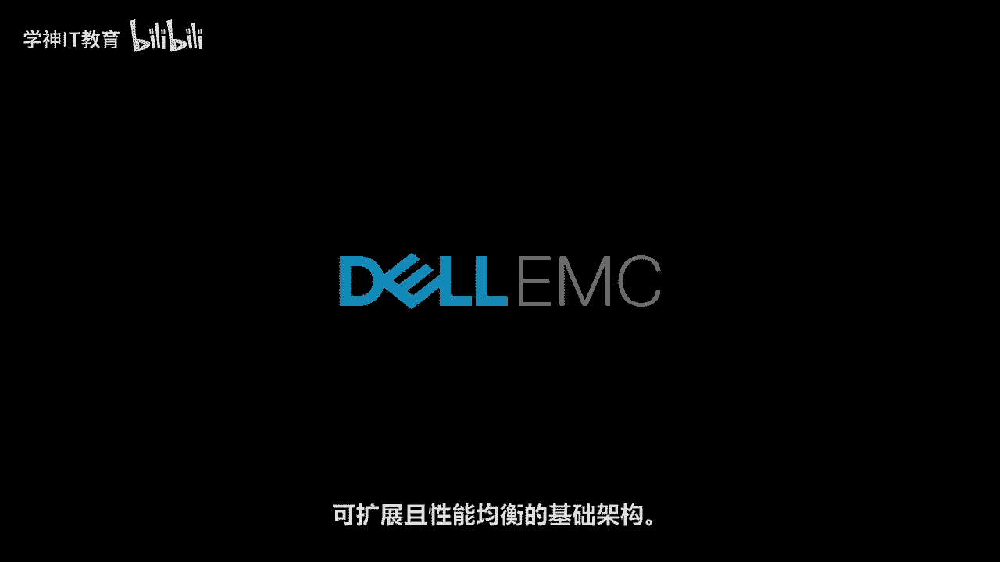

本节课中，我们一起学习了如何根据需求定制服务器。我们介绍了通过戴尔官网选择服务器的流程，理解了以 **“T”** 和 **“R”** 开头的命名规则所代表的塔式与机架式服务器区别，并实践了如何对比关键配置如**CPU型号（如至强银牌4210）**、内存、硬盘和服务条款。最后，我们了解了品牌服务器提供的售后保障。

这些知识能帮助您对服务器硬件建立初步认识。虽然在日常运维工作中可能不直接接触硬件，但了解这些基础有助于您理解后续Linux架构课程中服务所部署的物理环境。初次接触感到陌生是正常的，多看多了解即可。

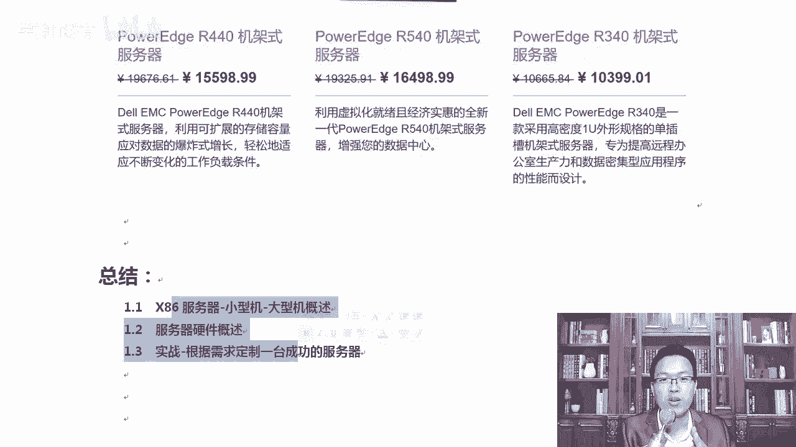

