# CentOS8 操作系统从入门到精通：P3：CentOS8 操作系统安装 - 前期准备工作 🛠️

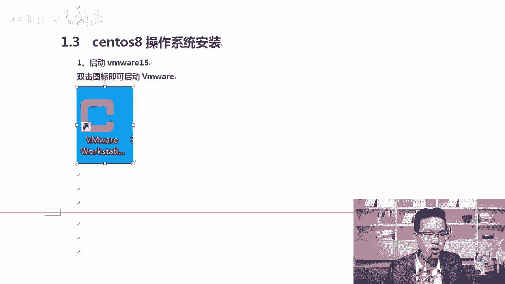

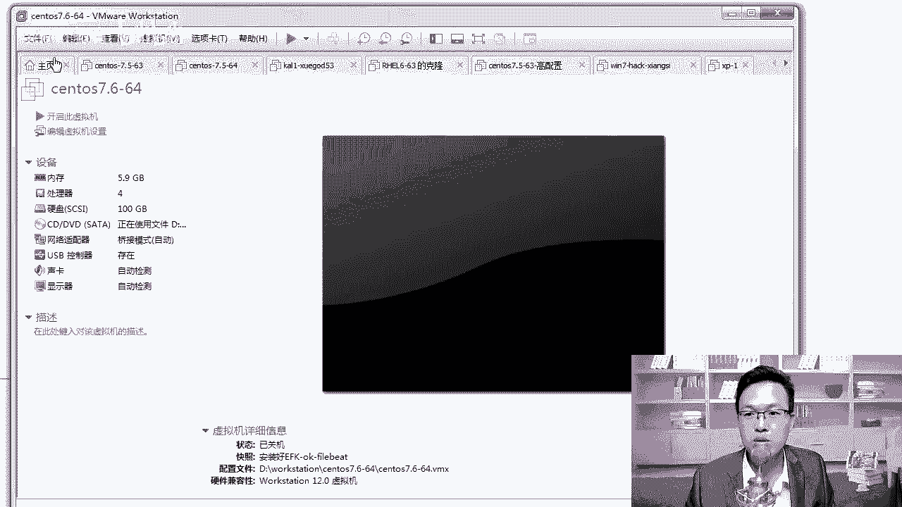

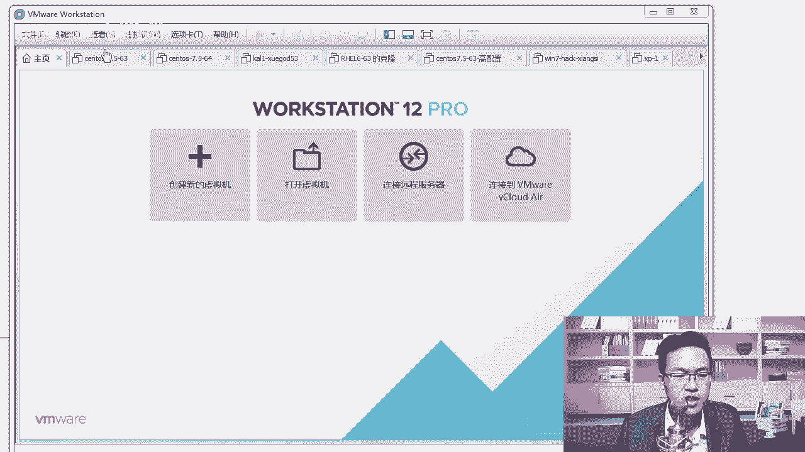

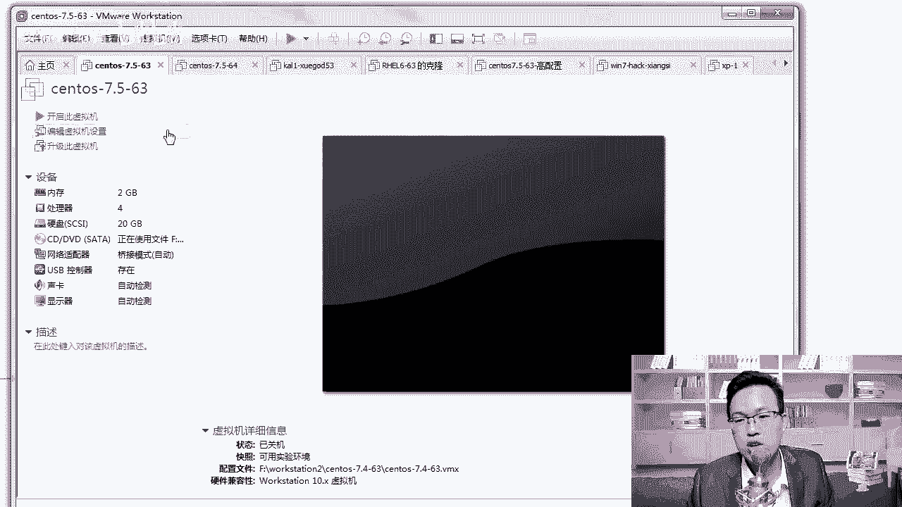

在本节课中，我们将学习如何在 VMware 虚拟机中安装 CentOS 8 操作系统。本节内容主要涵盖安装前的准备工作，包括虚拟机的创建、关键配置选项的解释以及可能遇到的问题和解决方案。

## 概述

安装 CentOS 8 系统前，需要在 VMware 中正确配置虚拟机。本节将指导你完成从启动 VMware 到配置虚拟机硬件、选择操作系统类型、设置网络和存储等一系列关键步骤，确保为后续的系统安装打下坚实基础。

## 启动 VMware 并创建新虚拟机

首先，双击桌面上的 VMware 图标启动程序。程序启动后，你可以通过点击主页的“创建新的虚拟机”或通过菜单栏的“文件”->“新建虚拟机”来开始创建过程。

## 选择虚拟机配置类型

在新建虚拟机向导中，建议选择“自定义（高级）”安装方式。这种方式提供了更详细的配置选项，便于我们根据需求进行定制。

## 选择操作系统

在“安装客户机操作系统”步骤，选择“稍后安装操作系统”。接着，在“选择客户机操作系统”界面，需要指定操作系统类型。

Linux 发行版众多，常见的有 Red Hat Enterprise Linux (RHEL)、CentOS、Fedora、Ubuntu 等。RHEL 是企业级收费系统，而 CentOS 是基于 RHEL 源代码重新编译的免费社区版，两者在命令和使用体验上几乎完全兼容。CentOS 通常会在 RHEL 新版本发布后约半年推出对应版本。

对于本教程，我们选择 **Linux** -> **Red Hat Enterprise Linux 7 64 位**。即使你安装的是 CentOS 8，选择这个版本也能保证兼容性。

## 命名虚拟机与选择位置

为虚拟机起一个易于识别的名字，例如 `CentOS8-192.168.1.63`，这样可以通过名字快速了解系统版本和预设的 IP 地址。

**重要提示**：虚拟机文件较大，请勿将其安装在系统盘（如 C 盘），以免挤满磁盘空间。应将其安装在其他有足够空间的磁盘分区。

## 处理器与内存配置

*   **处理器数量**：对于个人电脑，通常选择 **1** 个。
*   **每个处理器的核心数量**：根据你电脑 CPU 的实际核心数设置，例如四核 CPU 可以设置为 **4**。设置更多核心可以让虚拟机运行更流畅。
*   **内存**：如果计划安装图形界面，建议分配 **2048 MB (2 GB)** 内存。如果仅使用命令行界面，分配 512 MB 或 1 GB 即可。

## 网络类型选择

网络连接有三种主要模式：
*   **桥接模式**：虚拟机会像一台真实的设备一样接入你的物理网络，直接从路由器获取 IP 地址。如果你的家庭或公司网络没有做特殊限制（如 MAC 地址绑定），推荐使用此模式，便于模拟真实服务器环境。
*   **NAT 模式**：虚拟机通过主机的网络地址转换功能上网，会获得一个私有 IP。适用于网络有严格管控的环境（如某些校园网）。
*   **仅主机模式**：虚拟机仅与主机通信，不连接外网。

对于大多数家庭网络，选择 **桥接模式** 即可。

## 选择磁盘控制器类型

在“选择磁盘类型”步骤，请务必选择 **SCSI** 类型。

虽然 VMware 15 可能推荐更新的 **NVMe** 类型（一种能极大提升固态硬盘性能的新接口协议），但为了与后续课程中 Linux 磁盘管理的教学内容保持一致（Linux 下 SCSI 磁盘通常显示为 `sda`, `sdb` 等），我们在此选择 SCSI。NVMe 磁盘的管理方式有所不同，我们会在后续课程中单独介绍。

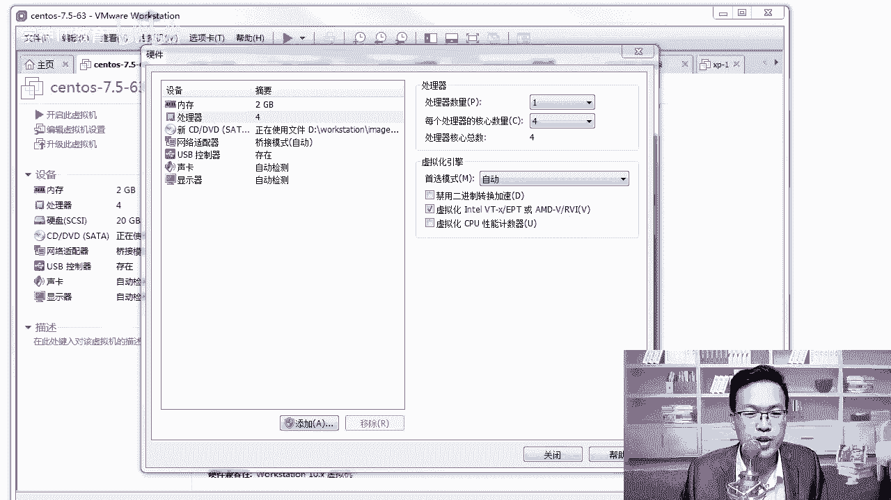

## 指定磁盘容量

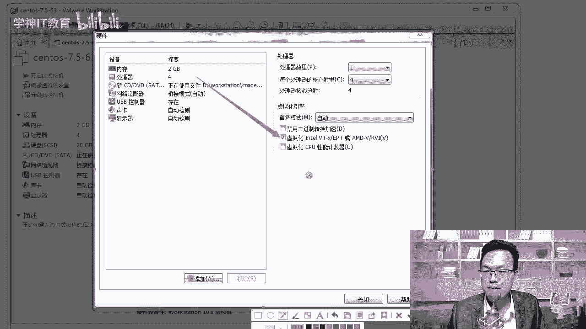

建议为虚拟机磁盘分配 **100 GB** 空间。如果主机磁盘空间紧张，分配 20 GB 也可以完成基础安装。

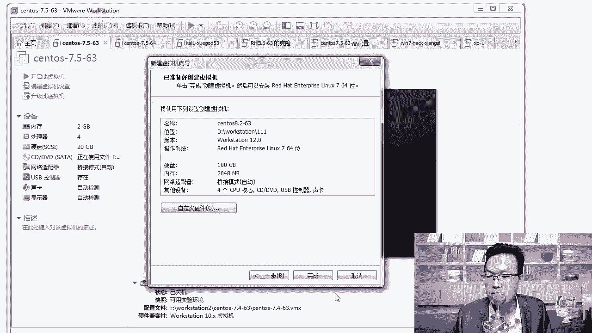

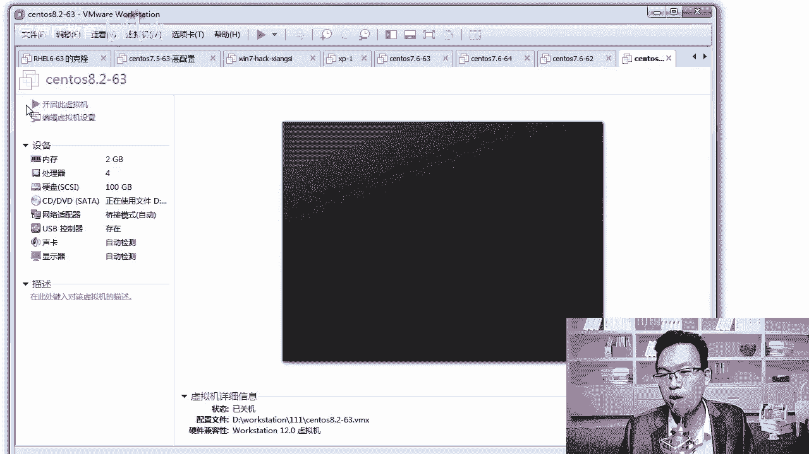

**关键设置**：**不要勾选“立即分配所有磁盘空间”**。如果勾选，VMware 会立刻在主机上占用 100 GB 空间；不勾选，则会采用“稀疏文件”方式，虚拟机实际占用空间随使用量增长而增长。

磁盘文件可以选择存储为“单个文件”，这样性能较好且便于管理。

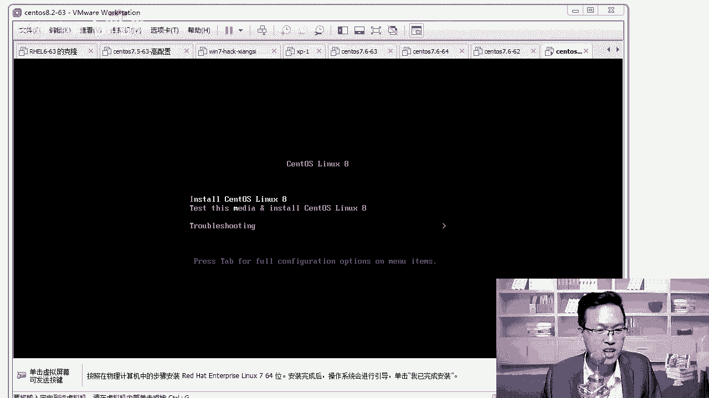

## 自定义硬件与加载镜像

在向导最后，点击“自定义硬件”进行进一步设置。

1.  **移除不必要的硬件**：例如“打印机”通常无用，可以移除。“声卡”可根据需要保留或移除。
2.  **加载安装镜像**：在“CD/DVD (IDE)”设备中，选择“使用 ISO 映像文件”，然后浏览并选择你下载好的 CentOS 8.2 ISO 文件。确保勾选“启动时连接”。
3.  **启用虚拟化支持**：在“处理器”设置中，**务必勾选“虚拟化 Intel VT-x/EPT 或 AMD-V/RVI”**。这个选项对于后续在虚拟机内再进行虚拟化（如学习 KVM 技术）至关重要。

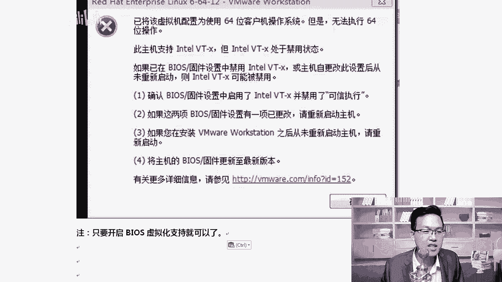

完成所有设置后，关闭硬件窗口并完成虚拟机创建。

## 解决常见问题：启用 BIOS/UEFI 中的虚拟化技术

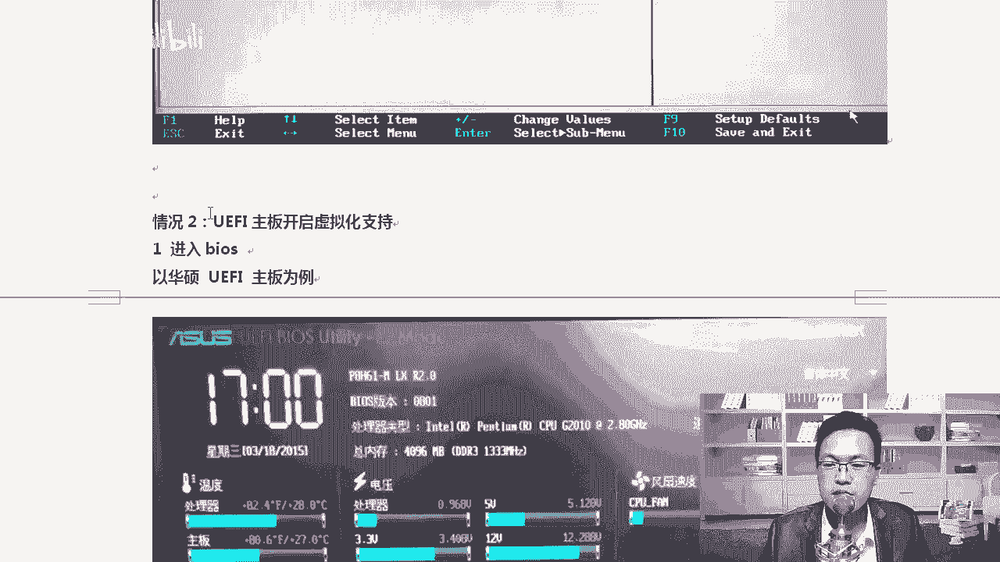

首次启动虚拟机时，可能会遇到错误提示：“此主机支持 Intel VT-x，但 Intel VT-x 处于禁用状态”。

这意味着你电脑的 BIOS/UEFI 设置中的 CPU 虚拟化技术被禁用了，需要进入主板设置开启它。

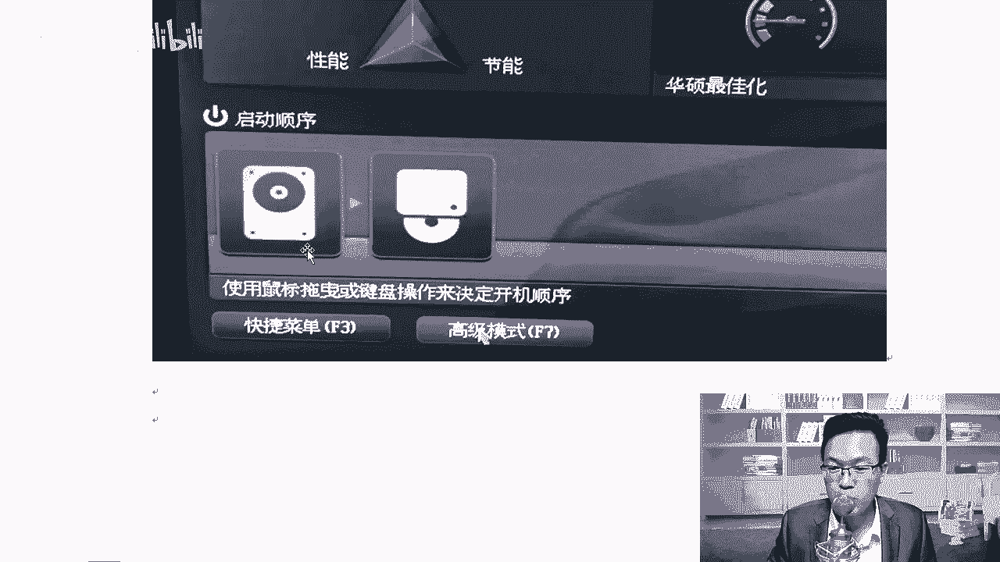

以下是通用步骤：
1.  重启电脑，在开机自检画面时，按特定键进入 BIOS/UEFI 设置界面（常见按键有 `Delete`、`F2`、`F10`、`F12`，因电脑品牌而异）。
2.  在设置界面中，找到“Advanced”（高级）或类似选项。
3.  寻找包含“Virtualization Technology”、“Intel VT-x”、“AMD-V”或“SVM Mode”字样的设置项。
4.  将其状态从“Disabled”（禁用）更改为“Enabled”（启用）。
5.  按 `F10` 保存设置并退出，电脑会自动重启。

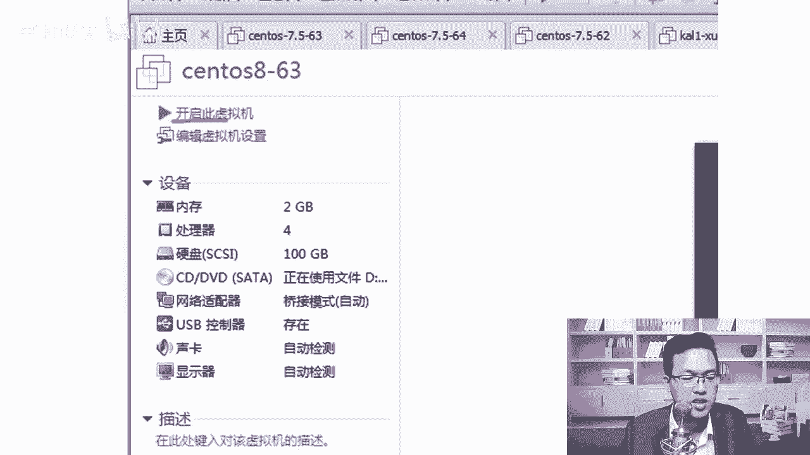

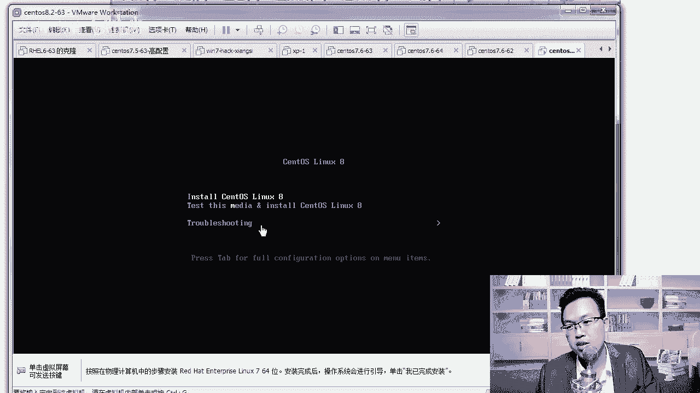

开启此功能后，重新启动 VMware 并开启虚拟机即可。

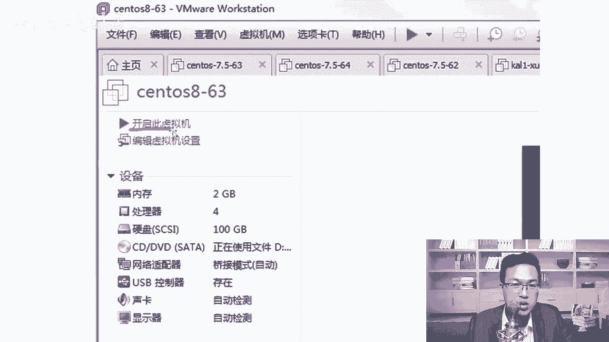

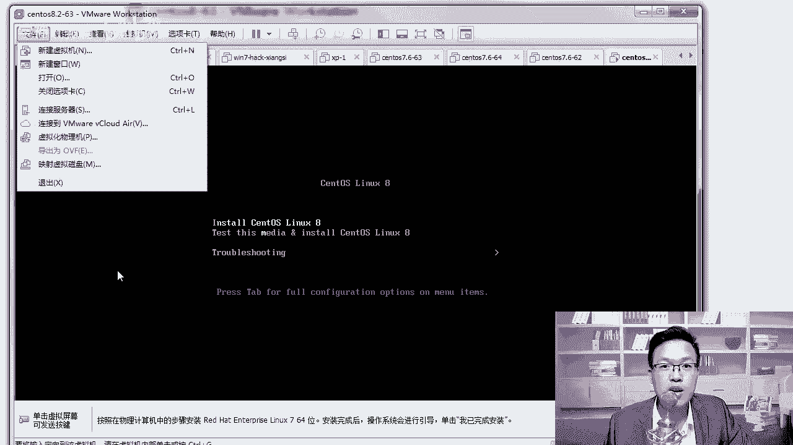

## 开始安装

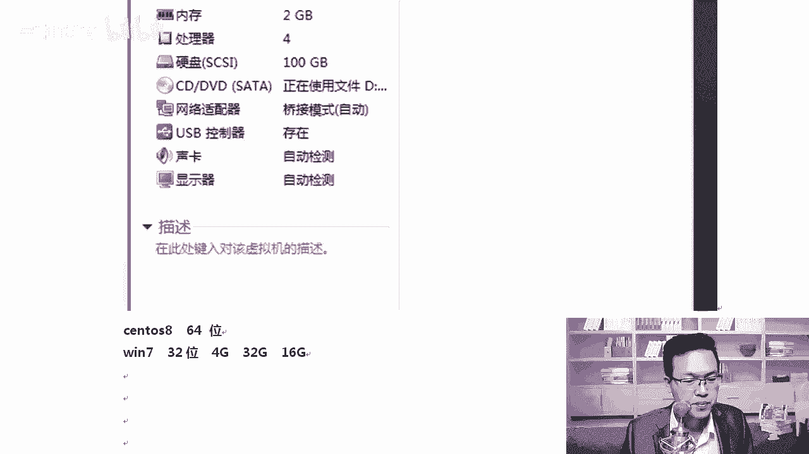

开启虚拟机电源后，你会看到 CentOS 安装引导界面。使用键盘上下箭头键选择第一项 **“Install CentOS Linux 8”**，然后按 `Enter` 键开始安装过程。

**提示**：鼠标被虚拟机捕获后，可以按 `Ctrl + Alt` 组合键将鼠标释放回主机。

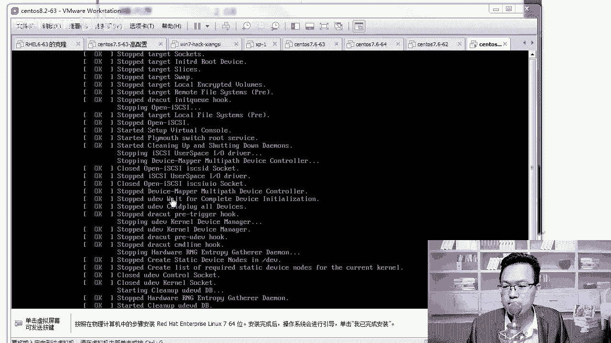

## 总结

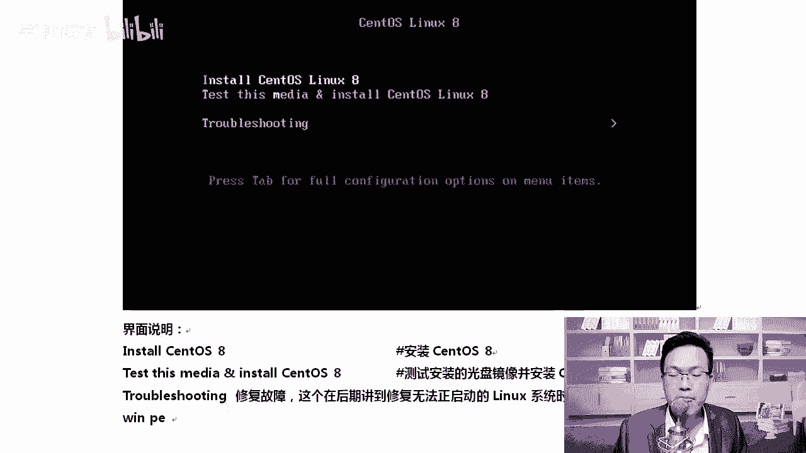

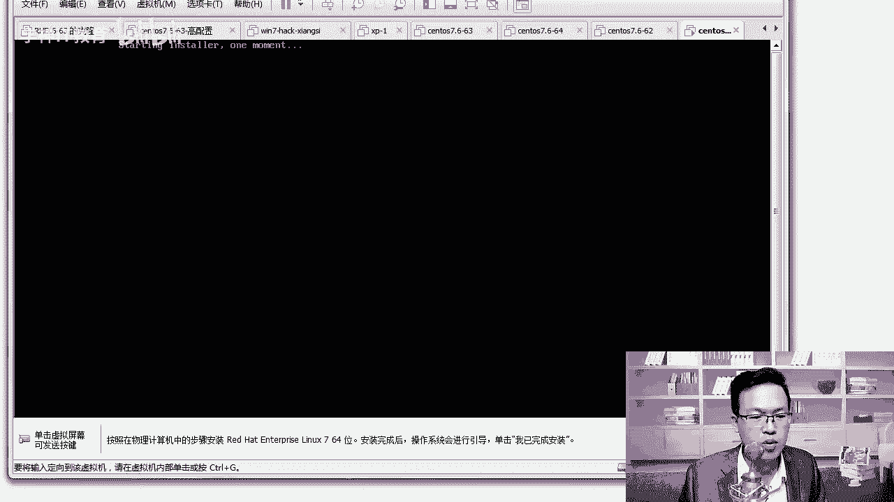

本节课中，我们一起完成了在 VMware 中安装 CentOS 8 操作系统的全部前期准备工作。我们学习了如何创建和配置虚拟机，包括选择操作系统类型、分配硬件资源、设置网络和存储，并解决了可能遇到的虚拟化技术禁用问题。现在，虚拟机已经准备就绪，下一节课我们将进入 CentOS 8 系统的具体安装和配置环节。