# CentOS 8 操作系统从入门到精通：P5：操作系统重启后的相关配置 🖥️

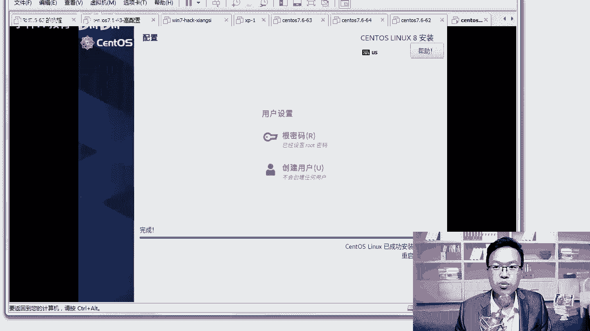

在本节课中，我们将学习 CentOS 8 操作系统安装完成并首次重启后，需要进行的一系列基础配置。这些步骤包括接受许可协议、创建用户、以管理员身份登录以及熟悉图形界面的基本操作。

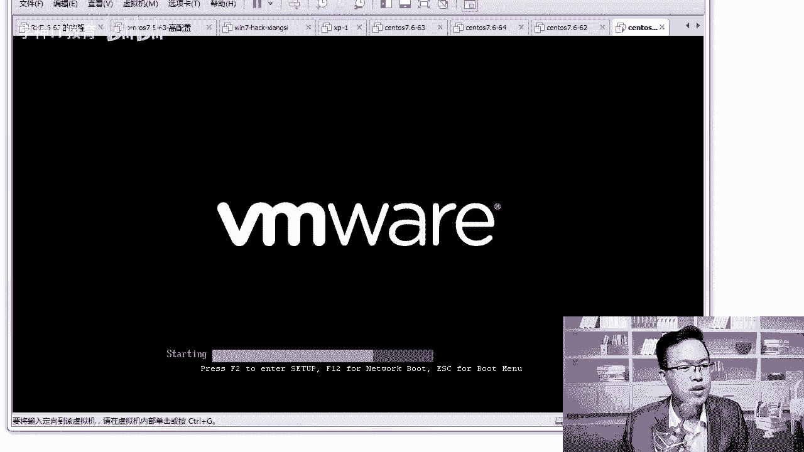

---

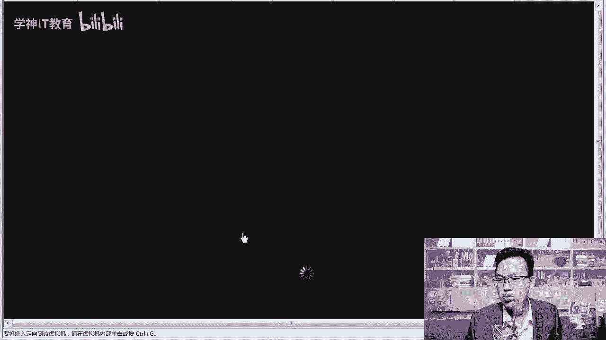

## 系统重启与初始界面

上一节我们完成了 CentOS 8 的安装过程。安装完成后，系统会提示重启。点击重启按钮后，系统将重新加载。

重启过程中，会有一个短暂的倒计时界面。等待倒计时结束，系统将进入图形化启动界面。

> 从 CentOS 7 开始，系统在安装时已自动集成了 VMware Tools（或对应虚拟化平台的增强工具）。这意味着我们无需再手动安装。该工具的主要功能包括：
> *   实现物理机与虚拟机之间的文件拖拽。
> *   允许虚拟机窗口自适应调整大小，以获得更好的显示体验（默认窗口可能较小）。

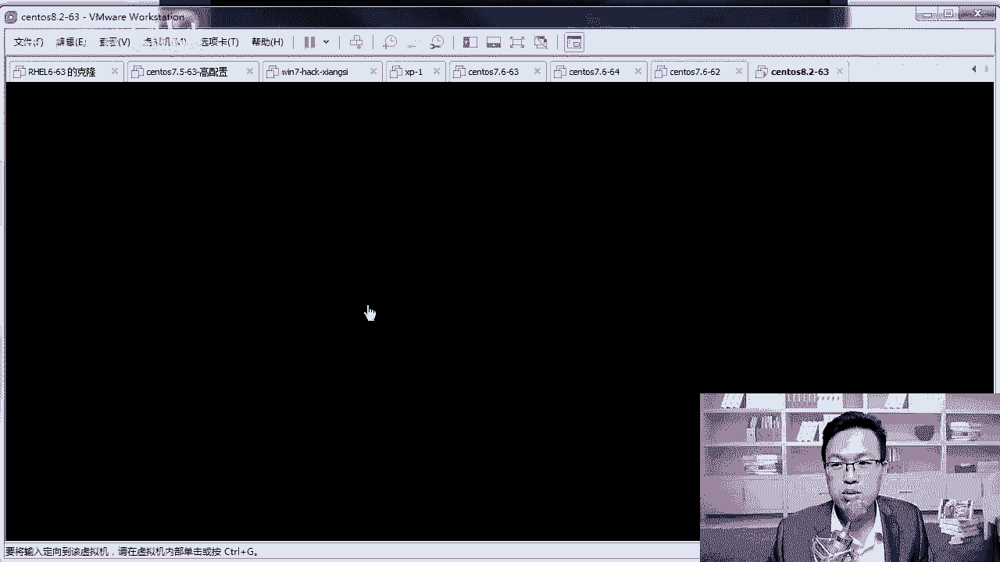

## 接受许可协议

系统首次启动后，会进入初始配置界面。首先需要处理的是许可协议。

1.  点击“未接收许可证”选项。
2.  仔细阅读协议内容后，点击“我同意许可协议”。
3.  点击“完成”按钮，结束许可协议的配置。

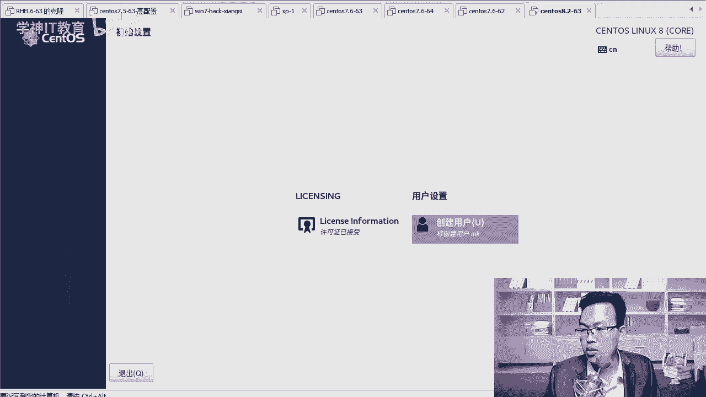

## 创建普通用户

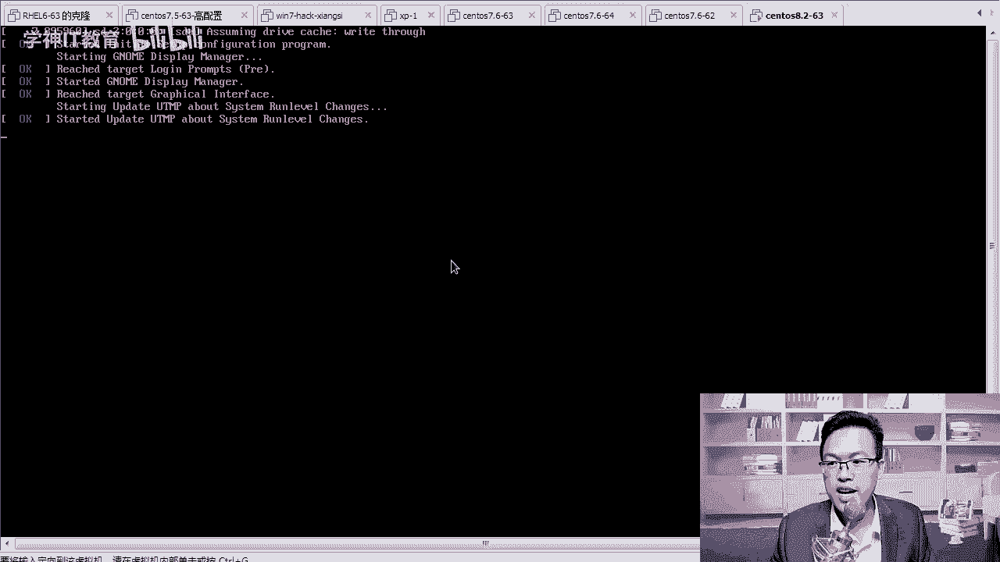

接受协议后，系统会引导创建一个普通用户账户。以下是创建步骤：

1.  在“全名”字段中，输入用户的全名（例如：MK）。
2.  在“密码”和“确认密码”字段中，输入相同的密码（例如：123456）。如果密码过于简单，系统会提示，但可以连续点击“完成”两次以确认使用该密码。
3.  用户创建成功后，点击“结束配置”。

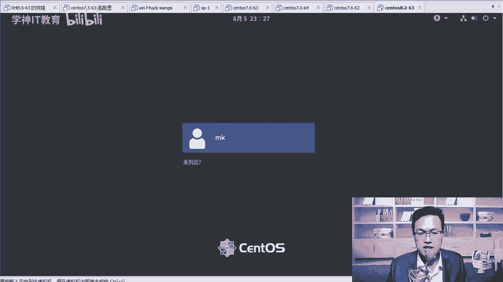

## 以管理员身份登录

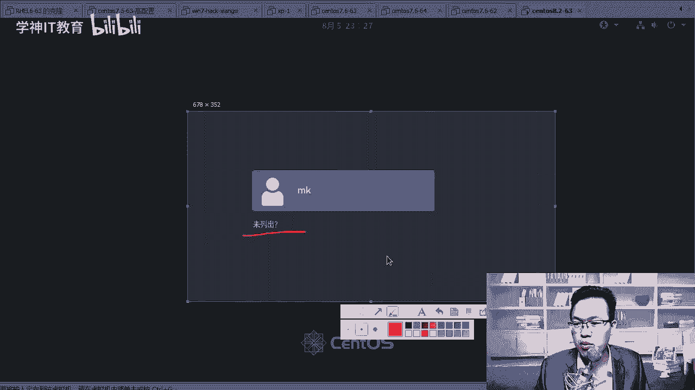

系统创建完普通用户后，会进入登录界面。默认会列出已创建的普通用户。为了获得系统的完全控制权，我们通常直接使用 `root`（超级管理员）账户登录。

1.  在登录界面，点击“未列出”。
2.  在弹出的用户名输入框中，输入 `root`。
3.  在密码输入框中，输入 `root` 账户的密码（即安装时设置的密码）。
4.  点击“登录”。

> **注意**：初学者在实验环境中使用 `root` 账户是可行的，便于学习。但在实际工作环境中，公司可能不会直接赋予 `root` 权限。如果拥有该权限，操作时需格外谨慎。实验环境可通过虚拟机快照功能快速还原。

## 完成首次登录向导

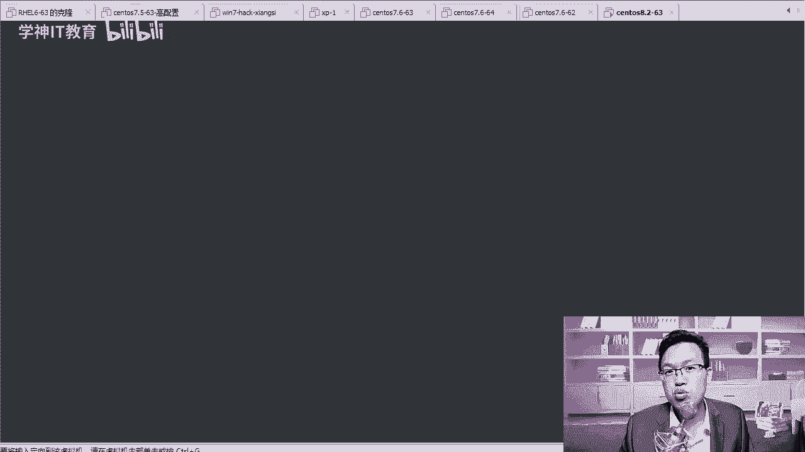

首次以 `root` 身份登录成功后，系统会显示一个欢迎向导，用于进行一些初始设置。

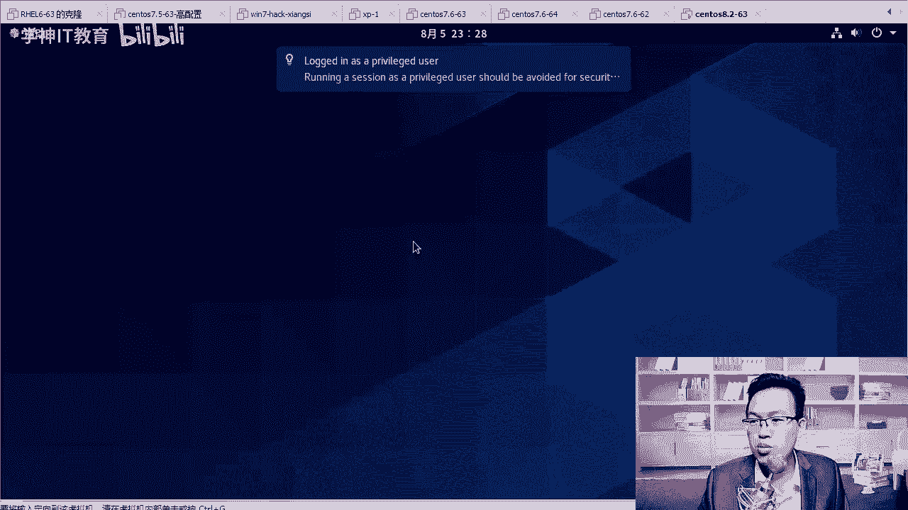

1.  **欢迎信息**：查看后点击“前进”。
2.  **语言设置**：默认已选择“汉语”，直接点击“前进”。
3.  **隐私设置**：地理位置服务可根据需要开启或关闭，建议关闭后点击“前进”。
4.  **在线账户**：如果没有需要连接的谷歌等在线账户，点击“跳过”。
5.  **开始使用**：最后点击“开始使用”，进入系统桌面。

系统可能还会弹出“Gnome Help”帮助文档，介绍一些桌面使用技巧。你可以选择关闭它，或简单浏览一下。其中包含了一些图形界面的特效和快捷键说明。

## 熟悉图形界面与打开终端

CentOS 8 的 GNOME 桌面环境与之前版本的操作略有不同。要打开命令行终端，请按以下步骤操作：

1.  点击桌面左上角的“活动”按钮。
2.  在弹出的侧边栏或顶部概览中，找到并点击“终端”图标。

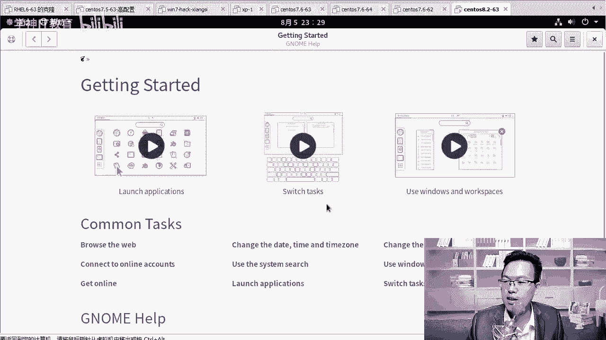

这样，终端窗口就会打开，你可以在这里输入并执行各种 Linux 命令。例如，你可以尝试测试网络连通性：

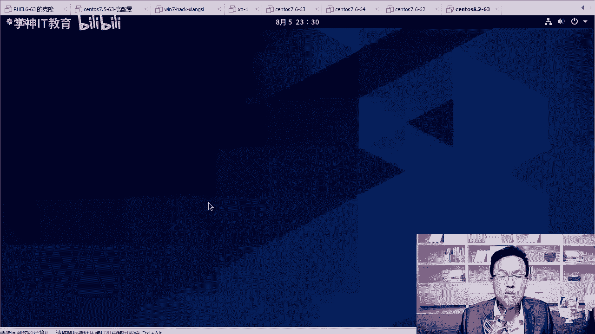

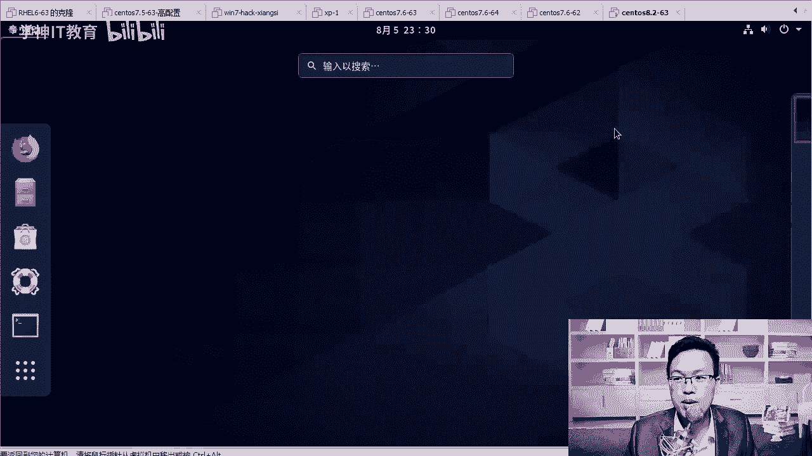

```bash
ping baidu.com
```

终端窗口支持双击标题栏进行最大化或还原操作。

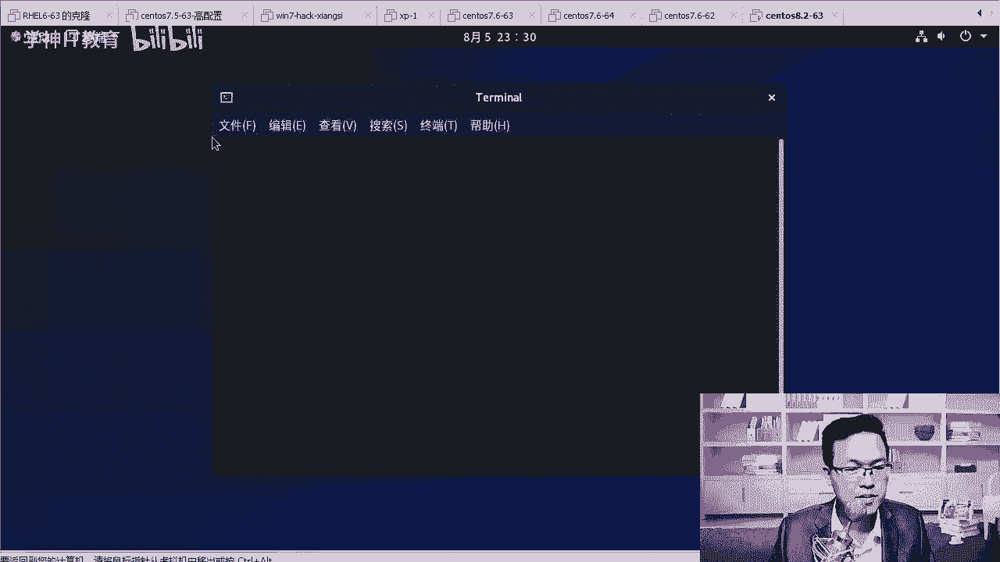

---

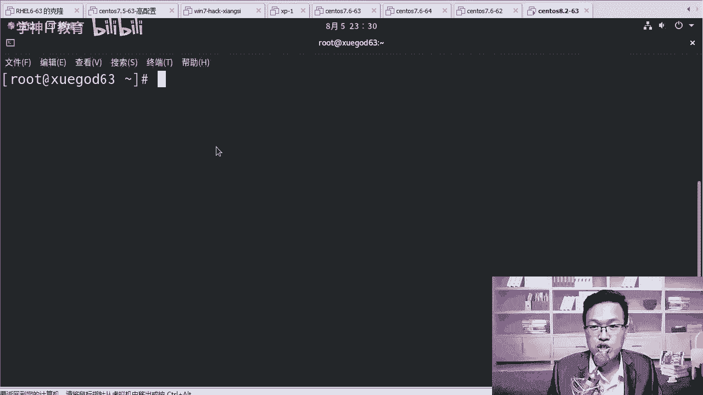

本节课中我们一起学习了 CentOS 8 首次启动后的完整配置流程：从接受许可、创建用户，到使用 `root` 账户登录并完成初始设置。最后，我们还学会了在 GNOME 桌面中如何打开终端窗口，为后续的命令行学习做好准备。现在，你的 CentOS 8 系统已经配置就绪，可以开始使用了。