# CentOS8操作系统从入门到精通：P6：VMware虚拟机12个使用技巧 🖥️

在本节课中，我们将学习VMware虚拟机的12个核心使用技巧。这些技巧涵盖了从虚拟机基本配置到高级网络设置的各个方面，能帮助你更高效地管理和使用虚拟机环境。

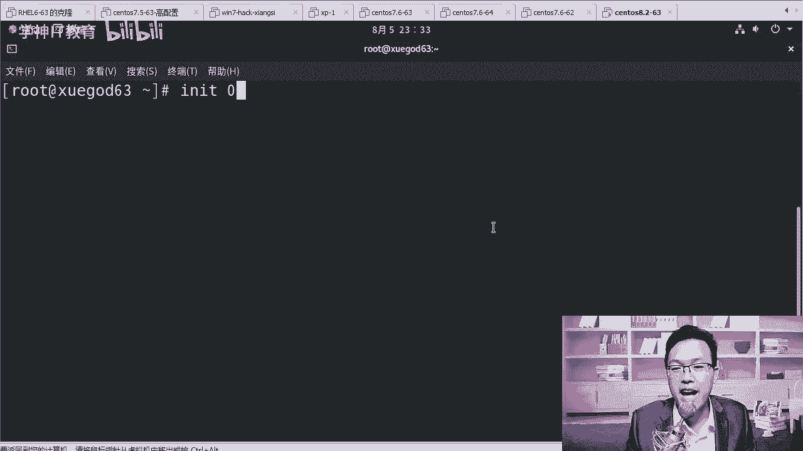

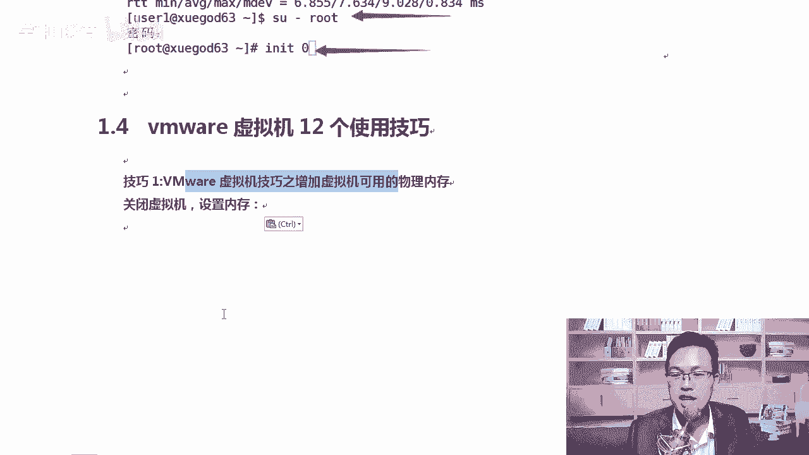

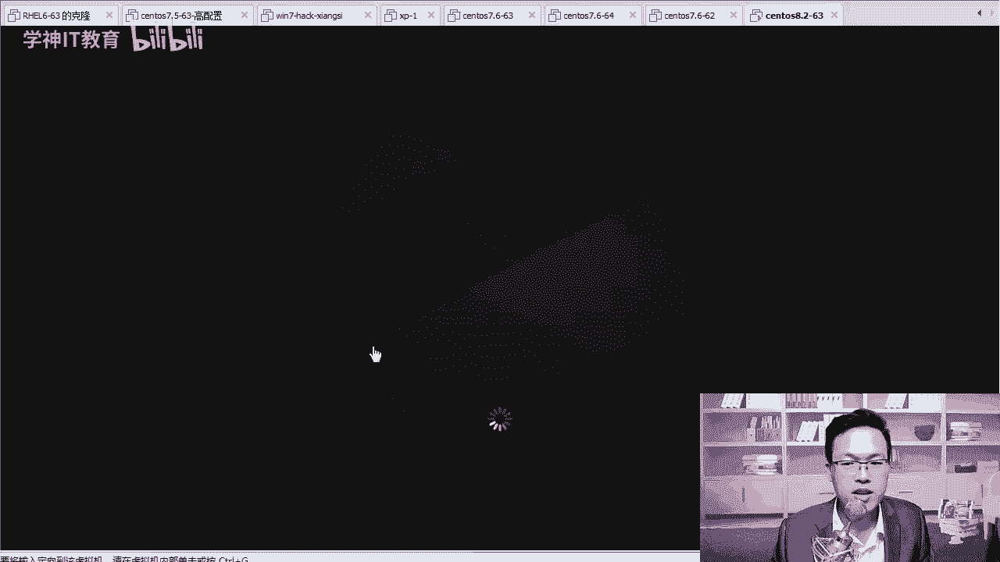

## 技巧一：调整虚拟机内存 💾

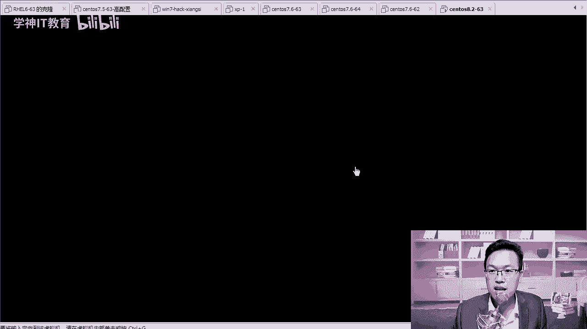

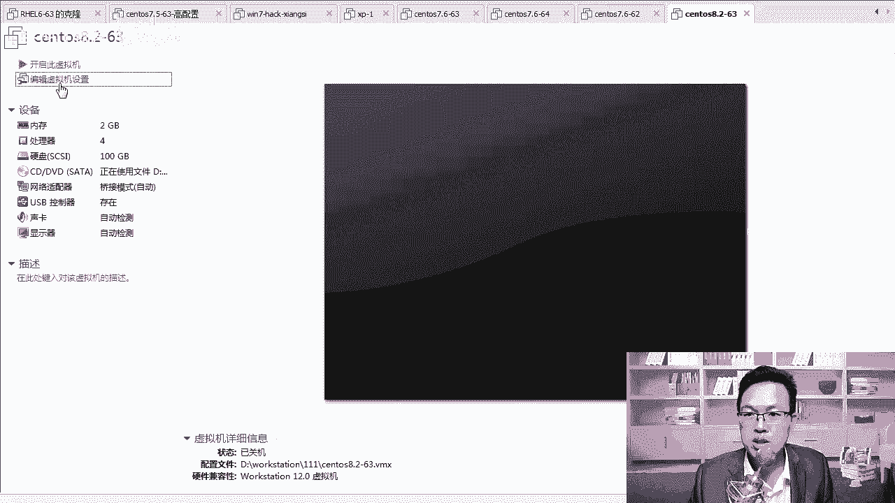

上一节我们完成了系统安装，如果暂时不使用虚拟机，可以执行 `init 0` 命令将其关机。关机后，我们就可以开始调整虚拟机配置了。

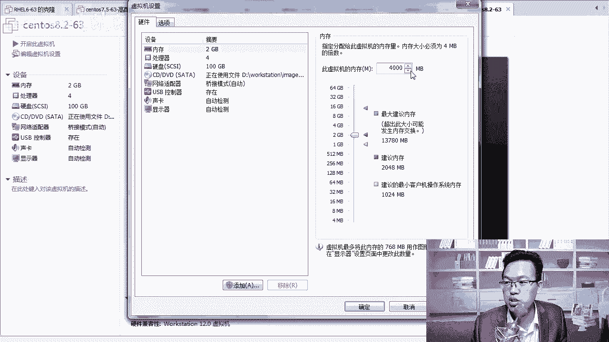

以下是调整虚拟机内存的步骤：
1.  确保虚拟机处于关机状态。
2.  点击“编辑虚拟机设置”。
3.  在“内存”选项中，输入新的内存大小（例如：4096 MB 或 4000 MB）。
4.  点击“确定”保存设置。

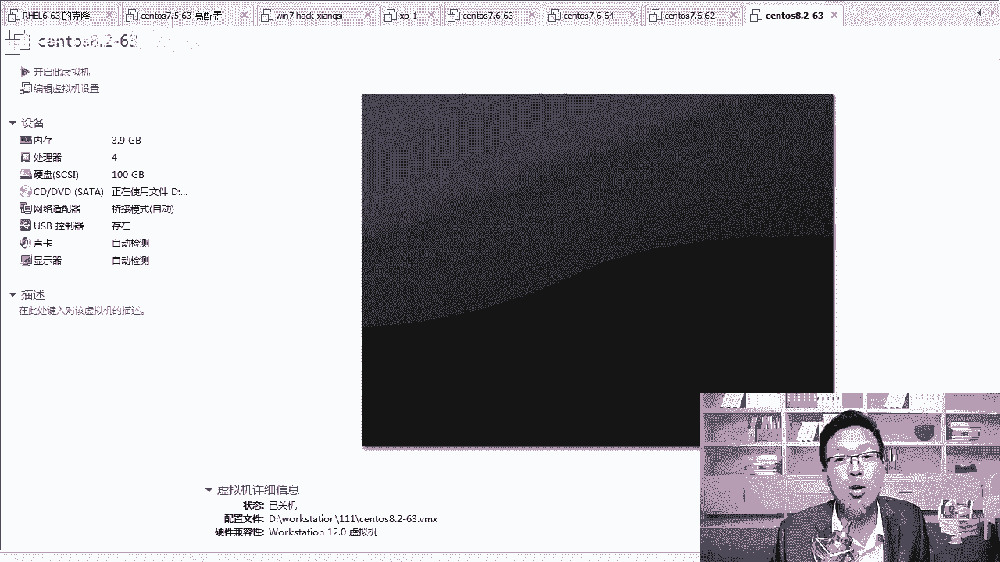

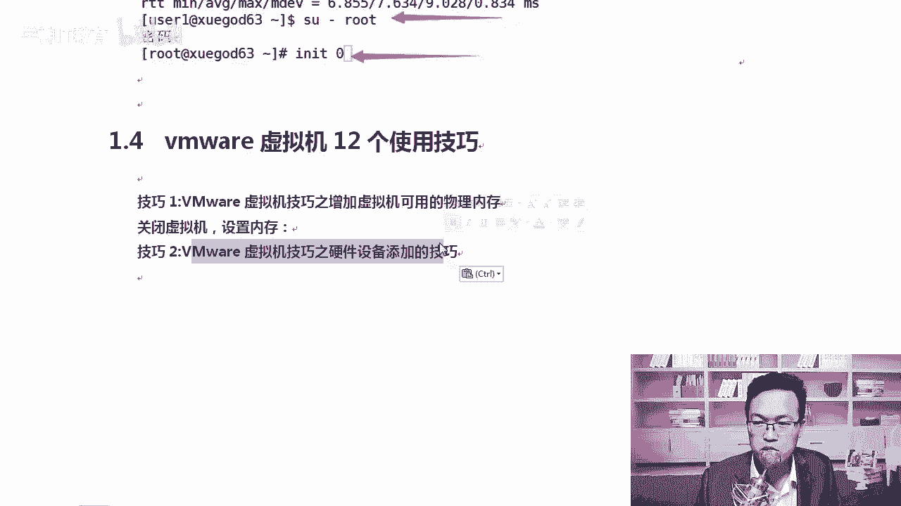

> **注意**：内存调整必须在虚拟机关机状态下进行。内存单位通常以1024为基数，因此输入4000 MB可能会显示为约3.9 GB。

## 技巧二：添加或移除硬件设备 🔧

如果我们觉得虚拟机硬盘空间不足，可以为其添加新的硬盘。

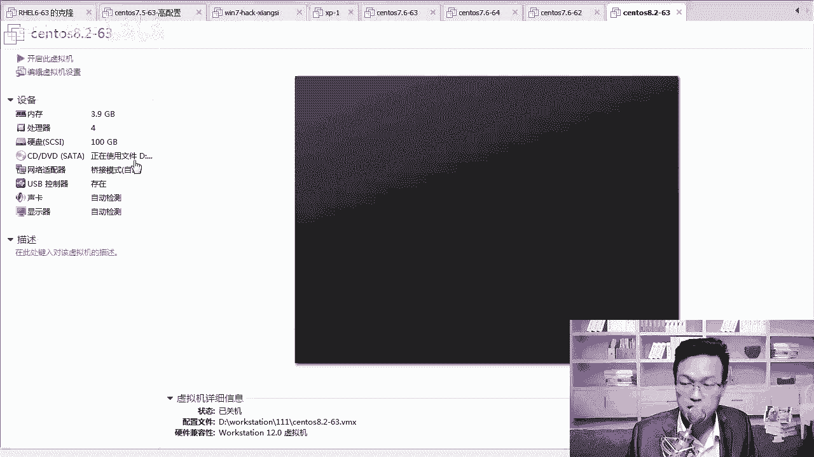

以下是添加硬盘的步骤：
1.  在虚拟机设置中，点击“添加”。
2.  选择硬件类型为“硬盘”，点击“下一步”。
3.  选择“创建新虚拟磁盘”，再次点击“下一步”。
4.  设置磁盘容量（例如：20 GB），建议选择“将虚拟磁盘拆分成多个文件”。
5.  点击“完成”并“确定”即可添加新磁盘。

若要移除已添加的磁盘，只需在设置中选中该磁盘，然后点击“移除”即可。

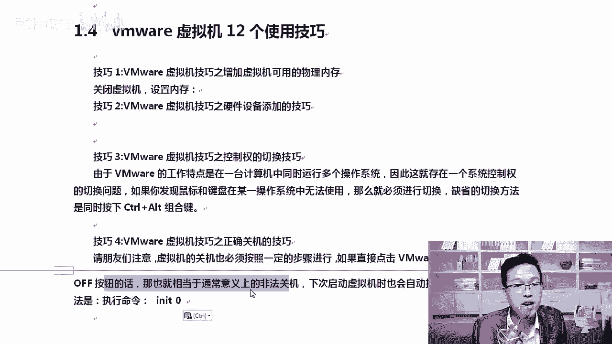

## 技巧三：控制权切换 🖱️

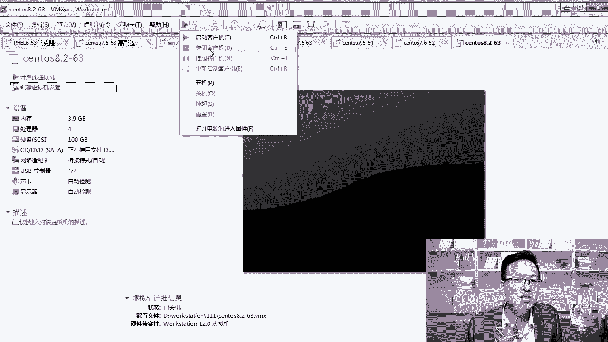

VMware允许在一台物理机上运行多个虚拟机，因此存在系统控制权切换的问题。

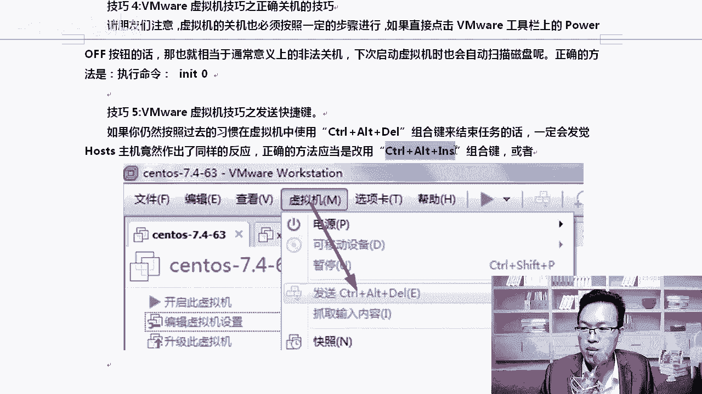

当鼠标被“捕获”在虚拟机窗口内无法移出时，按下 `Ctrl + Alt` 组合键即可将控制权释放回物理机。

## 技巧四：关机操作 ⏹️

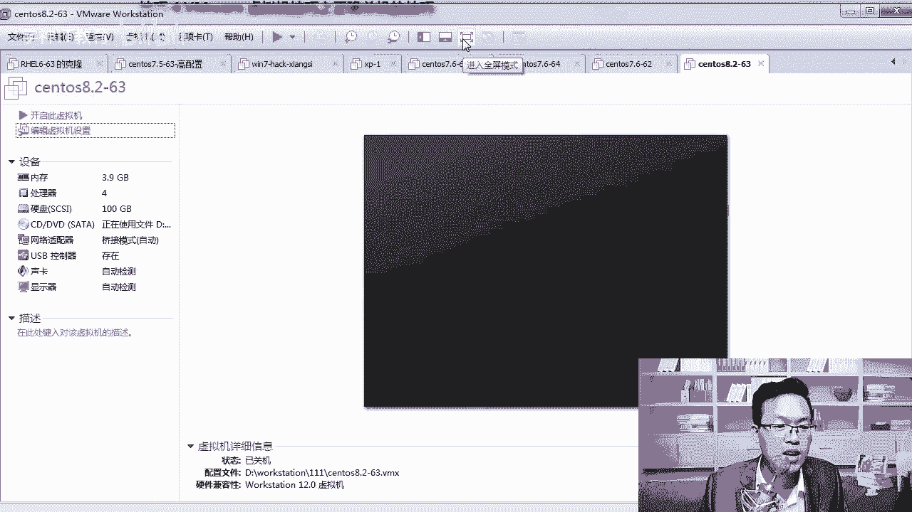

虚拟机关机有两种方式：
*   **正常关机**：在虚拟机系统内执行 `init 0` 命令。
*   **强制关机**：在VMware界面中，点击虚拟机电源按钮旁边的下拉箭头，选择“关闭客户机”。这相当于直接断电，可用于处理系统无响应的情况。

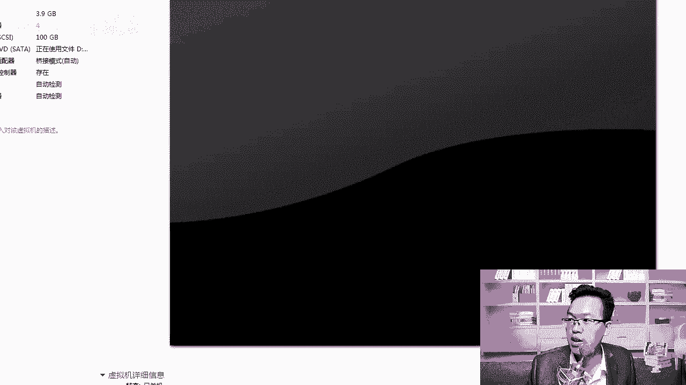

建议优先使用 `init 0` 命令正常关机。

## 技巧五：发送快捷键 ⌨️

在虚拟机内使用某些组合键（如 `Ctrl + Alt + Delete`）可能会影响物理机。

以下是解决方法：
1.  点击VMware菜单栏的“虚拟机”。
2.  选择“发送 Ctrl+Alt+Delete”。
3.  也可以直接按下 `Ctrl + Alt + Insert` 键来替代。

这样就能将快捷键发送到虚拟机，而不会触发物理机的对应操作。

## 技巧六：界面显示管理 🖼️

VMware提供了多种界面管理选项，方便管理多台虚拟机。

以下是三个常用显示控制功能：
*   **显示侧边栏**：点击工具栏上的对应图标，可以显示所有虚拟机的列表。
*   **显示底部缩略图**：点击另一个图标，可以在窗口底部显示所有运行中虚拟机的缩略图，方便快速切换。
*   **全屏显示**：点击全屏图标，虚拟机界面将占据整个屏幕。将鼠标移动到屏幕顶部会弹出控制条，点击“恢复大小”即可退出全屏。

## 技巧七：网络模式详解 🌐

VMware提供了三种主要的网络连接模式，理解它们对网络配置至关重要。

**1. 桥接模式**
*   **原理**：虚拟机的虚拟网卡通过“网桥”直接连接到物理机的物理网卡上。
*   **效果**：虚拟机就像一台真实的、与物理机并列连接到同一台交换机上的电脑。
*   **配置要求**：虚拟机的IP地址必须与物理机处于**同一网段**，网关和DNS通常与物理机一致。

**2. NAT模式**
*   **原理**：虚拟机通过物理机上的虚拟NAT设备和DHCP服务器上网，共享物理机的IP地址。
*   **效果**：虚拟机可以访问外网，外网无法直接访问虚拟机。虚拟机会从VMware的DHCP服务获取一个通常是 `172.16.x.x` 的私有IP地址。
*   **配置要求**：虚拟机内通常配置为自动获取IP地址。

**3. 仅主机模式**
*   **原理**：虚拟机与外部网络完全隔离，只与物理机及同一“仅主机”网络内的其他虚拟机通信。
*   **效果**：虚拟机无法访问互联网，但可以与物理机及其他同模式虚拟机通信。常用于构建安全的内部测试网络或集群环境。

> **学习建议**：对于初学者，建议先从**桥接模式**开始使用。技术概念的理解往往需要结合实践，先动手操作，再回头理解理论，会更容易掌握。

## 技巧八：进入BIOS设置 ⚙️

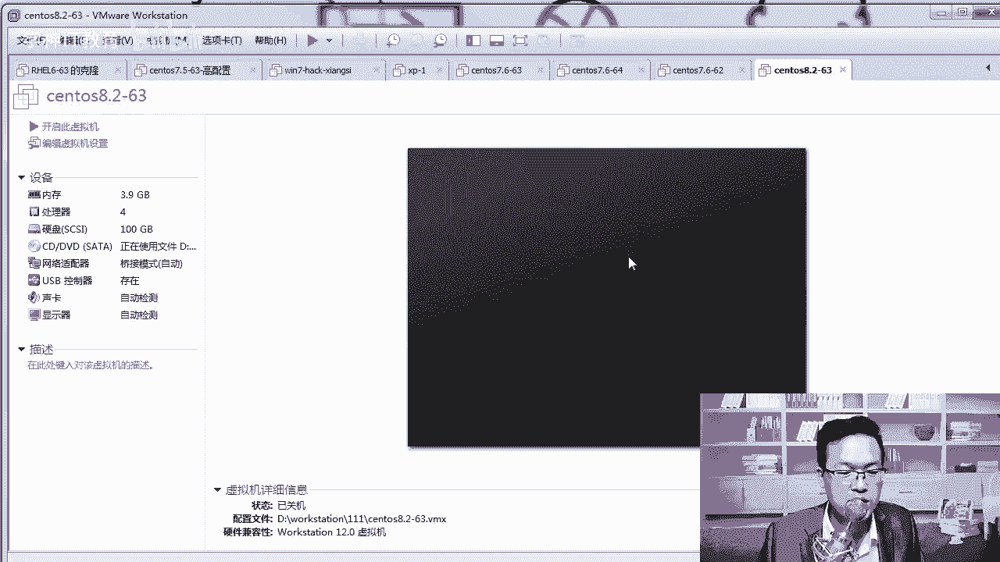

虚拟机启动时，屏幕会提示按 `F2` 进入BIOS，但时机可能难以把握。

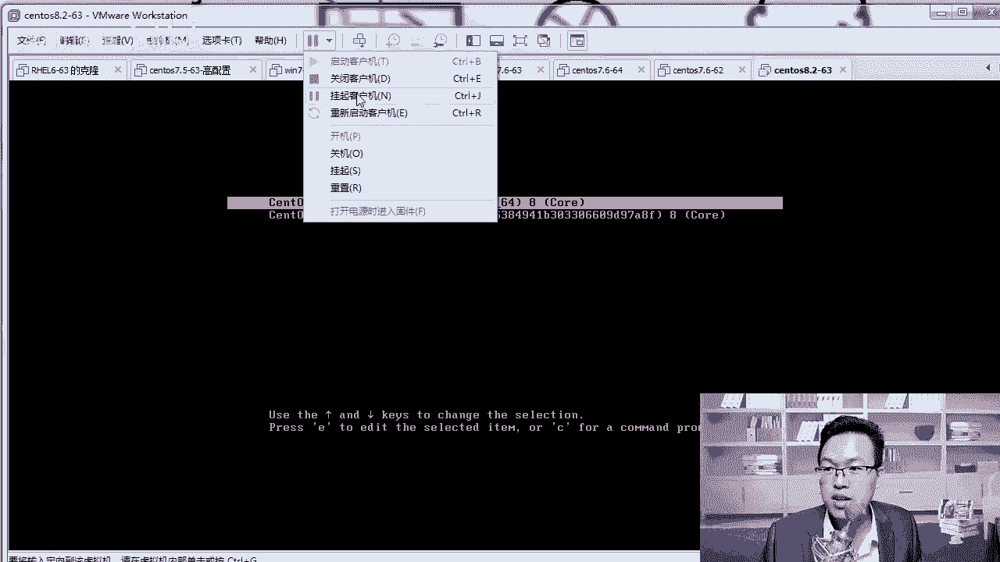

以下是更可靠的方法：
1.  在VMware中，选中目标虚拟机。
2.  点击“虚拟机” -> “电源” -> “打开电源时进入固件”。
3.  虚拟机启动后将直接进入BIOS界面。

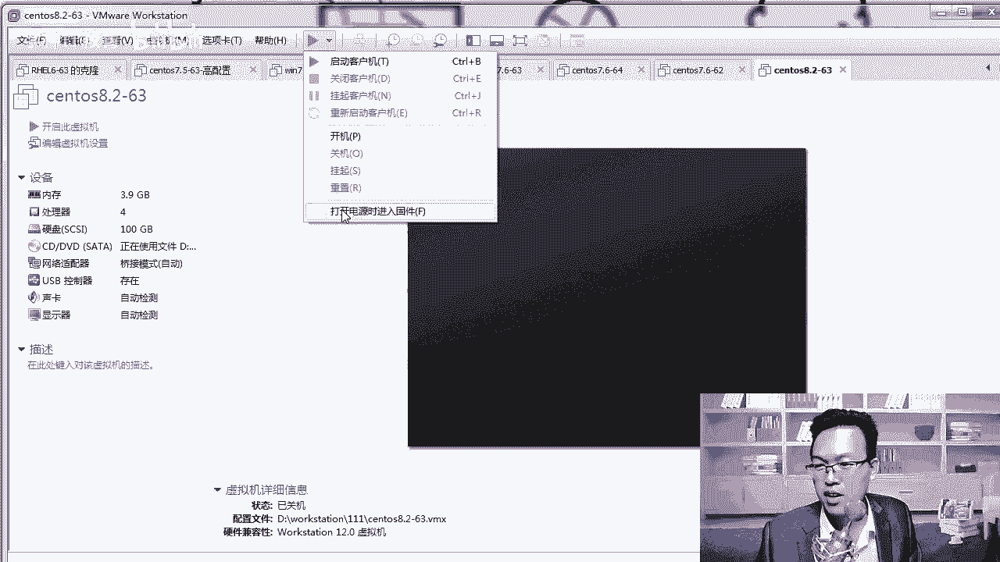

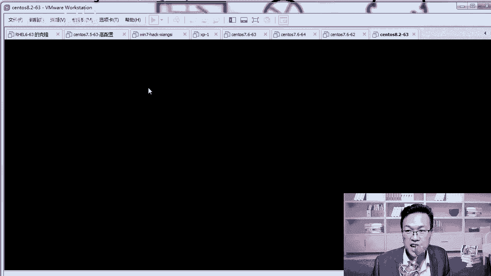

在BIOS中，可以使用方向键移动，用 `Shift + +` 调整设备启动顺序（如将CD-ROM调到硬盘之前），设置完成后按 `F10` 保存并退出。

## 技巧九：VMware Tools与显示适配 🔄

VMware Tools是一套增强工具，能改善虚拟机的性能和使用体验。从VMware 7版本开始，许多功能（如显示自适应）已集成，安装系统后通常可直接使用。

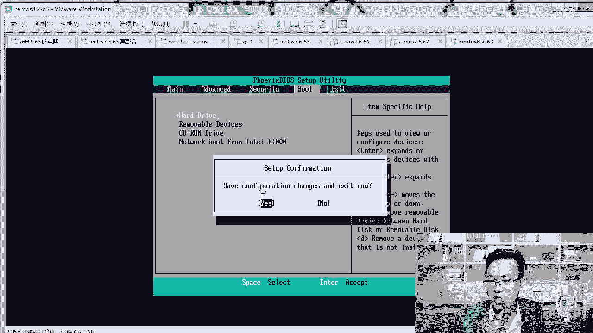

在“查看”菜单中勾选“自动适应客户机”，虚拟机的显示分辨率就会随VMware窗口大小自动调整。

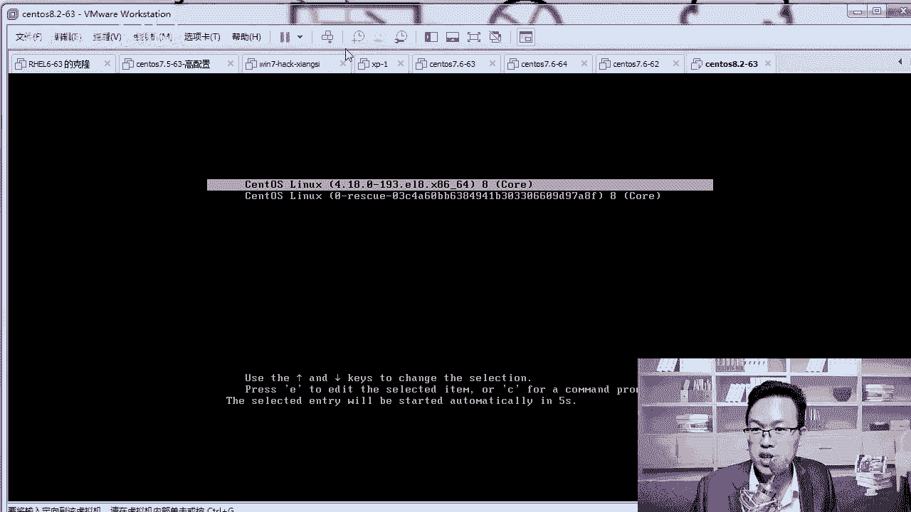

## 技巧十：连接虚拟光驱 💿

使用光盘镜像文件时，需要确保光驱已连接。

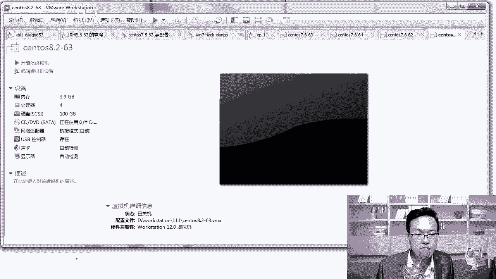

以下是连接方法：
1.  在虚拟机设置中，选择“CD/DVD”设备。
2.  勾选“启动时连接”和“已连接”。
3.  点击“确定”。

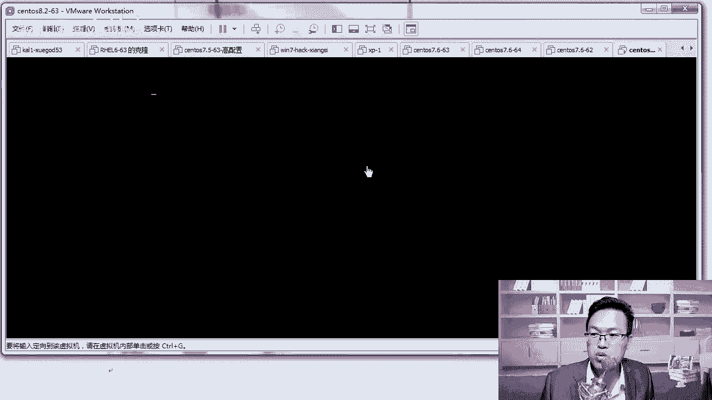

即使虚拟机已经开机，也可以随时进入设置勾选这两项来连接光驱，无需重启。

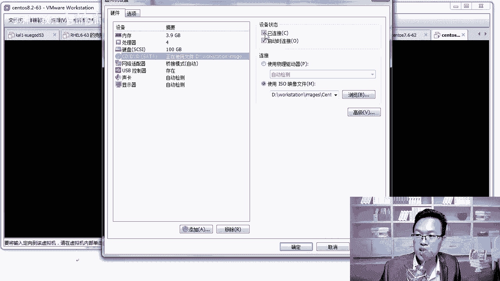

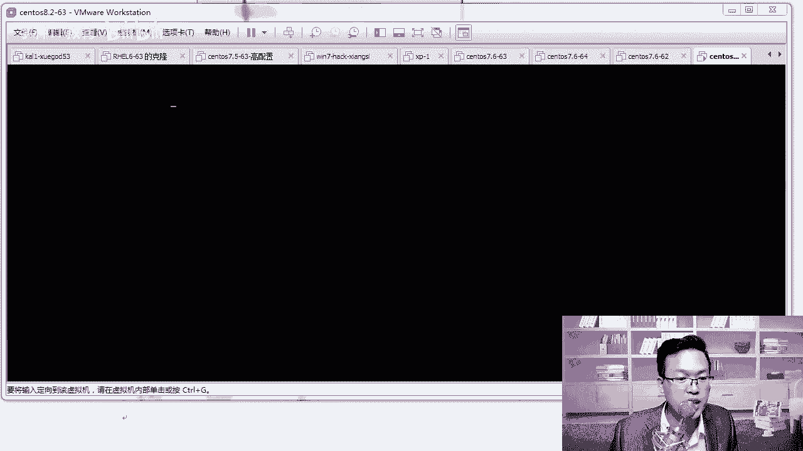

## 技巧十一：彻底删除虚拟机 🗑️

关闭虚拟机电源并不等于删除它。要彻底删除虚拟机及其文件，请按以下步骤操作：
1.  在VMware库中选中要删除的虚拟机。
2.  点击“虚拟机” -> “管理” -> “从磁盘中删除”。
3.  确认操作，这将永久移除虚拟机的所有文件。

## 技巧十二：使用快照功能 📸

快照是VMware最重要的功能之一，它可以保存虚拟机在某个时间点的完整状态。

以下是使用快照的步骤：
1.  **创建快照**：在虚拟机运行或关闭时，点击“虚拟机” -> “快照” -> “拍摄快照”。为快照起一个描述性的名称（如“安装完成可用环境”）。
2.  **恢复快照**：当系统出现问题时，点击“虚拟机” -> “快照” -> “快照管理器”，选择之前创建的可用快照，点击“转到”即可一键恢复到该状态。

> **提示**：在**关机状态**创建快照，文件较小；在**开机状态**创建快照，会保存内存数据，恢复后可直接进入工作桌面，节省启动等待时间，但快照文件会更大。

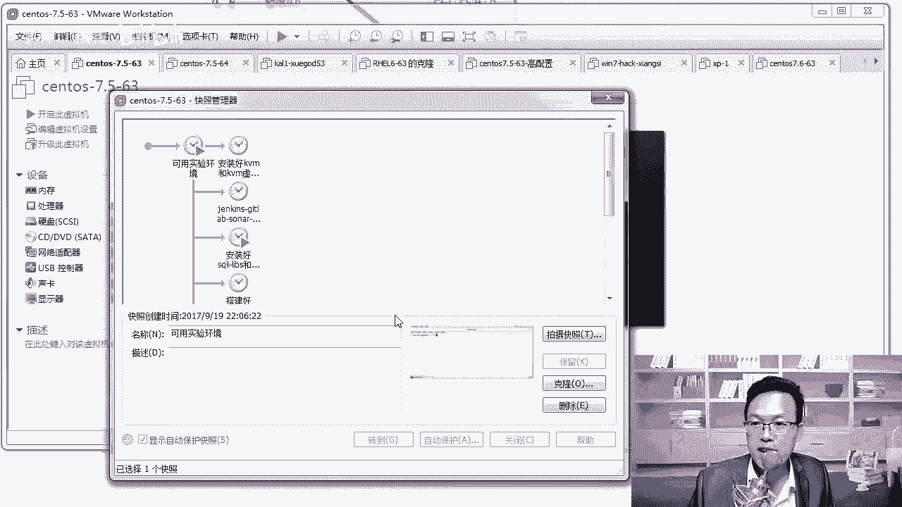

---

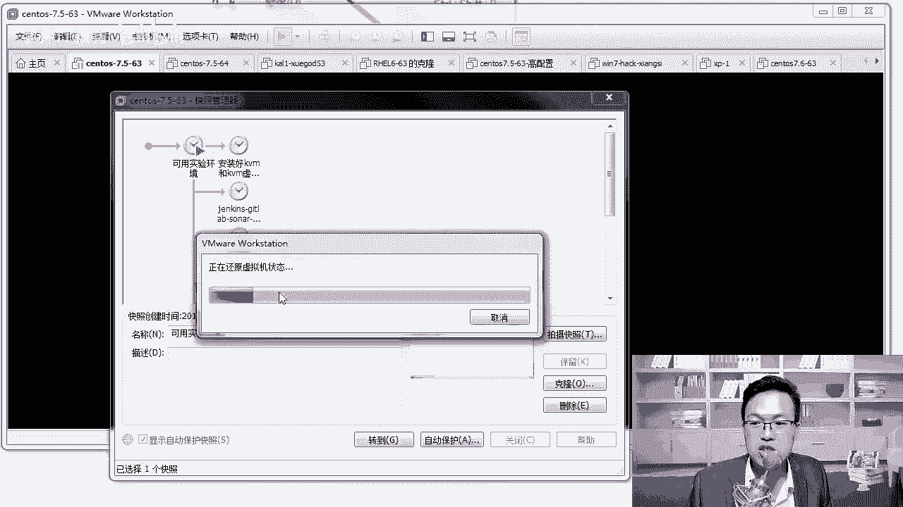

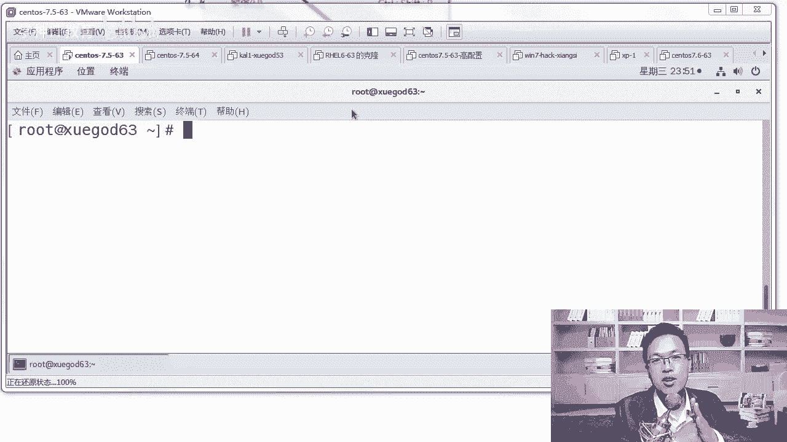

本节课中我们一起学习了VMware虚拟机的12个实用技巧，包括内存调整、硬件管理、网络模式、BIOS设置以及至关重要的快照功能。熟练掌握这些技巧，将为你后续的Linux系统学习和实验操作打下坚实的基础。下一节课我们将继续深入CentOS 8的学习。