# centos8／Linux／运维／网络运维／RHCE／红帽认证云计算／2020全新独家教程-centos8操作系统从入门到精通 - P10：4-帮助命令使用-开关机命令及7个启动级别 - 学神科技 - BV15V411z7tK

接下来我们来看一下linux加的帮助命令。当我们遇到一个命令，不知道该添加什么参数的时候，或者不理解这个参数的时候，我们可以通过慢命令去查看获得它的内容。我们来看一下第一个慢。

慢这个并不分是男人的意思啊，其实他是手册的意思。咱们举个例子。在这里我们执行慢犯的。大家可以看一下，当我们打开这个慢饭的的话，你可以看到其实你是一脸懵的。如果你对fin的这个命令不是很了解。

那你即便打开以后还是不了解，只能更不了解。其实这种。😡，么慢了或者杠杠help。这种参数更多的是留给什么？留给像我们这些老鸟来使的，就是我已经知道它是干嘛使的。但是我突然忘了，比如说MK我记得是吧。

查询的时候可以按size按大小来查询。但是突然间我忘了size后面加的这些，比如说单位KMG啊，该怎么写了，那我可以怎么样查一下，大家知道吧？所以对于大家初学者来说，你还是妥妥的跟着我。😊。

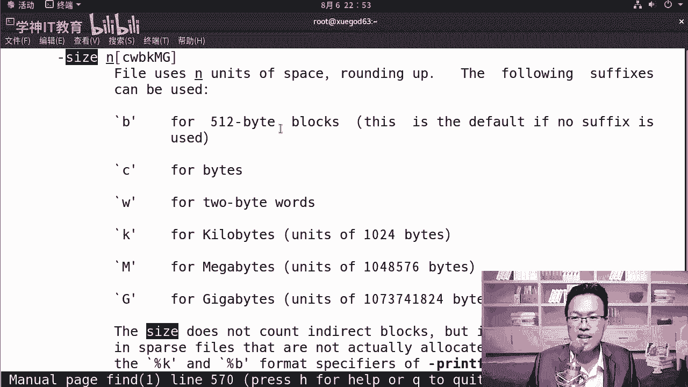

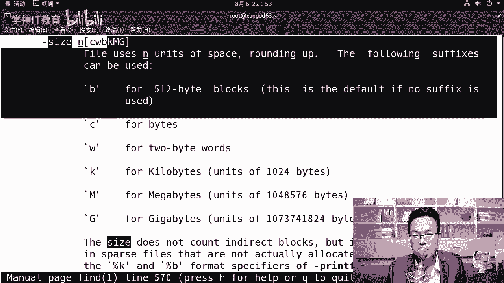

从头到尾去学，这样效率是最高的。我们来写到这里啊。慢慢是范的呃慢范的，它可以支持上下去翻，你也可以加斜杠去直接搜索。就像我刚才在呃查找的时候写了一个斜杠size，那它能快速定位一下。OK退出的时候。

摁下Q就可以直接退出了。😊，啊，另外我跟大家说一下啊，这个慢他不是男人的意思啊，再次强调一下，因为很多老师都把它讲成说这是个男人。😊，啊，我们不懂的时候，应该找男人问一问，不是这个意思啊。

他并不代表什么性别歧视，反而你是一个女同学，你学一学linux运维也是非常的棒的啊。因为公司更希望能找一个文静一些的是吧？女同学坐到那安安静静的是吧，去做运维。😊，所以这就告诉大家啊。

你去面试运维相关的工作一定要稳重一些，你别坐那一会儿身上抖一抖。😡，你想想公司把核心的数据都交给你了，你要不稳定，公司绝对不敢用你啊，面试的时候一定要沉着冷静啊。再一个就是杠HE，还有杠杠help。

那我们来看一下。f的杠H哎，怎么不行呢？对，有些命令是杠H是可以搞定的，有些是不行的。我试一下这个啊，你看set命令就可以s命令杠H就OK。所以当杠H不行的时候，你可以尝试一下杠杠help，那就OK了。

那现在你看到这里面还有很多都是中文的一些注释。😊，这说明中国的这个地位又提升了啊。这是关于man或者杠H杠杠help，这是我们获取帮助的三种方式。了解一下。接下来我们来看一下开关机命令以及7个。

启动级别常见的开关机的命令其实有很多种啊，linowux呀，比如说杀档，它是关机，itit也能实现关机，reboot也能实现p off还能实现关机。reboot当然是重启啊，它无法实现关机。另是项。

实现一一件事情，你可以有很多种方法。所以怎么办呢？我跟大家讲一个窍门，你记其中的一个方法，记哪个方法，就是你记住以后永远忘不了的。你比如说我们MK我关机。

我就最喜欢使用的是init0这个东西我一辈子都忘不了。反正有时候上档后面可能加了好多参数，我就忘了。😡，因为我不常用它。啊，但是大家还是要了解一下，我们来看一下沙档常见的一些参数啊。呃。

刹二档刹二档后面，比如说杠H杠H，我们加多少呢？加10。它代表我10分钟以后关机。那再比如说你也后面可以直接加个时间，我改到11点，那代表11点关机，或者我加杠2杠2就是重启。那么比如说我希望。嗯。

23点吧，23点半的时候重启或者20的时候重启一样是可以的那我还是希望能够立马关机杀 down杠Hno这就立样关机了。摁ctrl C结束不要立马关机啊，我们还要演示呢。

当然你可以杀 down杠C将刚才那些。取消掉啊。这是关于上当这几个命令。总结一下。看一下。最常用的其实就是定时关机，刹档杠H定时关机。关完机以后，我们还有还有就是linux下的7个启动级别。

那切换启动级别的话，你可以init后面跟零跟6跟其他的都可以。我们来聊一下7个级别，从0到60的话代表的是关机，好吧，默认运行级别不能是0默认运行级别一般是3或者是5，然后呢，一的话代表的是单用户模式。

拥有root这种模式下是拥有root权限，直接就是rootroot不用输密码就可以进，一般用于维护密系统。比如说我root账号忘了，那我可以进入单用户模式，直接改一下root的密码。😊。

二的话是多用户模式，没有NFS和网络的支持，没有网络支持不起作用。3、完整的多用户文本模式，有网络有NFS登录后，就是进入控控制台命令的方式去登录。三级别是我们最常用的。啊。

默认情况下都是在三级别下跑的。四的话是没有使用保留。啊，保留就可以了。图五的话是代表图形界面啊，像我现在这种就是五级别的，带有图形界面的啊，六的话就是重启，所以init零是关机，init6是重启。

我一般都用这两种方式。我们在这里可以演示一下。当然第一个init0我们已经演示过了，我们开以切好吧，init3回车，这样的话就可以从图形界面切到这种字符界面。接完以后呢，root登上去123456。

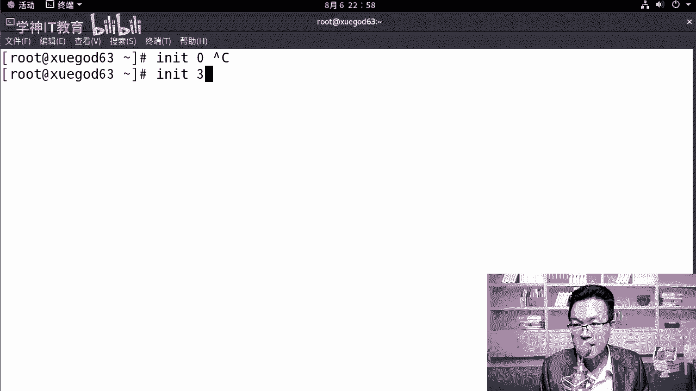

输入密码记住啊，默认输这个地方输入密码的时候是没有什么，没有大家心里想的星星新星星，它不会给你弹6个星号的啊。😡，李六是是不谈的，他。这样安全性会高一些。就别人如果看你输了几个星。

他就能猜出来你的密码是多少位数，那爆不破起来就方便很多了。init5回车。😡，那你可以看到从三级别又启动到了五级别下。好，这边让他慢慢起的。

我们来聊聊。其实这种写法是吧？是s透 S5和s透S6下的写法。那么到stoS7和stoS8的话又变了，怎么变了呢？从stoS8开始，我们不再使用init table这种方式了。

那使用的是targe这种模式。你比如说你想运行三级别，那就不应该写数字三了，你应该写martyustet。你要5的话就是graphal图形界面tet。

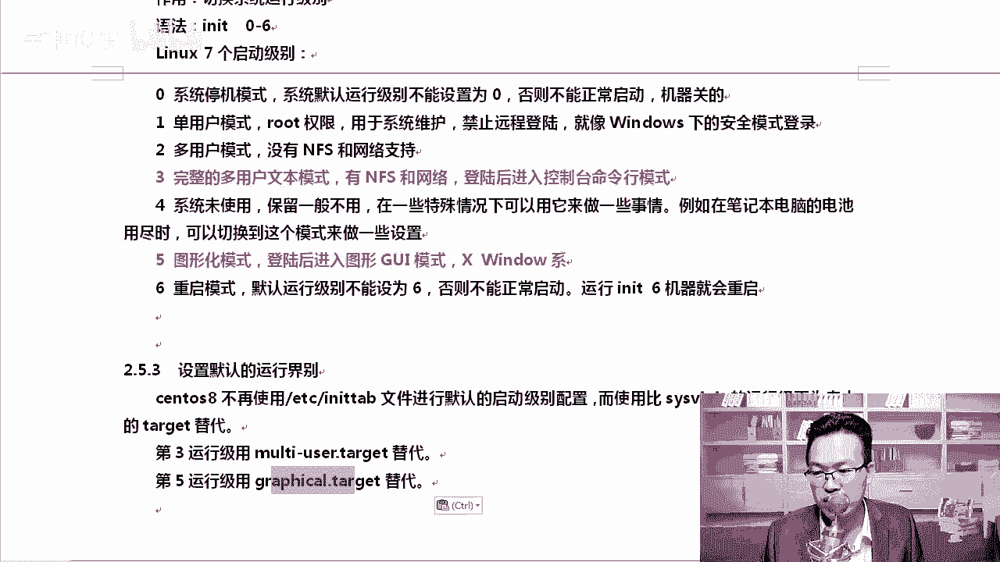

来，我们来试一下啊。微列出。输入用户名，如ot密码是123456。登去。快速登上去啊。挺难记的啊。

你看一下。在这里st team这个是设置什么？查看我们当前默认的状态。好，就是我想看当前起的是什么样的状态。你执行的命令是st team get default。然后呢，你想切换为字符界面。

你得这样写sixt team cTL什么is这一个isate就把大家很多人搞懵逼了。😡，你不知道这个单词怎么读是吧？

isate啊就是隔离的意思s team isolate multi user target，这样的话就可以切换到什么字符界面啊。好，我们来试一下。😊。

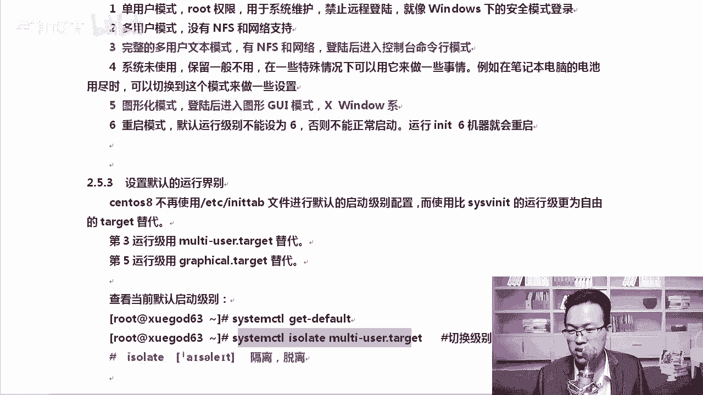

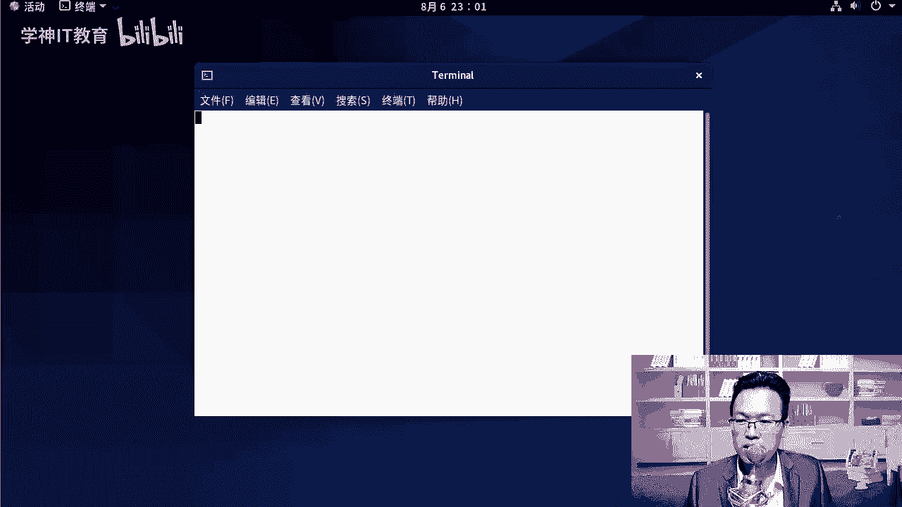

不过还好，有一点比较好，就是它可以N table补齐s team。CTL。然后呢，get下划线default这是查看默认是graphphic图形界面，那你可以s。team CTL。

我可以设置一下set下划线。default en table武器，你敲到这里就可以N table武器了啊。😡，然后呢，marty N table57。这样的话我就切到了图形界面下。啊。

这是默认设置为图三级别啊。如果我们想设置默认为五级别的话，那，就是graphic。OK那我想切呢切的话用的是slate啊。好，icelet切换到marty user。

你就记住marty这个单词的前三个字母MUL n table补7就行。这样的话进入到这里面了。root123456切的时候怎么切呢？可以通过这个s team CTL好吧，set。

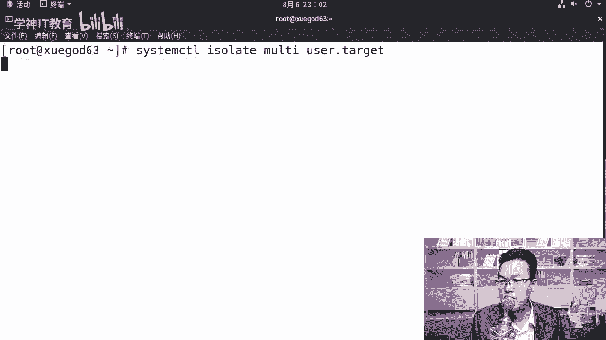

可以s特一下啊。啊，可以s切切到graphic，你可以这样的回车就切换到5级别了，还可以怎么样呢？😊，Start X。这样的话，我还是在三级别下，只是我执行s X。开了一个图形界面。

当然这个所有的这些操作，你必须要在如的账号下去操作才行啊。如果你是个普通用户，权限是不够的。😊，啊，s塔X是开启一个图形界面啊。运行一下这个。图形界面。

我把这个参数给大家整理一下。查看级别切换级别，设置默认到三级别，这个命令是必须要记住的啊。这个必须得记住啊，因为很多情况下我们都是在三级别线的，然后设置为五级别切换为图形界面。

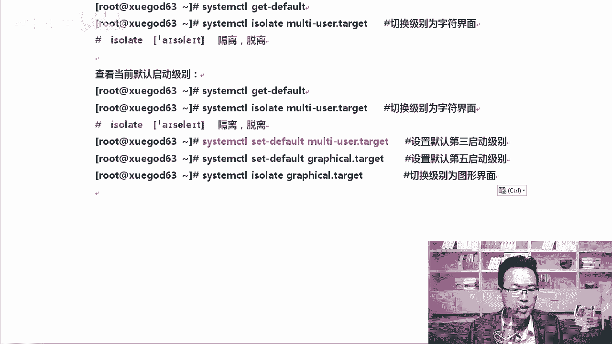

好，除此以外呢，我们还可以run label去查看查看。你看这个地方。如果我们直接直行star X，它会弹出一个这样的窗口，要不要更新一下这个名字。当前那个名字叫桌面是吧？

新的名字可能叫root什么d pop，我们就保持老的名字就行，不做更新。

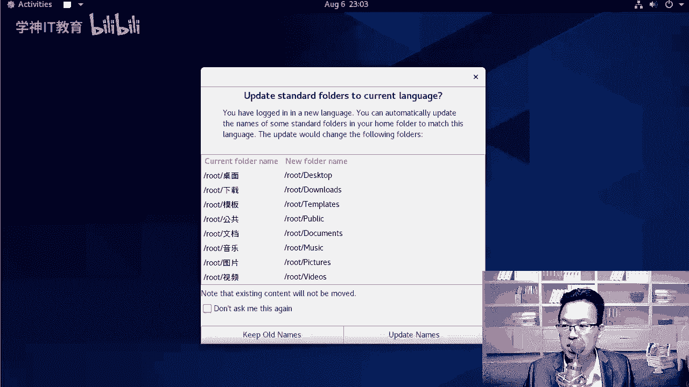

Right。你有发现从三级别的切到5和三级别下直接执行这个startX的区别了吗？三级别下，如果直接执行这个。

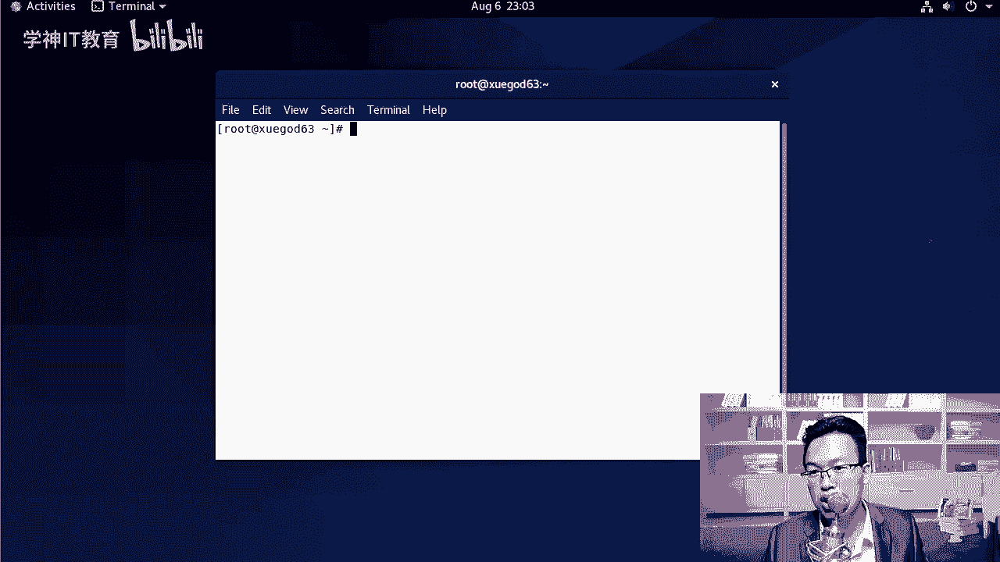

start X你是不用再输入登录的那个账号和密码的。好，我当前这个切换的级别是怎么切的，你可以run来一会看一下，我是从5到3还是从三切换到5的这都可以啊。😊，好不好？我3到5，你要想从3到5。

那你现在不是我当前的级别是三级别啊，那你可以在init5或者说切一下就行。好，这是关于运行级别啊，运行级别其实我更喜欢用用老的这种方式啊，init3it6，因为我总结那个切起，但是这个命令你必须得接啊。

因为原来六的时候，我们。我们直接修改ETCit table下的一个配置文件，直接从这里面改，将数字五改成三或者改成5就可以改它的默认启动级别。但是到八下，你必须要从这个命令啊，配置文件修改起来太难了。

好，这是关于运行级别的内容。

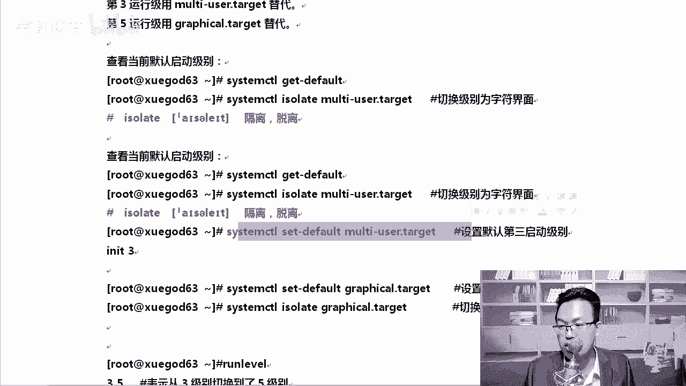