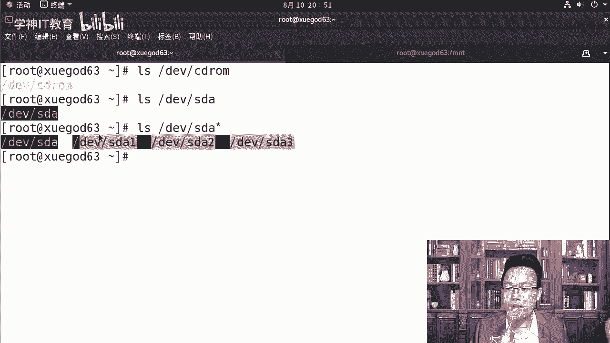

# centos8／Linux／运维／网络运维／RHCE／红帽认证云计算／2020全新独家教程-centos8操作系统从入门到精通 - P12：1-Linux系统目录结构和相对路径与绝对路径 - 学神科技 - BV15V411z7tK

大家好，我是讲师MK，欢迎大家来听MK老师的课程。今天MK老师要跟大家分享的是关于文件的基本管理和叉MS的备份与恢复。那么首先我们介绍一下文件系统的目录。😊，linux下的目录结构和相对路径与绝对路径。

这是最基本的一个内容。首先看目录结构的时候，我们先了解一下windows下。那windows下常见的大家比如说有C盘，有D盘，有E盘。😊，对吧一般情况下D盘是呃光驱啊，光驱那个盘符叫D盘。

当然有的同学啊可能电脑上D盘不叫光呃不叫光驱那个盘符啊。其压盘符也可以这样。比如说MK我这个就不是啊，我是把光驱给拔掉了，拔掉了以后插了一个呃硬盘的壳，硬盘壳里面可以怎么样再加一个硬盘啊。

笔记本电脑里经常会这样去操作啊。假如说你的电脑空间不够了，那你把你笔记本上的光驱给它拔下来。😊，怎么把呢？😡，呃，在笔记本的后面。中间有一颗小螺丝，你把那个中间那个小螺丝给它拧下来，拧下来。

把光驱从那儿一拽就可以拽下来了。转完以后，你重新买个大概10块钱或者20块钱买一个硬盘盒，然后买一个普通的硬盘。😊，放进去就行。当然是3。5英寸的那种硬盘，这样就可以扩展一下你的笔记本的空间啊。

因为通常情况下，笔记本自带的空间根本就不够用。而光驱这个东西对现在的这社会来说已经没什么用了。😊，lininux下呢只有一个跟windows下是有C盘D盘E盘。

那我们可以使用train命令去看一下这个目录结构啊。

来，我们先执行一下，那么执行的时候，当然你可以通过y样instore tree，这样是可以安装成功的。我们稍微等它一下啊。那如果你觉得等的时间有点长的话，因为它要走外网的源嘛。

那你可以从本地的方式去挂载一下，怎么挂载呢？contrl shift T大家可以看一下啊，linux下所有东西你都得挂一下，那谁是光驱呢？

SR0或者是mart DV下的CD room这个设备文件就是光驱。😊，lindux下一切接什么接文件，包括你是一个设备。比如说我是个光驱，你可以看一下CD room。😊，我们LL去查看的时候。

你可以看到CD room实际上是DV下的S20的1个。软链接，所以呢我们可以这样。你挂哪个都可以MOU。mountt mount是挂在所有的。磁盘和光驱我们都需要挂一下才能使用啊。

你不能直接用啊CD room通常情况下我们会挂到MNT下啊，我看一下我这挂了没有，应该没有挂啊，DV下的CD room。😊，好，这样的话就挂成功了。有就说挂成功，怎么还来一个warning呢？😡。

你看他说什么呢？挂载的是主只读文件啊，我记得很多同学都是说老师我们CD到挂完以后，CD到M。😊，啊，CD到MNT下，然后我们。比如说我们touch创建一个普通文件，A点TNT它是能创建成功吗？

你是创建不了的，他告诉你这个东西是只读的文件系统，我们的光驱确实是只读的文件系统，你不能在光驱上像磁盘那样去操作。好吧，这个大家知道一下，总有一天你突然间进到MNT下，你会遇到这个坑。

所以我提前先告诉你啊，那拿到这儿以后呢，你可以这样RPM是IVH先让大家初始一下我们的linux相关的东西。比如说我们挂到MNT加MNT下，比如说有很多的东西。那在我们森特S8上来说的话。

对于我们森特S8这块来说，我们应该写什么？对你可以写base basease OS baseOS这里跟的是什么呢？跟的是这个package。😊，啊，也就是说在这里面package下有很多很多的软件包。

你可以摁两项table，摁两项table他告诉你我要看所有的吗？一共1000多个。是的，你输入个yes。😊，这就是我们光驱里面是吧，或者说系统镜像里面的这些包。那这些包里面，比如说我想安装谁呢？

安装te，那你可以这样去。那有同学老师，我是不是要把那个照的都敲一遍，后面的版本号你其实是不用敲的啊。它是可以按table补齐的这是大家应该接触第一次RRPM包安装，你敲到tra点，以它为一。

它就直接可以补齐了。好，安装完了以后，除以TMP你可以先看一下或者。我们可以看一下一些目录结构，比如说TMP以下的目录结构有哪些？看到了吧？TMP下有南康的是吧？

然后DBbus啊Dbus日志等等这些东西。好，知道了这些以后呢，我们来重点看一下谁呢？L跟跟下其实有很多的目录，我们先认识认识跟下的这些东西。😊，好不好？OK先认识一下，跟下这些东西。

当然你也可以yintstore这样去安装一下这个吹命令也是可以的啊。😊，只要你能上网，sS默认已经把。样么源给你配置好了。当然在我们这里面其实叫DNF啊，你也可以DNFintstore tree。

因为8里面用的是DNF会多一些。好，我们稍微等等它啊。实际上巴里里面的样目也变了，大家知道什么意思吗？你看啊LL。😊，我们先带大家看一下啊，which样，那么是which是查看一个命令，它是在哪里。

那我们通过这里去看一下这个ym。大家看到了什么？对。😊，样命令已经在s特S8下指向的是DNF杠3这个命令了，看出来了吧？他已经变了啊，各位同学。啊，理解了，它已经变了啊。😊，所以你相当于其实在8里面。

我们更常用的应该是什么DNF但一般同学习惯于用什么，习惯于用这个tree，那我们就直接yinst tree，把这个tre命令安装一下。

那么吹的时候，TMP你可以看到TMP下的东西，你想看根下有什么，你可以LS看，当然你也可以直接吹，从根从根开始全都是吧吹一遍，这样有利于你去看这个整体的目录结构。

好，ctrl C啊。那根下有这么多东西，你总得认识是其他的目录下，有同学老师这么多东西我能记得住吗？你记不住很正常，我也记不住。就像现在一样，windows用了这么多年，C盘下每一个文件。

每一个目录是干嘛使的，你也不知道我们也不需要全都知道啊，那我们来演示一下，我们看看。😡。

里边最主要的这些目录是干嘛使的？请大家看好，我们来看一下。这个目录稍微有一点长啊。我给大家特意准备了一张表，大家认真的看一下啊。

它的内容稍微有点多，这个内容呢大家长期的看，慢慢就记住了。

而通常情况下，它也比较好记。比如说跟这个目录，跟这个目录的主要作用就是什么呢？在linux系统好吧，竖形结构最顶端，那么并并是什么？病是banary的缩写，它是通常的一些二进制文件。

通常二进制文件是在这里面，那我们来看一下啊。

which样那么大家可以看一下USR。要么我们说样么这个命令实际上是。是DNF是吗？对DNF杠下划线3是这个文件的。是这个文件的一个软链接啊，也叫你可以理解成是快计方式。VI打开我们打开这个文件。

再让大家看一下。绿色。好不好？打开一下。大然看到了什么？告诉我DNF这个地方是什么？😡，拍损啊。其实我们的样命令也是拿python写的，就很多情况下，有同学说老师我们这种绿色的全部都是二进制文件。

其实说的不对啊。如果你是在什么？你是在stoS7下，你去VM打开样目，你会发现其实样不是个二进制文件，它是拿python写的一个脚本。😊，啊，包括我们这个地方也是一样。

大家明显能看到pathon相关的字样吗？如果你是二进制文件是打不开的啊，DNF相关的。你看theDNF执行的一个脚本。😊，所以大家可以看到，后期有机会的话，你们应该把python也学一学啊。

当然一步步来啊放掉。USR并下的泛展。那它就是一个彻彻底底底的二进制文件，你看不懂的二进制文件一般VMVM打开的时候有ELF这个开头啊。当然我们也可以真正的你想。

因为我们这里面没有什么没有扩展名这一说啊，如果你想看一些文件的类型的话，你可以通过fiilfill能真正的去看这个文件的类型。那它可以告诉你它是1个ELF64位的1个二进制。呃，文件好吧。

你一看到ELF这个标识，就是它就是代表它是可执行的一个二进制文件啊。好，同样我们。我们知道了这些东西以后呢，再看通常病下面都是这些。二进制。好，大家可以看到都是一些什么绿色。

啊，绿色。文件那就是二进制，还有一个就是boot boot是存放系统启动相关的一些文件。比如说 kernelnel，这个要记住啊。

Lboot大家可以看到boot相关的这些东西了吗？😊，对，这里面什么EFI啦，grab two了，loader了，包括我们的内核，大家可以看到这个VM怎么样，VMlinux4。18。

我们当前的版本号是U name怎么样杠2，那唉啊少写个。😊，稍等啊。un name杠2我们能看到我们的内核版本号，我们是4。18这个版本号。那。就是并非我把所有的命令都给大家整理到笔记上了。

所以你应该找一个本，找一个笔，把这个命令什么，时刻的记下来，行不行？😡。

啊，要随手我跟大家教给你的一些快递方式，一些小的命令，随手找个本记下来啊。😊，这样你才能成为高手，而且快速的成为高手。dde这个包或者说DV这个包DV哈DV是device啊，device这个设备的缩写。

那它里边主要是一些设备文件。

如果以前你没有接触过lininux的话，你很难理解是吗？😡，啥叫设备文件？我们的什么？就我跟大家说，我们的CD room光驱就是一个设备文件。你想在linux下访问光驱，你就怎么样。

你就访问这个文件就行了。😡，有多少windows不是这样子做的windows我们是双击打开那个光盘的对，那是windows啊，在linux下是吧，一切接什么接文件这样用起来其实时间长了。

反而会更加的方便一些。windows给你封装的太厉害，让你看不到更多更底层的一些东西啊，我们作为专业人士，如果你只是玩一玩撸啊撸，那你就用windows就O啊。我们作为专业人士。

后期linux运维是要给你带来收益的，它可以让你一个月挣1万，挣1500，挣2万。所以你一时刻要注意一下，就是我要专业啊，你要让自己专业钱啊。😊。

那么一切设备在linux下有一个常识，就是一切设备都被看成文件。我们的终端磁盘都可以。比如说SDA就是我们的一个。

设备。DV下的SDA，这就是我们的磁盘。这就是我们的磁盘啊，那它里面会有很多的分区，我们可以加一个星号。那大家可以看到它代表以它开头的啊所有文件。😊，DV123分别代表的分区123。

那常见的设备文件我也给大家写了一下。那么再就是ETCETC的话是常见的一些二进制安装包的一些配置文件。或者服务器启动的一些东西。比如说ETC password给大家都列得很清楚。

shadowgroup FS table挂载的hot设置对应对应关系的这些配置文件通常都是在ETC下home的话就是普通用户的加目录。一旦我们创建了什么用户。

那么在home下都会默认创建对应用户的加目录，除非你指定了对方的加目录啊，为其他地方。还有一个是lab。😊。

库文件。lab大家能理解什么叫做库吗？😡，L labb大家看一下啊，lab这个地方什么叫做酷酷的话就可以理解成一个专门的一个功能。😊，理解了吧，它就是一个专门的功能。

比如说lab下GCC这是关于C语源编译器相关的一些库。那这些库的话通常结尾是点O或者点SO啊，或者是点A结尾。😊。

这种文件成为库文件，包含了一个具体的作用啊。MNT和media这两个这两MNT和media一般都是用来挂载什么存储设备的。我们希望有一些东西，比如说光盘可以开机自动挂载。

或者某个目录可以自动挂载到这下面都可以指定。😊。

呃，在八里面是吧，有一个比较特殊的地方。you might卸载一下啊，DV下的media。啊，第一我们优默的卸载一下MNT啊，我们卸载一下MNT。那么MT大家在卸载的时候，他告诉你target目标忙。

为什么呢？因为我们当前有一个目录，你看这里还在这，你要退出一下。😊，啊，退出以后才能youant低V下啊。MNT这样我才能把它给卸载。卸载完了以后，我们看一下，在linux下有一个。HGF。啊。

以前老版本上是没有的，到八版本上会有多一个这样的文件。这个是干嘛使的，其实大家也用不到。

我们来跟大家说一下啊。😊，mont下的HGFS了解一下就可以。它是安装VM tos。你使用什么使用共享文件夹，可以怎么样共享虚拟机和真机的目录，实现文件之间的相互废置啊，复制。一般情况下。

它是没有什么用的。因为我们通过叉cel就能直接搞定它。

所以它是没有什么用的。OPT的话标示可选项这些软件有一些软件包会安装到这里。其实OPT通常情况下也是空着的啊。😊。

他也没有什么用。O但是有时候比如说我们后期教大家管理管理开源代呃管理代码的get labb这样的一个软件管理服务器，它相关的一些东西就安装到OPT下了。再就是PROCPROC是操作系统运行的时候。

一些进程信息都都会放到这里。😊，当然它不是一个真正的文件系统，系统挂了是吧，或者系统关了以后是没有这个数据的。

你看着PROC里面是吧，是很多的内容啊。POC。看到了吧？这些都是什么？这些都是进程的ID号。😊，理解了吧？都是进程的一些ID号。我们有时候要从这里面去看一些东西。当然还有一些呃。

你比如说net网络相关的一些内容，还有我们CPU相关的。😊，也也可以看啊POC我们最常见的，比如说我们看一下CPU in four。查看CPU的型号。你你要用cat啊。

那大家可以看到我们ca去查看的时候，我有几个CPU。有同学你怎么这么多重复了？😡，没重复啊。您请看好。这里。啊，这里是proprocesor0，相当于CPU的ID是0。那弹到最下边的时候，大家可以看到。

😊，pros是3。看到了吧？对，当然我的CPU的话是I72670QM很早的一很早的1个I7系统啊啊I7的CPU。😊，那这里面有什么呢？这是flag标识位。

后期我们比如说后期我们能不能安装linux下的KVM循化，就要看看你。啊，看看这里面的标志位，关于虚拟化那个模块有没有打开。所以后期我们查看一些系统，查看一些进程信息的时候，会在这里面用。

那具体用到的时候，我们具体去了解好不好？还有s目录同样也是存放硬件信息相关的一些目录。这些目录通常是我们操作系统运行的时候是吧，需要用到的，我们一般很少去操作它啊，只是顶多看一眼上去。

包括我们的run目录，比如说运行呃运行目录是存放的是系统运行的数据，比如说进程的一些文件。😊。

好乱。也是一些文件，比如说日志的关于锁的等等等这些东西好，firewall防火墙的一些内容mount的一些数据。当然这些数据啊。😊，一般情况下不需要大家去看啊，你以不需要去看它。

清楚了吧？一般情况下不需要看，我们顶多用一下POC这个目录会比较多一些。比方看内行参数的时候，会经常用PROC。那么再一个就是SBS并和病的是什么区别？刚才我们已经说了。

我们说并下是存二进制的。那么请问S病呢？那托我们看一眼，大家看了一眼S冰箱一样呀，也是满颜的都是绿色，哥俩有什么区别？😊，想想这个事儿。啊，比如说什么M。M。对你比如说我们MKFS这是格式化的一个命令。

对吧？在这里，那我们看一下这里面。😊，你看他有这些命令吗？MKFS没有吧，这里面哎并下的都是什么？类似于L。😊，看出来了吗？一些什么呀？一些需要管理员权限才能执行的。比如说格式化。

你能把根随便是吧，交给普通用户去执行吗？不行好吧，所以大多数涉及系统管理的命令都存放在该目录下，它是超级权限用户root可执行命令存放的地方。那普通用户一般没有权限执行这个目录下的东西。

我也不需要你去执行。所以前面有一个S嘛。OK这里面一般都是通过什么sstteem啊，系统级别的都是root像普通的LS cat这种命令，那都是在普通的。

啊，并一下就行。再一个TMPTMP是存放临时文件的。

这些东西呢大家记一下，然后呢，后期你在用的时候，你才知道哎我有一个文件我应该放到哪儿。比如说你就是个临时文件，你就可以往TMP下去放。那TMP下这些东西它会产生一些临时数据，我们会怎么样。

操作系统会定期的去删一下好，定期的去删一下，我记得呃，你不用管它具体什么时候删。😊。

听楚了吧？就相当于我们windows下的。😊，window下如果你安装好一些安全卫士的话，它会告诉你，哎，你比如说你磁盘空间不足了，你要清一些临时的文件，或者说没有不用的文件。我们就系统的系统整理啊。

系统磁盘整理或者说垃圾文件清理，包括你们的安卓手机上其实也有是吧？有一些没有用的文件是吧？呃，装一个。😡，啊，装一个手机垃圾文件清理大师，然后就可以给它清一眼。用过吗？用过的话敲个一。

那个时候清理的时候就会清理TMP下的一些东西。啊，当然比如说我们有一些。啊，比如说APK啊，有一些安装包了，这些包自然也就没有用了，它也会再通过饭的等等一些方法是吧？帮你去清理一下。😊，啊，都会的啊。

那这里面我们可以看一下。😊。

这里面有一个比较特殊的地方，就是什么呢？既然这是个临时文件是吧，是不是谁都可以随便删呢？😊，我要看这个目录的权限啊，杠L杠D这个权限跟其他人的有没有不一样的地方，你看一下LS，比如说杠L。D谁呢？

比如说我们跟ETC目录相比，你像ETC这种目录是吧，前面是RW。对于谁呀？对于拥有者来说，他有RWX权限读写X是执行。那么普通用户只有RX只有读和哎对目录的执行，就是说我可以切到这个目录下。

那当然我但是呢TMP目录是不一样的。TMP目录最后是个T，这是一个特殊的权限，好不好？大家知道一下，因为稍后我们在讲文件权限的时候，我会交给你。

好不好？我不停的跟大家说，我说稍后会教给大家是想告诉大家什么原因。😡，就是linux它有太多的东西，你是不知道的。😡，所以大家不要上来，我要把所有的东西都要弄得明明白白的，不用顺着好不好？

顺着MK给怎么样，我的思路一步步往后走，一步步往后走，我教给你多少，你就学多少。😡，到最后你会越学越顺越学越顺。你明白了吗？否则我在这里，比如说我把年之位是什么SUID是什么，再产开讲，那你就会懵了。

😊，啊，要学会聚焦。因为linux本来你以前都没有用过，它就是一个很发散的东西，碰哪个地方都是陌生的，都是不知道它是干嘛的。😡，好，所以在这个时候大家要学会怎么样，把你的注意力收一下。😡，啊。

先把我教给你的所有东西，你先掌握掉。然后呢，等我带着你把钱，比如说七八天的内容全都学完了。这个时候你就对linux有一个。豁然开朗的感觉，就不会出现那种看哪哪儿不会的那种感觉了，好不好？

所以一开始前期学的时候，大家一定要学会怎么样。😊，收缩一下你的注意力啊。那沃沃是什么意思呢？当然这个年制位我在这里也写了，这个意思是说这个目录里面的东西只能被owner是拥有者或root删除。

因为它是TMP是77的权限，看到了吗？RWRW就是阿这个地方也有RW就是谁都可以写，谁都可以删。

那我创建了一下是吧，你给我删了。😡，能服务器吗？你是普通用户，我也是普通用户，凭啥你删我的？😡。

是不服气的对吧？但是ruuter3是没有问题的。所以说这个。😊，啊，年制位的作用就是说我这个目录里只能被拥有者和ro的删除。那沃沃是什么呢？是系统运行和软件运行产生的一些日志。

后期我们要进行软件跟服务的排错的时候，我们经常看一下word下的lo。当然这是最主要的那其他的什么word下的account啊等等这些东西，大家就默认知道一下就行，还是word下games就不用管它了。

主要你看的就是word下的lo，这里面有很多的日志。那还有一个是USRUSR，当然你也可以理解成user是吧。😊。

用户相关的一些东西，用户相关里面还有个兵，还有个libb。看到了吗？赖往。

USR里面是吧，有USR并并的话是代表普通用户了啊，普通用户。然后呢，USR管理员使用的用户，这个好像跟跟下的并和SB是一个意思，对吧？唯一的区别，这里边放的是后期我们自己安装的软件，不是系统最一开始。

就给你装好的软件。理解吧？后期如果你有自己的一些软件，那你可以把这些软件放到这下面。系统人家自己在的是吧，就放到根下就行了。😡，那还有我们的库文件啊，lab和lab64，如果后面跟上64。

代表它是64位的库啊。

大家知道一下。除此以外，咱们跟下还有一个lab，跟下的lab和它有什么不一样的地方呢？请看好啊，同学们。它是一个软链接啊，大家看一下。这个目录里面存放着系统最基本的动态库。

包含了很多被二啊二进制并和S并中进程使用的库文件。呃，类似于windows里的DDL。啊，DDR啊，那它通常比如说点A的这种扩展文文件是静态的点SO的或者点O的，都是动态的。

静态的话是在编译时就被加载到了二进制文件中，动态是在运行的时候可以动态的去加载。OK那这些库是为了让你的程序更好的去运行。就相当于windows前的低点如果你没有这些库。😊。

在编译软件的时候或者运行软件的时候，就会告你缺什么什么库。好，我们知道一下这个目录。

这是常见的跟下的这些目录啊，大家要记一下。😊，好，要记一下。除此以外，还有绝对路径和相对路径。

来绝对路径和相对路径。路径是什么？路径大家知道吗？就是我们找文件的时候，必须要知道一个位位置，就像我们导航一样，我得知道你你是在哪儿，东京多尔。😡，是吧啊，东京是多少，把你的经纬度都给我说一下OK。😊。

啊，那么再接下来我们来说说这个绝对路径。绝对路径的话和相对路径。既然我需要有一个文件的位置，那有多种方式可以给你定位。在绝对路径的话，就是从根开始去写。比如说根下的USR根下的password。

它们都是从根开始的那自然就是绝对路径，相对路径就是一点或点点开头。有的候我不知道他是什么意思，老师。😡。

不知道没关系。好，CD到ETC下，然后执行PWD那在这里大家能看到了吗？根下的。

ETC这个地方它就是什么？对它就是我们的绝对路径。我们从根开始的，包括我们CD到什么什么。好，除此以外呢，假如说我要访问这个password的时候，我们直接这样去看。😡，好吧，直接去看password。

那就这就相当于调用了什么相对路径，相对于当前路径来说的，就相当于我们执行了什么呢？点代表当前路径在linux下点杠password。如果我用绝对路径去查pass的话，ETC下的password。

你得这样去访问。相对路径，你比如说你在这里能执行，能看到pasword的详细状态。那我换一个路换一个终端。比如说我在这个终端上，我去执行的时候就不行了。😊，绝对路径，无论你切到什么样的环境下。

它都能正常的去访问。好不好？当然还有一个是什么呢？还有一个是这样的。😊，就像我们。home一下吧。加个杠A在home下还有一个点和点点。啊，点儿点和点点CD的点就相当于切换到当前路径下。

CD到点点就相当于切换到了上级目录。大家要知道一下啊，那么CD比如说我们当前目这个大家知道吧？这个主要是干嘛的？有时候我们假如我们的路径很长的时候啊，network script那在这里我想。😊。

看到上级目录，那CD的点点，那这就返回到了上级目录ETC下的ss configurefi，你就返回到上级目录了。

让大家看一下这个绝对路径和相对路径。相对路径绝对路径从根开始，相对路径是点和点点，你也可以直接写。从当前目录开始啊。多去怎么样敲一敲你对这些东西自然就理解了。那稍后呢我们来说一下文件的管理。

