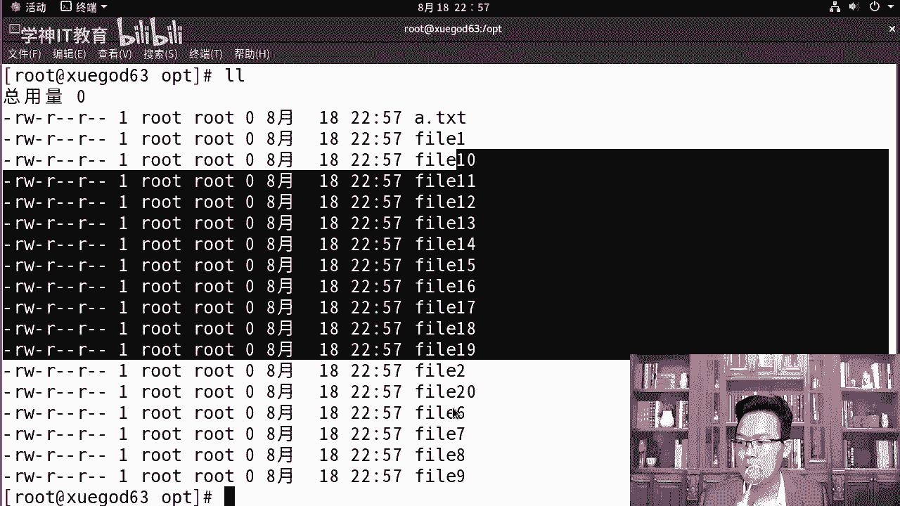
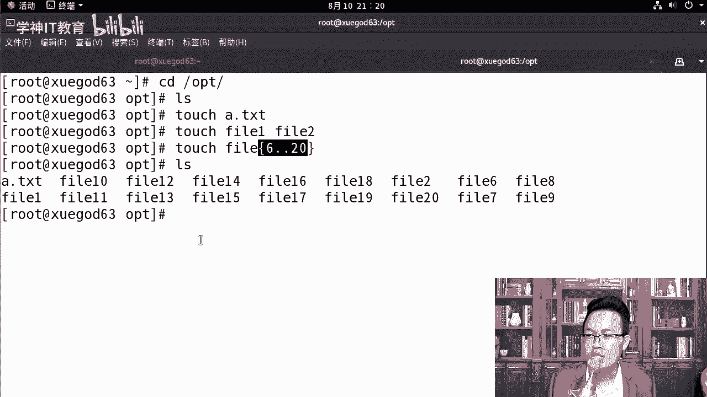
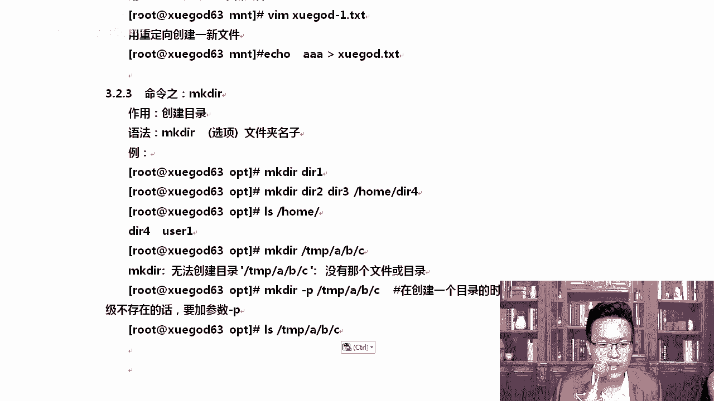
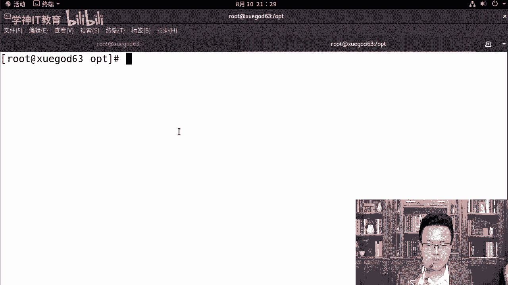

# centos8／Linux／运维／网络运维／RHCE／红帽认证云计算／2020全新独家教程-centos8操作系统从入门到精通 - P13：2-文件的管理 - 学神科技 - BV15V411z7tK

我们来看一下文件的管理。你比如说改变目录或者创建移动删除文件或者文件夹。首先最简单的第一个命令就是touch touch啊，如果直接翻译过来的话，是触摸接触的意思，它是用来创建一个空文件。

我们最常用的就是touch后面直接跟上一个文件的名字。那如果这个文件存在了，它会修改一下这个文件的时间。如果它不存在，那就直接创建一个空文件了。我们来演示一下，比如说我们CD到OPT下。

那么在这里咱们touch1个A点TNT。那大家可以看到已经创建成功了。那我课前创建过好多东西，我们把这些东西删一下啊。它是A点TNT。除此以外，你也可以。两个文件一起写。我后面如果跟两个文件的名字。

他一次性touch出来两个。那如果我要创建，比如说6到20个啊，或者说30个文件，那怎么写呢？可以这样fifi后面写上大框，大框里面，比如说我们写个6，然后点点20。这样回车以后。

大家可以看到它会从几开始，从6到20全都给你创建出来。啊，这样看的时候不舒服，你可以这样竖着看。

呃，你看11234对吧？然后6789啊，他都给你创建出来了。

排序这样排的会更清楚一些。我们创建完了以后呢，默认比如说我们创建的A点T加T，那么显示的这个时间是个什么时间，大家能说一说吗？这个时间默认它是修改时间，我把这个笔记给大家整理到这里啊。

在linux学的过程中，大家别慌啊，这些命令慢慢你你就都能接触到了。而且如果遇到一个英语单词，你不会读，那MK老师会给你写上去，touch。

对吧这样的话，你除了跟着我学linux，那么你还可以学到英语啊，一举双得。假如说我们去LY查看了一下ETC password它的时间，我们查看文件的修改时间，默认是代表的是修改时间。我们看一下它的时间。

ETC passwordword我们打开，大家可以看到这个地方是8月5号啊，今年的8月5号。搞定的。对吧23年26的时候搞定的，拿到它以后呢。😊，State。ETC下的pass。

我们可以看一下ETC下的pas word。那在它这里面有3个时间，最近访问最近更改和最近改动啊，最近访问这个词没有什么歧义。对吧就是访问就相当于看一下，比如说cat ETC下password。

这就是最近访问时间。😊，懂我意思吧？那刚刚比如说20点27是最近访问时间，我ca了一次。那么在此我们去看一下它的时间，对吧？20点27，这叫最近访问时间。那下面这个地方最近更改和最近改动。

这不是一个意思吗？有同学更改更改动，不是都把内容改一下是吧？😡，不一样啊。明白吗？真不一样啊，来来来，我来这里跟大家聊一聊他们的区别。

这个我给大家整理好了，当我们去查看它的时候，能看到的这个时间state state这个命令是用来专门查看文件属性的，包括了文件的时间属性，什么块大小是什么块是多少。L块是多少是吧？

是不是普通文件链接数有几个，你的权限是什么？所有文件的属性通过state命令都可以相当于我们右击文件查看属性，相当于windows里这个功能。那最近访问改动它到底是什么？访问缩写的话。

因为我这里装的是中文。如果大家是装的是英文的话，那么在这里你将看到的是这样一个状态。at time，然后呢，M time和C time。😊，所以这个时候我就有个问题了。啥意思啊？😡，大家能理解吗？

不让我们复制一下啊。你看在这里M time和Ctime它到底。代表的是什么意思呢？是吧M time还有C timeM time代话代表的是修改文件的内容。比如说VM是吧？

我看VR打开还有一个C time，这叫什么修改属性。很多老师把C time讲成什么？😊，你是不是理解成create time了？因为我们windows里有创建时间。

windows下好像windows下也是有这三个时间的啊，各位你知道吗？如果你不知道，我给你新建一个啊。😊。

我们来右击。创建一个新文件。

好，那么打开这个新的文件，随便写点东西。

保存退出。好，右金属性。大家看到了这个时间了吗？创建时间修改时间，访问时间写的很清楚，创建时间修改和访问C time。但我想跟大家说的不是啊，在linux下不是这一说啊，linux下它代表的是称值。😊。

明白了吧。它不是creed，代表的是称值啊，我这里显示的是中文。如果大家。对，大家你看下面还有个创建时间。啊，没没显示啊不显示。现在。OK因为默认情况下，从生屠S。几开始三或者四开始。

然后一直到生态S67，这个地方只有两个到8的时候是吧，新增加了一个创建时间，但是这个创建时间不行啊。看到了吗？一杠代表没有数据啊。默认情况下，我们在7项都是只能看到这几个。记住它是称指time，好吧。

M time指的是猫。Dy time。O。那你说你老师，你教我这个有啥用啊，有用。😡。

后期万一有一天你的系统被黑了，我们可以通过这些时间去找出来。比如说我们根据修改时间，一天内改过的文件找出来，我们还可以根据C time的时间啊。因为我们在fin的查找的时候。

比如说 find的根查找的时候，杠M time我可以指定。我是可以指定时间的M。对，比如说我一天以内，那么就减一一天以内查找一下，跟下所有的生成的文件。好，知道一下这个操作啊，各位。😊。

那拿到这个以后呢，我们把toch这个地方详细的再去给大家说一说啊。刚才我们已经简单的举个例子，由这个例子引出来一些时间上的问题。

大家知道一下。当然这个称职time有同学可能还不太理解。比如说CH mode加X给这个这样脚本加一个X权限，或者说CH mode。很多同学777。所有的权限都给啊，这个有点大，还是加X正常一点。

这就是修改了它的C time。好，知道了这些，我们来创建一下时间。touchtouch是文件名CD的touch下和touch A点TNT。这个语法是不是很简单？对不对？对你操作起来还是很轻松的啊。

操作起。那我们来试一下。😊。

给大家创建一下。哎，CD的OPT下，下面什么也没有，我们toch1个A点TNT对吧？当然你还可以toch很多啊，呃它也可以同时写多个fill一fi2。😊，相当于TST文档。还可以这样写啊。

touch fill。我们加一个大框。大块里面写的是吧，6点点20，大家知道这是什么意思吗？只shall的一种写法。他会将什么样呢？从哪儿开始，从f6开始看到了吧？

对他会从fi16开始一直创建到fi20。那这样看的时候有点不舒服是吧？这样。

啊，这样你去排个序就清楚了很多。

456。一直往下走。

好吧。好，678910。Hao。

回去呢这些东西呢大家多创建创，多用一用它。这是关于文件的创建啊，topuch关于它的创建。创建完了以后呢，我也跟大家去聊了聊是吧？每一个文件它都有自己的一些时间和属性。那你知道一下，开拓一下你的视野。

windows有时候跟windows还是不一样的啊。VMVM是前面我们touch是用来创建文件的那创建完了，我总得往里写点东西吧。所以VM和重定向，同样它们也可以创建新的文件。

而且他们能往里写数据。啊，那往里写数据，比如说VM学尬的谁呢？学尬的一点填FT学挂点填FT。对吧那你可以往里写点东西，写完以后摁下ESE冒号WQ保存退出，这就可以了。那还有一种是echo重定向。

什么叫做重定向？正常情况下，ele AA它是在屏幕上输入了AA。重定向是说将我的内容。通过什么这个。啊，这个大于号就代表的是什么重定项。重定向输出好吧，还有一个是什么？对，还有一个是重定向输入。

后期我们讲身上脚本的时候告诉你啊，输出到哪，你看这个箭头就行输输给谁啊啊，比如说我们输给学点填加T。那这个时候我们去看学压点填AT就有内容了。😊。

啊，这要重定向。所以后期大家经常看我会去创建一些重定向的文件。重定项有个特点啊，如果说我们这个文件不存在的，它会帮我们去创建。

好吧，当然还有追加啊，如果不存在，他就直接帮我创建了雪杆的。如果说这个存在，它会怎么样？😡，你原来不里边不是AA吗？我现在写个111。他会把你的文件删掉以后是吧？变成111。他没有追加啊。

如果想追加的话，用这个。用两个符号代表的是追加往里追加那种。而。完事以后。Hao。😔，这是拿它来创建文件，那创建目录会不会。

这些东西大家回去多记一下就可以了啊。它。😊，还是技钱，还是比较轻松的VI和重定箱都是可以创建新的文件的。如果你想创建一个目录呢？对吧。每一个地方是比当然这个地方我我是有所保留的啊。

我其实重定下啊重定向这种方式还有很多种用法。啊，输入重定向，输出重定向什么错误重定向等等。那些内容在shall脚本的时候，我会给大家去讲。所以大家在学的过程中，你不用觉得哎这个东西好像。

是不是还有其他用法？是的，它还有其他用法，只是我们刚刚开始去学linuxMK老师没敢给你怎么样阐述的太深。产入太深，你就懵了。好吧，但是后面有大把的时间，我可以给你详细的阐述。所以还是大家一句话。

就是前期大家学lininux的时候，因为你有太多的不懂。大然有一些同学可能说老师我已经懂了。比如说你就这不就是重林下吗？我以前看过贾老师的视频，我知道这个时候怎么办。😊，这时候你要把你的心态放平稳。

你你要有一个空平的心态。这样的话MK老师很多的技巧我才能教给你好，否则你的心里总觉得装着那半瓶的水。😡，你是听不进去别人的知识的，能理解了吧？它不利于你长远的去发展啊。

大家在学习的时候要时刻保持一颗什么空瓶的心，你去尽可能吸收一下，哎，别人带给你的不一样的东西。好不好？我是MK啊，我我在学习的过程中，我也是这样的啊，因为我经常要学一些新的技术。

你像我们那个时候刚出出来docker，刚出来open stack，那时候市面上没有什么文章，也没有什么帖子。😡，那这个时候你就要保持一颗空平的心，不停的去看一些官方的文档去进步。

包括我们八里面s度S8又出了一个po慢。啊，又又出了一些很多DNF是吧？又出了很多很多的新的一些技术，have net以前我们都说IP tables是吧？后来到期里面我们说什么。

到期里面咱们说fa world。😊，对不对？啊，到8了8里面又出来一个叫net呃。😡，net filter和net tables好吧，又出了一些新的一些技术。

就是所以说我知大家每一次这个操作系统它都它都在变啊，连我们的配置网卡都都变了啊，你在7里面我们启动一个服务的时候，比如说启动网卡s team啊。

无论我们是network或者说啊networkmanager是吧？这都可以。那到8到8又变了，到8，你要重新启动一个网网卡这么多。😊。

啊。NMCLI，你得拿这个命令去怎么样去启动网卡。😡。

所以说。所以说怎么样，保持一颗空瓶的心，让自己多能装点东西。行不行？这样你才能快速的进步起来啊。那我来把这个地方给大家去。整理好VM说完以后，MKDR是创建创建目录创建文件夹。

MKDR。第二一。啊，是这是创建成功。创建完了以后，如果我想创建多个呢，那你可以同时创建多个啊DR。2。3。对吧都可以，甚至我可以还可以怎么样，它多种写法，我在home下再去创建第二次。😊。

那它是都可以的。在当前目录下创建了二和3这一条命令就是可以创建多个。我想告诉大家大家的是。那除此以外呢，我能创建这样的吗？MKDR我要在TP下创建AA下创建BB下创建C。包错了。

对吧告诉你无法创建这个目录，为啥呢？因为没有这个文件或目录，没有哪个文件和目录，就是明明有TMP吗？😡，是不是明明有TMP，为什么说没有呢？这个时候是这样的，你你想创建这个最终比如说我们想创建这个C。

那创建C的时候，前面没有A和B啊。😊，所以这个时候我们要求怎么样一起创建。那你需要加一个杠P参数就可以了。parent把他的上级附目录是吧，也给它创建出来就可以了。这是关于MKD2。

先把这些最常见的。最熟悉的东西。先记住。层层深入，学起来非常的轻松。LShoMKDR那么无法创建无法创建加杠P好吧？这样就可以了。这个主要是用来创建一个目录的时候，如果这个目录不存在。

我们需要去用很有用吗？很有用。后期我们比如说我们要讲一些新的技术，什么ELK。😊。

啊，你也可以大小。对，比如说我们要讲ELKEFK等等，我们要创建它的data目录。那它的dta目录也是好几层的，比如说沃尔下的。啊，EK等等，它有很多的这个路径啊。好。

所以这个招挺有用。删除。另外我们聊聊这个删除。其实在linux下，你是不是有很多种方法都能删除一个文件？删除。再教你一个小窍门，你想把lininux学会，最重要的是你记住一遍以后就不忘了。😡。

大家是不是很有那种感触，就是我前面讲了好多命令啊，尤其第一阶段前面学后面忘，即便你现在没有这个管这个感觉，你到后面一样会有这种感觉。比如说我们教你sel脚本的时候，好多种用法，你又不天天写sel脚本。

你总会忘这个时候怎么办呢？嗯。😊，记记一记什么记一种记最啊用心的去记一种这种命令让你永远都忘不了。😡，你觉得你永远都不会忘掉那个命令。就像我跟大家说的，关机你还记得吗？或者设置什么切换启动级别。😡。

eit3这种。好吧，啥时都忘不了。😡。

对吧比你说。是不是刚才是不是已已经有同学忘了，假如我想。😡，切换。啊，solate这个切换到什么？比如说我就切换到三级别，这个是不是你已经忘了。😊，我要切换到marty啊us。对不对？你是不是已经忘了。

所以这个很正常，marty you点点他给他。😡，你你要学会这个方法，因为linux确实有好动能啊，那么同样删除也一样，删除也有很多种，你就记这一个，我不管删文件还是删目录，就是RM杠RF就搞定了。😡。

别记那么多记那么多，到最后你肯定会忘。但是你要用心的去记住一个永远忘不了的命令啊，永远忘不了的使用方法，就这种方法。

F的话表示强制删除R的话就做什么删除目录递归删除，把目录和目录下的文件也删除。

有突然你这个说的怎么这么绕呢？😡，不是我说的让啊，确实是这样看到啊。😊，RM5假如说我们是要删的时候。如果我们什么也不加，我且A点TNT。你看他会告诉你，你是否删除普通文件，然后你再说哦，我是要删除。

😡，对不对？如果你要好多呢，假如IM我要删除什么D2删除D21。对吧我要删除它哎，结果他告诉你，哎，DRDRE是个目录，你还没法删。😡，你说你纠结不纠结？😡，删个文件怎么这么麻烦呢？😡。

是吧OK所以我不管你是啥是吧？我我也不需要那个提示啊，那你就直接删就行了。当然呃工作中是吧，大家是吧可以什么呀移除，就是目移移动一下。因为你我怕你删错了嘛啊，你可以将比如说fe2是吧，移到什么。

移到其他目想，比如说我们移到。😊，ETC一下啊，或者TMP1下。这样移走移走等服务运行的没有问题了，然后再。到TP下给他干掉。很多情况下，你可能误删文件。对不对？好。😔。

那记住啊，这个一定要慎用，一定要在删除前确定一下所在的目录，千万别搞错了，当然不要执行这个命令。我看网上有很多帖子都这样写的，是吧？RM杠RF根。

请问我这样回车，我的系统是不是会挂掉？能挂掉吗？能不能挂掉？嗯。挂掉了没有？没挂掉吧，他只是告诉你它是一个什么很危险的操作啊。你如果你真想挂掉的话，你可以这样。😡，想要系统挂掉，确实有很多种方法。

这样的话就挂掉了。但挂掉也没关系，我有什么快照，我还能恢复回来。😊，好，说完这以后，还有一个这样的目录，limux下还有一个这样的命令，我觉得挺有意思的。MRRM啊RMDIR。😊，哎，这是干嘛的？

我们来删一下啊。D23。删成功劳娃。因为现在已经没有了。好，接下来我们CP是一个文件或者我们touch。😊，touch一个谁呢？在DR1下创建1个AA点TST。好，接下来你再去删的时候，假如我还想删除。

删的时候失败了，告诉你DRE是失败的是目录飞空。这个命令只能删除空目录。其实工作中想一想，我们只删空路这种。好少的。好，所以这种命令你有时候就记住，过一段时间你也自然会放掉。😊。

通过这个例子，还是那句话，用心的去记住一种最常用的方法。就够了。啊，因为在工作中，你很少很少会去说我们哦今天我们把。😊，某个目录下的所有空目录都删一下，你的文件，你工作生产环境下哪来那么多空目录？😡。

真没有好吧。听楚吧，那个确实很少有把啊。😊。

所以像这种命令大家就了解一下就行，根本就没有必要用心去记它。

你能把这个永远记住，忘不了就可以了。CPCP语言文件到目标文件。😡，拷贝。啊，copy杠R大R小R都可以代表递归处理将linux啊会经常有个递归处理，就是R。😊。

通常你看到到R的话就是递归F的话通常就是强制啊。当然F有时候也代表fe尔指定一下目录啊。一起一起干掉啊，比如说我们CP。😊。

好，复制一下。如果我想复制目录的话，是这样的。比如说我们想复制put下的grab two，我想讲这个这个目录下有很多东西，我想给它复制到OPT下。😊，不行啊，你得加R才行。这样才算是真正的复制成功了。

看OPT下它是有grab two graph two里当然是有一些文件了。😊，看到了吧？各位。对你需要这样去做这事情啊，那还有一个是移动，移动的话，我们就木。比如说木pas word叫DRE。

对吧然后呢，木学尬的。给他搞到什么，你也可以给一个路径啊，A点TNT这也是可以的。😊，移动其实听。挺常用的。如果你怕自己误删除文件，那你就用 move这个命令。

移动文件。移动文件其实也叫重命名是吧？像。下面我们看一下如何查看文件的内容。

