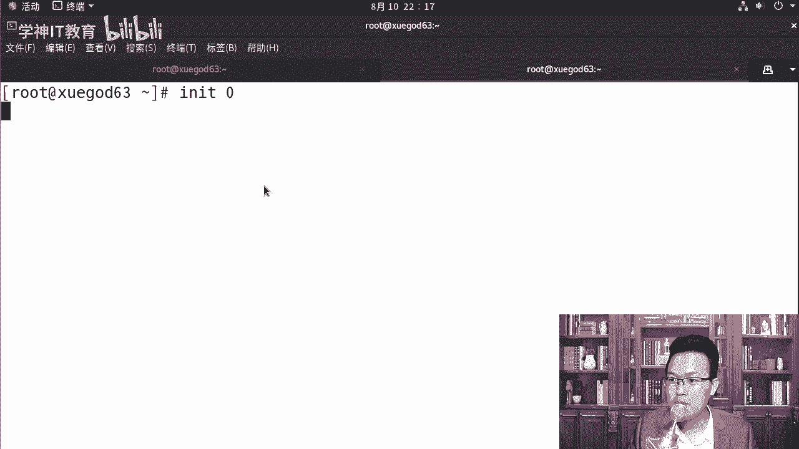
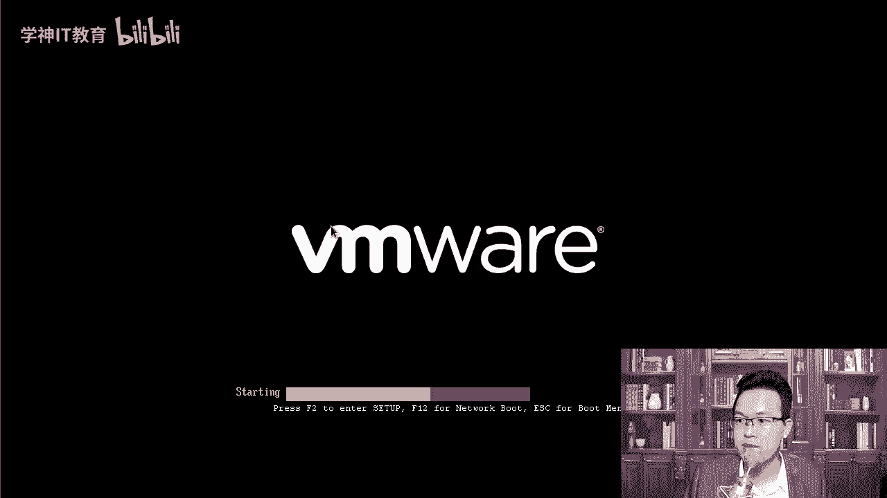
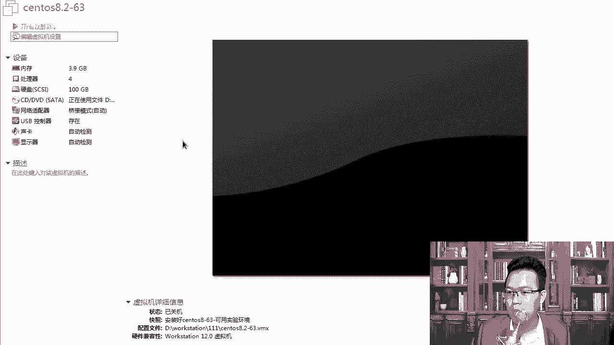
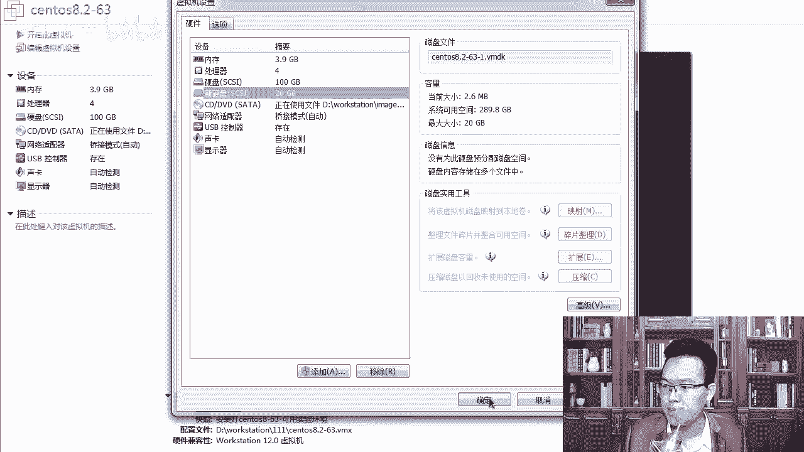
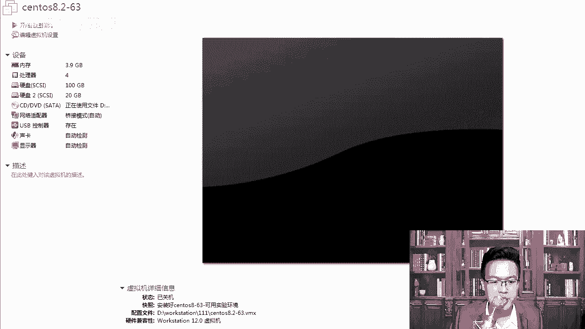
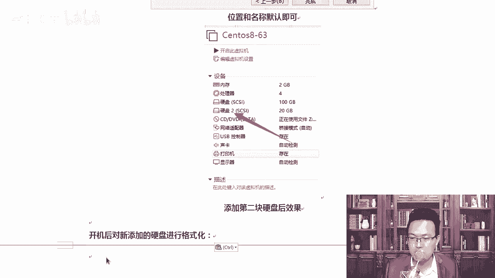

# centos8／Linux／运维／网络运维／RHCE／红帽认证云计算／2020全新独家教程-centos8操作系统从入门到精通 - P15：4-实战-xfs文件系统的备份和恢复-1 - 学神科技 - BV15V411z7tK

大家好，接下来我们来分享一个项目实战，叫做叉FS文件系统的备份与恢复。那么在以前我们说数据误删除了以后是可以恢复的。在叉FS上是不行的。它这个系统是新的一个系统，它没有呃完成。

没有一个很好的工具能让我们快速的去恢复啊。EIT4是好说的。那我们来先，所以这就要求你要做好备份啊。我们先要先来演示一下，介绍一下叉FS提供了叉FS dumpumpdump是做备份的。

restore是恢复的，提供了这个工具，这个工具可以帮助我们去备份我们的数据啊。叉FS dump，它是按照iode顺序可以备份一下这个文件系统。stoS7开始选择了它为默认的文件系统。

不再使用E以前的EST4啊，那么叉F只装为大数据而产生，每个文件系统可以支持8亿B。同样8EB是什么概念很大吗？很大啊比T还大呢。单个文件可以支持16T，不仅数量庞大，而且扩展性也很高。

就是你要上大数据，那你就用叉FS这种文件系统格式就可以了。当然，其实我们真正的上大数据。我们应该使用的是分布式文件系统。比如说sep，比如说HDFS。呃，hdop里面的分布式文件系统啊。与传统的它不同。

那它不需要在备份的时候被卸载，也就是它支持什么热备，就是你系统正常的时候，我可以对它做一个。做一个什么备份，不不用你关机，也不用你暂停，你的机器可以正常跑。就像我们做快照一样，比就说MK要对它做个快照。

其实快照也是一种热备啊。😊，不需要你停机，你就可以对他进行做备份。另外大家有机会后期的话可以上阿里云上去看看那个云主机，云主机都是通过快照进行备份的。就像MK1样，当前我这个机器的时候，我觉得不错啊。

我在这里拍一个快照，我就直接拍了，拍完以后删了数据也没有任何关系。😊，好，那每个数据流可以放往不同的目的地是吧？再往下我们来看一下它的备份主要分为两种，一种是完全备份，一种是什么增量备份。

你们喜欢用哪种备份？两种你都得用。零级别啊零级别的话是完全备分，1到9是增量备分，不是说你。啊，老师这一次用完全，下次它是这样的备分的过程中。

它不是它不像我们什么CP比如说CP我们就相当于是一个完全的备分，从A拷贝到B。😡，这就是完全没份。他是这样的，你完全备份完了以后，还支持增量备份，那这样有什么好处呢？确实好啊。

我们把他们几个备份的概念给大家也说一说。因为大家一说到这几个，还有一个叫差异备份。完全增量和差异三者之间的区别，你看完全备份，没得说，就是把所有的东西都背一遍。😊，好，像CP1样考一遍。

大家所不理解的就是增量和差异，增量是指的是什么呢？你看我们这里叫增量备份是吧？每次将前一次前什么，第一次第二次直到最前一次做过的备份后有变化的数据做一下备份，那差异备份差异备份，每一次每次都是将什么呢？

将第一次完整备份以后发生的数据进行备份。像ISNC它就是就是ISNC在备份的过程中，我会做对比。比如说ISNC。😊，呃，我们在备份的时候。

假如我要将目录什么data里的数据备份到啊back up备份这个目录下。那它每次都是根据这个data要做一个对比啊，对比一下。比如说data里面有一个新的文件，A点TIT我就把A点TIT拷贝到这下边。

OK那么如果后面你你懂我意思吧？啊，每一次都是要跟你完全备份做一下对比。😊，你看出来他的问题了吗？就是。对比的这个过程会比较大一些。这样吧？这就要求你你经常要有完全性的备份。如果你没有完全性的备份。

你跟谁做对比呢？😡，所以增长辈份就解决了什么？解决了你每次都要。😡，每一次都要跟上一次的完全做一个什么做一个完整的对比，他就解决了这个问题。我们来演示一下，就是增量背后我说再多。

你可能理解钱这个差异辈分好理解。😡，完全备份也好理解，差异备份也好理解。差异备份就是比如说我备份的时候，我要跟他做一下对比，你有了什么文件，我就把什么文件备份过来。唯一不好理解的是增量备份。

因为你没有搞过增量备份，好不好？增量备份，你再理解一下，第一次第二次直到前一次做过备份，有变化的数据进行备份。😡，读了好几遍，觉得还是不知道他说的是啥。所以我教你一个方法，就是搞IT经常会有这种感觉。

就是我所有的中文我都认识，读完以后，我不知道你说的是什么。那这个时候怎么办呢？😊，对，这个时候跟着MK老师的课听一听，跟着我把实验做一下，回来再去再去理解这个词儿，你就知道它是啥意思了。😡，好不好。

所以我们先演示一下增量备份。啊，因为差异备份的花和完全备份，我们经常工作中接触到增长备份，我们一般在生产环境下才会接触到这种技术。首先呢你需要加一块磁盘，既然我们要做备份备份，加磁盘是不是得关机，对。

加磁盘得关一下机啊。😊。

那咱们添加一块新的磁盘上去啊。干干净净的加一块吃饭。好，我们来先快速的关一下机。我怎么点开机了呢？加磁盘你需要关机的啊。

好，编辑虚拟机。加1个20G的就够了。

我为什么要加一块磁盘呢？这样的话大家演示的时候看起来会更清楚。其实我直接使用目录也是可以的啊。我们点添加。点击添加磁盘的时候，你不一定你要选中这个磁盘啊，你选其他地方也行，在这里去选磁盘也是可以的。

scarity选择scarity啊，我们先选择scarity。😊，创建新的磁盘。即便你那有NVME磁盘类型，你也要选scarci的啊。后期讲磁盘的时候，我会专门讲给你听20个G就可以了。好。

那么先添加完这个磁盘。3、添加栏磁盘，我们需要对它进行一下格式化啊，这边先开机启动一下。

启动的过程中，老师把笔记给大家梳理一下。来。所有东西我都给大家画的非常的清楚啊，你们做的时候照着这个笔记一步步来啊，我们点编辑编辑在这里点添加，添加完了以后选择磁盘，再点下一步，下一步完了以后是吧？

再创建新的磁盘。你要点哪块，再点下一步20个G2G个G完了以后点完成。这样我们这个系统就算是OK了。加完以后，你看看到这里会多一块磁盘啊。😊，拿到这个磁盘以后，磁盘一个新的磁盘怎么去使用？

顺便我们也讲一下，你需要对它进行一下格式化。我们来试一下啊，让它启动一下。

