# centos8／Linux／运维／网络运维／RHCE／红帽认证云计算／2020全新独家教程-centos8操作系统从入门到精通 - P17：1-在正常模式下做的操作 - 学神科技 - BV15V411z7tK

大家好，我是讲师MK，欢迎来听我的课程。今天MK老师要教你的是VI编辑器和恢复linux下无删除的文件，以及X manager这一块的内容，三个内容都非常的实用，是我们从事linux运维闭会的这个技术。

首先VIM这个工具，我们先做一下这个介绍。😊。

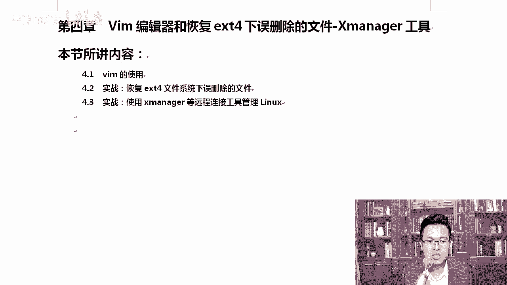

VIM前面我尝试的，咱们前面也用过这个VIM。那这一次我们来详细说说它它其实有很多使用方式啊。那我们首先witch查看一下VM。

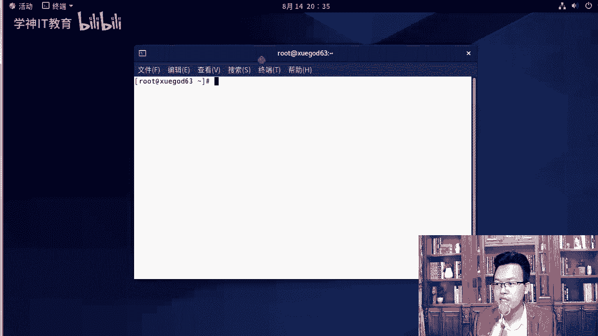

查看一下这个命令，这个命令在USR并下VM它在这个位置上。那除此以外，还有1个VI知道吗？啊，来which我们可以看一下VNVN是在哪里，是在这里。那它俩之间是什么关系？我们可以另外我教你一招。

你想怎么样？比如说我想查看这个包是。😡，有这个命令是由哪一个软件包安装的，你可以这样RPM杠什么？QF的方式去查一下这些小技巧，慢慢的大家都要记住啊，那我们可以通过这种方式来执行一下。MPM杠QF去查。

那你能可以看到它是VM in hands这个包安装的。除此以外。你要想看VI的话，我们来看一下。这样你就知道他俩到底是不是一个包安装的那你看VI是VIM怎么样，minimal啊，minimal它安装的。

所以说他俩是一个软软件包吗？答案是什么？😡，对，我们从这个地方就能看出来，它俩并不是同一个软件包安装的，它是两个独立的软件包啊。那想要知道怎么样，你想知道它是通过什么安装的。

那么可以通过这个命令RPM杠QF这种方式去查询，我们就能看到RPM杠QF的方式。我刚才是通过这种方式去执行的，对不对？除此以外，还可以怎么样呢。还有一张。你也可以通过这样把它两个命令结合起来。

用这个反引号反引号是哪呢？就是table上面这个符号。OKwhich你可以通过反引号，然后跟上which which后面写上VM这样也可以。看到了哎，不好意思啊，我这写的。有问题啊。好。你要用反译号啊。

V an am好。大家遇到错误的时候说，你别慌，你看他说noWIM在哪呢？在这里面。所以说大家遇到错了，你别慌，你你去对比一下。😡，好吧，那通过这个命令可以怎么样？这一个命令就相当于我们前面两条命令。

就这一条命令。好不好？反引号是什么意思？代表先把这个命令，先执行这一条命令，把这一条命令的输出作为作为这一条命令的输入。OK这一条命令就等你两条命令啊，你可以写到一起啊，其实还是写了两次是吧？

你看我们是这样的RPM杠QF。😊，那如果你加了反引号以后，它会先执行反引号里的内容，也就是将反引号的输出，反引号输出的是什么？输入出的是这个值，把这个值作为前面这个命令的输入。

这是linux的一种使用方法。后期我们在s脚本里面会经常用。所以在这里我希望大家怎么样也能呃，看一下好不好？对，首先呢。

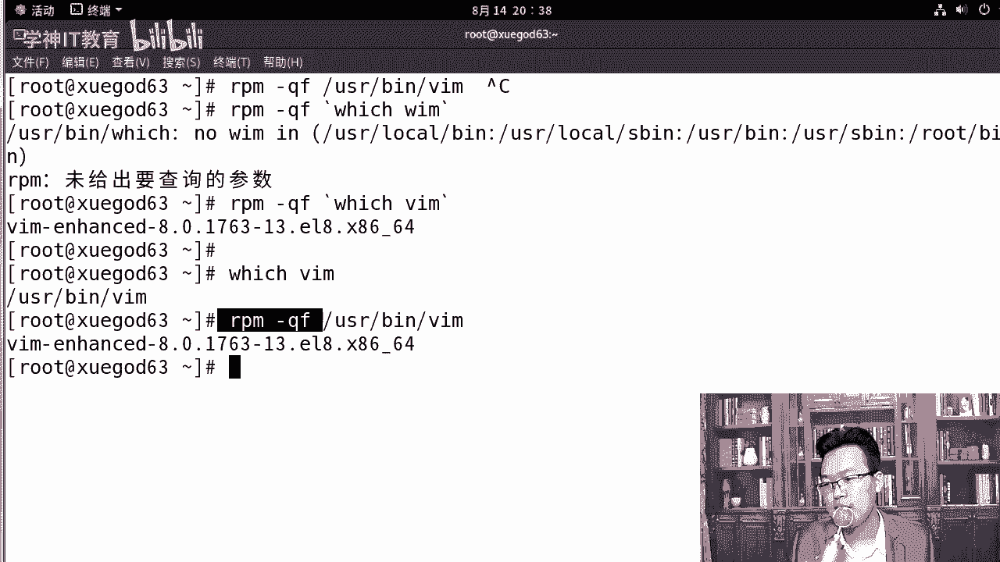

这样的话我们来看一下。所以说那我问一下是吧，VIM和这个地方，他们俩是不是同一个软件包，答案是什么？对，答案是不是啊，他们不是同一个包。来。那么VM是VI的增强版，最明显的区别是VM是可以有语法加量的。

而且它完全兼容VI。怎么能看出来呢？ETC打开VM打开ETC下的password是黑乎乎的一片，然后退出退出以后，VM打开ETC passwordword，大家可以看到这是彩色的，有语法加量的。😊。

看出来了吧。这是二者的区别。然后呢。查看扩展一个小技巧，查看一个命令。对，查上一个命令。是。哪个软件包？安装的好，那可以使用这哪个方法呢？可以这样，你可以通过这种方式就能查看一个命令，它到底是。怎么样？

是哪个包装的那我们刚才看到了他们俩一个是VI in hands加强版，一个是minimmo。对吧。如此一来就OK了。好，咱们接着往下啊。😊，拿到这两个以后呢，我们来说说VIM的具体的使用方法。

比如说VM有几种运行模式呢？VM的4种运行模式。第一种模式叫做nomal。好吧，俗称命令模式。如果我们标准的说法应该叫做正常模式，还有一个叫命令行模式，那就是comd line命令行模式。

OK还有个insert模式插入模式，这里有一个俗称俗称叫编辑模式。为什么要有个俗称呢？各位。为什么要有个俗畅？俗称是编辑模式啊，还有一个可视模式，要叫可视怎么样？可视框模式。因为这种俗称离的钱。

更轻松一些，好吧，正常模式和插入模式。其实你们天天用这个插入模式，比如说VM打开ETC password摁下I。😊，典型的这里就有一个插入字样。对，这就叫插入模式。但一般情况下，我们呃很多情况下。

我们都习惯成为编辑模式。因为在这上面就可以随便进行编辑了。就像我们啊编辑一个普通文档一样，上下左右可以随便去编辑。😊，对吧好。那我们来详细的说说这几种模式啊。好，那你就说。打开啊ETCpa还以它为例。

直接打开打刚打开这个文件首次进入的时候。有时候我们叫做命令模式。那其实这个时候是什么呀？准确来说，它应该叫做正常模式。好不好？正常模式啊，首次进入文件的时候，我们称为正常模式。nble俗称命令模式。

其实就是正常模式。刚进入这个文件叫正常模式，它也在这个正常模式上也有很多快捷键。稍后我给你说一下啊，摁下I出现insert就叫编辑模式或者插入模式。你们习惯于叫什么模式，插入模式吗？还是编辑模式？😊。

很多情况下，咱们国内都习惯你叫怎么样编辑模式啊，实际上在国外标准的说法是insert插入模式。那摁下ENC再输入冒号，这个叫做command令command line。命令航模式啊。

这个倒是都没什么区别。看到了吗？对吧摁一下ENC你要摁下EC啊。好，那在插入模式这个地方还有正常模式搞定了。接下来稍后我们说说还有一个模式叫做可视模式是吧？或者可视块模式。好，我们一会儿说一下啊。

认识了大体上认识了以后，我们来说说从编辑模式切换到命令行是怎么切的。你在编辑模式好，或者说你在insert插入模式，那么摁下ESC输入命令行啊，摁下ESC的时候是在命令行模式啊。

我们这个时候比如说摁下ESC没有冒号的时候，这是命令。好吧，命令模式。然后呢，命令行的话，你需要输入这个冒号。好，知道了这个以后，我们来看一下，有同学老师，我怎么进入编辑模式。我们先聊聊这个。

这个是最简单的。你想进入编辑模式啊，有很多种方法。当然比如说I就是好吧，除了I的话，还有很多种，这几个字母都可以，而且分大小写，我们来这里给大家详细的说明说明我们这个。😊，作用好吧，我们说几个快捷键啊。

😊，这个进入编辑模式的时候，你可以按下I好不好？当前字符I是在当前字符之前插入，什么意思呢？假如说M可以在数字一这个地方，光标现在这里，如果我摁下I，你看我插入的时候就会在一前面进行插入。对吧然后呢。

😊，这几个东西大家慢慢的都记一下啊，A的话是在当前字符之后插入O的话是下一行插入。我一般用I和什么样，I和O会多一些，好不好？因为平常不就是一个字符嘛？我光标移动一下就可以了。懂我意思了吗？

其实所以大家记住I记住O就行了。X的话是向后删除。那么除此以外，还有大写的I大写I是在行首。一般情况下，我这个时候会摁下home键，直接就跳跳到行首了啊。你你摁一下大写的A也可以。

你看它就在行首进行插入了，两种方式都可以。A的话是大写的A是在行尾。😊，好嘛好咪。这个东西呢大家需要找个本，找个笔记下来。除此记下来以外，你还应该多去练习好，我建议大家记住I和A就够了啊。至于这两个。

你用home和摁也一样，键盘上摁起来也挺舒服的。😊，对吧。因为这两个字符如果你用的不时间不多的话，就是不常用的话，经常就会忘。而且很少情况下我们非得带行委去查，其实一般没有啊。😡。

都是改其中某一个配置文件的时候是吧，直接改。X的话是向后删除等同于delete。那么这个X是向前优势撤销R是恢复。单纯输入一个R是什么？对，单纯输入一个R是替换。当然这些命令是在哪呢？是在命令行向啊。

好，这是怎么进入编辑？然后呢，还有命令模式下的一些快捷键。我们把这个命令下对命令模式下的快捷键也给大家说一声。演示一下吧。当然其实这些命令他们都属于命令行下的，就是命命令模式下的快捷键啊。

都属于只不过这几个是负责怎么样进入啊这。Right。咱们对这下面做一个说明。除此以外，我们依次演示一下吧，给大家前面这几个A。😊，如果我们输入A的话，大家看一下ESC只在命令模式下。

如果我们输入O五光标在这里输入O的话，你看它会在下面去插入一下。对吧啊，它会在下面。如果我们摁下大写的O呢。😊，一样，他会在这个行的上面插入。好，我们再来聊聊这个X向后删除字符串这个地方啊。

我们来删一下。X的话是这样的，向后删除摁下X，看就像摁下delete一样，我挺喜欢用这个X的。如okK如果摁下大写X是向前。😊，红色标记的你用心记一下啊，U优势撤销这个也很重要，万一我改错了呢。

我摁一下UUUUU。😊，对吧按下U就可以了。如果你彻底想恢复原始状态，那怎么办呢？😊，E感叹号。不保存，直接恢复原来的状态。啊，这个也挺好用的啊。还有一次假我删一下啊，在这里又删了一些。😊。

对吧就乱操作了一些，摁下U，你看before前面有29行是吧，299处改变，你看。😊，你每按下U撤销一次，它就会变一次。懂我意思了吧？那么我想恢复呢，恢复是cttrol加R，它可以就是用恢复。😊，啊。

ctrl加就可以进行恢复了。😊，好，你想替换呢。比如说我想将这个D替换一个数字，摁下，怎么样摁一下R键，然后摁下你想替换的，我想替换成R，它就替换了。😊，来这里吧，比如说这里是一个零，我想将零替换成一。

摁下R再摁下一就可以了，这是在命令模式下去执行的这个操作。当然这些操作你也可以在什么编辑模式insert模式下去做啊。😊，好，那么在刚才我们插入的过程中，我们的光标又是如何移动的呢？

咱们看一下我的光标可以按下什么上下左右的光标键。除此以外，我再给你推荐一个挺好用的快捷键叫HGKL，它们也挺好用的。HGKL也可以光标上下左右的移动。大家看一下。上下上下。他也是可以看得出来的。Oh。

那看到这些东西以后呢，我们来再看这儿。数字零和home都是表示切换到行首doller和end都是切换到行尾。调调的，你还是摁end吧。因为dollar你还得看一下键盘是吧，去找一下那个数字键。

shift加数字4，这才能切换到dollar上。OK。啊，摁下零就可以到杭首，那home和摁的也是可以的。好。这些再往下，我们想快速定位到怎么样？这些都是在正常模式下做的操作啊。

也就我们的命令模式下做的这些操作。我想快速定位到行首GG2个GG是快速定位到行首，大写的G就定位到行尾。比如说我想知道这个文件，一共有多少行摁两下GG，它现在是一这个前面的一代表的行号。

后面是代表这行第几个字符。你看我光标往后移一个，它就变成2，然后再移一个光标往后又移了一下，它变成三了。而，光标现在停留的就是D三。然后我的光标往下走一下，这里就变成了R，然后再往下走行号再变。

所以当我们摁下大写的G的时候，那你可以看到。😊，47行。我这里面一共47行。暂下大血技跳到横首。好，那在这个模式下午，如果我想查找一下内容呢。对吧这里面这么多内容我想查找一下。

比如说我想查找一下root，我想查找一下并，你可以这样。😡，斜杠加上字符串，它可以查找或定位你想要找找的单词。如果内容比较多的时候，就找到的数量比较多，我们可以按下大写的N和小写的N。

大写的N向上小写的N是向下去查找，小写的N用的会多一些。因为我们找到了以后就希望往下翻嘛。并且VM会对查找的内容进行高量显示。如果你想取消，可以使用no high no HH high就是高的。

通过他可以去搞定。试一下啊。no系。看到了吧？哦，现在没有查到，我们现在查找一下，查找一下并，你看满屏都是并，摁下一个N。看到光标往下走了吗？我光标现在在这里，我摁下以后，它应该调到这里。是不是？

对不对？如果摁下大写的N的话，它会往上调。这个是什么意思呢？当我翻的思路比较多了，我现在又想往回翻，好吧，那可以摁下N。大写N，它又往回翻了。如果而且一旦出现这个，你看我不保存退出了以后。

下次VM再打开的时候还是满屏都是黄。都是高亮显示，我不想高量显示。No海。这就可以了。那如果你忘了这个no high怎么办？有同学老师，我忘了这个了。😡，这就是工作和什么和专业人士。

专业人士是告诉你no high能搞定。如果你实在忘了，那怎么办呢？你还不想让他高亮，你怎么办？😡，对你可以整一个什么找不到的。比如说我搜一串A。😡，瞬间就没了。只要他找不到是吧，下次打开的时候。

你看就没有这个。😡，好吧，我就是专业人士啊，但是有时候你忘了你确实可以通过那种搜一个搜不到的数据啊，这样是可以找得到的。😊，好，除此以外，还有我们这个间括号。怎么样向上的间括D，那它表示以什么开头。

在查找的过程中，我们也可以加点符号。这个间括二是在数字六上的。

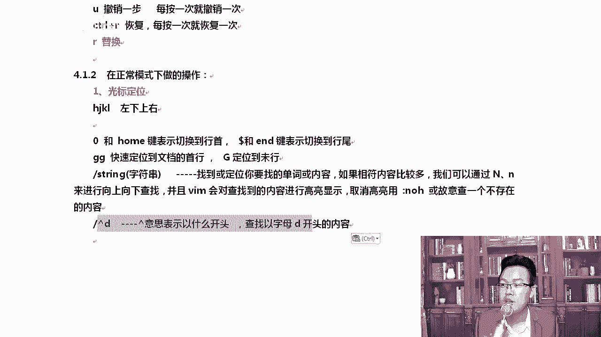

啊，那比如说我们开一以B开头的有哪些？对吧那我就能看出来。然后呢，比如说监框M开头的有谁？😊，对不对？那如果我想以什么结尾呢？比如说大家可以看到这里有什么no login啊或者be是结尾的。

我想找到be是结尾的那我可以这样。😊，到了。😡，回撤。他就能将查找的都能查到。你看这这里在这里是吧？再按一下。调到最后第一个和最后都有。OK。好，退出，除此以外，还可以这样。加号。

比如说我们拷贝个文件ETC上的pas word。哎呦加X了是吧，你可以加点东西。知道吧？如果我们直接什么也不加，什么也不加。打开一个文档以后，会直接跳到最后。那你也可以加个数字。

比如说我想跳到第二3行或者53行，53有这一行吗？有好，那你可以看啊，没有没有的话就跳到48了。😊，那我可以跳些小一点的，比如说跳到23行，22行，它就到22了。

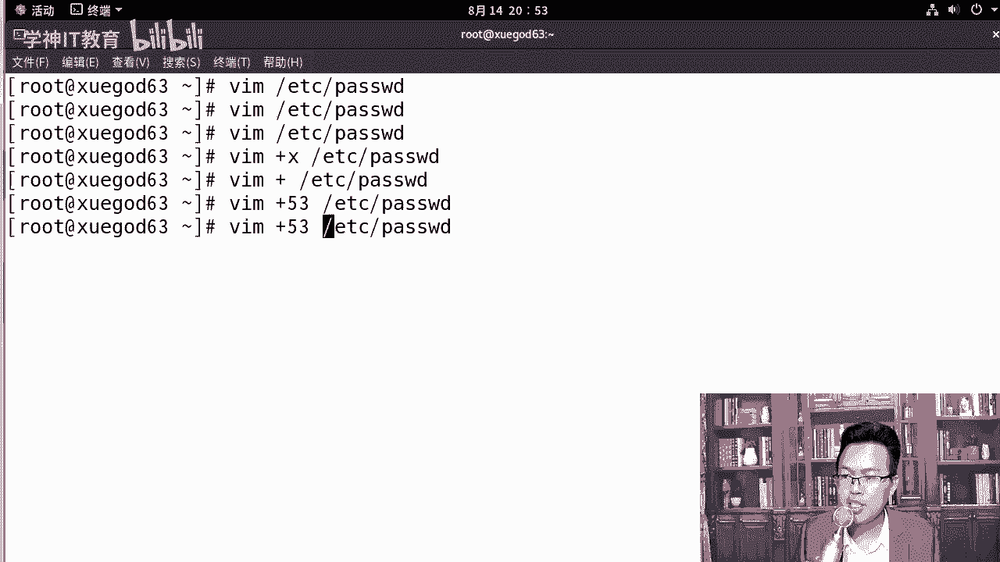

Hao。这是。查找这一块的内容，这些内容呢都挺好用的。平常的时候是吧，大家都用一下。啊，当然用的最多的还是直接什么斜杠加上字符串。还是他最多啊。这个地方代表以什么结尾查找以字母bsh结尾的内容。

然后VM加A点TS4T打开后会直接到文件的最后一行，然后加53好，我们加个23吧，加23的话表示打开文件以后，自动位于第23行，这个方便后期排错。因为服务器在排错的过程中，它会报。

比如说第23行是有错误的。那你通过这种方式就可以快速定位到第23行。

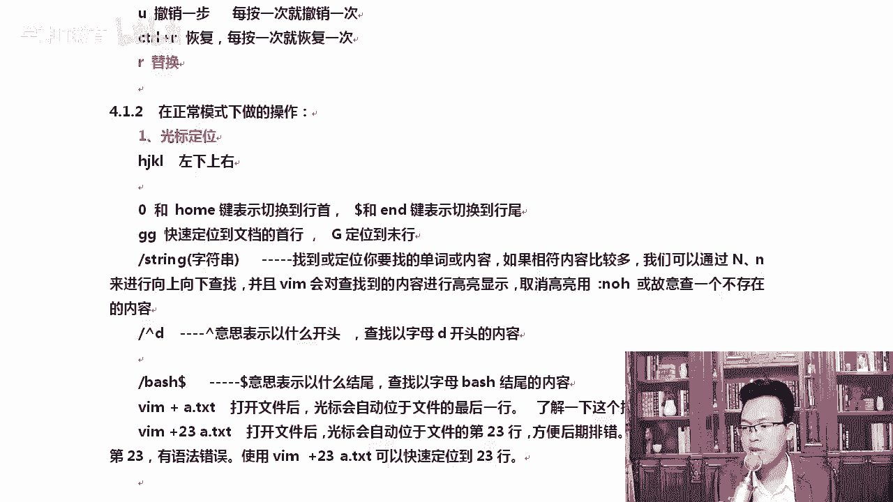

就方便很多了，明白吗？同学们。我们用的是。谁呢？是ETC下的pass2的是吧？

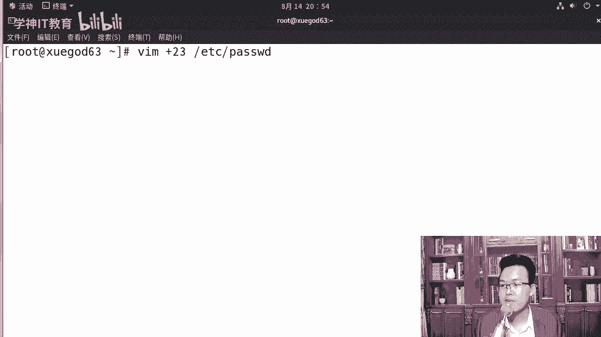

两种方式都可以啊。如果大家在看我的文档里，你没有这个文件的话，你自己随便起一个文件就可以了啊。各位。😊，对，大家如果没有这个文件的话，你可以随便起一个文件。你要写这个绝对路径啊，因为我是在root下的。

除非你在ETC下，你可以什么写相对路径。😊，那咱们有了这两个步骤。你们还有关于VM还有什么问题吗？😡，我来说一声啊，就是VM确实有很多的使用技巧啊，我更喜欢是什么呢？按下大写的G，有时候就这个跳到行尾。

跳到最后这一行吧。😊，像这种方式说真的，我其实一般VM打开以后，摁下大写的G，直接跳到最后，我更喜欢这样。啊，因为这个技巧其实并不常用，而且过一段时间肯定会忘。啊，一句话linux中有太多的小技巧。

你只记住你永远不会忘的那一种方法就可以了。😡，明白老师的意思了吧？因为这种方法确实时间一长了是吧，他肯定会放，不仅是你我也会放。😊，啊，但是VM摁下大写的G，这个我已经觉得很熟了，我再也不会忘了。

所以我就可以这样去操作啊。😊，那么稍后呢，我们在我们还可以在正常模式下对它进行一些修改。我们来正常模式讲完它ETC下的pass word打开。在正常模式下，你要做一些操作的时候，有哪些操作呢？

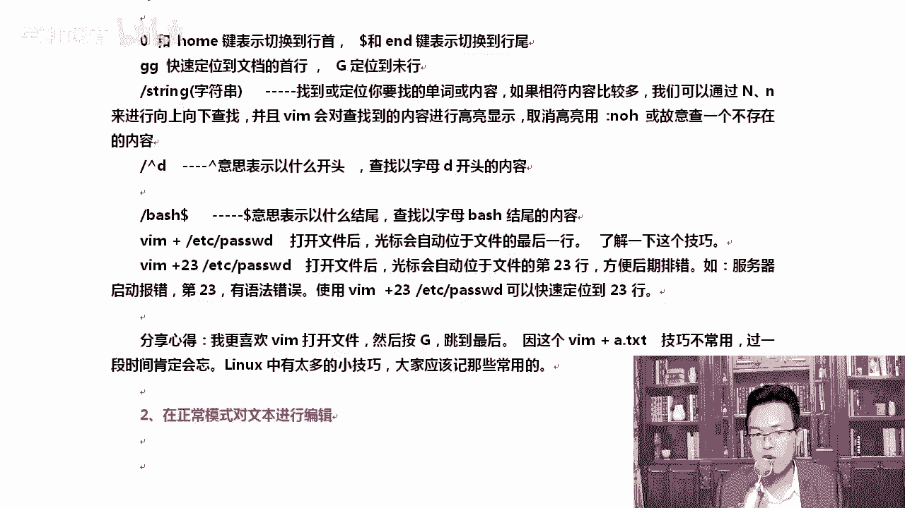

大家我一直改的是这个ETC password错啊。😊，我怕你搞。我怕你是不是搞不定啊？😡，所以你要是实在搞不定的话，你可以这样啊CPETCpaswordA点TST别你一不小心保存退出了。清楚了吧？

你可以在这里先对它复制一下，所有东西你都上这上面去操作就行了。我怕真怕大家是吧，改过来改过去，改到最后是吧，自己都改把配置文件改坏了，而且你还没有做快照。那这个时候你就白搞了。😊。

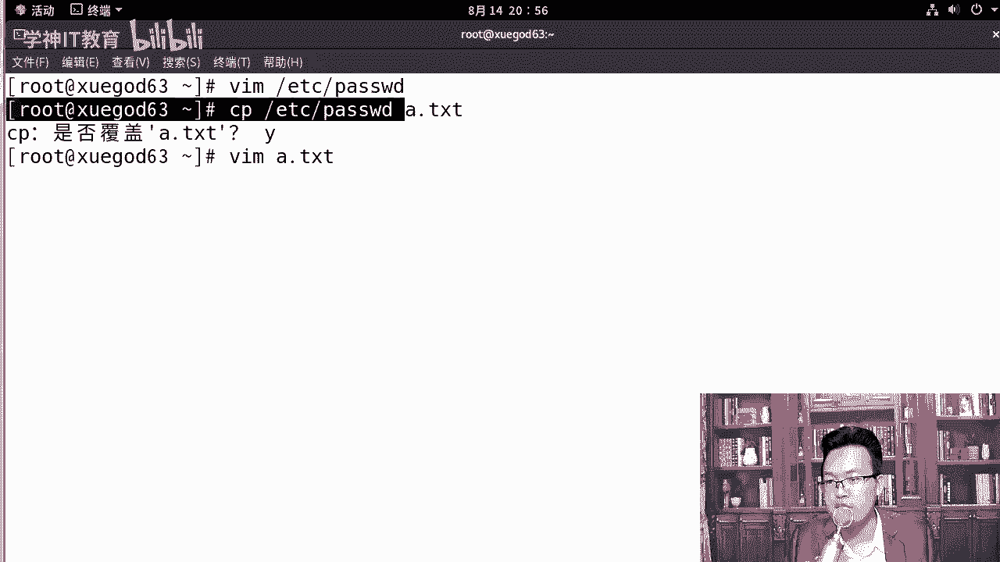

所以大家一定要注意一下，你你在整个操作的过程中，我是在ETCpassword下的是吧？那大家在一开始的时候，你可以都可以搞一下啊，你可以去呃去改一下这个。😊，OK我们扩到当前目录像，你可以通过这种方式。

这样的方式对你们来说会更保保险一些，你们感觉呢？有没有谁把这个pass word是吧，改乱了，或者改错了？😡，有吗？有可能是吧，你有可能把这个pas的改过来，改过去，改的很乱啊。😊，好。

我们来说说复制粘贴，打开A点T然T。我想对A点TA点TNT进行复制，前面只是简单的看了一下，还好说复制粘贴这个地方肯定会有问题。复制是YY，我要复制N行。

就NYY2YY代表复制两行D的话代表什么滴D是删除的意思吗？滴滴是删除是吧？

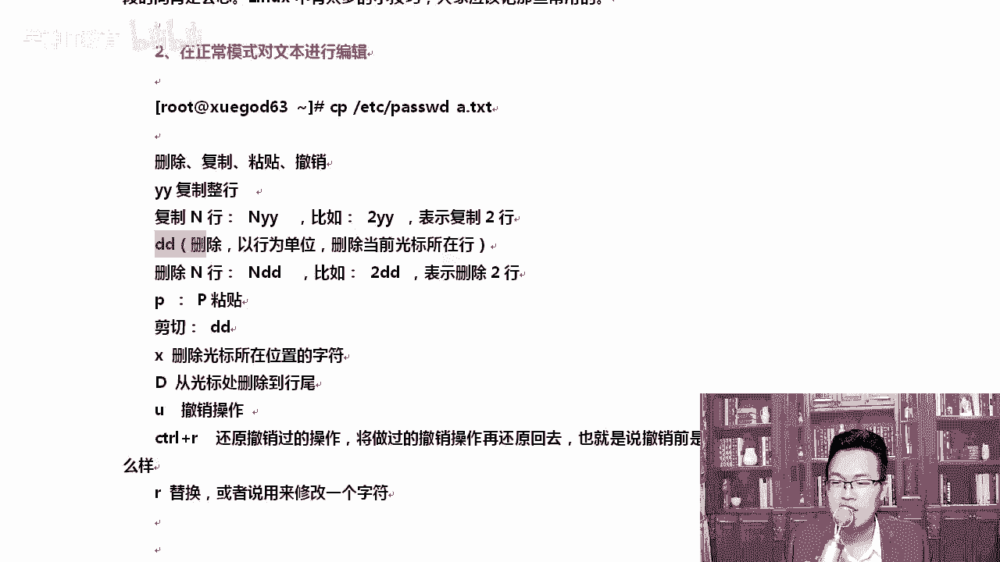

我们先看一下复制啊。YY复制第一行摁下P，那第一行就粘了，再摁下P又占一行。站一下右转一行，那我想复制两行呢。比如说我们在这里我想把这两行复制出来，光标移动到这儿输入2YY。😊，输入完以后呢。

我们在光标移动到这里摁下P，它会在当前这一行下去插入。你看。好不好？写的是不是很清楚啊，demonADM这两行复制下来了。😊，删除的话也一样滴D这就删除了2DD就是删除光标，删除哪两行呢？

它是删除这两行啊。删除了。如果你想粘贴，摁下P就可以了。复制粘贴都会了是吧？告诉我剪切是什么。减轻。

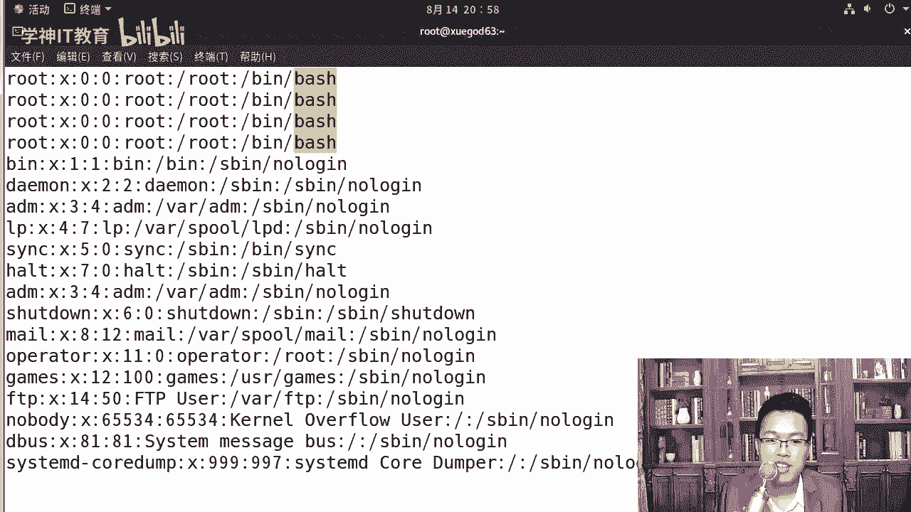

删除滴滴大家已经知道了，剪切呢。我跟大家讲啊，在linux下DD其实也代表减器。啊，你弟弟完的这些内容是吧，都是可以被粘出来的。你看比如mre，我们就是games这一行。😊，DD剪切了。

剪切完了以后往下走，移动一下，摁下P。那你可以看到games这一行已经被粘出来了。看到了吗？好，大家知道一下。然后呢，大写的D代表的是从光标处删到行尾，这全部都在正常模式下去讲的啊。

在这里面摁下大写的D。有时候我想删，我不想我从这往后都想删掉，那就摁下大写的DU的话是车效，挺好用的。ctrorl R是还原。😡，又还原回我删的这个。如果我只想将零替换一下，摁下R摁下3。

这样的话就可以啊，而且按摁完以后，你可以看到这里会有一个标识的。当我摁下R以后，这个标识按下数字替换完了以后，这就没有这个标识了。😊，看到了吗？是是不是你第一次注意这个操作？很多老师用了好多年。

这个R他都没有注意过，这下面有这个标识啊。所以大家一定要用心。我用心讲，你呢用心听，绝对能搞定。说这么多，我们在这里简单的总结一下。A小小写的A小写的O，小写的A，这是你必须会的，他们都是进入是吧。

都可以进入插入模式。然后呢，这个是进入命令行conttrol V可以进入怎么样？在这种。呃，正常模式下conttrol V。看到了吧？conttrorl啊，VV的话就变成了可视块模式。什么意思呢？

正常我们选择的都是一行一行的，你看在它里面可以一块一块的。据真的方式是吧，一块一块去选，看到了吗？好吧，先横向选中，然后呢再往竖。选的过程中。横向先选选中完了以后再往下走。1块一块的啊。

这就是conttrol V。R的话是擦除好吧，然后呢进入以上模式，想推出的时候登按ESC就行了。好，稍后呢我们来聊一下这个可视块模式。

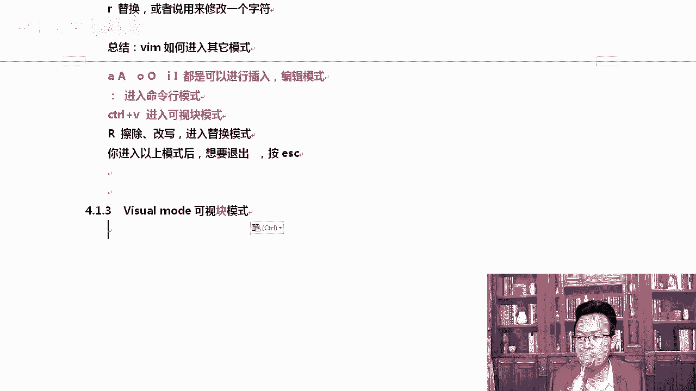