# centos8／Linux／运维／网络运维／RHCE／红帽认证云计算／2020全新独家教程-centos8操作系统从入门到精通 - P18：2-visual模式-命令行模式-自定义vim的技巧 - 学神科技 - BV15V411z7tK

我们一起来看一下这个viso可视块模式，它常用于编程或修改服务器配置文件时，需要进行多行注释。咱们会用到这个viso模式。那么进入viso我一般进行批量删除或者说批量注释。

怎么进在nmal正常模式下摁下ctrl加V即可进入这个编辑模式啊，列编辑模式，也叫可视块模式啊，你可以向上向下移动光标选中的部分就会怎么样，就是啊选选中你需要选中一部分内容。选中部分内容，摁下大写的地。

按下大写D就会删除注释的这个行。

前面的这个符号啊，VMETCSSHSSH。D configurefi这是咱家用到的第一个服务器配置文件，就是远程桌面呃，远程连接的这个服务SSHD服务拿到这上面，比如说我们在这里大家往下移动光标。

看到这儿了吗？port22默认监听的就是22，我想把前面的四个井号取消掉，怎么取消呢？可以这样坑，也就是我想改成什么样水平啊。😊，我来跟大家说一说。

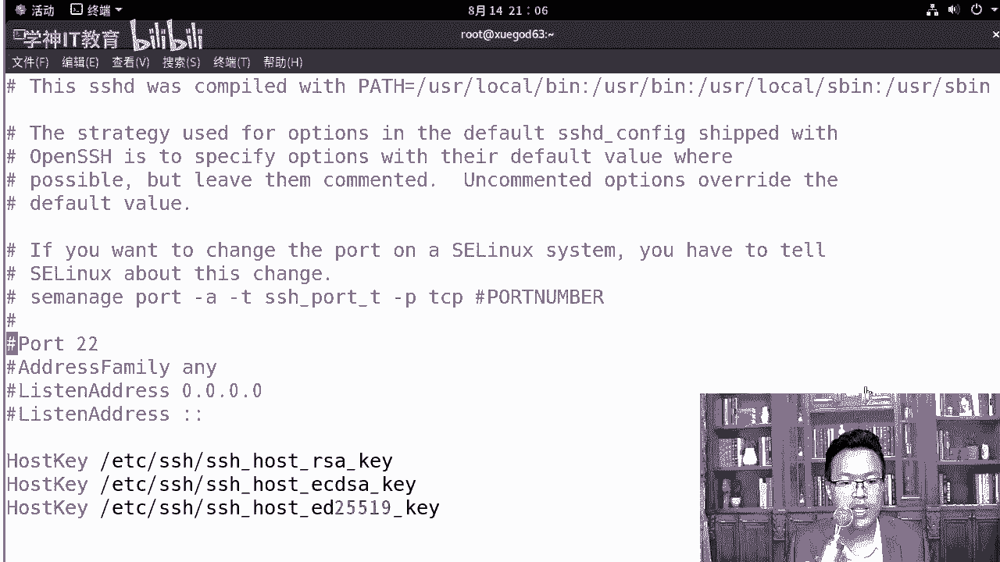

我们去修改的时候，我想把它改成这样的，把前面的井号取消掉。

你可以这样。Control V。在nmal模式下，也就正常模式下，contrl V往下移动光标。好吧，移动多了，你可以往后，比如说移动多了，那可以往后缩一缩。😊，OK然后呢摁下D就行了。好。

这个时候我们选中完了以后，摁下小写的D就可以啊，不用大写的D，小写的D这样就可以删除了。😊，那我想把它再改回来呢。对不对？批量修改模式嘛？我想给他改回来。😊，Hao。

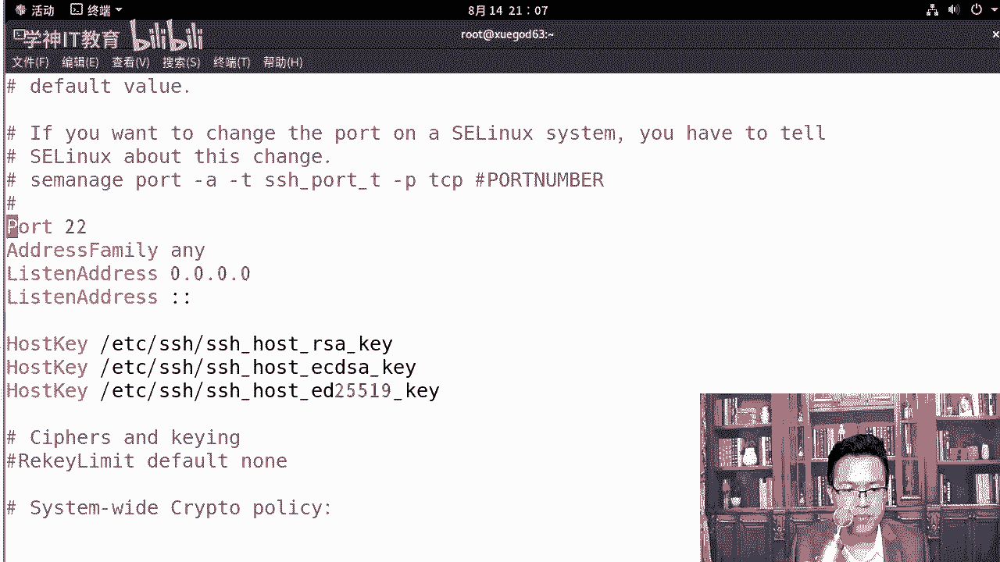

我们可以这样去做这个事情。进入viso这个模式，我需要进行一下批量的修改，修改的时候是这样controrl加V进入列编辑模式，向上向下移动光标，把需要注释和编辑的行的开头选中起来，然后摁下大写的I。

这里不是小写的I是大写的I，再插入注释符，或者你想插入的符号，比如说井号ar符号都可以。然后再摁ESC就会全部注释。

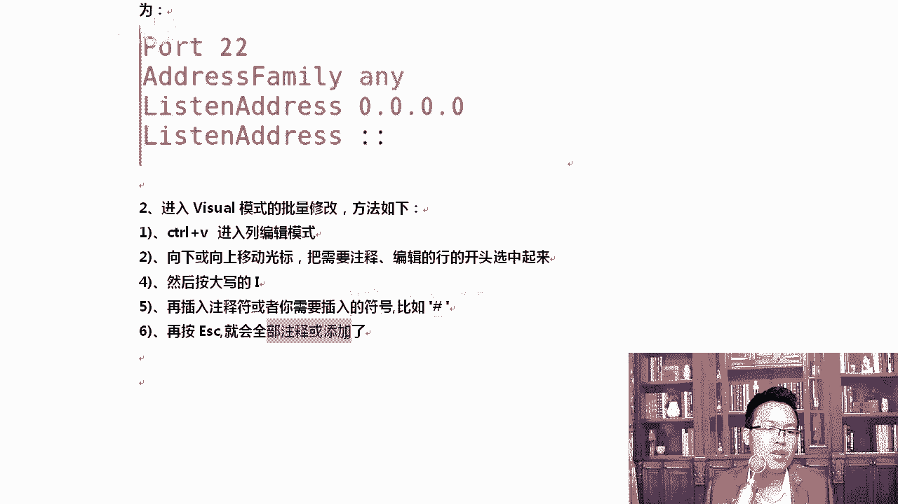

好，会添加你需要的这个符号了，来看一下啊。假如我这个时候想要再给它改回来，那可以这样ctrorl V好不好？选中选中完以后的，这个时候选中完了以后，记住摁下大写的I。😊，好，按下大写的I以后。

它会进入插入模式。这个时候我们只插入一个井号。或者你插入好几个井号也可以，数量不限。然后呢，摁下ENC。奇迹就到了。当你摁完ESC这一块全都注视了。😊，井号在linux通常情况下。

在井号在shall提示符里面就是注释。在我们的配置文件里面也代表的是注释。

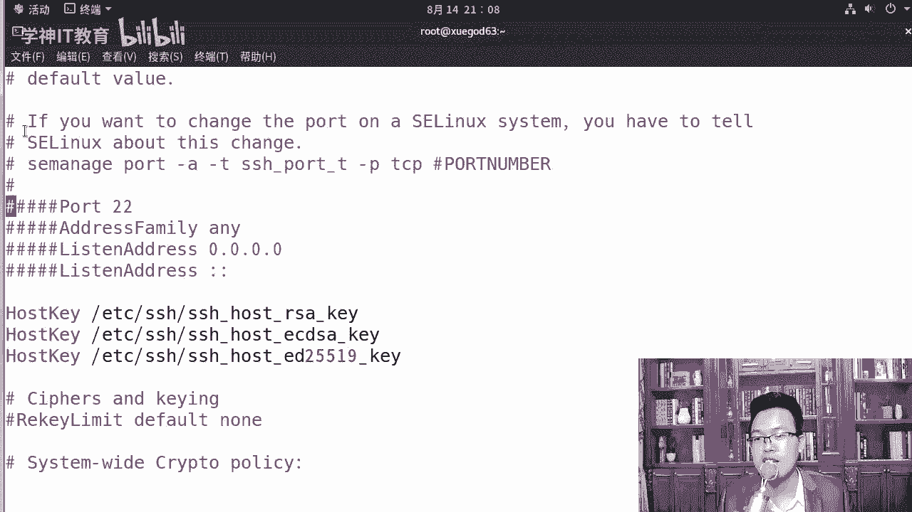

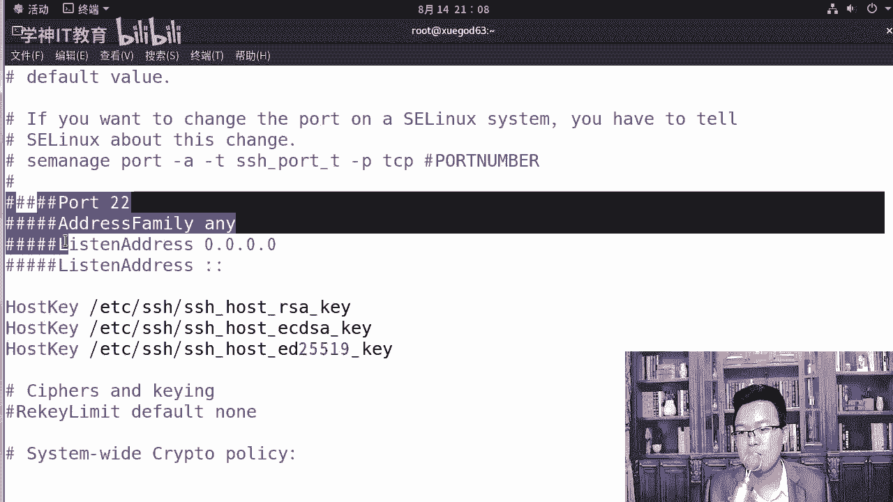

啊，来。清楚了吗？比如。

好，不保存退出啊。这是块模式。最常用的就是这块。我们对这些vi模式control V记住啊，向上向下移动光标选中选中完了以后摁下搭起来，哎，然后插入你的符号，你可以插一个，也可以插好多，什么都可以插。

😊，插完以后com on的烂就可以了。😊。

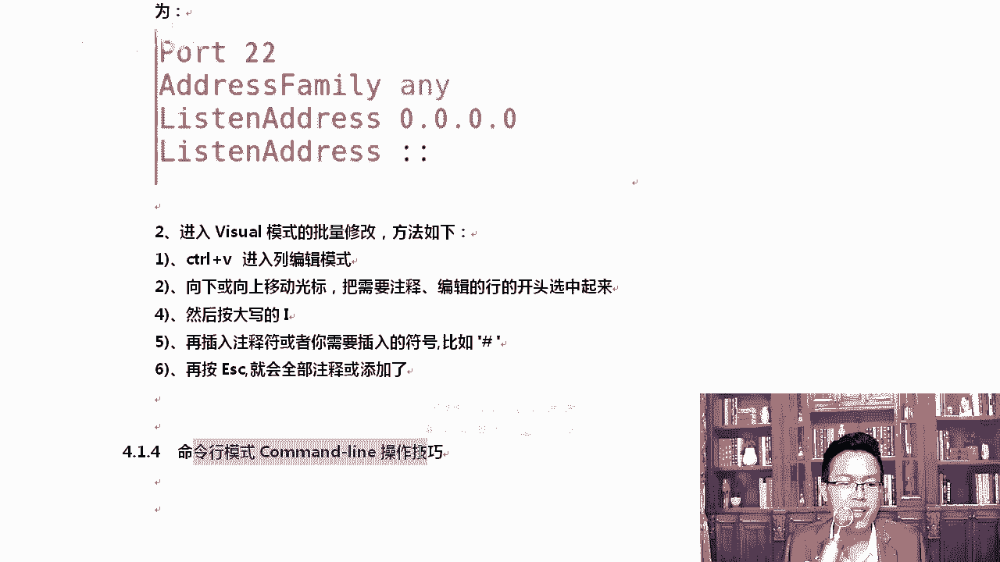

呃，插完以后摁下ESC自动，它按下ESC的时候自动啊，大家别晃啊，因为我记得很，比如说我们在这里ctrl V。😊，删删删删删删删都删完了。是吧删来以后呢，你想给它注释啊或者怎么样的时候。

conttrol V。😊，假如我选了这么多，然后呢。不用说把光标再跑到最前面啊，就在这个时候摁下ESC然后我要插入什么，你写上你的符号，我可以插入一个ar符号。😡，插一串at只摁这时候摁下ENC。

它自动能把后面全都给你加上，看到吗？多玩玩啊。只要保存的时候不退呃，只要退出的时候不保存Q加感叹号叫做不保存退出就可以。

你别把自己的机器给玩坏了。如果你怕自己给玩坏了，那你就。😡，拖怎么样，提前备份一下。准备好了以后，接下来看命令行command line模式。command line是这样的。

命令行com栏是W冒号冒号W是保存的意思。冒号W感叹号是保存强制保存。Q没有进行任何修改退出。如果你修改了，你不想保存了，那可以。😡，这个你看到了吧？你没有进行任何修改的时候，冒号Q才能使。

如果你改了一点点，那你要么保存，要么不保存退出。😡，听楚了吗？WQ是保存WQ。这个是强制保存啊，保存完了没有退出啊。WQ是保存并退出，加个感叹号，这个是强制保存并退出。除此以外。

X也代表保存并退出一加感叹号是复原复恢复到文件打开后没有进行保存呃，没有进行修改时的状态。OK如果修改了很多，不想进行保存，想复原，你就按下这个。其实我一般情况下就喜欢用这个。除此以外。

在正常nomo模式下，你摁下大写ZZ，它也可以保存退出。😊，我们来试一下啊，比如说我们举个例子，W。😊，咱们举个例子。呃，WQ感叹号强制保存退出。我们来说一说这个地方。

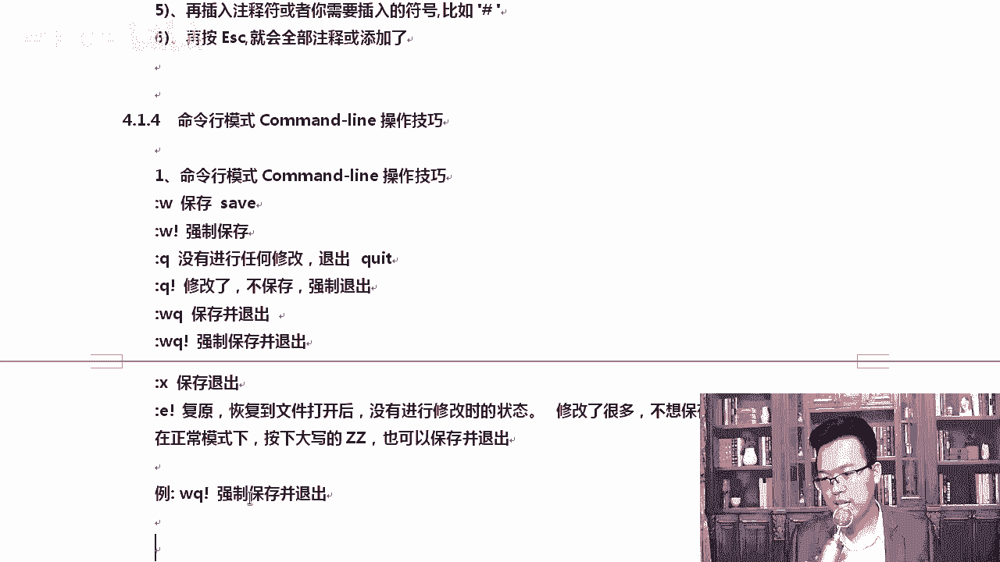

shadow你得整一个没有权限的文件才能看到LLETC下的sdowshadow就恰恰没有权限，看到了吗？普通文件的话，大家可以看到ETC。帕拖少的。正常我们的文件前面都是RW拥有者，至少有RW的权限。

那shadow shadowow是专门存放密码的地方。path是存放用户信息的，它不存密码，清楚了吧？ETC摄头打开。看到了吗？有通密码在哪呢？在这儿。这一段就是咱们的密码啊。对，这一段就是咱们的密码。

我们。修改一下他。那他告诉你正在修改一个只读的文件，没事啊。改一下啊。啊。我，我在想我改成什么样的会会不会有问题。啊，我们我们随便改一下，我们改那个TCPd，我们把数字9删掉，删了以后，WQ是不行的。

看到了吧？😊，因为是只读的，所以你要加感叹号。那WQ感叹号就可以保存存出了。最好就别改了吧，可以啊，改一下也没事。😊，改完以后，你再把那个我忘了这是这边是加了几了，你再给它加上就行了。😊，好。

是应该是个9吧。数字9保存退出，因为我看到前面都是9嘛，479479WQ感叹号保存退出。好，这就可以了。😊，我们有时候也可以调用Y5命令。咱们想调入外部命令的时候，可以这样啊。

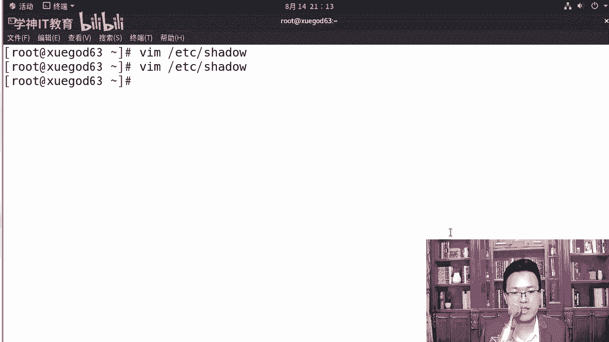

调入外物命令的话，你的命令行可以输就是我们在命令行模式输入加号加命令，可以调入外物命令。比如说我们在编辑文档的时候，我想写入一下当前机器的mac地址。

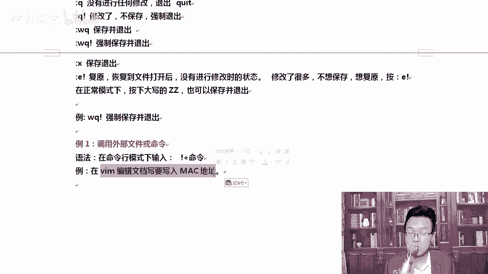

其实如果换以前的我，我就这边先ifcomputer查看一下，ifcomputer看一下。啊，我的net mask地址是多少？然后呢，我的mac地址是多少？对吧我们自己去网上去写一写，就很容易就。😊，呃。

比如我的IP地址是1。63，很容易就能搞得定啊，很容易就能搞得定。😊，那这是我的这个mac地址啊，这是mac地址，这个上是IPV6相关的一些地址啊。好。你想在VI的时候是吧插入。

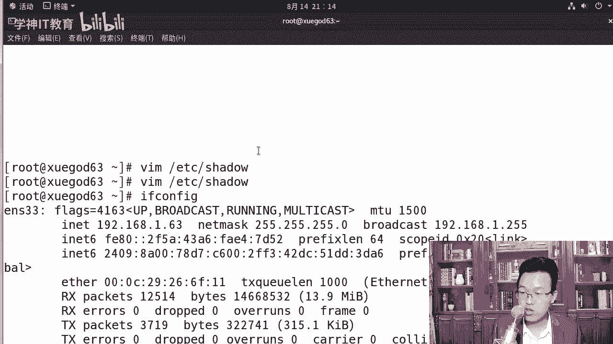

这个时候ETZ我们看一下啊，A点TNT。比如说我们打开A点TNT。我们在这个时候正在改的过程中，我想把mac地址上插入到这一段，怎么做呢？冒号。好吧，输入冒号，然后呢。我们可以。呃。

这样感叹号if configurefi。

回车回原车以后，这就能把所有的把数据给你调出来。比如说我想把这个段复制一下，那你就把这一段复制一下就行了。

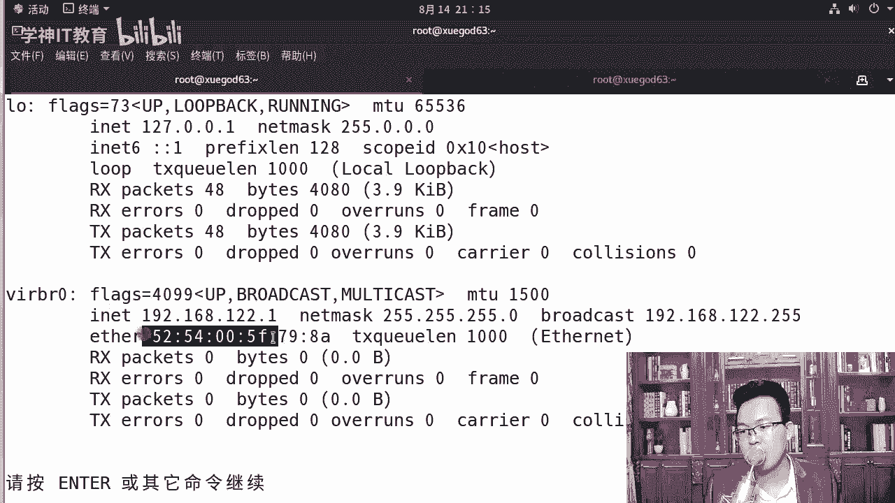

好，按其他命令继续按下回车。没并不影响。然后你把选中的那个粘到这上面。😡，然后呢，保存退出就行。除此以外呢，好，我们就保存推迟。除此以外，还可以这样。我想将另一个文件的内容读到我当前文件里面。

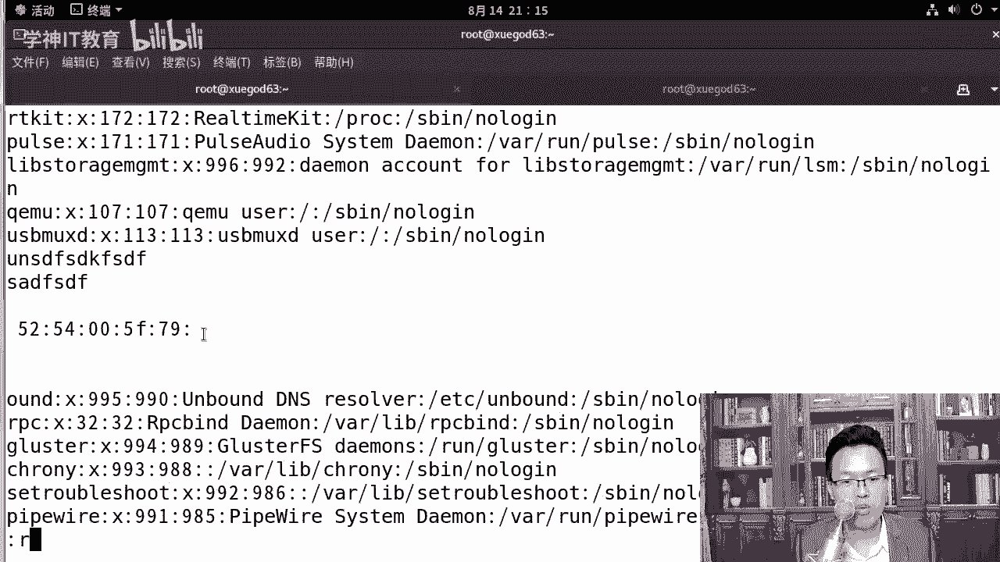

也是可以的啊。比如说我们定位到最后，我在这里我想将另一个文件读一下RETC host。😊。

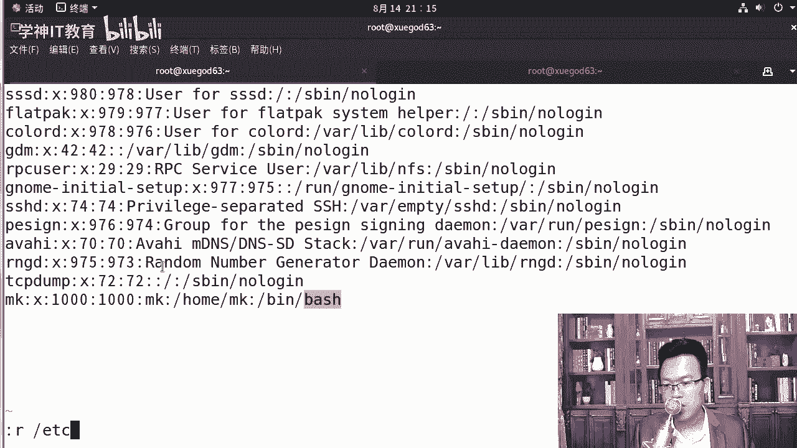

这样我可以将ETC house的内容读到这里面。好，两种写法。这两种呢大家知道一下就行啊。其实我们在工作中用的很少，而且这样写很容易出错。大家发现了没有？读多了读少，你干脆再开一个终端是吧？

从里面复制一下，粘过来更清楚一下。但然你要知道它它是可以这样的，读起在文件中调命令的话，在命令的前面加个感叹号就可以了。也就是感叹号加命令。如果你想读起其他文件。😊，O。R后面跟上文件的路径就可以了。

再来看这个我们来文本进行一下替换。我想替换一下文本中的一些东西。那你可以呃首先是范围格式的话，先写一下范围。如果写的是版分号代表所有的内容S的话是S后面要跟一个分割符，分割符，后面跟旧的内容。

再分割符再跟上新的内容，分割符可以自己定义默认是每一行第一个符合字母替换一下。如果你想当本行中所有都替换，在结尾加个杠G说这么多，大家可能看不懂啊。我这样我先跟大家罗列一下吧。

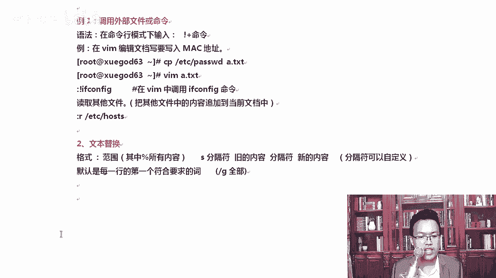

看到。VM好吧，因为这种东西大家不习惯啊。😮，当然这是命令行下的一些操作啊，文本下的一些操作。在命令行下，我们一般就是要么查找，要么就是替换。😊，1到3行。S好不好？S写S开头表示替换。

将并替换成学杠的。啊，我一般习惯于是吧，就后面这个写不写都行啊。😮，替换第一行。到第三行中，第一个并替换成学杠的，我们来看一下。一家啊一盒感叹号恢复到原始状态，替换的时候是这样的。

1到3空格记输入空格啊，你不能说3S吧，这就是不对的啊。linux呀空格还是很讲究的那我将并好吧，将并替换成悬嘎的，我一般会这样去写啊，你不写这个斜杠，它也能替换，看到了吗？只这个地方学挂的。

它也是可以替换的，但一般我还是喜欢。😊，加了斜杠啊。然后呢，你看后面虽然也匹配到了，但后面的病都没被替换。那这个时候怎么办呢？这个时候如果你想将所有的都替换，那可以这样13。S将并替换成学杠的。

后面加个G杠G的话就可以全部替换。OK那有同学你后面为什么没替换呢？因为我的替换范围就是第一行到第三行，所以后面不设计。😊，懂我意思吧？那我接下来我想将从第三行开始往后的。okK或者我只把第三行替换。

那怎么办呢？如果只替换第三行的话，那就是三或者第四行啊，那就4。就你也可以上下翻啊，在这个地方。看到吗？你可以上下翻这些命令的。如果不想写的话。那这样的话，我只把第四行给替换了一下。对吧你你也可以替换。

😊，那如果我想。这样去做这个事情啊。看到你可以替换我们修改A点TNT啊，在文件中随意插入度和。😊，就是度和度这两个是什么意思？一个是。😡，小写的一个是大写的，我们随意插入一下。稍后呢。

我们将这个地方给它做一下这个替换，看看它有没有替换。好吧。另外你也知道忽略大小写这个作用。好，我们要给你演示一下，忽略大家写的一个作用啊。😊，OK我们在这里随便写点东西啊， do。然后呢，大写的度。

小写的度。大写的度。后边再来个大写的度。随便写点东西啊。好。将来我要替换全文替换就是百分号了。好不好？2S开始我要从哪呢？把所有的度替换成悬杠的，然后呢杠G。全都提完了。一共替换了8次共6行。

对吧有时候我看不见这个度了，那你可以。啊，那我得。你看至少大写的度现在是没有被替换的，都被替换的。小写度。因为小写度我现在搜的时候已经搜不到了，看到了吗？😊，好，那我想替换的时候是吧？不区分大小写。

那你可以这样啊，在后面加一个I。正常情况下，我们是区分大号写的，我们要忽略大号写进行替换。好，这次又替换了4次，一共就两行将大写的。那这个时候大写的，你看已经没有大写的。好，除此以外。

当然我们还会给他换个分割服也是可以的啊。刚才我们所使用的都是。😊，斜杠一般斜杠看起来舒服一些，你也可以用百分号的方式或者其他的符号S后面比如说跟个ar符号，我将斜挂的ar替换成do，记得再加个art。

把它封起来，好吧，然后跟上G。这样就全都替换，又替换过来了。大家可以看一下度度是不是又有了。看到了吧？度又有了我们刚才所增加的这些。好。这是查找和替换这个杠可以加，也可以不加啊。😊。

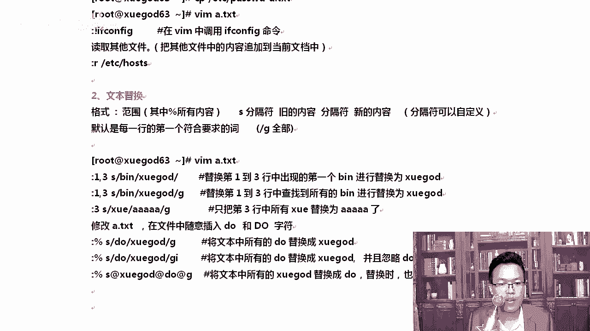

嗯是。说了这么多，我们再来1个VIMVM的话，你也可以自定义一些使用环境。比如说我们想看一下行号了，我们不想有行号或者取消高亮，可以这样去做一些临时的设置。

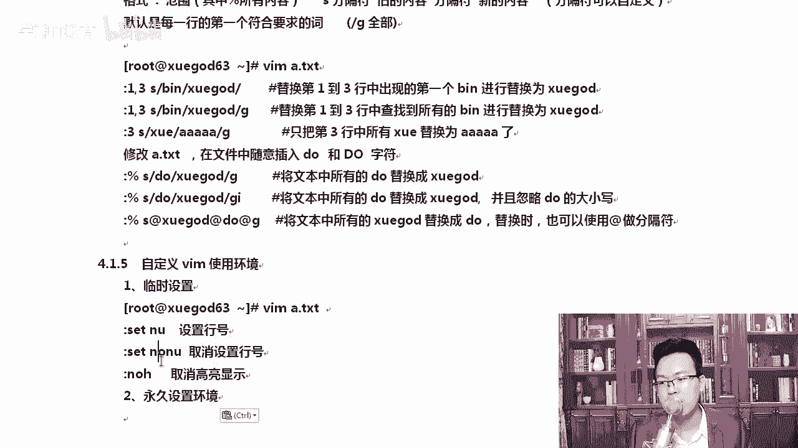

拿我这个来说，我想看一下行号，那就冒号set number，这都是在命令行模式下做的这个操作。有了这个行号就好了。那当然这个行号它只是前面有个行号啊，它不会什么存到我们的文件里面的。😊。

而且这种东西一旦你不保存退出了以后。下次我们再打开。

大家看就没有了，这种都是临时的去设置。我想取消呢。啊，取消取消就是s number是开好吧，不想开的话，那怎么s number是开行号。😊，如果我不想开的话。

就no number set no number。这样就取消了，很好。有行号有什么好处呢？就是后期。呃，我们在显示修改配置文件的时候，我们快速去定位。我要改第五行到第六行的什么什么内容会方便很多。

如果你想这是自定义VIM的环境，如果咱们想永久性的搞一下怎么办？显然你是不是得永久设置环境面量，你得给我存一下，存到哪呢？VIM你可以在VMETC下去创建，这个会影响所有的用户。

如果你只是想自己啊自己定制一下。比如说我的所有的VIM打开的时候都要有这个行号功能，那你可以波浪号点VIMRC，这样的话，在加目录下就可以去创建。😊。

自己搞自己的。你们喜欢自己搞自己的还是。所有的都有，我觉得自己搞自己的会好一些。你别改别人的是吧？😡，那做的时候可以这样ecle。翻译号。set number将它。追加到我是root。

我就用root了啊，你也习惯如果你习惯用这种型号也行，拨浪号波浪号杠VMRC。这样也可以。好吧，这个东西其实就是我们的你看。VM。呃，它其实就是如的下位点儿RC点儿是代表隐藏文件啊。那你看。

有了这个东西，下次你再打开的时候都有行号了。无论我打开哪个文件。😊，都有很号。当然，如果我们s no number呢，那当然还是没有没有的话，退出退出再打开还是有的。关也是临时关的。Hao。

那我想打开这又这一招大家又学到手了是吧？这个东西怎么能学会呢？就靠你自己多练习，没的别没有别的方儿。😡。

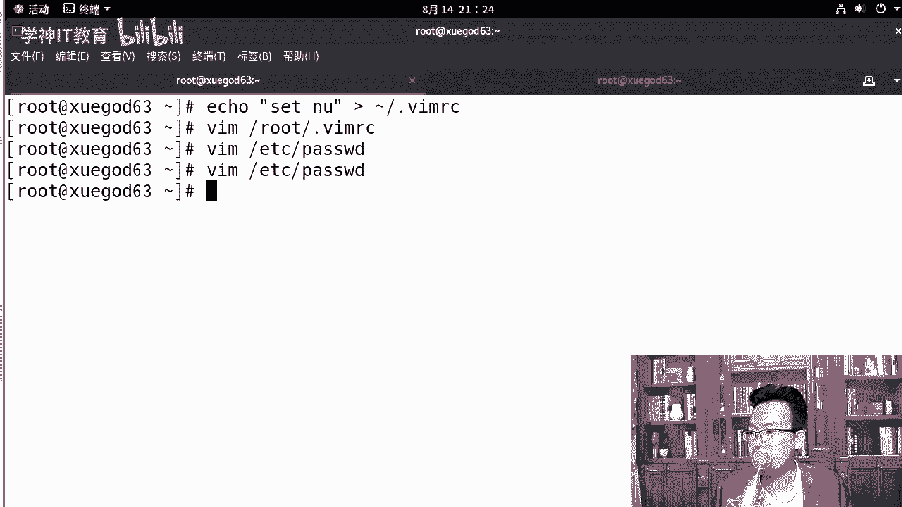

只有大家多愿想。再往下我们来看一下，你想打开多个文件怎么办？比如说我想是吧上下的方式打开两个文档。一上一下或者一左一右。

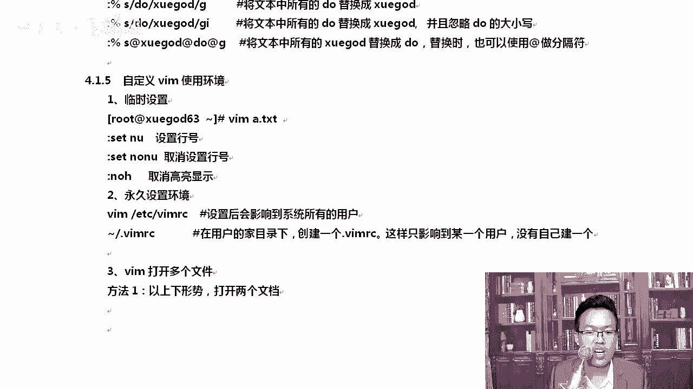

那我们可以这样去做这个事情。V。狗。ETC passwordword和什么ETC host。

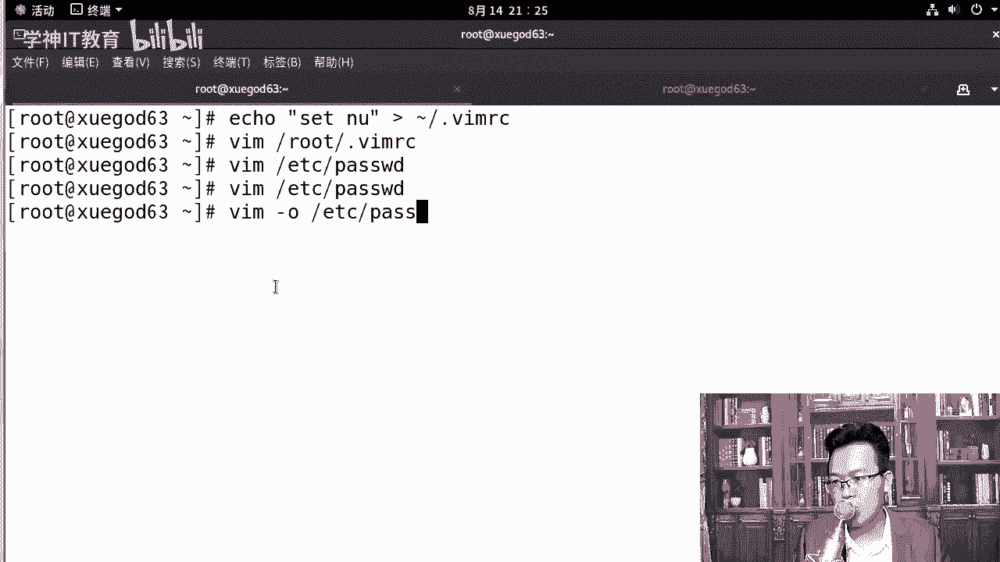

看到了吧？这样的话是上下。有通我光标怎么才能出来呢？😡，想问这个事吗？上下我我想切，一会我告诉你啊。这是上下，我其实一般情况下喜欢左右啊。上下也可以。EDC password是上面的，这个是下面的。

退出的时候怎么退呢？可以Q。😊，如果你摁下Q直接退出，只退一个，你得退出两次。如果你想一下都退掉，你就输入冒号QA这样一下都退出了。

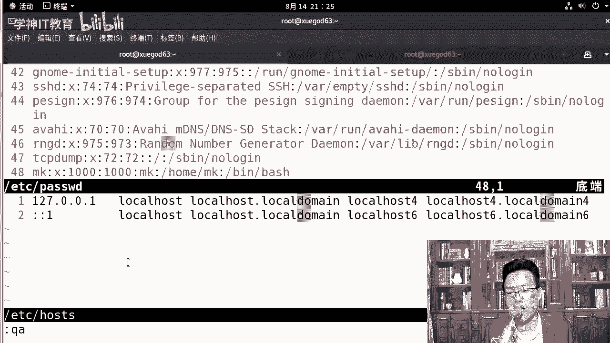

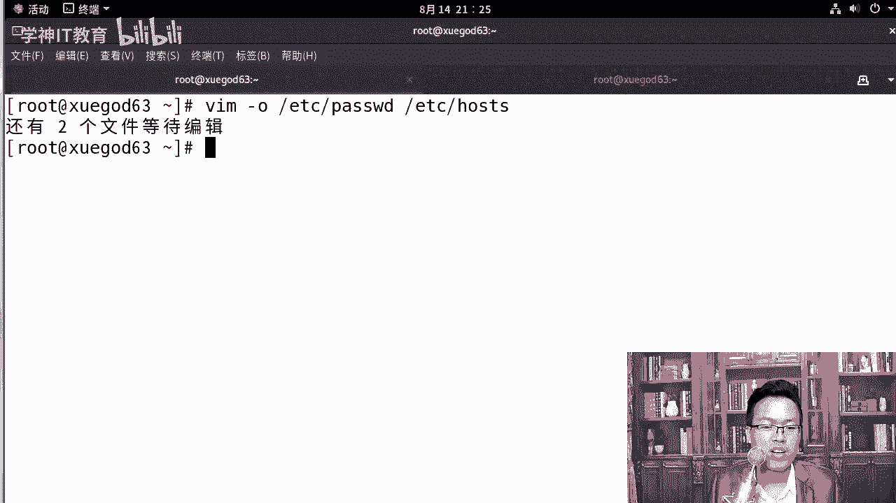

这叫上下打开两个文档，其实主要是加了一个杠O参数而已。高就可以上下打开。那如果我不想上下打开，我想左右方式呢？左右方式的话是大写的O。

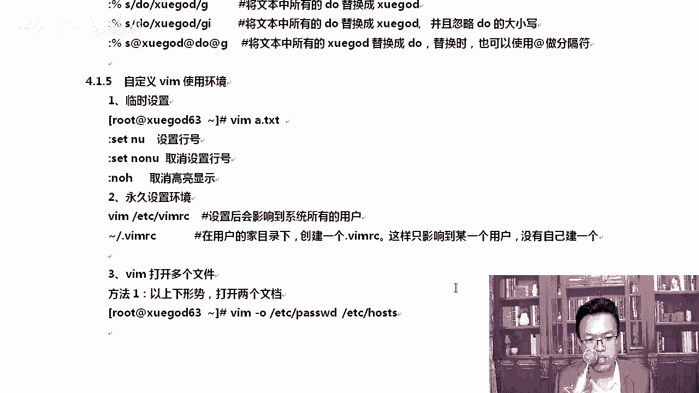

那。或者你这样ETC。

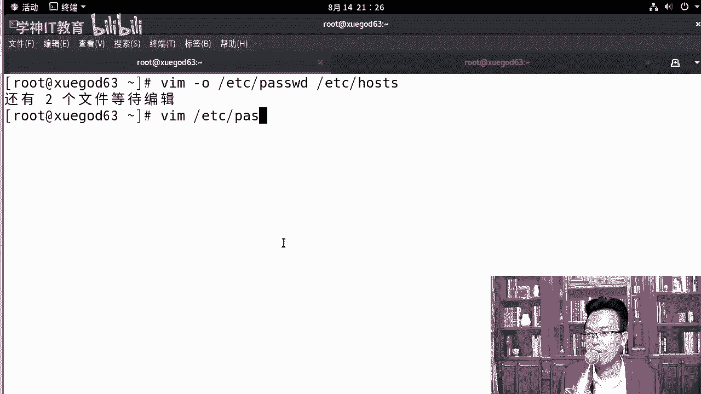

pass word跟上ETC house。这种不行啊，这种一个一个退出。

如果你不加参数，你看到啊。他是打开一个又一个把那个推了。还有一个。推两次。好吧。还得加上大写的O或者小写的O啊。大写的O的话就是左右了。OK那你的光标，如果你直接有通说，我这样能跳到这块，跳不到。😡。

怎么才能跳到呢？怎么才能将光标跳到另一个文档，按下crl加WW。按两下cttrolWW就行了。清楚了吧？再按下ctrolWW就又切换到这个屏上了。挺有用的啊，这块有什么用的？就假如我们要有两个文件。

我们做一下对比的时候呃，我们会经常用。比如说ETCpa和A点TIT两个都是passor的那这个时候。😊。

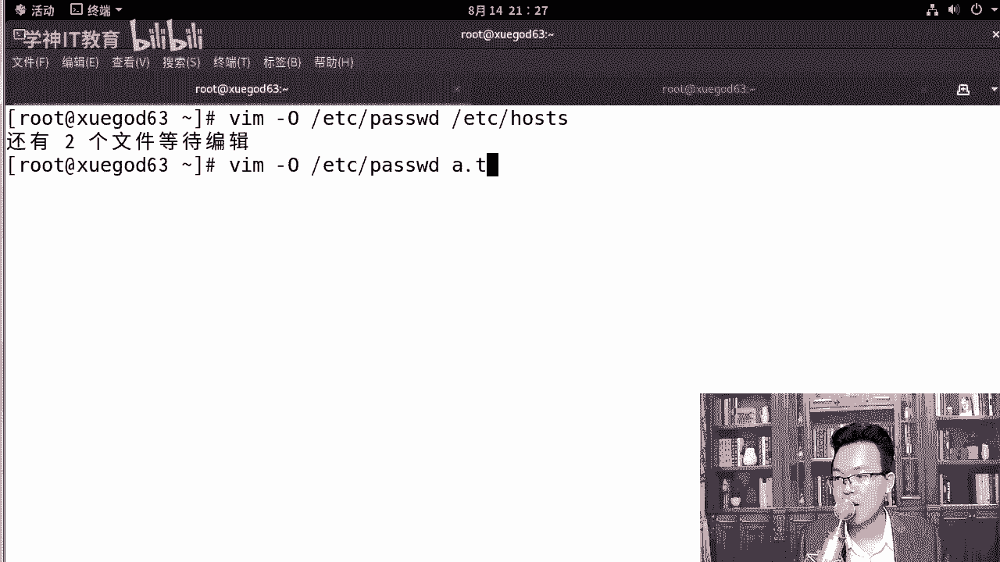

那你就要对比对比了啊。对不对？那我我想对比一下，比如说这块跟这块是不是不一样啊，看钱。哎，这个方法教给大家。controrl将WW在两个文档之间进行切换，按下大写的大写的O式，左右分屏。

小写的O是上下分屏。还有什么好处吗？说真的，这个我还真挺少这样去用，其实我更喜欢这怎么用呢？😡。

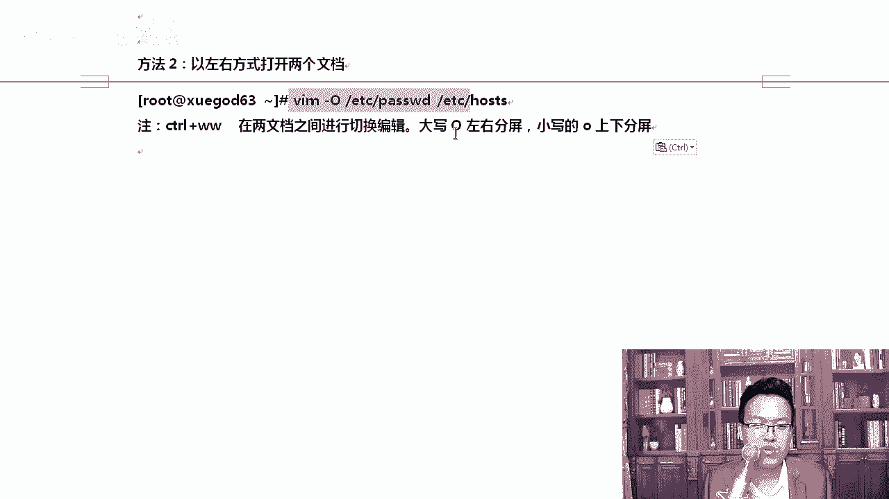

我更喜欢这样啊，老司机再教你一招好不好？既然你要对比文件，我更喜欢这样ETC。Password。写个密码密码点TT，然后咱们给它里面追加点东西，好不好？追加完了，我想知道两个文件，你可以这样。

首先对比文件的时候，你可以。😊，pas word和密码这样去对比。那这样的话different的可以去对比，它能看出来你这块有什么不一样。首先AA这块是不一样的啊。

就是多了就多了个AA这样看你不知道到底哪个文件多了，哪个文件少。是不是你可以这样呢，你可以这样去看。VM different。我挺喜欢用这个方法。

这样的话就能一下子定位到。因为哪一行不一样，它会给你定位出来，看到吗？哦，你这个地方不一样。😡，对我个人喜欢用这个啊，而且这个退出的时候也是一样的。你看光标你想从这移挪过去。

contrlWW同样也是这样去切。

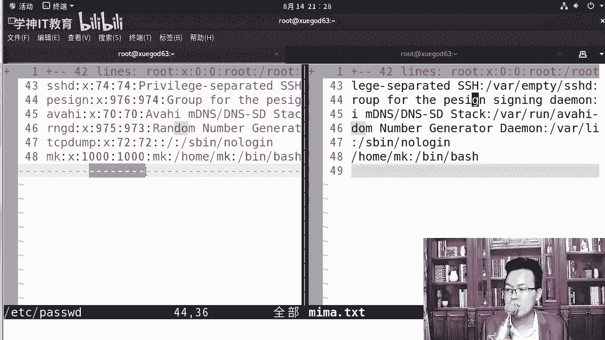

其实我更喜欢用这个VMD的更棒一些。前面这两种是吧，大家知道一下就行啊。大写的OVM differentffer，这个你必须得自己去记住它。V am different。那除此以外呢。

实际上咱们学时呃还有很多linux的编辑器，什么呃nano编辑器呢immax啊imax编辑器呢Gno editit编辑器啦，比如说Gedit。

lindowux上有很多编辑机，就像windows一样，什么有wordWPSTST记设本。😊。

是吧很多。这个就有点像记事本的这种感觉了啊，点一下保存就行了，它会让你。选个路径好，我就不保存了啊。

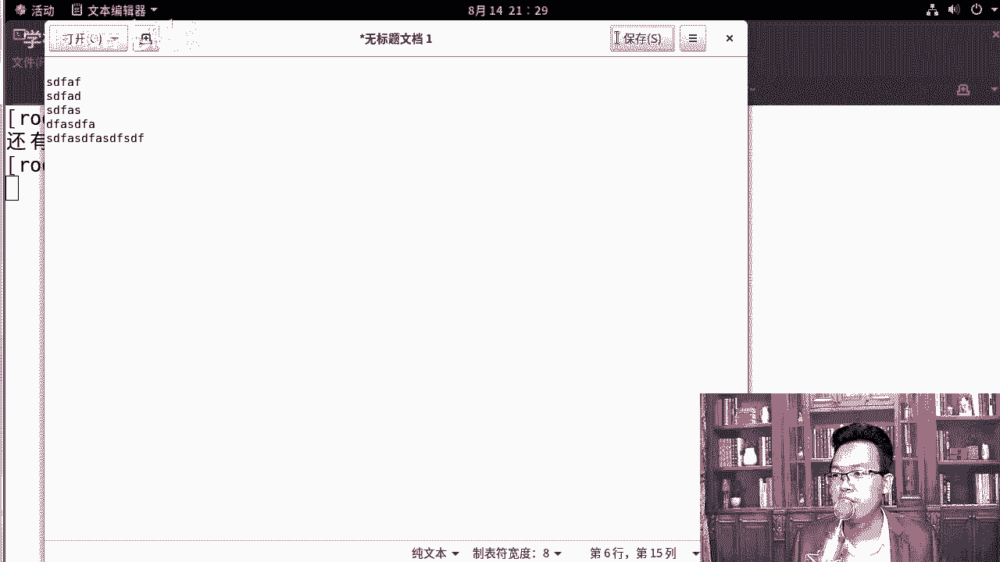

这个东西只有在怎么样不保存而退出啊。

这些东西大家知道一下就行，最好的你就把VM用熟了，用透了就行。好，稍后我们分享一些案例，先到这里。

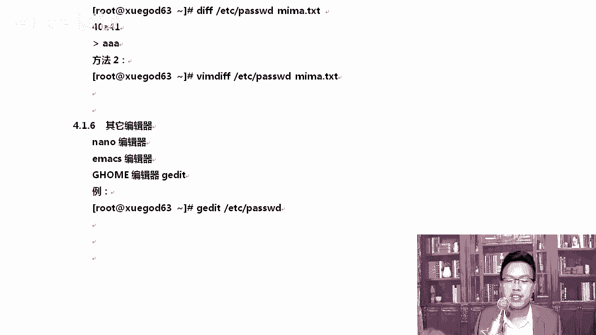