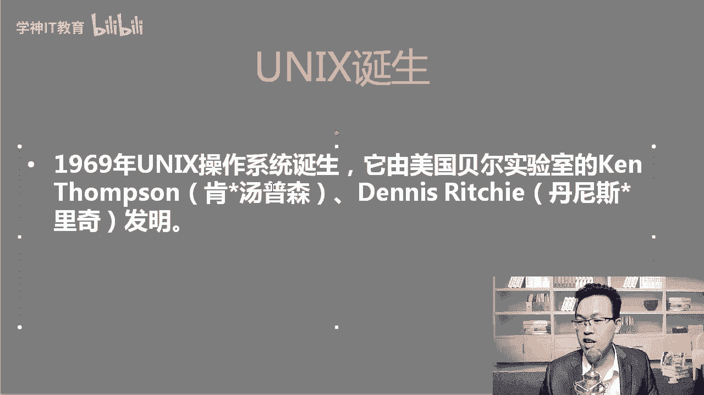
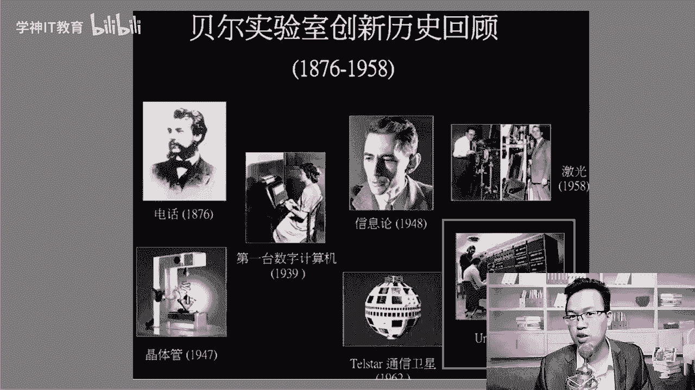
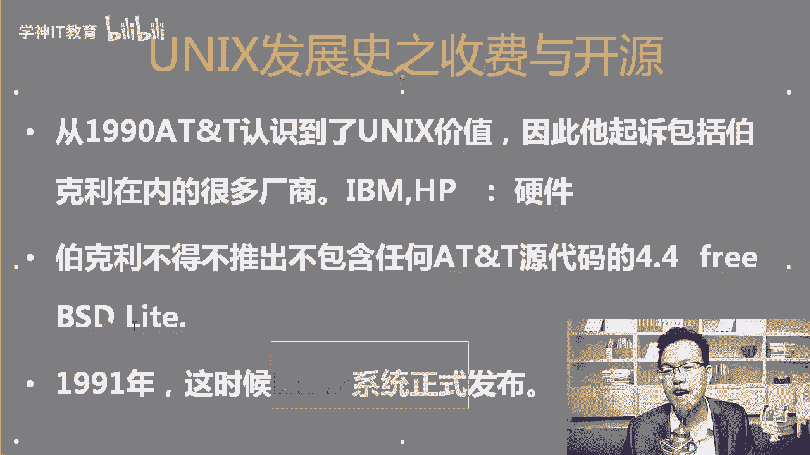
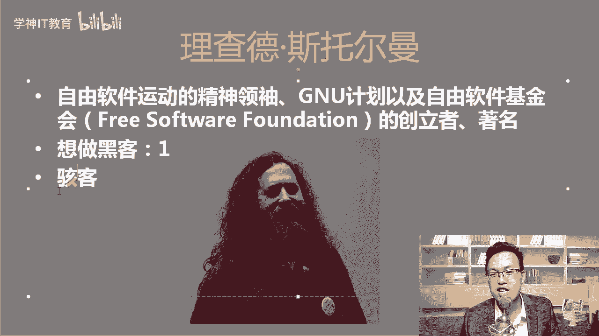
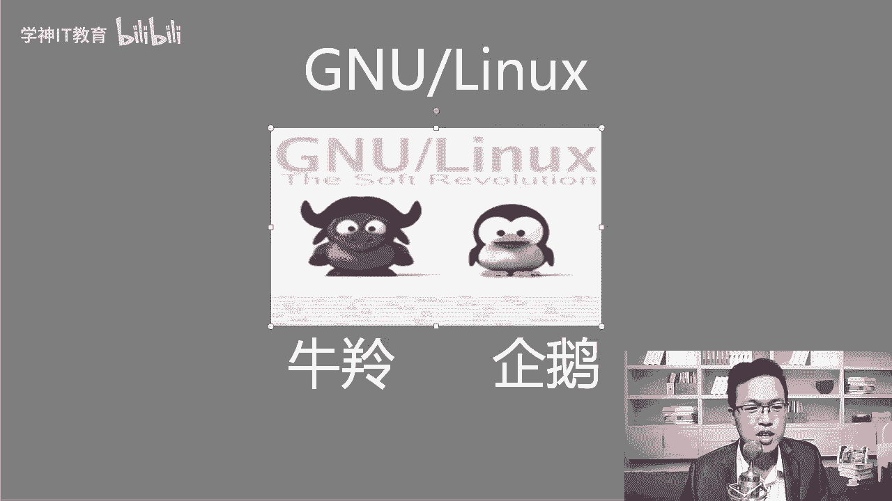
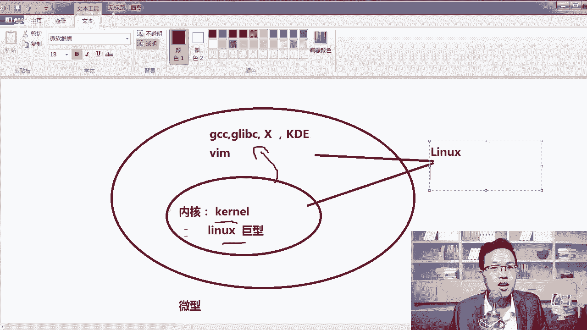
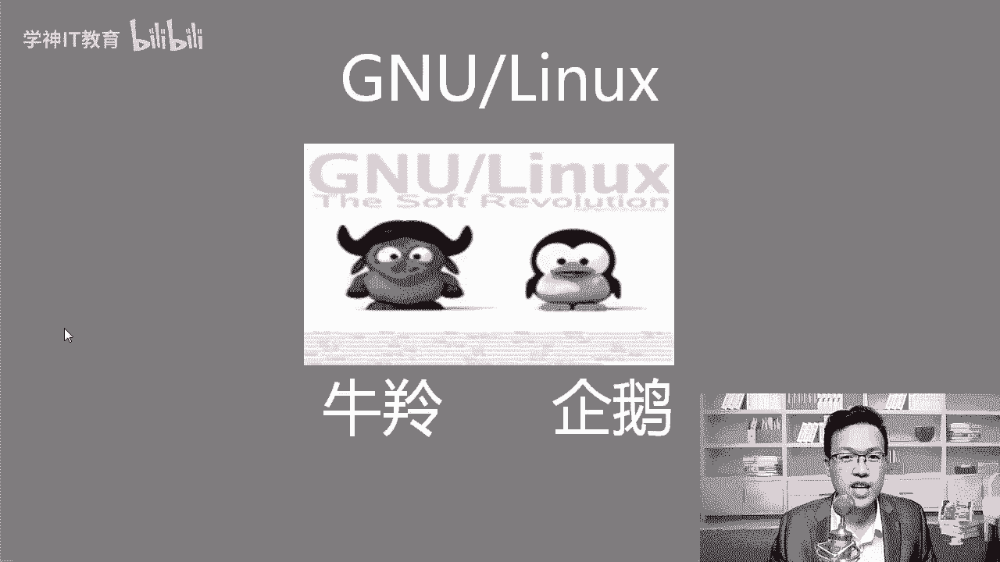

# centos8／Linux／运维／网络运维／RHCE／红帽认证云计算／2020全新独家教程-centos8操作系统从入门到精通 - P1：1-Linux发展史 - 学神科技 - BV15V411z7tK

大家好，我是讲师MK，欢迎你来听我的课程。从今天开始，MK老师要跟大家分享一些关于linux云计算的相关内容。那么在开始讲linux之前，我们要对linux的发展史。

咱们有一个清楚的了解所以首先呢MK老师先给大家介绍一下什么是unix啊，因为linux的诞生还是跟unux有很大的关系的，当然是先有了unix系统啊，ununix系用它是69年的时候诞生的啊。

69年的时候，它是由美国贝尔实验室。这个实验室是非常非常的有名啊。那么主要的两个作者是肯汤姆森和丹尼斯里奇，我们来看一下两位大神，好不好？以及了解一下贝尔实验室。😊。

大家可以看一下贝尔实验室啊，那当然现在贝尔实验室可能没有那么出名了。其实在以前贝尔实验室是非常非常出名的啊，那你可以看到什么第一台电话，第一个晶晶体管，第一台数字计算机，还有卫信啊，卫星是吧？

包括我们的操作系统都是诞生于贝尔实验室。那个时候诺贝尔啊诺贝尔奖里面很多物理方面的。😊。

都是什么啊？都是贝尔实验室这一块获得的奖项。我们来看一下肯汤姆森和丹尼丹尼斯里奇两位大神啊，在国外这些大神是吧，几乎都是胡子挺长的，是吧？😊，啊，那我们来中国人可能很少有留胡须这个习惯是吧？

在古代的时候有啊，那这两个大神除了他们去做了unix系统以外，还有一件事也很厉害。大家知道什么吗？就是这个C语元C语元，你们听说过吗？C元。😮，C语言对，1972年的时候，C语元诞生了啊，那诞生了以后。

unix又用C语元重新写了一遍。有同学我已经写完操作系统，为什么又重新写一遍？因为unix一开始的时候，那个时候还没有C语言，那个时候更多的使用汇编语言，而汇编这种语言，它跟硬件是息息相关的啊。

举一个大家能听懂的例子啊？比如说AMD和CPU呃，和英特尔AMD和英特尔这两个都是做什么？做CPU的。😊，如果啊如果就是它跟硬件是习惯了，你的汇编语言是吧？在这个硬件的CPU上能跑。

不见得到另1个CPU上也能跑。😡，明白了吧？所以这个时候兼容性就非常的差啊，大家可能体会不到，因为大家现在用的windows系统已经兼容性非常强了是吧？无论我们玩什么游戏都可以，所以呢这怎么办呢？

那哥俩说一下，我们重新写面语言吧，这就是大神的什么？对，这就是大神的啊，人生是吧？没有语言，我给你造一个语言，没有系统，我给你造一个系统，所以我想跟大家说一，就是你现在学lininux。😊，太轻松了啊。

大家很多人看到lindows觉得哇都是命令有点难。我告诉你太简单了啊。你想想这些大神从无到有的把操作系统造出来，造出来以后，又自己写了一门操作语言。😡，好，你看那个差距。

所以你应该从现在开始一定要对自己有信心，你一定能学会lininux的，好不好？因为你只是用一用他写的那个工具而已，好不好？那C语元是吧？诞生了，他拿C元重新改写了一下。

因为C语元其实C语元其实是跨平台的，知道吧？大家知道java是跨平台的。如果你拿标准的C写出来的东西，呃，随便编译好，windows下编译了能运行linux下编译了也一样可以运行啊，只要标准的C是吧。

他们在这两个平台上都是可以的。好，那么诞生完了以后，ix还有一段发展史，我们成为百家争鸣，什么意思呢？你想想咱哥俩开发了个QQ，就你会用，就我跟是吧？马化腾马总会用。😊，就我俩天天QQ上聊一聊。

那QQ市值能那么大吗？肯定不行。所以呢哥俩想了想，我们得让所有人都能用上这个操作系统。好，所以我跟大家说，其实开源也是一个很好的什么呀推广手段啊，就像现在华为是华为有自己的鸿蒙操作系统。大家知道这个吗？

对，红鸿蒙操作系统，那也是要开源一下啊，开源以后，包括安卓手机是吧？安卓系统也是要开源，开源了以后全世界所有人都可以用啊，那个时候安卓没有就没有安卓的时候，那个时候我们说塞班是吧？然后呢。

苹果的那个iphone那个IOS系统啊，那都是数一数二的。你看安卓系统一开源以后，全世界都在用。😊，啊，我相信红华为是吧，那个鸿蒙系统如果啊开源了以后，随着是吧，做的这个技术越来越强悍。

也是可以占有一席之地的啊。所以开源其实是很好的推广手段啊。😊，unux开源了，开源以后呢，所有人就都可以用，好吧。OK其中最著名的有一个版本叫做加州啊，加州大学博克利伯克利分校OK这个是BSD系统啊。

现在叫free BSD看到了吧？free BSD的这个吉祥物就是linux吉祥物是一个企鹅。那freeBSD是一个小恶魔，恶魔手里拿的是个什么三叉戟是吧？就是波塞东海神波塞东手里拿那个三叉戟一样。😊。

OK那这是伯利大学，我给大家找了一张呃，他的学校的门口，大家可以看到这种门口确实挺干净的，是吧？😊，很安静啊，像什么像一个搞学学习的地方是吧？有机会大家到了国外，像这些知名的计算机学校是吧。

大家可以去参观参观。就像大家来北京的时候，你应该去清华，你应该去北大是吧？光顾一下啊，我觉得这挺好的啊，感受一下这个人文气息。😊，好，我们知道了这些，那后面又怎么了，所有人都能用了什么？

都可以用unix系统，包括谁呢？这里面所有人包括了IBM，包括了惠普，包括了散啊散公司。你看在这里推广了一段时间以后，从什么时候呢？从73年开始开源开源到90年的时候，AT andT就是朗讯公司。

他他认识到了unix价值，认识到什么价值了。😡，值钱为什么呢？你看你想想惠普和IBM他们卖那种小型机unix系统，它是运行在小型机，还有大型机上的啊。其实真正的比如说你的笔记本电脑，我的笔记本电脑上。

我们去装这个unix系统可能还装不起来，能理解了吧？😊，对他就一你想想他就认识到了它的价值，1个IDM的服务器。😡，比如说IIBM的大型机Z13Z14啊，一台机器都卖好几百万。😡，能理解了吧？啊。

都卖好几百万最高配的是吧，你可能是吧？有钱你都买不上，人家都不卖给你啊，美国做这个技术封锁。所以这个时候IBM和惠普，包括三公司啊，他们卖硬件的这些公司上面全都跑的unicix系统。

他们卖一个操作卖一台服务器，比如说挣了啊100万。😡，结果呢，结果上面跑的unix系统，朗讯公司一分钱没挣，怎么样？朗讯公司说不行了，你们得给我点版权费。所以呢所以他就起诉了呃。

包括伯克利在内的很多厂商。那IBM和惠普是吧，他们怎么样？😊，他们没啥啊，反正我挣了那么多钱是吧？就给你交点版权费，这也很正常啊。国外对我也希望大家能多支持一下正版啊，那他就交了一些版权费。

但是伯克利不行，伯克利他得推出不包含任何ATM啊，不包含什么朗讯任何原代码的东西。那个时候开源的协议，还没有怎么样。😊，对，还没有那么的明确，好不好？还没有那么的明确。

所以这个时候他们要重新操写一个操作系统，重新写一个操作系统其实也并不容易。大家说是吧？所以这个时候呢呃一直到91年90年起诉了91年这个时候，咱们今天的主角就出来了，谁linux。😊，啊。

你想想大家都不能用unux啊，但是这个操作系统这个技术还必须得发展发扬光大。所以这个时候我们希望有一个技术能够很好的给予支撑。那正好lininux就诞生了，linux它能诞生，有赖于两个人，谁呢？😊。

最主要的两个人啊，当然离不开我们开元社区所有人的社要贡献。第一个是理查德斯托尔曼，理查德斯托尔曼他是自由软件啊，运动的这个精神领域，还有GNU计划的创始人。😊，GNU计划的这个创立者，也是著名的黑客。

你想做黑客吗？想不想想的话敲个一。对，想来想敲个一啊，可以啊。在另外说一下啊，在国内是吧，一说比如说MK我是一个黑客大佬是吧？因为我也讲渗透安全的课程啊，有机会的话，大家也可以听听我的渗透安全课。

好不好？😊，啊，一说你是个黑客，你就是个你就是个坏蛋，是吧？😡，啊，在国外不是黑客的意思，在国外就跟中国的极客一样，是说你的技术很牛逼，知道吧？啊，真正干坏事的，我们叫hi客 hike客。😊。

好不好啊，所以说在国外啊到国内其实也行啊，其实国内说你是个黑客是吧？大家现在好像也没觉得你多坏是吧？也是对你适合大拇指啊，苍老师的照片能给我是吧啊渗透一下，能不能？😊，啊，对，看到谁。

我我看很多同学给我留言说，老师我的QQ号能对方的QQ号能给我盗一下吗？😊，啊，再不行就是。😊，啊，老师，我们在菲律宾呢是吧？国外的有一个什么福彩网站是吧？澳门皇家赌场啊，美女发牌啊。

能不能给我报一下账号密码。我告诉大家，这个事情你去问别人，别人就是能到也不能跟你说到，理解了吧？😊，好吧，所以说大家一定要自己把技术学好啊，就到完以后，你不确定那个数据是的有效性。😊，啊。

还是要自己学好一门本领啊，然后把自己的服务器是吧维护好，行不行？😊，那他创建的这个GNU组织，它是什么呢？他的目标就是造一个完全自由的操作系统。那GNU是什么？GNU意思是说GNU is not什么呀？

unix说白了直面翻译过来就是我们不是unix。😡，这意思是什么呢？其实有多种意思啊？第一个就是直面上的意思。我们这个linux就是linux是吧？我们做这个系统，我们不是跟你们unix一样。

还有一个含义是什么呢？就是说我们GNU做的这个系统是真正的完全自由的操作系统啊，不会怎么样，不会像unix一开始说的是免费是开源好不好？一开始说的是开源，大家谁都可以用。过了一段时间说是不能用了啊。

不是这个意思，好吧，其实也是对unix的一种。😊，呃，小小的一个嘲讽吧，好不好？反正一句话我们造的这个操作系统不会像unix那样，有一天会闭园，你们可以放心的去用。😊，明白了吧？

这个free这里指的是自由啊。好吧，开源其实我并不反对开源收费啊，其实开源收费也挺好的啊。谷歌的安卓系统是吧，还有一些版权的怎么样，深度定制的时候，还有一些版权的费用呢，是吧？你像华为就花了好多钱是吧？

卖了谷歌最底层的一些开发啊，一些技术。😊，对吧。所以但是呢授权一旦结束了以后，谷歌说华为你不能用我安卓的系统了，那一样是没戏了。😡，对吧。所以大家要知道啊，就是收一些费用也很正常。

这样才能保证这个技术是吧？能够长期延续下去啊。但是这样码我可以给你开源，好不好？那么当然瑞查德大家一说到大佬好像都觉得大佬已经去世了，是吧？大佬没有去世啊，那瑞查德你看05年的时候曾经来过北京啊。

那时候在候机厅的时候等待的时候，你大家可以看到了什么。😊，啊。你有没有看到脖子上挂了一根绳，拿着一个笔记本电脑在干嘛？不是刷抖音，也不是刷微博是吧？在敲代码，所以这就是大脑，好不好？

让我们一起向大佬致敬。😡，我相信有一天你也能天天怎么样，脖子上挂一个本去敲着你的渗透代码，敲着你的linux命令。😡，你也成为大脑不远了。啊，当然你离什么呀？你离上热热门也不远了啊。

每天我去挤地铁的时候是吧，脖子上跨一下是吧，跨个电脑，然后在那打字。😡，20啊这一年最佳最热门的是吧，程序员非你莫属。行不行？好，我们往下啊，就是一句话，就是真正的大佬确实是这样。

他付出的确实比我们多啊。😊，啊，所以大家在后期学习的过程中说，老师我觉得这个有点枯燥，我学不进去啊。😊，啊，你看看今天我讲的这个视频，把理查德斯托曼这张照片是摆到你的床头。你跟大牛差的不仅仅是技术。

还有努力的程度。行不行？因为搞IT这一块。说真的，我们搞IT挣个一万，挣个2万是很轻松的，跟天赋一点关系也没有。跟你是不是大专学历，是不是本科学历，是不是计算机专业也没有任何关系。听楚了吧。

就跟你努力的程度有关系，你比别人更努力了，你就能超过他，明白了吧？😡，好。Yes。那么再一个就是林纳夫林纳斯干了一件什么事呢？啊，林达斯做了一个内核可5点ORG啊，现在内核已经4。7或者说5。2了。

更新的还是挺快的。其实MK我们当年用lininux的时候，更多的内核都是2。6点多。你去看那个s特S5s透 S6啊，很多情况下都是2点多2点多，后来到期变成3点多，然后再往下是4点多啊。

包括我们现在s特S8，然后版本越来越高。原来那个还挺老的啊，这些网站科弄点ORG大家要自己打开一下。😊，啊，要自己打开一下啊，你要看一下，那么有内核了，看到了吗？Gin u linux是吧？

一个吉祥物是企鹅，一个是牛铃，他哥俩干了一间，有了这两哥俩是吧，我们的系统就算是真正的什么呀？😊。

对，我们的系统就算是真正的齐活了。我们来换一张图给大家看一下，好不好？大家可以看一下啊，就是什么意思呢？😊，金融组织说我要造一个操作系统，大家知道造一个操作系统容易吗？不容易吧。😡，对吧。

GCC语言编译器是吧，包括我们的G比如G left C这是各种C语言标准的库。好吧，包括我们的X window的桌面。😊，好吧，桌面了，或者KDE的桌面，对吧？

我们的这些图形界面甚至里面的VIM的一些工具，对吧？等等这些东西这些东西都好说，但是。😊，当时怎么样？当时经援组织有一件事情没定下来，就是我们最怎么样最重要的一件事情。😡，看到。这是什么？

有同学这是蛋黄，这不是蛋黄啊。对，这是叫操作系统的什么？😊，对，这是操作系统的内核。好吧，操作系统内核有几种？啊，科no是内核的意思啊，好吧，有同学老是linux就是内核，对linux是其中的一种内核。

而且我们这种内核叫矩型内核啊，红内核啊，你也可以理解是个矩型内核，就是它的内核里面的什么啥都干啊，或者红内核，还有一种内核技术叫V内核。😊，好吧，像红文的。呃，鸿蒙的操作系统。

现在我们的lininux都是是吧？矩型内核，像我鸿蒙的就是华为的鸿蒙系统，它就是微型内核啊。😊，O好，那其实我们在理论上我们更希望操作系统是吧？内核只干内核的事情啊。😊，明白了吧？但是呢V内核是吧？

它在各种问题上就是呃处理数据啊或者兼容线上确实挺okK的。但是在真正使用的过程中，微内核是吧，还是有好多好多的问题没有得到解决啊，所以呢所以linux林纳斯说，我也不管你是什么了。

反正我自己先发布一个矩型的内核，把我的剧型内核快速的怎么样，跟你们这些GNU组织的代码绑定到一起。然后然后我对外直接就能发布出来操作系统了，省真大家一直都在怎么样，都在那争论争论，争论到最后是吧。

系统还是没有出来。😊，清楚了吧。O。😊，后来那它的内核加上GU组织的各种软件发布出来以后，大家用了一下还挺棒的，也挺不错的，也而且也能满足。虽然说在技术上不是最完美的，但是已经可以满足我的需求了。😊。

好吧，满足需求了，那就可以了。然后呢，大家就在这个情况下不停的改进，不停的改进，就有了我们现在经常使用的lininux。当然大家知道我们说的lininux其实。😊，啊，如果是狭隘来说。

狭义义上来说就是指的内核，好吧，只不过我们经常叫linuxlinux，就把它怎么样和操作系统混为一谈了。实际上它只是内核啊，那么作为我们我们作为专业人士时候。

我们要知道的一件事就是linux能有今天离不开它的大哥GU好吧，GU这个组织默容默的为我们的lininux系统提供了非常多非常多的东西。😊。

和支持行不行？啊，加油啊。

