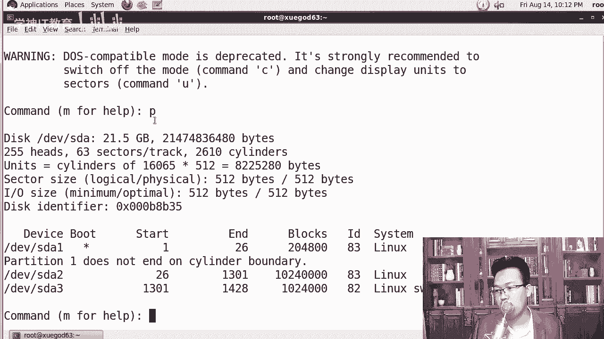
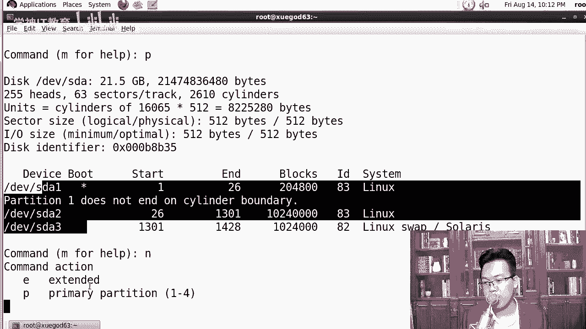
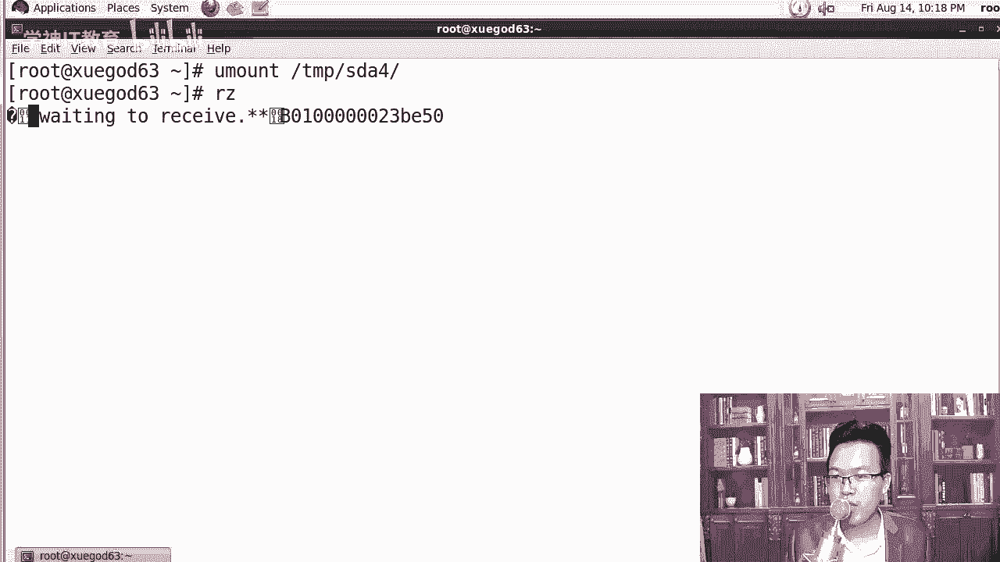
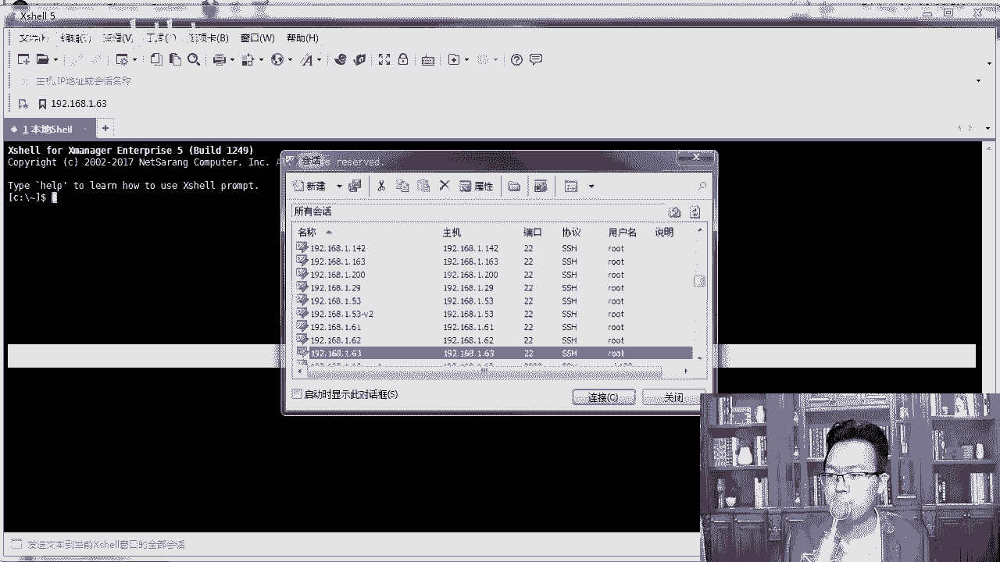
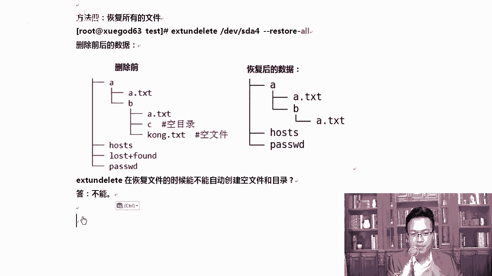

# centos8／Linux／运维／网络运维／RHCE／红帽认证云计算／2020全新独家教程-centos8操作系统从入门到精通 - P20：4-实战-在Centos6上恢复ext4文件系统下误删除的文件 - 学神科技 - BV15V411z7tK

大家好，我是MK，欢迎你来听我的课程。接下来我们去分享一个stoS6项恢复EIT4文件系统误删除文件的案例。😊，现在企业里应该用7会多一些。那么在7下就是如果我发生了一件这样的事情，RM我从根下。

比如说把呃德塔目录给干掉了。那这个时候大家心里想的是什么？山库道跑路是吧？那在6下其实是可以恢复的EIT4就像我们的。windows下有final data啊，这样的恢恢复无删除的文件。

那么在linux下同样也有ET4下ET3项都有叉FS现在还没有太好的恢复方式，所以叉FS它可以做一下增量备份，你自己经常备份这数据就可以了。如果真的有一天被删了，那我也帮不了你的啊叉叉FS下。

你得找专业的恢复数据公司是吧？用专业的软件去做开源软件还没有太好的方法，好不好？那开始之前我们先说一下，这个东西只能在6下。有同学我在7下是吧？格式化成一个ET4去恢复行不行，不行，也不好使啊。

因为它的软件好久没更新了，所以这个东西大家了解一下了解一下我们的软件，我们文件操作系统的底层就可以了。这个了解一下就行。如果你没有6的系统，那你真的要做这个实验，你得装个6，所以大家也不用装6了。

因为现在企业里已经不再用6了，你就听我的了解一下就可以。😊，我给你演示一下，你知道有这样的一个故事就可以。首先IM杠RF根能执行吗？当案是执行不了的，所以你不用担心这个事情喽。

这个才是真正的可以被执行的那EIRT4下如果删除了，那我可以使用EIRT on deleteele去做这个事。EIRT3下，如果误删除的，我可以用EIT3g大家知道一下，为什么要讲这个案例。

因为你工作中绝对会有一天误删除文件的，这个完全可以放心。人在河边走，没有不湿鞋的时候，你绝对会有湿鞋那一天。😊，知道吗？啊，那我们来来看一下。

windows下恢复的时候用的是fin date和easy cover。当然这个地方不是说我们。有彤老师，是不是我们。可是回收车里面是吧，回收站里面去恢复一下。

不是那个是说你真正的conttrol shift加delete给干掉了，你也可以，windows下也可以啊，就像什么呢？😊，说到恢复误删除文件这个事儿上，我必须得说一个门事件。😊。

门事件年轻人是不是已经不知道门事件了，对我们这些老司机其实还挺熟的啊，叫艳照门事件。😊，啊，你自己去搜一搜，还是有点福利的啊，现在。😊，对燕照门事件，据说男主角是吧，是一位明星那。

自己平常是吧爱拍一些照片啊，也爱和一些女朋友啊，女明星一起拍一些照片，拍完照片以后怎么样存到笔记本电脑上了。结果笔记本电脑坏了坏了，他说我去修一下吧，修的时候我不能让我这些照片怎么样。😊，啊。

让人家看到了是吧，所以他就把D盘里的照片是吧，全都删了。他以为删完以后就没事了，没想到修电脑那个哥们儿一看哎。😊，他有一个爱好，就是爱恢复一下，看看里边有什么。然后呢。

他就拿final data或者eay recovercover对对他的地盘进行一下扫描，扫描出来啊，等了半个小时以后出来哇，这么多美女照片。😊，比我天天翻墙看的那个精彩多了是吧？也真实多了。😊。

都是发生在你身边的这些什么熟悉的名字。啊，所以大家要知道一下，以后你的手机也一样。有同学老师，我这个手机啊，小米或者华为又出新手机了，我想换一个新的。😊，你把原来你P4零啊。

或者说小米8小米9上那些照片啥吧都。删一下删完以后就没事了吗？删完以后再往里多写点数据，然后再删再写，反反复复多弄几次，否则你怎么样，否则对否则你泡温泉的那个照片就会泄露出来了。😊，知道吧？啊。

我知道有些同学可能。洗完澡爱拍两张照片是吧？有这个爱好没有？啊，没有就行啊。有的话你记住你的所有的手机，还有啊笔记本电脑在卖二手的时候，你一定要看看那个数据啊。好，我们来看一下这个地方。那想恢复的话。

凭什么恢复呢？在这里，因为linux文件系统主要有三部分组成文件名iode和blockwinow其实也是有这三部分组成的。😊，你看有A点TIT这叫文件名。

I know这是存放文件原数据信息block block就是存放真正的数据的。咱们开一台森通S6或者red heart6都可以啊。😊，这个都行，只要是个六的系统就可以啊。我用这个六沙的去给你做。

首先呢我们创建一些文件啊。然后给大家看一下这个iode，因为大家对于文件AA点TIT都很熟了，iode是存放文件原数据信息，block是存放真正的数据。啥叫原数据？什么叫做原数据？就像那个什么呢？

我记得MK我印象很深刻啊。😊，MK当年也是从小白起的嘛，我记得那个时候上上小学还是上初中的时候，老师教我们计算机，说大家右击一下这个文件，查看属性。我当时死活不理解什么叫做属性。你明白吗？

你想想你属性这个单词，真的，我们比如说你上小学的时候，你说这个东西属性是什么？文件的属性是什么？😡，属性两个字认识它到底代表的是什么含义，我就死活不清楚。好，同样就像我告诉你存放文件的原数据信息。

源你知道数据你也知道原数据信息是啥，你就不知道了。😡，是不是这个道理？好，其实在linux下，原数据信息就相当于我们文件windows下那个文件属性一样，就是存放文件的基础信息的。我们来试一个啊。

右击空白处右击。😊，open the terminal打开一下，打开以后呢，我们来看一下。首先呢CPETCpa word A点TST。好，完事以后呢。😊，LS杠IA点天示T。

那我们可以看到一个文前面A点天T自然就是文件名了。LS杠I这个地方你能看到什么？前面有an号是吧？那这个东西里边存的是什么？号里面这个号里面其实存的是和我们state去查看文件详细属性的时候是一样的。

大家第一次能看到吧？这边确实是称值时间，access时间，mod时间称值时间里边放的每一个东西你都能看得到。😊，这就是I诺的号。每一个号对应的里边。存的信息是ode的号，有一个号。

这个号里面里面还有值啊，对应的值你可以通过什么state命令可以查看anode中包含的内容。它和你L5S杠L看到的这个数据是其实是一样的，比你这个还详细。你看这里面比如说我的文件大小是多少？

fi文件的名字是多少？ode的号是多少，用户拥有者是谁，所属组是谁，包括我们的读写执行权限全都很清楚。😊，好，知道这些以后，block是什么东西。我们说block是真正存储数据的地方是吧？

讲这个东西有助于大家理解是吗？linux文件系统的一些东西。😊，老豆。来，我们看一下，你知道删除这个事儿吗？为什么删除比复制快？我删一个G跟复制一个G哪个快。😡，毫语言，大家都说什么？对，我们都说这个。

复制啊慢删除是快，为什么呢？原因在这儿大家看一下，当我们去创建一个文件的时候，比如说。这里有A点TITiode和block，我们来画一下这个小图，让大家。了解一下啊。拿到这个文件名以后呢，有一个文件名。

咱们叫A点TST，然后呢，按ode写上我的数字键是一，比如说好吧，然后里边block就相当于我们磁盘里面写的是AAA。那拿到这个以后，如果我这个时候要做一个操作，这个操作是RM杠2。

A点天NT我要做一下删除，删除的时候。请问都删了哪些？你要觉得文件名被删掉了，你就敲一，你要觉得iode也被删掉了，你就敲12。你要觉得block也被删掉了，你就敲123。😡。

你觉得我们在执行这条命令有哪些被删掉了？快速的说一下。嗯。其实我想跟你说的是什么？只有他被干掉了。其他的都还在呢。当然我们读文件的时候，咱们是这样读，可以是可以读出来的啊。读文件的时候。

我们通过A点T加T找到什么找到我们的anode，再通过anode去找到对应的block。😊，删的时候实际上只删除了一。安诺的也还在呢。啊，只是这些地方怎么样，原来是吧别人用的时候，别人不能随便擦写它。

😡，现在一旦他被删了以后，别人就可以随便占我这块的空间了，所以他们都是可用的。可以被人随便擦写的。所以这个时候而且我们通过什么，我们通过这个state，我们也能看到就是blockiode号里面是吧？

通Iode号里面，我们也能看到对应的文件名的。你通过iode号是能看到对应的文件名的啊。那既然你能看到它，而且iode又没有被人真正干掉，好吧，没有被真正删掉，所以我们可以通过Iode号去找到它。

这就是最简单的一个道理。😊，如果你这个东西搞定了。被人改改了啊，比如哀昧的被人擦了，那就没戏啊。比如说我搞了一个这样的事情。😊，删完以后，哥们删完以后呢，我手怎么样啊，手太快了。

我又创建了1个B点天NT。对我又创建了B点天加T完事以后，B点T加T是吧，又对你进行了一下写，然后呢，又对它。😊，我正好用了，因为你是可用的嘛，我把你按那的号一给用了。然后呢，你这是AA。

我又写了个数字，你这块空间也释放了吗？😡，对不对？就让大家删我删一个2G，那磁盘上就自然会表示我有2G的空间可以用了。那这2个G我就写满了，那这个时候还能恢复吗？😊，这个时候就不好恢复了。清楚了吧。

你这个所以说大家要注意一点，就是一旦文件怎么样误删除第一件事情要做的就是比如说我一不小心保存了几十年大片。😡，删了。心疼的不行是吧？那这时候怎么办呢？你要避免数据内容被覆盖，怎么被覆盖。

你需要卸载恢复的分区，或者以制读方式挂载，别让别人再往里写数据啊，再写。我也帮不了你了。好不好好。那知道这个原理以后，我们来模拟一下这个场景啊。为了给大家模拟的更透彻一些，那我们准备一个新的分区。

你也可以直接再跟上去删删完以后，那你装装什么装这个EIT on deleteelete，你就得装到。装到一个什么其他分区下，你不能装到根下来。如果装到根下，在安装的时候又会占用很多的。😊，呃。

磁盘空间它又会写清楚了吧？所以我干脆稍后删数据，在一个干净的分区上去删。如果大家真的出现那种情况怎么办？就是跟下的。如果你真的是把根下，第一，你把硬盘拔下来。😡，可以正常关机，也可以怎么样直接断电。啊。

这接断电把硬盘取出来，或者最保险的一点的USB。你把EIT4EIT on deletete这个软件是吧，放到什么？放到USBU盘上或者移动硬盘上，然后安装好以后编译啊，干嘛都都编译到硬盘上。

恢复数据的时候也恢复到移动硬盘上，这样也是可以的。明白了吧？各位同学，因为根下它不停的产生一些日志啊，各方面都会有。😊，好，同样我们刚才P灰P完以后呢，已经有三个分区了。那我们是不是N创建一个新的分区。

这个分区就用主分区了啊。好，然后呢加大小，随便给点大小就行。

给一个G或者2个G的都可以啊。加一个G加一个GW保存。保存完了以后，你可以reboot一下，好吧，或者是part X。港ADV响SDA。这样也是可以的，你就能看到这个SDS了。好，这是我们创建的这个。

新的分趣。😔，同样也总结一下，如果我们是在跟下删除了怎么办？想恢复，那你第一，你可以立即断电，把磁盘以指读方式挂到另台电脑或者服务上序也行。第二，你可以把ENT on deleteelete在虚拟机上。

好吧，但是前提你的操作系统要跟服务器一样，在虚拟机上去安装好，怎么样安装安装好这个EIT on delete，然后呢再复制到U盘中，把U盘插入到服务器上进行恢复。恢复的数据一定要都保存到U盘上。

千万不要把它保存到根下，这样会覆盖原来删除的文件，明白吗？明白的话敲个一。就这个案例，你们工作中其实总会遇到的。所以工作中做运维备份好数据是第一要素。如果可能的话，你甚至做一个离线备分。

因为你怕你备分找其他服务器啊，万一那台服务器被黑了呢？😡，是吧你怕出现这种问题，那你可以备份到你公司的离线啊。离线的盘上。黑卡怎么不总不能跑到你们公司给你。😡，是吧把硬盘敲坏吧。好。

我们创建一下这个零创建一个目录MKFS点EIT4DV向SDA4格式化一下啊。好，隔完隔完以后呢，mounttDV像SDA4TMPSDA4。挂载挂载完了以后，顺带的其实为什么我要跟大家讲这个顺带的我可以。

😊，教你把前面的这些命令给大家传一下，我们正好前面学了很多，好不好？我们复制一些测试文件，然后把这些文件干掉，干掉以后，咱们再演示一下回复。这个时候我就敲的稍微快一点了啊。😊。

一要把pass的放到这下边。还可以一不要手速了啊，ETC houseTMPSD4。OK然后AAA创建1个A点7NT。MKDR创建一个目录啊。把，目录和文件夹全都给你搞出来，行不行？A下有B，B下有C。

OKCPAA点TNT到。TMPSDA4，咱们在A下考一份，然后到B下再考一份。除此以外。好不，touch记住啊之前touch不是touch啊，是touch。😡。

touch touch就是触碰触碰的意思啊触碰的意思。好，写一个空点填加T。密密麻麻搞了好多是吧，我看看我这上面有MT下有没有挂在镜像啊。啊，没有挂载是吧？好，没有挂载，没有挂载也没关系啊，我就不吹了。

如果有的话，大家记得样目安装一个t命令。😊，我还没有挂载镜像啊，如果大家自己挂载了镜像，你可以样么的方式安装一下吹，或者说从镜像里面去找这个 tree安装一下。吹完以后，我们看一下这个目录结构。😊。

看到了吗？这个那种结构是AA点TNT。😊，好吧，A下面有A点天加T和BB下面有A点天加T和C，还有空调天加T，包括有这几个文件。那这些文件呢，我们来给它删一下。

这里面我特意准备了两个特殊的啊空目录和空文件。一会儿大家恢复的时候，看看这些文件会不会。😊，被删掉。CD的天P像SD4。OK呃。😊，lastst加fin的这个目录是一个空目录啊。

这是我们如果你格式化成ENT4。他就会存在一个。这样的一个文件夹它是会存在一个这样的文件夹啊，但它不是回收站啊。所以你不用管他。只要你有就A删掉housese删掉password的删掉。

删掉以后还记得第一件事是什么吗？恢复误删除的文啊，不是卸载。好吧，卸载的时候大家要知道PWD你看一下TMPSDA4，大家看到了吗？😮，对你CD退出一下ummarTMPSDA4。这样。你要退出一下。

你如果不退出的话，你是卸不了SD的。😡，没有了。好。卸载要恢复的文件CD进去Umount。好，Umount完了以后，这个时候咱们再开始进行我们的安装。

NIT on delete我们可以从windows上上传，上传的时候，你可以ex manager啊，或者说CRT都可以。好吧，32T都可以啊，我这里没有啊，没有已经有RZ命令了啊。😊。

那有的以后呢，我们登上去。1921681。63登上去。

上传一下啊。将这个EIT这个包是吧，咱们上传上去。快速的登上去啊。好。选一下。E， S T on delete。密码写错了吗？好，有了那个包以后呢，我们来做一下。第一个是先解啊。解压的过程中。

大家要知道一下啊，BZ two这个包是什么样的一个意思。BZ two这种包解压的时候是需要通过什么？这个参数杠G啊杠G。OKGXVFX是解析，V是显示详细信息。F的话是后面要跟具体解压的文件。解一下。

然后CD到ENT on deleteelete下。OK在这里执行一下原码编译三把斧，第一把斧是configer。大家开开眼界啊，原码编译这些东西后续我还会详细给你们讲。😊，啊。

在这儿重点给大家演示一下恢复无删除的文件，看它缺一个库是吧？我需要把这个库装一下。那我们把那个样我们还缺一个包啊，它有一个依赖包需要大家给装一下就是。这个包。对你需要把这个包装一下。

叫E two FSpro GS devil把这个包装装完这个包以后，那么我们再去CD到这下面。呃，进行第一把。第一个就是原码编译3拉伏，第一个是confire。考没搞完了，下一步该干嘛了？告诉我。

所有的老师都是告诉你们make。😡，是不是没有人告诉你应该make in store是吧？😡，对，原码编译就是三把斧，第一把斧是configure是检查环境，生成makefi文件。

第二把斧是makem是叫编译，把源码编译成可执行的二进制。因为本来我们这里面大家可以看一下，它会都是一些点H文件啊，都是一些源码文件，尤其SRC里面更是一些C语言的文件。

O configurefi执行成功以后，它会生成make file文件，然后呢，make的时候就会调用make file里这个文件根据make file进行自动化编译，我会告诉你应该再加个杠G4。

不仅仅是make。在国内讲linux课程中，只有MK老师会告诉你们，make的时候是要加杠J4的。好吧，因为我以前经常编译lininux内核。我知道加上杠这一次它可以四个进程同时编译。

它会提示很快的提升你的速度，明白吗？比如说原来你编译的时候需要啊10分钟，那加上杠这一45分钟或者说2分钟就能搞得定了，速度确实挺快的。当然前提你的CPU是4核的啊。那么大家装系统的时候。

一般都是top一般都是4个核心摁运行top摁下数字键一就能看到你的CPU个数了。Pop。摁下数字键一看到了吗？推出的时候，摁下Q就可以退出了。啊，前提你是四盒的啊，它确实回款啊，它会启动4个。呃，进程。

比你起一个进程快多了。好，make install我们快速安装一下。好的。所以你跟着我确实能学到的东西啊。我们等开一下。你知道CP跟insstore有什么区别吗？😡，看着。

linux下还有一个命令叫inst命令。大家知道有什么区别吗？比如说inst ETC下的password到OPT下和CPETCpassword到OPC啊，比如我起个名字A点的A吧。有什么区别？都是将。

part图拷贝到这下面。知道有什么区别吗？你看我们这里就有啊。这里就是你看调用了USR instore，将EITN deleteelete复制到这下面，它为什么不直接CP呢？嗯。都是复制。

所以在安装的过程中，我们都会用inst，为什么？因为杠M后面可以加参数，比如说我加个755或者加个666。😊，你。好，我是可以加这个参数的啊。😊，并下的。

比如说我们将fin的命令拷贝到OPT下起个A点填ST。或者说777也可以，都是没有问题的啊，你是可以指定。复制完以后，文件的权限的。看OPT项。这一招学到什了吗？权限是不一样的。777的。好吧。

666的。啊，666就是读写执行。777就是读写直写666是读写好吧，777是读写执行啊，每一行每一个数字代表这三位。😮，的一个值，后期讲权限的时候，我会告诉你OK一句话在这里你又学到了一招。

instore和CP的区别，install在复制的时候是能指定权限的。你CP是不可以的。所以所以后期大家在搞渗透的时候，你应该。我想将我的木马搞到你的电脑上，怎么办？你可以使用inst的方式。复制过去。

啊，然后复制过去的时候加一个可执行的权限。啊，不要CPCP过去是没有权限的。学到这一首了吧。这就是MK老师的讲课风格。我除了教你linux运维以外，我还会教你渗透安全相关的技术。因为搞运维的放心。

你的服务器上线以后，绝对会被黑客盯上。盯上以后，你能不能搞得定呢？所以从现在开始，我就把渗透安全的一些知识。啊，交给你。那这样的话，你既会lininux云计算啊。

这种大型网站并发的技术又会渗透安全相关的技术。你出去别人要1万，你就可以要15000的薪资。你就可以要2万的薪资，明白了吧？告诉他你除了运维，你还会动安全的。因为其他的运维人员是不懂安全的。好。

接下来我们快速恢复一下，通过iode去恢复，通过文件名恢复恢复某个目录，恢复所有文件，三种方式都可以恢复。四种方式啊，首先卸载SDA4。

咱已经卸完了MK创建个test C立到test下创建一个干干净净的。我就这个时候我就不用担心怎么样，数据被覆盖了，为什么？因为我的根是在SD4下的啊2下的，好吧，我们删的数据是在SD4下的。

所以恢复SD4到什么？😡，到第二个SDA2这个根分区下，SDA2是挂在根下的啊，恢复到这下面是没问题的。大家看一下这个效果好不好？好，拿到这个地方EIT on deleteele低V下SD4。呃。

这个课程这个小案例稍微复杂一点啊，但是大家开开眼界好不好？😊，安ode2宇图老师，你非得写二吗？难道写三不行吗？不行，写一呢写一也扯犊子，只有写二的时候才好使。😡，为啥？因为我们的根呢看到了吗？

DRDR就代表我们当前文件，也就是我们的根，它就是它的I的号就是2。所以我们查找文件的时候，要从根开始去什么呀搜索啊，要从二开始啊。😊，OK因为我我们所有文件系统的这个。LS杠，比如说杠I。跟好唔好。

那你可以加杠D啊，这样的话就看我们的根就是。跟的什么iode号就是2啊。那在这里我们通过iode号，大家已经能找到了好多东西了。找到了什么？你能看到了什么呢？看到。

password曾经被删掉的house曾经被删掉的，A，曾经被删掉的an know的号都有。我可以根据an know的号去做这个事情。OK。😊，叉SS不一样啊，我在这里顺便跟大家说一下。😊，ET4。

安根的安ode值是2叉F，它的根的安ode是64啊，它是不一样的。知道吧。啊，他是不一样的啊。好，我们知道了。那咱们来看一下啊。😊，恢复一下。比如说我想通过安ode的节点恢复四种方法。我想。

他做要的是12是吧，我想通过1二去恢复，那可以这样去做这个事情。好。CD到一test下。恢复的时候，EIT on delete这是我们安装完的新的这个软件。SD4从SD4下去恢复，恢复这个单词是re。

好吧，restore是恢复的意思。然后杠我要从anode去恢复，那你就写anode号是12回撤。那这样的话就恢复成功了，恢复完了以后会在当前路径下windows下也是恢复完了以后。

它会在当前路径下产生一个文件。那这个文件我们可以打开看一下啊。是是pass错的那容。有同样像式到底是还是不是呢？你可以differ的对比一下，将它和我们的ETC下的password。

因为当时我是复制过来的，没有输出，没有输出，就说明我们内容是完全一样的。这样的话我们就恢复成功了。只是这个恢复完了以后不好看是吧？因为写的是什么fe。点12。所以我希望通过文件名恢复。

那么通过文件名恢复，就是跟他一样恢复。什么文件写fifa后面跟上名字，名字叫pass word。如果你不知道的名字怎么办？但我们不知道名字，我们可以查嘛。好吧，在这里不是搜索到了吗？

曾经被删过的文件都能找到。回车回完车告诉你，successfully成功了。成功了以后呢，我们同样different的去对比一下，你也一样是可以看得到的。年轻人。😊，这次写password和谁呢？

ETC下的password直接对对比对比。如果对比成功了，那就没有问题。你看。😊，没有输出没有输出就是一样的啊，可能大家慢慢的不太理解是吧？在lininux下，这就是没有消息，就是好消息。😡。

就像你一样，你现在坐到这儿能听我课，没有家人打扰你，没有女朋友是吧？😡，诱惑你。这就是好消息啊，你就可以强大起来。😡，对吧一会儿媳妇叫一下，一会儿孩子叫一下，有消息就不是好消息。

当然如果你上班的时候看我这个视频，老板不叫你，那更是好消息啊。😊，没人给你安排活是吧？除了恢复文件的话，还可以怎么样？文件名能恢复，我们还可以恢复目录，恢复文件的时候写的是fill。

那么恢复目录写的是什么？目录这个单词就是directory，所以我们可以直接写什么呢？restore杠directy。😊，你看到吧？只要你能理解作者开发软件的意图，lininux学前其实是挺轻松的。好。

恢复成功了啊。那这个地方咱们恢复成功了。😊，你看有AA下面有数据吗？有。那你可以尝试吹一下啊。我我把那个吹明令后来又装了一下。OK锤是怎么装的呢？是我我把那个光盘挂到了这上面啊。MOUT我挂了一下啊。

DV下的CADroom。对，我们将CD中母挂到了MNT下。挂完以后RPM大家要知道这个正好给大家讲一下啊，你看一下，就是八核什么7。😊，还有六是不一样的。

七跟六的光盘就是镜像光盘里面的这个文目录结构是差不多的啊，都是MNT下有一个叫package，会有一个这样的东西。所有我们的包都是在这个package。七不是七是分了两个目录。啊，两个文件夹是存放的。

所有的阿P包都在这里，你可以LS看一下，一会儿它会显示出来，你看这么多PM包。😊，所以我们安装的时候，RPM杠MNT下。拍ageP是大写的啊，064R是区分大小写的。😡，这样我就安装上了。好。

处理完了以后，我们其实发现这个目录结构是有问题的。大家刚才可能没看清，看到啊，我们再去吹看我们恢复的时候，原来有A点贴一和B，原来是有C和空的。也就是你少了个空啊，年轻人。看出来了吗？对。

我们是少了一个东西的。那这个数怎么办？嗯，是不是恢复的时候没有恢复出来，空文件和空目录没有恢复出来。那我还有一招我可以尝试一下啊，就是我们尝试恢复所有文件。试一下，你想恢复所有文件。写什么？举个例子啊。

前面这两个大家都看到了吧？恢复所有文件。嚟。恢复普通文件写的是fill，恢复目录写的是directory。那么如果我想恢复所有文件，大家告诉我这个时候应该写什么。啊。后边应该写什么？所有。

是不是哦就是R啊。实际上就是的，所以lindux你慢慢的找到它的规律，学起来还是很轻松的。那么在恢复的时候，我们把这下面的东西先干掉啊。😊，好，删完当前目录下来这个东西以后，我们重新恢复一下。好。

一下子都恢复完了以后。催一下啊。还是没有恢复出来。看出来了吗？所以linux啊本身恢复文件这个事就没有说百分之百的事儿。懂我意思吧？删除之前C是空文件，这个是也C是空目录，空掉天加T是空文件。

那么恢复后少了什么这两个东西，也就是EIT deleteEIT on delete在恢复文件的时候，能不能自动创建空文件和空目录呢？😊，答案是什么？答案是不能。真不能啊。不过没关系。

到那时候你自己手动创建一下就行。这些空的一般情况下作用不大。好，这是linux下误误删除的文件。通过这个东西，我希望大家能开拓一种思路。😊，好不好？给大家开拓一种思路，也告诉你你的笔记本。

你的手机上的照片，不要以为删完就没事了。😡，扔给那些修什么修软件的公司，他都能给你恢复出来。好，我是MK，希望你能把我的课程推荐给更多身边的朋友去听。加油。

