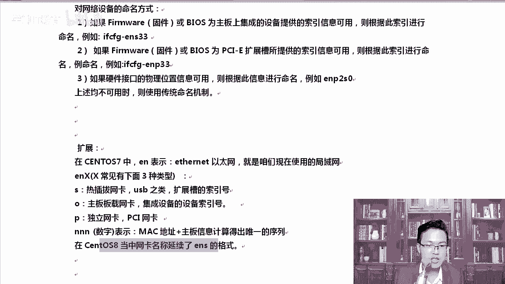

# centos8／Linux／运维／网络运维／RHCE／红帽认证云计算／2020全新独家教程-centos8操作系统从入门到精通 - P22：1-Linux网络相关概念和临时修改IP-配置主机名 - 学神科技 - BV15V411z7tK

hello，大家好，我是MK老师，欢迎你来听我的课程。那么今天我要教大家。😊，组装一下服务器。另外说一下lininux下的一些基本操作。那么通过这一节课程，我们就可以创建一个可用的实验快照。

有了这个实验快照以后，后期所有的环境都要在这个快照下去做。也就是说过了第五天啊，第五章的内容，那么你就可以轻轻松松的学习我这个linux课程了。因为你拥有了自己的一个可用的实验快照。

后期所有的实验都是基于这个快照下去做的。每一次做实验的时候，尤其后期搭服务的时候，大家一定要恢复一下快照啊，然后再开始做。因为你忘了你自己之前乱改的那些东西啊，所以一定要恢复一个快照。

那么可用的实验快照大概有哪些内容。😊，比如说我们要配一下IP吧，你不能天天用动态IP了。然后关闭防火墙，开机不启动，关闭SElinux设置一下光盘的挂载。

配置一下本地样维员这几个内容顺便就可以把那么第一章到第四章这些内容带着大家再过一遍。挺好的啊，就是相当于一个小的综合案例了啊，综合综合实战。😊，首先呢我们要配IP那配IP的时候。

我们先看一下网卡的名字啊。在如果你用过三特S6，有同学我没用过是吧？没有用过，我建议大家也自己去装一下啊。这样的话可以一脉相承。像MK老师从汕头S3s特S4再到5再到6再到7，再到8。

那未来讲除了三特S9的时候，我也希望你一样过来再听我的课程，好不好？😊，对，这样一脉相承，就像我们要熟作为中国人要熟读中国的历史一样。那么sS6，它的网卡的命名是怎么样呢？它是这样的。

它就是ETH0ETH1如果又增加了一个网卡，那就ETH2。但是这样有个问题，比如说原来插在那个假如我都是可插拔的那种。呃，PCI的那种插槽的网卡。如果你看比如说增加或者删除网卡的时候，名称可能会变。

名称可能会变，那么名称上对应的这网卡配置文件也会发生变化，就容易对不上号。这个大家可能没有用遇到过啊，就是你比如说windows吧，windows我们经常要插你的电脑上。

比如说你的台机上有多块磁盘的时候。它跟那个s塔接口很有关系，有时候你插在s塔的第一个口上，那就显示的是C盘。你把它那块盘插到了后面几个接口，那可能变成D盘或者E盘。😊。

那这样的话肯定在引导系统或者各方面都有问题。而我们的服务器同样也会出现这种问题。那怎么解决呢？能不能让我们的网卡名字一下子就定下来，可以从7开始采用了什么的这种命名采集方案。

那它实现了网卡的名字永久为一啊，凭什么你能实现它的永久唯一呢，就像我们的mac地址一样，每个网卡和每个网卡都不一样呢？那么它的网卡的命名方式做了一些重新的规定。

不带统一叫什么ETH0第一个网卡ETHE第二个网卡不是这样的，我们你看啊如果啊如果你是什么是我们的bios上自带的一些啊硬件，那么它起的名字就叫做ifFGNS33起的是这样的一个名字。如果是是什么呢？

你看如果固件或bi怎么样PCIE扩展啊扩展槽所提供的这个索有。😊，那它的名字，也就是说，如果你的网卡是PCI杠E这种插槽上的网卡。那独立的网卡呢ENP33有同学老师，我这儿也不叫33呀，我可能叫37啊。

或者叫34啊或者87。那没关系，只要前面这个序列都一样。ENS都一样。所以每个人的网卡，因为你的硬件是不一样的。所以你看到的跟我看到的真不一样。包括我们到服务器上看的时候就更不一样了。

因为现在我们的都是VMV虚拟机还好说一些，听楚了吧？还有一些比如说物理接口对应的一些，根据命名的就命名规则是ENP2S0看到了吧？O所以就是说不同的这个网卡是不一样的啊。

所以这个时候也没有存在什么01这一数了，可能这个叫叫3第一块网卡叫ENS33。那么我的第二块网卡可能叫ENS37，也不是说一定叫叫34的啊，34的，所以这个大家不用担心啊，就是这样去做的。

你觉得不好记也没关系啊，它确实是这样去操作的。我们的7和8都是这样的那在。😊，sS恰EN的话，你看到前面其实都有个EN什么EN什么EN代表的是iser night以net以太网，啥叫以太网？

你现在连的这个网就都叫以太网啊，好不好？比如说我们现在在家里的无线路由器连上去，或者说咱们在公司通过有线或者无线连接的，这都叫以太网。😊，OK。

ENX的X如果是S这一块代表的是热插拔支持热插拔这一类的扩呃扩展操的缩引号。然后如果是O的话，是主板板载的一些或者集成网卡啊，集成，直接集成到主板上的一些设备的索引号。

P的话代表的是PCI代表是独立的网卡NN这一块代表的是数字，那么这个数字通常是用mac地址加上主板上的本身mac地址就唯一吧，再加上主板信息去算出的一个唯一的序列值，有同样这个怎么算的。

内核自动就帮你搞出来了。你也不用管它怎么算，插上去显示出来就可以了。那么再一个是stoS8里面网卡的名字，同样采用的是ENS这种方式啊。我们来查看一下对应的这个网卡，打开。

中断。首先我们的if configurefi我们去看一下IP。

嚟。大家看一下。比如说if configure，我们直接回车回完车以后呢，我们看到的是ENS33。那么对应的IP地址就是1。63，这个大家都没啥问题吧。

那么弹出的后边这一段称为其实当我们执行if configure，它确实能弹出好多的信息，我们需要把每一项都知道吗？其实不用啊，我们只看最主要的这几项就行。比如说这是IP地址，这是25525。25。0。

这是。😊，死亡掩码他的死网掩码啊，如果写成数字来说就是2-24。OK如果只有2个2255，那就代表16位字亡页码。如果只有一位，那就代表8位广播地址是1。255点啊255。然后MTU是什么？

我们把这一块给大家描述一下。其实通常情况下，咱们只要看懂了它的。IP地址就可以了和字网掩码就可以了。😊，if con罗列罗列了这么多。第一个up代表的是开启状态。其实通常情况下。

if configure figure你看到的就是up状态。哪个地方呢？就这，如果它不是up，你是看不到的那怎么才能看得到呢？如果它不up的时候，你加上杠A的方式，那这样也是可以的。😊，啊。

这样也可以看到会把当下的那些网卡是吧？只要能识别出来，都会给你显示啊。杠A。😊，if刚A看到这个参数了吗？像这种东西大家自己找个笔，找个本，应该记一下。好吧，这些常用的小命令查看所有的啊。😊。

up的话running是吧？这是当前处于running状态，然后呢支持主播MTU1500，这持最大传输单元为1500字节指道一下就行啊。第二行是子网啊，IP地址相关的，还有IPV6相关的信息。

那么现在咱们的服务器一般还是IPV4啊，尽管IPV4在北京提示，如果你是新上的这个服务器是吧？都一般会给你分配IPV6的地址了，明白了吧？而且在北京这块呃，很多大的互联网公司知道吗？

工信部就直接约团你的这个IT部门负责人，说你们公司应该怎么样，应该用IPV6。怎么样？提前你们作为大公司有这个技术实力，提前你们就应该先用用这个新的技术。真是这样啊，北京从18年的时候。

19年的时候就开始鼓励了啊，鼓励大家去IDC机房的时候，自动给你分配，去分配IPV6。😊，再就是macdm地大家都知道啊，那么每一行。那个地址这个地方一般对我们服务器来说，看这。用的其实也不是很多。啊。

关于mac地址这一块，那么下面还有你看还有包的一些东西，发包和接收包的一些东西。这个大家知道一下，alnet代表是以太网啊传输队列的长度，这一块是网卡接收数据包和接收错误的统计信息。这些统计信息的话。

一般我们不关注它。除非到我们整个网络都出了问题，那真的的出了问题以后，我们会用wear sha去抓包。啊，这个地方大家知道有这样一个操作就可以了。

接下来我们把这个地方if configurefi杠A这个可以查看所有的活跃和不活跃的网卡都能看到啊。这是杠A参数。刚A参数可以查看所有网卡啊，查看所。

在lininux下很多情况下都是杠A都代表所有的意思。包括没有启动的。什么叫做没有启动，大家知道吗？在windows下，咱们比如说右击那个本地连接可以右击禁用它，对吧？那么linux下。

如果你把网卡禁用了。😊，那你衣服扛vi格直接看的时候看不到，他只看活跃的啊。网卡信息。好的。有了这些东西，我们来临时修改一下IP地址。IP地址临时修改，可以通过这种方式。请看。临时修改IP地址。

ifvi跟上网卡的名称，再跟上IP地址，就这样就可以了。那么直接修改好吧，直接修改这个IP地址。当然它其实重启与系统或者重启网络服务以后都失效啊。😊，对，重启。网络服务吧。重因为它是临时的嘛。

所以一旦我们重启了以后，它就会失效。怎么做？😔，这个也挺有用的，工作中我们会做实验的时候，会经常临时配一下。伊康菲了。跟上ENS33，这是写上我们的麦克呃IP主网卡的名字。然后接下来写192168多少？

比如说1。110，你配一个什么不错配一个，别跟你局域往里冲突了，有时我配个1。1吧，也可以配上啊，但是跟你的网卡就冲突，网网关就冲突了，我的网关就是1。1。好，net。这个没法补齐啊，net mask。

所以说有一些基本的单词大家要记得住啊。😊，25。25点。好，回车就行了。那if configurefi大家可以看一下。如果每一次大家都想往觉得往上翻是吧？费事，那你可以加个冒啊，这样就可以了。

那这一屏是吧，它就看了应S33。如果你看不清的话，你看if configurefi加个管道符跟上帽。那么对应的你能看到对应的IP地址1。110已经改完了。改完了以后，当然取拼的时候。

这个是完全可以拼得通的啊。😊，OK我的1。0能看得到吧？这就是拼筒啊。😊，已经通了TTL至64时间。我想添加多个。假如说我这1个IP地址里面，我想添加多个可以吗？也可以可以这样。

衣服 configurefi。ENS33冒号0。可以零也可以一也可以3都可以啊。我们从零开始吧，冒号加个冒号就可以，然后呢写上你的IP地址。😊，1。111。好吧，1。11，然后d1。111。

然后net mask。好。写上子网掩码mask255。255。好。这次咱们再看一下，在这里你可以看到它是1。110，然后呢，这边是111。这就是。拼一下啊。对你看还是可以拼通的。我给大家总结一下。

这叫添加多个网卡的地址信息。临时修改if康网网卡的名字，加上IP地址就可以了。当然如果你是通过叉CL的方式连上去的，是是不是会有个问题？因为我当前机器是1。63，清楚了吧？

如果你临时通过这个方式修改了一下IP地址，那终端会修改后，当前的终端会中断，需要你重新用新的IP地址去连接。所以新IP这个工工工作大家一定要注意一下啊。临时修改的时候。

靠的是这个if configure网卡名字0。跟上第一个IP，然后再跟上。再跟第二个，你一个网卡可以配多个IP，甚至这些IP不在同一个网段都没有问题。明白吗？对我不带同一个网段可以吗？

不带同一个网段也是完全没有任何问题的。啊，我们起个111吧，110刚才已经用过了是吧？好，那大家能看得出来这个效果吧？这个后期我们在做一些实验的时候，比如说集群啊或者负载均衡的时候会用到这些东西。😊。

因为我们有一个内网，有一个外网，所以这种情况下还是挺常见的啊还是挺常见的。好。知道这些我们接着往下，咱们来看一下。如果我想看IP的话，除了什么if configurefi这一种方式，还有一个IP命令。

IPAADDR售。这也有。好吧，IPAADR时候有同学老师，你这个太多了，所以这个时候就是管大哦管道加帽这种方式是最常用的。我经常这样去用，大家可以看一下ES33那。IP地址写的很清楚啊。看到了吧？1。

11110在这里，然后呢，111对吧？广播地址是多少？然后呢，对应的是第二个，你看secondaryENS33冒号0写的也很清楚。如果你再配一个，它还有。那如果我想删了这个临时IP呢。

我觉得这个临时IP不想要了啊，IPAADDR。delete删除删1921681。111。就删它删的时候，从哪DV是device设备意思，我要从哪删删哪个设备上的IP呢？你不能随便删是吧？

应NS33冒号0。😊，那这样我们就删掉了它删完以后，我们可以一confi再次去看一下。那大家可以看到。应儿33已经没有了，包括当然两种方式都可以啊，看你自己喜欢用哪个IPAADDR瘦这个也挺好用的。

你也可以 show一下它。啊，受的过程中，你可以看到ES33这个地方是只有我们自己这1个IP。那李涛老师，你这里面还有其他的好多IP呢，能都给我说一说吗？可以。😡，咱们来看一下啊。

1233是我们本机的这个网卡信息。除此以外，还有1个LOLO上配的这个LOLO又称为回环接口是吧？它上面配的IP地址1270。0。1。那接下来还有个what to B20，这个是干嘛使的？这个是lab。

这个是什么啊？😮，对，这是我们linux下有一个虚拟化服务，好吧，就la virtual D。是这个服务生成的。如果有时候你是最小化安装的系统，其实你是看不到这样的一个桥设备的。

它是给留给我们后面虚拟化用的。明白了吧？所以如果你是最小化装的，其实这个IP你是看不到的啊，watertoB20虚看water是虚拟化B20嘛，它是后期我们有一个这样的服务啊。

这个服务装了以后就会生成这样一个桥设备。😊，来删除怎么删的IPAADDR，然后查看的时候IPAADDR瘦这个方法你也要记住，因为两种方法都还是挺常见的。好，那么接着我们来看一下网络相关的服务。

那现在我们配置的是临时IP吗？网络服务的话是通过network manager这种方式啊，我们来看一下。在这里。

network manager network manager是管理和监控网络设备的一个守护进程。以前我们的网络服务叫做network。从七开始啊，我们使用了什么network manager。

有同学老师这个N大写M大写了，平常你敲命令的时候也从来没有大写。我告诉你，linux下是区分大小写的N和M就是要大写啊，后期我们调用这个服务的时候，你小写是不行的啊。7。

0以前是以这个network这个服务来管理我们的网络的。😊，到怎么样，到这块又变了啊，也变成network manager这种方式。所有的从7开始啊到8的时候呢，八的时候又变了。

所以配IP这个事儿还是个挺纠结的事儿。在吧里面依然保留了network manager的一个服务。但是这个服务它已经不起作用了。😊，好，我们来看一下。啊。

这样我先手动给你敲一遍sixtem sister这个单词要记得住啊，n。好了，work many。😔，这。OK回车回车以后，你可以看到active说明它是运行的N响Q，它就退出了。😊，嗯。

那有同学能补齐吗？可以补齐。好吧好，咱补齐的时候速度特别慢，我已经按了两下table了啊。😊，看到了吧？补齐完了以后，你看network这service可以加这个东西，也可以不加，你加上。😊，也能使啊。

不加也是没有，就是点service这个地方可以加可以不加。啊，名字后面这个。好，我们看到了这这是关于管理网络的一个服务。这个服务在八里面已经不能使了。在七里面你可以。当然能加ss。

你也可以加什么re start或者stop啊。其里面我们修改完了配置文件以后，需要靠它来去重新启动。那我们来修改一下这个网络配置文件。网络配置文件。呃，网络的配置文件是这样的，大家可以看一下啊。😊。

网络的配置文件stoS。对吧red hard或者sn它的旁网络配置文件的路径。呃，首先我们来看一下啊。呃，ETC下s configurefi。算了，我还是CD进去吧。在这下面。

我们的网络相关的这个配置文件都是在这下面的。啊，咱们都在这下面，那么在这下面你可以。😊，看一下。回去在八里面只有一个东西。😡，看到了吗？那么在8里面是吧，他确实只有一个啊。O。

8里面只有一个if convi inS33。知道了吧。对，班里面只有这一个，所以呢。7不是7里面还有个E嗯ifFG杠LO这是回环口的一个网卡信息，在8里面已经不存在了。7里面还存在了一个网址。

如果你是桑特S6的话，那你有时候你在工作中后期大家也能看到什么ETH0这种方式。ETH0代表第一个网卡。好。看到了这个以后呢，我们再看一个消息。网络相关的ETC。resolve这个也挺重要的。好吧。

ETC resolvesol这个地方。大家看到了吗？在这里你能看到我的name server好，name server这个地方是4个8。那这里还有IPV6相关的一些啊DNS的地址。

大家在如果你是IPV4的那我们主要看这一块就可以了，4个8。Hao。😔，除此以外，还有一个东西需要大家注意注意一下ETC下的house。我们看一下，在这里面我们需要添加点东西啊。好。😔，咱们需要添加1。

63，添加1。62，添加1。64，然后对应的关系是1。63，对应的是学挂的，把这个短的主机名写上去，然后完全全的主机名是63点CN好吧，6264。有同学你为什么要写这么多？因为后期我们做集群的时候。

最少三台服务器。那正好这个时候你就把这个house的对应关系写好，后期我们在调用集群的时候，比如说我需要调用学挂的63。那我要拼什么呢？拼学挂的63的时候要能直接拼通。你说现在你怎么网络不可打呢？

因为我的IP地址是什么？😡，是1921681。110，好不好？这个没关系啊，一会儿我改一下，重新启动一下服务就行。有了这个以后，还有一个housese，有同样一个主机名怎么配的？

house的 name CTL。😊，听楚了吧？通过这种方式去修改，修改完了以后，你可以通过这个命令house name直接回车。那你就能看到学杠的63点CN。

