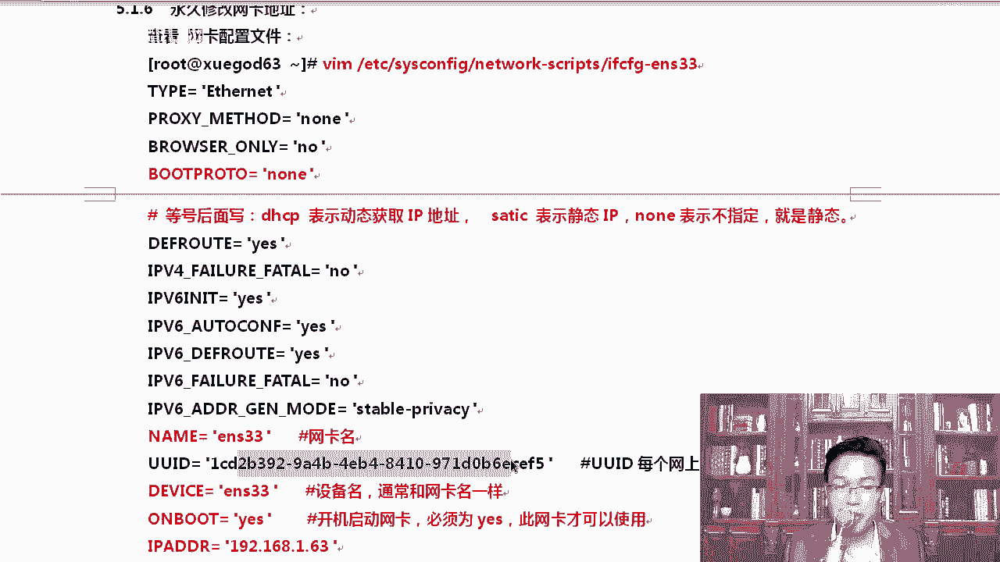
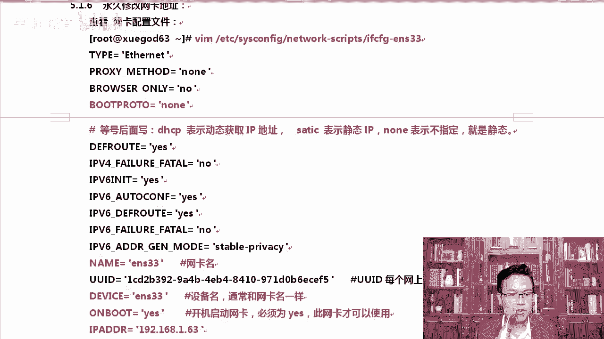

# centos8／Linux／运维／网络运维／RHCE／红帽认证云计算／2020全新独家教程-centos8操作系统从入门到精通 - P23：2-修改IP地址和启动网络服务器的方法 - 学神科技 - BV15V411z7tK

我们来总结一下，那修改主机名的时候用的是hos name cTL，这是修改主机名，修改完主机名以后，这是永久的方式去修改主机名。如果你想临时修改呢，那你就可以通过ho nameho name直接是查看。

除此以外，你还可以临时去修改，那比如说MK老师看一下hot name，我当前是学改63。如果我想临时的去改一下，改成AA点com可以吗？也可以改完以后，你去看，那这叫临时的去修改，临时修改完了以后是吧？

当前大家可以看到现在这个主机名，它并没有发生变化，如果你想给它发生变化，那conttrol shift t，你需要怎么样，重新打开一个终端或者reboot。

知道了吧？你当前这个地方，无论你是临时改了还是现在改的，这一块都不会变。除非你重新打开一个终端，看到了吗？这样才会发生变化。

好，大家可以看一下housese name这个是查看。查上来了以后，当修改完的主机名。怎么样？当前修改完主机名后，当前已经连接上的提示符的主机名是不会变的，你需要重新登录才能生效。O。😊。

这是永久性的去修改。那么临时修改呢，就是后面直接给这个。比如说我给了1个AAA点com。临时修改主机名。在这个地方显示的应该是AAA点com。

好。两种方式是吧，大家都要常记住啊，常记住这两种方式。因为有时候你也需要临时去修改一下。

所以那有同学说了，我当前非得让他怎么样。😡。

就是非得让他发生变化。可以吗？也是可以的啊。

你。退出重打开一个，只能是这样啊。

好，改完主机名了以后，我们来永久修改一下网络的地址。

在这里我们来说一下，每次修改网卡地址的时候，很多同学都修改完了，老师我上不了网了。😊，啊，每次都说我修改完了以就上不了网了。那我就问一下。😡。

好不好？你自己先怎么样先拼一下。没有吗。呃，先拼一下百度点comM，你先看一下，你看他说网络不可达。如果出现这种问题，该怎么办？明白吧？该怎么办呢？你先怎么样？如因为尤其你达到了一个什么新的环境里。

你到达一个新的环境里更会出现这样或那样的问题。所以在新的环境里，我们可以怎么样呢？这里有配置文件啊，VNM我们直接怎么样if3。😊，好吧，VM直接打开，打开这里面以后，你能看到这些网卡信息。

你直接怎么样。😊，我们来说一说这个网卡信息。比如说bo proto等于n这个东西我们可以改成DHCP你先让它动态的去获取一下IP地址。当然动态H去获取获取IP地址的时候，下面这几行就得删掉啊，那几行呢？

我的IP是什么？子网页码是什么？getway核定S这一块都要删掉。好吧，否则你的机器上将会有2个IP地址，这样就乱套了啊。OK保存退出，我就先不保存退出了啊。

对你先。让他自动获取一下，看获取到的是什么。好，我们先。😔，整理一下啊。

给大家写到这上面。好不好？VM打开打开。😊，啊，对应的是n，如果等号后面写的是n代表的是什么，好不好？等号写的是DHCP代表的是动态获取。如果写的是s，那代表是静态。其实n的话请也OK啊。

也算是代表的是静泰。嗯，懂我意思吧？然后呢，ENS33这个就是网卡的名字。有同学老师每一项这都是什么意思，下面这些东西就默认就行，大家并不需要都关注它。😡，啊，bser，你看bser only等于no。

呃，他类型等于al night。接下来还有什么网卡的名字，网卡名字的话通常要跟你的设备的名字是一样的。网卡的名字要跟你的设备的名字一样，un boot等于ES开机启动必须是ESIB地址1。

63子网M码24gatetway1。1DS。😊，同学老师，我的网关怎么配呀？网关就在这里面去写，你写getway等于什么？😡，双引号给它扩起，双引号要用在linux下我跟大家说。

做开发做脚本的时候的余律都用的是。英文的双引号不要用中文的双引号，也不要用中文的单引号。

清楚了吧，那就会有问题。DNS的话，那有同少你这里不是是DNS吗？😡，谁说了算。嗯，我们看一下啊。对我这里网卡的配置文件里写了1个DNSreol也写了个DNS那到底他哥俩谁说了算？😡，以谁为准。

嗯，所一说以谁为主。你们说的我们把那个设备。

就是详细的一些描述给大家说一下啊，我标的这些都是大家需要是吧着重去看的啊，标颜色的网卡的名字必须要跟设备的名字是保持一致的。device是配置词。😊。

设备的应用啊，此配置文件中应用到的设备，然后hardware这个也很重要，这是mac地址。咱们这里面啊是不是不带mac地址了，我看一下啊。

对，这里面不带麦克地址，但是带的是UUIDUUID就相它是什么看这UUID每一个网每一个网上的设备都是不一样的。就是你每个网卡或者每一个什么每个硬件设备都不一样。磁盘有磁盘的UUID网卡有网卡的UID。

😊。

清楚了吧？它就就相当于是全球的一个什么设备的一个识别符。以前我们都说网卡是独立的，你看这。FS table里面是吧？我们打开ETCFStable这个文件，你可以看到每一个怎么样。

每一个磁盘设备也是有1个UID每一个硬件都会有自己的1个UUID值。这个UID值是全球唯一的，这样有什么好处呢？你看如果我这里直接写分区，我的S，它就会出一些问题。😊，听楚来了？

我们是直接基于UID来挂的。如果是什么呢？在以前我们写的是什么？老的方式写SDAE挂到这上面。如果我的SDE发生了变化。那这个时候你的系统可能就会起不来，因为你的细你的你磁盘发生了变化。

或者插入一块新的磁盘，它SDAE上面根本就不是根的东西，你挂到根上，你觉得你系统能起吗？😡，是吧再或者。我我这个磁盘是SDBE第2块磁盘，结果有一天我觉得电脑坏了，我想把两颗磁盘是吧换一下顺序。

然后我们两个磁盘互插了一下，互插完了以后怎么样？原来的SDBDBE插到了。比如说第一个沙拉口上，那它可能变成SDAE了。那这个时候SDE挂到这上面，自然是识别不了的它就不是根嘛。😡。

所以它就会导致我们的系统是吧启动不来。UID就有一个好处。不会因为你的硬件是吧？对不会因为你的硬件从一个接口插到另一个接口上而发生变化。😡。

好不好？退出。这是FStable。

那我们来改一下啊，给他修改一下。修改的时候，MK还给大家提了一个问题是吧？提了个什么问题呢？到底。啊，到底他俩谁说了算？你售。谁说了算是他配置DNS说了算，还是这边配置DNS说了算？嗯。😊，想想。好。

我来跟大家说一下啊，当然是我们下面这说了算了。如果你要配2个DNS，那就DNSEDNS2就这样切就行。OK一般情况下，一个DS就主DS从DS。那我们可以写一下114点114点114114。A5啊。

稍等啊。的键盘那个键连到一起了。好，DSE写了114114114。好，写完这个以后呢，我们再往下gatet away这个地方呃呃，不用管这块。我改成66，保存退出。呃，保存。

其实大家保存这种配置文件的时候，你一定要注意一下啊。OK另外我不希望他老有这个东西，所以我把这个删一删啊。很好，因为我们在。修改。点B是24呃VM。把这个删一下，删完它以后，我们就可以了啊。好不好？来。

好。看一下啊，我们保存退出没问题了啊，你自己做的时候一定要看一下这个操作啊。对我们又要看一下它对还是不对，我这边是没有问题的。WQ保存退出重启完了以后呢，我们先这样去做一下。如果你是六的系统。

那你执行net work restartstar。它是这样写的，结果告诉你，nettwork service根本找不到。尽管我们这里面是有这样的一个东西的，但是哎哦8里面是吧，ETC啊。

thene地地下network这个脚本都没有了，其里面还有这个脚本的。😊。

好，所以说这个是启动不成功的那启动不成功，我们再接着来ss team。好不好？Restar network manager。回撤回上车以后呢，哎貌似成功了，成功了以后呢，我们去看一下ENS33。

那大家可以看到ES33还是什么，还是临时改的那个1。110，根本就没成功。好吧，另外呢我们再看一下这一块也还是哎这块变了是吧，变成了114了。😊，所以首先有一点我想跟大家说的是谁说了算。

关于DNS和网关，就是我们的网卡配置文件说了算。好不好？告诉大家一个道理，就是以后大家工作中如果发现了什么，哎，我不确定它对还是不对。😡，好，那怎么办呢？你自己去试一下。明白了吧？只有你自己试了才行啊。

😡，好，那我们这一块都。都搞定了搞定了以后呢，我们来接着往下啊。😊，来。这块配置完了，怎么才能真正的把它启动起来？我把这个笔记给大家写一下啊。😡，在生通S8项是这样的NM。CLI记一下啊。

这个因为以前你们从来没有搞过，这个可以按table57的啊，写到这儿就行。其实啊但是我直接给你写齐了。其实大家可以写到这儿啊，NMCLI reload啊，你可以这样补齐，我就补齐啊，补齐reload。

😊，reload一下，这是红帽官方提供的这种方法connection。然后呢当当谁呢？ENS33先荡掉它。加个and的符号，如果当成and的符号代表的是前面的两个and符号，代表的是且什么意思啊？

前面的执行成功了，我才执行后面这个东西，明白了吧？然后NMCLI。connect up谁呢？ENS33。对，这样才算是真正的搞定他。好，这样才才能真正的启动成功if configurefi。

我可以加个感叹号吧。知道这个感叹号是什么意思吗？😡，对，就相当于我执行了这个命令if configurefi inS33。那你可以看到1。66已经改完了，改完以后。😊，DNS各外面都配置成功了。

去拼的时候，自也就没有任何问题了啊，百度点com。我能拼成功是吧？如果你拼不成功，还是我那句话，你先把配置文件给我改成什么？😡，DHCP。知道吗？摁下大写的GED调到这儿，摁下给他搞1个D制CP出来。

😊，明白了，让他自己先获取1个IP地址DH。CP。😔，清楚了吧，你自己先DHCP去自动获取一下。😡，好吧，如果能获取了，你就因为有些同学可能自己都不知道自己网段，老师我你你写了1。66，我也写个1。

66吧，不一样，你那可能是个2点多网段或者0点多网段，0点多网段也很正常。😡，没有吗？对，好。那给你演示一下啊，我记开了DHCP正常你喷完DHCP应该把这块删掉了。😡。

啊，那我既开了DHCP又带上这个东西了，这会出现一个什么样的问题呢？

其实你还有刚才这个地方，我直接这样就行啊，不用reload，其实也没关系的啊。因为你关了网卡，在去加载网卡的时候，一样会去读什么，会去读这个配置文件。Eve come。完了以后呢，大家可以看到1。66。

😊，看到了吗？好吧，1。66。然后呢，哎。😔，我看到获取了几个IP啊，if con我们在这里看的是1。66是吧？😊，AIPADD2售。瘦的过程中，我们再看一下啊。看那个IP，然后呢1。66。哎。

他没有获取。那这样的话，大家就知道它还是以你配置的这个静态为主啊。没有再获取其他的看到了吗？这个序列号要会看啊。😊，啲。第二个是吧，你要能会看啊，1。6个韩式糖。以前在7里面是会增加一个的。

reload一下啊。然后荡了一下。我们先reload了一下，然后又。对，先reload，然后再档当完以后再IADDR show。你看到了什么？啊。1。60。1。66。看出来了吗？Cut resolve。

看到吗？name server1。1是它自动获取的，我这自动分配的，就是我本机我局网里自动分配的DHCP就是1。1，这是我手动配置的。我想告诉你，就是DHCP跟你。😡，跟你手动写那个他都生效了。

知道了吧？其实这个也只是告诉大家有一个这样的事情啊，你看我们没有reload的时候，现在reload完了以后是1。60和1。66。😊，那我们前面没有没有reload的时候，你看刚执行了reload嘛。

那么在没有执行这个reload的时候，大家可以看到这个。还是不行的是吧，是1。66只有一个。所以还是必须得reload的啊。1921681。60。没有问题啊。好。会配IP地址了吗？

还给他恢复一下原来的状态。那你可以写sic啊都可以啊，根据自己的习惯，好不好？reload。😊，我就按ctrol加R快速把它调出来了啊。好，没问题了啊。我拼一下，应该已经拼不通了吧。1921681。

60。拼不通的时候就是这样，就这就是拼不通，告诉你主机host unreable不可达。

66呢是可达的。好。总结一下。稍等啊，我们来总结一下。

来在这个地方我们想要改IP地址，那你VM打开，打开的时候，如果你不知道应该改什么样的那你要看一下啊，大家一定要要看一下啊，一定要看一下你DHCP获取的是什么IP地址。然后呢六横7下。

如果你想重新启动服务。那么在6下或者7，其实用service networkwork restart，这个更好一些。其实在7里面即便有了network manager，很多情况下。

我们我们也是把这个服务不开启，而直接用network啊，因为这个在7下还是。😊，在7下，有时候比network manager还好使。所以如果你的系统是7的话，你就记住这一种方法，其实就行了。好吧。

但是你知道有一个这样的东西。那六里面没有network manager啊，如果在扒下扒下的话，那你要启动网络的方式能通过这种方式NMCLI connectionnereloadreload完了以后只是重新加载配置文件。

加完了以后把网卡当掉，就像我们的windows下把网络禁用一下，禁用一下，再开启一下，这样有好处吗？各位。😊，嗯。有好处好不好？我只忘掉了因S33。如果我的机器上有多个网卡，那么怎么办？😡。

其他网卡不受影响。清楚了吧？如果我们像原来那样，直接把整个网络服务给关一下，然后我再开一下，那么所有的网络都会断一下断一下。好吧，所以在这里这样的话其实会更精确一些。因为工作中我们可能有很多网络。

就是一个服务器四个网卡或者两个网卡，一个服务器上最少是两个网卡。我说的是硬件啊，如果你是云主机的话，那另当并论。

好吧，所以这样会更好一些。那8里面network就彻底停用了啊，不行，而而且8里面也不能用network manager这个服务。OK好，看完了以后，我们把它再改回来一下啊。😊。

对，我们快速的给他改回来。啊E副卡VIM。对，咱们把它给改一下。写一下IP地址。1。63。Reload。好，先荡一下，然后呢再up一下。

拼1921681。63通着的可以了啊，一切正常了，而且我们去拼学杠的63也能拼得通，说明我们的host文件也是OK的。最后呢看一下resolve这个文件。DNS你查询的时候，你可以看一下，以它为主。

前面这个40CN。没啥作用好吧，没啥作用，包括后面这个就是IPV6的一些写法啊，也是。😊，作用不大。所以我们只保留这最起作用的就是这个啊，最最有用的就是这块啊。好。那再往下我们来看一下。

如果有时候大家想取消这个锁屏，你知道怎么做吗？对，有时候我们想取消这个锁屏，就是屏幕会经常教你一个小窍门啊。点这里好，点这里点这个设置。

因为有时候大家上了个厕所，回来的时候，屏幕锁了，然后还得自己不停的去解锁。工作中当然你锁一下屏是挺好的。如果你自己练习，天天被锁了个屏就觉得不爽了。我们来试一下啊，在这里找到找到什么呢？找到power。

power把这个地方关一下，默认它这5分钟，你选同步就行。选完以后直接关了它，它没有确定按钮，这是关于网络的这个配置。😊。

