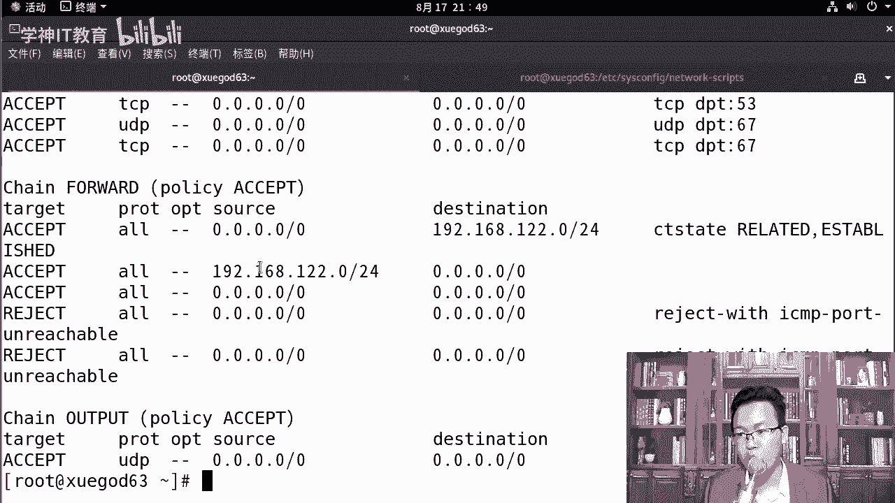
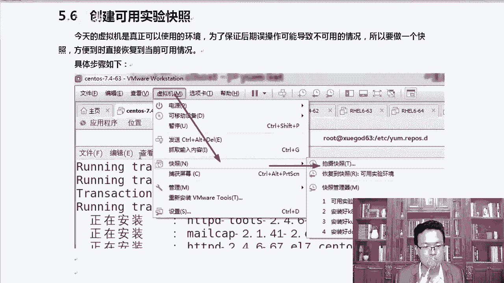

# centos8／Linux／运维／网络运维／RHCE／红帽认证云计算／2020全新独家教程-centos8操作系统从入门到精通 - P24：3-关闭防火墙-selinux-开机自动挂载镜像-配置本地YUM源-创建可用实验快照 - 学神科技 - BV15V411z7tK

大家好，我是MK。那么接下来咱们把这个访问墙给它关闭一下，好不好？也同样也设置它开机不启动，怎么去做这个事情呢？可以这样sCTLs team cTL这个大家一定要会打啊。

然后states这几个命令大家一定要什么star status啊，一定要记得很熟悉啊。😊。

好，当然你记不住，也可以按table补漆。然后防火墙的话就是fi。呃，我们可以直接把它给关了啊fill。World。看到吧？你可以看一下，它处于active运行状态。那你要可以给它关了。那关之前呢。

我们可以通过IP tables杠L是列出所有的规则。杠N的话是不将IP解析成域名，这样的话显示的会快一些。其实大家可以看到默认有一些规则。你看input这个地方，当然一般情况下，你看都是accept。

都是接收接收，代表我们都放弃默认规则也是accept。

对吧当然有有什么有几个reject好吧，有几个reject啊，比如说SAMPport或者reject with等等。O看这是for的转发的过程中会有几个东西。那我们要把它关一下。

这样它就没有这些初始的规则了，我们就可以畅通无阻了。因为大家现在还不会这个fa word，不会使用。快速的给它关一下，关完以后再看。那这样的话就是没有那些条条框框了，只有input是个链。

forward是个链，output也是个链进来的好，output出去的forward是转发的，没有任何规则，默认规则都是accept，那就相当于没有任何规则了，我就可以愉快的去使用它了。好，关了它以后。

下次我reboot一重启，这个防火墙又开了。所以我们干脆在这里s。呃，team CTL。做一个什么不让它开机启动，那么写上dissable就行了。好吧，diable far world，稍等啊。

Fair。World。这样就可以di呃diable对吧？就是开机不启动了。我怎么知道你开机启不启动呢，那你可以 is怎么样？is enableable你是en的吗？谁呢？fa word那回车它会告诉你。

我不是enableable的。如果你是开机启动的那会它会显示SSD，比如说SSD这个服务，我是开机启动的那它会显示的你是enable。😊，那通知大家就知道到底它有没有开机启动了。知道了这个以后。

那么还有CteCTL其实它还有好多东西啊，你看。CMCTL里边有这么多的命令。所以并不是需要每一个大家都知道知道的。有一些东西大家看一下，接下来这一个。YouT u teeth。好。

这些你看这些东西大家了解一下就行了啊。还有什么呢？呃。😊，来，还有一个是。Its enabled。我给。列一下啊。

看一下。我们需要掌握的是这种用法，startop关闭什么样的服务，star开启什么样的服务，diable开机禁用那个服务，或者is a is enable查看你是不是开机。如果你想让它开机。

你就写enable什么。如果你不想让它开机启动，那你就写diable给它关了，那么除此以外，还有什么list。那么这个地方可以列出所有启动的所有启动的unit，也就是启已经启动的这些服务。

还有list是吧杠t service，只列出service类型的这些东西大家知道一下就行啊。了解一下下面这一个地方。重点是上面这几个步骤，一定要知道，我们彻底已经将fireairwork防火墙关了。

关完以后。

那我们要看一下SElinux啊，你也要给它关一下SElinux是干嘛使的，它可以让你的服务器变得更加的安全，说的挺好用的，但是呢。对，但是你用起来可能有各种各样的问题。因为Slinux它有上下文操作。

知道吧？它有各种各样的上下文，你看。😊，你就知道他不好学了是吧？因为我给你写了三个汉。😊，啊，写了三个汉字是吧，你知道什么叫都认识上下文指的是什么，不知道。😊，好吧。

所以这个SE Linuxux先暂时我们给它关了。那么在后面我们讲linux安全的时候，再去详细的加强一下这个名字听着挺牛的啊，就是linux加强就是把linux变得更加的安全。但是它的使用规则。😊。

使用的核心思路。有点难啊，尤其是上下文这个调调这个上下文的时候，所以工作中其实Slinux一般情况下我们是不开的啊。

咱们是不开的。好，我们来看一下。Get。infor其实S Linuxux它想代表的是什么作用是吧？我也可以给大家说一声啊，你比如说防火墙这种东西，它是怎么让我们的服务器变得更安全。对于防火墙。

我们规定了什么允许。😊。

IP什么访问。是吧访问是吧，访问某个IP。然后冒号端口。对于防火墙来说，我们就是说允许某1个IP访问我们什么。那么SElin能干嘛呢？好，Slin它不是管IP它可以这样，它允许的是允许进程。

比如说什么呢？允许我们的进程IHDDPD就是阿帕奇允许这个进程怎么样？😊，读什么文件？读或者写写什么呢？写A点HCM。你看在这里我允许了阿帕奇可以写A点Hname。那么谁呢？比如说过来一个NG。

那NG还能读写它吗？如果我没给你权限，那么NG就不能写。所以S16它做的更细致了。😊，知道吧？他做的确实更细致了，因为他能对某一个进程设一个规则，允许你这个进程读我这个文件，你才能读，你不允许。

你就即便你是root啊，你运行的那个东西，那都不好使啊。大家知道一下，一个是允许IP的，一个是允许什么IP或协议的，好不好？那么这个地方更多的是直接上来进程和文文件。😊。

对的这个力度更细一些。get in force弹出in force说明什么？嗯，inforcing意思是说我们是开着的，我要给它关一下，临时关的话是set。inforce0，这叫临时观。

那临时看 get in force，那临时关完以后就变成了permissive意思是。我虽然开着，我也给你报警，说什么什么进程非法访问了我的文件，但是呢我不阻止。只是喊个口号而已啊。

这种那如果你想如果在这种情况下，你想给他开的话，那就s把零改成一就行了。😊，就又开又开了。如果你想彻底的给它关了呢，那你需要这样啊。😊，S1 Linuxux。好吧，打开这一个configur文件。

打开以后呢，SE Linuxux这里有inforcing看到了吧？把inforcing删掉。我删的时候怎么删的？知道吗？一下子闪的，摁下什么。还记得我给你讲的VM的快递方式吗？

我想将inforcing后面全都干掉，恩详什么。对，大写的D。学会这一段了吗？按下大写的D就可以了啊。😊，那S Linux等于什么呢？等于这个diable给它。好吧，你看这上面其实给你有说明啊。

promise you是只是打印警告，并不。怎么样并不inforcingin enforcing就是真正的是吧，给它强制关了啊。好，然后呢Slinux Slinux这个地方typeap类型targe。

targe的是目标嘛？好吧，你看基于进程的这个保护，target proxy， proy是进程，protect的是保护。除此以外，还有一种还有一种是什么呢？看这还有这两种，好吧，这两种的话。😊。

我们这种大家用的太少了啊，这种用的太少。我们重点聊聊这个MLS。也许这个你我说一说你还能理解一下，知道一下有这样的一个规则就行。mary levelmarty level是什么？多个等级。

多个等级的seity安全protection保护。😊，见过这种东西吗？啊，比如说军队里面。好不好，或者说比如说神盾局，你看过这个电影吗？复仇者联盟。对吧比如说我是福瑞局长，我是局长，我十级特工。

你是5级特工，他呢是6级特工，6级特工就能看6级就是6级以下的这些什么加密文件。我是十对吧，我是个5级，我是看不到6级加密的这些文件的。😡，现在你能懂了吗？啊，所以课外片里面那些东西离咱们也是挺近的。

明白了吗？对我们的安全部门呢也分等级，你是几级，我是十级。那就OK了，本人实际啥都能看。是吧无论是苍老师的文件啊，还是MK老师的文件，都能看。好，拿到这个东西，如果真的想给它关了，你得reboot。😡。

才行。啊，你得reboot才行啊。好，这叫临时关闭。我们先不reboot啊，大家自己做的时候，你们自己reboot一下啊，自己要rebo一下。我这瑞特就太慢了。除此以外，我们还需要设置一下光盘。

可以开机自动挂载，这个一定要认真的去听。

为啥？😡，因为你可能把系统搞坏。信不信？很多同学在修改FFStable的时候都把系统搞坏了。首先有一点啊，你的光盘是在着的，看到吧？我这是已经加载了啊。

那么光盘里面镜像文件里面有写的sometoS8的1个SO镜像，我是有这个镜像的。😊。

有这个镜像呢，我挂载的时候才OK啊。好吧，所以你这个镜像一定要让他经常。那么做这个操作怎么做呢？好，在这里。大家能看得出来吗？前面写的是UUID这叫什么？呃，对被挂载的呃，挂就是需要挂载的东西挂到哪儿。

这是挂载点。然后呢，文件系统类型的写上去，然后default是什么？然后default后面是00。他就是这样一个操作，我们需要写的是什么？咱们的光盘镜像在哪里呢？在这里。DV下CDroom。

如果你不知道，那你就直接这样把我文档里的东西复制粘贴上去就行啊。别你手动的时候打的时候，比如说CDroom，如果我打错了呢。我打成这样了。好不好？重启的时候。你的系统就起不来了。

系统会提示你有一个设备挂载不上。因为操作系统在启动的过程中，它要怎么样尝试去挂在根，能挂上，挂在bo也能挂才上到挂到你这的时候挂载不了了。甚至有同学把根是把这个UID给删了一点。😊，那根都挂盖不上。

怎么能起I系统呢？他就会给你报错，好不好？我们的。格式ISO的格式文件的格式叫ISO9660。听楚了吗？光盘也有也有自己的文件系统，光盘的文件系统叫做ISO9660。不是你说的是EST4，也不是什么啊。

叉FS，它就是SO9660名字。然后呢，后面这两项都默认就行。好，保存退出。就直接默认就可以了啊。😊，我来保存一下。没有通，我怎么知道我对了还是没对呢？😡，啊，你可以这样啊，youmount。好。

我怎么知道我写的对还是不对？除了重启，我又把它重启完了以后，把系统搞坏，那你可以先Umount一下。😊，好，Umount完以后，MNT是没有东西的，没有东西，然后我们执行。Mot哎。对。

mart杠A回车回完车以后，他会告诉你看mart的是mountt杠A会怎么样？只要自动挂载，自动挂载的时候，它会直接去读什么读我们。ETCFStable里的内容。那我在这里面写的很清楚。

我说CD要room要挂到MNT下，结果呢对，结果他告诉你已经挂了，然后呢，它是只读状态，光盘就是只读状态啊。MNT你看一下，确实挂在上了。这就没有问题，说明我们的挂载成功。那这个时候你就。

放心reboot的时候，你不会报错。好。那么再往下CD的MNT下，如果我想touch1个A点TNT能成功吗？告一不可以好吧，它是个只读的文件系统，不可以。明白吗？因为它是个光盘ISO镜像文件。

看着好像有很多目录，不可以。好，退出一下啊。大家要知道一下，因为它是光盘文件，你往上刻是刻不了的。

只能读啊。所以我们看看什么。对，那种盘就是没有被写过数据的盘，那种是可写的盘。啊，你可以通过RWRW那个DVD是吧？往光盘上写这样数据，那需要专门的软件啊。我们配做完这些东西以后，配置一下本地的样源。

配置本地y么源ym的一切配置信息都存储在于啊，在什么在ym点res点D的这个配置文件中啊，通常都位于这里面。我们不应该叫y么啊，这个地方。通常一切配置都存在什么什么什么reple。的配置文件中。

这些配置文件通常都位于什么？对，这些。点report。XS那是。来点reple。😔，文件好不？通常位于我们这里面，我们来看一下。

当然stoS8，如果你默认装完系统以后或者77也是一样的。你默认装完系统以后，它里面就会有这么多的东西，这是stoS自带的源，这些自带的源都是可以用的。只要你能上网。

所以默认情况下我们是不需要配置样母源的。

有同学老师，我们配置一个国内的圆会快一些是吧？我告诉你配置国内的圆也不低。😊，不一定快，好吧，看着yinst HDTPD。😊，那么当我们再去回车以后，咱们可以看一下啊，你跟我显示的是不一样的啊，上次远。

我们来看一下哦，你看这里上次原数据检查的时间，就是你他会哦。所以他不用你去配它了，为什么呢？因为在这里面大家可以看一下这个配置文件。我带着大家看一下这个配置文件啊。呃。

APP stream吧或者base吧。spaceace是基础啊基础包。那么VM打开这个配置文件以后，那大家可以看到。为什么我跟大家说，我说你你也不用怎么样自己去修改这个配置文件。

非得指定一个国内的源才行。以前我们在s屠S5和stoS6上确实需要指定国内源。因为以前我们的配置文件里面直接写的就是baseUIL等于谁，等于stoS，就是他直接就把地址给你写死了。啊。

那么从s态S7开始，一直到s态S8，默认的源是采用的是mirror list， mirrorrror是镜像，list是列表，它是一个镜像列表。这个链接的话它是一个列表。打开这个链接的话，它里边有全世界。

怎么样？全世界来自于各地的样员啊，中国的什么清华的、阿里的啊，网易的、华为云的都在这个列表里面。他能要么在运行的过程中是吧，它会自动。清楚了吧，他会自动去。调用一个插件，那个插件叫faist。啊。

fast的 mirror它会自动调用这个插件，这个插件会快速的拼一下这里面。啊，所有的镜像列表会拼一下，相当于是拼一下。拼完以后，谁给我的反馈最快，我就优先用。什么呀优先用那个镜像。

所以你不用再配国内的圆了，明白了吧？因为比如说我在北京，我可能用清华的，用华为的会快一些。那你在上海，那你可能用的阿里的会更快一些啊，所以有时候你每次执行的时候，尤其在7项，你每次安装完了以后。

你要注意一下，他走的那个圆可能是不一样的。好，这是里面的这些问呃，you。Ss young。配置文件这些样目的。样么源的配置文件主要的话在8里面有2个APPstream和base。这两个啊。

我们来看看这两个有什么不一样的地方，包括我们在7项咱们应该怎么做。好，在7项我们配语言的时候是这样的，因为我现在是在八项啊，在7项。😊。

基于光盘镜像创建一个本地样务源，创建一个新的样本源配置文件。那么样源的配置文件必须是点reple文件。八和7配的时候是有一点不一样的。整个文件的格式是一样的，只是路径可能不太一样。那我们做的时候。

我们可以先把这个东西都移走。如果你在七下想真正的体现一下，比如说本地样园。

那个效果，因为如果你有外网的源，他会优先用外网的。好吧，我们先把它移走大写的C芯儿，这样的话就是以C开头的这些文件都走掉，而且是大写。正好这些文件都是大写的C开头的。移到OPT下以后就干干净净的。

那么我们需要比如说我在这里需要创建一个sS7点repo。😊，抽奖完了以后，VIM插入插入。对于7的话。我们需要插入的时候，用这个stoS7，然后name是什么fi，直接写到mount。

这个mount是光盘挂载的路径，直接写到这个路径下就行。以内部东西一保存退出。然后去执行我们想执行的这个操作就行了。来，在我知情之前，我把这个配置文件里每一项再给大家详细的说一说。

三S7它是一样元的ID必须为一。那么s name等于sto S server，这是描述，描述的话可以随便。这个东西如果你有多个圆的话，这块必须为一贝aseUIL等于MNTMNT是光盘的挂载路径。

你别看后面是三个杠。啊，前面两个是给他使的，后边那个杠是跟下的M问题啊。如果我们就是base这一块有几种写法，有三种写法，你可以写直接写路径。如果你是比如说我是本地的一个什么操作，那你可以写这个。😊。

呃，或者你走的是HTTP的。后期大家在局域网里也可以自己安装一个阿法器啊，把光盘挂载到阿法奇的根目录下，然后你可以写HDTP写个这样的操作也是没有问题的。😊，OK这个是什么呢？

这个东西是基于web的服务提供的一个样本源，你可以写基于外b的，你也可以写基于FTP的方式。都可以啊，写其他的时候都是后面两个杠。那么本地的时候记住是三个杠。enableable的话是代表启用。

如果你给它改成零，表示我这个圆不启用GPG check等于00的话是取消密钥验证。如果唯一表示启用密钥验证启用的话，那你就得导入一下密钥。

如果你没有的话怎么办？没有的话，导入一下，一般情况下都有。一般我们在安装语的时候，比如说sto s base打开这个文件。他有啊。看。你的本机确实有这个GPG这个K。

OKRPMGPGK生通Soff干嘛使的？😡，这是somS官方给你提供的一个，你可以打开这个看一下。而且是public，肯定是public啊，就是36S它提供了很多阿片N包。

包括red hard也提供了很多阿片包。我怎么知道我的PN包是对的还是错的？😊，我需要校验一下。怎么校验呢？操作系统可以怎么样让我们自动调用一下这个帕lic卡。OK公钥加密私要解密。对不对？

我对我的包怎么样稍微拿私钥，sS官方组织拿私钥稍微加密一下阿RPM包里的一个特征码。然后呢，你拿你的public是吧去解。如果你能解开那个特征码，那就说明你这个包是没问题的。如果你解不开那个特征码。

他说明你这个包可能被人篡改过，能用吗？也能用。只是告诉你这个包可能被人篡改过，你自己愿意用就用，不愿用的话，那你就别撞它。这样的话能够有效的避免什么别人恶意的篡改stoS官方的包。

公钥加密啊，不是私钥加密，公钥解个密就行。

所以你想用的话，你就需要把这个密钥导一下，导入密钥的话。杠杠import一般这个密钥在样目源的reple文件里面都有啊。回撤。这样就可以导入这把密钥了。

好。看一下有没有问题，同学们。

我们来看一下。退出了啊。那这些。

没有问题了。在这儿我们虽然配成功了，其实我们是不能使的。大家有没有发现，因为我是八里面的，不是七里面的啊。导入RRPM。公药。如果你开启了，如果你起了，你可以给他导入一下啊。

来，我们执行一下吧。配完yM原来以后，你什么，你可以y直接安装，你你也可以y clean。因为ym本身有很多的缓存，ym clean二是清空ym缓存，清空完了以后，你可以ym list去展示一下。

你觉得我们能list出来吗？啊，肯定累死不出来啊，你看他跟你说失败了是吧，他说什么呢？说我们找不到是吗？你看。😊，看not download，我找不到reple data下的这些东西。那它里面。

所以说这个东西很重要是吧？reple data。要么能不能工作成功，或者说我们在写文件的时候，到底应该写到哪儿？取决于这个repo data。看到了吗？我们MNT下有re data的个目录吗？

我给你讲过来啊。并没有好不好，但是在生屠S7的光盘镜像下，reple data是在什么？是在光盘的根目下的。啊，光盘的这个一级目录下就有repo data。咱们8是在哪呢？8是在这下面的？

比如说APP stream，它给你分了两个，一个叫APPAPP是什么应用程序，base是什么基础的基础的包啊，对以相关应用程序的，你看在这里。😊，好吧，所以我们八里面写路径应该写到哪儿？对。

应该写fill后面应该写到这儿。还有一个是这样的那你要写两个。他给你分的清楚了一下。看到了吗？base里面的一些包和APPstream里面一些包，你像。

被子里的一些包都是一些ZLB啦y啦，就是操作系统最基础最基础的这些东西，什么t命令了是吧？😡。

O。都是这些东西。APP stream。Package。看到了吧？有同这么多，我也不认识啊，那我给你过滤一下啊。😡，比如说谁N万服务器。看清了吗？对，比如说我们的NG就是应用程序，那它就在这里面。

而且8里面是吧，已经把NG1。16这个版本自动是么给你集成到这里面了，非常棒啊。😊，啊，1。14这个版本已经直接集集成到。呃，系统里面在7里面NG没有直直接集成到系统里啊。

包括我们的阿玛奇2。4，就是新的版本已经都集成到这里面了。好。当是这个方法是一样的啊，这个方法在7下是完全可以用的。所以大家要想在7里面去做的话。把光盘挂载上，挂载上VI创建一个这样的文件。

创建完了写上这几条，复制粘上这几条就行了。7里面直接写到MT下就可以了。学到这一招了吗？😊。

好不好？需要的话敲个一，公钥有同学老师哎，这个公钥是从哪儿来的？😡，这个公钥的是这样的。系统自带的。你装完系统以后，在ETCPKI这下面自然就有。明白吗？好不好？如果你的公钥都出了问题。

那不就是出大问题了，所以公钥在光盘镜像里面就自动给你带了。当然有时候说，如果你安装的是一些特殊的源。啊，比如说我安装的是个reis，或者说我安装的是个。呃，其他的啊。

比如说安装的是jekins持续集成相关的一。啊，一些东西或者说我安装的是个get lab。那你安装的时候用get lab的源get lab配置文件里面会给你一写一个dkins那个路径就是他给你的源一定是什么HTTP冒号什么什么什么什么什么。

啊，那你就RRPM后面直接跟上这个HTTP的链接也可以。后面是可以跟链接的。总而言之，一句话，这个缘一定是在你的什么。

样么源里面你装完以后，他会样么源的配置文件里会自动告诉里边会写清楚的。看一下8s在s度S8上，基于光盘镜像创建一个本地的样务园。那么在s度S8光盘镜像中，我们把样目的软件主要分成了两部分。

一部分叫做base OS，一部分叫做APP stream。说到这儿，我我我想感慨一下啊，其实大家跟我学课真的挺值的。因为你学的是桑通S8，结果你把6783个版本都搞定了。😡。

而工作中确认的6783个版本会同时存在一段时间。因为有一些很老的服务器。他可能还在用怎么样，还在用桑腾S6。专玩那些服务。那么一些新上的，比如说近期新上的一些服务器，那么肯定是送到S7了。那漆完了以后。

接下来生通S8妈妈也要一两年以后是吧，也要用。好，因为staS8也更新了一些新的特性，慢慢也要逐步被用上。所以大家需要了解一下这个东西。你就能融会贯通。在sS8中统一的ISISO自动加载什么？

要加载的是这两个安装员的库。OK所以我们要在什么呀？啊，所以我们需要创建分别去创建这个reple。那么这两个库的作用baseOS存储库，它是以传统的按片包的方式提供底层核心的操作系统的一些东西。

APP dream那么给用户空间运行的一些应用程序，一个是应用程序，一个是基础库。还有一个有时候你经常看到一个什么express就附加库啊，额外的一些库。

那我们来写一下啊。好，你现在也知道该怎么写了吧。😊，来LMNT。A， P stream。要分大小写的啊。你知道要写到哪个路径吗？看这儿你能看到reple data了。

那这个路径就是我们手动配置样本源的时候要写的东西。所以我在这里。VI打开s动S8，打开以后呢，咱们插入一下，插入的时候是这个。一般情况下，我们自己本地的包其实是没有GPGcheck等于零这于说的啊。

就不用写。所以你可以写C8是吧，送到S8media，然后写上写完以后写baseb写那。跟7唯一个区别就是7直接写到MT写一个就够了。那八里面它分了两个库，那你就写成两条就可以了。啊。

至于下面这个GPGK有没有东西没关系，因为我这都不检测了嘛。😡，OK另一个是要写到APPstream上的。好，这些写完以后保存退出。那么7因为是没有用的，所以我们把s7reple给删一下，你要删一下啊。

要不然它导致你8也不能使啊，还得保存。这个大家能理解吗？好嗯。那我们来执行一下这个命令啊。Yum in store。LRRCSD。安装一下。快速的安装一下。这个是加载一下一个缓存啊。

他会读取一下样母源的缓存。因为这个包我其实之前装过，你看他告诉你不需要任何安装。如果我们装一个没有装过的，比如说。HDDBD这是阿帕奇。你看这样的话就问你。

整个安装的过程中，大家可以看看一下啊。

呃，依赖的包是吧？HDDP你要装这一个包，那么它还有很多依赖包，这些依赖包也会自动被解决啊，这是样子的好处。然后这个时候大家输入Y回车就可以直接装了，我就不装了啊，这说明我们是没有任何问题的。

好，既然本地样本原始没有问题，我们可以怎么样？咱们可以将OPT下这些。再移回来。那这样的话呃，本地和怎么呀，和外网它就同时了。但是实际上即便这样如果是同时的话，他会优先用本用外网的。

因为外网的包会比较新一些。

他会优先用外网的啊。这是配置方式。配完以后，大家记得做的时候，你先把它删一下。明白了吧？而且路径一定要放到什么repo data这个路径下，其他路径。😡，你别随便放，一定要放到ETCyreple点地下。

然后VM打开打开这个东西就可以了。啊，删删完以后要我们去安装。好，呃，安装完了以后，将我们之前移走的文件再移回来。后期我们还是使用外网的样源是比较方便的，而且它自带的源完全可以满足我们的需求。

大家要知道。自带的这个圆好不好？就是。

你看一下，我自己写了一个base，和人家那个base一样吗？本地的样么园的base，我们不是说bder新旧啊，就是说数量是一样的吗？APP stream和base。😡。

你光盘里面的和这个比如阿里或者说网易上自带的这个一样吗？当然是不一样。阿里和。什么阿里和网易。包括sonS官方，他们自带的base和APPstream要比我们光盘镜像里的多一些。知道吧？

因为salS还有一个镜像叫做everything，包含一切的一个镜像，大概是11点多个G吧，我记得。😊，所以是不一样的啊。

所以你还是用外贸的，因为有些东西它在光盘镜像里包含了，有些就没包含。因为那样的话，镜像太大了。啊，但是人家做的那个原是有的。看还有什么疑问没有同学们。那如果没有疑问的话。

我们这个时候就可以愉快的做一个快照。因为到现在为止，咱们一切都搞定了，我们在这里创建一个环快照。今天这个虚拟环境是真正可以使用的环境。后期我们所有的操作都要基于这个来做了。

啊，你每次实在搞不定的时候还原一下，实在搞不定的时候，还原一下这个快照，自己去拍一个快照会拍吧？虚拟机快照。要拍一个拍照。我们来总结一下。

这是MK老师分享给大家的内容，内容比较多，最终落脚点落脚一个可用的实验快状。因为后期你确实会遇到好多东西，你自己都不知道自己哪错了。第一遍做的时候错了。😡，然后呢，也没找出来是哪的问题。

接下来接下来恢复了快照，然后呢重新做了一遍，这样做成功了。你觉得好神奇啊，我告诉你那个一点都不神奇，为什么？那是因为你对这个知识点太陌生了，你自己哪个地方做错了，你自己都不知道。😡，明白吧？

就像大家考试的时候。检查了一遍考卷，觉得每一道题都做对了。卷子发下来考到是不能说考60分是吧，只考了90分，那十分你就没看到，这很正常啊。所以大家嗯在学习的过程中做错了，做错了，重新恢晤快照。

重新再来一遍。😊，没有吧，有同说我这个时候看一下日志排一下吧，你还没到那个层面上，你犯的那个错，无非就是1921681。63，本来配1。63，你配成了什么？😡，对你你写的成了2。63。然后排不错。

排半天是吧，排不出来。很正常的事啊。好吧，我也遇到过这些问题。所以这个时候大家一定要多练多做，而且出了问题，一定要怎么样自己动手操作一下。只有你自己经过实验验证出来的那才是真最正确的事情。😡，好。

稍后我们来组装一台服务器。

