# centos8／Linux／运维／网络运维／RHCE／红帽认证云计算／2020全新独家教程-centos8操作系统从入门到精通 - P25：4-X86服务器-小型机-大型机概述 - 学神科技 - BV15V411z7tK

大家好，我是MK欢迎你来听我的课程。那么今天MK老师要跟你分享的是关于硬件相关的内容。我们在这里要详细的去介绍一下咱们这个服务器。因为现在的这些服务器的性能其实已经颠覆到你的人生观了。

因为在我讲这一节课之前，很多同学可能还停留在，比如说最简单的服务器的内存，你觉得现在服务器的内存最大可以支持多多少了啊，多少了G有同学老师，你的机器是吧？32个G已经非常厉害了。

你知道服务器的内存能达到多少T的内存吗？😊，对，现在服务器的内存已经可以按照T级别来算了。所以你可以看到这个CPU的有多强悍了。那当然有同学老师，我是8核的，或者CPU已经很厉害了。

服务器的CPU已经能干到几百核了。所以我们今天呢通过这节课程让大家对这个服务器有一个清楚的认识。当然有同学老师工作中，我们是不是就是天天组装的一个服务器，硬盘坏了，我们就自己换一换。不是啊。

那么作为linux云计算架构师人员，其实你不需要硬件坏了，并不需要你去换。因为有IDC机房的人可以帮你去换。但是呢这个服务器它到底是怎么组成的？里边有什么好东西，这个你是需要知道的。

否则你连跟人家沟通的时候，你都不知道该怎么沟通。😊。

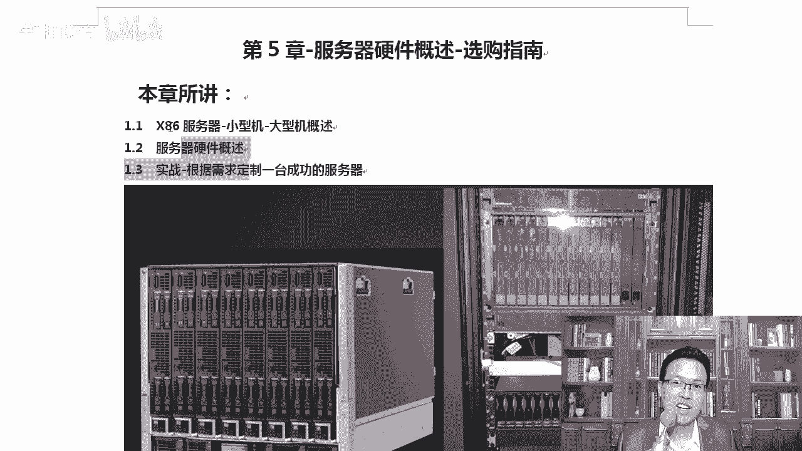

懂不懂？所以呢这个内容不需要你天天的去组装服务器，但是服务器里有啥服务器常见的性能参数，你的服务器需要扩展内存了，应该扩展什么样的内存，不是说随便买个金士顿的内存就能装上去的。

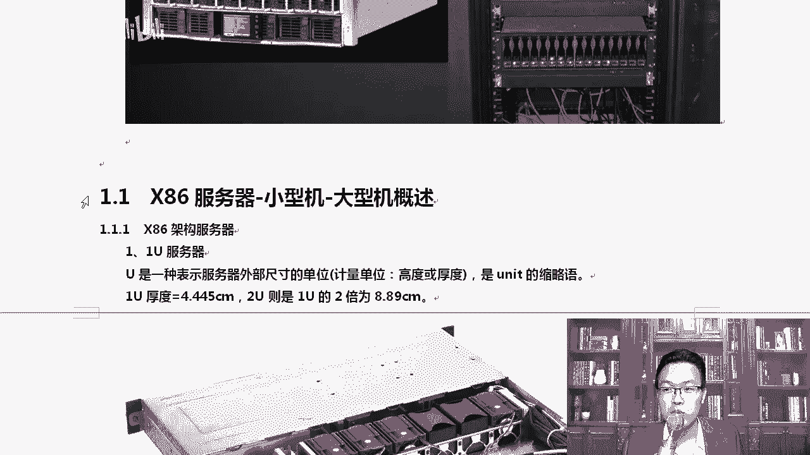

明白吗？也不是说你笔记本上的内存拔起拔下来也能装到服务器上。😡，那我们来看一下，首先我们先从叉86架构这个服务器去说起。然后小型机和大型机，那么叉86架构是什么架构？

就是普通我们所用的这些机器都是叉86架构，包括你的。呃，包括你的笔记本也算是叉86架构，你的台式机都算是叉86架构。小型机跟大型机同叉86服务器最大的区别就是什么呢？

小型机和大型机上用的CPU我们经常用的CPU是什么？英特尔AMD。好，AMD骁龙对吧？还有AMD锐龙英特尔的I5I7I3。这些CPU那它都属于叉86架构的CPU。

那小型机和大印机上通常比如说像IDM的power系列的CPU，你要知道CPU是分架构的，你手机上那个CPU。是什么架构的？比如说华为的。啊，华为的麒麟CPU什么架构的？海思出的是吧？叫arm架构。

明白吗？啊，那arm是怎么写呢？就是AR对它是ar，就是包括我们现在智能机上面的CPU，它是ar架构的CPU就是CPU它也分不同的架构。😊，OK当然不同的架构还有不同的什么？对不同的厂商啊，不同的厂商。

比如说台积电啊出的啊台积电为华为生产的那麒麟，那为苹果生产的，对不对？还有为三星生产的一些CPU包括我们高通骁龙CPU啊，这都是当然高通不是中国的啊。😊，那我们来看一下咱们这里叉86服务器。

叉86服务器还有一个单位叫EU。我们经常说EU服务器，这就是EU服务器，你们见过吗？EUEU是什么？指的是长宽还是高还是厚度呢？来这个EU这个东西它是表示服务器外部尺寸的单一个单位。那么通常情况下。

我们指的是高度啊，不是通常了就一定是高度和厚度，EU一个unit，那一个unit的厚度是多少？是4。445厘5啊，5厘米。有时候有些文件上可能写的是4。45厘米。😊，呃，没有精确到后面第三位啊。

四舍五入变成4。45也是可以啊。准确的话是这么多。2U的话就是两个单位，就是指的U啊，它的厚度啊。那这有同学这个厚度到底是多少？我对4。4也没感觉，4。45也没感觉是吧？

三根手指伸出来三根手指的这个厚度就是1个EU服务器，大概这个厚度。😊，没有了，像我这边，这就是一个典型的EU服务器。那服务器里面通常都有什么跟你的台式机跟你的笔记本其实是一样的，它里面也是CPU。😊。

看这是CPU啊CPU的风扇，然后内存条，然后呢，电源只不过它的所有东西都是扁平的啊，还有一些散热的风扇对应的网口也一样是吧？鼠标的，然后VDA的啊网口网络口的话通常都有两个或者4个。😊。

这样的网口有千兆的，有万兆的网口，当然也有光纤网口啊，它都可以的。那如果有光驱的话，那可能在前面前面板有光驱，有的根本就不带光驱了。你可以通过U盘的方式去装了一个系统，也可以通过网卡的方式去装系统。

这是EU。那么除此以外，还有2U啊，那么常见你看RU的厚度立马就比EU的要厚一些了，对吧？啊，那这个叫做惠普的G8系列的一个服务器，服务器不同的厂商，它分什么？对，分型号啊，G8，你可以理解成是第八代。

然后呢，接下来还有G9。但是同样都是G9。那么前面还有一些呃参数，就跟我们的。😊，呃，英特尔英特尔CPU样I3I5I7，你是I7，我也是I7，你是八代的I7，我现在是十代的I7，那显然是不一样的。

虽然咱俩都是什么？对，都是I7，所以它分不同的型号啊那。😊，对于我这个。这个是G9系列的G9系列的，那么比较新一点的是惠普的什么呢？

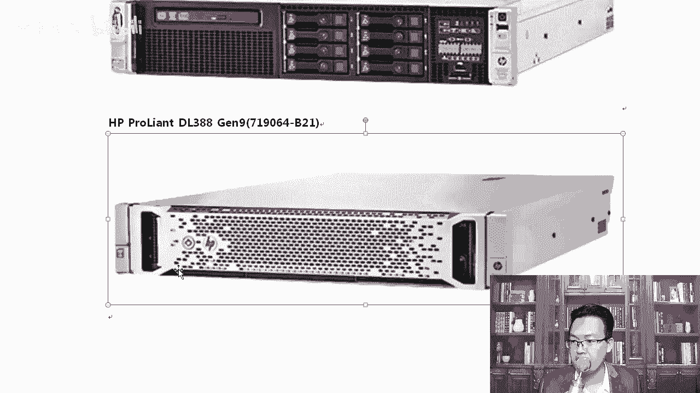

惠普的HPE惠普这公司后来拆分成惠普和HP2个公司啊，拆分了一下啊。那大家可以看到这个地方，惠普的G10的DL380，那前面也有DL388380这一台机器，我们看一下它的硬件参数啊，当然长的样子。

服务器都是这样的2U。对吧前面呢都是一些呃硬盘啊，硬盘的槽位处理器的话，它支持硬ter自强可扩展。呃，支持英特尔英特尔的至强8100系列的啊，6100系列的和4100系列的都支持。那么外形的话是2U。

它的内层最大的时候，大家可以看到。嗯，对你可以看到3T对，这不是什么？不是磁盘啊，这是内存。也就是说它的内存已经可以达到3T了。所以说这个空间是非常强悍的啊。😡，除此以外呢。

还有我们的一些这是啊这是普通的计价式服务器。那还有这种叫刀片服务器，刀片服务器每一个刀就是相当于其实每一个刀就相当于是EU的服务器了。但是它背部有带宽啊，可以插上去，插上去。

可以把这么多的服务器组装成一个。那这样有什么好处呢？刀片服务器能够在有效的范围内放更多的CPU更多的资源。😊。

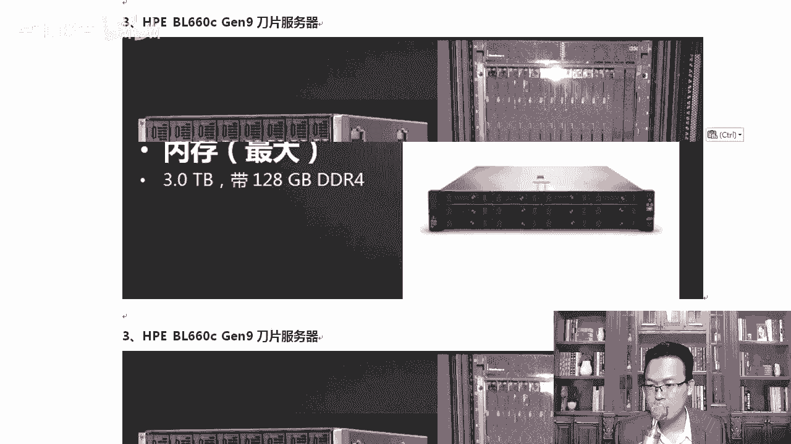

，而且他们电源可以共享。明白了吧，所以他可以在因为机架是有什么呀，是有线的。你放到IDC机房里面，它是按照什么一个单元，一个单元，你是一优的，收一优的钱，你是二优的，收二U的钱。😊。

那我如果能在同样单位里，我放的CPU的数量越多，自然省也就越省钱了啊，这是刀片服务器。先让大家知道一下啊。让大家对这种服务器不要产生陌生感。其实工作中谁天天盯着他看，没有，除了你是IDC机房。

负责专门换硬件的。

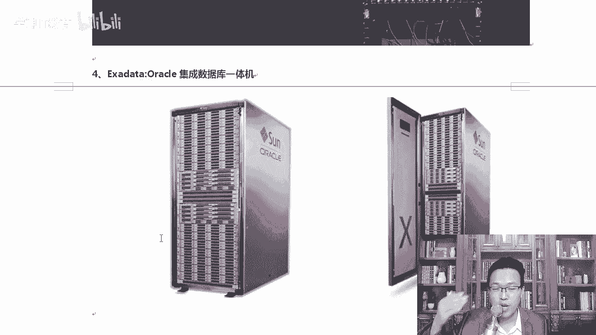

明白了吗？否则没有人盯着看，我们一定是通过叉CL远程去做的。在这里就是把大家那个窗户纸给大家捅破。懂我意思吧？否则有同学天天说服务器长什么样子，我都不知道。那你现在知道了，你可以看一下工作中。

我们一定是通过这种方式。你比如说乌乌克兰的这一台机器，那我肯定是在这边直接登上去，我会不会跑到乌克兰的机房去看。实在我乌克兰那台机器硬盘坏了，我可以从。😊。

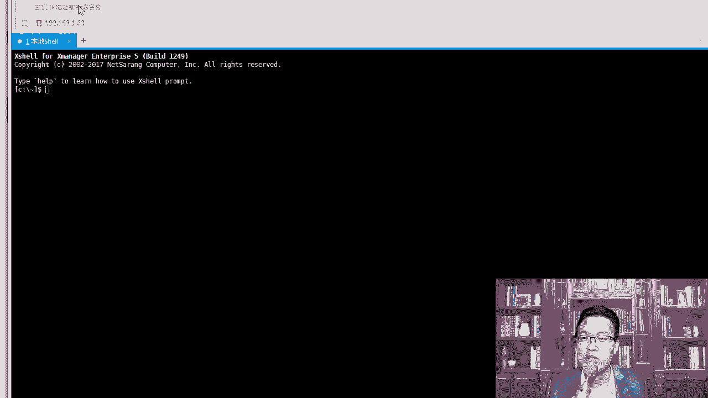

对我可以从海外的网站上买一块硬盘给他邮寄过去。邮寄过去以后，或者我要升级内存。那我们邮寄过去以后啊，IDC机房的人员会自动帮我们去换换完以后，它重启重启完了以后，插摄像连上去就搞定了。😊。

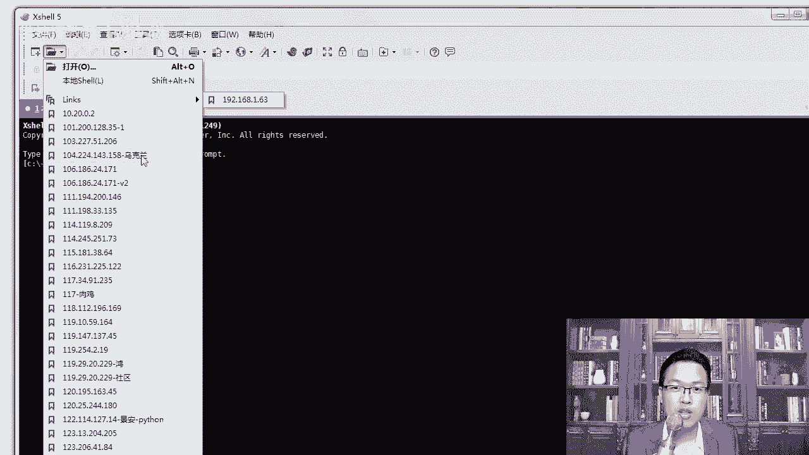

大家知道一下这种服务器的种类啊，大体上除此以外，你比如说oracle的这个数据库一体机。把2口数据库将什么？把22口数据库和这个服务器全都给你搞定了。正常情况下，我比如说我买了一个2口的软件。

你装到那台机器箱，你再啊适配等等，能不能高可用一大堆的问题，再配自己的存储。2口说不用了，我从软件再到硬件，全都给你传一个一体机，你就买我的。😊，绝对靠谱。啊，他出的一个一体机。

那有了这些一体机了以后呢，还有小型机。我问大家个问题啊，到底小型机牛还是？😊，看我们说IDMK1小型机吧，那小型到底是小型机牛，还是说我们这个叉86的这个机器牛呢？😊。

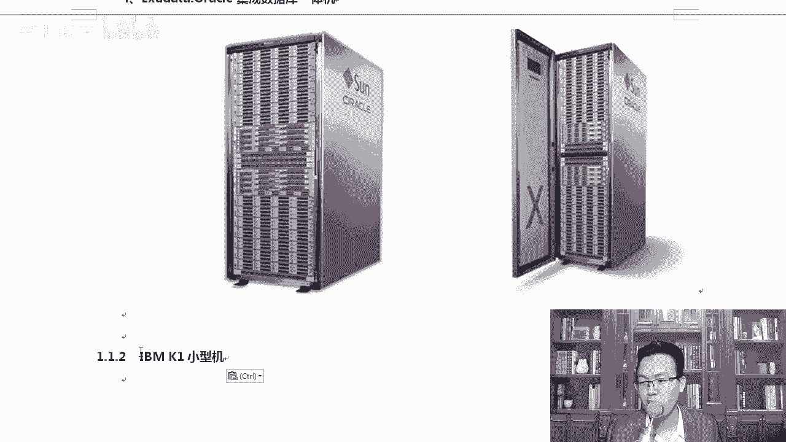

大家是怎么考虑这个事的？对吧有同学我这个已经什么3T了，而且小型机说的就很小嘛？小型机小不小？😊。

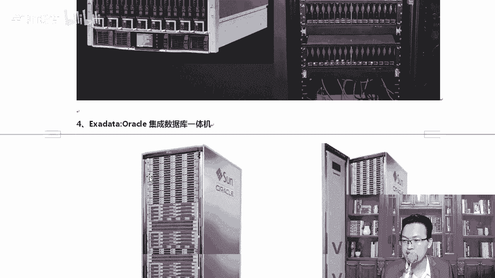

小心机一点都不小。知道吗？说的叫小型机，实际上他一点都不像啊，你看有塔式的，有这样的。呃，小型机OK占用空间比较小，嗯，它是相对于大型机来说的。大型机的话动辄你占一面墙啊，占一个大的房间里。理解了吧。

所以他叫小心机。啊，它是相对于大型机来说，它确实挺小的。但是实际上相对于我们普通的这种服务器来说，一点不小。你比如说图中的这个IBM呃，来IBM的这个K1好吧，IBMK1powerS914那。小型机。

包括我们的叉86架构也有有塔塔式的，塔式的其实就是我们主机箱的这种方式。我们这种称为塔式的，跟我们家用的机箱有点类似。当然还有什么？还有这种扁平这种服务器，好吧。

扁频的这种服务器也是有的那这种服务器的话，它用的CPU你看不是什么IBM用的是什么power9处理器，IBM是能自己造CPU的，明白吗？而且造出来的CPU一点都不比。😊，对。

一点都不比这个呃in特了或者AMD差。平常大家都知道ABM的服务器好牛了。是不是IBM的数据库啊呃，DB two好牛吗？那IBM人家也造硬件，包括think pad笔记本电脑。

不是也是IBM一开始造的吗？😊，那后来是卖给联想了，对吧？它的处理器，那处理器这个地方大家可以看到有单个，还有单个或双个，有同说你就是单核吗？双就是双核吗？这有什么高配的，我都我都8个核了。😊。

这是单盒吗？这个地方指的是物理什么物理的个数，我有一颗CPU是什么？😡，一颗CPU还是2个CPU那他一颗CPU可能直接就干到3030核了。明白了吧，要看你装的是几pro9。

这个CPU直接一个就能干30多行呢。好，一会儿我们详细的是吧，上官方网站给大家看一下它的这个具体的核心数。😊，知道了这个我们来看看大型机，记住啊，小型机并不小。因为有一些同学不是IT专业的。

他可能对小型机还是有点迷惑的。除此以外呢，还有我们的大型机，大家可以看到这些大型机，大型机通常是由一个机柜组成或者两个机位组成。比如说IBM最新款的啊Z15，那么可以有4个机柜组成啊。

我们一步步看一下IBM的这些大型机Z13的话讲的是这样，一个这是一扇，这就是一个机柜，两个机柜可以组成组合到一起。那这样的配置就更牛了。大型机的配置真的是逆天你可以尽情的去想象一下，它到底有多牛了。

Z14Z14看这里啊，Z13啊，Z13使用了22纳米8核处理器，对吧？5G。😊。

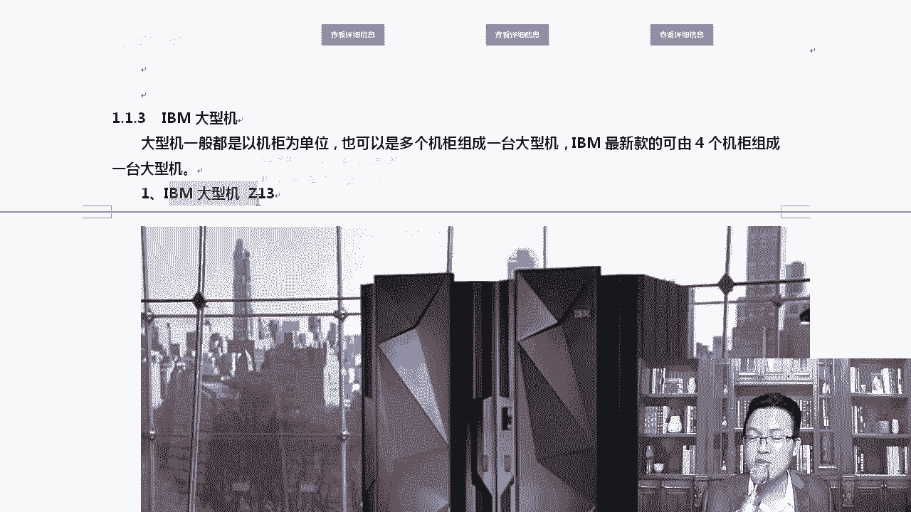

主频就能干到5GZ13号称14，世界上最快的处理器，而且这都是好多年前的参数了。你告诉我，你们现在你们的主频是多少，有谁超过4的？4G赫兹了，就是我们现在主要的CPU。

咱们普普通的主要CPU不就是2点多嘛？啊，2。2或者有的同学干到了3。5瑞平这个地方。😊，也就是什么？也就是这个这盒子而已。所以说好多年前你就能干到5G赫兹了，确实挺快的，而且可以配141个。

那么如果每一个都是8核的话，那么141乘以8想想483十21八得81000多个核心的。😊，能算得清吗？141乘以8大概是1000多个核心。你的笔记本才几个核心。才4个才8个。

我能干到1000多个内存的话已经能支持到实体了啊，我估计现在大家很多人的硬盘都不够实体是吧？它的内存也可以，那装的时候一般装ZOS或者说IH1或者苏usi都可以，这是。😊，Z13让大家知道一下啊。

除此以外呢，你看。能敲个令吗？啊。😮，开来演界了是吧？今天。😊，那么IBM的Z14呢，我们来看一下Z14长的样子跟Z13差不多啊，只是封面设计上有点变化。

Z14的话更强Z14的话使用了新一代的这种大型机技术内存是32T。那刚才那个10体这个32T，它比Z13又快了3倍。看到了吧？性能上又提升了这么多，可以达到170个核心，采用14纳米啊。

使用的纳米数越小，然后功耗越越小，而且在同样的空间里，我可以放更多的。什么更多的这个。集成电路。那主屏是5。2右号称是最快的处理器。Z14可以运行世界上最大的芒果DB与叉86平台相比。

那么Z14它的性能上提供了2。5倍，同样它能支持to刀卡容器。我们的刀cker大家都知道是比较。前沿的一个技术，Z14大型机像同样可以保套卡，可以跑多少个。2、后面6个0数得清吗？

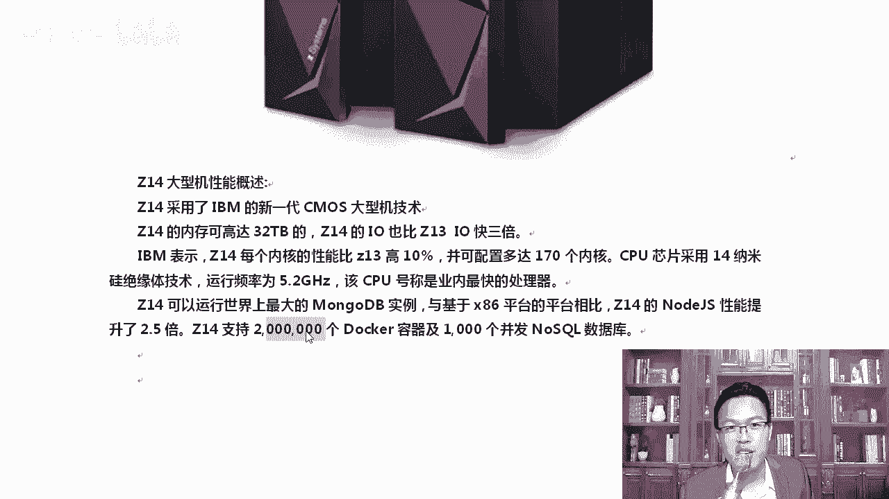

200万个刀壳实力，我一台机器就能跑这么多。京东的那个时候，京东整个平台在15年的时候是15万个docker。16年的话好像是16万个docker。我一台机器就可以跑200万个docker。

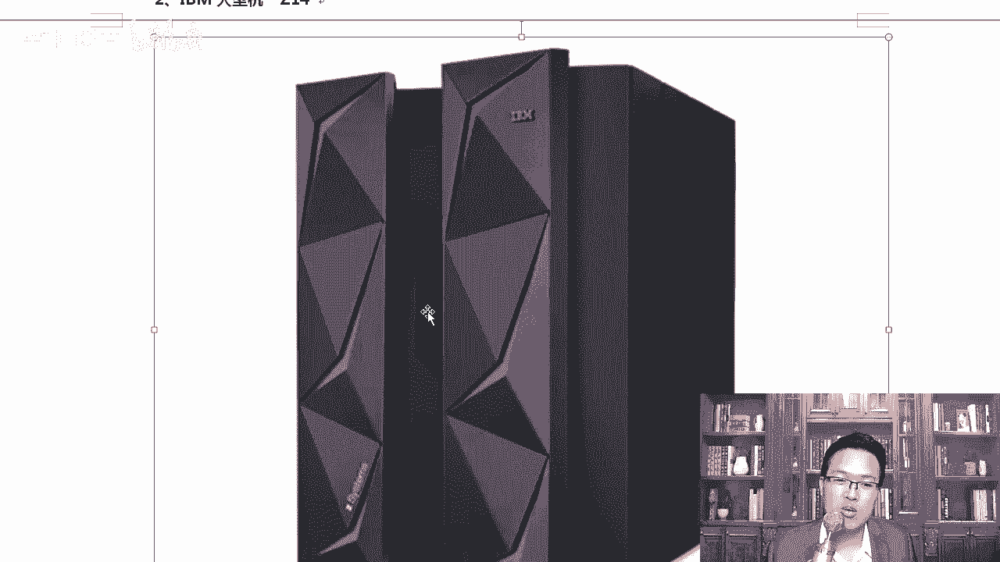

这一台机器就能顶过是吗？顶过多少台服务器了，能顶一个京东的什么平台了。当然价钱也是贵的离谱啊，这个大家放心，确实挺贵的。其实大家不知道啊，就是在呃叉86或者lininux那个时候没有普及的时候。

因为大家做这个技术还是就是可能近几年刚做。你像以前我们搞技术的时候，就是比如说互联网企业。😊，互联网企业往往。

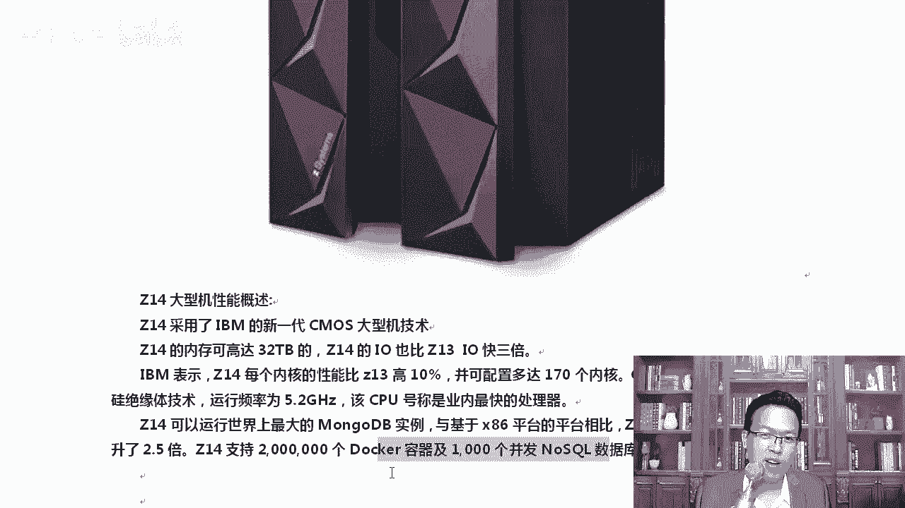

不是程序员，那个价钱最贵，往往就是你买这个服务器是最贵的。因为那个时候叉86架构还是挺low的。大家要上互联网，你想让它稳定一下，一般都是买个小型机，当然买不起大型机，但是一个小型机放到那就好几十万。

😊，是吧好一点的配置，一台机器就干到100万了。你想想你要整整一个互联网公司，先投100万买个设备。很多人是吧就望而却步了。那现在就简单了，现在我们直接上阿里云上。😊，我可能先200块钱。

我就可以先买个服务器就玩。以前不行，你得没有云主机啊，以前你必须买个硬件放上去。明白了吗？我想比如说MK，我想悄悄的搭一个网站是吧？挂一个苍老师的照片上去。😊，我得自己买台机器放到是吧，光环新网啊。

放到呃世纪互联的机房里面。明白了吧。被上按出了问题是吧，直接把你的硬盘往下一拔。硬盘没收了啊，服务器也给你没收了。现在呢现在好了是吧，我直接挂到国外的服务器上，挂到斑万工厂。😊，出了问题是吧。

你也不能跑美国去找我。所以大家对现在的这个生活我觉得挺真的挺棒的啊啊，真很棒啊。而且大家想做一些事情的时候越来越简单了。😊，那再往下还有大型机Z15Z15算是最新的大型机了，Z15相比。

你看又增加了内核增加了百分之这么多，然后内存增加了25%，它已经能干到32T了，那它的内存啊，那就能达到40T了啊，40T与裸机叉86平台相比，运行的负载各方面都多出了2。3倍，可以最大配的核心数是。

你看这里有好几个数啊，就是根据你自己选择，你可以可选。啊，核心数比如说可以配190个，那190原来是170个核心，现在190个核心，那就更厉害了。😊，对吧内存可以达到40T。长得是什么样子？是这样。

有说你这个图怎么那么小？对，放大的是这个啊，我给你缩小了，你可以买一个机位，你也可以买两个机位，你也可以买三个，也可以买4个。😊，好，这是关于这些服务器，大家现在对服务器不太陌生了吧，你就看看这些图。

知道它长什么样子就行。如果有同学说老师，我真的感兴趣，真的感兴趣的话。😊，买台二手服务器自己摸一摸。啊，摸一摸买回来买回来是吧，第二天再退了啊，我不建议这样做啊，你可以什么呢？你可以上你们当地的电脑城。

电脑城一般都有买啊，都有买卖这个二手服务器的，你可以去看一看。😊，二手服务器现在那个价格也很便宜，3000块钱或者2000块钱都可以买到。但是买回来以后，那个服务器的噪声太大啊，你如果你自己用的话。

我觉得你还是干脆买个高配一点的笔记本或者台式机就行。好，这是关于啊这个服务器的一个概述。稍后我们详细说说里边的硬件。😊。

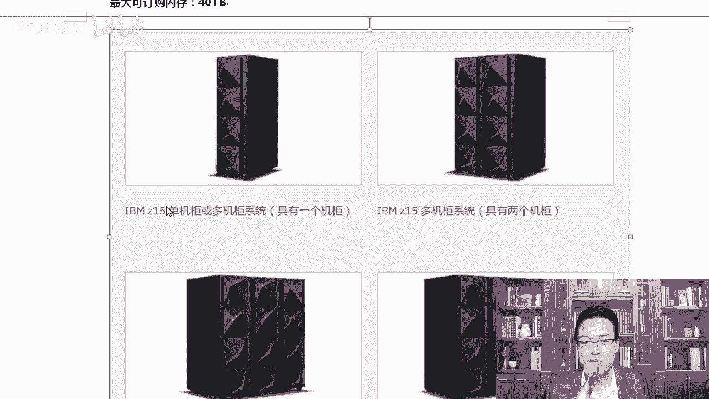