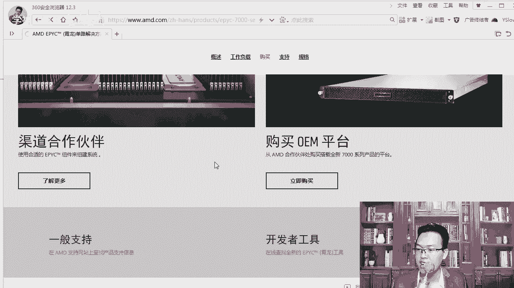

# centos8／Linux／运维／网络运维／RHCE／红帽认证云计算／2020全新独家教程-centos8操作系统从入门到精通 - P26：5-服务器主板和CPU介绍 - 学神科技 - BV15V411z7tK

大家好，我是MK老师。接下来我给你详细的去介绍一下服务器硬件里边的东西。那在介绍这个硬件里边的东西之前，我再给大家互动一下啊。因为我有几个同学提了几个问题，我觉得还是挺好的。在这里我也给大家说一下。

比如说第一个。😊，咱们这么牛的服务器能玩游戏吗？嗯。能不能我告诉你，也许你还真玩不起来，因为没有人这样去尝试过，它太贵了。😡，那没有几百万这样的服务器也有几千万。懂我意思吗？太贵了。

没有人会在上面去玩游戏的。关键是它IBM上装的这个系统是什么？它是unix系统。首先你的游戏得能在unix下跑才行。你说我在上面玩个。😊，玩个王者荣耀，玩个吃鸡。这样玩个撸啊撸。抱歉啊，腾讯告诉你。

我们不支持unux，甚至在linux上大家玩的时候都很卡。😊，明白了，所以别看这么牛的机器，它不是给你用的，这样的服务器都是给谁？他们都是像IBM的这种大型机啊，都是给。😊，给银行这样的业务啊。

银行或者证券公司核心的计算和存储都是给他们去用的，而且是核心业务啊，在这上面去用。那还有一个就是有同学老师这种小型机长的样子跟我们是吧？普通的机器好像没什么区别啊。我我感觉跟二流服务器有点像。

但它的区别是这样的啊，CPU的架构不一样，这上面跑的是小型机的这个CPU的架构。就像你手机上的那个ar处理器。能理解吧？比如说骁龙的处理器，或者说海斯的处理器。

麒麟的处理器跟你笔记本上或者台式机上的那个是不一样的，它们的整体架构就不一样。啊，指令级就不一样，所以运行起也是不一样的，而且小型机上跑的也是小啊跑的也是unix系统。

当然有的时候有一些小型机已经可以支持这个叉86系统了啊，已经有点支持了。好，这个再一个就是有同学说老师我们这么牛。比如说你看内存容量动辄就是1T5T或者4T这么多的内存给谁使啊？

我觉得我的笔记本电脑32G就完完全全够用了。那我来跟大家说一下，32就是我们3T或者4T这样的内存是给什么呢？对，现在企业是不是都在搞这个叫云平台？明白了吗？对，这种云平台，如果我是3T的内存。

一台服务器，比如说是64个G，那我只要架设一台这样的小戏机，然后呢搭一个open stack云平台，在这里面把3T的。资源分享分享出去，那你你能分享多少个机器啊，多少台服务器。对啊。

这一台机器就可以虚拟化出来了。所以说这种东西啊，这种内存一般都是用于做云平台的。而且一般情况下我们也不会满配啊，不是说一定要配满的。那再一个当然这个服务器的价格也比较贵。

咱们是买不到的这是关于好大家提的这些问题，我给大家去聊了一下啊。心里要要有术。

回来我们看看CPUCPU这一块，我们先从。

主板这儿来说，那么单路的什么CPU的主板长什么样子，就长这样的。有同学单路是什么？以前我们都说单核双核还有四核8核，怎么还来个单路。对，这个单路指的是我们一个啊主板上可以放几个CPU。

所以你去跟别人沟通的时候。人家说你是二优，然后接下来你去买服务器的时候，因为买服务器有可能我们作为lininux架构师是会怎么样接触到的啊，公司不用阿里的，我们要自己主张自己的云平台。

你是不是要自己去买一个服务器。那买服务器的时候，你要知道什么是多路，什么是双路。

不仅仅是核了，大家可以看到像这种就是双路CPU内存的话可以直接插满，因为内存现在也不贵。真的。啊，内存也不贵，你笔记本上也一样，能支持32G的，你就上32G，能支持16G的，你就上16G。

你没有必要在那耗着啊。😡，真的。一一个内存条也就多加个500块钱，但是你的性能就会有很大的提升。而且。而且用内存用多了，说真的，他会读磁盘，读的少，同样就帮你节省了磁盘的开销。好，这是我们啊服务器上。

那这种主板你能买得到吗？我们能不能自己组装个服务器，当然也是可以的啊。如果你不会的话，你可以找电脑城，电脑城里有专门组装服务器的，不仅仅是组装台式机啊。😊，组装服务器也是可以的，或者你自己去买也行。

会组装电脑。其实组装服务器也差不了太多。你比如说我们可以买华硕的主板，华硕的Z10PE杠D6，然后D16这是一个双路的CPU那这块板子的话是3600这是我刚刚截的这个新图啊，价格现在就是3600啊。

我们在京东上给大家提供的一个链接，大家可以看一下两个看到了吗？啊，这一块是两个，然后这边插槽，你有没有发现它的内存。😊，插的时候要比如说这一条这边插了一条内存，这边插了一条内存。你得。对称着来插好。

不能说我把所有内存都插到这儿不行。啊，在组装的时候，大家知道一下这一块就行啊。那两个插槽它支持的是英特尔152600V3啊，V4或者V3这样的CPU。以前我们说到这个义务意是开头的只叫志强。啊。

志强系列的CPU在英特尔。服务器级别的CPU都是至常志强系列的啊，我们家用的都是酷睿的，或者I5的，I3的，I7的对吧？现在还有I10I9是吧？I9。😊，好，这块板子。

放大一下，我们来看一下它的样子啊，大家可以看一下。内存内存条对，对称着这边是插几个内存，这边也要插几个内存要对称着来啊。那我们知道了以后呢，再看看，当然他电呃看这。这是网线的接口，通常都有两个啊。

这一块是USB的接口啊，USB的接口VGA。那有通过这个服务器需要加显卡吗？GPU服务器需要加显卡吗？如果你的服务器不是做那种图图片图片或者视频渲染的那你是不需要加显卡的。啊。

除非你真的是需要做那块操作的那另当别论，否则服务器都是集成的怎么样对集成的这个。呃，VGE的接口。集成显卡啊，那这台主板能支持多少呢？这个版子其实也挺贵的啊，3600都可以买一个入门级的笔记本电脑了。

是吧？😡。

这一块板子就3600。那我们来看一下，在华为啊，就是华硕。对吧我们看一下它所支持的这个华硕啊ASUS华硕这块华硕主板的主要参数在这里大家可以看一下。我把这个链接可以。

大家查这种参数一定要上什么官方网站上去查，你不要有同学老师，我们上那个。😡，以前我们上中关村在线会多一些，你们上过吗？中安村在线。对你不用上中关村在线去找。知道吗？你要上他的官方网站啊。

因为只有官方网站给你的数据才是权威的。在这里面写的很清楚，16X16乘以DIYDMM内存插槽可达容量一体啊，支持DD24。那主屏的频率的话，支持内存的频率200兆赫兹。

或者说1688兆赫兹1600兆赫兹。都是支持的啊，非常不错。除此以外，还有RDIMM和LRDIMM这是什么？😊，啊，当然这个地方也给大家打开了啊，大家可以看一下。

在这里中央处理器它所支持的这个处理器都是什么信号的？是么V4。家族产品啊，V4家族产品这个产品老还是不老？一会儿我跟你说一下啊，其实这个产品已经算是老的产品了。

新版本的至强处理器已经不叫什么V2V3V4了，换名字了啊，一会儿我跟你说一说，我们看这个内存吧。😊，这是这是什么内存DD24是吧都常见DDR2。😡，是吧DD241331或者1600G赫兹是吧？啊。

兆赫兹这个大家也都很清楚，容量也很清楚什么怎么还来个RDMM还来个这个UDI或者这是什么？知道吗？嗯，我来跟大家说一下啊啊另外大家要看这实际使用的内存频率会根据CPU类型和内存模块啊有所差异。

也就是什么呢？就是我比如说我这个支持啊，我们支持什么？我们的主板是支持这么大的内存这么高运转速度，主屏是2400兆赫兹的内存。如果你的内存。内存没达到，或者说。

比如说你买的内存是1600的那肯定就是降到1600了。只是说我的路有这么宽，看你能不能跑多快。那再一个是即便你买了主板是支持2400。兆赫兹的，然后你买的内存也是2000兆赫兹。一定能跑到2400吗？

这个大家没想过吧，因为大家以前组装电脑的时候。都是我买一个主板支持，那我就买一个这样的。😡，就可以了，你没有考虑过CPU吧。啊，CPU最终是谁呀？最终是CPU跟内存，咱俩之间对话明白吗？

如果我CPU处理的速度慢了，你内存再快，跟不上。啊，CPU跟不上，所以你要看看是吧？你要去查查你的CPU类型所支持的内存控制器。啊，CPU里面除了主屏除了几何是个重要参数以外，还要看看内存控制器。

CPU里的内存控制器是不是支持这个这么快。如果不支持，比如说我这个内存控制器只支持1600。那么最终咱们组装完这一台电脑或者服务器运行的，只能达到这块。这个是很多老司机都不知道的。

它忽略了CPU的内存控制器这块，只是支持对它是支持，但是装上以后也能跑起，就是跑不了你理想中的那么快。所以你自己后期组装电脑的时候，你也可以看一看啊。那对他会给你降平的。好，说完这些东西以后。

再给大家扩展一个小的知识点。什么小质点呢？这是什么东西？😡，第一次知道这个东西的话，求一我们扩展一下内存类型。对我们的内存除了分D点24D点22啊，和什么和这个主屏以外，还会分为不同的内存类型。

当然内存类型其实有很多很多种。我们主要说这三种，也这三种也是经常咱们能够接触到的。再高级的。再高级的是吧，你就接触不到了啊。比如说英特尔还有很高级很高级的。

首先问一下你你们家里的台式机或者你自己的笔记本，你觉得是是哪个？你觉得支持的是哪个？笔记本或者台式机。对你们家里的笔记本台机叫做UDIMM内存有同我们是DD24的，没注意。我们是金神盾的，精神盾是品牌。

好吧，那不叫类型呃，那是品牌啊，金士顿里面内存也分UDIMM和RDI那么UDI指的是这一串单词的缩写叫做无缓冲双通道内存模块，它不能支持最高内存容量，不能发挥出我们服务器的性能。明白吧？

同样你也就知道很少你去听说什么一个人的笔记本电脑可以达到一T的内存。😡，啊，你可能顶最多你听过它达到64G了或者128G的，对吧？你很少说它能超过T的，因为你用的是这种内存啊。

这种内存一般是台式机和笔记本是不行的那谁能达到让我们的服务器达到更多的容量？😊，这个叫RDIMMRDI是reged，这叫什么带寄存器的双。啊，双线内存模块带计算器啊。呃，那这样的话。

我们可以让我们的容量增加一些。而且带了寄存器以后呃，读起速度啊，还有校验起来，各方面都是OK的，它不会出太大的问题，更加的稳定了。除此以外，还有一种新的技术叫R不是LR，你看你叫RDI。

那么在这个地方叫LRDIMM那它的全称是loadreduce reduceduce load是负载red的是。怎么样？降低的意思啊减少的意思全称叫做负载降低的DMM内存。那它干嘛使的？

这些关键词大家了解一下就行啊。你要知道你需要知道是相比于RDI和。来说，那他没有使用复杂的计存器，只是做了简单的缓存。所以。所以怎么样呢？他能得到的好处是什么呢？来，我来跟大家说一下。

它能降低内存总线的负载，进一步提升内存容量的支持。比如说。我我的服务器只是插这种普通的UDI的这种内存。比如说我能插啊32G，那么换到RDI，我可能就干到64G了。那换到它我就能干到128G。

所样那如果这地方能比如说500G，那到他这1024，那到这里可能就是2048成倍的去翻啊。所以说有的服务器是支持这种内存的，你自己买的时候，你要知道一下。我们现在服务器啊通常如果你也没没有要求。

通常是这种RDI。没有人会用这种的啊。明白的话，敲个一。好，这个是说我们的。好，我们知道这一块啊。接下来我们来聊聊CPUCPU的话，AMD。都知道有MD这个公司是吧？MD的CPU分为什么锐龙。好吧。

对瑞龙除此以外，还有一个叫呃，肖龙。我给大家写一下瑞龙是家用的还是。还是什么？嗯，还是服务器级别的。不知道是吧，不知道我跟你说一下啊。

那么对于我们常见的CPU架构有in特尔和AMD这里所目前常见的应该是说这样的，叫叉86架构的啊。对，咱们目前常见的叉86架构的服务器的CPU通常是in特尔和AMD。这两个就是老大。

你们的笔记本电脑有人用过英特尔MD的CPU吗？😡，我的笔记本用的是I7。啊，是英特尔的台式机的话用的是MD的CPU。MD的CPU通常情况下就是便宜。好不好？便宜啊，有时候发热会高一些，性能上强一些。

发热还有功耗大一些，再一就是价格便宜一些。啊，英特尔in特尔这个地方在服务器系列我们称为XEON对，这叫志强。啊，志强可扩展处理器系列，什么叫做可扩展？就是你可以放一颗，也可以放两颗。明白了吧。

那AMD的话，这个叫做骁龙系列EPYC骁龙系列。所以后期大家看到EPYC这个字样。对你要知道它是服务器级别的CPU，不是普通的CPU啊，普通CPU肯定更多的是。来更多的是。瑞龙。那再往下我们来看一下啊。

就上一代之前我们的志强系列通常就叫什么E5E7啊，1517它的比如说E5什么什么，后面会有一个编号，什么V4V2就像我们的I5啊I5I7I7的话，比如说I7后面有一个啊2000多的数据。

那就是I7二代是吧？如果I7后面有个8000多的，比方说8000多少的系列的一个数据。那就是I7八代。对它后面会有一个数字，标明你是第第几代，第几代的这个志强系列。那么到现在为止我们就变了。😊，好吧。

以前我们叫151啊，1517，现在呢。啊。对，以前我们叫1517，现在不是这样的。啊，你可能没有接触啊，有同说老师现在变成I5I7了，不是现在我们志强系列的都称为什么志强铂金系列志强。😊，怎么样？

金牌、银牌、铜牌。好吧，铂金牌啊，所以后期大家看到的是。当然这种CPU挺贵的啊，可能你个人。很难去买到啊，就是他一般都是直接给想哎直接跟这些大的互联网企业是吧，或者是直接对口的就是戴尔这样的。😊。

硬件儿。或者联想这样的硬件服务器厂商啊。英特尔的志强铂金处理器。面向怎么样？面向要求苛可任务关键型的人工智能分析或者混合云的一个负载。现在云平台上已经在用这个铂金系列的CPU。你就是没注意过当家买。

在阿里云上，比如说我们要买个服务器，当然是这么想的，我买个一盒就行了。😊，同样的一核CPU。物理物理级别的那个，比如说一个是。铂金系列的一个是够的，或者一个是铜牌。是吧青铜的那是不一样的呀。

大家能理解吗？当然有同学老师这个够的我认识是吧，这个单词不认识认识吗？😡，plantinum这个地方我给你标到这儿啊。好platinum plaattinum这个是铂金。好吧，看到这个单词了吗？对。

顺便的把单词也带到大家认识一上啊。这样的话。你就把专业计算机的专业英语顺便也可以学了一下。因为后期我们去在比如说我们去看看个内核的时候，是吧，我们cutCPU infer去看CPU类型的时候。

你是能看得到的。然后除此以外，还有我们这个地方看到了吗？银的啊 silver。看到了吧？银的啊，这是银牌处理器，还有我们的铜牌处理器。okK铜牌处理器bnbbze本身是青铜的意思啊，在这里就翻译成铜牌。

好，拿到这个东西，有同学真的有企业在用啊，有啊。😊，比如说我我我在这里提前给大家截个图啊，这是看我们去买阿里云。买阿里云的话，买服务器的时候，你可以选择通用型或者计算型、内存型、大数据型等等。

那你尤其你去买计算型的CPU的时候，计算型这种。那在这里它可以看一下啊。😊，计算型哎，我给你说一下这个图啊，大家可能稍微看不清。看这处理器的型号它就写的就很清楚。

pllaum至强plitum它就没有再写什么义务什么什么E期什么什么。对，这就是。铂金系列的。计算型就用什么最高配的这个CPU。确实在用，只是你没有在用。现在很多新搭的云平台已经用到了这种系列。

所以你再去看的时候，已经不再显示的是1517。开头的这些了，当然老的这个还是啊我们来看一个啊，给大家。😊。

我转一台。

我转一台服务器啊。咱就别登别人的了，好不好？

啊，我随便找一个学生的。呃，叉c登录上去，welcome to阿里巴巴是吧？welcome to阿里云。呃，我们登上去登上去以后呢，我们来看一下怎么看CPU的型号。PRCpro。

cat跟下的PRC CPUPU infer回车就行。那在这里你可以看一下，像这款，这就是还是比较老的，就是E526是吧？你看在V4。对吧这就算是一款比较low的后期。

后期如果我买计算型的那就显示的就开始显示的参数就不一样了。

啊，显示的参库室就不一样了。好。那知道这个我们来看一下啊，咱们看看有同乐老师，这个CPU比我的I7还强吗？😮，啊，比你的IC还强吗？😊，看看价格，你其实你就知道。先不说别的，我就看价格。

你就知道比你是不是比你那个强。首先我这个铂金系列是吧？😡，内核是就是核心数啊，就CPU核心数是24。呃，基本2。4县程是48。你的爱奇是几盒的？对吧你的爱奇艺也就8盒左右吧。你看他已经干到24盒了。

然后呢，瑞平的话是3。9啊，缓存是36。对吧所以它的性能是很强悍的。而且也没有可对比性。怎么说呢？因为我这个系CPU是可以两个并行在一起一块一块跑的。我我两个志强合起来，一个是48，两个合起来就是96。

如果我整4个就100多了，你的I7I9再强，你也不能干到100多。因为你是无法2个CPU连到一起跑的。😡，明白了吧？这就是最大的区别，就是志强系列这种包括AMD骁龙系列的CPU。我是能放到这块板子上的。

你是放不上去的。看到吧？我的主板上是可以有两个插槽，你你们都是一个插槽，对不对？😡，啊，大家要知道一下这块啊，然后呢。😊，好，它支持的内存相关的，你看内存ET是吧，DDR。是吧内存类型是DD24。

可以支持到2933兆赫兹，这是内存的频率，对吧？最大的内存频率。是不是ECCCECCC是什么意思？做校验的啊，我是支持这个校验的。😡，好，我们再来看看骁龙。好，我们来看小龙啊。骁龙处理器在这里呃。

我们可以打开看一下，这是AMD的一个官方网站啊。MD骁龙是服务器级别的。大家可以打开这个网址看一下啊。我们打开这个网址给大家看一下。你是不是没有见过这种？说真的，我估计大家很多同学听过什么。

对你可能听过志强系列的服务器级别的，但是你很少听过AMD。因为一般服务器上跑的对。是什么？是英特尔的之强系列。

但是后来AMB这个骁龙系列也非常的强了啊。AMD骁龙单路解决方案。

是吧量身打造性能不妥缺，双路的功能与性能，单路拥有的总成本什么意思啊？MD的意思是说，我一个骁龙处理器就可以扛过你。扛过谁扛过英特尔的两个双路CPU就2个CPU。OK这是你看它的核心数是32个核心。😊。

对吧32个核心如果超线程的话，那就是尺图啊64。他是多少？他是24，对吧？相对于这个铂金系列来说。

OK8个内存。啊，那8条内存通道。对吧第点28128条PCI3。0通道。性能是很强悍的啊。

啊，现在很强悍。那么对应的这个规格参数大家可以看到，比如说骁龙的7F72是24核新的，然后呢，当然还有这儿啊吧，一个里边就有对吧？一个里边就有64核，然后呢线程数可以达到。

128确实那这一个确实顶过了什么？😡，顶过别人2个CPU合起来了。是吧确实挺快的啊，64、128、64、128，然后。啊，好，再往下知道一下这款的东西啊。我们来看看它的双路解决方案。你可以单路跑。

也可以双路啊。对我们来跑跑这个打开它的双路急救方案。好，这是AMD的双路安全加密虚拟化。大家发发现这种强悍的CPU经常跟虚拟化啦或者语音平台啊结合在一起。也只有虚化云平台才需要这么强悍的CPU。

64个核心对吧？4T内存这这都是支持的啊。确实挺强的啊。好，大家知道一下啊，他的系列76007451，你后期看到什么？对，后期大家要看到这个词，你要认识啊EPYC我们去买一些云主机的时候。懂我意思吧？

包括我们去阿里云上，你去买的时候，人家给你个CPU型号写的是什么啊，XEN是吧？platinum否则你不知道到底是这个好还是够的。😊，是吧？好，你你这样的话，你就知道你买买服务器的时候。

大家因为阿里的服务器跟腾讯的服务器都是一核一G，都是一兆的带宽。😡，那到底谁强呢？那要看底层的那个什么。😡，对，底层的CPU到底是谁强的？好吧，否则你怎么对比两个云平台，只看一下价格谁便宜谁就牛逼吗？

那不对啊。😊，好，这些。😊，我们对CPU稍微有一个了解了吧。那么在这里一般情况下，我们CPU后期大家在选购服务器的时候，CPU你要看看CPU的主屏啊，这是大家最谁都知道的啊。那么单核的锐屏。

全核的锐屏核心数，你的线程是不是支持超线程的对吧？一般核心数如果支持超线程的话，都是乘以2。😊，啊，24克，那就是超线程就是48号缓存的话，当然越大越好了。OK支持内存的大小啊。

分别支持内存这个地方有单条支持内存。比如说单条是支持64G的或者128G的，有的CPU单条只支持32G。😊，啊，和知识的总容量。还有PCI这个什么通道数，这个后期我们可以扩展PCI的一些，比如说设备啊。

那我们知道了这些东西，现在大家知道了吗？后期选CPU的时候。通常咱们就是根据县城和核心数，这两个是差不多的。知道这些东西以后呢，我们来了解一下，有同样是哪个CPU强。啊。

在网上会有有一些网站会实时的去更新一下这个CPU的排行榜。这个东西大家了解一下就行。其实买服务器的话。一般情况下。大家买服务器的时候，你先选一个品牌。啊，你到底是买联想的，还是打算买华为的服务器。

还是你打算买戴尔的服务器？😊，就跟你买笔记本一样，除了价格，品牌也很重要，有些人就看不起。😡，啊，比如说不能说看不清啊，有些人就喜欢用。😊，联想的服务器，有些人就喜欢用浪潮的，有些人就喜欢用曙光的。

我没有说国爱的服务器啊，因为我希望大家后期成为架构师的以后，能支持一下。😊，对，能支持一下国产好不好？因为美国跟中国干的还挺厉害的。😡，明白吗？你跟我咱们这一代人。

咱们这一代人是能看到什么中国真正崛起的时候。能不能崛起靠上，就靠你跟我这一代人。30年20年就可以见分享啊。所以大家一定要努力，无论是新冠病毒疫情期间，还是说这个疫情过了。都不能放松。啊。

中国人不怕吃苦。好吧，就是美国人在封锁我们的芯片有问题吗？没有问题啊，勒紧裤腰带，原子弹都能造出来，是吧？😊，啊，所以一句话啊，你可以从这里面去去看。当然现在这个芯片领域里还是。还是老美食排第一的啊。

这没没得说，好吧。只要努力是吧，就是可以的。因为中国有一个特质特点，就是可以举国体制。啊，我们可以举国去造一件事情。比如说北斗导航这个事儿。然后我看到那条新闻，北斗导航是吧，正式上线。啊，我也挺高兴的。

真的。你是不是也挺高兴的？是的话，敲个6。我我看到挺高兴的啊。呃，CPU的排行榜从这里面可以看到白金的话啊，铂金是排第一的对吧？然后个普的然后I9。啊，然后接下来I9怎么样？这是单核啊。

单路CPU的情况下。他是能排到前面的。那如果多录的话，我们来看一下。当然这里面也有MD的啊，MD的。单录CPU好不好？单路的CPU。然后呢，如果我们是双路的话，我给大家列了个图啊。

双路CPU性能排行榜X音是吧，排前面的还是志强系列的啊，你看到这儿至少你就能看到是啥，否则大家看不懂，你看。用物是白金的，购的是黄金黄牌呃，黄金。呃，金牌啊金牌啊，然后呢接下来还有银牌和铜牌。

那在这里大家呢要能看到AMDEPYC骁龙。好，否则你读不懂啊，后面这个序编号谁都能看懂。😊，清楚了吧，他会有这个排名。了解一下这一块。那稍后呢我们来看一看内存。

