# centos8／Linux／运维／网络运维／RHCE／红帽认证云计算／2020全新独家教程-centos8操作系统从入门到精通 - P27：6-服务器内存和磁盘介绍 - 学神科技 - BV15V411z7tK

大家好，我是MK。那么接下来我们来看一下服务器的内存，服务器的内存长的样子，我给大家放了一下。其实单看这张照片好像跟我们的台式机上的内存是差不多的。对吧。好，那我们来介绍一下这个服务器的内存啊。

在内存方面，那一般像三星呢啊还有金士顿这些内存都是比较不错的。那大家可以看到内存这一块一般一般情况下，CPU里面就会包就会标注我支持的内存的频率和内存的最大大小。所以大家买的时候啊，CPU要看一下。

主板也要看一下，不能瞎买啊，内存条这个地方，单条的大小决定了总的容量。因为我们主板上就那几个槽位。如果你能买32G单条的，你就不要买2个16G的，明白了吗？这样的话，我可以省出来一个啊。

省出来一个扩展槽，后期我可以加一下这个内存，这个内存真的是不够用啊。我记得我比我的台式机从4G内存开始加到8G8G到1616到32。还好。还好我的内存条插槽比较多一些啊。

当然那当然那个4G啊就不能使了啊，现在我32G是2条16G的啊。最好你两条大小都一样啊，你8G跟4G也能跑，但是那样不太好。内存的频率的话有2400兆赫兹或者2666兆赫兹，2933，这个就很少了啊。

你要看你的CPU支持不支持2933可能很多低配的甚至中配的CPU它都不支持这么高的内存的主频。好，这是频率。那除此以外，CPU我们在看的时候，CPU看什么，看大小，看频率频率越高。内存越大是吧。

再就是通道数，通道数越OK那就越好啊。一般我们是双通道，那已经很老了，现在一般都是四通道，那么六通道八通道能支持八通道，那就更厉害了。跑的就会更快了，带宽也就更快了。就像你我们在高速路上同样你是四车道。

我是八车道，同样的速度的话，那肯定八车道通过的车要多一些。清楚了吧？除此以外，内存对于大家来说。啊，就是容量的问题。大家不用担心啊，就是现在很多同学都是说老师我的内存太小。

服务器的内存都可以支持到TB级别了。所以后期在工作中其实。😊，大家做优化的时候，内存出现瓶颈的可能性会很小。除非你当时买服务器就买的很少，买的很少没关系，我们加个内存条就行了。所以大家买服务器的话。

你尽可能把内存都会给他插满。啊，都可以大插点。除非你对这个业务什么未来的增长你是不看好的。如果你对你们公司的访问。呃，网站的访问了或者数据的访问是非常看好的那你可以直接把内存插满。再一个是金神盾。

我们来看一下有同道老师，这种服务器的内存大概都是长什么样子，有哪些牌子给我介绍介绍它的参数。😊，看一下金士顿。啊，金士顿DD2416G的单条的2400。

赵赫兹啊或者2666赵赫兹纯ECCC服务器工作站内存条长得就是这个样子啊，那它有什么特点或者特色呢？咱们可以看一下啊，它的特点是这样的。😊。

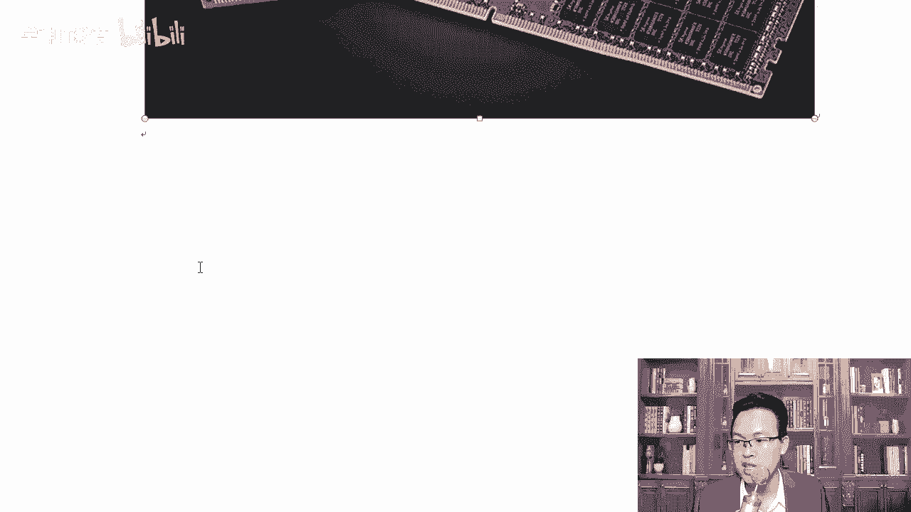

专门服务器设置是吧？呃，带什么呢？带这里你看按照不同引入了buer缓存器。除此以外，带register带寄存器还带ECCCECC叫做错误纠正代码处理这个技术。因为你想想像咱们现在电脑很少蓝屏了，对吧？

以前的电脑动动不动内存预出，或者说内存写错了。就崩了，那服务器那天天崩的能行吗？不行，所以每一次我都要做一下校验，尤其是我是多录CPU的时候。啊，去读这个内存的时候呢，更需要做一下这个校验。

保证我每次写入内存。

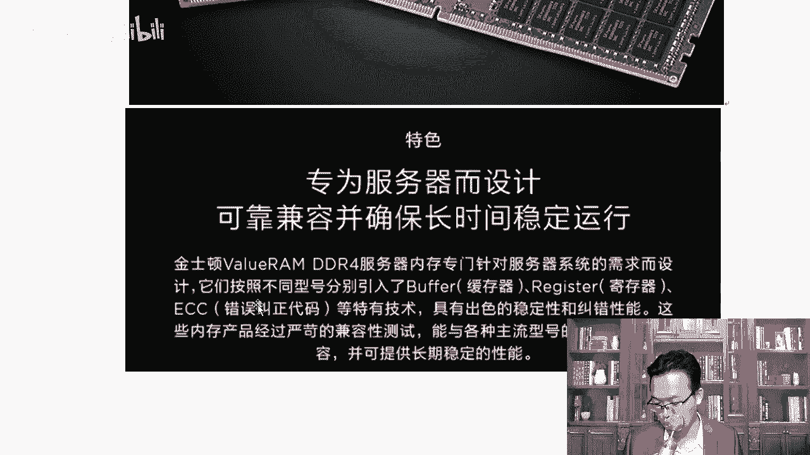

的数据都是完整的，读到的数据也是完整的啊，那插的时候大家可以看到了吧？都给它插满就行了。爽不爽？是不是挺爽的那它的型号在这里给大家简单的罗列了一下啊，大家看的时候主要看。如果你要买的话。

服务器上什么4G8G就直接忽略了，直接看16G跟32G的就可以了。啊，容量这一块啊。再就是他的这个速度。好，那这些清楚了，我们再看三星的。

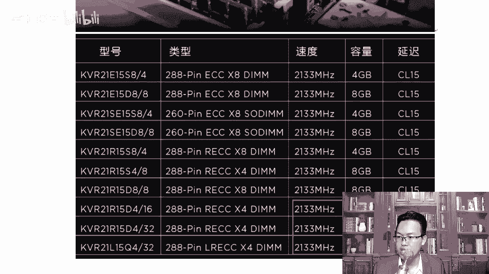

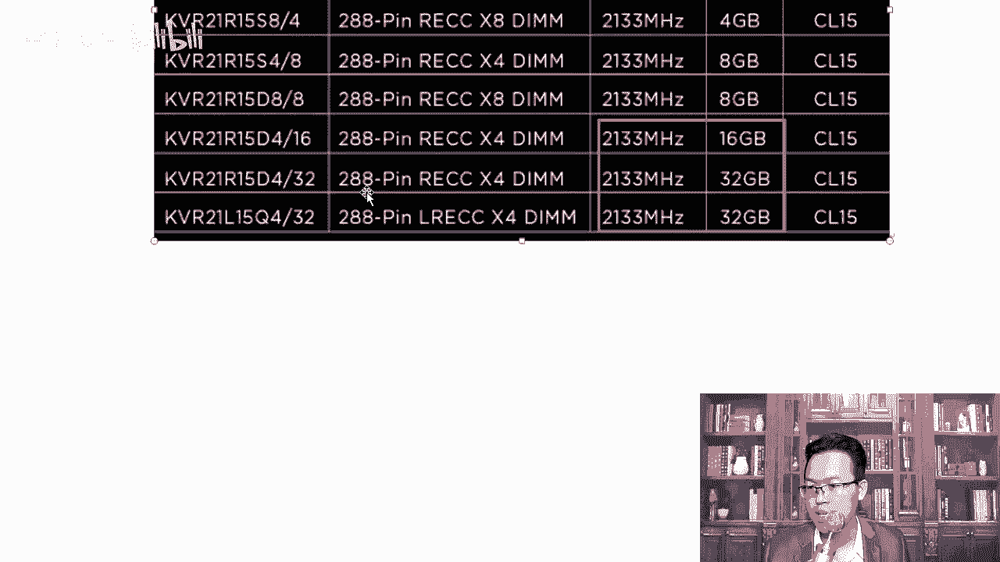

DD24档啊。还有啲。对，三星的DD24啊RED就是带寄存器ECCC校验。一般服务器内存条上，其实这两个东西都是带着的啊，都是带着的，这是DDR。你一定要买的时候买这种专用的内存。要买这种专用的内存啊。

咱们就知道是不是专用的，你们家里的内存条绝对不带这个ECCC。😡，记错功能。明白了吗？对你能看到这个字样，你就知道它是兼容，它兼容什么呢？联想戴尔浪潮曙光。这些都可以啊。大家可以看一下他的你看这儿。

我在这里特以给他。如果你不知道你我买这个内存条支不支持，那你可以怎么样呢？对，提供机器型号。😡，联系一下你们那个客服小姐姐。问一下他，哎，比如说我们这个戴尔的这我们这个联想的服务器。

你这个32G支持不支持，你可以让他帮你查一下，省得买回来的时候，钱开了再邮回去。

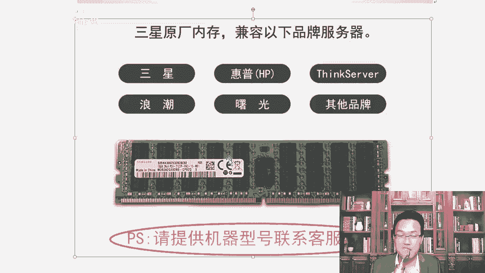

明白了吗？好不好？客服你没有技术，但客服背后的那个人是专业人士，他天天卖这个服务器啊，卖这个内存他肯定知道比你还专业的啊，人家就是干这一行的。😊。

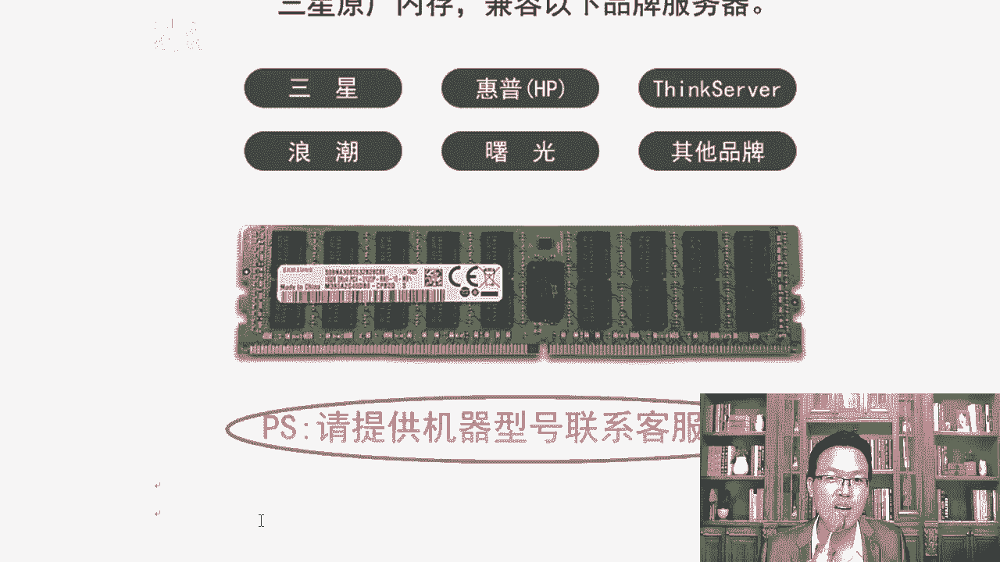

好，知道一下，这是16G的样子。大家知道一下外观跟我们台式机没什么太大的区别，还有32G看出来16G跟32G的区别了吗？😊，对，内存颗粒是吧？明显多了一。啊，内存颗粒明显多了好多啊。那内存看完了。

大家了解了解什么，我们来聊聊这个硬盘。啊，硬盘这一块硬盘有s塔硬盘，比如说这个是戴尔上的一个s塔硬盘，大家可以打开一下这个链接。好不好？你可以打开，我们可以打开这个戴尔的服务器啊。😊。

你可以上戴尔的官方网站上去买啊。对，我们可以上这个官网站去给他买一下，打开。我你截图啊。服务机上能装这种s塔盘吗？各位。因为如果你以前搞过服务器的话，你会知道服务器上都装的是ss盘。

没有什么s塔的一种盘是吧？但实际上我想跟大家说的是服器是可以装这种s塔s塔盘。什么是s塔盘？所谓的s塔盘就是我们现在。服务器台式机上就我们台式机上装的这种就是s塔这种盘啊，那盘的后面参数。

我们笔记本台式机装的就是sta这种盘啊。啊，这种台式机后边有时候会有什么512E512N。OK512E是工作级别的那5122N成为混合盘，就是里边有一有一块是固态磁盘。嗯。

这样的话固态磁盘可以有起到一个快速缓冲。缓存的作用。长得样子一样啊，看这。ET是吧，7200转啊，3。5英寸3。5是3。5英寸，3。5英寸就是像台机上那么台机上经常用的。都是3。5的s塔3。但是。

其实我们工作中用这种盘也少啊。一上。因为如果纯萨s纯桑达盘，它不支持热轧盘呃，不支持这个热插板。打理解吧。那还有这个地方叫做sas，对吧？sas这种盘大家有没有发现，像这种盘都是一T是吧。

或者500G那。萨ars这种盘。它的转速大家看到了吗？10K1。2T。要么就是600个G，其实600G这种一般用的会比较多一些。如果你的数量不多的话。呃，600G就足够你跑一年了。

除非你的数据量比较多啊，那就用这种11。2T的。看它的转速600G的话是15K57001块盘。对吧1。2T10K10K是1万转，就是每秒的每分钟的转速是1万转。15K的话就是每分钟115000转。

7200转，那就是一分钟7200转了。大家你可以看到这个价钱它是差好多的啊。O。😊，好，还除此以外呢，还有这边这个价格也是。4T7200转对吧？是66006000多。那看你的转速。

如果你希望读取的速度快一下，那肯定要买15000转的啊。所以一般情况下我们都买600G或者300G的15000转或者1万转的这个盘。大家知道一下啊。那除此以外。最大的盘现在一般都是多大。啊。

实体已经有了啊。不仅是什么两T4T、6T10T都已经有了10T的带210T。呃，7200转。所以我希望通过这一节课是吧，让大家对这种服务器有一个全新的认识，颠覆一下你脑子里成就的观念。

因为以前你们大学的老师跟你们讲的时候，都说啊我们硬盘500个G的什么IDE硬盘。😊，啊，并行的串行的那些知识都老过时了。😮，好不好？来MK，我这里教你最新最全的技术，行不行？😊，7实0T了啊。

已经有实0T的盘了，实T的盘就不能用我们普通的实T的这种盘，我们分区的时候就不能使用什么MBR这种分区表了。😡，什么主分区是吧？呃，主分区逻辑分区扩展分区就不用这个了，就没有什么。这个是对。

这个是不行的。对于这种盘，我们得用GPT分区表。好吧，真喷GPD分区表里面就不分什么主分区，也不分什么逻辑分区了，就可以都是啊，都直接分就行了。OKMBR这种最多只能有4个主分区。😊，啊。

这种故他不支持4T以上的磁盘啊MBR。所以你要注意啊，后期分期的时候用，我会教你GPD分区表的啊。大家知道一下，知道以后呢，这使整体样子知道了，我们来介绍一下。它的接口saras这种接口。

这个地方我没有给大家看这个接口啊，它的接口。不一样跟我们的沙塔是不一样的啊。桑塔的话就是如果你没见过的话，你就把你笔记本上的电脑拆下来。😡，啊，或者台式机样子拆下来看一看啊。😊，做IT人员应该勇于动手。

拆坏了没关系。到时候找我给你修，好不好？😊，嗯，我们说一下这个sars萨s。中文是串行连接的scars接口，串行连接小型机计算机接口它是全全称是这个啊，你就记住它是串行的，它是新一代这种技术。

和我们的sta是一样的，都是用串行的方式获得了更高的船行速度，并通过缩短。赶善了磁盘的空间。为什么串行的要快？原来我们说的这种叫做IDE硬盘啊，IDE在这里给大家说一句，好吧？IDE这叫并行。线特别宽。

我不知道你见过没有见过啊，这叫并行。为什么说这种并行的是不行的，反而是说吧串行的更快了呢？😊，因为病行啊。有干扰。好吧，主要是因为这种病情它是有干扰的，而且速度越快，干扰就越严重。

所以这种病型的ID硬盘就被淘汰了，因为速度提升不上来。虽然你一下传的，比如说一下能传好。呃，16位是吧？假设我串钱一下只能串一位。但是你的速度上来，你骑自行车，我开汽车，你就再骑的快也跟不上。

而且一旦出了问题，还得重新传16位啊，一个错了就都得重新传。所以现在就是串行的时代了。好，知道了以后，你没见过这个口，我带你看一下ss的口长得是这样的。

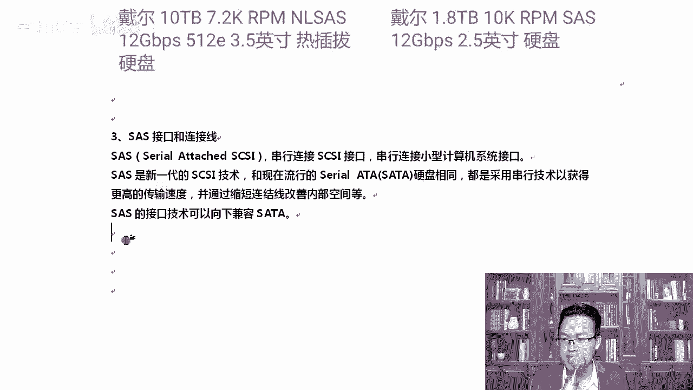

这两边哪个是电源，哪个是数据。哪个是数据接口，哪个是电源接口？啊。前面是数据还是电源？告诉我。前面是什么？想想前面是什么？前面这个口是数据口，清楚了吧？长的这个是电源口。就知道你会说错啊。好。

那么sars这个口知道了以后，我们来看一下啊，sars这种。你看到了吗？它的电源跟数据是连接到一起，然后中间凸起。我们普通家用的是沙塔，好吧，这种口是电源线独立的，数据线也独立的，中间是。空着的。对。

然后呢。咱们ss的这种接口是这样的，看到了吗？宽的这一块是这块啊，它是我们的数据线，这一块是我们的电源线，而且它是连到一起的。然后中间这正好有个豁口。啊，你们平常见的都是中间切1到一切开的是吧？

切开的时候见过连到一起没见过是吧？😊，好，知道一下。这是它的电源线，所以说要开拓一下你的思维，否则你因为有些同学可能没有机会去看到这个服务器。通过这一节课，你对服务器有个了解，开拓一下视野。呃。

开拓一下视野。啊s斯的盘尺寸的话，3。52。5这种尺寸啊，通常是这样的尺寸，3。5的。空间就大了，2。5的话就是缩小版2。5有什么好处呢？那就是。可以为我们的硬件腾出更小的空间。啊，放更腾出更大的空间。

2。5小了嘛。而且这种ss盘2。5是标配啊，一般除非你是做存储的，用3。5。一般2U的话。本来那个厚度就很薄，你再放个3。5的是吧，太厚了。明白了吗？好，那咱们接着往下说完磁盘的尺寸。

我们来讲一下磁盘的一些重要参数。其实对于saras或者萨塔这种磁盘的话，我们其实主要看什么，看容量是吧？如果我们的容量是1T2T4T6T8T转速是7200转，放心，它通常都是s塔盘。

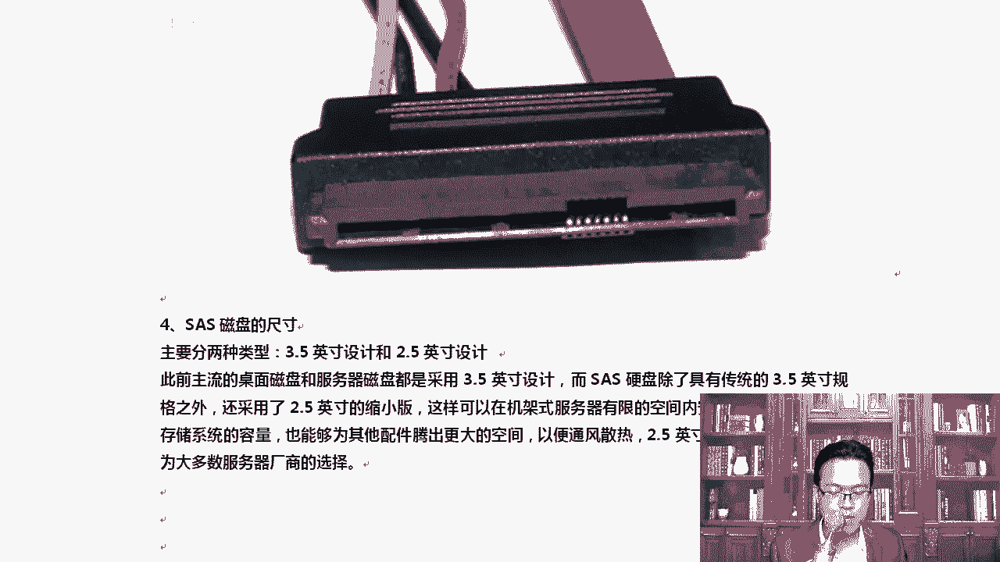

sars它的容量通常是300G，600G，1。2T啊，20T都是这样的。然后呢，转速都是10K15K。也也就是。这不是钱啊，这不是你个月挣15K。啊，当大家好好学完一个课程，一个月挣15K。很轻松。

这20K都没有任何问题。O。😊，这是1万转15000转啊。那除此以外呢，大家看一下这个问题，我问一下，那为什么会有12T的sas盘？有托哪有12T的s子盘呢？😡，啊，我来给你写一下啊。

看这当然不仅有12T的3层啊，你看这里。😮，有2。4T的ss盘是吧？还有2T的sars盘。看到吗？我我我给大家写了一个是12T的，12T的sars盘才3249。看到了吗？这个磁盘更新换代也挺快的啊。

你看有2T的s盘，你不是刚才说2T是s塔盘吗？😊，谁说的，我不是说的吗？怎么又跑出来个sars盘？😡，嗯，大家想想这个事情，你看他的两T转速是7200转的，很符合我们s塔的这个什么规矩吗？

知道是原因是什么吗？嗯，原因。这种盘通常。假sars盘，它并不是真正的sarrs盘啊，它指的是sarrs的接口，加上sar塔的盘升。那这样的话有个优点就是价格低，容量大，而且支持热差吧。明白了吧。

那戴尔上卖的时候绝对不能可能给你写假的sars盘2T。没人买了。我说对吧？当是我们作为技术，咱们心里知道他其实并非真正的是我们的萨餐。啊，他写一个假ss盘。淘宝说打假直接下了啊，当然要知道。

其实这种盘的。😊，挺好的啊，这种盘确实挺好的，为什么呢？因为它的价格确实低一下，你看12T才3000多块钱。我告诉你。😊，你买1个600G的ss盘，差不多就。2000或者3000啊。明白了吧？啊。

那个价钱我我们刚才上戴尔的官网站看的是什么do25，我觉得是5000是吧，谁用得起？

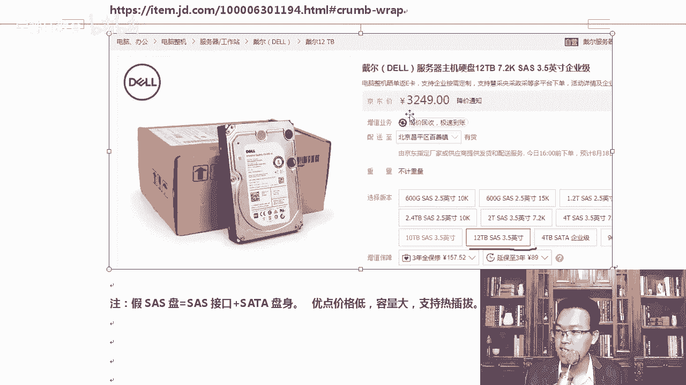

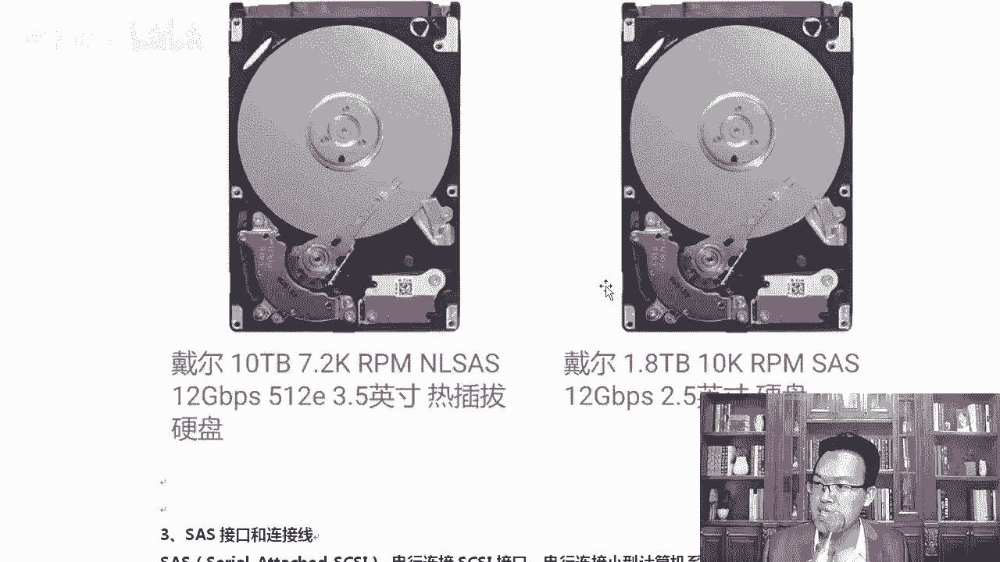

你看600G15K转速的s斯盘，1个600G就5000。如果我要拿这种盘去怎么样？这种盘一般都是用来做系统盘的，他或者做。呃，提供什么提供一些web界面的，它并不是真正用来存那些大量的视频，大量的文件。

比如说百度网盘，如果你让他拿这种600G的sars盘去做，百度网盘早就倒闭了。很多网盘公司倒闭了，原因就是因为这个硬盘太贵了，买不起带宽也太贵了。因为做什么做像百度网盘这样的网盘。

其实技术门槛是比较低的。主要是少钱，一块盘5000块钱。你说MK就我我的我的百度网盘上是2T。😡，明白吗？对我是2T的空间，2T的空间用这个我得用多少的，用3块盘得，就就得15000百度网盘。

存我的数据就得存1500。当然有时候你的跟我可能会重叠一下，但是确实成本太高了。但是如果换这种盘就好了，是吧？12T才3000多块钱就瞬间就能接受了。啊，大家要知道这种盘其实在后期企业里面做存储。

做阵列棍的时候。用的挺多的啊，这种假的萨s盘。OK7200转的sars盘，我们这样读会顺一点啊。好，除此以外呢，还有固态固态磁盘的话也挺厉害的啊，企业级的一些固态磁盘。

我们可以从英特尔企业级的固态磁盘里面，英特尔是做的比较棒的啊。英特尔这个公司其实最开始就是。最开始就是做什么存储的，后来做不过日本，然后呢才转型做什么做芯片啊。但然日本后来又不行了是吧，做芯片这一块。

就是奥腾DC固态磁盘，这个都挺贵的啊，容量的话375到750GB。然后这块的固态D七系列能达到1。6T和7。6T，固态磁盘现在容量也提升的非常非常的多啊。大家知道一下了解一下啊。

企业里一般用固态盘的话少。第57。6TB。对吧价钱。贵的离谱啊。动辄上万的都有。好，我们知道一下啊，那么工作中其实我们总结一下啊，工作中其实大部分都是ss盘啊，所以我们更多的要选ss盘。

OKzas版的话参数7。2K10K15K。都行。啊，都可以啊。一般我们选择如果你是个系统盘，你这个存的数据量不多，那你就用10K或者15K的就行，最好用15K抓速高一些。啊，这样会好很多啊。

我建议大家用这个，然后企业级。怎么样？企业级的话咱们是这样的啊，企业级的固态这个价格太贵了。啊，你可以选择D系列的，D系列的会便宜一些。OK那有同时固态磁盘都是干嘛使的？固态磁盘主要是用来什么？

因为固态磁盘在随机读写的时候会更快一些。所以固态磁盘一般都是用缓存的。😊，拿过来传做缓存。缓存到磁内存里面，那内存空间太小，缓存到这个固态磁盘里面。比如说我们做wish缓存加速scu代理。这种加速啊。

或者你是做游戏服务器的，存的数据并不多，但要求大家的延迟特别小。那你可以使用这种方式啊。好，这是关于磁盘。

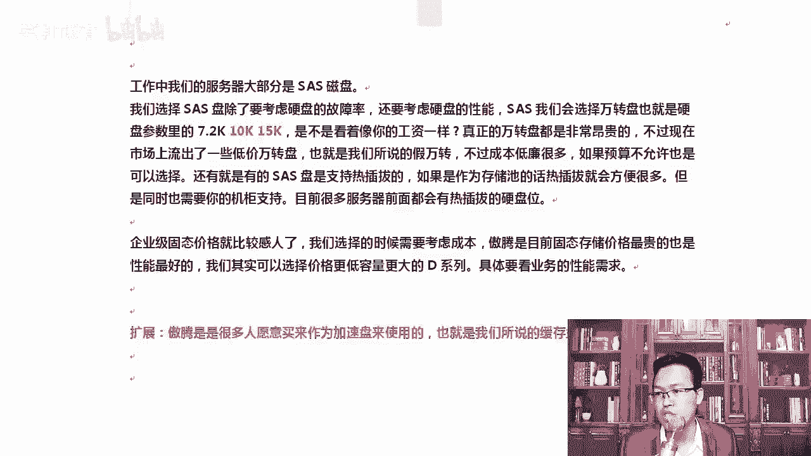