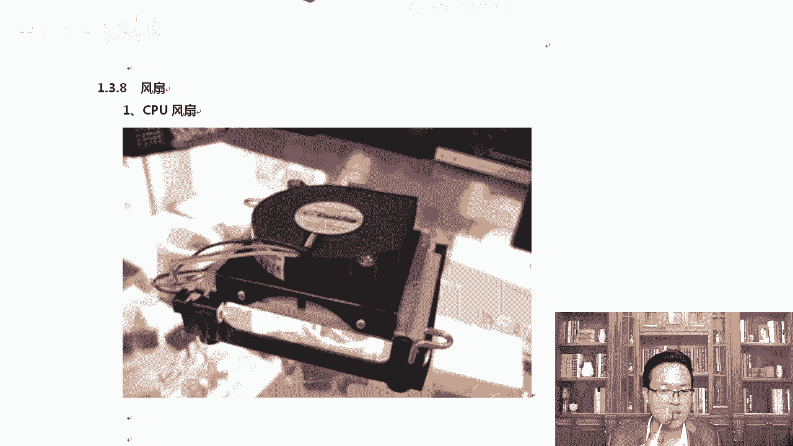

# centos8／Linux／运维／网络运维／RHCE／红帽认证云计算／2020全新独家教程-centos8操作系统从入门到精通 - P28：7-Raid卡-网卡-电源-风扇 - 学神科技 - BV15V411z7tK

那我们来看一下read的卡，那普通的台式机上是没有read德卡这个设备的啊，服务器一般会直接支持什么read德卡，就是我们的主板上直接就有这个read硬read的功能啊，你可以直接去用做的过程中。

比如说买来一个EU的服务器，你可以开机摁下，比如说cttrol加M，就跟我们进delete一样。好吧，它的那个启动界面上或者说。说明书上会有写咱们进瑞的，就摁开机摁一个快捷键就可以啊。

那我们看一下戴尔这个设备，我在这里一直选择的是戴尔，因为戴尔可以允许我们自己去根据自己的需求去定制服务器。你可以上戴尔的官网站上自己直接去买，买完这些配件，工程师会帮你组装好，然后打包发给你。

性价比还可以啊，read的卡就是长这样的，看到了吗？😊。

啊，这就是一张瑞德卡，瑞达卡上有对应的一些。什么插槽read卡能够帮我们起到数据的什么高可用。比如说最热0read1。好不好？而且readd卡上是有什么是有缓存的，我们快速的刷往里写数据的时候。呃。

可能一次性写不到因磁板上。那这个时候我们可以写到read的缓存里面，一般一个G的缓存或者两个G的缓存，先写到。read的卡的缓存上，再从缓存里面慢慢的往磁盘里起去写，这样会好很多。知道有一个这样的东西。

那咱们的服务器啊，有时候网卡是吧，不够用了，或者说我们觉得网卡的速度太慢了。那这个时候咱们也可以配一下这个网卡。呃，网卡有千兆网卡，只是标配了。那么一般情况下，很多高配的服务器，还有万兆网卡啊。

包括10万兆的网卡也有啊。

那网卡的话通常都是超过什么？超过千兆了，万兆网卡通常都是光纤接口。大家可以看到啊in特尔以太网服务器，你可以去in特尔的这个独立网卡啊，独立网卡。我们可以使用什么？光缆啊，你可以使用光缆啊，这是千兆的。

然后我们来看万兆的一些网卡。这个网卡跟你台式记账的差不了多少，你看这个是四个接口。啊，单口数这个地方。然后呢，你看。这个叫做万兆网卡。服务器的并发量一般需要多一些。

万兆网卡同样大家可以看到这儿是么SPSFP。呃，能看到这个缩写呢。你就知道它是什么，它是光纤网卡。除此以外，大家也能看到啊。你看光因为光纤网卡。你那个口插的时候挺长的，知道吧？你看这儿。

这个口这个地方都挺长的。大家一看这个口，你其实你就知道它是光纤的口。现在光纤已经很常见了啊，已经不是什么高端货了。你家里都是光纤口直接进来的，对不对？好，万兆网卡一般都是光口啊。那除了这些以外。

电源也很重要。服务器的电源服务器的电源不像我们台式机样，电源，台式机样，咱们都是一个大方块是吧？服务器上都是很很扁的啊，因为本身它就是U是这样的电源。那服务器选的过程中一般都要看一下你的瓦数是吧？

瓦数不要太小就可以了。😊，一般都标配了啊，服务器这个电源。

我给大家来一个图片。大家可以看到这个80plus吗？80是什么意思？

大能是一个标志啊，节能的标志能否是国际上的电源的一个节能标识。80plus。

802。是一个标准啊。好，还有我们的风扇，CPU的风扇呃，我们服务器上的风扇跟。台式机样是不一样的，台式机样的风扇经常大家看到就是闪着各种炫酷的。台灯是吧，然后呢，风扇通常就很厚。那服务器都做的很扁。

大家可以看一下这个。

他是很扁的啊。可以看到了吗？这都是纯铜，这样的话散热其实这样的散热很好啊。OK有这种的，或者说。不同的风扇，大家都让大家看一下啊。这一块自然是CPU吧，盖住CPU然后风扇充置就从这一块进行吹。

好，大家知道一下啊。除了这种风扇，CPU的风扇，服务器上还应该有这样的风扇。大家见过这种风扇吗？😊。

嗯，知道他放哪吗？

他放这里啊。看到吧？这块一个风扇。对，这块的风扇声音其实挺大的啊，这种风扇其实挺大。你可以如果显觉得声音大的话，可以拔一下。当然对于我这款C这款机器不可以拔，你拔了以后没法散热了啊。

如果说我这个CPU上有什么，比如说盖了一个这样的独立的。😊，啊，独立的风扇。那你可以其实运行的过程中可以把它稍微拔一下，这样的话声音小小很多。😊。

好。😔。

那稍后呢，我们根据需求去定一台服务器。