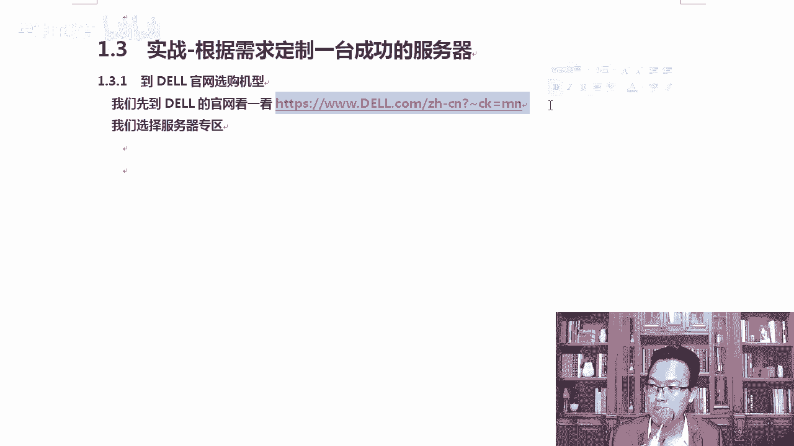

# centos8／Linux／运维／网络运维／RHCE／红帽认证云计算／2020全新独家教程-centos8操作系统从入门到精通 - P29：8-实战-根据需求定制一台成功的服务器 - 学神科技 - BV15V411z7tK

好，我们来根据自己的需求去定制一台服务器。也就是说大家后期想买的时候，比如说我想买个四核的，或者我想买个呃16核的，我想买个单路的，我想买个双路的啊，我需要多大的硬盘啊，多大的存储空间。

那在这里我们可以上戴尔的官方网站去选。你也可以直接上京东了。呃，这些网站上去买买联想的服务器，买其他的服务器，跟我们买电脑其实是一个道理啊啊，那在这里我举一袋打开一下这个官网站，它有中文。

打开这个网站以后，这上面有很多啊很多的配置。我们主要选择的是产品，从产品里面去选择服务器。当然你也可以上京东上去买啊，没问题，也可以上淘宝天猫上。

这都没有任何问题的啊。呃，我们点开这个服务器及存储。因为淘宝、天猫、京东这大家都常用，所以我就不给你演示了。

那我们点一下这个服务器，当然你也可以直接看这家用的商用的，直接打电话就行，告诉他我希望有一个什么样的配置，他直接就给你提供了，就跟客服一样。😊，白天的时候还给你提供了QQ，你也可以加个好友。啊。

总而言之，一句话买起来也挺方便的啊，毕竟咱们是给钱的。是不是？然后我们等它运行一下。

在这里我们打开这个地方以后。我们来说一下，打开以后呢，你选服务器的时候要注意一点啊，就是戴尔系列的服务器的一个命名规则。有时候以T开头，有时候以R开头。那么如果我们以T开头，那它代表的是塔式服务器。

如果你是R开头的。那它就是机架式服务器了，机架式服务器就是一U啊两U啊这种服务器。好吧好，所以你买的时候别买错了啊，本来该买个。😊，机架式的服务器，你买了个塔式服务器。通常情况下。

咱们放到IDC机房都是什么？对，都是这种。好不，都是这种服务器。如果你放到你公司去用，那你可以使用整个塔式的。通常情况下，咱们都是这样的，因为这样的话省省空间呀。大家不觉得吗？机架式塔式的服务器。

我觉得不省空间啊。好，我们打开那个地方以后，关了它，你看售前优惠QQ咨询，直接咨询他就行。你哪不懂，你直接问他就行。就是大家以后买了这些硬件服务器出了任何问题是吧，你直接找他们客服就行。因为你出钱了。

😡，好吧，你直接找他咨询就行，他也会跟你详细的去聊这个事情。那在这里，比如说有你看R。怎么样？2540银牌服务器，我们来看一下啊。然后塞尔戴尔的什么热卖存储设备，这是戴尔的存储。啊，那么除此以外。

还有d尔们的热卖服务器。dEMC看到这个标了吗？EMC是什么意思？EMC是一个公司啊，EMC叫他是一个专门做存储的公司。啊，以前我们经常会有一个说法叫什么呢？在国内好几年前就有一个说法叫去IOE计划。

好吧，I指的是IBM。O指的是2口。那抑制的是什么存储EMC。OK。😊，IBM提供服务器，二口提供数据库EMC提供存储。这三国外的巨头直接就把中国这个互联网企业给拢到了。啊，互联网这个高端设备是吧。

就给直接垄断了。所以像阿里后来就不用二Q数据库了，就换换了啊，换了数据库啊。😊，那戴尔跟EMC怎么两个牌子贴到一起？因为戴尔在2015年的时候收购了EMC这个企业。啊，所以就像我们经常看二口跟散。

有时候经常会掺合到一起一样，这是一个惯例啊。对，收够了，我我给大家找个图让大他看一下。对你看我之前给大家看那个一体机，上面就有二口跟三啊，我不找那张图了啊，对他们收收够了啊。所以你看到这儿。

你不要以为这就是个存储，它不是个存储。好，戴尔EMC戴尔收购了。好，拿到这个东西以后呢，咱们去选择一下咱们想要的这个服务器。它提供了很多的设备啊。存储服务器这一块的那我们选一下这个服务器吧。点开一下啊。

这边我也点开了一下。那大家可以看到2540企业。机架服务器你可以做对比啊，它那个地方挺方便的，就是你可以打上对勾，打上对勾，打上对勾以后给它进行一下对比。😊，OK我这里为什么一下子就4个呢？

因为我之前对比过啊，我可以把这里面清空一下。是吧，重新选一下。这样的话，你可以对这两台机器做一下对比。OK这里写的很清楚，英特尔至强银牌4210处理器。你看如果我刚才不讲，我说服务器CPU是吧？

英特尔现在至强分为什么？😊，对，铂金。是不是还有金牌银牌铜牌，那你就会哎什么银牌是什么，你就会一脸懵逼。你买服务器的时候，你就会难道里边还真的有块银子吗？😊，是不是？所以你要知道这些东西啊。那么。

价格写的很清楚。这是19000，还有15000啊，15000。处理器的话，16G的2T萨塔热插拔磁盘看到了吧？写的很清楚啊，s塔热插拔。OK没有像我们在淘宝上卖的时候，直接给你写成sars。

他写的这个很标准啊。OK这里面会多一个上门服务啊。会多一些这个需求，我们看看啊。下面还有一些具体的一些规格和参数，慢慢的一个一个去对比就行了。明白了吗？根据大家这个需求，你一条一条的去。

去做一下那个对比。OK你看这里面带有什么同样机箱这个地方，3。53。5英寸的机箱，那么含。高达8个热插盘，那它这里面会有什么软锐的设备啊，多了个软锐的是吧？前面那些基本配置是吗？没有什么太大的区别啊。

行，会对比了。接下来去买就行，买的时候是吧，注册一下账号，绑上自己的银行卡就可以去买了。跟你在淘宝上买东西是一样的。好。我能我们来看一下这块啊，你可以选择塔式的，你也可以选择机架式服务器。

如果我们选择机架式服务器啊，我们选这个机架式服务器往下走，那它会给你显示出来单路的CPU有哪些型号，给你罗列一下双路的CPU有哪些型号都给你罗列了一下，还有四路的，那你可以慢慢的根据自己的需求去选。

比如说我选择AMD的，我选择英特尔的，你可以先看一下CPU这块，好吧？CE的话属于高密度服务器啊，我们不用管，我一般我们选R740或者R7425这一类的就行。2RU代表它是两U的服务器，明白了吗？😊。

啊，那这个EU的话代表的是EU的。那我们可以看一下2440ERU服务器。他会给你一个介绍。那我们打开这个也给大家看一下。这里还有三U的和4U的那配置起来就更牛了。

所以大家在这里后期选自己所需要的这些服务器就行啊。😊，然后我把塔式的给大家截个图。它式的服务器大家可以看到都是T开头的，好吧，机架式的都是R。OK。😊，R5440R540R340，还有740。

那我们想看一下这个服务器长什么样的，其实也可以啊，你打开。让他加载这，我把对应的视频已经给大家下载下来了，我可以给大家播一下啊。我带你看了高清大片。然后有同友说，老师。

我对这个拆解服务器也挺感兴趣的那你可以看一下，因为我估计。你没有在硬件机房里工作，你这辈子应该是没有机会去拆这个服务器啊。但是没关系，他跟你其实拆电脑差不多多少啊，差不了多少。我们来看一个设备啊。

比如说R。2740或者我们看那个27425或者2740，2740是常见的一个服务器。我们来看一下，给大家播一下啊。

🎼The Dell Power edgedge R740 is a two socket general purpose Workhorse server optimized for application performance and acceleration It provides the ideal balance between storage IO and application acceleration The R 740 is available with 8。

3 and a half inch drives or up to 162 and a half inch drives Inside the power edgedge R 740 is powered by a pair of the latest Intel Zion SP processors There are 24 slots for DDR4 memory and up to8 Gen3 PCE slots availableable NV dims help to increase application performance and increase overall reliability Power edge servers come with security built deeply into our supply chain system hardware and firmware from the start This security is integrated to ensure a worryfree infrastructure and provide the intelligence and security controls to protect against malicious attacks or unintended changes。

Dell Open Manage means your servers can take care of themselves with zero touch configuration。

 proactive support notifications and easy system ase when it's time for systems to be retired or redeployed The power edge R 740 delivers a worry free infrastructure that is secure and scalable with no compromises。

The Dell EMC Power Edge R440 is a two socket1U compact rack server designed for dense computing deployments like high performance computing and web applications。

 the Power Edge R440 brings you big value in a smallhor factor with dual Intel Zion SP processors up to 16 dims and scalable storage that lets you mix hard drives and NBmeE SSDs。

 the R440 is available with up to4，3 and a half inch disks or up to 10，2 and a half inch disks。

 four of which can be NBme SSDs。

The R440 also offers MD2 SSDs， optimized for booting up and protecting in a hardware based raid adding card。

Take control of the entire IT lifecycle with Dell EMC Open managed。

 the integrated Dell remoteote access controller makes quick work of updates。

 monitoring and management。Open Manage means your servers can take care of themselves with zero touch configuration。

 proactive support notifications， and easy system race when it's time for systems to be retired or redeployed。

Dell EMC builds security into every server we make That security starts with cyber resilient architecture designed to protect powered servers from malicious attacks with features such as server lockdown which protects against unauthorized changes and correcting configuration drift。

The Power Edge R440 delivers a worry free infrastructure that is secure and scalable with no compromises。

到最后呢，咱们总结一下，今天我们讲了叉86服务器小型机和大型机这些内容，对不对？那这些内容呢都挺重要的。回去呢大家。呃，详细的去看一下，我希望通过这一节课程，能让大家对这个服务器硬件有一个初步的认识。

那后期你再跟着我去学linux架构式的时候，你就知道你所有的这些服务都是放到这些服务器上的那对于这些硬件，大家可能第一次接触的时候觉得有点懵，这很正常啊，但是也没有任何关系。因为工作中咱们。

不会去接触这些硬件。明白吗？顶多是你买的时候下个单啊，你出了问题需要维护了，他都给你提供了三年的这个质保。OK而且还提供了一年，就是次日上门去维修。所以说这个服务还是挺棒，挺到位的啊。买这种品牌机。好。

呃，这是咱们今天的内容，也希望你把我的视频更多的分享给身边的小朋友，让他们更多的去了解linux开源的世界。

加油。