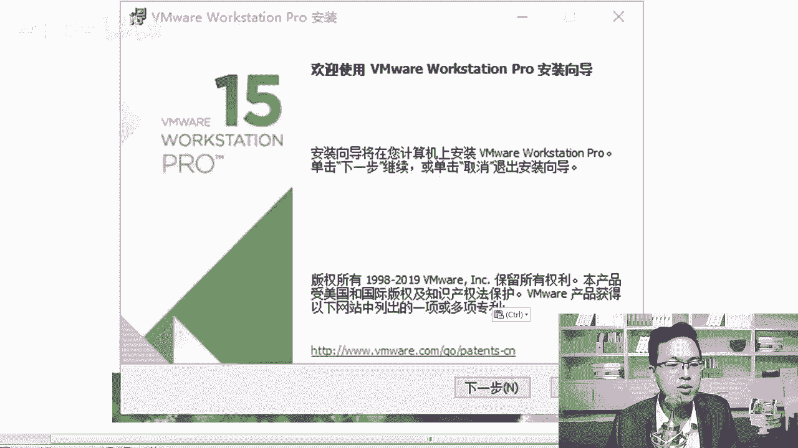

# centos8／Linux／运维／网络运维／RHCE／红帽认证云计算／2020全新独家教程-centos8操作系统从入门到精通 - P2：2-VMware虚拟机安装 - 学神科技 - BV15V411z7tK

那接下来我们来把这个VML虚拟机给大家安装一下啊。同学们，我们来首先。准备一下这个下载Vm虚拟机从哪里下载呢？可以在这里啊，MK老师给大家提供了一个百度网盘的链接。当然我还是鼓励大家去买正版好不好？

如如果你喜欢的话啊，我给你提供了一个Vm15的虚拟机的安装环境。那大家可以通过这里去操作，好不好？在这里我们把win10下的，如果你是win10的操作系统，那你就装这个vem15就可以了。😊。

好吧，有同学老师，我现在机器上已经装好了win mware10，或者说12，或者我用的是whatto box，有没有问题？嗯，没问题。只要你用惯了那个软件就行，好不好？最后呃如果你没有安装过的话。

那最好你就直接使用VM15就可以了啊，用这个版本其实是挺好的。十里面win10的系统装ware12的话，会可能会报一些错好，你在这里有对应的压缩包，你压缩一下是吧？安装一下就行好，除此以外。

如果你是mac版的系统啊，那我还给你准备了这个mac版本的啊，mac版本的这个扩展名是DMG啊，那么这里啊除除此以外，还有stoS7。6和stoS8。2的系统，大家你们下的时候，你要下一个什么呢？

你要下一个stoS8。几啊，对大家要下载一个stoS8。2的系统，好吧。因为MK老师。😊。

MK老师是中国第一个讲stoS8操作系统的老师。真是这样啊啊，你在网上其实现在是找不到什么，找不到someoteS8相关的内容的。我是第一个讲的啊，只要你跟着我学啊，你能学到最新最全最强的技术，行不行？

😊，好，那当然也推你也可以推荐给你身边的小伙伴是吧，让他也一块过来听我的课程啊。所有东西MK老师给大家准备的妥妥妥的，到时候大家自己从网盘上去下一下，好不好？下完以后呢，那么windows下。

你直接去解压就行啊，对应的序列号，我给大家提供了一下，好吧好？如果有有可能情况下大家还是安装一个什么正版的，好不好？如果你实在手头紧的话，那你就先尝试试用一下它的这个。😊。

啊，盗版软件。当然没关系啊，就是一个激活码。其实veware这个公司说白了。他也对我们个人用户没有那么大的要求，好吧，如果你是企业级的，那肯定要用它的正版的啊。那么怎么用呢？很简单。

windows下的程序安装起来都是一个套路是吧？双击就行，我就不给大家去真正的安装一遍了，行不行？那我们先打开这个地方给大家看一下啊。呃，双击双击完了以后，它会弹出这个界面，大家点下一步就可以了。

一步步来。😊。

好不好？对，一步步来，那这个地方你肯定要点我接收这个协议，你不接收你也装不上是吧？接收完了以后，我们去正常安装。安装的过程中，你可以选一下位置啊，你可以选择装到C盘啊，也可以装到其他盘附下。

如果你的C盘空间不够的话，你就装到D盘下。😊。

行不行啊，那这个地方增强型键盘驱动器需不需要呢？其实不需要默认就行。我一直没有用过这个其实是没有任何问题的。然后呢，再往下，那你就该来到了这个界面。好吧，大家安装的过程中不会的话，你就跟着我的视频。

跟着我的笔记一步步装就行啊。在这里你可以启动时检查更新，把这个对勾给我取消掉。😊。

好，或者。对你就不用更新了啊，老更新ve，我们这个能把系统运行起来就可以了。它是不需要你一直更新的，能理解我的意思吧？😡。

对它是不需要你一直把系统更新的啊。那么再一个就是加入VMMR用户体验计划，你不用提问啊，体验计划它可能会收集你的一些信息啊，收集你的一些个人信息，我们不。😊。

再就是下一步桌面，我们要在这个桌面去建一个快捷方式，好不好？开始猜呢这个地方都需要有点下一步就可以了，这些都OK了以后。😊。

那么接下来是哪一步呢？是这个地方告诉你已已经准备好安装了，那你就现在开始安装吧，安装的过程大概需要个5分钟左右。

好不好？如果你电脑配置慢的话，5分钟左右肯定是足够了。那么最后呢安装完成以后点。😊，完成就可以了。啊，完成以后将。点什么呢？你可以点完成，你也可以点许可证好，在这里强调一下啊。

它这个光标虽然是在完成这一块是吧？大家你一定要点许可证，你干脆就在这里是吧，就你有点许可证好，我这里跟大家强调了一下是吧？你在这里应该点击什么，对你应该点击许可证。😊。

好不好，点徐校证干嘛呢？在这个地方你就把注册号是吧，去往上写一下，复制一下，复制完了以后是吧，点输入。

好吧，这样的话你就可以正常的去使用这个VM什么呀VM15了啊，这样就会很快速的安装成功了。那VM15里面其实也增加了很多的功能啊，尤其在磁盘管理的时候，我们增加了一个功能，大家知道吗？磁盘管理的时候。

我们增加了一个叫NVM1磁盘，就是磁盘的类型是吧？它增加了。😊。

好不好？对，磁盘的类型，它增加了一个新的类型啊。😊，好，那么一会儿我们来看一下它增加了这个新的类型。好，那安装完了以后呢，我们来装一下这个系统。

好吧，这是虚拟机，虚拟机安装完了以后呢，我们去使用森腾S8的系统给它装一下稍等。😊。

