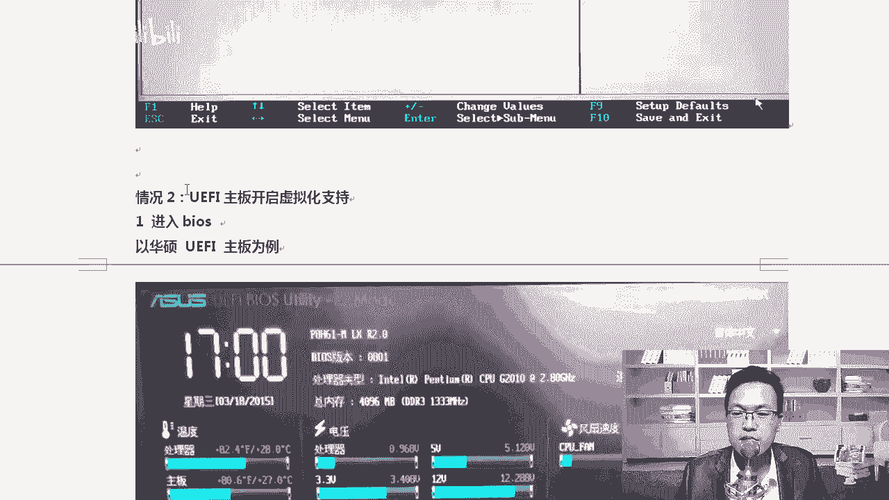

# centos8／Linux／运维／网络运维／RHCE／红帽认证云计算／2020全新独家教程-centos8操作系统从入门到精通 - P3：3-centos8操作系统安装-前期准备工作 - 学神科技 - BV15V411z7tK

接下来我们来安装一下stoS8系统。那首先呢你需要双击启动一下这个VMware。在桌面上有这个图标，大家双击启动一下一下就可以。那我已经提前启动成功这个系统了。启动完了以后，如果你第一次安装。

它可能会弹出一个这样的一个窗口啊，这样的一个界面，我这里是1212或者15都可以啊。

12和15都可以，你可以点这里创建一个新的虚拟机，那也可以点哪哪里呢？其实也可以点这啊，文件新建虚拟机啊，因为后期等大家安装的操作系统比较多的情况下，你其实。😊。

其实很少点到主页，再从这儿啊，比如说都我们更多的情况下是从这一啊，我们在这里点新建虚拟机就可以了。你像MK老师这个虚拟机，你看有多少。😊，对吧这么多呢。好吧，这么多的啊，那我的电脑会卡吗？😊。

很多同学啊很多初学的同学一看到哇M科老师，你跑了这么多虚拟机，你的电脑配置一定很高是吧？你的卡不卡，那我跟大家说不卡啊，为什么呢？因为这些虚拟机只要它不运行是吧？顶多就占你一点点的磁盘空间啊。

占你一些磁盘空间，你只有运行的那些机器才才会卡。😊，好吧啊，所以。😊，多装点虚拟机啊，装完虚拟机以后要装快照啊。那我们来看一下新建一个虚拟机。跟着那个步骤一步步来，好不好？

那么首先呢你选择的应该是自定义啊，你可以选择典型，也可以选择自定义啊。我在这里建议大家选择的是自定义高级安装啊，VM15跟VM12在这块配置这块是没有什么太大的区别的。😊，知道吧？啊，都是一样的。

点自定义。自定义选择worker station这个地方也是默认就行啊。好吧，这里也就一路默认就行。我这里是兼容性workworktation12。

你那应该显示的是work stationation15，好吧，没事啊，十2和15都可以。😊，那再点下一步下一步完事以后点稍后安装系统啊，我喜欢选择这一项啊，稍后安装系统。其实你在这里直接把桑S8。

2的镜像是吧，加载上也是可以的啊，没有任何问题啊。那我们点稍后。😊，我喜欢去选啊选稍后，稍后完了以后，操作系统这个地方可以有很多种操作系统，就linux它不是只有一种啊。

那你常见的你想red heart是linux是吧？呃，red heart后来就要做什么呢？red heart。😊，entterprilinux就我们经常说的RHELlinux。啊。

IH1linux和什么和sS它们之间有什么关系呢？😊，大家知道吗？好，是这样的啊。来跟大家说一下IHLlinux叫红帽什么企业级lininux。那这个毫无疑问它是什么？😡，对它是企业级的lininux。

收费啊。好吧，我们那用的是soteS啊，stoSIHL8对应的就是soteS8，它们之间一般都是一对一的关系。红帽发布了以后，那么发布完了以后，大概在半年以内是吧？对应的soteS就半年以后6个月以后。

stoS对应的版本的操作系统也就发布了。这个是社区版的。😊，好吧，那社区办靠谱不靠谱呢？靠谱啊，在国内大部分的企业全部用的是sowS这个系统。清楚了吧？在此之前还有一个就是还有一个版本叫federal。

feal就是一些最新最全的技术，会在federal那个操作系统上去用。😊，好不好？对，还有一个啊我记得federal这样的一个系统，它是最新最全的一些技术，是给你个人用的，其实就是小白鼠版本。😊，啊。

在finder上跑的这个新的技术，新特性是稳定了，稳定了就放到了我们的RHEL企业级这个版本上。那企业级稳定了以后怎么样？😊，因为红帽怎么样？因为linux是开源的，大家知道吗？

红帽你既然用了我开源的产品，你也得怎么样遵循我的规则啊，遵循我的开源协议，你得把你开发的这个东西给我开源出来。😡，好吧？对你得开源出来，开源出来以后，那这么好的东西。😊，是吧啊？为什么只能是企业集中呢？

是吧？我我们的开元社区stoS这个社区什么啊？基于红帽的这个代码啊，基于红帽的代码是吧？又开发出来一个新的系统，就是stoS8。2。😊，所以大家用生特S8。2，或者说用RHEL8。2。

体验上是没有什么区别的，所有命令都兼容啊，唯一的地方就是红帽的什么。😡，对，红帽的，比如说红帽乙的样源或者DNF。好不好。对，样目和DNF都是安装软件的啊啊，那么从生动S8开始。

安装软件推荐大家使用DNF了，不带推荐大家使用样目了。啊，那么。红帽的源不能直接使用啊，你还得想办法配一个阿里的。啊，藏头S这个圆是可以直接用的啊。好吧，那红帽跟这个地方主要是关于样物源的问题。

再就是logo好，红帽的logo是这个没开源，那是红帽人家自己的，所以sS组织得有自己的logo啊，所以用上没有什么区别啊。那大家有同话老师还有Uban two这个版本呢？还有deb呢？对。

还有我们的凯ly呢凯ly和什么呢？凯ly和Uban two和deb系统是吧？他们都是一个类型的，他们走的都是什么DEB这种扩展包。😊，好吧，我们上边用的这些包都是点RPM包。它们三个自成一个体系。

然后呢，它也是当然RPM包这种规则，很多操作系统都可以用啊，其他的一些什么r0linux啊，linux有很多版本啊都可以用。😊，但是他们最主要是人家三个哥们儿是吧，都是好关系。

三头S的一个组织现在也被红帽收购了啊，也被红帽收购了啊。凯里U two的话，国外的时候还有一些susci啊，很多版本啊。😊，好，我们在这里稍微了解一下就行。那对于我们来说。

你看这里还有什么susi版本是吧？国外可能用susie多一下，在国内还是用stoS多一下。我们在这里应该选择什么呢？不是U版 two。

也不是这个我们应该选择的是entterprise什么linux7点64好，你选这个版本就行了。如果你是VMware是吗？老师，我是我是。😊，对我们在外卖15的版本里面是有的啊有864位的，你可以选这个。

啊，但是没有关系啊，就是我即便我选的是什么？764一样是可以装成功的啊，因为它的内核兼容性各方面都是没有什么太大的问题的。这样吗？各位同学。啊，这个是没有任何问题的。然后呢，我们这个虚拟机的名字啊。

我建议大家起一个什么呢？我喜欢起这样的名字啊，其实大家可以看到我这里应该。😊，都起的差不多，我会加一个版本号。比如说我这个是。stoS58。2或者说5十几的，你可以写stoS8或者8。2，好吧。

写上你的版本号，然后呢再跟上什么？我的IP我的IP是63。那我一般我会起一个这样的名字，前面是我的系统的版本号，后面这个IP就是我后面我们要配的IP。😊，啊，我只要看一下这个虚拟机是什么。

我就知道它的IP是什么了。位置不要放C盘，因为虚拟机占的空间比较大，你放到C盘很容易就挤满了。😊，呃，我把它拉到一边，有同说老师，你为什么不拉不让我看一下？😡，对。

因为因为因为电脑里有一些你不能看的东西是吧？😊，万一你能看到苍老师的照片呢？毁了我一世英明了是吧？好，稍等一下啊，我找一个位置。好。好，我们找一个位置啊。新建一个文件夹。对我们放到这里啊。

这里我随便起了个111，因为我之前3东S8的系统我也装好了，大家建的时候，你最好就创建个这样的目录就行了。😊，好不好？在我这里随便起了个111啊。好。😊，好，拿出没看清是吧？上一步啊拿到这个以后呢。

点下一步，下一步的话处理器的数量，你的电脑有几个处理器？😊，有同学我电脑不就是1个CPU吗？不是的，好吧，我们的叉86服务器啊，后期我会给大家讲服务器硬件。

我们的叉86服务器可能有两个物理CPU或者4个物理CPU，我们叫双路CPU或者四路C啊四路服务器。😊，OK那么对于我们笔记本来说，肯定只有一个了啊，我们选一个。然后呢，核心的数量的话你选4个。

这样的话你的虚拟机会跑得快一点，有同学能能选更多吗？😊，能取决于你你的电脑是几核的，我的电脑是四核的那你就选四，你的电脑是8核的，你就选八就行。😡，这样会确实会占用的CPU多一些。然后内存的话。

我跟大家说一下，我选2048，选2个G吧。好吧，因为我这台机器我要给你装一个图形界面。如果大家不用装图形界面的话，你给512兆或者给一个G。都可以啊，你也可以从这里来回的拖，好不？我是16G的啊。

不能最大，你看推荐最大也就到13个G左右。😊，对吧。好，我给两个给两个G啊，大家也给两个G就行。然后呢，网络这个地方使用桥节网络还是n还是金主机。其实这些东西大家看不懂的话，你读一下就行。😊，呃。

一会我会详细的去跟大家演示什么是巧接，什么是语录机。啊，什么是云主机的？对，什么是桥接，什么是n啊，一会儿我也详细给大家说一下啊，我把这个安装的所有的注意步骤给大家详起。😊。

点击虚拟名输入s动S864位的一个虚拟机，好不好？虚拟机比较大，不要放到C盘里，这是你们最重要的一个步骤。你看到的笔记是很细的啊，我会跟大家写的非常非常的细啊，照着这个笔记一步步来。😊，绝对能做出啊。

好，那拿到这个以后呢。咱们选择先选桥街好吧，选桥件啊，如果你们公司的网络。比比如说如果你现在在上学，上大学，大学期间每一个每一个网络的出口都做了端口绑定，就是mac地址绑定。那那种情况下。

你想让虚拟机上网，你就得使用什么net模式。清楚了吧？如果你比如说你你们公司是无线路由器，或者说交换机也没有做任何端口绑定啊，你可以随意随意的什么去动态获取IP地址，那你就选那个条件就行。好。

你要是再家，那就随意了。因为你们家里的无线路由器都是可以随意获取IP的。😊，好吧，我们先选一个桥接，这样的话后期方方便模拟真实的服务器啊。然后呢，控制器的类型就选这个就可以了。啊，选那个默认就可以了啊。

好。😊，试盘类型scar推荐。好吧，有同学老师，我这不是scar意时推荐。对，如果我们是VMV215，那么上面写的是。NVME是推荐啊，NVME是个什么东西？我们来先看一下啊，你们听说了吗？😊。

后面我会给你们讲一下NVME好吧，NVME是一种接口范围。那么。它能干嘛呢？好吧，OK它是用于存储设备的一个接口范围啊，一个规范啊，准确的来说，它应该是最新的存储设备通信协议。

用于定义硬件接口的传输协议啊，比如说就是IDE啊scary这都是算是比较对吧？scary用的比较普及啊，NVME识最新的一个技术IDE这个技术已经被淘汰了。😊，啊，支持什么？可热插拔。

沙塔不支持热插拔啊OK那那NVME又有什么好处呢？就是能让你的速度更快了。NVME出现以后，我们的固态硬盘啊，固态硬盘的性能得到了很大的提升。可比如说从100兆啊，500兆每秒是吧。

可以提升到什么一秒钟3个G。😊，你没看过吧啊，这个速度的提升确实挺快的，就相当于什么呢？就相当于USB2。0和USB3。01样。😊，对吧不同的接口协议让我们的速度提升的更快。明白了吧。

OK但是呢呃我建议大家还是怎么样，别建议了，你就应该选scar。😊，为什么呢？因为稍后我跟大家去讲磁盘管理的时候。第一块磁盘lininux加第一块磁盘不叫C盘，也不叫D盘。啊。

linux呀第一块磁盘叫做SDA。啊，它不是什么C盘，也不知要什么D盘。好不好？如果你选NVME这种磁盘，那么它们的磁盘类型是不一样的。😊，啊，所以这个时候大家一定要选择scary这种格式。好吧。

NVME等后面我教你linux下磁盘管理的时候，我们新添加块磁盘给大家去演示一下，因为工作中还是。😊，还是scary的比较多一些啊。😊，就跟你提了个醒，知道什么行吗？后期买电脑的时候。

看看你的电脑支不支持NVME。😡，好吧，支持的话，这种硬盘也不是很贵啊。😊，好，那我就选择scci喽，选择它创建新的虚拟机，点下一步。好，给多大？原来我们讲20个G是吧，20个G太小了，给100个G。

美彤老师，我的空间根本不够100个G有问题吗？比如说MK老师，我这个没有一个够100个G的是吧？除了D盘。😊，我只有20个G能装那个虚拟机吗？一样是可以的啊。他有一个叫做立即分配磁盘空间。

你千万不要打这个对勾。好吧，那这就没有问题了，你可以将它放到单个或多个上都无所谓。好吧，可以放到单个文件啊，你看拆分成多个文件有什么呢？拆分多个磁盘以后，可以更轻松的在计算机之间去移动。

但是呢它可能降低大容量磁盘的性能。😊，反正我们的虚拟机装到我的电脑上，我也不再移动它。所以这个时候大家可以选择单个文件。搞技术就是这样，你要清楚每一项的配置好不好？好，我们点下一步选一步。

那这个不用管它默认。好，点到这里，我们可以点完成了。好，但是我更喜欢在这里去点一下自定义。😊，因为你点按完成，点开机。还得怎么样，还得让你选一下东西。那在这个地方我们主要选什么呢？第一个打印机你有用吗？

啊。没用好不好？这个东西给它移除就行了啊，打印机没有用。那有同学老师把声卡也移掉，可以吗？可以。😊，OK但是有时候我们想听点声音啊，所以我建议还是保留一下。再一个就是光驱、光驱，还有内存这些东西。

我们需要去处理一下啊，我们一个一个来。首先我们先看一下这个光驱，你应该使用ISO镜像，我们来打开浏览器，我们去选择一下我的镜像啊。稍等，我拉到一边选一下啊。好。

我们在这里我们选择一下我们的镜像是som8。2。😊，好，选完它以后，把这个对勾默认它就是打着对勾的，启动时自动连接，就你启动虚拟器的时候，自动把那个光驱，这就相当于我在我的光驱里面插了一个硬盘啊。

插了一个硬盘SO就是镜像文件的扩展名啊。😊，知道了吗？清楚吗？看到NO。你看到我这里显示的是个光盘是吧，是因为我装了Uer那个软件，看那个。UerISO这个软件，所以它显示的光盘，你没装这个软件。

你肯定是个压缩包。😊，清楚了吗？很多同学都是把这个压缩包又解压了一点。😡，然后告诉我，哎，老师，我这没有镜像。你有这样错做过吗？就你没有装这个软件的时候，它是个压缩包，而且有同学。😡。

怎么样在查看文件的时候，不显示怎么样，不显示这种常见的扩展名。你要给它显示出来啊，就是我记得是在组织。呃，在这里好吧，就是文件那个地方是可以怎么样。😊，对，我们在文件查看的时候，比如说C盘是吧？

我们在文件查看的时候是可以的啊？文件文件夹选选项的时候是可以显示什么？显没显示扩展名的？好吧，比如说不显示隐藏的文件还是演。😊，还有文件的扩展名。你要给他怎么样？选上啊常见的扩展明要给它。显示出来。

好不好？然后呢，隐藏文件也要显示出来。对吧我记得有一些同学上大学的时候。不知道该把苍老师的电影放到哪儿，然后放到C盘，然后呢怎么样点上这个对勾是吧，不显示隐藏的文件。😊，有这种经历吗？

然后所以就不知道你的电脑在哪了，是吧？😊，不知道苍老师藏在哪了。啊，你要显示一下啊。同样把这个你看隐藏已知文件扩展名类型，把默认是打了对勾的。你把这个对勾给我取消掉，好不好？

让这个扩展扩展名可以显示出来。清楚了吧，隐藏文件也显示出来啊。😊，你要不想让媳妇儿是吧，知道你看的那些电影啊，你你悄悄的怎么呀？😡，把文件隐藏一下，然后打个对勾，不显示隐藏文件。就你自己知道。行好。

我们都知道了啊，包括这个扩展名你要显示出来。😊，啊，这样你就不会去给它解压。我遇到好多同学都是右击，我们把这个压缩包解压一下吧。那解压以后那还能使吗？那肯定不能使啊。😊，好，它就是一个整体的文件。好。

拿到这个内存够了，处理器处理器要把这个打上对勾，虚拟化in特尔VT技术一定要打上对勾。😊，知道吧？虚拟化这个技术一定要怎么样，一定要打上这勾，为什么呢？😡，有没有人知道？

你这个对勾不打，后期我们再去讲linux下的KVM虚拟化。好不好？

对，我们去讲linux下KVM虚拟化的时候，你就不知道该干啥，就是你就装不成功了。😡，好吧，因为我们讲KVM的话是在虚拟机里面再模拟一个虚拟机出来。😊，所以你必须要把这个对勾给我打上才行啊。好。

从这你就可以再打上对勾就行了。😊，那点关闭就行了。这里没有确定啊，只能是关闭啊。好不好？你不放心的话，你可以回来看一下，还是OK的啊。镜香这个地方也加载成功了，你点关闭，关闭完了以后点完成。😊。

这一切就顺利了，就来到了我们这一招开启虚拟机。

啊，你就可以愉快的去装那个系统了，我们稍微等等他啊。😊，好，那NF2好，来到这个界面是吧？😊，呃，我先随便按了一个上下光标键，那默认这个地方是倒数59秒，默认它是在哪个位置呢？

在test这个地方叫测试一下这个min，然后呢安装系统，你不用测了。好不好？默认就是当我们是光盘的时候是吧，我们可能觉得光盘会滑了。😊，对吧那如果我们看看电影的过程中是吧，大家都有那种经验是吧？比如说。

😡，最到了关键的时候是吧，你们是没看过盘啊？😡，看过吗？就是光盘。对我记得MK我我们小时候看的那时候。正到那个关键的时刻是吧，卡住了。是吧就得赶紧快进。😊，看电影的时候是吧卡住了无所谓，装系统丢了数据。

那个包可能就装不成功了。所以我们要测一下这个media，看看这个media是不是数据完整的。但是我们ISO这种镜像文件只要传成功了，那肯定数据是完整的。😊，都看过是吧？是吧都看过黄盘是吧？还是蓝盘。

还是绿盘？好，我们来说说这几项啊，能到这儿就结束了吗？不是的。😊。

好吧，能装好系统。还有还有一个问题。我不知道你遇到过没有看这。😡，好不好？在这里你看。😊，是谁说了？老师黄盘太贵了是吧？其实黄盘还好啊，我记得。😊，中关村大家对中关村的这个印象是什么？啊。如果你现在。

都是卖电脑的是吧？慢慢的是吧，你如果你现在来中关村，你会发现哇，中关村好冷清啊。😡，是吧除了卖单反的，可能就是几个卖电电脑的，就是越来越少了。😊，往前再推个几年呢啊，5年或者10年的时候。

中关村那个时候非常的火啊，那个时候确实电脑各方面卖卖电脑各方面是吧，确实挺火，再往前推个。啊，十几年中关村卖光盘的非常的多。好，随便一个人来小伙儿卖张光盘吧。好吧，所以我跟大家说一下，就是这个时代是吧。

不不停的进步，大家要不停的努力去学习。😊，要不停的进步啊，MK我也在不停的进步是吧？😊，对，那我们经常能看到这样的一个操作啊，什么样的操作呢？就是我们安装完虚拟机以后，它会出现个in特VT。

它会告诉你报一个这样的错，说此机器支持in特VTX，但VTX处于禁用。什么意思？你应该怎么样？已知不就是你会发现老外写的这些文中文是吧？可能读不懂，大家读一下啊。

如果已知bis固件中设置啊固件设置中禁用了它或主机自动更改，从未启动，则可能被禁用。😡，好，你看又又说了好几遍。想说明什么？啊，就是告诉你bis里面的inter VT虚拟化技术是进入的。

你应该给它开一下。说了这么多，好吧，这就是后期大家学技术的时候，经常会发现并有并不是就是所有东西你都认识。但是你不知道这个中文说的是什么，尤其你接触那些呃专业术语比较强的情况下。😡。

我不知道你们有没有这种经历啊，你你去看一些全新的技术的时候。所有的中文你都认识，你不知道他是干嘛的。😡，好吧，慢慢的这种感觉你会越来越强烈啊，当然大家跟我学完以后。

我会把所有的什么专业术语都给你解释清楚。完之后你自己看这些文档就不会出现这种问题了，好不好？😊，好，那么其实它就是说我们应该把bios里面的虚拟化开一下。那那有同学我问怎么开呢？我们来举个例子啊。

比如说我们找一个找一台电脑，你随便找一台电脑，好吧，嗯这个时候你把电脑重新启动一下，重新启动的时候，有的是开机进入biosbios的方法可能很多。😊。

啊，有开机的时候摁delete有摁F2的是吧？有摁F8的啊，都有啊，不同的电脑你自己从码上搜一下，就是说比如说联想。😊，什么什么型号的电脑如何进入bis啊，bill的什么电脑如何进入bis。

你查一下就行。进完bios以后，每个人是不一样的啊，一般是deleteF12或者F。😊，好吧，那在这个地方你看一下。😊，你选一下mon这里没啥可选的，我们应该选的是什么呢？我们要进入高级模式。

你要点一下advance，我把截图给大家发了一下啊。来，我们来看一下。所以，在这里我给大家截好了图，大家看一下，有这些英语单词呢，你bios也不经常用，大家经常读一下这些单词adance是高级啊。

我们进入到这个地方，你看都给你翻译了高级进入高级模式以后，你能去找什么呢？找inter好吧，有几个单词，inter你认识的ver technology叫VT缩写是VT好吧，inter的虚拟化技术。

默认是diabled将光标移动到这儿，摁下回车键。😊，就可以了啊，按下回这以后呢，它会弹出一个这样的一个窗口。什么窗口呢？啊，有个diable和 enableable，这上面写的很清楚啊。

上下光标是移动，对吧？😊，向下摁上摁完以后，摁回车就选中了。选中完了以后，摁F1C5保存退出。这样就结束了。好不好，那除此以外，还有一种是什么呢？还有一种是这样的。😊，见过这种bios吗？

UEFI这种bios。😡。

啊，比如说这是华硕的一个电脑，这个主板。现在你们新组装的一些机器，应该都是UEFI的啊，UEFI这种。这种什么这种bis呢，其实他也不算是bis啊。😡，对UEFI这种它就叫UEFI好不好？

它是专门管理什么硬件相关的一个底层的系统，这种支持它有什么好处呢？它在支持大大硬盘，比如说6T的。😊，啊，56T510T的硬盘。对支持这种大的硬盘的时候。啊，有很大就是更加的好啊更好一些。

尤其是支持大硬盘里的GPT分区表，这些分区表后许我都会给大家去讲啊。那么这种bios它就好啊，你看CPU的温度是多少，你都能各方面看的非常的清楚。那对有图就看的很清楚了。那你可以看一下。

我们在这里选高级模式。行不行？😊，对吧。OK对，高级模式里面点上高级，点完高级以后。你你的电脑有没有有没有谁的电脑是这样的格式？

你的音量是这样的格式吗？还是那种前面看的那种普通的。有这样的歌式吗？点一下确定啊。点一下那个确定，确定完了以后呢。来再往下。再往下以后呢，它在这里有个叫in特尔虚拟技术中文版的。

然后给它开启开启NF10。同样你再给它保存一下就行了。好吧，这样我们才能去装系统。你才能怎么样？对你才能点啊点这个开机，你才能愉快的是吧？去装啊。如果你刚才报错了，那你最好怎么样？

对你最好把那个虚拟机开完半小时以后啊，半小匙报。

在这里啊bios运行就是调完以后，调完以后保存，重新启动一下电脑NF10保存重新启动电脑。启动电脑来到这个界面以后，你把这个寻机删一下，因为你这启过一次了，它的引导顺序就变了。

好不好，你要把这个虚拟机怎么样删删的时候怎么删呢？虚拟机在这里啊。😊，看到从磁盘中整个删掉它啊，因为我现在是开机状态，它删不了，关机的状态就能删了，删了，它重新从这里新建一步来到这儿。😊。

好，当然有一个问题啊，我问大家个问题啊，因为我们现在linux操作系统，咱装的是多少文的？三度S8好，我们的三度S8是多少位啊，是64位的系统啊。😊，假如MK，我的电脑是winI732位的系统。

我能装这个64位的系呃，虚拟机吗？答案是不能。好吧。没有谁的电脑是64位的，32位的吧。😡，32位的电脑跑不掉64位的系统，而且32位的电脑什么？你的内存才能多大？😡，大家把内存尽量调大一点啊。好吧。

越大越好。啊，你能达到32G就更好了。内存啊。16G也OK啊。啊，如果你就是老是我的电脑就是4个G的内存，后期啊找个购物节是吧？买买两个内存条装上1个8G的内存条才200多块钱。😊，O。😊。

多装把内存加大一些，这样的话对磁盘的读写会减少很多，而且体验上也会好很多。

好，那么到这里我们选什么呢？选最上面inst somethingS回车就行。下面这个地方是吧？我们稍微等等他啊，有同学，哎，我鼠标呢？😡，慌了是吧，老鼠鼠标的鼠标找不到了，看这。😡，呃。

你看你注意看我这个右下角啊，好不好？当我鼠标点进去。好，点进去了以后，大家看到了吗？摁下ctrl加alt可以释放。好吧，你不知道你的鼠标在哪的时候，摁下ctrorl加alt键。

就可以把鼠标弹到你的物理机上了。😊，如果你看着这个提示不爽的话，你就点这个叉关掉它也行。现阶段我们先不关啊。

呃，那么在等待的过程中时吧，我们看一下这三项，第一项叫做什么提示项里面，第一项叫inst sun S这个安装sto S8test this medium是吧，是测试一下光盘啊，测试完了以后进行安装。

然后再就是trauble shootinging是修复的，好吧，修复是什么意思呢？😊，假如说你的就相当于那个windows下的有winPE大家听懂了吗？😡，老毛头VPE。啊，就类似于这样的工具一样。

就是你windows不能启啊，不能启，系统坏了，系统坏了是吧？把这个winPE是吧，刻到什么，刻到U盘上是吧，插上去拿U盘启动啊，一样可以进去。比如说做构ose的装系统的时候，经常用到。😊。

对吧跟这个是一个道理啊，travel shootingoting我们linux也可以啊，你拿这个东西好吧，你插个光盘上去上去以后是吧，可以去修复啊，修复系统啊。😊。

好，很快就完事了，我们稍微等等他啊。😊。

