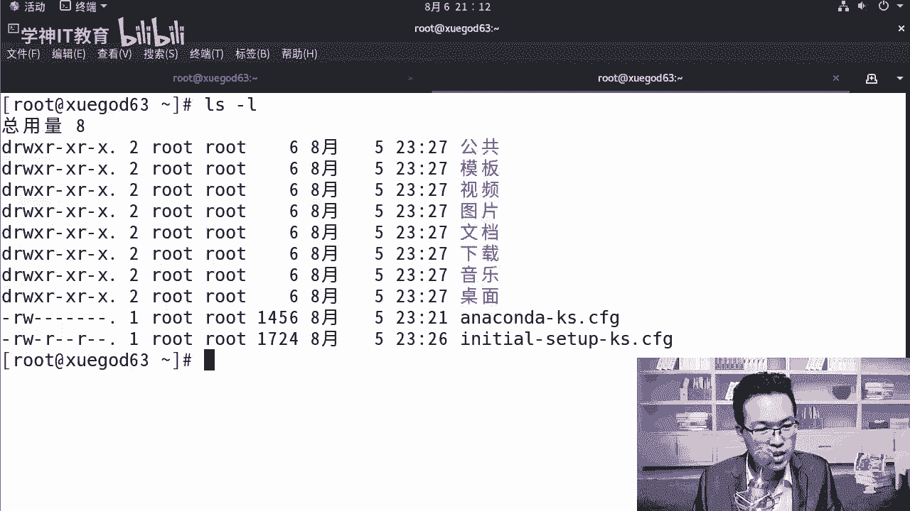
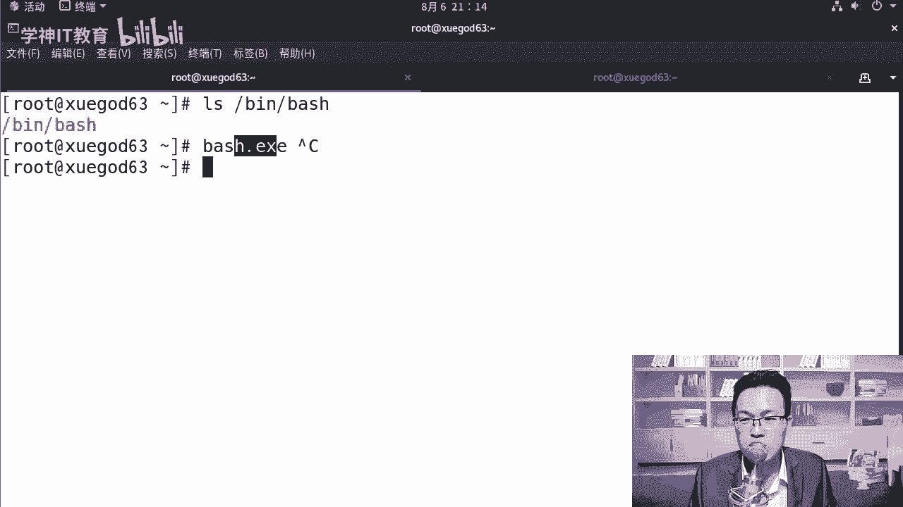
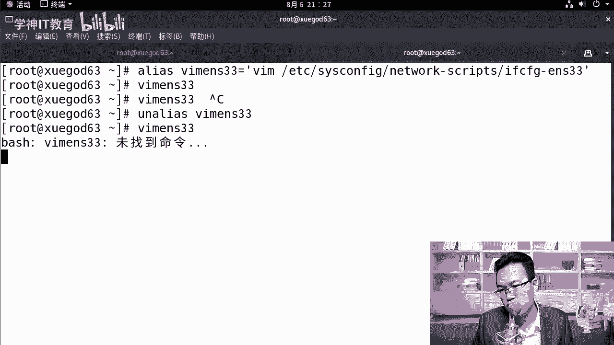
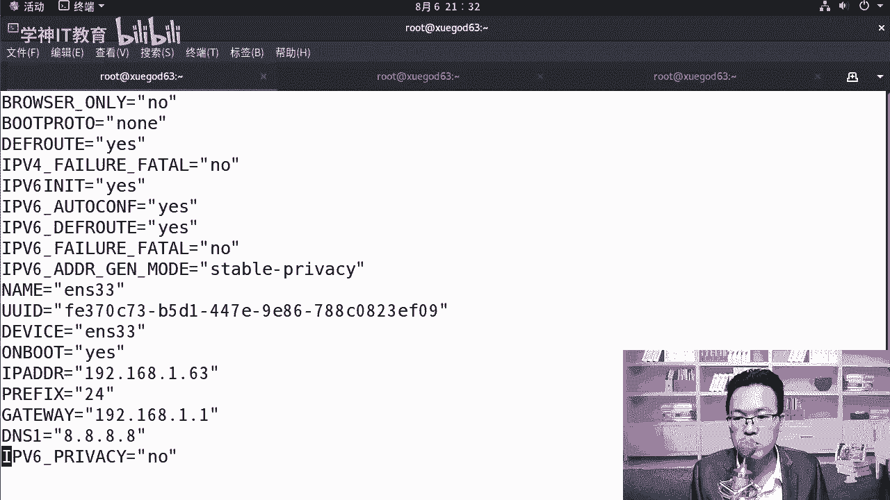
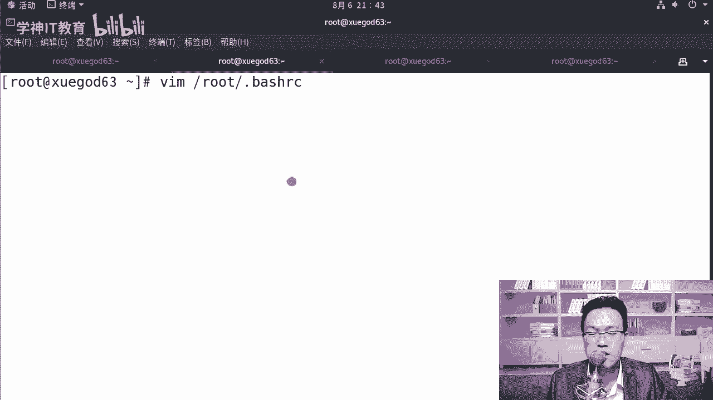
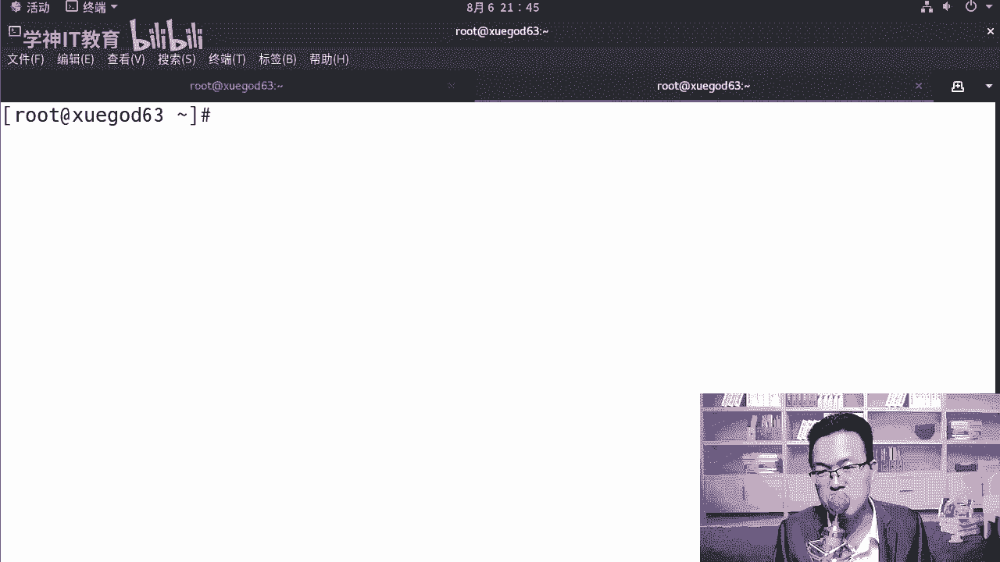
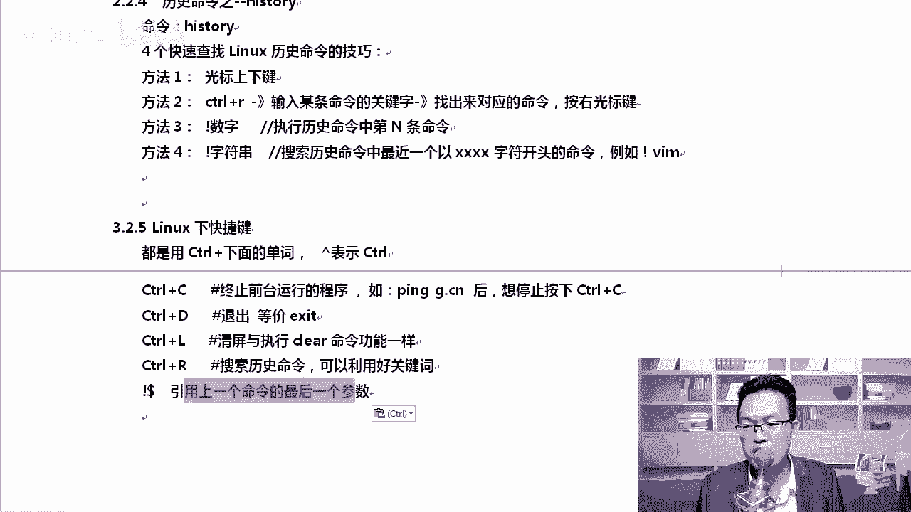

# centos8／Linux／运维／网络运维／RHCE／红帽认证云计算／2020全新独家教程-centos8操作系统从入门到精通 - P8：2-基本命令操作 - 学神科技 - BV15V411z7tK

我们来看一下第二章linux的基本命令的操作。那linux中的一个命令一般格式的话就是命令参数和选项。命令的话就是具体的命令了。hi选项比如说杠H杠A参数的话，比如说对pas做一些操作。

这都是最基本的那知道了以后呢，我们来实际演示一下。比如说第一个命令LSLS的作用是查看当前目录下有哪些文件。

啊，你比如说我们来看一下看谁呢？比如说看病下的bash好，并下bsh那。LS后面加上一个什么，加上一个文件就能看得到了。除此以外呢，你还可以怎么样呢？LS还可以加什么加杠L。😊。

这样的话可以看文件的详细信息。我们可以举个例子啊，比如说刚才这个例子，shall下shall下它下面有4个文件，我们说有4种shall是吧？实际实际上他们都代表一种，你怎么知道呢？你可以看一下LS杠L。

我们去看并下的SH。那大家可以看到这里有一个浅蓝色，然后指向的绿色，什么意思呢？意思是说我我这个东西啊，它是一个超链接，它是谁呢？它是并下的flash的一个超链接。😊，什么叫做超链接啊？叫软链接。

在linux下叫软链接。实际上它就是相当于windows下的超链接。啊，你。所以无论我们去执行哪一个都是一样的啊，包括这个地方。LS杠。L那大家可以看到USR并下的SH。也就是说我们这个地方它也是啊。

只是为什么写不一样的那就是因为不同的人喜习惯不一样啊，有的人习惯写病下的SH，有的人习惯写病下的bege。你们后期看一些脚本的时候也是一样，每个人的习惯它是不一样的啊。😮。

我把这个常见的选项给大家写上去LS后面可以跟目录，也可以跟文件啊。如果什么也不加的话，就看当前目录下的。

所以说这些linux的基本命令大家就长。怎么样常用一下就行了。

加根查看根下的杠L的话是说列出文件的详细信息，比如说可以显示文件的创建者创建的时间等等都可以。

那咱们看一下。你比如说像MK老师啊，我们执行LS杠L。那大家可以看到这个数据是吧？

那就能看到对应的详细这个信息啊。那有托你这个详细信息都是什么意思？怎么有的前面是杠D开头，有的是减号开头。😊，啊，有什么区别吗？摇有讲究啊，来咱们来看一下画一张图。😊。

在这里我们来看一下，就拿比如说这一列来说，好吧。公共什么模板，明显它就是个文件夹。那第一行这里显示的是D代表我的文件类型是一个什么？对，是一个目录啊是一个目录。然后当然第一列的有很多种类型啊，有减号的。

还有什么？除此以外，还有好多，我来先跟大家说一说D的话是目录。L的话是链接文件。B的话是块文件。C的话是字符设备文件。P的话是管道减号的话代表我是个普通用户。😊。

哪有这么多呀，有LS杠LETC下啊，DV下啊回去。那DV下大家可以看到这些文件是吧？有D的啊，有C的。😊。

我们最常见的，比如说我们的词TY终端TY终端，你看它就是CC代表的是字符设备文件，对吧？B的话就是块文件L的话就是链。

你看像这种软链接是吧，就是前面代表的是L，为什么要有这样的一个标识，大家知道吗？😡，因为在linux上，他没有什么扩展，明知说。能理解吗？比如说我们说S。就这个它的扩展名是什么？

如果在windows下是吧，一个二进制可执行的一个文件，那它可能就是besh点ESE的。😊，windows下我们更多的是看扩展名，对不对？linux，不是linux，要看你真实的这个东西。

啊，他要看你真实，你到底是一个什么样类型的。所以在这里它会有一个标识啊，有一个标识。如果是目录的还是D。😊，好，大家知道一下这一课。那再往下这一列代表的是文件的权限。文件权限这一块有几列？

RWX然后R减号WR减号X就是其实是三段，好吧，分别代表的是拥有者所属组和aller其他人对这个文件的权限。稍后关于文件权限，我们会详细去说，你在这里知道一下，还有链接数是里是4，有的是二，有的是4。

那大家有的是一，这个是应链接数。硬链接稍后我们也会去给大家说啊，大家这一节课先对linux有一些认识。这一块叫文件的所有者，那这个叫文件所属组的名字。嗯，大小自结数。这一块代表的是文件上次修改的时间。

那么这个叫文件的名字。好，我们看到这些东西以后，除此以外，大家有有没有注意到颜色其实也是不一样的。DV下。

哥几个颜色也是五颜又六色的是吧？这就是为什么我喜欢用什么？用这个白底是吧，这样看的时候清楚一些啊，那大家可以看到有浅蓝色的啊，蓝色的对吧？还有黑底黄字的，代表的都是啥东西啊？😊，啊。

你经常看到的是什么样的类型的？这个东西大家要记一下啊，浅蓝色就是目录，其实用多了自然就知道了。黑色纯黑色的，就是比如说ETCpa的这样文件。他就是纯普通文件，浅蓝色这个地方是什么？啊。

我可能没有找到这种蓝色啊，就是说的是这种这种蓝色，它代表的是一个链接文件。好不好，链接文件啊，红色的话代表的是压缩包。比如说我们布特下，我们看一下。😊。

哎，这里没有是吧，对它代表的是压缩包啊，我看grab下有没有。😊。

好，没了是吧？原来是有一个boot特点他的GZ。对应压缩包啊对应的压缩包，然后呢绿色的话是可执行的。然后黄底儿黑底黄字设备文件。对它代表的设备文件，知道这些我们怎么查的，我也给你列到这上面。

所以回去大家只要认真的做，绝对能做出来。好，看到这个以后呢，你以为这里面只有这几个文件吗？就我们刚才所列的列完全了没有？😡，有没有列完全？

没有啊。就比如说Lhome下吧，home下有个MK是吧？😊，这个MK下有东西吗？是不是空荡荡的LS直接看的时候是空荡荡的。真的啥也没有了吗？不是的，加个。减A减A的话。

这个减A符号可以怎么样加到最后也可以加到前面啊。一般情况下，我们习惯于还是把参数往前放。好把执行的被执行对象放到最后啊。😊，那LS杠A这样的话，我们能看到这里面其实好多呀。那为什么我们一开始看不到呢？

😊，嗯。😊，为什么？对，因为在linux下认为第二开头的文件就是隐藏文件。说吧。苍老师的电影再也不用来回的藏了，你直接在他的名字前面加一个点。😡，别人就看不见了。

知道吗？我记得新浪以前有一个故事。啊，有一个新来的一个运维人员。杨梦苍老师的电影好久了，当时是吧，带宽只有两兆左右。好，下一晚上下载下来，下了3个G，对不对？😊，因为我们那个时候那个带宽确实挺窄的。

不像大家现在4G手机是吧，直接高清看了。😊，那后来他在公司利用公司的贷宽的时候，就悄悄的下下了一晚上。下了一晚上大概下了50个G左右吧，悄悄的是吧，加了个点，隐藏了一下。😊，他以为这个事就是这样啊。

神不知鬼不觉，后来怎么样，后来专门有管理带宽的什么呀审计系统。哎，我们去审那个带宽的时候，突然间发现晚上两点多的时候，突然间怎么样？

突然间暴涨了。能理解吗？还以为是被谁黑了。😡，好不好？那去真正的查了一下是吧，刘样，发现是啊，都是访问的黄色网站，最终看了一下，原来是你哥们儿是吧，晚上的时候没干好事儿。😊，结果当天下午就被开除了。

这是个真实的故事啊，所以大家不要在服务器上乱搞，你也不要乱用公司的带宽去干一些怎么样坏事。杠D杠D的话只查看目录啊，不看目录里面的内容啊。

这个LS杠D，比如说看一下home或者看一下ETC。那这有什么用呢？😡，有用啊。如果你想看目录的详细信息。这样才能看，否则你不加D的话，你只看ETC，你看不了ETC，你看的是ETC下边这些东西。😊。

所以杠D这个参数是有用的，它要和杠L配合起来一起用，才能发挥出来它的威力。

O。😊，刚D目录不看，不查看里面内容啊，只主要看目录啊，我们经常看一些目录的权限大小等等。

那假如说我这里面有很多文件，我想知道哪些文件大，哪些文件小，大家知道吗？😡，记得安卓也是linux系系统，对吧？安卓也是一个lininux系统。经常嗯经常有一些什么呢？

有一些软件说我们可以清理深度清理一下你的安卓系统。他是怎么实现的？比如说当然它是通可以通过f的命令去查找啊，去各种各样的查找。如果我们自己有权限的话，其实也行。比如说我就想看一下。

有时候我就想看一下ETC。😊，好端端的ETC目录为什么？😡，被占满了啊，到底是哪些文件比较大？我想给他做个排序可以吗？可以，你可以这样LS杠什么呢？杠L。😊，L再加大S，那这样的话就可以回车。

回完车以后呢，它就可以按照文件的大小，看这，这是文件的大小啊，它可以按照文件的大小跟你进行排序。好唔好？对，可以按照这个来。如果你觉得这个名字。😊，比如说我们 boot特吧。

 boot特下的内容可能会少一点，你可以看一下，那当然这个读起来好像不好读是吧，都是自节，你想让它好读一下怎么样呢？加个H就可以了啊。😊。

好吧。在后面加一个H，这样可以可读性，会增加你的可读性，它是95兆，它是49兆。我就知道我当前目录下到底谁大谁小啊啊，我觉得这个参数也很有用。在linux啊有很多的参数，有一些参数是需要你记得住的。😊。

有一些参数是不需要的，什么样的不需要。我说你只需要了解一下他的时候就。😡，代表他不需要默认情况下，这些参数都需要记一下。那你肯定记不住啊，怎么办呢？就我说的你找个本儿找个笔。😡，记一下啊，往本上写一下。

写的过程中你不用写那么细，你就写杠S。😡，就可以了。啊，减号S就行了。然后等你把我的视频关了以后，打开你的本，你回顾一下哦，杠S是什么呢？忘了。😊，忘了那个时候是吧，再网上补充一下。方便自己去记啊。

我也是这样过来的。我记得MK我我那时候学linux的时候，我让大家大家人手一个。😊。

啊，智能手机我没有说没有什么智能手机。😡，对吧电脑的话。嗯，在公交车上也不好，那我就买1个MP4，你知道吧？😡，对，里边放上曹老师的电影是吧？在公交车上看一看，不是啊，我就会放我也会放一些教室教程。

然后我在公交车上是吧，边听边看，再或者就是早上上班的时候。😊，呃，拿着我的本儿，我就开始是吧，一样一样翻。那个时候是你进步最快的时候。大家知道吗？就搞IT这个行业。😡，你大学刚毕业的第一年到第三年。

是你知识积累数量是最快的时候。所以大家一定要把握好这个黄金时期。多学点技术啊。MK我记得我。😊，刚到北京的时候，三年以内我没有去过天安门，我也没有去过什么颐和园，所有的周末是吧都是用来学习的，真的。😡。

所以你们也一样啊，你们也要加把劲儿。后面就轻松了。想去哪就可以去哪了。LS杠L和LL这两个命令是等价的，是什么意思呢？看着。

ETC下的password。查看这个文件的详细信息和LLLS杠L。ETC下的pas的这两个都是一样的，大家看到了吗？对，他们是一样的，显示的内容都一样。那。😊，那两者有什么区别呢？凭啥都一样呢？

还记得我给大家说一个吗？type。type LL你可以看一下。你去拿type去查看它的时候，他告诉你LL是LS杠L的一。包含后面这个参数啊，color凹 to自动加颜色是它的别名。看到了吧？

对他是一个别名，那什么叫做别名呢？

嗯，别名是怎么用的，我们来总结一下。L查看。LS杠L查看都一样，type去看它是一个别名，别名怎么用，我们如何定义一个别名，别名可以通过allias的方式来定。

啊，alless的方式来定义。比如说。VM这个命令挺长的，或者说我们VM打开什么呢？打开网卡的配置文件，这个命命令参数也挺长的那你可以这样写啊，al VMENS33，然后呢等号后面跟上单引号。

单引号后面要加好多命令，你给它扩一下，写上VM空格ETC下s configurefi按table补齐。😊，坏事了，补不齐啊，补不齐怎么办呢？教你一招啊，可以这样VM你在这里敲C这种情况下是可以的啊。

s configurefi。😊，好不，然后network script。ENS你可以不，你看我敲到这的时候，啪就出来了。我说怎么实现的？摁它又补齐的。😡，好吧，这种命令很长的情况下，你要照着一个一个敲。

绝对会敲错。当然如果大家是初学者，我建议你自己手动一个一个字母敲，你先不用table。😡，啊，老司机我早就记清楚每一个单词了。前期的话大家自己手动多敲一下，你可以怎么用呢？在终端里面是吧，可以这样。

你把它选中一下。😊，好，当然你可以选中，然后点复制，然后再点到这边再点粘贴，实际上不用啊，你选中默认就代表复制了。选中它以后。

当我们这个地方怎么粘贴呢？按下光标好，摁下鼠标的。滚轮。哎，就可以了。啊，按一下鼠标的滚轮，就直接可以把你选中的那种粘过来，非常的方便。回车。😊，这样有什么好处呢？当我们下一次执行。😊。

记住都有快捷键了吗？你想粘什么内容，你把它选中一下，选中完了以后我就在这里吧，选中完了以后，摁下鼠标滚轮直接粘上来了，这个挺好用的啊。😡，挺好用的。然后呢。呃。

这个方法你知道了以后我们来说VM快als快捷键。看到了吗？这就。别名的话就是主要有一个命令很长很长，你想给它缩短。😡，起一个另外一个代号的意思。那我想查看这个别名怎么办呢？或者你想删掉一个别名。好吧。

删的时候是这样。嗯好嗯。对，安al安al斯是吧，后面就可以了，我想把它给干掉。那这样的话，你再次去执行就不行了。

就找不到了。好，我们是怎么定义的？我在这这里给大家写清楚啊。😊，大家可以看到定义别名，认真听啊，听MK老师的课程，同样的时间你能学两遍。😊，知道吗？我会先给你演示，你赶紧记演示完了以后。

当我去总结这个笔记的时候，你应该把脑子快速旋转起来，再记忆一遍。😡，这是聪明的选手。你想想同样都是两个小时，凭什么他学完以后挣15000，你学完以后只挣5000。😡。

凭的就是人家每一节课都比你学习的效率高。这样了吧？所以你要加把劲儿啊，在我总结的时候，你要快速的让自己要有紧迫感。😡，让身边的美女是吧，让你媳妇儿，让你对象都靠一边，告诉他，你现在要学习啊。😡，知道吧？

拿个本拿个笔，别让他打扰你啊，哪怕媳妇刚洗了澡喊你，你都别啊，你就别答应，好不好？😡，有对象没有吗。😊，我们来看一下，设置一下永久别名。其实前面这种别名都是临时的，一旦我们重新启动系统就没戏了。

你想设置永久别名，可以这样去执行啊。

加到一个地方ETC下啊，VM打开谁呢？打开rootroot下有一个叫bsh，好吧，其实有好几好几个啊bsh，你比如bsh historyory。😊，它是从我们历史记录命令的。然后呢。

我们看一下profi和bsh RRC，这两个都可以加。那我们可以打开VM打开besh点2RC，我们在这下面去添加就可以了。把这个别名粘过来，好吧，我不想再粘一遍了啊。😊。

那同样这个地方大家也可以。如果说大家照着我的笔记去粘的时候，比如说你照着我的笔记，你也可以，你把它复制一下，摁一下ctrl C复制复制完了以后呢，在这里。

啊，在这里摁下什么，先摁下I进入这个插入模式啊，然后摁下光标。光按下鼠标的滚轮，你就可以把复制的那一段粘过来了，粘过来以后摁下ESC。然后输入冒号，然后输入WQ保存看这下面啊。

这是VM的使用VM使怎么使的？VM回车回完车以后呢。😡，现在是一个正常模式，然后呢，你需要摁下I，摁下I就会进入这种插入模式，也叫编辑模式。好吧，你就可以按光标键是吧，进行任意何操作了。

改完以后摁下ELC，否则你一直在插入模式啊，摁下ELC，然后呢。😊，没有插入了以后输入冒号，然后输入WQ保存退出，先知道一下这个操作。好吧，拿到它以后，怎么让我生效呢？

可以执行s source一下root下的bech RRC。那这样的话我们就可以了啊。啊，他告诉你什么。点b是RC没找到是吧？重新稍拾一下啊。好，我看一下是什么情况。root下的be是RC。没问题啊。

那我这样啊，我重新打开一个终端也是可以的啊。告诉我点半是2C没找到。我来看一下他的情况啊。我们可以。😊，VM rootot下的Y是RC。好，我先上量他啊哦，我知道了。😊，这谁在上面加了一个这样的？

点败是2C，这应该是我刚才自己一不小心加上去的啊。😡，知道吧？你看现在就没有问题了啊，我们再s一下sce。😊，我说。你看这样就没有问题了。好。VM打开一下啊。打开。打开以后呢，重新插入一下啊。

重新插入这一条。

别名。保存退出，然后呢，你想执行的话，你就ss完了以后，VMinS33或者inS160都可以。你看这样的话，我就可以打开了。

有同学为什么你的是NS160还能执行呢？因为我这下面写的是ES33。你的网卡的名字如果是ES160，你记得改一下这块的地址。好，你别写ENS33，那肯定打不开的。这叫永久保留这个别名，清楚了吧？

那当然我这个是什么？是对当前用户的，我当前是root，我就改root。如果我想对所有的用户都生效。不，你像LL这个别名肯定是对所有用户都生效了。哪怕你是个普通用户，那这个时候你要对全局用户设置永久别名。

就是让任何人都可以使用你创建的别名。那你需要改的是谁呢？改的是这个东西。

ETC下的bash。好吧，LC打开它，打开它在它的最后。😊，好吧，光标调到最后啊，其实你直接摁大写的G也能调到最后。然后它以后呢，我们再次去插入一下这个别名。😊，这样的普通用户也能执行了。好。

保存退出冒号WQ保存退出啊，保存退出了以后呢，我们来切一下。比如说我们这个时候切一下，切到MK身份。回车VMENS160。一样可以使用。看到了吧？这个退出的时候怎么退啊？😡，回去。输入冒号以后。

EIC摁一下冒号，然后输入Q就退出了。

好，这叫永久。后期大家对这两个。地方是吧去调整你自己需要的东西就可以了啊。其实我们还可以调整什么呢？😊。

我来跟大家说一下啊，我在这里我一直用的是root下baRC是吧？大家有没有发现还有一个bepro？对，这个也一样也他也可以。带是下划线的profi。他也是可以的，好吧，你在这里面去添加一些。

一样是可以的。比如说我们在这里它定义了，经常会在这里面定义一些环境变量。我把我的alliaance写到这里面也是一样是可以的。为什么写到一样是可以呢？因为它会被执行的。😊，好不好？

这些文件比如说我们写eleAA输出AA保存退出。当我们打开一个新的终端的时候，你会发现。哎，他没有输出是吧，但是他会被执行的啊。来，也就是说这几个文件它都可以root下的bRC。好不，还有谁呢？

还有ETC下的profi。😊，好吧，那么ETC下的。呃，拜lash。无非不一样的就是什么呢？就是这两个地方是什么全局啊，这块是用户自己的。明白了吧？这四个文件都可以添加，但是一般情况下。

我们添加的是be2RC会多一些。环境变量的话呃，修改pas相关的，我们会填到profi里面啊。😊。

好，大家知道一下这一块。接下来我们再聊一个基本命令，就是CD命令。好吧，CD去切换加目录。其实刚才我已经用了它的语法呢，其实挺简单的，就是CD后面跟上目录，你随便切就行了。😊。

我来举个例子啊。比如说我们CDETC下ss configurefi。Let's work。你别看我敲这么快啊，你敲的多了，你也可以这么快。😡，好吧，这就OK了。那我问大家一个问题。😊，CD拨号是啥意思？

嗯，你不知道是吧，你可以看一下PWD显示一下当前路径。CD波浪号波浪号代表的是用户的加目录。啊，代表的用户加务，然后CD点点。😊，对吧。CD点是什么？代表是上一级目录。

如的用户的上一级目录就是根呢啊就是跟CD点呢一个点。😊，有点代表的是当前路径。啊，当前路径还有一个是，比如说我们CDETC says configurefi network敲了一下。是吧敲完以后呢。

我又敲了个CD减号，什么意思？😊，C力减号的话，我给你写到这上面，让大家看一下啊。😊。

这几种用法大家都要会啊，因为我们在命令行下会经常切。CD后面跟对应的目目录是能切到对应的目录下。那么CD如果什么也不输，或者输1个CD拨号，都代表是切回到当前用户所在的加目录，也叫宿主目录。一个意思。

每个用户都有自己的一个加目录啊。PWD的话是查看当前的路径，CD点点返回目录的上一级好不好？经常我们去做一些相对路径操作的时候，会用到它。那你可以如果你实在不知道你在哪个路径下，你PWD查一下就行。😊。

啊，再往下CD点是进入当前目录。然后呢。减号减号表示返回。切换前的目录。你看我们当时切换，当时我们是从根下是吧，根切换到哪呢？切换到了这个目录下。😮，我现在就在这个目录下，我不想在这个目录下了。

我想切换到根，你就直接这样去切就行了。😊，同样啊，我现在是在跟下，我想。😊。

怎么样我想再切到这个路径下，那你直接CD减号，你看就一下子就到这个路径下了。是不是这样就省了很多事。😊，还是很方便的啊。

那大家要知道这是关于CD命令，还有一个小命令啊，我们就可以休息会儿了。😊，还有一个小秘密叫history啊，history主要是看历史记录的。😊。

快速查找历史，你有几种方法？

这个很重要啊，因为我有时候我们的命令，首先黑二位直接回撤。那这些东西在哪儿呢？😊，你想想你能看到这些历史记录，其实这些历史记录都在这下面。但sh。呃。下划线history打开。好吧，唉。

有同学你这好像没有啊，只有这两个东西啊，还没有保存到这里面。一旦当我们reboot重新启动以后，它就会将我们的history所有的记录是吧？保存到你用户的加目录的这个路径下。😊，他会给你保存是这样的。

你像因为你像我这个系统是刚装完的嘛，上次距离我上次关机的时候，我是不是只执行了个拼百度，拼完以后就关机了，它就会给你记录到这。所以有一天如果你入侵了对方的电脑以后，你一定要把这些删掉，可以吗？可以的。

或者你在执行INT0之前是吧？执行一下什么呢？执行一下history杠C。😊，如果我们执行了hisory杠C的话，那原有的历史记录就会被清掉。😊。

好吧，这个清的只是我这一次终端上的这些命令会被清掉，原来的是不会被清掉。原来的想清掉的话，那你就等于怎么样改它这个文件了啊。😊。

改谁呢？改ET改我们。用户的这个beash下划线histtory改他的，把这里面的东西都删掉。知道吧？好，知道以后呢。😊，怎么查找历史，我得找个命令多的地方啊，每个终端它是不一样的啊，看到了吗？😡。

看一下。首先，光标方法一好吧，四种方法必须都会啊，光标键可以上下去翻。比如说我想翻一翻。😊。

比如说我想翻到这一条命令上，或者我想翻到这一块命令上。好吧，你可以上下去翻。

第二种方法是ctrol加加加R，然后输入某条命令的关键字，找出对应的命令，按下右光标键，这个方法非常有效。我建议所有人都掌握一下。啊，这个方向非常有效。比如说。😊。

我执行的黑色率，我看一下有哪个，比如说alele这个命令很长呀，我就想快速调出调上它。如果你翻的话，你得翻好长一段时间才能翻到它好不好？有一种方法是这样，contrl加R。😊，然后呢，你随便写。

比如说我就记住al了，或者你就记住VM了都可以。我就记住alas了，那你就写als。😊，清楚了吧。OKal，然后当然你看它的al优先匹配的是这个，为什么呢？因为我们从下往上匹配。

al第一次匹配到是这个地方。😊，记楚了吧，所以这样的话肯定是搜不到的那他搜的时候也是按关键字的啊，那我可以搜一下，比如说我就记住什么呢？😊，s configure了。

那你就可以写s configure看到了吧？我只输入了个SYS，当然它匹配的也也是从下往上匹配啊。😊，因为从上往下比SY。S它是直接就能匹配出来，看到了这个是咱们学校要的命令，摁下右光标键，这就完美了。

完美了以后啪回撤。这种方式就快很多啊。看到这个命令了吗？阿斯这个地方。

好。这种方法再就是感叹号加数字，它可以执行历史命令中第N条记录。

那我觉得这个是最不太靠谱啊，万一我敲错了呢。😡，是吧。假如说前面是这样，就第48，那你可以输入什么感叹号48。

那输入感t叹号48就相当于执行了这个命令。

对吧还有一种是什么呢？还有一种是这样的。😊，感叹号加数字感叹号加数字的话就是搜索怎么样，搜索历史命令中最近的以什么什么开头的。比如说感叹号VM。😊。

那我也不知道。😡。

你知道接下来执行什么命令吗？是不是你也不知道。除非你在黑ory，我逾期我都能黑istory的时候，我还敲什么呀？我干脆把它啪一复制往上一粘不就行了吗？😡，这样更快了。所以这里面。光标键上下移动是有效的。

然后cttrol加。R。这个。是什么？是最最靠谱的。因为你能看到你即将执行的这一条命令是你的那你就回车就行。敲的时候敲什么，敲别的命令不具备的，好吧，你可以敲VM关键字也可以敲什么点bash。😊。

都行啊。敲这样的就行。好，这是四种方法。除了这四种方法，还有一些关键字，大家快捷键大家也需要知道一下。control加。加什么呢？首先这个地方。向上的三角符号代表在linux命令里面代表的是。

ctrorl键啊。我们来说一说这几个键。control加C。终止前台命令运行。比如说我们拼一下G点C音，拼钱没完了，看到了吗？

好吧。回去了。等等他啊，多拼几次。第一次解析这个域名，它稍微有点慢啊。你也可以直接选择拼百度啊。稍微快一些。是吧。那拼钱不像windows下拼4次是吧，就结束了。咱们这个拼钱停不了。

那你ctrl C结束它。😊。

必须得会contrl D的话等价于什么ESIT比如说我们在这里啊，我们摁下一个什么呢？

嗯，control D。这个终端就退出了，看到了吗？有的时没看清是吧？你看我现在有几个，现在是三个是吧，我摁一下ctl D。😊，那只有两个终断了。好冇。

controrl加L是清屏，这是我经常用的。我讲课的时候。

轻轻轻清到最后了，最下边我想清一下屏cttrorl加L。那这样的话就清屏。

cttrol加2是查找，这个大家都知道啊，还有一个是。感叹号到了，后期我也经常会用这个命令，引用上一个命令的最后一个参数。

请看。比如说我cat去查看ca是查看啊，查看一个文件。😊，house，我看了一下house，那我执行VIM感叹号doller，你知道代表的是什么意思吗？先看一下效果。😡。

就相当于我VM打开了ETC hostt了，那退出一下啊。看一下VM感叹号do了就相当于执行了VMETCho。那么感叹号doer代表的是上一个命令最后一个参数，我们也经常使用它。

我们也经常用这个命令。😊，补全命令用的是table，table只能补全命令和文件路径啊。

只能补补齐这一块啊，不是所有东西都能补齐的。有同学老师我。😡。

比如L杠L。来table补吧，补不了啊，你想加什么参数，你自己写。😊。

他补不了。这是关于基本命令相关的内容。

我们先到这里。