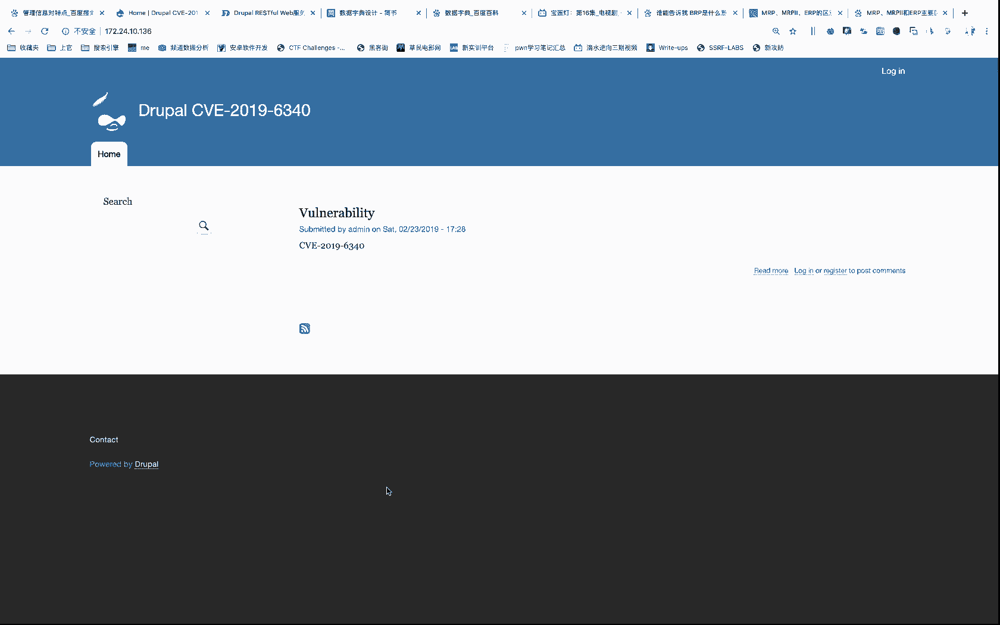
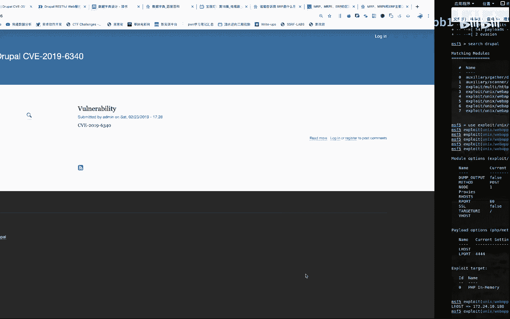

# cve-2019-6340复现 - P1：Drupal-cve-2019-6340 - Ambb1 - BV1FJ411P7Db

给大家复现1个CVE啊，CVE201963401个抓pa的一个漏洞。那么我们首先呢嗯把这个环境呢已经已经搭建完毕了。那我们准备一个攻击机呢是卡利。那这个呢要嗯我们使用的呢是这个嗯MSF啊。

MSF的一个呃一个攻击攻具框架。那么我们呢呃首先看一下我们本机IP是172。24。1。180。那我们打开MSF。看cer。好，那这个呢一定要使用这个最新版的啊，这个5的是5。0。24啊，5。0。24。

然后呢我们嗯 search一下SEA。2CH啊DUR。DRUPAAL。

啊，那我们使用哪个呢？我们来看一下啊。我们使用这个啊使用这个模块。好，我们使用这个这个模块啊这个模块那我们呢就使用它复制。因为你看它是2019年2月的嘛，对吧？2月包出来的又ose。然后我们需要一下。

啊，需要配置之后呢，你我们可以看到要嗯嗯我们的本机IP对吧？本机IP那么sL host。172。2424点10点180。那还需要什么呢？还需要are house的那我们给它设置一个r house在的。

2号。172。24点10。136啊，这个地址就是什么呢？就是这个我们的地址啊，这个地址。

好，那这个时候呢我们看一下还需要设置什么部分。啊，需要配置一下啊，都设置成功了啊，都设置成功了啊，那么目标端口呢是802端口，对吧？802端口，那我们呢进行一个工具EXP。好，反弹sha呢已经成功了啊。

那我们写个sha看一下。ID。外卖。好，把攻击成功啊。给大家复现一下啊，谢谢大家，再见。😊。